================================================================================
SOURCE: src/extraction/local-docs/lgoto/docs/authorization/validate-access-tokens/README.mdx
================================================================================

---
sidebar_position: 6
sidebar_label: Validate access tokens in API
---


# How to validate access tokens in your API service or backend

Validating access tokens is a critical part of enforcing [role-based access control (RBAC)](/authorization/role-based-access-control) in Logto. This guide walks you through verifying Logto-issued JWTs in your backend/API, checking for signature, issuer, audience, expiration, permissions (scopes), and organization context.

## Before you start \{#before-you-start}

- This guide assumes you are familiar with Logto’s RBAC concepts.
- If you are protecting API resources, this guide assumes you have gone through the [Protect global API resources](/authorization/global-api-resources) guide.
- If you are protecting in-app features or workflows (non-API permissions), this guide assumes you have gone through the [Protect organization (non-API) permissions](/authorization/organization-permissions) guide.
- If you are protecting organization-level API resources, this guide assumes you have gone through the [Protect organization-level API resources](/authorization/organization-level-api-resources) guide.

## Step 1: Initialize constants and utilities \{#step-1-initialize-constants-and-utilities}


## Step 2: Retrieve info about your Logto tenant \{#step-2-retrieve-info-about-your-logto-tenant}


## Step 3: Validate the token and permissions \{#step-3-validate-the-token-and-permissions}


### Add the validation logic \{#add-the-validation-logic}


## Step 4: Apply middleware to your API \{#step-4-apply-middleware-to-your-api}

Apply the middleware your protected API routes.


## Step 5: Test your implementation \{#step-5-test-your-implementation}


## Related resources \{#related-resources}


================================================================================
SOURCE: src/extraction/local-docs/lgoto/docs/authorization/fragments/_organization-token-warning.md
================================================================================

:::warning
At the moment, Logto does not support fetching organization tokens directly from the authorization code flow. You will need to use the refresh token flow to obtain an organization token.
:::


================================================================================
SOURCE: src/extraction/local-docs/lgoto/docs/authorization/fragments/_inspect-organization-claim.md
================================================================================

:::note
Inspect the `organizations` claim in the ID token to get a list of organization IDs the user belongs to. This claim lists all organizations the user is a member of, making it easy to enumerate or switch organizations in your app.
:::


================================================================================
SOURCE: src/extraction/local-docs/lgoto/docs/authorization/validate-access-tokens/ruby/_add-validation-logic.mdx
================================================================================


  rails: <RailsValidation />,
  sinatra: <SinatraValidation />,
  grape: <GrapeValidation />,
});

We use the [jwt](https://github.com/jwt/ruby-jwt) gem to validate JWTs. Add it to your Gemfile:

```ruby title="Gemfile"
gem 'jwt'
# net-http is part of Ruby standard library since Ruby 2.7, no need to add explicitly
```

Then run:

```bash
bundle install
```

First, add these shared utilities to handle JWKS and token validation:

```ruby title="jwt_validator.rb"
require 'jwt'
require 'net/http'
require 'json'

class JwtValidator
  include AuthHelpers

  def self.fetch_jwks
    @jwks ||= begin
      uri = URI(AuthConstants::JWKS_URI)
      response = Net::HTTP.get_response(uri)
      raise AuthorizationError.new('Failed to fetch JWKS', 401) unless response.is_a?(Net::HTTPSuccess)

      jwks_data = JSON.parse(response.body)
      JWT::JWK::Set.new(jwks_data)
    end
  end

  def self.validate_jwt(token)
    jwks = fetch_jwks

    # Let JWT library handle algorithm detection from JWKS
    decoded_token = JWT.decode(token, nil, true, {
      iss: AuthConstants::ISSUER,
      verify_iss: true,
      verify_aud: false, # We'll verify audience manually based on permission model
      jwks: jwks
    })[0]

    verify_payload(decoded_token)
    decoded_token
  end

  def self.create_auth_info(payload)
    scopes = payload['scope']&.split(' ') || []
    audience = payload['aud'] || []

    AuthInfo.new(
      payload['sub'],
      payload['client_id'],
      payload['organization_id'],
      scopes,
      audience
    )
  end

  def self.verify_payload(payload)
    # Implement your verification logic here based on permission model
    # This will be shown in the permission models section below
  end
end
```

Then, implement the middleware to verify the access token:

{props.framework
? frameworkContent[props.framework]
:

  ))}
}

According to your permission model, implement the appropriate verification logic in `JwtValidator`:


================================================================================
SOURCE: src/extraction/local-docs/lgoto/docs/authorization/validate-access-tokens/ruby/_init.mdx
================================================================================

```ruby title="auth_constants.rb"
module AuthConstants
  JWKS_URI = 'https://your-tenant.logto.app/oidc/jwks'
  ISSUER = 'https://your-tenant.logto.app/oidc'
end
```

```ruby title="auth_info.rb"
class AuthInfo
  attr_accessor :sub, :client_id, :organization_id, :scopes, :audience

  def initialize(sub, client_id = nil, organization_id = nil, scopes = [], audience = [])
    @sub = sub
    @client_id = client_id
    @organization_id = organization_id
    @scopes = scopes
    @audience = audience
  end

  def to_h
    {
      sub: @sub,
      client_id: @client_id,
      organization_id: @organization_id,
      scopes: @scopes,
      audience: @audience
    }
  end
end
```

```ruby title="authorization_error.rb"
class AuthorizationError < StandardError
  attr_reader :status

  def initialize(message, status = 403)
    super(message)
    @status = status
  end
end
```

```ruby title="auth_helpers.rb"
module AuthHelpers
  def extract_bearer_token(request)
    authorization = request.headers['Authorization']

    raise AuthorizationError.new('Authorization header is missing', 401) unless authorization
    raise AuthorizationError.new('Authorization header must start with "Bearer "', 401) unless authorization.start_with?('Bearer ')

    authorization[7..-1] # Remove 'Bearer ' prefix
  end
end
```


================================================================================
SOURCE: src/extraction/local-docs/lgoto/docs/authorization/validate-access-tokens/ruby/_apply-middleware.mdx
================================================================================


================================================================================
SOURCE: src/extraction/local-docs/lgoto/docs/authorization/validate-access-tokens/nodejs/_add-validation-logic.mdx
================================================================================


  express: <ExpressValidation />,
  fastify: <FastifyValidation />,
  hapi: <HapiValidation />,
  koa: <KoaValidation />,
  nestjs: <NestJsValidation />,
});

We use [jose](https://github.com/panva/jose) in this example to validate the JWT. Install it if you haven't already:

```bash
npm install jose
```

Or use your preferred package manager (e.g., `pnpm` or `yarn`).

First, add these shared utilities to handle JWT validation:

```ts title="jwt-validator.ts"

const jwks = createRemoteJWKSet(new URL(JWKS_URI));

  const { payload } = await jwtVerify(token, jwks, {
    issuer: ISSUER,
  });

  verifyPayload(payload);
  return payload;
}

  const scopes = (payload.scope as string)?.split(' ') ?? [];
  const audience = Array.isArray(payload.aud) ? payload.aud : payload.aud ? [payload.aud] : [];

  return new AuthInfo(
    payload.sub!,
    payload.client_id as string,
    payload.organization_id as string,
    scopes,
    audience
  );
}

function verifyPayload(payload: JWTPayload): void {
  // Implement your verification logic here based on permission model
  // This will be shown in the permission models section below
}
```

Then, implement the middleware to verify the access token:

{props.framework
? frameworkContent[props.framework]
:

  ))}
}

According to your permission model, implement the appropriate verification logic in `jwt-validator.ts`:


================================================================================
SOURCE: src/extraction/local-docs/lgoto/docs/authorization/validate-access-tokens/nodejs/_init.mdx
================================================================================

```ts title="auth-middleware.ts"

const JWKS_URI = 'https://your-tenant.logto.app/oidc/jwks';
const ISSUER = 'https://your-tenant.logto.app/oidc';

  constructor(
    public sub: string,
    public clientId?: string,
    public organizationId?: string,
    public scopes: string[] = [],
    public audience: string[] = []
  ) {}
}

  name = 'AuthorizationError';
  constructor(
    message: string,
    public status = 403
  ) {
    super(message);
  }
}

  const bearerPrefix = 'Bearer ';

  if (!authorization) {
    throw new AuthorizationError('Authorization header is missing', 401);
  }

  if (!authorization.startsWith(bearerPrefix)) {
    throw new AuthorizationError(`Authorization header must start with "${bearerPrefix}"`, 401);
  }

  return authorization.slice(bearerPrefix.length);
}
```


================================================================================
SOURCE: src/extraction/local-docs/lgoto/docs/authorization/validate-access-tokens/nodejs/_apply-middleware.mdx
================================================================================


================================================================================
SOURCE: src/extraction/local-docs/lgoto/docs/authorization/validate-access-tokens/java/_add-validation-logic.mdx
================================================================================


  'spring-boot': <SpringBootValidation />,
  quarkus: <QuarkusValidation />,
  micronaut: <MicronautValidation />,
  'vertx-web': <VertxValidation />,
});

We use different JWT libraries depending on the framework. Install the required dependencies:

{props.framework
? frameworkContent[props.framework]
:

  ))}
}

According to your permission model, implement the appropriate verification logic:


The helper methods for extracting claims are framework-specific. See the implementation details in the framework-specific validation files above.


================================================================================
SOURCE: src/extraction/local-docs/lgoto/docs/authorization/validate-access-tokens/java/_init.mdx
================================================================================

```java title="AuthorizationException.java"
public class AuthorizationException extends RuntimeException {
    private final int statusCode;

    public AuthorizationException(String message) {
        this(message, 403); // Default to 403 Forbidden
    }

    public AuthorizationException(String message, int statusCode) {
        super(message);
        this.statusCode = statusCode;
    }

    public int getStatusCode() {
        return statusCode;
    }
}
```


================================================================================
SOURCE: src/extraction/local-docs/lgoto/docs/authorization/validate-access-tokens/java/_apply-middleware.mdx
================================================================================


================================================================================
SOURCE: src/extraction/local-docs/lgoto/docs/authorization/validate-access-tokens/python/_add-validation-logic.mdx
================================================================================


  fastapi: <FastApiValidation />,
  flask: <FlaskValidation />,
  django: <DjangoValidation />,
  'django-rest': <DjangoRestValidation />,
});

We use [PyJWT](https://github.com/jpadilla/pyjwt) to validate JWTs. Install it if you haven't already:

```bash
pip install pyjwt[crypto]
```

First, add these shared utilities to handle JWT validation:

```py title="jwt_validator.py"
from jwt import PyJWKClient
from typing import Dict, Any
from auth_middleware import AuthInfo, AuthorizationError, JWKS_URI, ISSUER

jwks_client = PyJWKClient(JWKS_URI)

def validate_jwt(token: str) -> Dict[str, Any]:
    """Validate JWT and return payload"""
    try:
        signing_key = jwks_client.get_signing_key_from_jwt(token)

        payload = jwt.decode(
            token,
            signing_key.key,
            algorithms=['RS256'],
            issuer=ISSUER,
            options={'verify_aud': False}  # We'll verify audience manually
        )

        verify_payload(payload)
        return payload

    except jwt.InvalidTokenError as e:
        raise AuthorizationError(f'Invalid token: {str(e)}', 401)
    except Exception as e:
        raise AuthorizationError(f'Token validation failed: {str(e)}', 401)

def create_auth_info(payload: Dict[str, Any]) -> AuthInfo:
    """Create AuthInfo from JWT payload"""
    scopes = payload.get('scope', '').split(' ') if payload.get('scope') else []
    audience = payload.get('aud', [])
    if isinstance(audience, str):
        audience = [audience]

    return AuthInfo(
        sub=payload.get('sub'),
        client_id=payload.get('client_id'),
        organization_id=payload.get('organization_id'),
        scopes=scopes,
        audience=audience
    )

def verify_payload(payload: Dict[str, Any]) -> None:
    """Verify payload based on permission model"""
    # Implement your verification logic here based on permission model
    # This will be shown in the permission models section below
    pass
```

Then, implement the middleware to verify the access token:

{props.framework
? frameworkContent[props.framework]
:

  ))}
}

According to your permission model, implement the appropriate verification logic in `jwt_validator.py`:


================================================================================
SOURCE: src/extraction/local-docs/lgoto/docs/authorization/validate-access-tokens/python/_init.mdx
================================================================================

```py title="auth_middleware.py"
JWKS_URI = 'https://your-tenant.logto.app/oidc/jwks'
ISSUER = 'https://your-tenant.logto.app/oidc'

class AuthInfo:
    def __init__(self, sub: str, client_id: str = None, organization_id: str = None,
                 scopes: list = None, audience: list = None):
        self.sub = sub
        self.client_id = client_id
        self.organization_id = organization_id
        self.scopes = scopes or []
        self.audience = audience or []

    def to_dict(self):
        return {
            'sub': self.sub,
            'client_id': self.client_id,
            'organization_id': self.organization_id,
            'scopes': self.scopes,
            'audience': self.audience
        }

class AuthorizationError(Exception):
    def __init__(self, message: str, status: int = 403):
        self.message = message
        self.status = status
        super().__init__(self.message)

def extract_bearer_token_from_headers(headers: dict) -> str:
    """
    Extract bearer token from HTTP headers.

    Note: FastAPI and Django REST Framework have built-in token extraction,
    so this function is primarily for Flask and other frameworks.
    """
    authorization = headers.get('authorization') or headers.get('Authorization')

    if not authorization:
        raise AuthorizationError('Authorization header is missing', 401)

    if not authorization.startswith('Bearer '):
        raise AuthorizationError('Authorization header must start with "Bearer "', 401)

    return authorization[7:]  # Remove 'Bearer ' prefix
```


================================================================================
SOURCE: src/extraction/local-docs/lgoto/docs/authorization/validate-access-tokens/python/_apply-middleware.mdx
================================================================================


================================================================================
SOURCE: src/extraction/local-docs/lgoto/docs/authorization/validate-access-tokens/dotnet/_add-validation-logic.mdx
================================================================================


Add the required NuGet package for JWT authentication:

```xml
```

Create a validation service to handle token validation:

```csharp title="JwtValidationService.cs"
using System.Security.Claims;
using Microsoft.AspNetCore.Authentication.JwtBearer;
using YourApiNamespace.Exceptions;

namespace YourApiNamespace.Services
{
    public interface IJwtValidationService
    {
        Task ValidateTokenAsync(TokenValidatedContext context);
    }

    public class JwtValidationService : IJwtValidationService
    {
        public async Task ValidateTokenAsync(TokenValidatedContext context)
        {
            var principal = context.Principal!;

            try
            {
                // Add your validation logic here based on permission model
                ValidatePayload(principal);
            }
            catch (AuthorizationException)
            {
                throw; // Re-throw authorization exceptions
            }
            catch (Exception ex)
            {
                throw new AuthorizationException($"Token validation failed: {ex.Message}", 401);
            }
        }

        private void ValidatePayload(ClaimsPrincipal principal)
        {
            // Implement your verification logic here based on permission model
            // This will be shown in the permission models section below
        }
    }
}
```

Configure JWT authentication in your `Program.cs`:

```csharp title="Program.cs"
using Microsoft.AspNetCore.Authentication.JwtBearer;
using Microsoft.IdentityModel.Tokens;
using YourApiNamespace.Services;
using YourApiNamespace.Exceptions;

var builder = WebApplication.CreateBuilder(args);

// Add services to the container
builder.Services.AddControllers();
builder.Services.AddScoped<IJwtValidationService, JwtValidationService>();

// Configure JWT authentication
builder.Services.AddAuthentication(JwtBearerDefaults.AuthenticationScheme)
    .AddJwtBearer(options =>
    {
        options.Authority = AuthConstants.Issuer;
        options.MetadataAddress = $"{AuthConstants.Issuer}/.well-known/openid-configuration";
        options.RequireHttpsMetadata = true;
        options.TokenValidationParameters = new TokenValidationParameters
        {
            ValidateIssuer = true,
            ValidIssuer = AuthConstants.Issuer,
            ValidateAudience = false, // We'll validate audience manually based on permission model
            ValidateLifetime = true,
            ValidateIssuerSigningKey = true,
            ClockSkew = TimeSpan.FromMinutes(5)
        };

        options.Events = new JwtBearerEvents
        {
            OnTokenValidated = async context =>
            {
                var validationService = context.HttpContext.RequestServices
                    .GetRequiredService<IJwtValidationService>();

                await validationService.ValidateTokenAsync(context);
            },
            OnAuthenticationFailed = context =>
            {
                // Handle JWT library errors as 401
                context.Response.StatusCode = 401;
                context.Response.ContentType = "application/json";
                context.Response.WriteAsync($"{{\"error\": \"Invalid token\"}}");
                context.HandleResponse();
                return Task.CompletedTask;
            }
        };
    });

builder.Services.AddAuthorization();

var app = builder.Build();

// Global error handling for authentication/authorization failures
app.Use(async (context, next) =>
{
    try
    {
        await next();
    }
    catch (AuthorizationException ex)
    {
        context.Response.StatusCode = ex.StatusCode;
        context.Response.ContentType = "application/json";
        await context.Response.WriteAsync($"{{\"error\": \"{ex.Message}\"}}");
    }
});

// Configure the HTTP request pipeline
app.UseAuthentication();
app.UseAuthorization();

app.MapControllers();

app.Run();
```

According to your permission model, implement the appropriate validation logic in `JwtValidationService`:


================================================================================
SOURCE: src/extraction/local-docs/lgoto/docs/authorization/validate-access-tokens/dotnet/_init.mdx
================================================================================

```csharp title="AuthConstants.cs"
namespace YourApiNamespace
{
    public static class AuthConstants
    {
        public const string Issuer = "https://your-tenant.logto.app/oidc";
    }
}
```

```csharp title="AuthenticationExceptions.cs"
namespace YourApiNamespace.Exceptions
{
    public class AuthorizationException : Exception
    {
        public int StatusCode { get; }

        public AuthorizationException(string message, int statusCode = 403) : base(message)
        {
            StatusCode = statusCode;
        }
    }
}
```


================================================================================
SOURCE: src/extraction/local-docs/lgoto/docs/authorization/validate-access-tokens/dotnet/_apply-middleware.mdx
================================================================================

We've already set up the authentication and authorization middleware in the previous sections. Now we can create a protected controller that validates access tokens and extracts claims from authenticated requests.

```csharp title="ProtectedController.cs"
using Microsoft.AspNetCore.Authorization;
using Microsoft.AspNetCore.Mvc;
using System.Security.Claims;

namespace YourApiNamespace.Controllers
{
    [ApiController]
    [Route("api/[controller]")]
    [Authorize] // Require authentication for all actions in this controller
    public class ProtectedController : ControllerBase
    {
        [HttpGet]
        public IActionResult GetProtectedData()
        {
            // Access token information directly from User claims
            var sub = User.FindFirst(ClaimTypes.NameIdentifier)?.Value ?? User.FindFirst("sub")?.Value;
            var clientId = User.FindFirst("client_id")?.Value;
            var organizationId = User.FindFirst("organization_id")?.Value;
            var scopes = User.FindFirst("scope")?.Value?.Split(' ') ?? Array.Empty<string>();
            var audience = User.FindAll("aud").Select(c => c.Value).ToArray();

            return Ok(new {
                sub,
                client_id = clientId,
                organization_id = organizationId,
                scopes,
                audience
            });
        }

        [HttpGet("claims")]
        public IActionResult GetAllClaims()
        {
            // Return all claims for debugging/inspection
            var claims = User.Claims.Select(c => new { c.Type, c.Value }).ToList();
            return Ok(new { claims });
        }
    }
}
```


================================================================================
SOURCE: src/extraction/local-docs/lgoto/docs/authorization/validate-access-tokens/go/_add-validation-logic.mdx
================================================================================


  gin: <GinValidation />,
  fiber: <FiberValidation />,
  echo: <EchoValidation />,
  chi: <ChiValidation />,
});

We use [github.com/lestrrat-go/jwx](https://github.com/lestrrat-go/jwx) to validate JWTs. Install it if you haven't already:

```bash
go mod init your-project
go get github.com/lestrrat-go/jwx/v3
```

First, add these shared components to your `auth_middleware.go`:

```go title="auth_middleware.go"
    "context"
    "strings"
    "time"

    "github.com/lestrrat-go/jwx/v3/jwk"
    "github.com/lestrrat-go/jwx/v3/jwt"
)

var jwkSet jwk.Set

func init() {
    // Initialize JWKS cache
    ctx, cancel := context.WithTimeout(context.Background(), 10*time.Second)
    defer cancel()

    var err error
    jwkSet, err = jwk.Fetch(ctx, JWKS_URI)
    if err != nil {
        panic("Failed to fetch JWKS: " + err.Error())
    }
}

// validateJWT validates the JWT and returns the parsed token
func validateJWT(tokenString string) (jwt.Token, error) {
    token, err := jwt.Parse([]byte(tokenString), jwt.WithKeySet(jwkSet))
    if err != nil {
        return nil, NewAuthorizationError("Invalid token: "+err.Error(), http.StatusUnauthorized)
    }

    // Verify issuer
    if token.Issuer() != ISSUER {
        return nil, NewAuthorizationError("Invalid issuer", http.StatusUnauthorized)
    }

    if err := verifyPayload(token); err != nil {
        return nil, err
    }

    return token, nil
}

// Helper functions to extract token data
func getStringClaim(token jwt.Token, key string) string {
    if val, ok := token.Get(key); ok {
        if str, ok := val.(string); ok {
            return str
        }
    }
    return ""
}

func getScopesFromToken(token jwt.Token) []string {
    if val, ok := token.Get("scope"); ok {
        if scope, ok := val.(string); ok && scope != "" {
            return strings.Split(scope, " ")
        }
    }
    return []string{}
}

func getAudienceFromToken(token jwt.Token) []string {
    return token.Audience()
}
```

Then, implement the middleware to verify the access token:

{props.framework
? frameworkContent[props.framework]
:

  ))}
}

According to your permission model, you may need to adopt different `verifyPayload` logic:


Add these helper functions for payload verification:

```go title="auth_middleware.go"
// hasAudience checks if the token has the specified audience
func hasAudience(token jwt.Token, expectedAud string) bool {
    audiences := token.Audience()
    for _, aud := range audiences {
        if aud == expectedAud {
            return true
        }
    }
    return false
}

// hasOrganizationAudience checks if the token has organization audience format
func hasOrganizationAudience(token jwt.Token) bool {
    audiences := token.Audience()
    for _, aud := range audiences {
        if strings.HasPrefix(aud, "urn:logto:organization:") {
            return true
        }
    }
    return false
}

// hasRequiredScopes checks if the token has all required scopes
func hasRequiredScopes(token jwt.Token, requiredScopes []string) bool {
    scopes := getScopesFromToken(token)
    for _, required := range requiredScopes {
        found := false
        for _, scope := range scopes {
            if scope == required {
                found = true
                break
            }
        }
        if !found {
            return false
        }
    }
    return true
}

// hasMatchingOrganization checks if the token audience matches the expected organization
func hasMatchingOrganization(token jwt.Token, expectedOrgID string) bool {
    expectedAud := fmt.Sprintf("urn:logto:organization:%s", expectedOrgID)
    return hasAudience(token, expectedAud)
}

// hasMatchingOrganizationID checks if the token organization_id matches the expected one
func hasMatchingOrganizationID(token jwt.Token, expectedOrgID string) bool {
    orgID := getStringClaim(token, "organization_id")
    return orgID == expectedOrgID
}
```


================================================================================
SOURCE: src/extraction/local-docs/lgoto/docs/authorization/validate-access-tokens/go/_init.mdx
================================================================================

```go title="auth_middleware.go"
package main

    "fmt"
    "net/http"
    "strings"
)

const (
    JWKS_URI = "https://your-tenant.logto.app/oidc/jwks"
    ISSUER   = "https://your-tenant.logto.app/oidc"
)

type AuthorizationError struct {
    Message string
    Status  int
}

func (e *AuthorizationError) Error() string {
    return e.Message
}

func NewAuthorizationError(message string, status ...int) *AuthorizationError {
    statusCode := http.StatusForbidden // Default to 403 Forbidden
    if len(status) > 0 {
        statusCode = status[0]
    }
    return &AuthorizationError{
        Message: message,
        Status:  statusCode,
    }
}

func extractBearerTokenFromHeaders(r *http.Request) (string, error) {
    const bearerPrefix = "Bearer "

    authorization := r.Header.Get("Authorization")
    if authorization == "" {
        return "", NewAuthorizationError("Authorization header is missing", http.StatusUnauthorized)
    }

    if !strings.HasPrefix(authorization, bearerPrefix) {
        return "", NewAuthorizationError(fmt.Sprintf("Authorization header must start with \"%s\"", bearerPrefix), http.StatusUnauthorized)
    }

    return strings.TrimPrefix(authorization, bearerPrefix), nil
}
```


================================================================================
SOURCE: src/extraction/local-docs/lgoto/docs/authorization/validate-access-tokens/go/_apply-middleware.mdx
================================================================================


================================================================================
SOURCE: src/extraction/local-docs/lgoto/docs/authorization/validate-access-tokens/rust/_add-validation-logic.mdx
================================================================================


  axum: <AxumValidation />,
  'actix-web': <ActixWebValidation />,
  rocket: <RocketValidation />,
});

We use [jsonwebtoken](https://github.com/Keats/jsonwebtoken) to validate JWTs. Add the required dependencies to your `Cargo.toml`:

```toml title="Cargo.toml"
[dependencies]
jsonwebtoken = "9.0"
serde = { version = "1.0", features = ["derive"] }
serde_json = "1.0"
reqwest = { version = "0.11", features = ["json"] }
tokio = { version = "1.0", features = ["full"] }
```

First, add these shared utilities to handle JWT validation:

```rust title="jwt_validator.rs"
use crate::{AuthInfo, AuthorizationError, ISSUER, JWKS_URI};
use jsonwebtoken::{decode, decode_header, Algorithm, DecodingKey, Validation};
use serde_json::Value;
use std::collections::HashMap;

pub struct JwtValidator {
    jwks: HashMap<String, DecodingKey>,
}

impl JwtValidator {
    pub async fn new() -> Result<Self, AuthorizationError> {
        let jwks = Self::fetch_jwks().await?;
        Ok(Self { jwks })
    }

    async fn fetch_jwks() -> Result<HashMap<String, DecodingKey>, AuthorizationError> {
        let response = reqwest::get(JWKS_URI).await.map_err(|e| {
            AuthorizationError::with_status(format!("Failed to fetch JWKS: {}", e), 401)
        })?;

        let jwks: Value = response.json().await.map_err(|e| {
            AuthorizationError::with_status(format!("Failed to parse JWKS: {}", e), 401)
        })?;

        let mut keys = HashMap::new();

        if let Some(keys_array) = jwks["keys"].as_array() {
            for key in keys_array {
                if let (Some(kid), Some(kty), Some(n), Some(e)) = (
                    key["kid"].as_str(),
                    key["kty"].as_str(),
                    key["n"].as_str(),
                    key["e"].as_str(),
                ) {
                    if kty == "RSA" {
                        if let Ok(decoding_key) = DecodingKey::from_rsa_components(n, e) {
                            keys.insert(kid.to_string(), decoding_key);
                        }
                    }
                }
            }
        }

        if keys.is_empty() {
            return Err(AuthorizationError::with_status("No valid keys found in JWKS", 401));
        }

        Ok(keys)
    }

    pub fn validate_jwt(&self, token: &str) -> Result<AuthInfo, AuthorizationError> {
        let header = decode_header(token).map_err(|e| {
            AuthorizationError::with_status(format!("Invalid token header: {}", e), 401)
        })?;

        let kid = header.kid.ok_or_else(|| {
            AuthorizationError::with_status("Token missing kid claim", 401)
        })?;

        let key = self.jwks.get(&kid).ok_or_else(|| {
            AuthorizationError::with_status("Unknown key ID", 401)
        })?;

        let mut validation = Validation::new(Algorithm::RS256);
        validation.set_issuer(&[ISSUER]);
        validation.validate_aud = false; // We'll verify audience manually

        let token_data = decode::<Value>(token, key, &validation).map_err(|e| {
            AuthorizationError::with_status(format!("Invalid token: {}", e), 401)
        })?;

        let claims = token_data.claims;
        self.verify_payload(&claims)?;

        Ok(self.create_auth_info(claims))
    }

    fn verify_payload(&self, claims: &Value) -> Result<(), AuthorizationError> {
        // Implement your verification logic here based on permission model
        // This will be shown in the permission models section below
        Ok(())
    }

    fn create_auth_info(&self, claims: Value) -> AuthInfo {
        let scopes = claims["scope"]
            .as_str()
            .map(|s| s.split(' ').map(|s| s.to_string()).collect())
            .unwrap_or_default();

        let audience = match &claims["aud"] {
            Value::Array(arr) => arr.iter().filter_map(|v| v.as_str().map(|s| s.to_string())).collect(),
            Value::String(s) => vec![s.clone()],
            _ => vec![],
        };

        AuthInfo::new(
            claims["sub"].as_str().unwrap_or_default().to_string(),
            claims["client_id"].as_str().map(|s| s.to_string()),
            claims["organization_id"].as_str().map(|s| s.to_string()),
            scopes,
            audience,
        )
    }
}
```

Then, implement the middleware to verify the access token:

{props.framework
? frameworkContent[props.framework]
:

  ))}
}

According to your permission model, implement the appropriate verification logic in `JwtValidator`:


================================================================================
SOURCE: src/extraction/local-docs/lgoto/docs/authorization/validate-access-tokens/rust/_init.mdx
================================================================================

```rust title="lib.rs"
use serde::{Deserialize, Serialize};
use std::fmt;

pub const JWKS_URI: &str = "https://your-tenant.logto.app/oidc/jwks";
pub const ISSUER: &str = "https://your-tenant.logto.app/oidc";

#[derive(Debug, Clone, Serialize, Deserialize)]
pub struct AuthInfo {
    pub sub: String,
    pub client_id: Option<String>,
    pub organization_id: Option<String>,
    pub scopes: Vec<String>,
    pub audience: Vec<String>,
}

impl AuthInfo {
    pub fn new(
        sub: String,
        client_id: Option<String>,
        organization_id: Option<String>,
        scopes: Vec<String>,
        audience: Vec<String>,
    ) -> Self {
        Self {
            sub,
            client_id,
            organization_id,
            scopes,
            audience,
        }
    }
}

#[derive(Debug)]
pub struct AuthorizationError {
    pub message: String,
    pub status_code: u16,
}

impl AuthorizationError {
    pub fn new(message: impl Into<String>) -> Self {
        Self {
            message: message.into(),
            status_code: 403,
        }
    }

    pub fn with_status(message: impl Into<String>, status_code: u16) -> Self {
        Self {
            message: message.into(),
            status_code,
        }
    }
}

impl fmt::Display for AuthorizationError {
    fn fmt(&self, f: &mut fmt::Formatter<'_>) -> fmt::Result {
        write!(f, "{}", self.message)
    }
}

impl std::error::Error for AuthorizationError {}

pub fn extract_bearer_token(authorization: Option<&str>) -> Result<&str, AuthorizationError> {
    let auth_header = authorization.ok_or_else(|| {
        AuthorizationError::with_status("Authorization header is missing", 401)
    })?;

    if !auth_header.starts_with("Bearer ") {
        return Err(AuthorizationError::with_status(
            "Authorization header must start with \"Bearer \"",
            401,
        ));
    }

    Ok(&auth_header[7..]) // Remove 'Bearer ' prefix
}
```


================================================================================
SOURCE: src/extraction/local-docs/lgoto/docs/authorization/validate-access-tokens/rust/_apply-middleware.mdx
================================================================================


================================================================================
SOURCE: src/extraction/local-docs/lgoto/docs/authorization/validate-access-tokens/php/_add-validation-logic.mdx
================================================================================


  laravel: <LaravelValidation />,
  symfony: <SymfonyValidation />,
  slim: <SlimValidation />,
});

We use [firebase/php-jwt](https://github.com/firebase/php-jwt) to validate JWTs. Install it using Composer:

```bash
composer require firebase/php-jwt
```

First, add these shared utilities to handle JWT validation:

```php title="JwtValidator.php"
  ))}
}

According to your permission model, implement the appropriate verification logic in `JwtValidator`:


================================================================================
SOURCE: src/extraction/local-docs/lgoto/docs/authorization/validate-access-tokens/php/_init.mdx
================================================================================

```php title="AuthConstants.php"


================================================================================
SOURCE: src/extraction/local-docs/lgoto/docs/authorization/validate-access-tokens/php/_apply-middleware.mdx
================================================================================


================================================================================
SOURCE: src/extraction/local-docs/lgoto/docs/authorization/validate-access-tokens/fragments/_test-your-implementation.mdx
================================================================================


### Get access tokens \{#get-access-tokens}

**From your client application:**
If you've set up a client integration, your app can obtain tokens automatically. Extract the access token and use it in API requests.

**For testing with curl/Postman:**

1. **User tokens:** Use your client app's developer tools to copy the access token from localStorage or the network tab
2. **Machine-to-machine tokens:** Use the client credentials flow. Here's a non-normative example using curl:

   ```bash
   curl -X POST https://your-tenant.logto.app/oidc/token \
     -H "Content-Type: application/x-www-form-urlencoded" \
     -d "grant_type=client_credentials" \
     -d "client_id=your-m2m-client-id" \
     -d "client_secret=your-m2m-client-secret" \
     -d "resource=https://your-api-resource-indicator" \
     -d "scope=api:read api:write"
   ```

   You may need to adjust the `resource` and `scope` parameters based on your API resource and permissions; an `organization_id` parameter may also be required if your API is organization-scoped.

:::tip
Need to inspect the token contents? Use our [JWT decoder](https://logto.io/jwt-decoder) to decode and verify your JWTs.
:::

### Test protected endpoints \{#test-protected-endpoints}


### Permission model-specific testing \{#permission-model-specific-testing}


================================================================================
SOURCE: src/extraction/local-docs/lgoto/docs/authorization/validate-access-tokens/fragments/_init-consts-and-utils.md
================================================================================

Define necessary constants and utilities in your code to handle token extraction and validation. A valid request must include an `Authorization` header in the form `Bearer <access_token>`.


================================================================================
SOURCE: src/extraction/local-docs/lgoto/docs/authorization/validate-access-tokens/fragments/_retrieve-info-about-logto-tenant.md
================================================================================

You’ll need the following values to validate Logto-issued tokens:

- JSON Web Key Set (JWKS) URI: The URL to Logto’s public keys, used to verify JWT signatures.
- Issuer: The expected issuer value (Logto’s OIDC URL).

First, find your Logto tenant’s endpoint. You can find it in various places:

- In the Logto Console, under **Settings** → **Domains**.
- In any application settings where you configured in Logto, **Settings** → **Endpoints & Credentials**.

### Fetch from OpenID Connect discovery endpoint \{#fetch-from-openid-connect-discovery-endpoint}

These values can be retrieved from Logto’s OpenID Connect discovery endpoint:

```
https://<your-logto-endpoint>/oidc/.well-known/openid-configuration
```

Here’s an example response (other fields omitted for brevity):

```json
{
  "jwks_uri": "https://your-tenant.logto.app/oidc/jwks",
  "issuer": "https://your-tenant.logto.app/oidc"
}
```

### Hardcode in your code (not recommended) \{#hardcode-in-your-code-not-recommended}

Since Logto doesn't allow customizing the JWKS URI or issuer, you can hardcode these values in your code. However, this is not recommended for production applications as it may increase maintenance overhead if some configuration changes in the future.

- JWKS URI: `https://<your-logto-endpoint>/oidc/jwks`
- Issuer: `https://<your-logto-endpoint>/oidc`


================================================================================
SOURCE: src/extraction/local-docs/lgoto/docs/authorization/validate-access-tokens/fragments/_validate-token-and-permissions.mdx
================================================================================


After extracting the token and fetching the OIDC config, validate the following:

- **Signature:** JWT must be valid and signed by Logto (via JWKS).
- **Issuer:** Must match your Logto tenant’s issuer.
- **Audience:** Must match the API’s resource indicator registered in Logto, or the organization context if applicable.
- **Expiration:** Token must not be expired.
- **Permissions (scopes):** Token must include required scopes for your API/action. Scopes are space-separated strings in the `scope` claim.
- **Organization context:** If protecting organization-level API resources, validate the `organization_id` claim.

See [JSON Web Token](https://auth.wiki/jwt) to learn more about JWT structure and claims.

### What to check for each permission model \{#what-to-check-for-each-permission-model}

The claims and validation rules differ by permission model:


:::tip
Always validate both permissions (scopes) and context (audience, organization) for secure multi-tenant APIs.
:::


================================================================================
SOURCE: src/extraction/local-docs/lgoto/docs/authorization/validate-access-tokens/ruby/fragments/sinatra/_validation.md
================================================================================

```ruby title="auth_middleware.rb"
class AuthMiddleware
  include AuthHelpers

  def initialize(app)
    @app = app
  end

  def call(env)
    request = Rack::Request.new(env)

    # Only protect specific routes
    if request.path.start_with?('/api/protected')
      begin
        token = extract_bearer_token(request)
        decoded_token = JwtValidator.validate_jwt(token)

        # Store auth info in env for generic use
        env['auth'] = JwtValidator.create_auth_info(decoded_token)

      rescue AuthorizationError => e
        return [e.status, { 'Content-Type' => 'application/json' }, [{ error: e.message }.to_json]]
      rescue JWT::DecodeError, JWT::VerificationError, JWT::ExpiredSignature => e
        return [401, { 'Content-Type' => 'application/json' }, [{ error: 'Invalid token' }.to_json]]
      end
    end

    @app.call(env)
  end
end
```


================================================================================
SOURCE: src/extraction/local-docs/lgoto/docs/authorization/validate-access-tokens/ruby/fragments/sinatra/_apply-middleware.md
================================================================================

```ruby title="app.rb"
require 'sinatra'
require 'json'
require_relative 'auth_middleware'
require_relative 'auth_constants'
require_relative 'auth_info'
require_relative 'authorization_error'
require_relative 'auth_helpers'
require_relative 'jwt_validator'

# Apply middleware
use AuthMiddleware

get '/api/protected' do
  content_type :json

  # Access auth information from env
  auth = env['auth']
  { auth: auth.to_h }.to_json
end

# Public endpoint (not protected by middleware)
get '/' do
  content_type :json
  { message: "Public endpoint" }.to_json
end
```


================================================================================
SOURCE: src/extraction/local-docs/lgoto/docs/authorization/validate-access-tokens/ruby/fragments/grape/_validation.md
================================================================================

```ruby title="auth_helpers.rb"
module GrapeAuthHelpers
  include AuthHelpers

  def authenticate_user!
    begin
      token = extract_bearer_token(request)
      decoded_token = JwtValidator.validate_jwt(token)

      # Store auth info for generic use
      @auth = JwtValidator.create_auth_info(decoded_token)

    rescue AuthorizationError => e
      error!({ error: e.message }, e.status)
    rescue JWT::DecodeError, JWT::VerificationError, JWT::ExpiredSignature => e
      error!({ error: 'Invalid token' }, 401)
    end
  end

  def auth
    @auth
  end
end
```


================================================================================
SOURCE: src/extraction/local-docs/lgoto/docs/authorization/validate-access-tokens/ruby/fragments/grape/_apply-middleware.md
================================================================================

```ruby title="api.rb"
require 'grape'
require_relative 'auth_helpers'
require_relative 'auth_constants'
require_relative 'auth_info'
require_relative 'authorization_error'
require_relative 'jwt_validator'

class API < Grape::API
  format :json

  helpers GrapeAuthHelpers

  namespace :api do
    namespace :protected do
      before do
        authenticate_user!
      end

      get do
        # Access auth information from auth helper
        { auth: auth.to_h }
      end
    end
  end

  # Public endpoint (not protected)
  get :public do
    { message: "Public endpoint" }
  end
end
```

```ruby title="config.ru"
require_relative 'api'

run API
```


================================================================================
SOURCE: src/extraction/local-docs/lgoto/docs/authorization/validate-access-tokens/ruby/fragments/rails/_validation.md
================================================================================

```ruby title="app/controllers/concerns/jwt_authentication.rb"
module JwtAuthentication
  extend ActiveSupport::Concern
  include AuthHelpers

  included do
    before_action :verify_access_token, only: [:protected_action] # Add specific actions
  end

  private

  def verify_access_token
    begin
      token = extract_bearer_token(request)
      decoded_token = JwtValidator.validate_jwt(token)

      # Store auth info for generic use
      @auth = JwtValidator.create_auth_info(decoded_token)

    rescue AuthorizationError => e
      render json: { error: e.message }, status: e.status
    rescue JWT::DecodeError, JWT::VerificationError, JWT::ExpiredSignature => e
      render json: { error: 'Invalid token' }, status: 401
    end
  end
end
```


================================================================================
SOURCE: src/extraction/local-docs/lgoto/docs/authorization/validate-access-tokens/ruby/fragments/rails/_apply-middleware.md
================================================================================

```ruby title="app/controllers/application_controller.rb"
class ApplicationController < ActionController::API # For API-only apps
# class ApplicationController < ActionController::Base # For full Rails apps
  include JwtAuthentication
end
```

```ruby title="app/controllers/api/protected_controller.rb"
class Api::ProtectedController < ApplicationController
  before_action :verify_access_token

  def index
    # Access auth information from @auth
    render json: { auth: @auth.to_h }
  end
end
```

```ruby title="config/routes.rb"
Rails.application.routes.draw do
  namespace :api do
    resources :protected, only: [:index]
  end
end
```


================================================================================
SOURCE: src/extraction/local-docs/lgoto/docs/authorization/validate-access-tokens/nodejs/fragments/express/_validation.md
================================================================================

```ts title="auth-middleware.ts"

// Extend Express Request interface to include auth
declare global {
  namespace Express {
    interface Request {
      auth?: AuthInfo;
    }
  }
}

  try {
    const token = extractBearerTokenFromHeaders(req.headers);
    const payload = await validateJwt(token);

    // Store auth info in request for generic use
    req.auth = createAuthInfo(payload);

    next();
  } catch (err: any) {
    return res.status(err.status ?? 401).json({ error: err.message });
  }
}
```


================================================================================
SOURCE: src/extraction/local-docs/lgoto/docs/authorization/validate-access-tokens/nodejs/fragments/express/_apply-middleware.md
================================================================================

```ts title="app.ts"

app.get('/api/protected', verifyAccessToken, (req, res) => {
  // Access auth information directly from req.auth
  res.json({ auth: req.auth });
});
```


================================================================================
SOURCE: src/extraction/local-docs/lgoto/docs/authorization/validate-access-tokens/nodejs/fragments/hapi/_validation.md
================================================================================

```ts title="auth-middleware.ts"

  try {
    const token = extractBearerTokenFromHeaders(request.headers);
    const payload = await validateJwt(token);

    // Store auth info in request.app for generic use
    request.app.auth = createAuthInfo(payload);

    return h.continue;
  } catch (err: any) {
    return h
      .response({ error: err.message })
      .code(err.status ?? 401)
      .takeover();
  }
}
```


================================================================================
SOURCE: src/extraction/local-docs/lgoto/docs/authorization/validate-access-tokens/nodejs/fragments/hapi/_apply-middleware.md
================================================================================

```ts title="app.ts"

server.route({
  method: 'GET',
  path: '/api/protected',
  options: {
    pre: [{ method: hapiVerifyAccessToken }],
    handler: (request, h) => {
      // Access auth information from request.app.auth
      return { auth: request.app.auth };
    },
  },
});
```


================================================================================
SOURCE: src/extraction/local-docs/lgoto/docs/authorization/validate-access-tokens/nodejs/fragments/koa/_validation.md
================================================================================

```ts title="auth-middleware.ts"

  try {
    const token = extractBearerTokenFromHeaders(ctx.request.headers);
    const payload = await validateJwt(token);

    // Store auth info in state for generic use
    ctx.state.auth = createAuthInfo(payload);

    await next();
  } catch (err: any) {
    ctx.status = err.status ?? 401;
    ctx.body = { error: err.message };
  }
}
```


================================================================================
SOURCE: src/extraction/local-docs/lgoto/docs/authorization/validate-access-tokens/nodejs/fragments/koa/_apply-middleware.md
================================================================================

```ts title="app.ts"

const router = new Router();

router.get('/api/protected', koaVerifyAccessToken, (ctx) => {
  // Access auth information directly from ctx.state.auth
  ctx.body = { auth: ctx.state.auth };
});

app.use(router.routes());
```


================================================================================
SOURCE: src/extraction/local-docs/lgoto/docs/authorization/validate-access-tokens/nodejs/fragments/nestjs/_validation.md
================================================================================

```ts title="access-token.guard.ts"
  Injectable,
  CanActivate,
  ExecutionContext,
  UnauthorizedException,
  ForbiddenException,
} from '@nestjs/common';

@Injectable()
  async canActivate(context: ExecutionContext): Promise<boolean> {
    const req = context.switchToHttp().getRequest();

    try {
      const token = extractBearerTokenFromHeaders(req.headers);
      const payload = await validateJwt(token);

      // Store auth info in request for generic use
      req.auth = createAuthInfo(payload);

      return true;
    } catch (err: any) {
      if (err.status === 401) throw new UnauthorizedException(err.message);
      throw new ForbiddenException(err.message);
    }
  }
}
```


================================================================================
SOURCE: src/extraction/local-docs/lgoto/docs/authorization/validate-access-tokens/nodejs/fragments/nestjs/_apply-middleware.md
================================================================================

```ts title="protected.controller.ts"

@Controller('api')
  @Get('protected')
  @UseGuards(AccessTokenGuard)
  getProtected(@Req() req: any) {
    // Access auth information from req.auth
    return { auth: req.auth };
  }
}
```


================================================================================
SOURCE: src/extraction/local-docs/lgoto/docs/authorization/validate-access-tokens/nodejs/fragments/fastify/_validation.md
================================================================================

```ts title="auth-middleware.ts"

// Extend Fastify Request interface to include auth
declare module 'fastify' {
  interface FastifyRequest {
    auth?: AuthInfo;
  }
}

  try {
    const token = extractBearerTokenFromHeaders(request.headers);
    const payload = await validateJwt(token);

    // Store auth info in request for generic use
    request.auth = createAuthInfo(payload);
  } catch (err: any) {
    reply.code(err.status ?? 401).send({ error: err.message });
  }
}
```


================================================================================
SOURCE: src/extraction/local-docs/lgoto/docs/authorization/validate-access-tokens/nodejs/fragments/fastify/_apply-middleware.md
================================================================================

```ts title="app.ts"

server.get('/api/protected', { preHandler: fastifyVerifyAccessToken }, (request, reply) => {
  // Access auth information directly from request.auth
  reply.send({ auth: request.auth });
});
```


================================================================================
SOURCE: src/extraction/local-docs/lgoto/docs/authorization/validate-access-tokens/java/fragments/vertx-web/_validation.md
================================================================================

Add to your `pom.xml`:

```xml
```

```java title="JwtAuthHandler.java"

public class JwtAuthHandler implements Handler<RoutingContext> {

    private final JWTAuth jwtAuth;
    private final WebClient webClient;
    private final String expectedIssuer;
    private final String jwksUri;

    public JwtAuthHandler(Vertx vertx) {
        this.webClient = WebClient.create(vertx);
        this.jwtAuth = JWTAuth.create(vertx, new JWTAuthOptions());

        // Remember to set these environment variables in your deployment
        this.expectedIssuer = System.getenv("JWT_ISSUER");
        this.jwksUri = System.getenv("JWKS_URI");

        // Fetch JWKS and configure JWT auth
        fetchJWKS().onSuccess(jwks -> {
            // Configure JWKS (simplified - you may need a proper JWKS parser)
        });
    }

    @Override
    public void handle(RoutingContext context) {
        String authHeader = context.request().getHeader("Authorization");
        if (authHeader == null || !authHeader.startsWith("Bearer ")) {
            context.response()
                .setStatusCode(401)
                .putHeader("Content-Type", "application/json")
                .end("{\"error\": \"Authorization header missing or invalid\"}");
            return;
        }

        String token = authHeader.substring(7);
        jwtAuth.authenticate(new JsonObject().put("jwt", token))
            .onSuccess(user -> {
                try {
                    JsonObject principal = user.principal();
                    verifyPayload(principal);
                    context.put("auth", principal);
                    context.next();
                } catch (AuthorizationException e) {
                    context.response()
                        .setStatusCode(e.getStatusCode())  // Use the exception's status code
                        .putHeader("Content-Type", "application/json")
                        .end("{\"error\": \"" + e.getMessage() + "\"}");
                } catch (Exception e) {
                    context.response()
                        .setStatusCode(401)
                        .putHeader("Content-Type", "application/json")
                        .end("{\"error\": \"Invalid token\"}");
                }
            })
            .onFailure(err -> {
                context.response()
                    .setStatusCode(401)
                    .putHeader("Content-Type", "application/json")
                    .end("{\"error\": \"Invalid token: " + err.getMessage() + "\"}");
            });
    }

    private Future<JsonObject> fetchJWKS() {
        return webClient.getAbs(this.jwksUri)
            .send()
            .map(response -> response.bodyAsJsonObject());
    }

    private void verifyPayload(JsonObject principal) {
        // Verify issuer manually for Vert.x
        String issuer = principal.getString("iss");
        if (issuer == null || !expectedIssuer.equals(issuer)) {
            throw new AuthorizationException("Invalid issuer: " + issuer);
        }

        // Implement your additional verification logic here based on permission model
        // Use the helper methods below for claim extraction
    }

    // Helper methods for Vert.x JWT
    private List<String> extractAudiences(JsonObject principal) {
        JsonArray audiences = principal.getJsonArray("aud");
        if (audiences != null) {
            List<String> result = new ArrayList<>();
            for (Object aud : audiences) {
                result.add(aud.toString());
            }
            return result;
        }
        return List.of();
    }

    private String extractScopes(JsonObject principal) {
        return principal.getString("scope");
    }

    private String extractOrganizationId(JsonObject principal) {
        return principal.getString("organization_id");
    }
}
```


================================================================================
SOURCE: src/extraction/local-docs/lgoto/docs/authorization/validate-access-tokens/java/fragments/vertx-web/_apply-middleware.md
================================================================================

```java title="MainVerticle.java"

public class MainVerticle extends AbstractVerticle {

    @Override
    public void start(Promise<Void> startPromise) throws Exception {
        Router router = Router.router(vertx);

        // Apply middleware to protected routes
        router.route("/api/protected*").handler(new JwtAuthHandler(vertx));
        router.get("/api/protected").handler(this::protectedEndpoint);

        vertx.createHttpServer()
            .requestHandler(router)
            .listen(8080, result -> {
                if (result.succeeded()) {
                    startPromise.complete();
                } else {
                    startPromise.fail(result.cause());
                }
            });
    }

    private void protectedEndpoint(RoutingContext context) {
        // Access JWT principal directly from context
        JsonObject principal = context.get("auth");
        if (principal == null) {
            context.response()
                .setStatusCode(500)
                .putHeader("Content-Type", "application/json")
                .end("{\"error\": \"JWT principal not found\"}");
            return;
        }

        String scopes = principal.getString("scope");
        JsonObject response = new JsonObject()
            .put("sub", principal.getString("sub"))
            .put("client_id", principal.getString("client_id"))
            .put("organization_id", principal.getString("organization_id"))
            .put("scopes", scopes != null ? scopes.split(" ") : new String[0])
            .put("audience", principal.getJsonArray("aud"));

        context.response()
            .putHeader("Content-Type", "application/json")
            .end(response.encode());
    }
}
```


================================================================================
SOURCE: src/extraction/local-docs/lgoto/docs/authorization/validate-access-tokens/java/fragments/spring-boot/_validation.md
================================================================================

Add to your `pom.xml`:

```xml
```

```java title="JwtSecurityConfig.java"

@Configuration
@EnableWebSecurity
public class JwtSecurityConfig {

    @Bean
    public SecurityFilterChain filterChain(HttpSecurity http) throws Exception {
        http
            .authorizeHttpRequests(authz -> authz
                .requestMatchers("/api/protected/**").authenticated()
                .anyRequest().permitAll()
            )
            .oauth2ResourceServer(oauth2 -> oauth2
                .jwt(jwt -> jwt.decoder(jwtDecoder()))
            );
        return http.build();
    }

    @Bean
    public JwtDecoder jwtDecoder() {
        // Remember to set these environment variables in your deployment
        String jwksUri = System.getenv("JWKS_URI");
        String issuer = System.getenv("JWT_ISSUER");

        return NimbusJwtDecoder.withJwkSetUri(jwksUri)
            .issuer(issuer)
            .build();
    }
}
```

```java title="JwtValidator.java"

@Component
public class JwtValidator {

    public void verifyPayload(Jwt jwt) {
        // Issuer validation is handled automatically by Spring Security JWT decoder
        // Implement your additional verification logic here based on permission model
        // Use the helper methods below for claim extraction

        // Example: throw new AuthorizationException("Insufficient permissions");
        // The status code will be handled by Spring Security's exception handling
    }

    // Helper methods for Spring Boot JWT
    private List<String> extractAudiences(Jwt jwt) {
        return jwt.getAudience();
    }

    private String extractScopes(Jwt jwt) {
        return jwt.getClaimAsString("scope");
    }

    private String extractOrganizationId(Jwt jwt) {
        return jwt.getClaimAsString("organization_id");
    }
}
```


================================================================================
SOURCE: src/extraction/local-docs/lgoto/docs/authorization/validate-access-tokens/java/fragments/spring-boot/_apply-middleware.md
================================================================================

```java title="ProtectedController.java"

@RestController
public class ProtectedController {

    @GetMapping("/api/protected")
    public Map<String, Object> protectedEndpoint(@AuthenticationPrincipal Jwt jwt) {
        // Access token information directly from JWT
        String scopes = jwt.getClaimAsString("scope");
        List<String> scopeList = scopes != null ? Arrays.asList(scopes.split(" ")) : List.of();

        return Map.of(
            "sub", jwt.getSubject(),
            "client_id", jwt.getClaimAsString("client_id"),
            "organization_id", jwt.getClaimAsString("organization_id"),
            "scopes", scopeList,
            "audience", jwt.getAudience()
        );
    }
}
```


================================================================================
SOURCE: src/extraction/local-docs/lgoto/docs/authorization/validate-access-tokens/java/fragments/micronaut/_validation.md
================================================================================

Add to your `pom.xml`:

```xml
```

```yaml title="application.yml"
micronaut:
  security:
    authentication: bearer
    token:
      jwt:
        signatures:
          jwks:
            logto:
              url: ${JWKS_URI:https://your-tenant.logto.app/oidc/jwks}
        claims-validators:
          issuer: ${JWT_ISSUER:https://your-tenant.logto.app/oidc}
```

```java title="JwtClaimsValidator.java"

@Singleton
public class JwtClaimsValidator implements TokenValidator {

    @Override
    public Publisher<Boolean> validateToken(String token, Claims claims) {
        try {
            verifyPayload(claims);
            return Mono.just(true);
        } catch (AuthorizationException e) {
            // Micronaut will handle the status code appropriately
            return Mono.just(false);
        }
    }

    private void verifyPayload(Claims claims) {
        // Issuer validation is handled automatically by Micronaut JWT configuration
        // Implement your additional verification logic here based on permission model
        // Use the helper methods below for claim extraction

        // Example: throw new AuthorizationException("Insufficient permissions");
    }

    // Helper methods for Micronaut JWT
    @SuppressWarnings("unchecked")
    private List<String> extractAudiences(Claims claims) {
        Object aud = claims.get("aud");
        if (aud instanceof List) {
            return (List<String>) aud;
        } else if (aud instanceof String) {
            return Arrays.asList((String) aud);
        }
        return List.of();
    }

    private String extractScopes(Claims claims) {
        return (String) claims.get("scope");
    }

    private String extractOrganizationId(Claims claims) {
        return (String) claims.get("organization_id");
    }
}
```


================================================================================
SOURCE: src/extraction/local-docs/lgoto/docs/authorization/validate-access-tokens/java/fragments/micronaut/_apply-middleware.md
================================================================================

```java title="ProtectedController.java"

@Controller("/api")
@Secured(SecurityRule.IS_AUTHENTICATED)
public class ProtectedController {

    @Get("/protected")
    public Map<String, Object> protectedEndpoint(Authentication authentication) {
        // Access token information directly from Authentication
        String scopes = (String) authentication.getAttributes().get("scope");
        List<String> scopeList = scopes != null ? Arrays.asList(scopes.split(" ")) : List.of();

        return Map.of(
            "sub", authentication.getName(),
            "client_id", authentication.getAttributes().get("client_id"),
            "organization_id", authentication.getAttributes().get("organization_id"),
            "scopes", scopeList,
            "audience", authentication.getAttributes().get("aud")
        );
    }
}
```


================================================================================
SOURCE: src/extraction/local-docs/lgoto/docs/authorization/validate-access-tokens/java/fragments/quarkus/_validation.md
================================================================================

Add to your `pom.xml`:

```xml
```

```properties title="application.properties"
# JWT configuration
mp.jwt.verify.publickey.location=${JWKS_URI:https://your-tenant.logto.app/oidc/jwks}
mp.jwt.verify.issuer=${JWT_ISSUER:https://your-tenant.logto.app/oidc}
```

```java title="JwtVerificationFilter.java"

@Provider
@ApplicationScoped
public class JwtVerificationFilter implements ContainerRequestFilter {

    @Inject
    JsonWebToken jwt;

    @Override
    public void filter(ContainerRequestContext requestContext) {
        if (requestContext.getUriInfo().getPath().startsWith("/api/protected")) {
            try {
                verifyPayload(jwt);
                requestContext.setProperty("auth", jwt);
            } catch (AuthorizationException e) {
                requestContext.abortWith(
                    Response.status(e.getStatusCode())
                        .entity("{\"error\": \"" + e.getMessage() + "\"}")
                        .build()
                );
            } catch (Exception e) {
                requestContext.abortWith(
                    Response.status(401)
                        .entity("{\"error\": \"Invalid token\"}")
                        .build()
                );
            }
        }
    }

    private void verifyPayload(JsonWebToken jwt) {
        // Issuer validation is handled automatically by Quarkus JWT extension
        // Implement your additional verification logic here based on permission model
        // Use the helper methods below for claim extraction
    }

    // Helper methods for Quarkus JWT
    private List<String> extractAudiences(JsonWebToken jwt) {
        return new ArrayList<>(jwt.getAudience());
    }

    private String extractScopes(JsonWebToken jwt) {
        return jwt.getClaim("scope");
    }

    private String extractOrganizationId(JsonWebToken jwt) {
        return jwt.getClaim("organization_id");
    }
}
```


================================================================================
SOURCE: src/extraction/local-docs/lgoto/docs/authorization/validate-access-tokens/java/fragments/quarkus/_apply-middleware.md
================================================================================

```java title="ProtectedResource.java"

@Path("/api")
public class ProtectedResource {

    @Inject
    JsonWebToken jwt;

    @GET
    @Path("/protected")
    @Produces(MediaType.APPLICATION_JSON)
    public Map<String, Object> protectedEndpoint(@Context ContainerRequestContext requestContext) {
        // Access JWT directly from injection or context
        JsonWebToken token = (JsonWebToken) requestContext.getProperty("auth");
        if (token == null) {
            token = jwt; // Fallback to injected JWT
        }

        String scopes = token.getClaim("scope");
        List<String> scopeList = scopes != null ? Arrays.asList(scopes.split(" ")) : List.of();

        return Map.of(
            "sub", token.getSubject(),
            "client_id", token.<String>getClaim("client_id"),
            "organization_id", token.<String>getClaim("organization_id"),
            "scopes", scopeList,
            "audience", token.getAudience()
        );
    }
}
```


================================================================================
SOURCE: src/extraction/local-docs/lgoto/docs/authorization/validate-access-tokens/python/fragments/flask/_validation.md
================================================================================

```py title="auth_middleware.py"
from functools import wraps
from flask import request, jsonify, g
from jwt_validator import validate_jwt, create_auth_info

def verify_access_token(f):
    @wraps(f)
    def decorated_function(*args, **kwargs):
        try:
            token = extract_bearer_token_from_headers(dict(request.headers))
            payload = validate_jwt(token)

            # Store auth info in Flask's g object for generic use
            g.auth = create_auth_info(payload)

            return f(*args, **kwargs)

        except AuthorizationError as e:
            return jsonify({'error': str(e)}), e.status

    return decorated_function
```


================================================================================
SOURCE: src/extraction/local-docs/lgoto/docs/authorization/validate-access-tokens/python/fragments/flask/_apply-middleware.md
================================================================================

```py title="app.py"
from flask import Flask, g, jsonify
from auth_middleware import verify_access_token

app = Flask(__name__)

@app.route('/api/protected', methods=['GET'])
@verify_access_token
def protected_endpoint():
    # Access auth information from g.auth
    return jsonify({"auth": g.auth.to_dict()})
```


================================================================================
SOURCE: src/extraction/local-docs/lgoto/docs/authorization/validate-access-tokens/python/fragments/fastapi/_validation.md
================================================================================

```py title="auth_middleware.py"
from fastapi import HTTPException, Depends
from fastapi.security import HTTPBearer, HTTPAuthorizationCredentials
from jwt_validator import validate_jwt, create_auth_info

security = HTTPBearer()

async def verify_access_token(credentials: HTTPAuthorizationCredentials = Depends(security)) -> AuthInfo:
    try:
        token = credentials.credentials
        payload = validate_jwt(token)
        return create_auth_info(payload)

    except AuthorizationError as e:
        raise HTTPException(status_code=e.status, detail=str(e))
```


================================================================================
SOURCE: src/extraction/local-docs/lgoto/docs/authorization/validate-access-tokens/python/fragments/fastapi/_apply-middleware.md
================================================================================

```py title="app.py"
from fastapi import FastAPI, Depends
from auth_middleware import verify_access_token, AuthInfo

app = FastAPI()

@app.get("/api/protected")
async def protected_endpoint(auth: AuthInfo = Depends(verify_access_token)):
    # Access auth information directly from auth parameter
    return {"auth": auth.to_dict()}
```


================================================================================
SOURCE: src/extraction/local-docs/lgoto/docs/authorization/validate-access-tokens/python/fragments/django-rest/_validation.md
================================================================================

```py title="auth_middleware.py"
from rest_framework.authentication import TokenAuthentication
from rest_framework import exceptions
from jwt_validator import validate_jwt, create_auth_info

class AccessTokenAuthentication(TokenAuthentication):
    keyword = 'Bearer'  # Use 'Bearer' instead of 'Token'

    def authenticate_credentials(self, key):
        """
        Authenticate the token by validating it as a JWT.
        """
        try:
            payload = validate_jwt(key)
            auth_info = create_auth_info(payload)

            # Create a user-like object that holds auth info for generic use
            user = type('User', (), {
                'auth': auth_info,
                'is_authenticated': True,
                'is_anonymous': False,
                'is_active': True,
            })()

            return (user, key)

        except AuthorizationError as e:
            if e.status == 401:
                raise exceptions.AuthenticationFailed(str(e))
            else:  # 403
                raise exceptions.PermissionDenied(str(e))
```


================================================================================
SOURCE: src/extraction/local-docs/lgoto/docs/authorization/validate-access-tokens/python/fragments/django-rest/_apply-middleware.md
================================================================================

```py title="views.py"
from rest_framework.decorators import api_view, authentication_classes
from rest_framework.response import Response
from auth_middleware import AccessTokenAuthentication

@api_view(['GET'])
@authentication_classes([AccessTokenAuthentication])
def protected_view(request):
    # Access auth information from request.user.auth
    return Response({"auth": request.user.auth.to_dict()})
```

**Or using class-based views:**

```py title="views.py"
from rest_framework.views import APIView
from rest_framework.response import Response
from auth_middleware import AccessTokenAuthentication

class ProtectedView(APIView):
    authentication_classes = [AccessTokenAuthentication]

    def get(self, request):
        # Access auth information from request.user.auth
        return Response({"auth": request.user.auth.to_dict()})
```

```py title="urls.py"
from django.urls import path
from . import views

urlpatterns = [
    path('api/protected/', views.protected_view, name='protected'),
    # Or for class-based views:
    # path('api/protected/', views.ProtectedView.as_view(), name='protected'),
]
```


================================================================================
SOURCE: src/extraction/local-docs/lgoto/docs/authorization/validate-access-tokens/python/fragments/django/_validation.md
================================================================================

```py title="auth_middleware.py"
from django.http import JsonResponse
from jwt_validator import validate_jwt, create_auth_info

def require_access_token(view_func):
    def wrapper(request, *args, **kwargs):
        try:
            headers = {key.replace('HTTP_', '').replace('_', '-').lower(): value
                      for key, value in request.META.items() if key.startswith('HTTP_')}

            token = extract_bearer_token_from_headers(headers)
            payload = validate_jwt(token)

            # Attach auth info to request for generic use
            request.auth = create_auth_info(payload)

            return view_func(request, *args, **kwargs)

        except AuthorizationError as e:
            return JsonResponse({'error': str(e)}, status=e.status)

    return wrapper
```


================================================================================
SOURCE: src/extraction/local-docs/lgoto/docs/authorization/validate-access-tokens/python/fragments/django/_apply-middleware.md
================================================================================

```py title="views.py"
from django.http import JsonResponse
from auth_middleware import require_access_token

@require_access_token
def protected_view(request):
    # Access auth information from request.auth
    return JsonResponse({"auth": request.auth.to_dict()})
```

```py title="urls.py"
from django.urls import path
from . import views

urlpatterns = [
    path('api/protected/', views.protected_view, name='protected'),
]
```


================================================================================
SOURCE: src/extraction/local-docs/lgoto/docs/authorization/validate-access-tokens/go/fragments/gin/_validation.md
================================================================================

```go title="auth_middleware.go"

func VerifyAccessToken() gin.HandlerFunc {
    return func(c *gin.Context) {
        tokenString, err := extractBearerTokenFromHeaders(c.Request)
        if err != nil {
            authErr := err.(*AuthorizationError)
            c.JSON(authErr.Status, gin.H{"error": authErr.Message})
            c.Abort()
            return
        }

        token, err := validateJWT(tokenString)
        if err != nil {
            authErr := err.(*AuthorizationError)
            c.JSON(authErr.Status, gin.H{"error": authErr.Message})
            c.Abort()
            return
        }

        // Store token in context for generic use
        c.Set("auth", token)
        c.Next()
    }
}
```


================================================================================
SOURCE: src/extraction/local-docs/lgoto/docs/authorization/validate-access-tokens/go/fragments/gin/_apply-middleware.md
================================================================================

```go title="main.go"
package main

    "net/http"

    "github.com/gin-gonic/gin"
    "github.com/lestrrat-go/jwx/v3/jwt"
)

func main() {
    r := gin.Default()

    // Apply middleware to protected routes
    r.GET("/api/protected", VerifyAccessToken(), func(c *gin.Context) {
        // Access token information directly from context
        tokenInterface, exists := c.Get("auth")
        if !exists {
            c.JSON(http.StatusInternalServerError, gin.H{"error": "Token not found"})
            return
        }

        token := tokenInterface.(jwt.Token)

        c.JSON(http.StatusOK, gin.H{
            "sub":             token.Subject(),
            "client_id":       getStringClaim(token, "client_id"),
            "organization_id": getStringClaim(token, "organization_id"),
            "scopes":          getScopesFromToken(token),
            "audience":        getAudienceFromToken(token),
        })
    })

    r.Run(":8080")
}
```


================================================================================
SOURCE: src/extraction/local-docs/lgoto/docs/authorization/validate-access-tokens/go/fragments/chi/_validation.md
================================================================================

```go title="auth_middleware.go"
    "context"
    "encoding/json"
    "net/http"
)

type contextKey string

const AuthContextKey contextKey = "auth"

func VerifyAccessToken(next http.Handler) http.Handler {
    return http.HandlerFunc(func(w http.ResponseWriter, r *http.Request) {
        tokenString, err := extractBearerTokenFromHeaders(r)
        if err != nil {
            authErr := err.(*AuthorizationError)
            w.Header().Set("Content-Type", "application/json")
            w.WriteHeader(authErr.Status)
            json.NewEncoder(w).Encode(map[string]string{"error": authErr.Message})
            return
        }

        token, err := validateJWT(tokenString)
        if err != nil {
            authErr := err.(*AuthorizationError)
            w.Header().Set("Content-Type", "application/json")
            w.WriteHeader(authErr.Status)
            json.NewEncoder(w).Encode(map[string]string{"error": authErr.Message})
            return
        }

        // Store token in context for generic use
        ctx := context.WithValue(r.Context(), AuthContextKey, token)
        next.ServeHTTP(w, r.WithContext(ctx))
    })
}
```


================================================================================
SOURCE: src/extraction/local-docs/lgoto/docs/authorization/validate-access-tokens/go/fragments/chi/_apply-middleware.md
================================================================================

```go title="main.go"
package main

    "encoding/json"
    "net/http"

    "github.com/go-chi/chi/v5"
    "github.com/lestrrat-go/jwx/v3/jwt"
)

func main() {
    r := chi.NewRouter()

    // Apply middleware to protected routes
    r.With(VerifyAccessToken).Get("/api/protected", func(w http.ResponseWriter, r *http.Request) {
        // Access token information directly from context
        tokenInterface := r.Context().Value(AuthContextKey)
        if tokenInterface == nil {
            w.Header().Set("Content-Type", "application/json")
            w.WriteHeader(http.StatusInternalServerError)
            json.NewEncoder(w).Encode(map[string]string{"error": "Token not found"})
            return
        }

        token := tokenInterface.(jwt.Token)

        w.Header().Set("Content-Type", "application/json")
        json.NewEncoder(w).Encode(map[string]interface{}{
            "sub":             token.Subject(),
            "client_id":       getStringClaim(token, "client_id"),
            "organization_id": getStringClaim(token, "organization_id"),
            "scopes":          getScopesFromToken(token),
            "audience":        getAudienceFromToken(token),
        })
    })

    http.ListenAndServe(":8080", r)
}
```

**Or using route groups:**

```go title="main.go"
package main

    "encoding/json"
    "net/http"

    "github.com/go-chi/chi/v5"
    "github.com/lestrrat-go/jwx/v3/jwt"
)

func main() {
    r := chi.NewRouter()

    // Create protected route group
    r.Route("/api", func(r chi.Router) {
        r.Use(VerifyAccessToken)
        r.Get("/protected", func(w http.ResponseWriter, r *http.Request) {
            // Access token information directly from context
            token := r.Context().Value(AuthContextKey).(jwt.Token)

            w.Header().Set("Content-Type", "application/json")
            json.NewEncoder(w).Encode(map[string]interface{}{
                "sub":             token.Subject(),
                "client_id":       getStringClaim(token, "client_id"),
                "organization_id": getStringClaim(token, "organization_id"),
                "scopes":          getScopesFromToken(token),
                "audience":        getAudienceFromToken(token),
                "message":         "Protected data accessed successfully",
            })
        })
    })

    http.ListenAndServe(":8080", r)
}
```


================================================================================
SOURCE: src/extraction/local-docs/lgoto/docs/authorization/validate-access-tokens/go/fragments/echo/_validation.md
================================================================================

```go title="auth_middleware.go"

func VerifyAccessToken(next echo.HandlerFunc) echo.HandlerFunc {
    return func(c echo.Context) error {
        tokenString, err := extractBearerTokenFromHeaders(c.Request())
        if err != nil {
            authErr := err.(*AuthorizationError)
            return c.JSON(authErr.Status, echo.Map{"error": authErr.Message})
        }

        token, err := validateJWT(tokenString)
        if err != nil {
            authErr := err.(*AuthorizationError)
            return c.JSON(authErr.Status, echo.Map{"error": authErr.Message})
        }

        // Store token in context for generic use
        c.Set("auth", token)
        return next(c)
    }
}
```


================================================================================
SOURCE: src/extraction/local-docs/lgoto/docs/authorization/validate-access-tokens/go/fragments/echo/_apply-middleware.md
================================================================================

```go title="main.go"
package main

    "net/http"

    "github.com/labstack/echo/v4"
    "github.com/lestrrat-go/jwx/v3/jwt"
)

func main() {
    e := echo.New()

    // Apply middleware to protected routes
    e.GET("/api/protected", func(c echo.Context) error {
        // Access token information directly from context
        tokenInterface := c.Get("auth")
        if tokenInterface == nil {
            return c.JSON(http.StatusInternalServerError, echo.Map{"error": "Token not found"})
        }

        token := tokenInterface.(jwt.Token)

        return c.JSON(http.StatusOK, echo.Map{
            "sub":             token.Subject(),
            "client_id":       getStringClaim(token, "client_id"),
            "organization_id": getStringClaim(token, "organization_id"),
            "scopes":          getScopesFromToken(token),
            "audience":        getAudienceFromToken(token),
        })
    }, VerifyAccessToken)

    e.Start(":8080")
}
```

**Or using route groups:**

```go title="main.go"
package main

    "github.com/labstack/echo/v4"
    "github.com/lestrrat-go/jwx/v3/jwt"
)

func main() {
    e := echo.New()

    // Create protected route group
    api := e.Group("/api", VerifyAccessToken)
    api.GET("/protected", func(c echo.Context) error {
        // Access token information directly from context
        token := c.Get("auth").(jwt.Token)

        return c.JSON(200, echo.Map{
            "sub":             token.Subject(),
            "client_id":       getStringClaim(token, "client_id"),
            "organization_id": getStringClaim(token, "organization_id"),
            "scopes":          getScopesFromToken(token),
            "audience":        getAudienceFromToken(token),
            "message":         "Protected data accessed successfully",
        })
    })

    e.Start(":8080")
}
```


================================================================================
SOURCE: src/extraction/local-docs/lgoto/docs/authorization/validate-access-tokens/go/fragments/fiber/_validation.md
================================================================================

```go title="auth_middleware.go"
    "net/http"
    "github.com/gofiber/fiber/v2"
)

func VerifyAccessToken(c *fiber.Ctx) error {
    // Convert fiber request to http.Request for compatibility
    req := &http.Request{
        Header: make(http.Header),
    }
    req.Header.Set("Authorization", c.Get("Authorization"))

    tokenString, err := extractBearerTokenFromHeaders(req)
    if err != nil {
        authErr := err.(*AuthorizationError)
        return c.Status(authErr.Status).JSON(fiber.Map{"error": authErr.Message})
    }

    token, err := validateJWT(tokenString)
    if err != nil {
        authErr := err.(*AuthorizationError)
        return c.Status(authErr.Status).JSON(fiber.Map{"error": authErr.Message})
    }

    // Store token in locals for generic use
    c.Locals("auth", token)
    return c.Next()
}
```


================================================================================
SOURCE: src/extraction/local-docs/lgoto/docs/authorization/validate-access-tokens/go/fragments/fiber/_apply-middleware.md
================================================================================

```go title="main.go"
package main

    "github.com/gofiber/fiber/v2"
    "github.com/lestrrat-go/jwx/v3/jwt"
)

func main() {
    app := fiber.New()

    // Apply middleware to protected routes
    app.Get("/api/protected", VerifyAccessToken, func(c *fiber.Ctx) error {
        // Access token information directly from locals
        tokenInterface := c.Locals("auth")
        if tokenInterface == nil {
            return c.Status(fiber.StatusInternalServerError).JSON(fiber.Map{"error": "Token not found"})
        }

        token := tokenInterface.(jwt.Token)

        return c.JSON(fiber.Map{
            "sub":             token.Subject(),
            "client_id":       getStringClaim(token, "client_id"),
            "organization_id": getStringClaim(token, "organization_id"),
            "scopes":          getScopesFromToken(token),
            "audience":        getAudienceFromToken(token),
        })
    })

    app.Listen(":8080")
}
```

**Or using route groups:**

```go title="main.go"
package main

    "github.com/gofiber/fiber/v2"
    "github.com/lestrrat-go/jwx/v3/jwt"
)

func main() {
    app := fiber.New()

    // Create protected route group
    api := app.Group("/api", VerifyAccessToken)
    api.Get("/protected", func(c *fiber.Ctx) error {
        // Access token information directly from locals
        token := c.Locals("auth").(jwt.Token)

        return c.JSON(fiber.Map{
            "sub":             token.Subject(),
            "client_id":       getStringClaim(token, "client_id"),
            "organization_id": getStringClaim(token, "organization_id"),
            "scopes":          getScopesFromToken(token),
            "audience":        getAudienceFromToken(token),
            "message":         "Protected data accessed successfully",
        })
    })

    app.Listen(":8080")
}
```


================================================================================
SOURCE: src/extraction/local-docs/lgoto/docs/authorization/validate-access-tokens/rust/fragments/actix-web/_validation.md
================================================================================

```rust title="middleware.rs"
use crate::{AuthInfo, AuthorizationError, extract_bearer_token};
use crate::jwt_validator::JwtValidator;
use actix_web::{
    dev::{forward_ready, Service, ServiceRequest, ServiceResponse, Transform},
    web, Error, HttpMessage, HttpResponse,
};
use futures::future::{ok, Ready};
use std::sync::Arc;

pub struct JwtMiddleware {
    validator: Arc<JwtValidator>,
}

impl JwtMiddleware {
    pub fn new(validator: Arc<JwtValidator>) -> Self {
        Self { validator }
    }
}

impl<S, B> Transform<S, ServiceRequest> for JwtMiddleware
where
    S: Service<ServiceRequest, Response = ServiceResponse<B>, Error = Error>,
    S::Future: 'static,
    B: 'static,
{
    type Response = ServiceResponse<B>;
    type Error = Error;
    type InitError = ();
    type Transform = JwtMiddlewareService<S>;
    type Future = Ready<Result<Self::Transform, Self::InitError>>;

    fn new_transform(&self, service: S) -> Self::Future {
        ok(JwtMiddlewareService {
            service,
            validator: self.validator.clone(),
        })
    }
}

pub struct JwtMiddlewareService<S> {
    service: S,
    validator: Arc<JwtValidator>,
}

impl<S, B> Service<ServiceRequest> for JwtMiddlewareService<S>
where
    S: Service<ServiceRequest, Response = ServiceResponse<B>, Error = Error>,
    S::Future: 'static,
    B: 'static,
{
    type Response = ServiceResponse<B>;
    type Error = Error;
    type Future = futures::future::LocalBoxFuture<'static, Result<Self::Response, Self::Error>>;

    forward_ready!(service);

    fn call(&self, req: ServiceRequest) -> Self::Future {
        let validator = self.validator.clone();

        Box::pin(async move {
            let authorization = req
                .headers()
                .get("authorization")
                .and_then(|h| h.to_str().ok());

            match extract_bearer_token(authorization)
                .and_then(|token| validator.validate_jwt(token))
            {
                Ok(auth_info) => {
                    // Store auth info in request extensions for generic use
                    req.extensions_mut().insert(auth_info);
                    let fut = self.service.call(req);
                    fut.await
                }
                Err(e) => {
                    let response = HttpResponse::build(
                        actix_web::http::StatusCode::from_u16(e.status_code)
                            .unwrap_or(actix_web::http::StatusCode::FORBIDDEN),
                    )
                    .json(serde_json::json!({ "error": e.message }));

                    Ok(req.into_response(response))
                }
            }
        })
    }
}
```


================================================================================
SOURCE: src/extraction/local-docs/lgoto/docs/authorization/validate-access-tokens/rust/fragments/actix-web/_apply-middleware.md
================================================================================

```rust title="main.rs"
use actix_web::{middleware::Logger, web, App, HttpRequest, HttpServer, Result};
use serde_json::{json, Value};
use std::sync::Arc;

mod lib;
mod jwt_validator;
mod middleware as jwt_middleware;

use lib::AuthInfo;
use jwt_validator::JwtValidator;
use jwt_middleware::JwtMiddleware;

#[actix_web::main]
async fn main() -> std::io::Result<()> {
    let validator = Arc::new(JwtValidator::new().await.expect("Failed to initialize JWT validator"));

    HttpServer::new(move || {
        App::new()
            .app_data(web::Data::new(validator.clone()))
            .wrap(Logger::default())
            .service(
                web::scope("/api/protected")
                    .wrap(JwtMiddleware::new(validator.clone()))
                    .route("", web::get().to(protected_handler))
            )
    })
    .bind("127.0.0.1:8080")?
    .run()
    .await
}

async fn protected_handler(req: HttpRequest) -> Result<web::Json<Value>> {
    // Access auth information from request extensions
    let auth = req.extensions().get::<AuthInfo>().unwrap();
    Ok(web::Json(json!({ "auth": auth })))
}
```


================================================================================
SOURCE: src/extraction/local-docs/lgoto/docs/authorization/validate-access-tokens/rust/fragments/rocket/_validation.md
================================================================================

```rust title="guards.rs"
use crate::{AuthInfo, AuthorizationError, extract_bearer_token};
use crate::jwt_validator::JwtValidator;
use rocket::{
    http::Status,
    outcome::Outcome,
    request::{self, FromRequest, Request},
    State,
};

#[rocket::async_trait]
impl<'r> FromRequest<'r> for AuthInfo {
    type Error = AuthorizationError;

    async fn from_request(req: &'r Request<'_>) -> request::Outcome<Self, Self::Error> {
        let validator = match req.guard::<&State<JwtValidator>>().await {
            Outcome::Success(validator) => validator,
            Outcome::Failure((status, _)) => {
                return Outcome::Failure((
                    status,
                    AuthorizationError::with_status("JWT validator not found", 500),
                ))
            }
            Outcome::Forward(()) => {
                return Outcome::Forward(())
            }
        };

        let authorization = req.headers().get_one("authorization");

        match extract_bearer_token(authorization)
            .and_then(|token| validator.validate_jwt(token))
        {
            Ok(auth_info) => Outcome::Success(auth_info),
            Err(e) => {
                let status = Status::from_code(e.status_code).unwrap_or(Status::Forbidden);
                Outcome::Failure((status, e))
            }
        }
    }
}
```


================================================================================
SOURCE: src/extraction/local-docs/lgoto/docs/authorization/validate-access-tokens/rust/fragments/rocket/_apply-middleware.md
================================================================================

```rust title="main.rs"
use rocket::{get, launch, routes, serde::json::Json};
use serde_json::{json, Value};

mod lib;
mod jwt_validator;
mod guards;

use lib::AuthInfo;
use jwt_validator::JwtValidator;

#[get("/api/protected")]
fn protected_handler(auth: AuthInfo) -> Json<Value> {
    // Access auth information directly from request guard
    Json(json!({ "auth": auth }))
}

#[launch]
async fn rocket() -> _ {
    let validator = JwtValidator::new().await.expect("Failed to initialize JWT validator");

    rocket::build()
        .manage(validator)
        .mount("/", routes![protected_handler])
}
```


================================================================================
SOURCE: src/extraction/local-docs/lgoto/docs/authorization/validate-access-tokens/rust/fragments/axum/_validation.md
================================================================================

```rust title="middleware.rs"
use crate::{AuthInfo, AuthorizationError, extract_bearer_token};
use crate::jwt_validator::JwtValidator;
use axum::{
    extract::Request,
    http::{HeaderMap, StatusCode},
    middleware::Next,
    response::{IntoResponse, Response},
    Extension, Json,
};
use serde_json::json;
use std::sync::Arc;

pub async fn jwt_middleware(
    Extension(validator): Extension<Arc<JwtValidator>>,
    headers: HeaderMap,
    mut request: Request,
    next: Next,
) -> Result<Response, AuthorizationError> {
    let authorization = headers
        .get("authorization")
        .and_then(|h| h.to_str().ok());

    let token = extract_bearer_token(authorization)?;
    let auth_info = validator.validate_jwt(token)?;

    // Store auth info in request extensions for generic use
    request.extensions_mut().insert(auth_info);

    Ok(next.run(request).await)
}

impl IntoResponse for AuthorizationError {
    fn into_response(self) -> Response {
        let status = StatusCode::from_u16(self.status_code).unwrap_or(StatusCode::FORBIDDEN);
        (status, Json(json!({ "error": self.message }))).into_response()
    }
}
```


================================================================================
SOURCE: src/extraction/local-docs/lgoto/docs/authorization/validate-access-tokens/rust/fragments/axum/_apply-middleware.md
================================================================================

```rust title="main.rs"
use axum::{
    extract::Extension,
    http::StatusCode,
    middleware,
    response::Json,
    routing::get,
    Router,
};
use serde_json::{json, Value};
use std::sync::Arc;
use tower_http::cors::CorsLayer;

mod lib;
mod jwt_validator;
mod middleware as jwt_middleware;

use lib::AuthInfo;
use jwt_validator::JwtValidator;

#[tokio::main]
async fn main() {
    let validator = Arc::new(JwtValidator::new().await.expect("Failed to initialize JWT validator"));

    let app = Router::new()
        .route("/api/protected", get(protected_handler))
        .layer(middleware::from_fn(jwt_middleware::jwt_middleware))
        .layer(Extension(validator))
        .layer(CorsLayer::permissive());

    let listener = tokio::net::TcpListener::bind("0.0.0.0:3000").await.unwrap();
    axum::serve(listener, app).await.unwrap();
}

async fn protected_handler(Extension(auth): Extension<AuthInfo>) -> Json<Value> {
    // Access auth information directly from Extension
    Json(json!({ "auth": auth }))
}
```


================================================================================
SOURCE: src/extraction/local-docs/lgoto/docs/authorization/validate-access-tokens/php/fragments/laravel/_validation.md
================================================================================

```php title="app/Http/Middleware/VerifyAccessToken.php"


================================================================================
SOURCE: src/extraction/local-docs/lgoto/docs/authorization/validate-access-tokens/php/fragments/laravel/_apply-middleware.md
================================================================================

```php title="routes/api.php"


================================================================================
SOURCE: src/extraction/local-docs/lgoto/docs/authorization/validate-access-tokens/php/fragments/slim/_validation.md
================================================================================

```php title="src/Middleware/JwtMiddleware.php"


================================================================================
SOURCE: src/extraction/local-docs/lgoto/docs/authorization/validate-access-tokens/php/fragments/slim/_apply-middleware.md
================================================================================

```php title="src/Controllers/ProtectedController.php"


================================================================================
SOURCE: src/extraction/local-docs/lgoto/docs/authorization/validate-access-tokens/php/fragments/symfony/_validation.md
================================================================================

```php title="src/Security/JwtAuthenticator.php"


================================================================================
SOURCE: src/extraction/local-docs/lgoto/docs/authorization/validate-access-tokens/php/fragments/symfony/_apply-middleware.md
================================================================================

```php title="src/Controller/Api/ProtectedController.php"


================================================================================
SOURCE: src/extraction/local-docs/lgoto/docs/developers/custom-token-claims/create-script.mdx
================================================================================

---
id: create-script
title: Create a custom access token script
sidebar_label: Create a custom access token script
sidebar_position: 3
---

# Create a custom access token script

To [add custom claims](/developers/custom-token-claims) to the [access token](https://auth.wiki/access-token), you need to provide a script that returns an object containing those claims. The script should be written as a `JavaScript` function that returns an object with the custom claims.

1. Navigate to <CloudLink to="/customize-jwt">Console > Custom JWT</CloudLink>.
2. There are two different types of access tokens that you can customize the access token claims for:

   - **User access token**: The access token issued for end users. E.g., for Web applications or mobile applications.
   - **Machine-to-Machine access token**: The access token issued for the services or applications. E.g. for [machine-to-machine applications](/quick-starts/m2m).

   Different types of access tokens may have different token payload contexts. You may customize the token claims for each type of access token separately.

   Pick any type of access token you want to customize the token claims for, and click on the **Add custom claims** button to create a new script.

:::note
The custom token claims feature is only available to:

- [Logto OSS](/logto-oss) users
- [Logto Cloud tenants with development environment](/logto-cloud/tenant-settings#development)
- Logto Cloud paid tenants with production environment (including [Pro tenants and Enterprise tenants](https://logto.io/pricing))
  :::

## Implement `getCustomJwtClaims()` function \{#implement-getcustomjwtclaims-function}

In the **Custom JWT** details page, you may find the script editor to write your custom token claims script. The script should be a `JavaScript` function that returns an object of custom claims.


## Step 1: Edit the script \{#step-1-edit-the-script}

Use the code editor on the left side to modify the script. A default `getCustomJwtClaims` with an empty object return value is provided for you to start with. You may modify the function to return an object of your own custom claims.

```jsx
const getCustomJwtClaims = async ({ token, context, environmentVariables }) => {
  return {};
};
```

This editor uses the JavaScript language server to provide basic syntax highlighting, code completion, and error checking. The input parameter are well typed and documented in jsDoc style. You may use the IntelliSense of the editor to access the properties of the input object correctly. You may find the detailed parameter definitions on the right side of the page.

:::note
This function will be exported as a module. Make sure remain the function name as `getCustomJwtClaims` so the module can export the function correctly.
:::

## Step 2: Input parameters \{#step-2-input-parameters}

The `getCustomJwtClaims` function takes an object as the input parameter. The input object contains the following properties:

### token \{#token}

The token payload object. This object contains original token claims and metadata that you may need to access in the script.

You may find the detailed type definition of the token payload object and user data object on the right side of the page. The IntelliSense of the editor will also help you access these properties of the input object correctly.

- User access token data object
  | Property | Description | Type |
  | -------------------- | ------------------------------------------------ | ------------- |
  | `jti` | The unique JWT id | `string` |
  | `aud` | The audience of the token | `string` |
  | `scope` | The scopes of the token | `string` |
  | `clientId` | The client id of the token | `string` |
  | `accountId` | The user id of the token | `string` |
  | `expiresWithSession` | Whether the token will expire with the session | `boolean` |
  | `grantId` | The current authentication grant id of the token | `string` |
  | `gty` | The grant type of the token | `string` |
  | `kind` | The token kind | `AccessToken` |
- Machine-to-machine access token data object
  | Property | Description | Type |
  | ---------- | -------------------------- | ------------------- |
  | `jti` | The unique JWT id | `string` |
  | `aud` | The audience of the token | `string` |
  | `scope` | The scopes of the token | `string` |
  | `clientId` | The client id of the token | `string` |
  | `kind` | The token kind | `ClientCredentials` |

### context (Only available for user access token) \{#context-only-available-for-user-access-token}

The context object contains the user data and grant data that relevant to the current authorization process.

- **User data object**
  For user access token, Logto provides additional user data context for you to access. The user data object contains all the user profile data and organization membership data you may need to set up the custom claims. Please check [Users](/user-management/user-data) and [Organizations](/organizations/organization-management#organization-data-structure) for more details.
- **Grant data object**
  For user access token granted by impersonation token exchange, Logto provides additional grant data context for you to access. The grant data object contains the custom context from the subject token. Please check [Impersonation](/developers/user-impersonation) for more details.
- **User interaction data object**
  For a given user access token, there may be instances where you need to access the user's interaction details for the current authorization session. For example, you might need to retrieve the user's enterprise SSO identity used for sign-in. This user interaction data object contains the most recent user submitted interaction data, including:

  | Property              | Description                                                                                                     | Type                   |
  | --------------------- | --------------------------------------------------------------------------------------------------------------- | ---------------------- |
  | `interactionEvent`    | The interaction event of the current user interaction                                                           | `SignIn` or `Register` |
  | `userId`              | The user id of the current user interaction                                                                     | `string`               |
  | `verificationRecords` | A list of verification records submitted by the user to identify and verify their identity during interactions. | `VerificationRecord[]` |

  Verification record type:

  ```ts
  // VerificationType.Password
  {
    id: string;
    type: 'Password';
    identifier: {
      type: 'username' | 'email' | 'phone' | 'userId';
      value: string;
    }
    verified: boolean;
  }
  ```

  ```ts
  // VerificationType.EmailVerificationCode
  {
    id: string;
    templateType: 'SignIn' | 'Register' | 'ForgotPassword' | 'Generic';
    verified: boolean;
    type: 'EmailVerificationCode';
    identifier: {
      type: 'email';
      value: string;
    }
  }
  ```

  ```ts
  // VerificationType.PhoneVerificationCode
  {
    id: string;
    templateType: 'SignIn' | 'Register' | 'ForgotPassword' | 'Generic';
    verified: boolean;
    type: 'PhoneVerificationCode';
    identifier: {
      type: 'phone';
      value: string;
    }
  }
  ```

  ```ts
  // VerificationType.Social
  {
    id: string;
    type: 'Social';
    connectorId: string;
    socialUserInfo?: {
      id: string;
      email?: string | undefined;
      phone?: string | undefined;
      name?: string | undefined;
      avatar?: string | undefined;
      rawData?: Record<string, unknown> | undefined;
    } | undefined;
  }
  ```

  ```ts
  // VerificationType.EnterpriseSso
  {
    id: string;
    type: 'EnterpriseSso';
    connectorId: string;
    enterpriseUserInfo?: {
      id: string;
      email?: string | undefined;
      phone?: string | undefined;
      name?: string | undefined;
      avatar?: string | undefined;
      [key: string]?: unknown;
    } | undefined;
    issuer?: string | undefined;
  }
  ```

  ```ts
  // VerificationType.Totp (MFA)
  {
    id: string;
    type: 'Totp';
    userId: string;
    verified: boolean;
  }
  ```

  ```ts
  // VerificationType.WebAuthn (MFA)
  {
    id: string;
    type: 'WebAuthn';
    userId: string;
    verified: boolean;
  }
  ```

  ```ts
  // VerificationType.BackupCode (MFA)
  {
    id: string;
    type: "BackupCode";
    userId: string;
    code?: string | undefined;
  }
  ```

  ```ts
  // VerificationType.OneTimeToken
  {
    id: string;
    type: "OneTimeToken";
    verified: boolean;
    identifier: {
      type: "email";
      value: string;
    };
    oneTimeTokenContext?: {
      jitOrganizationIds?: string[] | undefined;
    } | undefined;
  }
  ```

  :::note
  There might be multiple verification records in the user interaction data object, especially when the user has gone through multiple sign-in or registration processes.

  E.g. the user has signed in using a `Social` verification record, and then bind a new email address through a `EmailVerificationCode` verification record, and then verified the MFA status with a `Totp` verification record. In this case, you may need to handle all the verification records accordingly in your script.

  Each type of verification record will only be present once in the user interaction data object.
  :::

### environmentVariables \{#environmentvariables}

Use the **Set environment variables** section on the right to set up the environment variables for your script. You may use these variables to store sensitive information or configuration data that you don't want to hardcode in the script. e.g. API keys, secrets, or URLs.

All the environment variables you set here will be available in the script. Use the `environmentVariables` object in the input parameter to access these variables.

### api \{#api}

The `api` object provides a set of utility functions that you may use in your script for additional access control over the token issuing process. The `api` object contains the following functions:

```jsx
api.denyAccess(message?: string): void
```

The `api.denyAccess()` function allows you to deny the token issuing process with a custom message. You may use this function to enforce additional access validation over the token issuing process.

## Step 3: Fetch external data \{#step-3-fetch-external-data}

You may use the node built-in `fetch` function to fetch external data in your script. The `fetch` function is a promise-based function that allows you to make HTTP requests to external APIs.

```jsx
const getCustomJwtClaims = async ({ environmentVariables }) => {
  const response = await fetch('https://api.example.com/data', {
    headers: {
      Authorization: `Bearer ${environmentVariables.API_KEY}`,
    },
  });

  const data = await response.json();

  return {
    data,
  };
};
```

:::note
Be aware, any external data fetching may introduce latency to the token issuing process. Make sure the external API is reliable and fast enough to meet your requirements.

What's more:

- Handle the error and timeout properly in your script to avoid the token issuing process being blocked.
- Use proper authorization headers to protect your external API from unauthorized access.
  :::

## Step 4: Test the script \{#step-4-test-the-script}

Make sure to test your script before saving it. Click on the **Test context** tab on the right side of the page to modify the mock token payload and user data context for testing.

Click on the **Run test** on the right-top corner of the editor to run the script with the mock data. The output of the script will be displayed in the **Test Result** drawer.


:::note
The test result is the output of the `getCustomJwtClaims` function with the mock data you set ("extra token claims" got after completing the step 3 in [the sequence diagram](/developers/custom-token-claims/#how-do-custom-token-claims-work)). The real token payload and user data context will be different when the script is executed in the token issuing process.
:::

Click on the **Create** button to save the script. The custom token claims script will be saved and applied to the access token issuing process.


================================================================================
SOURCE: src/extraction/local-docs/lgoto/docs/developers/custom-token-claims/common-use-cases.mdx
================================================================================

---
id: common-use-cases
title: Common use cases
sidebar_label: Common use cases
sidebar_position: 2
---

# Common use cases

In this section, we will provide some examples to help you understand some scenarios where [custom access token claims](/developers/custom-token-claims) can be useful, offering you some references. This way, when you encounter difficulties in access management, you can assess whether custom access token claims can bring you convenience.

## Make attribute-based access control (ABAC) possible \{#make-attribute-based-access-control-abac-possible}

[Attribute-based access control (ABAC)](https://auth.wiki/abac) is an access control model that uses attributes (such as user roles, resource properties, and environmental conditions) to make access control decisions. It is a flexible and dynamic way to manage access to protected resources.

Suppose you are building an app, and the app's release is divided into two phases: public beta and official launch. Even after the app officially launches, you want old users who participated in the public beta to continue using the paid features.

After the app officially launches, you use Logto's [role-based access control (RBAC)](/authorization/role-based-access-control) feature to implement access control for the use of paid features. To easily check whether a user was already using the app during the public beta phase, you can use the `getCustomJwtClaims()` method to add a claim `createdAt` in the token payload.

Then, when doing access control in your protected APIs, you need to allow access tokens that meet either of the following conditions:

1. With the RBAC context, having the scope for accessing paid resources.
2. The `createdAt` is earlier than the end time of the public beta phase.

If there is no custom token claims feature, when verifying permissions for [authorization](/authorization), it is necessary to call the Logto Management API to check whether the user with the current access token has the permissions corresponding to the role required by a certain API resource.

In a similar scenario, suppose your app displays birthday wishes on the login page if the user's birthday is approaching. You can use custom token claims to add a birthday field to the [token payload](/user-management/personal-access-token#example-token-exchange), which can be used to determine whether to display a specific message.

## Manually block token issuance \{#manually-block-token-issuance}

Suppose Joe is running an online game and uses Logto as an [identity and access management (IAM)](https://auth.wiki/iam) system.

Assume this game requires top-ups to purchase game time. Joe records each user's balance in his game service and continuously deducts from the balance as game time accumulates. Joe wants to force players to log out when their account balance is depleted to encourage them to recharge.

At this point, Joe can also use the custom token claims feature provided by Logto to achieve this:

1. In the script, an external API call [fetch external data](/developers/custom-token-claims/create-script/#step-3-fetch-external-data) can be used to retrieve the current player's balance from Joe's game server.
2. If the balance is less than or equal to 0, the [`api.denyAccess()`](/developers/custom-token-claims/create-script/#api) method can be used to block token issuance.

At this time, since a new valid access token cannot be obtained, the player will be forcibly logged out of the game.


================================================================================
SOURCE: src/extraction/local-docs/lgoto/docs/developers/custom-token-claims/README.mdx
================================================================================

---
sidebar_position: 2
---

# Custom access token

Logto provides the flexibility to add custom claims within access tokens (JWT / Opaque token). With this feature, you can include additional information for your business logic, all securely transmitted in the tokens and retrievable via introspection in the case of opaque tokens.

## Introduction \{#introduction}

[Access tokens](https://auth.wiki/access-token) play a critical role in the authentication and authorization process, carrying the subject's identity information and permissions, and are passed between the [Logto server](/concepts/core-service) (serve as auth server or identity provider, IdP), your web service server (resource provider), and client applications (clients).

[Token claims](https://auth.wiki/claim) are the key-value pairs that provide information about an entity or the token itself. The claims may include user information, token expiration time, permissions, and other metadata that are relevant to the authentication (link to auth.wiki) and authorization (link to auth.wiki) process.

There are two types of access tokens in Logto:

- **JSON Web Token:** [JSON Web Token (JWT)](https://auth.wiki/jwt) is a popular format that encodes claims in a way that is both secure and readable by clients. Common claims like `sub`, `iss`, `aud` etc are used in line with the OAuth 2.0 protocol (See [this link](https://datatracker.ietf.org/doc/html/rfc7519#section-4) for more details). JWTs allow consumers to directly access claims without additional validation steps. In Logto, access tokens are issued in JWT format by default when a client inits authorization requests of specific resources or organizations.
- **Opaque token:** An [opaque token](http://localhost:3000/concepts/opaque-token) is not self-contained and always requires an additional validation step via the [token introspection](https://auth.wiki/token-introspection) endpoint. Despite their non-transparent format, opaque tokens can help to get claims and be transmitted securely between parties. Token claims are securely stored in the Logto server and accessed by the client applications via the token introspection endpoint. Access tokens are issued in opaque format when no specific resource or organization is included in the authorization request. These tokens are primarily used for accessing the OIDC `userinfo` endpoint and other general purposes.

In many cases, standard claims aren't sufficient to meet the specific needs of your applications, whether you're using JWT or opaque tokens. To address this, Logto provides the flexibility to add customize claims within access tokens. With this feature, you can include additional information for your business logic, all securely transmitted in the tokens and retrievable via introspection in the case of opaque tokens.

## How do custom token claims work? \{#how-do-custom-token-claims-work}

Logto allows you to insert custom claims into the `access token` through a callback function `getCustomJwtClaims`. You may provide your implementation of the `getCustomJwtClaims` function to return an object of custom claims. The return value will be merged with the original token payload and signed to generate the final access token.

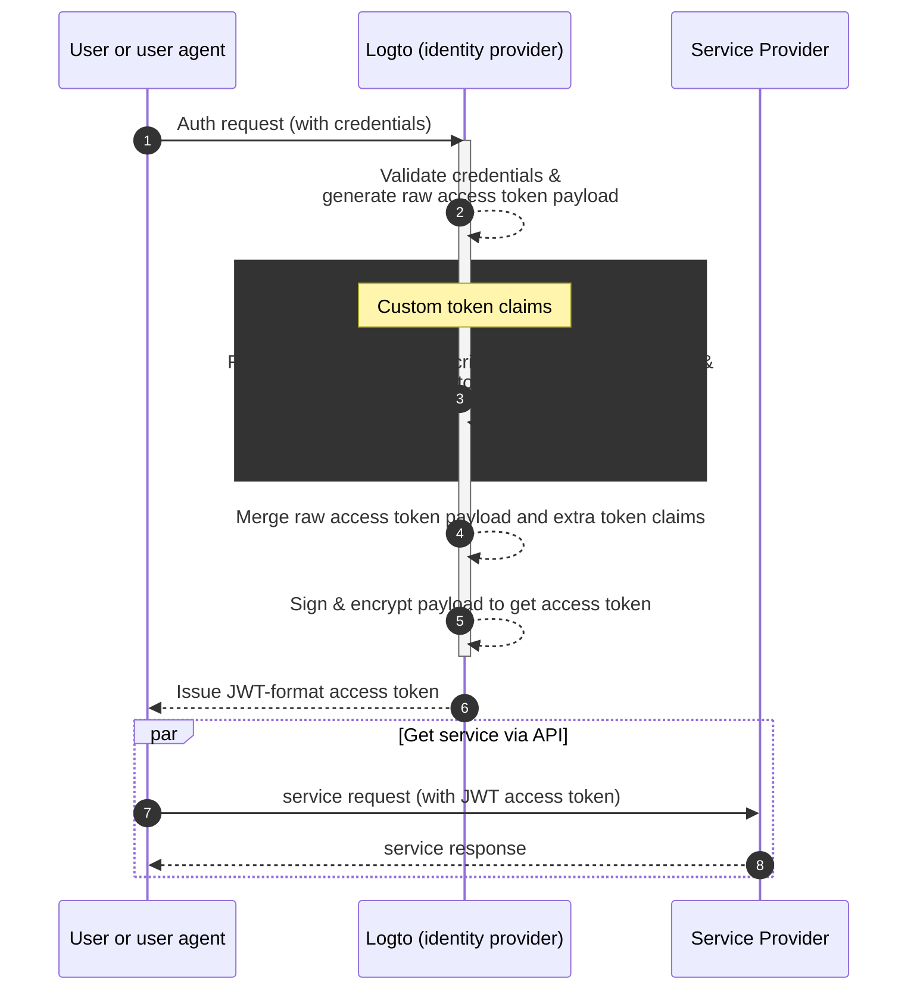
```mermaid
sequenceDiagram
  participant U as User or user agent
  participant IdP as Logto (identity provider)
  participant SP as Service Provider

  autonumber
  U ->> IdP: Auth request (with credentials)
  activate IdP
  IdP-->>IdP: Validate credentials &<br/>generate raw access token payload
  rect var(--mermaid-rect-fill)
  note over IdP: Custom token claims
  IdP->>IdP: Run custom token claims script (`getCustomJwtClaims`) &<br/>get extra token claims
  end
  IdP-->>IdP: Merge raw access token payload and extra token claims
  IdP-->>IdP: Sign & encrypt payload to get access token
  deactivate IdP
  IdP-->>U: Issue JWT-format access token
  par Get service via API
  U->>SP: service request (with JWT access token)
  SP-->>U: service response
  end
```

:::info
Logto built-in token claims cannot be overridden or modified. Custom claims will be added to the token as additional claims. If any custom claims conflict with the built-in claims, those custom claims will be ignored.
:::

:::warning
Security note: In self-hosted deployments, custom JWT scripts are executed with the same privileges as the Logto server process. This feature is intended for trusted administrators only. Do not allow untrusted or lower-privilege users to create, modify, or test these scripts.
:::

## Related resources \{#related-resources}


================================================================================
SOURCE: src/extraction/local-docs/lgoto/docs/end-user-flows/enterprise-sso/enterprise-sso-identity.mdx
================================================================================

---
sidebar_position: 3
---

# Enterprise SSO identity

## Enterprise SSO account linking \{#enterprise-sso-account-linking}

**New users sign-in with enterprise SSO**

When a new user signs up with an new enterprise SSO identity, Logto will automatically create a new user account associated with the enterprise identity.`primary email`, `name` and `avatar` will be automatically populated with the data provided by the IdP. Other additional user profile data will be stored under the user's SSO identity profile.

:::note
The profile linking situation could be different when [SAML attribute mapping](/integrations/saml-sso#step-3-configure-user-attributes-mapping) is not correctly configured or user email is not provided by the identity provider.
:::

**Existing users sign-in with enterprise SSO**

If the working email address associated with the enterprise SSO identity matches an existing user account in Logto, Logto will link the enterprise SSO identity to the existing user account automatically.

:::note
Once an email domain has been associated with an enterprise SSO connector, all the existing users with the specified email domain will be restricted to sign in with the enterprise SSO connector. Their previous sign-in methods will be blocked. E.g. email/password, email verification code and social sign-in methods.
:::

:::note
Enterprise SSO users also cannot bind or use [passkey sign-in](/end-user-flows/sign-up-and-sign-in/passkey-sign-in). Their authentication is expected to stay within the enterprise IdP flow.
:::

## Multi-factor authentication (MFA) with enterprise SSO \{#multi-factor-authentication-mfa-with-enterprise-sso}

When using enterprise SSO, MFA requirements are typically managed by the IdP. In Logto, all authenticated identities from the IdP are considered trusted, so [MFA validation](/end-user-flows/mfa) is bypassed for users signing in via enterprise SSO to enhance the user experience. It’s essential to ensure that MFA protection is enabled on the [IdP](/end-user-flows/enterprise-sso#key-components-of-enterprise-sso) side.

## Deleting an enterprise connector \{#deleting-an-enterprise-connector}

When you delete an enterprise connector from Logto:

- **User accounts remain**: The user accounts are not deleted; only their link to the enterprise identity provider is removed.
- **Next time users sign in**: The next time these users attempt to sign in, they will be prompted to use an alternative method, such as the standard sign-in method configured in Logto (e.g., email and password). If they haven't previously set a password, they will be guided to create one at this point.
- **User SSO identity profile deletion**: The user's SSO identity as well as the associated profile data will be deleted from Logto.


================================================================================
SOURCE: src/extraction/local-docs/lgoto/docs/security/password-policy.mdx
================================================================================

---
slug: /security/password-policy
sidebar_label: Password Policy
sidebar_position: 1
---

# Password policy

Logto applies the password policy in different ways depending on how the password is created or updated:

- End-user flows such as [the out-of-the-box sign-in experience](/end-user-flows/sign-up-and-sign-in/sign-up), [the Experience API](/customization/bring-your-ui), and [the Account API](/end-user-flows/account-settings/by-account-api#update-users-password) always enforce the current [password policy](#set-up-password-policy).
- Administrator actions via the Management API [`patch /api/users/{userId}/password`](https://openapi.logto.io/operation/operation-updateuserpassword) are exempt, allowing you to provision or reset credentials without policy checks when needed.
- To audit existing passwords against the current rules, call [`POST /api/sign-in-exp/default/check-password`](https://openapi.logto.io/operation/operation-checkpasswordwithdefaultsigninexperience) and act on the returned validation result. Read [Password compliance check](#password-compliance-check) to learn more.

## Set up password policy \{#set-up-password-policy}

For new users or users who are updating their password, you can set a password policy to enforce password strength requirements. Visit the <CloudLink to="/security/password-policy"> Console > Security > Password policy</CloudLink> to configure the password policy settings.

1. **Minimum password length**: Set the minimum number of characters required for the password. (NIST suggests using at least 8 [characters](https://pages.nist.gov/800-63-3/sp800-63b.html#sec5))
2. **Minimum required character types**: Set the minimum number of character types required for the password. The available character types are:
   1. Uppercase letters: `(A-Z)`
   2. Lowercase letters: `(a-z)`
   3. Numbers: `(0-9)`
   4. Special characters: ``(!"#$%&'()\*+,-./:;<>=?@[]^\_`|{}~ )``
3. **Breach history check**: Enable this setting to reject passwords that have been previously exposed in data breaches. (Powered by [Have I Been Pwned](https://haveibeenpwned.com/Passwords))
4. **Repetition check**: Enable this setting to reject passwords that contain repetitive characters. (e.g., "11111111" or "password123")
5. **User information check**: Enable this setting to reject passwords that contain user information such as username, email address, or phone number.
6. **Custom words**: Provide a list of custom words (case-insensitive) that you want to reject in the password.

## Password compliance check \{#password-compliance-check}

After you update the password policy in Logto, existing users can still sign in with their current passwords. Only newly created account will be required to follow the updated policy.

To enforce stronger security, you can use the `POST /api/sign-in-exp/default/check-password` [API](https://openapi.logto.io/operation/operation-checkpasswordwithdefaultsigninexperience) to check whether a user's password meets the current policy defined in the default sign-in experience. If it doesn't, you can prompt the user to update their password with a custom flow using [Account API](/end-user-flows/account-settings/by-account-api).

## Related resources \{#related-resources}


================================================================================
SOURCE: src/extraction/local-docs/lgoto/docs/authorization/organization-template.mdx
================================================================================

---
sidebar_position: 2
---


# Organization template

The <CloudLink to="/organization-template">organization template</CloudLink> in Logto defines a consistent set of roles and permissions available to every organization (tenant) in your SaaS product. By centralizing these definitions, you can enforce security, enable scalable onboarding, and ensure an excellent user experience across all organizations.

:::info
If you are not building a multi-tenant application or do not need organization-specific roles/permissions, you can skip this section. Logto's global roles and permissions are sufficient for single-tenant or non-organization-based applications.
:::

## What is the organization template? \{#what-is-the-organization-template}

An organization template is a blueprint that specifies which roles and permissions are available in each organization. Every organization created in your Logto tenant automatically inherits the template, guaranteeing a consistent authorization model across all tenants.

- **Why use a template?**
  - Enforces uniform access control policies for every organization.
  - Simplifies onboarding for new tenants and team members.
  - Makes role-based access control (RBAC) updates and audits easier as your product grows.

### Core concepts \{#core-concepts}

- **Organization roles:** Collections of permissions granted to users or M2M (machine-to-machine) clients within an organization. Roles define “who can do what” inside each organization.
- **Organization permissions:** Fine-grained non-API actions (e.g., UI features, business logic) that can be assigned to roles.
- **API resources:** API endpoints/services protected by permissions. Organization roles can be linked to API resources for organization-scoped API access.
- **Role-permission mapping:** Each organization role in the template can be mapped to one or more permissions.
- **Template propagation:** Changes to the template update the roles and permissions available to all organizations.

:::note
Organization roles and permissions (including API resource permissions) are distinct from global roles and their permissions. However, API resources and their permissions are centrally defined and can be referenced in both global and organization contexts.
:::

### Comparison with global roles and permissions \{#comparison-with-global-roles-and-permissions}

**Role type comparison**


**Permissions type comparison**


### Anatomy of an organization template \{#anatomy-of-an-organization-template}

An organization template is made up of:

- **Roles:** E.g., `Admin`, `Member`, `Viewer`, `Billing`
- **Organization permissions:** E.g., `invite:member`, `manage:billing`, `view:analytics`
- **Role-permission matrix:** A mapping of which permissions (including organization permissions and API resource permissions) are granted by each role.

**Visual overview**


Each organization created in Logto will have this same set of roles and permissions, and users/clients can be assigned roles per organization as needed.

## Use organization template in your product \{#use-organization-template-in-your-product}

Logto's organization template is designed for modern, multi-tenant SaaS applications where:

- Each organization should have the same role and permission options for onboarding, collaboration, and management.
- You want to avoid manually defining roles/permissions for each new organization.
- Consistent RBAC is critical for compliance, security, and customer trust.
- You need to evolve access control as your product changes, without breaking existing organizations.

**Example use cases**

- SaaS products offering workspaces, teams, or companies (each a tenant).
- Platforms with granular admin/member/viewer roles per organization.
- Products with both API and non-API permissions.

### Best practices & versioning \{#best-practices-versioning}

- **Keep roles and permissions business-driven:** Use clear names that map to real actions (not just technical endpoints).
- **Avoid role/permission sprawl:** Start simple; add new roles/permissions only when your product genuinely needs them.
- **Communicate changes:** Let users/admins know if the role or permission options in their organizations are about to change.
- **Evolve the template:** As your product grows, you can update the template at any time. All organizations will automatically have access to new roles/permissions.
- **Versioning (optional):** For major changes, consider versioning your template and communicating migration plans to your customers.

## Managing your organization template \{#managing-your-organization-template}

You can manage the organization template from the <CloudLink to="/organization-template">Console → Organization template</CloudLink> or via the Logto Management API.

- **Create roles:** Add user roles and M2M roles to your template. Each role is available to all organizations in your Logto tenant.
- **Create permissions:** Define permissions for both API resources and non-API (in-app) actions.
- **Edit the role-permission matrix:** Assign permissions to roles using Logto Console or Management API.
- **Update or delete roles/permissions:** Changes to the template are automatically applied to all organizations. (Users/clients keep their role assignments; only the permission set changes.)

For step-by-step guides on managing the organization roles and permissions, see [Role-based access control](/authorization/role-based-access-control).

## FAQs \{#faqs}


No, organization permissions are optional. You can use the organization template solely for defining roles and API resource permissions if you prefer.


Changes to roles or permissions are immediately reflected across all organizations. Users and clients keep their role assignments; only what those roles allow may change.


Not directly. Organization templates enforce a consistent model across all tenants. (You can still assign different roles to different users/clients in each organization.)


Manually update the template to restore previous roles/permissions. For complex migrations, consider versioning strategies.


Users/clients with that role lose access to permissions tied to it. Deleting a permission removes it from all roles that had it.


Customization is at the template level, not per organization. [Contact us](https://logto.io/contact) if you need advanced per-tenant exceptions.


## Further reading \{#further-reading}


================================================================================
SOURCE: src/extraction/local-docs/lgoto/docs/authorization/organization-permissions.mdx
================================================================================

---
sidebar_position: 4
---


# Protect organization (non-API) permissions

Use the organization template to manage and enforce organization-level roles and permissions in Logto, controlling access to in-app features and workflows within an organization context.

## What are organization (non-API) permissions? \{#what-are-organization-non-api-permissions}

Organization permissions (non-API) control what users can do **within an organization context**, but are not **enforced at the API level**. Instead, they govern access to app features, UI elements, workflows, or business actions, rather than backend APIs.

**Use cases include**

- Inviting or managing members within an organization
- Assigning or changing organization roles
- Managing billing, settings, or administrative functions for an organization
- Access to dashboards, analytics, or internal tools that don’t have API endpoints

Logto allows you to secure these organization permissions using OAuth 2.1 and RBAC, while supporting multi-tenant SaaS architectures.

These permissions are managed through **organization roles** defined in the [organization template](/authorization/organization-template). Every organization uses the same template, ensuring a consistent permission model across all organizations.

## How it works in Logto \{#how-it-works-in-logto}

- **Organization-level RBAC:** Roles and permissions are defined in the organization template. When a user joins an organization, they’re assigned one or more roles, granting specific permissions.
- **Non-API enforcement:** Permissions are checked and enforced in your app’s UI, workflow, or backend logic, not necessarily by an API gateway.
- **Separation from API protection:** Organization (non-API) permissions are distinct from API resource permissions. You can combine both for advanced scenarios.


### Implementation overview \{#implementation-overview}

1. **Define organization permissions** in Logto under the organization template.
2. **Create organization roles** that bundle the necessary permissions for your organization-specific actions.
3. **Assign roles** to users or clients within each organization.
4. **Obtain an organization token (JWT)** for the current organization using either the refresh token or client credentials flow.
5. **Validate access tokens** in your app’s UI or backend to enforce organization permissions.

### Authorization flow: authenticating and securing organization permissions \{#authorization-flow-authenticating-and-securing-organization-permissions}

The following flow shows how a client (web, mobile, or backend) obtains and uses organization tokens for non-API permission enforcement.

Please note that the flow does not include exhaustive details about the required parameters or headers, but focuses on the key steps involved. Continue reading to see how the flow works in practice.

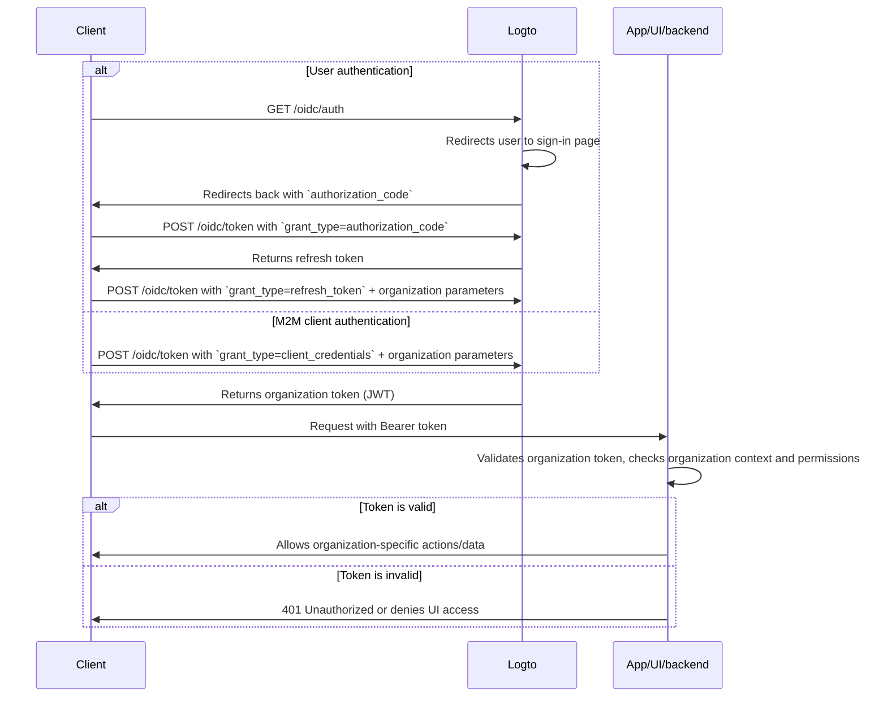
```mermaid
sequenceDiagram
    participant Client
    participant Logto
    participant App as App/UI/backend

    alt User authentication
        Client->>Logto: GET /oidc/auth
        Logto->>Logto: Redirects user to sign-in page
        Logto->>Client: Redirects back with `authorization_code`
        Client->>Logto: POST /oidc/token with `grant_type=authorization_code`
        Logto->>Client: Returns refresh token
        Client->>Logto: POST /oidc/token with `grant_type=refresh_token` + organization parameters
    else M2M client authentication
        Client->>Logto: POST /oidc/token with `grant_type=client_credentials` + organization parameters
    end

    Logto->>Client: Returns organization token (JWT)
    Client->>App: Request with Bearer token
    App->>App: Validates organization token, checks organization context and permissions

    alt Token is valid
        App->>Client: Allows organization-specific actions/data
    else Token is invalid
        App->>Client: 401 Unauthorized or denies UI access
    end
```

_User authentication = browser/app. M2M = backend service or script using client credentials + organization context._

## Implementation steps \{#implementation-steps}

### Register organization permissions \{#register-organization-permissions}

1. Go to <CloudLink to="/organization-template/organization-permissions">Console → Organization template → Organization permissions</CloudLink>.
2. Define the organization permissions you need (e.g., `invite:member`, `manage:billing`, `view:analytics`).

For full configuration steps, see [Define organization permissions](/authorization/role-based-access-control#define-organization-permissions).

### Set up organization roles \{#set-up-organization-roles}

1. Go to <CloudLink to="/organization-template/organization-roles">Console → Organization template → Organization roles</CloudLink>.
2. Create roles that bundle the organization permissions you defined earlier (e.g., `admin`, `member`, `billing`).
3. Assign these roles to users or clients within each organization.

For full configuration steps, see [Use organization roles](/authorization/role-based-access-control#configure-organization-roles).

### Obtain organization tokens (non-API) \{#obtain-organization-tokens-non-api}

Your client/app should obtain an organization token (non-API) to access organization permissions. Logto issues organization tokens as [JSON Web Tokens (JWTs)](https://auth.wiki/jwt). You can obtain these using either the [refresh token flow](https://auth.wiki/refresh-token) or [client credentials flow](https://auth.wiki/client-credentials-flow).

#### Refresh token flow \{#refresh-token-flow}

Almost all Logto official SDKs support obtaining organization tokens using the refresh token flow out of the box. A standard OAuth 2.0 / OIDC client library can also be used to implement this flow.


#### Client credentials flow \{#client-credentials-flow}

For machine-to-machine (M2M) scenarios, you can use the client credentials flow to obtain an access token for organization permissions. By making a POST request to Logto's `/oidc/token` endpoint with organization parameters, you can request an organization token using your client ID and secret.

Here are the key parameters to include in the request:

- `organization_id`: The ID of the organization you want the token for.
- `scope`: The organization permissions you want to request (e.g., `invite:member`, `manage:billing`).

Here's a non-normative example of the token request using the client credentials grant type:


No, organization permissions (including organization-level API permissions) are defined by the organization template and cannot be mixed with global API permissions. However, you can create roles that include both organization permissions and organization-level API permissions.


Check non-API permissions both in the UI (for feature gating) and in your server-side logic for sensitive actions.


## Further reading \{#further-reading}


================================================================================
SOURCE: src/extraction/local-docs/lgoto/docs/authorization/role-based-access-control.mdx
================================================================================

---
sidebar_position: 1
---


# Role-based access control (RBAC)

[Role-based access control (RBAC)](https://auth.wiki/rbac) is a proven authorization model that maps real-world business actions to roles and permissions. This guide covers how RBAC works in Logto, practical design patterns, and best practices for building secure, scalable SaaS applications.

## What is RBAC? \{#what-is-rbac}

RBAC lets you manage **who** can do **what** in your application by grouping permissions into roles. Users and clients are assigned one or more roles, which grant the permissions needed to access features, APIs, or data.

**Core concepts**

- **Role:** A named set of permissions (e.g., `admin`, `viewer`, `billing-manager`).
- **Permission:** An action or right (e.g., `manage:members`, `view:analytics`).
- **Scope:** A synonym for permission, commonly used in OAuth 2.0 contexts.
- **API resource:** An API, endpoint, or service to which permissions apply.
- **User/Client:** The entity assigned roles (end users or machine-to-machine (M2M) apps).

:::note
In Logto (and OAuth 2.1), **“permissions” and “scopes” refer to the same concept** and are used interchangeably throughout this documentation.
:::

### API resources \{#api-resources}

An **API resource** is any protected endpoint or service in your application—such as a REST API, GraphQL endpoint, or other backend service requiring authorization.

Logto models API resources following [RFC 8707: Resource Indicators for OAuth 2.0](https://www.rfc-editor.org/rfc/rfc8707).  
Each API resource is uniquely identified by a **resource indicator** (a URI), which is used to scope access tokens and enforce audience restrictions.

| **Property name**     | **Description**                                                                                                                         | **Required** |
| --------------------- | --------------------------------------------------------------------------------------------------------------------------------------- | ------------ |
| API Name              | A human-friendly name to identify the API resource in the Console and logs.                                                             | Yes          |
| API Identifier        | The unique [resource indicator](https://www.rfc-editor.org/rfc/rfc8707.html) URI that represents the API resource.                      | Yes          |
| Token expiration time | The lifetime of issued access tokens for this API (in seconds). Default is **3600** (1 hour).                                           | No           |
| Default API           | Only one API resource can be set as the default per Logto tenant. When set, the `resource` parameter can be omitted from auth requests. | No           |

:::note
When a default API resource is designated, Logto will use it as the audience for tokens when the `resource` parameter is omitted in authentication requests.
:::

#### Default API resource behavior \{#default-api-resource-behavior}

In Logto, every user-defined global permission (scope) must be linked to an API resource. Otherwise, the permission is treated as an OpenID Connect (OIDC) scope.

This generally doesn’t impact most integrations, but when working with third-party apps that do **not** support [RFC 8707](https://www.rfc-editor.org/rfc/rfc8707.html), the initial authorization request may not include a `resource` parameter. In these cases, Logto issues [opaque access tokens](https://blog.logto.io/opaque-token-vs-jwt#use-cases-in-oidc) instead of JWTs, which can complicate access control.

To solve this, you can set a **default API resource** for your tenant:

- **When the `resource` parameter is missing in the [Authentication request](https://auth.wiki/authentication-request):**
  - Logto uses the default API resource as the audience for access tokens.
- **If the `openid` scope is included:**
  - Logto issues an opaque access token for the [Userinfo endpoint](https://auth.wiki/userinfo-endpoint) when no `resource` is present in the token request.
- **If the `openid` scope is not included:**
  - Logto issues a JWT access token for the default API resource as the audience.

Setting a default API resource ensures smoother integration with apps that do not support RFC 8707, while maintaining secure and standards-based access controls.

## RBAC in Logto \{#rbac-in-logto}

Logto provides flexible RBAC at both the **global** and **organization** levels to support multi-tenant SaaS:

- **Global roles** Assigned across the Logto tenant. Ideal for product-wide permissions, admins, or superusers.
- **Organization roles** Assigned within an organization. Perfect for organization-specific access, such as workspace admins, project members, or custom groups.
- **API resources** Registered APIs and features that require authorization.
- **Permissions (scopes)** Defined per API resource or in the organization template.
  - API resource permissions can be assigned to either global or organization roles.
  - Organization permissions can be assigned only to organization roles.

Depending on your product’s needs, you can use these RBAC models separately or in combination.

Below are three illustrative examples with diagrams:

### Model 1: Global API resources \{#model-1-global-api-resources}

**Scenario**

A SaaS product with APIs shared across all users, regardless of organization.
Use global roles to control access to product-wide API resources.

**Diagram**


**Key points**

- **Users** and **M2M apps** are assigned global roles (e.g., Store manager, Service agent).
- Roles grant permissions (scopes), such as `read:store`, `order:book`.
- Permissions are linked directly to API resources (e.g., `https://read.shop/stores`).

**When to use**

When access is not organization-specific or users/clients operate across all organizations.

:::note
Logto doesn't support non-API permissions at the global level since it is reserved for OpenID Connect (OIDC) scopes.
:::

:::tip
For step-by-step implementation guide, see [Protect global API resources](/authorization/global-api-resources).
:::

### Model 2: Organization (non-API) permissions \{#model-2-organization-non-api-permissions}

**Scenario**

Controlling in-app features or workflows that aren’t enforced at the API layer (such as gating UI features, dashboards, or internal tools) using organization roles and permissions.

**Diagram**


Update the [organization template](/authorization/organization-template) for global changes; existing organizations can inherit updates.


Yes, roles and their permissions can be updated at any time.


Users/clients with that role will lose the permission immediately for new tokens.


Use the Logto Console or API to list role assignments.


Yes, both the Console and Management API support managing roles and assignments programmatically.


## Further reading \{#further-reading}


================================================================================
SOURCE: src/extraction/local-docs/lgoto/docs/authorization/README.mdx
================================================================================


# Authorization

[Authorization](https://auth.wiki/authorization) in Logto defines **what users and apps can do after authentication**: which APIs, resources, or actions are allowed for each identity.

Logto provides flexible, token-based authorization for modern SaaS and AI apps. You can protect API resources globally, or within the context of each organization. All permissions are managed through a [role-based access control (RBAC)](/authorization/role-based-access-control) system, with advanced support for multi-tenant apps via [organization templates](/authorization/organization-template).

## Core concepts \{#core-concepts}

- **Role-based access control (RBAC):** Logto uses RBAC as the foundation for assigning permissions to users, clients, and services. [Learn more about RBAC](/authorization/role-based-access-control).
- **API resource:** Any backend service or endpoint you want to protect (global or organization-specific).
- **Role:** A group of permissions (e.g., admin, viewer, editor).
- **Permission (scope):** A specific allowed action (e.g., `read:report`, `invite:member`).
- **Organization:** Represents a tenant, workspace, or customer in your application. **This is different from the Logto tenant, which refers to your overall Logto project or instance**.
- **Organization template:** For multi-tenant apps, define a reusable set of roles and permissions applied across all organizations. [See how organization templates work](/authorization/organization-template).
- **Access token / organization token:** Tokens containing claims for global or organization-scoped permissions.

## Authorization scenarios \{#authorization-scenarios}

There are three main authorization patterns in Logto. Pick the scenario that matches your needs:

| Scenario                                        | When to use                                                                              | Token type         | Role config                                                 | Learn more                                                                                  |
| ----------------------------------------------- | ---------------------------------------------------------------------------------------- | ------------------ | ----------------------------------------------------------- | ------------------------------------------------------------------------------------------- |
| **Global API resource permissions**             | Protect API resources shared across your entire Logto tenant (not organization-specific) | Access token       | Assign global roles/permissions                             | [Protect global API resources](/authorization/global-api-resources)                         |
| **Organization (non-API) permissions**          | Control organization-specific actions, UI features, or business logic (not APIs)         | Organization token | Assign organization roles/permissions for app controls      | [Protect organization (non-API) permissions](/authorization/organization-permissions)       |
| **Organization-level API resource permissions** | Protect API resources accessible within a specific organization                          | Organization token | Assign organization roles/permissions for organization APIs | [Protect organization-level API resources](/authorization/organization-level-api-resources) |

Logto models API resources according to [RFC 8707](https://auth.wiki/resource-indicator), using the `resource` parameter in OAuth 2.0 authorization flows. This makes it simple to secure multiple APIs or microservices, and ensures compatibility with other standards-based systems.

:::tip
Need custom claims or advanced access control? See [Custom token claims](/developers/custom-token-claims).
:::

## How Logto authorization works \{#how-logto-authorization-works}

- **Token-based:** Every access is granted via a secure, signed access token. Your backend validates the token and enforces permissions (scopes).
- **Global vs. organization permission (scope):**

  - _Global_ permission (scope): Controls access to API resources across your entire Logto tenant.
  - _Organization_ permission (scope): Controls both business logic (app features) and API resources within a organization context. Organization permissions can apply to non-API features (such as UI elements or workflows) and/or organization-scoped API endpoints.

- **Roles and permissions (scopes):** Roles are collections of permissions (scopes). Assign roles to users or clients globally or within an organization, depending on your scenario.

## Next steps \{#next-steps}

Ready to go further? Start hands-on, explore real-world guides, or deepen your understanding:


================================================================================
SOURCE: src/extraction/local-docs/lgoto/docs/authorization/organization-level-api-resources.mdx
================================================================================

---
sidebar_position: 5
---


# Protect organization-level API resources


Combine API resources with the organization template to restrict access to APIs and data within each organization, ensuring tenant-level isolation in your SaaS.

## What are organization-level API resources? \{#what-are-organization-level-api-resources}

Organization-level API resources are endpoints or services in your application that are **scoped to a specific organization**. These APIs enforce authorization and access based on the organization context-ensuring that users or clients only access data and actions relevant to their organization.

**Use cases include**

- APIs for managing organization members, roles, or settings (e.g., `/organizations/{organizationId}/members`)
- Organization-scoped dashboards, analytics, or reports
- Billing, subscription, or audit endpoints tied to an organization
- Any API where actions and data are isolated per tenant

Logto allows you to secure these organization APIs using OAuth 2.1 and RBAC, while supporting multi-tenant SaaS architectures.

These permissions are managed through **organization roles** defined in the [organization template](/authorization/organization-template). Every organization uses the same template, ensuring a consistent permission model across all organizations.

## How it works in Logto \{#how-it-works-in-logto}

- **API resources and permissions are registered globally:** Each API resource is defined with a unique resource indicator (URI) and a set of permissions (scopes) in Logto.
- **Roles at the organization level:** Organization roles are defined in the organization template. API resource permissions (scopes) are assigned to organization roles, which are then assigned to users or clients **within each organization**.
- **Context-aware authorization:** When a client requests an access token with both an API resource and an `organization_id`, Logto issues a token that includes both the organization context and the API audience. The token’s permissions (scopes) are determined by the user’s organization roles for the specified organization.
- **Separation from global resources:** API resources can be accessed with or without an organization context. Organization RBAC is only applied if an `organization_id` is included in the request. For APIs that are shared across all users, see [Protect global API resources](/authorization/global-api-resources).


### Implementation overview \{#implementation-overview}

1. **Register your API resource** and define its permissions (scopes) in Logto.
2. **Define organization roles** in the organization template and assign relevant API permissions.
3. **Assign roles** to users or clients within each organization.
4. **Request an access token** for the API with an `organization_id` to include organization context.
5. **Validate access tokens** in your API, enforcing both organization context and permissions.

### How Logto applies organization RBAC \{#how-logto-applies-organization-rbac}

- If you request an access token **without** an `organization_id`, only global roles/permissions are considered.
- If you request an access token **with** an `organization_id`, Logto evaluates the user’s organization roles and their associated permissions for that organization.
- The resulting JWT will contain both the API audience (`aud` claim) and the organization context (`organization_id` claim), with scopes filtered to those granted by the user’s organization roles.

### Authorization flow: authenticating and securing APIs with organization context \{#authorization-flow-authenticating-and-securing-apis-with-organization-context}

The following flow shows how a client (web, mobile, or backend) obtains and uses organization tokens to access organization-level API resources.

Please note that the flow does not include exhaustive details about the required parameters or headers, but focuses on the key steps involved. Continue reading to see how the flow works in practice.

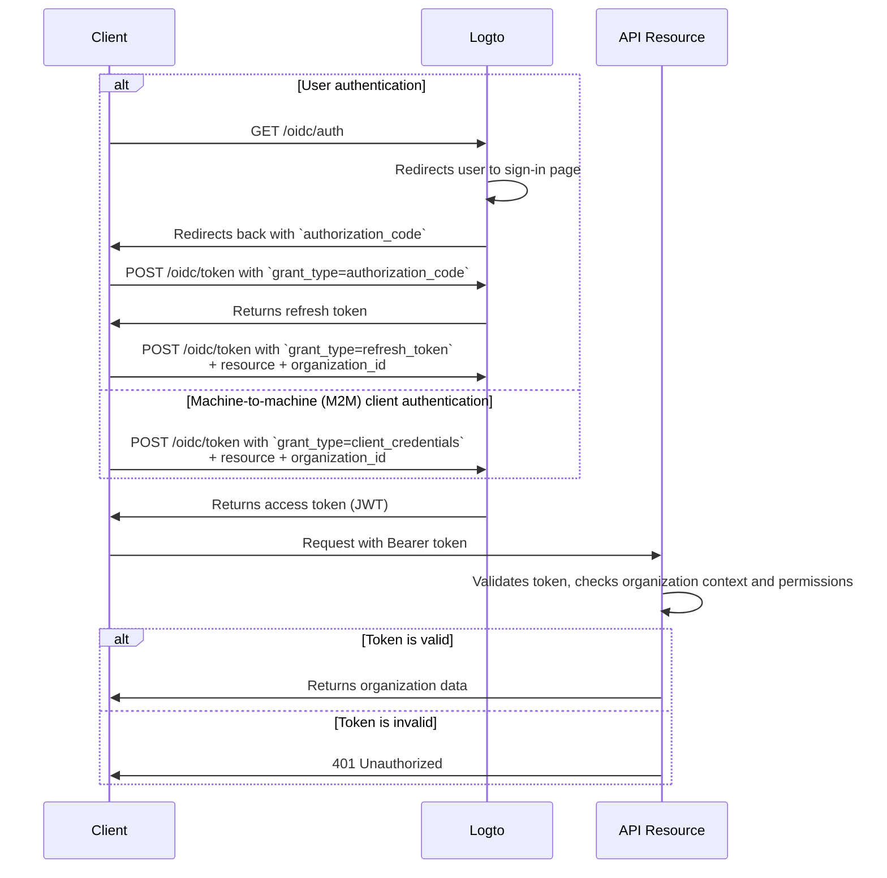
```mermaid
sequenceDiagram
    participant Client
    participant Logto
    participant API as API Resource

    alt User authentication
        Client->>Logto: GET /oidc/auth
        Logto->>Logto: Redirects user to sign-in page
        Logto->>Client: Redirects back with `authorization_code`
        Client->>Logto: POST /oidc/token with `grant_type=authorization_code`
        Logto->>Client: Returns refresh token
        Client->>Logto: POST /oidc/token with `grant_type=refresh_token`<br/>+ resource + organization_id
    else Machine-to-machine (M2M) client authentication
        Client->>Logto: POST /oidc/token with `grant_type=client_credentials`<br/>+ resource + organization_id
    end

    Logto->>Client: Returns access token (JWT)
    Client->>API: Request with Bearer token
    API->>API: Validates token, checks organization context and permissions

    alt Token is valid
      API->>Client: Returns organization data
    else Token is invalid
      API->>Client: 401 Unauthorized
    end
```

_User authentication = browser/app. M2M = backend service or script using client credentials + organization context._

## Implementation steps \{#implementation-steps}

### Register your API resource \{#register-your-api-resource}

1. Go to <CloudLink to="/api-resources">Console → API resources</CloudLink>.
2. Create a new API resource (e.g., `https://api.yourapp.com/org`) and define its permissions (scopes).

For full configuration steps, see [Define API resources with permissions](/authorization/role-based-access-control#define-api-resources-with-permissions).

### Set up organization roles \{#set-up-organization-roles}

1. Go to <CloudLink to="/organization-template/organization-roles">Console → Organization template → Organization roles</CloudLink>.
2. Create organization roles (e.g., `admin`, `member`) and assign API permissions to each role
3. Assign roles to users or clients within each organization. If they’re not members yet, invite or add them first.

For full configuration steps, see [Use organization roles](/authorization/role-based-access-control#configure-organization-roles).

### Obtain organization tokens for API resources \{#obtain-organization-tokens-for-api-resources}

Your client/app should request a token with both `resource` and `organization_id` to access organization-level APIs. Logto issues organization tokens as [JSON Web Tokens (JWTs)](https://auth.wiki/jwt). You can obtain these using either the [refresh token flow](https://auth.wiki/refresh-token) or [client credentials flow](https://auth.wiki/client-credentials-flow).

#### Refresh token flow \{#refresh-token-flow}

Almost all Logto official SDKs support obtaining organization tokens using the refresh token flow out of the box. A standard OAuth 2.0 / OIDC client library can also be used to implement this flow.


#### Client credentials flow \{#client-credentials-flow}

For machine-to-machine (M2M) scenarios, you can use the client credentials flow to obtain an access token for organization-level API resource permissions. By making a POST request to Logto's `/oidc/token` endpoint with organization parameters, you can request an organization token using your client ID and secret.

Here are the key parameters to include in the request:

- `resource`: The API resource identifier (e.g., `https://api.yourapp.com/org`).
- `organization_id`: The ID of the organization you want the token for.
- `scope`: The organization-level API resource permissions you want to request (e.g., `invite:member`, `manage:billing`).

Here's a non-normative example of the token request using the client credentials grant type:


Only global roles/permissions will be evaluated. Organization RBAC will not be enforced.


No, organization permissions (including organization-level API permissions) are defined by the organization template and cannot be mixed with global API permissions. However, you can create roles that include both organization permissions and organization-level API permissions.


## Further reading \{#further-reading}


================================================================================
SOURCE: src/extraction/local-docs/lgoto/docs/authorization/global-api-resources.mdx
================================================================================

---
sidebar_position: 3
---


# Protect global API resources


Protect product-wide APIs using role-based access control (RBAC) in Logto. Assign global roles and permissions to control access for all users and clients across your application.

## What are global API resources? \{#what-are-global-api-resources}

Global API resources are endpoints or services in your application that are accessible to all users, regardless of organization or tenant. These are typically public-facing APIs, core product services, or any endpoint that is not scoped to a specific organization.

**Use cases include**

- Public APIs or endpoints shared across your user base.
- Microservices that are not tied to multi-tenancy.
- Core application APIs (e.g., `/api/users`, `/api/products`) used by all customers.

Logto allows you to secure these APIs using OAuth 2.1, combined with flexible, role-based access control.

## How it works in Logto \{#how-it-works-in-logto}

- **API resources and permissions are registered globally:** Each API you want to protect is defined with a unique resource indicator (URI) with a set of permissions (scopes) that control access.
- **Access is controlled by global roles:** You can assign permissions to roles, which are then assigned to users or clients.
- **Separate from organization-level permissions:** Global API resources have no organization context. However, they may be used in conjunction with organization roles to provide an additional layer of context if needed. To protect organization-level APIs, see [Protect organization-level API resources](/authorization/organization-level-api-resources).


### Implementation overview \{#implementation-overview}

1. **Register your API resource** and define its permissions in Logto.
2. **Define roles** with the necessary permissions for accessing the API.
3. **Assign roles** to users or clients.
4. **Use OAuth 2.0 authorization flows** to obtain access tokens for the API (resource parameter must match the registered API identifier).
5. **Validate access tokens** in your API to enforce permissions.

### Understanding resource indicators \{#understanding-resource-indicators}

Logto models API resources according to [RFC 8707: Resource Indicators for OAuth 2.0](https://www.rfc-editor.org/rfc/rfc8707.html). A **resource indicator** is a URI that uniquely identifies the target API or service being requested.

**Key points**

- Resource indicators must be absolute URIs (e.g., `https://api.example.com`)
- No fragment component; avoid using query strings when possible.
- Resource indicators enable audience-restricted tokens and support for multi-API architectures.

**Example**

- Management API: `https://my-tenant.logto.app/api`
- Custom global API: `https://api.yourapp.com`

### Authorization flow: authenticating and securing your API \{#authorization-flow-authenticating-and-securing-your-api}

The flow below applies to both interactive user authentication (browser/app) and backend machine-to-machine (M2M) scenarios.

Please note that the flow does not include exhaustive details about the required parameters or headers, but focuses on the key steps involved. Continue reading to see how the flow works in practice.

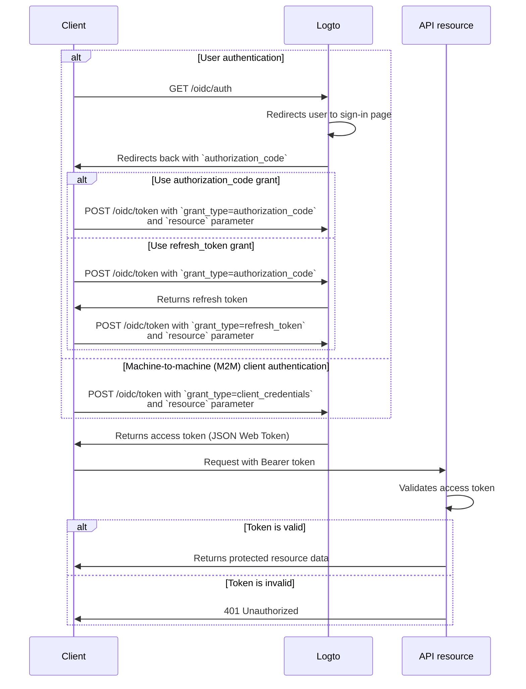
```mermaid
sequenceDiagram
    participant Client
    participant Logto
    participant API as API resource

    alt User authentication
        Client->>Logto: GET /oidc/auth
        Logto->>Logto: Redirects user to sign-in page
        Logto->>Client: Redirects back with `authorization_code`
        alt Use authorization_code grant
            Client->>Logto: POST /oidc/token with `grant_type=authorization_code`<br/>and `resource` parameter
        else Use refresh_token grant
            Client->>Logto: POST /oidc/token with `grant_type=authorization_code`
            Logto->>Client: Returns refresh token
            Client->>Logto: POST /oidc/token with `grant_type=refresh_token`<br/>and `resource` parameter
        end
    else Machine-to-machine (M2M) client authentication
        Client->>Logto: POST /oidc/token with `grant_type=client_credentials`<br/>and `resource` parameter
    end

    Logto->>Client: Returns access token (JSON Web Token)
    Client->>API: Request with Bearer token
    API->>API: Validates access token

    alt Token is valid
      API->>Client: Returns protected resource data
    else Token is invalid
      API->>Client: 401 Unauthorized
    end
```

_User authentication = browser/app. M2M = backend service or script using client credentials._

:::note
The `resource` parameter must exactly match the API identifier (resource indicator) you registered in Logto.
:::

## Implementation steps \{#implementation-steps}

### Register your API resources \{#register-your-api-resources}

1. Go to <CloudLink to="/api-resources">Console → API resources</CloudLink>.
2. Create a new API resource (e.g., `https://api.yourapp.com/org`) and define its permissions (scopes).

For full configuration steps, see [Define API resources with permissions](/authorization/role-based-access-control#define-api-resources-with-permissions).

### Set up global roles \{#set-up-global-roles}

1. Go to <CloudLink to="/roles">Console → Roles</CloudLink>.
2. Create roles that map to your API permissions (e.g., `read:products`, `write:products`).
3. Assign these roles to users or clients that need access to the API.

For full configuration steps, see [Use global roles](/authorization/role-based-access-control#configure-global-roles).

### Obtain access tokens for global API resources \{#obtain-access-tokens-for-global-api-resources}

Before accessing a global API resource, your client must obtain an access token. Logto issues [JSON Web Tokens (JWTs)](https://auth.wiki/jwt) as access tokens for global API resources. This is typically done using the [OAuth 2.0 authorization code flow](https://auth.wiki/authorization-code-flow), [refresh token flow](https://auth.wiki/refresh-token), or the [client credentials flow](https://auth.wiki/client-credentials-flow).

#### Authorization code or refresh token flow \{#authorization-code-or-refresh-token-flow}

All Logto official SDKs support obtaining access tokens for global API resources using the refresh token flow out of the box. A standard OAuth 2.0 / OIDC client library can also be used to implement this flow.


#### Client credentials flow \{#client-credentials-flow}

For machine-to-machine (M2M) scenarios, you can use the client credentials flow to obtain an access token for your global API resource. By making a POST request to Logto's `/oidc/token` endpoint, you can request an access token using your client ID and secret.

There are two key parameters to include in the request:

- `resource`: The resource indicator URI of the API you want to access (e.g., `https://api.yourapp.com`).
- `scope`: The permissions you want to request for the API (e.g., `read:products write:products`).

Here's a non-normative example of the token request using the client credentials grant type:


Set a default API resource in Logto Console. Tokens will default to this audience when no resource parameter is specified in the token request.


Check the following common issues:

- **Token signature**: Verify your backend is fetching the correct JWKs from Logto
- **Token expiration**: Ensure the token hasn't expired (`exp` claim)
- **Audience**: Confirm the `aud` claim matches your registered API resource indicator
- **Required scopes**: Verify the token contains the necessary permissions in the `scope` claim


Use a [personal access token](/user-management/personal-access-token) to simulate authenticated calls. This allows you to test your API endpoints without implementing a complete OAuth flow in your client application.


No. Scope names must **exactly match** the permission names defined in your API resource. Prefixes and shortened versions do not work as wildcards.

**Example:**

If your API resource defines:

- `read:elections`
- `write:elections`

You must request:

```swift
scopes: ["read:elections", "write:elections"]
```

This will **NOT work**:

```swift
scopes: ["read", "write"]  // ❌ Doesn't match permission names
```


## Further reading \{#further-reading}


================================================================================
SOURCE: src/extraction/local-docs/lgoto/docs/authorization/fragments/_handle-user-permission-change.mdx
================================================================================

### Optional: Handle user permission change \{#optional-handle-user-permission-change}

User permissions can change at any time. Because Logto issues JWTs for RBAC, permission updates only appear in newly issued tokens, and never modify existing JWTs.

:::info Scope subset rule
An access token can only include scopes that were requested in the original OAuth authorization flow.
Even if a user gains new permissions, the token issued later can only contain a subset of the originally requested scopes.
To access newly granted scopes that were not part of the initial request, the client must run a new authorization flow.
:::

#### Downscoped permissions \{#downscoped-permissions}

When a user loses permissions:

- Newly issued tokens immediately reflect the reduced scopes.
- Existing JWTs keep the old scopes until they expire.
- Your API should always validate scopes and rely on short token lifetimes.

If you need faster reactions, implement your own signal that tells clients to refresh their tokens.

#### Enlarged permissions \{#enlarged-permissions}

{props.type === "global" && <p>For global API resources, when a user gains permissions, enlarged permissions will NOT show up through refresh. The client must perform a new OAuth authorization flow to obtain a token that includes the new scopes. This can happen silently if the user has an active Logto session.</p>}

{props.type === "organization" && <p>For organization tokens, when a user gains permissions, enlarged permissions will show up on the next issuance (refresh or token request). A new token is still required, but no full re-auth is needed unless the new scopes exceed the original request set.</p>}

#### Recommendations \{#recommendations}

- Validate scopes in your API on every call.
- Keep token expiration short.
- Add optional notifications if you need immediate permission-change propagation.


================================================================================
SOURCE: src/extraction/local-docs/lgoto/docs/concepts/authn-vs-authz.mdx
================================================================================

---
sidebar_position: 2
---

# Authentication vs. authorization

The difference between **authentication** and **authorization** can be summarized as follows:

- **Authentication** answers the question “Which identity do you own?”
- **Authorization** answers the question “What can you do?”

For a complete customer identity and access management (CIAM) introduction, you can refer to our CIAM series:

- [CIAM 101: Authentication, Identity, SSO](https://blog.logto.io/ciam-101-intro-authn-sso/)
- [CIAM 102: Authorization & Role-based Access Control](https://blog.logto.io/ciam-102-authz-and-rbac/)

## Authentication \{#authentication}

Logto supports various interactive and non-interactive authentication methods, for example:

- **Sign-in experience**: The authentication process for end-users.
- **Machine-to-machine (M2M) authentication**: The authentication process for services or applications.

The ultimate goal of authentication is dramatically simple: to verify and get the unique identifier of the entity (in Logto, a user or an application).

## Authorization \{#authorization}

In Logto, authorization is done through role-based access control (RBAC). It gives you the complete control to manage the access of your users or M2M applications to the following:

- **API resources**: A global entity that represents by an absolute URI.
- **Organizations**: A group of users or applications.
- **Organization API resources**: An API resource that belongs to an organization.

To learn more about these concepts, you can refer to the following resources:

- [Role-based access control (RBAC)](/authorization/role-based-access-control)
- [Organizations (Multi-tenancy)](/organizations)

Here's a visual representation of the relationship between these concepts:

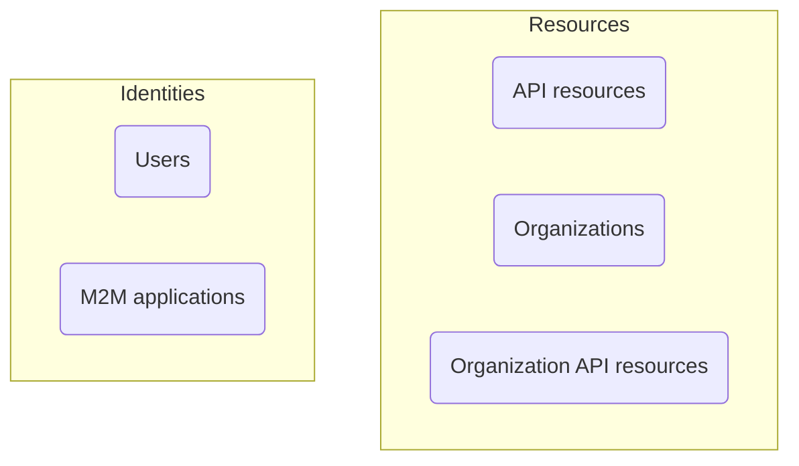
```mermaid
graph TD
  subgraph Resources
    R(API resources)
    O(Organizations)
    OR(Organization API resources)
  end

  subgraph Identities
    U(Users)
    A(M2M applications)
  end
```

In a nutshell, authorization is about defining the rules that determine what entities in the "Identities" group can access the entities in the "Resources" group.

## Frequently asked questions \{#frequently-asked-questions}

### I need to specify which users can sign in to an application \{#i-need-to-specify-which-users-can-sign-in-to-an-application}

Due to the nature of single sign-on (SSO), Logto currently does not support using applications as resources. Instead, you can define API resources and permissions to control access to your resources.

### I need my users to sign in to an organization \{#i-need-my-users-to-sign-in-to-an-organization}

As mentioned earlier, authentication involves verifying the identity of an entity, while access control is handled through authorization. Therefore:

- Determining which organization(s) a user belongs to is an authorization concern.
- The sign-in process is an authentication concern.

This means that there is no concept of "signing in to an organization" in Logto. Once a user is authenticated, they can be authorized to access all resources (including organization resources) based on the defined permissions.

This model is efficient and clear, as it separates the concerns of authentication and authorization. All modern SaaS applications, such as GitHub and Notion, follow this model.

However, there are some cases where you need to establish 1-1 mappings between user sources and organizations. In this case, [enterprise SSO](/end-user-flows/enterprise-sso) and [organization Just-in-Time (JIT) provisioning](/organizations/just-in-time-provisioning) can be helpful.

### Our customers need custom branding for their sign-in pages \{#our-customers-need-custom-branding-for-their-sign-in-pages}

Please check out [app-specific branding](/customization/match-your-brand/#app-specific-branding) and [organization-specific branding](/customization/match-your-brand/#organization-specific-branding) for related configurations.


================================================================================
SOURCE: src/extraction/local-docs/lgoto/docs/concepts/opaque-token.mdx
================================================================================

---
sidebar_position: 6
---

# Opaque token

During the authentication process, if no resource is specified, Logto will issue an opaque access token instead of a JWT. The opaque token is a random string and it's much shorter than a JWT:

```json
{
  "access_token": "some-random-string", // opaque token
  "expires_in": 3600,
  "id_token": "eyJhbGc...aBc", // JWT
  "scope": "openid profile email",
  "token_type": "Bearer"
}
```

The opaque token can be used to call the [userinfo endpoint](https://openid.net/specs/openid-connect-core-1_0.html#UserInfo) and to access protected resources that require authentication. Since it's not a JWT, how can the resource server validate it?

Logto provides an [introspection endpoint](https://www.rfc-editor.org/rfc/rfc7662.html) that can be used to validate opaque tokens. By default, the introspection endpoint is `/oidc/token/introspection` and accepts `POST` requests. The following parameter is required:

- `token`: the opaque token to validate

The endpoint also requires client authentication. You can use one of the following methods:

- HTTP Basic authentication: Use the `Authorization` header with the value `Basic <base64-encoded-credentials>`. The credentials must be the client ID and client secret separated by a colon (`:`) and base64-encoded.
- HTTP POST authentication: Use the `client_id` and `client_secret` parameters:
  - `client_id`: the client ID of the application that requested the token
  - `client_secret`: the client secret of the application that requested the token

The client ID (app ID) and client secret (app secret) can be the app credentials from any "traditional web" or "machine-to-machine" application in Logto. The introspection endpoint will return an error if the credentials are invalid.

The introspection endpoint returns a JSON object with the claims of the token:

```json
{
  "active": true, // whether the token is valid or not
  "sub": "1234567890" // the subject of the token (the user ID)
}
```

If the token is invalid, the `active` field will be `false` and the `sub` field will be omitted.

Here's a non-normative example of the introspection request:

```bash
curl --location \
  --request POST 'https://[tenant-id].logto.app/oidc/token/introspection' \
  --header 'Content-Type: application/x-www-form-urlencoded' \
  --data-urlencode 'token=some-random-string' \
  --data-urlencode 'client_id=1234567890' \
  --data-urlencode 'client_secret=1234567890'
```

Remember to replace `[tenant-id]` with your tenant ID.

## Opaque token and organizations \{#opaque-token-and-organizations}

Opaque tokens can be used to retrieve organization membership information via the [userinfo endpoint](https://openid.net/specs/openid-connect-core-1_0.html#UserInfo). When you request the `urn:logto:scope:organizations` scope, the userinfo endpoint will return the user's organization-related claims, such as `organizations` (organization IDs) and `organization_data`.

However, **opaque tokens cannot be used as organization tokens**. Organization tokens are always issued in JWT format because:

1. Organization tokens contain organization-specific claims (like `organization_id` and scoped permissions) that need to be validated by resource servers.
2. The JWT format allows resource servers to verify the token and extract organization context without additional API calls.

To obtain an organization token, you need to use the [refresh token flow](/authorization/organization-permissions#refresh-token-flow) or [client credentials flow](/authorization/organization-permissions#client-credentials-flow) with organization parameters.


================================================================================
SOURCE: src/extraction/local-docs/lgoto/docs/connectors/connector-data-structure.mdx
================================================================================

---
sidebar_position: 5
---

# Connector data structure

## Introduction \{#introduction}

### What is a connector? \{#what-is-a-connector}

_Connectors_ play a critical role in Logto. With their help, Logto enables end-users to use passwordless registration or sign-in and the capabilities of signing in with social accounts. With the increasing popularity of websites and applications, passwordless and social sign-ins allow users to avoid managing numerous accounts and passwords.

Follow our [connector guides](/connectors) if you want to set up an existing connector. If you cannot find the connector you want to set up, you may develop those connectors by following the guides in [developer your connector](/logto-oss/develop-your-connector).

## Compositions \{#compositions}

There are lots of properties in connector data.

To make the data loading and updating more efficient, we store part of connector data which will be modified frequently to DB and the rest of that locally.

- _Local storage_, also known as [_ConnectorMetadata_](/connectors/connector-data-structure#connectors-remote-storage-connector-db), is an object containing fixed properties such as logo, connector type, and so on. (:face_with_monocle: Having trouble understanding these properties? No worry, a detailed explanation comes later!)
- _Remote storage_ is stored in DB for the sake of relatively frequent changes on those data.

## Connector's local storage: ConnectorMetadata \{#connectors-local-storage-connectormetadata}

### id \{#id}

_id_ is an _unique_ string-typed key to identify a connector in Logto.

It's assigned by the developers of each connector and will be uploaded to DB.

### target (Identity provider name) \{#target-identity-provider-name}

_target_ is a lowercase string to distinguish the social identities source of the social connector.

Logto users can regard this variable as "Identity provider name" for better understanding.

For example, your _target_ should be _google_ if you sign in to Logto with your google account. The value of _target_ can be an arbitrary non-empty string, but we encourage you to keep it straightforward since you can not change it. We DO NOT allow the existence of multiple connectors with the same _target_ and platform. On the other hand, you can have social connectors for different platforms sharing the same _target_. For example, if users want to log in via _WeChat_ on their phone, a native _WeChat_ app is required per _WeChat_’s TOU; at the same time, a web _WeChat_ app is also needed to enable log in to web applications. These two _WeChat_ apps share the same identity provider and should have the same target.

We have concluded different use cases and suggestions for users since _target_ is a complicated concept.

|                                        | Example                                                                                          | Scenario                                                                                                                     | Result                                                                                                                                                   | Recommend?                                                                                                                                                                                          |
| -------------------------------------- | ------------------------------------------------------------------------------------------------ | ---------------------------------------------------------------------------------------------------------------------------- | -------------------------------------------------------------------------------------------------------------------------------------------------------- | --------------------------------------------------------------------------------------------------------------------------------------------------------------------------------------------------- |
| Different IdPs and different _targets_ | 1. GitHub Connector (target: `github`) <br /> 2. Google Connector (target: `google`)             | An app that supports both login with GitHub and Google account.                                                              | Most common use cases.                                                                                                                                   | ✅                                                                                                                                                                                                  |
| Different IdPs and the same _target_   | 1. GitHub Connector (target: `github`) <br /> 2. Google Connector (target: `github`)             | N/A                                                                                                                          | It's possible for a user to sign in to a Logto account that was created using another user's GitHub account.                                             | ❌                                                                                                                                                                                                  |
| The same IdP and different _targets_   | 1. GitHub Connector (target: `github`) <br /> 2. OAuth GitHub Connector (target: `github_oauth`) | The GitHub connector is used for Application A, while the OAuth GitHub connector was created specifically for Application B. | Signing in to Logto using these two different connectors will always create separate Logto accounts - even if the user is using the same GitHub account. | Splitting your user pool is the only scenario where you would need to use both connectors. However, it's generally considered best practice to create two separate tenants to handle this use case. |
| The same IdP and the same _target_     | 1. GitHub Connector (target: `github`) <br /> 2. OAuth GitHub Connector (target: `github`)       | N/A                                                                                                                          | Using either of these two connectors can result in the exact same outcome.                                                                               | Creating two connectors that essentially do the same thing can be confusing for end-users and doesn't make much sense. It's better to use one connector that fits your specific use case.           |

### type \{#type}

_type_ is the property that record the type of the connector.

We define the connectors into three different types, based on their functionalities:

- _Social_: Connectors that can access user information from arbitrary third-party social media with end-users authorization.
- _SMS_: Connectors enable end-users to receive text messages on their phones.
- _Email_: Connectors that can help send emails to end-users.

### platform \{#platform}

_platform_ is used to identify which platform the connector is built for.

_platform_ should be either `null` or one of the following string-typed values:

- _Native_: Connectors that ONLY work for native mobile apps.
- _Web_: Connectors work ONLY on desktop web applications.
- _Universal_: Connectors can work on both mobile web apps and desktop web apps.

:::note
_platform_ of _email connectors_ and _SMS connectors_ should always be `null`.<br/>
ONLY _social connectors_ can have non-NULL _platform_ values.
:::

### name \{#name}

_name_ is an object whose keys are i18n country codes and values are connectors' display name.

### description \{#description}

_description_ is also an object whose keys are i18n country codes and values are brief connector descriptions.

:::note
To support i18n display at the client-side, we store the _name_ (as well as _description_) props as a map, which uses country codes as its' key, name (or description) in local characters as the value.
:::

### logo \{#logo}

_logo_ is an URL or relative path of connector's logo.

### logoDark \{#logodark}

_logoDark_ is a _nullable_ URL or relative path of connector's dark mode logo.

:::note
_logo_ is always required, and _logoDark_ is optional.

We display _logo_ in light mode and _logoDark_ in dark mode if it exists. Otherwise will fall back to show _logo_ in dark mode.
:::

### isStandard \{#isstandard}

_isStandard_ is an OPTIONAL boolean attribute to identify whether the social connector is a "standard" connector. You can identify a "standard" connector by its truthy `isStandard` attribute.

:::note
Logto only supports "standard" social connectors. That is to say, all Logto's Email or SMS connectors are NOT "standard".

Logto call connectors built upon open and standard protocols (e.g., OAuth, OIDC, SAML, etc.) as "standard" connectors. Logto's users are expected to construct multiple instances on each standard connector based on this context. For example, suppose that Logto has already provided an OAuth standard connector, users can build "OAuth GitHub connector", "OAuth Google connector" and "OAuth Facebook connector" instances. They are all based on the Logto OAuth standard connector.

If you are familiar with Logto's connector design, at most ONE Email or SMS connector can exist at the same time, which means Logto do not need "standard" Email or SMS connectors at the current stage.
:::

### readme \{#readme}

_readme_ is a relative path of the connector's README markdown file whose contexts will show up in "Admin Console" during connectors' set-up.

### configTemplate \{#configtemplate}

_configTemplate_ is a relative path of the connector's configuration example.

## Connector's remote storage: _Connector DB_ \{#connectors-remote-storage-_connector-db_}

### id \{#id-1}

_id_, which functions as connector DB's primary key, is an randomly generated string-typed key to identify connector in DB.

### connectorId \{#connectorid}

_connectorId_ is a string-typed key and is the ONLY bridge to align _Connector DB_ and _ConnectorMetadata_. For each matched connector DB data and connector code module pair, _connectorId_ always equals to [metadata._id_](#id) of the code module.

### metadata \{#metadata}

_metadata_ is a subset of [ConnectorMetadata](#connectors-local-storage-connectormetadata), which contains configurable attributes i.e. [_logo_](#logo), [_logoDark_](#logodark), [_target_](#target-identity-provider-name) and [_name_](#name).

### syncProfile \{#syncprofile}

_syncProfile_ is a boolean value to determine the user profile updating scheme, default to be FALSE.

If _syncProfile_ is FALSE, the Logto user's basic information (including name and avatar) will be updated only when the user first signs up to Logto via this connector. Otherwise, every time users sign in to Logto through the connector, the Logto account profile will be updated.

### config \{#config}

_config_ could be an arbitrary non-empty object.

It is where a connector store its configuration. Each connector have different properties in _config_ and it obligated to be valid (connectors have different standard for "valid".) before being saved to DB. ONLY those _config_ passed validity check can be updated to DB, or there would throw an error.

Developers are required to implement a _config_ guard when developing their own connectors, see [develop your connector](/logto-oss/develop-your-connector) for more details.

Want to have a glance at _config_ samples? Go to [connectors](/connectors) or each connector's settings page.

:::note
In current Logto version, only one _Email/SMS_ connector can exist at the same time, all other connectors with same type are automatically deleted.

The rule, unique working Email or SMS connector, is not applicable to _Social_ connectors.<br/>
In other words, you can add multiple _Social_ connectors.
:::

### createdAt \{#createdat}

_createdAt_ is an auto-generated timestamp string to track the time when a connector is created in DB.


================================================================================
SOURCE: src/extraction/local-docs/lgoto/docs/connectors/social.mdx
================================================================================

---
id: social-connectors
title: Social connectors
sidebar_label: Social connectors
sidebar_position: 3
---

# Social connectors

Simplify user onboarding and increase conversion rates by enabling [social login](/end-user-flows/sign-up-and-sign-in/social-sign-in) with Logto. Users can quickly and securely sign in using their existing social media accounts, eliminating the need for password creation or complex registration flow. Logto offers a variety of pre-built social connectors and supports custom integrations for maximum flexibility.

## Choose your social connectors \{#choose-your-social-connectors}

Logto offers two types of social connectors:

### Popular social connectors \{#popular-social-connectors}

Logto provides pre-configured connectors for popular social platforms, ready for immediate use.

```mdx-code-block


================================================================================
SOURCE: src/extraction/local-docs/lgoto/docs/connectors/enterprise-connectors.mdx
================================================================================

---
id: enterprise-connectors
title: Enterprise connectors
sidebar_label: Enterprise connectors
sidebar_position: 4
---


Logto's [Single Sign-On (SSO) solution](/end-user-flows/enterprise-sso) simplifies access management for your enterprise clients. Enterprise SSO connectors are crucial for enabling SSO for your different enterprise clients.

These connectors facilitate the authentication process between your service and the enterprise IdPs. Logto supports both [SP-initiated SSO](/end-user-flows/enterprise-sso/sp-initiated-sso) and [IdP-initiated SSO](/end-user-flows/enterprise-sso/idp-initiated-sso) which allows organization members to access your services using their existing company credentials, enhancing security and productivity.

## Enterprise connectors \{#enterprise-connectors}

Logto provides pre-built connectors for popular enterprise identity providers, offering quick integration. For custom needs, we support integration via [OpenID Connect (OIDC)](https://auth.wiki/openid-connect) and [SAML](https://auth.wiki/saml) protocols.

### Popular enterprise connectors \{#popular-enterprise-connectors}


- Adding SSO: The SSO identities will be linked to existing accounts if the email matches.
- Removing SSO: Removes SSO identities linked to the account, but retains user accounts, and prompts users to set up alternative verification methods.


## Related resources \{#related-resources}


================================================================================
SOURCE: src/extraction/local-docs/lgoto/docs/connectors/README.mdx
================================================================================


# Connectors

Connectors are the bridge between Logto and external services. They enable [passwordless-verification](https://auth.wiki/passwordless) methods like [email verification](/end-user-flows/sign-up-and-sign-in/sign-in), [SMS verification](/end-user-flows/sign-up-and-sign-in/sign-in), [social login](/end-user-flows/sign-up-and-sign-in/social-sign-in), and [enterprise SSO](/end-user-flows/enterprise-sso).

Traditional account registration with usernames and passwords can be a tedious and frustrating process. Users often struggle to remember complex passwords and may be hesitant to create new accounts due to the inconvenience. If users can provide their email or phone number and verify it via verification codes; or log in using accounts like Google/Facebook, or corporate accounts like Microsoft, this can greatly simplify the login process and reduce user churn. Connector was created to solve this problem.

## Connector types \{#connector-types}

Logto offers four types of connectors:


================================================================================
SOURCE: src/extraction/local-docs/lgoto/docs/connectors/sms-connectors/sms-templates.mdx
================================================================================

---
id: sms-templates
title: SMS templates
sidebar_label: SMS templates
sidebar_position: 2
---

Logto provides four different templates for customizing SMS content, which are categorized based on their usage type: Register, SignIn, ForgotPassword, and Generic. It is highly recommended that you use different templates for various use cases, or it could hit rate limit, leading to a temporary outage of your service.

## SMS template types and examples \{#sms-template-types-and-examples}

There are some examples just for reference:

| usageType                | Scenario                                                                                                                                                                                                                                                                                                                                                                                                                                                                                         | Template examples                                                                |
| ------------------------ | ------------------------------------------------------------------------------------------------------------------------------------------------------------------------------------------------------------------------------------------------------------------------------------------------------------------------------------------------------------------------------------------------------------------------------------------------------------------------------------------------ | -------------------------------------------------------------------------------- |
| SignIn                   | Users [sign in using their phone number](/end-user-flows/sign-up-and-sign-in/sign-in) and verify by entering SMS verification code instead of entering a password.                                                                                                                                                                                                                                                                                                                               | Logto sign-in verification code: `{{code}}`. Expires in 10 mins.                 |
| Register                 | Users [create an account using their phone number](/end-user-flows/sign-up-and-sign-in/sign-up) and verify it by entering a verification code sent by Logto to their phone number.                                                                                                                                                                                                                                                                                                               | Logto sign-up verification code: `{{code}}`. Expires in 10 mins.                 |
| ForgotPassword           | If users forget their password during login, they can choose to verify their identity using the phone number first to [reset password](/end-user-flows/sign-up-and-sign-in/reset-password).                                                                                                                                                                                                                                                                                                      | Logto password reset verification code: `{{code}}`. Expires in 10 mins.          |
| Generic                  | This template can be used as a general backup option for various scenarios, including testing connector configurations, [verifying or linking phone number after sign-in](/end-user-flows/account-settings/by-management-api#email-and-phone-number-verification), and so on.                                                                                                                                                                                                                    | Logto verification code: `{{code}}`. Expires in 10 mins.                         |
| OrganizationInvitation   | Use this template to [send users an invitation lin](/end-user-flows/organization-experience/invite-organization-members#configure-your-email-connector) to join the organization.                                                                                                                                                                                                                                                                                                                | Logto organization invitation verification code: `{{code}}`. Expires in 10 mins. |
| UserPermissionValidation | During app usage, there may be some high-risk operations or operations with a relatively high risk level that [require additional user verification](/end-user-flows/account-settings/by-account-api#verify-by-sending-a-verification-code-to-the-users-email-or-phone), such as bank transfers, deleting resources in use, and canceling memberships. The `UserPermissionValidation` template can be used to define the content of the SMS verification code users receive in these situations. | Logto verification code: `{{code}}`. Expires in 10 mins.                         |
| BindNewIdentifier        | When a user modifies their profile, they may [bind a phone number to their current account](/end-user-flows/account-settings/by-account-api#manage-phone). In this case, the `BindNewIdentifier` template can be used to customize the content of the verification SMS.                                                                                                                                                                                                                          | Logto account linking verification code: `{{code}}`. Expires in 10 mins.         |
| MfaVerification          | When [SMS MFA](/end-user-flows/mfa/sms-mfa) is enabled, this template is used to send verification codes to users during the multi-factor authentication process.                                                                                                                                                                                                                                                                                                                                | Logto 2-step verification code: `{{code}}`. Expires in 10 mins.                  |
| BindMfa                  | When [SMS MFA](/end-user-flows/mfa/sms-mfa) is enabled, this template is used to set up SMS verification code for MFA. Users receive this verification code when they bind or configure their phone number as an MFA factor for their account.                                                                                                                                                                                                                                                   | Logto adding 2-step verification code: `{{code}}`. Expires in 10 mins.           |

It's important to understand these parameters:

- The verification code is valid for 10 minutes. We currently do not support customization on the expiry time.
- Logto will replace the `{{code}}` placeholder in the SMS template with a verification code. Therefore, please ensure that the template has a placeholder reserved.

:::note
Some countries and regions may not allow sending unapproved content via SMS due to compliance requirements. SMS templates need to be registered and approved by the SMS provider before they can be used. In such cases, the content might be indexed by template ID to the corresponding template.
:::


================================================================================
SOURCE: src/extraction/local-docs/lgoto/docs/connectors/sms-connectors/README.mdx
================================================================================

---
id: sms-connectors
title: SMS connectors
sidebar_label: SMS connectors
sidebar_position: 1
---

# SMS connectors

Configuring an SMS connector allows you to send a [one-time passwords (OTPs)](https://auth.wiki/otp) to the user's phone number. This passwordless authentication mechanism can be utilized in various scenarios, including [sign-up](/end-user-flows/sign-up-and-sign-in/sign-up), [sign-in](/end-user-flows/sign-up-and-sign-in/sign-in), [forgot password](/end-user-flows/sign-up-and-sign-in/reset-password), [link-account processes](/end-user-flows/sign-up-and-sign-in/social-sign-in#account-linking), [member invitations](/end-user-flows/organization-experience/invite-organization-members) and [validate the user's identity](/end-user-flows/security-verification). It streamlines user authentication and enhances security by minimizing the risk of password-related breaches.

## Choose your SMS connector \{#choose-your-sms-connector}

Connect with your preferred SMS service provider using Logto's step-by-step guides.

We provide out-of-the-box support for the following SMS service providers:

```mdx-code-block


We're still working on more connectors. If you require further options, just let us know your needs in Discord and file a Feature Request on [GitHub](https://github.com/logto-io/logto/issues). If you need further assistance, you can also [contact us via email](mailto:contact@logto.io).

For open-source Logto users, we provide an easy-to-extend connector creation method, allowing you to [customize your own connector](/logto-oss/develop-your-connector) based on your specific scenarios. You are always welcomed to submit a pull request to Logto, so that others in the community may also benefit from your work.


================================================================================
SOURCE: src/extraction/local-docs/lgoto/docs/connectors/email-connectors/email-templates.mdx
================================================================================

---
id: email-templates
title: Email templates
sidebar_label: Email templates
sidebar_position: 3
---

Logto provides different templates for customizing email content, which are categorized based on their use cases.

It is strongly recommended that you use different templates in different scenarios. Otherwise, users may receive email content that does not match the current operation, causing confusion. If there are missing templates that are not configured, it may cause flow errors that rely on that template and affect the normal development of business.

## Email template customization options \{#email-template-customization-options}

Logto offers three distinct approaches for email template management:

1. **Customize templates in Logto**

   - **Connectors**:
     - [SMTP](/integrations/smtp)
     - [SendGrid](/integrations/sendgrid-email)
     - [Mailgun](/integrations/mailgun)
     - [AWS Direct Mail](/integrations/aws-ses)
     - [Aliyun Direct Mail](/integrations/aliyun-dm)
   - **Capabilities**:
     - ✅ Flexibly insert diverse variables into templates
     - ✅ Create custom multi-language templates via Management APIs
     - ✅ Full template editing within Logto

2. **Customize templates in provider platform**

   - **Connectors**:
     - [Postmark](/integrations/postmark)
     - [HTTP Email](/integrations/http-email)
   - **Capabilities**:
     - ✅ Pass variables to provider platform
     - ✅ Pass `locale` parameter to provider platform for localization
     - ✅ Full template editing within provider's dashboard (Use Logto Management APIs)

3. **Prebuilt templates (non-customizable)**

   - **Connector**:
     - [Logto Built-in Email Service](/connectors/email-connectors/built-in-email-service)
   - **Capabilities**:
     - ✅ Native variable support
     - ✅ Multi-language templates
     - ❌ Template/UI modifications disabled

## Email template types \{#email-template-types}

| usageType                | Scenario                                                                                                                                                                                                                                                                                                                                                                                                                                                                                           | Variables                                                                             |
| ------------------------ | -------------------------------------------------------------------------------------------------------------------------------------------------------------------------------------------------------------------------------------------------------------------------------------------------------------------------------------------------------------------------------------------------------------------------------------------------------------------------------------------------- | ------------------------------------------------------------------------------------- |
| SignIn                   | Users [sign in using their email](/end-user-flows/sign-up-and-sign-in/sign-in) and verify by entering verification code instead of entering a password.                                                                                                                                                                                                                                                                                                                                            | code: string<br/>application: `ApplicationInfo`<br/>organization?: `OrganizationInfo` |
| Register                 | Users [create an account using their email](/end-user-flows/sign-up-and-sign-in/sign-up) and verify it by entering a verification code sent by Logto to their email.                                                                                                                                                                                                                                                                                                                               | code: string<br/>application: `ApplicationInfo`<br/>organization?: `OrganizationInfo` |
| ForgotPassword           | If users forget their password during login, they can choose to verify their identity using the email first to [reset password](/end-user-flows/sign-up-and-sign-in/reset-password).                                                                                                                                                                                                                                                                                                               | code: string<br/>application: `ApplicationInfo`<br/>organization?: `OrganizationInfo` |
| Generic                  | This template can be used as a general backup option for various scenarios, including testing connector configurations, [verifying or linking email after sign-in](/end-user-flows/account-settings/by-management-api#email-and-phone-number-verification), and so on.                                                                                                                                                                                                                             | code: string                                                                          |
| OrganizationInvitation   | Use this template to [send users an invitation lin](/end-user-flows/organization-experience/invite-organization-members#configure-your-email-connector) to join the organization.                                                                                                                                                                                                                                                                                                                  | link: string<br/>organization: `OrganizationInfo`<br/>inviter?: `UserInfo`            |
| UserPermissionValidation | During app usage, there may be some high-risk operations or operations with a relatively high risk level that [require additional user verification](/end-user-flows/account-settings/by-account-api#verify-by-sending-a-verification-code-to-the-users-email-or-phone), such as bank transfers, deleting resources in use, and canceling memberships. The `UserPermissionValidation` template can be used to define the content of the email verification code users receive in these situations. | code: string<br/>user: `UserInfo`<br/>application?: `ApplicationInfo`                 |
| BindNewIdentifier        | When a user modifies their profile, they may [bind an email address to their current account](/end-user-flows/account-settings/by-account-api#update-or-link-new-email). In this case, the `BindNewIdentifier` template can be used to customize the content of the verification email.                                                                                                                                                                                                            | code: string<br/>user: `UserInfo`<br/>application?: `ApplicationInfo`                 |
| MfaVerification          | When [email MFA](/end-user-flows/mfa/email-mfa) is enabled, this template is used to send verification codes to users during the multi-factor authentication process.                                                                                                                                                                                                                                                                                                                              | code: string<br/>application: `ApplicationInfo`<br/>organization?: `OrganizationInfo` |
| BindMfa                  | When [email MFA](/end-user-flows/mfa/email-mfa) is enabled, this template is used to set up email verification code for MFA. Users receive this verification code when they bind or configure their email address as an MFA factor for their account.                                                                                                                                                                                                                                              | code: string<br/>user: `UserInfo`<br/>application?: `ApplicationInfo`                 |

## Email template variables \{#email-template-variables}

### Code \{#code}

The verification code that users need to enter to complete the verification process. Available in `SignIn`, `Register`, `ForgotPassword`, `Generic`, `UserPermissionValidation`, and `BindNewIdentifier` templates.

    - Verification codes expire in 10 minutes. We currently do not support the customization of verification code expiry time.
    - A `{{code}}` placeholder needs to be reserved in the template. When sending a verification code, a randomly generated code will replace this placeholder before we send email to users.

### ApplicationInfo \{#applicationinfo}

The public information of the client application that users are interacting with. Available in `SignIn`, `Register`, `ForgotPassword`, `UserPermissionValidation`, and `BindNewIdentifier` templates.

```ts
type ApplicationInfo = {
  id: string;
  name: string;
  displayName?: string;
  branding?: {
    logoUrl?: string;
    darkLogoUrl?: string;
    favicon?: string;
    darkFavicon?: string;
  };
};
```

- All nested application info fields can be accessed in templates through dot notation. For example, `{{application.name}}` will be replaced with the actual application name from your configuration.
- If the root `application` variable is not provided, the handlebars placeholder will be ignored and not replaced.
- If the provided `application` object does not contain the required fields or the value is undefined, the handlebars placeholder will be replaced with an empty string. E.g. `{{application.foo.bar}}` will be replaced with ``.

### OrganizationInfo \{#organizationinfo}

The public information of the organization that users are interacting with.

```ts
type OrganizationInfo = {
  id: string;
  name: string;
  branding?: {
    logoUrl?: string;
    darkLogoUrl?: string;
    favicon?: string;
    darkFavicon?: string;
  };
};
```

- For the `SignIn`, `Register`, and `ForgotPassword` templates, the `organization` variable is optional. Only available when the `organization_id` parameter is present in the authorization request. See [Organization-specific branding](/customization/match-your-brand#organization-specific-branding) for more details.
- For the `OrganizationInvitation` template, the `organization` variable is mandatory.

### UserInfo \{#userinfo}

The public information of the user that the email is sent to. Available in `UserPermissionValidation`, `BindNewIdentifier` and `OrganizationInvitation` templates.

```ts
type UserInfo = {
  id: string;
  name?: string;
  username?: string;
  primaryEmail?: string;
  primaryPhone?: string;
  avatar?: string;
  profile?: Profile;
};
```

- Check [profile](/user-management/user-data#profile) for more details about the `Profile` type.
- The `user` variable is mandatory for the `UserPermissionValidation` and `BindNewIdentifier` templates.
- The `inviter` variable is optional for the `OrganizationInvitation` template. Only available when the `inviterId` is provided in the organization invitation request.

### UI Locales \{#ui-locales}

The original `ui_locales` value provided in the OIDC authentication request that initiated the current interaction.

- Type: `string` (space-separated list of BCP 47 language tags, per OIDC spec), for example: `"fr-CA fr en"`.
- Availability: Present when the current sign-in interaction was initiated with `ui_locales`. If not provided, this variable is omitted.
- Typical usage: Include in email content or subject to record the user's requested UI languages for i18n support or auditing, e.g. `Requested languages: {{uiLocales}}`.

## Email template examples \{#email-template-examples}

You can use the provided email template code examples as a starting point for customizing your UI. To create a user interface similar to the following:


Since the email templates used in different scenarios of Logto are very similar, with the only difference being the description of the current scenario and operation.

We do not show the HTML code of all templates in detail here. Instead, we only take the **sign-in** scenario as an example. Other scenarios, such as sign-up and forgot password, are very similar to the following sample.

Users can refer to this template and adjust according to their actual situation.

```html
```

You can then escape the HTML code above and add it to the connector "Template" field in configs as follows (assuming using SendGrid connector):

```json
{
  "subject": "<sign-in-template-subject>",
  "content": "<table cellpadding=\"0\" cellspacing=\"0\" ...",
  "usageType": "SignIn",
  "type": "text/html"
}
```

## Email template localization \{#email-template-localization}

### Custom email templates for different languages \{#custom-email-templates-for-different-languages}

Logto supports creating custom email templates for different languages via Management API. You can create custom email templates for different languages and template types to provide a localized experience for your users.

```ts
type EmailTemplate = {
  languageTag: string;
  templateType: TemplateType;
  details: {
    subject: string;
    content: string;
    contentType?: 'text/html' | 'text/plain';
    replyTo?: string;
    sendFrom?: string;
  };
};
```

| Field       | Description                                                                                                                                                                        |
| ----------- | ---------------------------------------------------------------------------------------------------------------------------------------------------------------------------------- |
| subject     | The subject template of the email.                                                                                                                                                 |
| content     | The content template of the email.                                                                                                                                                 |
| contentType | Some email providers may render email templates differently based on the content type. (e.g. Sendgrid, Mailgun). Use this field to specify the content type of the email template. |
| replyTo     | The email address that will receive replies to the email. Check with your email provider to see if this field is supported.                                                        |
| sendFrom    | The name alias of the email sender. Check with your email provider to see if this field is supported.                                                                              |

Once the email templates are created, Logto will automatically select the appropriate email template by first resolving the user's language preference, then picking the best-matching template.

Language preference is resolved in the following order:

1. If the OIDC authentication request includes `ui_locales`, Logto selects the first tag in `ui_locales` that is supported by your tenant's language library. See [ui_locales](/end-user-flows/authentication-parameters/ui-locales) for details.
2. Otherwise, for client-side [Experience APIs](/end-user-flows/sign-up-and-sign-in) and [User Account APIs](/end-user-flows/account-settings/by-account-api), Logto uses the `Accept-Language` header. For Management APIs (such as [Organization Invitation](/end-user-flows/organization-experience/invite-organization-members)), you can specify language via the `locale` field in `messagePayload`.
3. If neither is provided, Logto falls back to the tenant's default language configured in the Sign-in & account > Content. Check [Localized languages](/customization/localized-languages#customization-steps-in-logto-console) for configuration details.

Template selection:

4. With the resolved language, Logto looks for a matching custom email template using `languageTag` and `templateType`. If found, that template is used.
5. If no matching custom template exists, Logto uses the default email template defined in the connector configuration.

**Supported email connectors**:

- [Aliyun Direct Mail](/integrations/aliyun-dm)
- [Amazon Direct Mail](/integrations/aws-ses)
- [Mailgun](/integrations/mailgun)
- [SendGrid](/integrations/sendgrid-email)
- [SMTP](/integrations/smtp)

### Provider-side email template localization \{#provider-side-email-template-localization}

For developers who use the email connectors that have email template managed by the provider:

- [HTTP Email](/integrations/http-email)
- [Postmark](/integrations/postmark)

The user preferred language will be passed to the provider using the `locale` parameter in the template payload. You can create multiple templates for different languages in the provider's console and use the `locale` parameter to specify the language preference.

:::note

When `ui_locales` is present in the authentication request, both the `locale` and `uiLocales` variables will be available in the template context.
The `uiLocales` variable contains the original `ui_locales` value from the authentication request, while the `locale` variable is determined based on the first supported tag resolved from `ui_locales`. If `ui_locales` is not provided, `locale` follows the standard resolution rules (e.g., `Accept-Language`, then default language).

:::

## FAQs \{#faqs}


You can add a new endpoint to your own web service to send emails, then use [the Logto HTTP email connector](/integrations/http-email) to call the endpoint you maintain.

This allows you to handle email template logic on your own server.


We offer [Webhook](/developers/webhooks) functionality. You can implement your own API endpoint to receive the `User.Created` event sent by the Logto Webhook, and add logic to send a customized welcome email within the webhook handler.

The Logto email connector only provides email notifications for events related to the authentication flow. Welcome emails are a business requirement and are not natively supported by the email connector, but this functionality can be achieved through Webhooks.


## Related resources \{#related-resources}


================================================================================
SOURCE: src/extraction/local-docs/lgoto/docs/connectors/email-connectors/built-in-email-service.mdx
================================================================================

---
id: built-in-email-service
title: Logto built-in email service
sidebar_label: Logto built-in email service
sidebar_position: 2
---

Logto provides built-in email services for your convenience in the following scenarios:

1. Quickly explore or test Logto's email login experience.
2. Use it directly for your online products. It's primarily for new startups that are comfortable using `logto.email` as their sender email domain.

The characteristics of the Logto email service:

- **Free to use:** It's completely free without any daily email usage limits, saving your cost.
- **Effortless:** No configuration with any third-party email service providers is required. Simply customize the basic branding information for your email template. If you don't have your own branding information yet, you can choose to start using it with few clicks.
- **Ensured delivery:** Based on Logto's email service, you can get stable service and reliable email delivery, ensuring users can access your product.

However, while convenient, there are some limitations to be aware of:

1. Emails will be sent from the fixed address `no-reply@logto.email`.
2. You can not add link or any other custom content to emails.

Depending on your evolving business needs, you can choose to use other email service providers later. We offer a range of [out-of-the-box email service connectors](/connectors/email-connectors#popular-email-providers), and also support [SMTP](/integrations/smtp),[HTTP](/integrations/http-email), and [WebHook](/developers/webhooks) triggers for sending emails, so you'll always find a way that suits you.

:::note
Logto built-in free email service is currently only available for [Cloud](https://cloud.logto.io/) users. For users of the Open-source service, you have the flexibility to configure your email service provider for email login.
:::

## Configuration steps \{#configuration-steps}

Follow these steps to configure the Logto email service:

1. Go to <CloudLink to="/connectors/passwordless">Connector > Email and SMS connectors</CloudLink>.
2. To add a new Email connector, click the "**Set up**" button and select the "**Logto email service**" connector.
3. Once the "Logto email service" connector is successfully created, you can customize the basic branding information displayed in the email templates.
4. After making these changes, remember to send a test email template to your email address before saving changes.

Customization Options:

- **From email:** The sender email is set to `no-reply@logto.email` and cannot be modified.
- **Sender name:** Set your brand name as the sender name to ensure user recognition.
- **Company information:** Display your company name, address, or zip code to enhance user trust and meet compliance requirements. _Note that URLs are not allowed._
- **App logo:** Upload your app's brand logo so that the app's brand value can be showcased in emails received by users.

## Unified email templates \{#unified-email-templates}

Logto email service uses unified email templates tailored for specific authentication scenarios:

| Usage                    | Scenario                                                                                                                                                                                                                                                                                                                                                                      |
| ------------------------ | ----------------------------------------------------------------------------------------------------------------------------------------------------------------------------------------------------------------------------------------------------------------------------------------------------------------------------------------------------------------------------- |
| Register                 | Users create an account using their email and verify it by entering a verification code sent by Logto to their email.                                                                                                                                                                                                                                                         |
| SignIn                   | Users sign in using their email and verify by entering verification code instead of entering a password.                                                                                                                                                                                                                                                                      |
| ForgotPassword           | If users forget their password during login, they can choose to verify their identity using the email they've already verified with Logto.                                                                                                                                                                                                                                    |
| Generic                  | This template can be used as a general backup option for various scenarios, including testing connector configurations and so on.                                                                                                                                                                                                                                             |
| OrganizationInvitation   | Use this template to send users an invitation link to join the organization.                                                                                                                                                                                                                                                                                                  |
| UserPermissionValidation | During app usage, there may be some high-risk operations or operations with a relatively high risk level that require additional user verification, such as bank transfers, deleting resources in use, and canceling memberships. The `UserPermissionValidation` template can be used to define the content of the email verification code users receive in these situations. |
| BindNewIdentifier        | When a user modifies their profile, they may bind an email address to their current account. In this case, the `BindNewIdentifier` template can be used to customize the content of the verification email.                                                                                                                                                                   |
| MfaVerification          | When email MFA is enabled, this template is used to send verification codes to users during the multi-factor authentication process.                                                                                                                                                                                                                                          |
| BindMfa                  | When email MFA is enabled, this template is used to set up email verification code for MFA. Users receive this verification code when they bind or configure their email address as an MFA factor for their account.                                                                                                                                                          |

An example of email templates for the "Register" usage type with custom brand information:


Logto's built-in email service doesn't support custom CSS or HTML. You can only modify generic branding elements. This restriction is in place to maintain built-in email service stability, as all tenants share the same IP address and sender address. For more details, please refer to "[Factors to improve email delivery](https://blog.logto.io/verification-email-delivery#factors-to-improve-email-delivery)".

To customize email templates, we recommend using another email connector, such as AWS Direct Mail, SendGrid, Mailgun, Postmark, or SMTP.


================================================================================
SOURCE: src/extraction/local-docs/lgoto/docs/connectors/email-connectors/README.mdx
================================================================================

---
id: email-connectors
title: Email connectors
sidebar_label: Email connectors
sidebar_position: 1
---

# Email connectors

An email connector integrates your email delivery service with Logto to enable secure user verification through email. Once configured, you can send [one-time passwords (OTPs)](https://auth.wiki/otp) for user [sign-up](/end-user-flows/sign-up-and-sign-in/sign-up), [sign-in](/end-user-flows/sign-up-and-sign-in/sign-in), [password reset](/end-user-flows/sign-up-and-sign-in/reset-password), [account linking](/end-user-flows/sign-up-and-sign-in/social-sign-in#account-linking), [member invitations](/end-user-flows/organization-experience/invite-organization-members) and [high-risk operation validation](/end-user-flows/security-verification).

## Choose your email connector \{#choose-your-email-connector}

Logto offers three types of email connector options:

### Free Logto Email Service (Cloud only) \{#free-logto-email-service-cloud-only}

This built-in email service option is ideal for getting started quickly for both [testing](/logto-cloud/tenant-settings#development) and [production](/logto-cloud/tenant-settings#production). It eliminates the need for third-party integrations; and offers free, reliable email delivery. Simply customize your basic branding for the pre-designed email templates.

The Logto Email Service connector now offers branded customization capabilities, including logo, company information, and sender name.

However, while convenient, there are some limitations to be aware of — you cannot customize the sender's email address, domain, or the specific email content.

```mdx-code-block


We're still working on more connectors. If you require further options, just let us know your needs in Discord and file a Feature Request on [GitHub](https://github.com/logto-io/logto/issues). If you need further assistance, you can also [contact us via email](mailto:contact@logto.io).

For contributors, we provide an easy-to-extend connector creation method, allowing you to [customize your own connector](/logto-oss/develop-your-connector) based on your specific scenarios. You are always welcomed to submit a pull request to Logto, so that others in the community may also benefit from your work.


One workaround is to use the Logto HTTP email connector.

Implement an API endpoint on your server that calls the relevant email service, and trigger this API endpoint through the Logto [HTTP email connector](/integrations/http-email). In this way, you will have complete control over the IP address of your API endpoint and can add the corresponding IP addresses to the whitelist in the email service provider's configuration.


================================================================================
SOURCE: src/extraction/local-docs/lgoto/docs/developers/custom-id-token/README.mdx
================================================================================

---
sidebar_position: 3
---

# Custom ID token

## Introduction \{#introduction}

[ID token](https://auth.wiki/id-token) is a special type of token defined by the [OpenID Connect (OIDC)](https://auth.wiki/openid-connect) protocol. It serves as an identity assertion issued by the authorization server (Logto) after a user successfully authenticates, carrying claims about the authenticated user's identity.

Unlike [access tokens](/developers/custom-token-claims) which are used to access protected resources, ID tokens are specifically designed to convey authenticated user identity to client applications. They are [JSON Web Tokens (JWTs)](https://auth.wiki/jwt) that contain claims about the authentication event and the authenticated user.

## How ID token claims work \{#how-id-token-claims-work}

In Logto, ID token claims are divided into two categories:

1. **Standard OIDC claims**: Defined by the OIDC specification, these claims are entirely determined by the scopes requested during authentication.
2. **Extended claims**: Claims extended by Logto to carry additional identity information, controlled by a **dual-condition model** (Scope + Toggle).

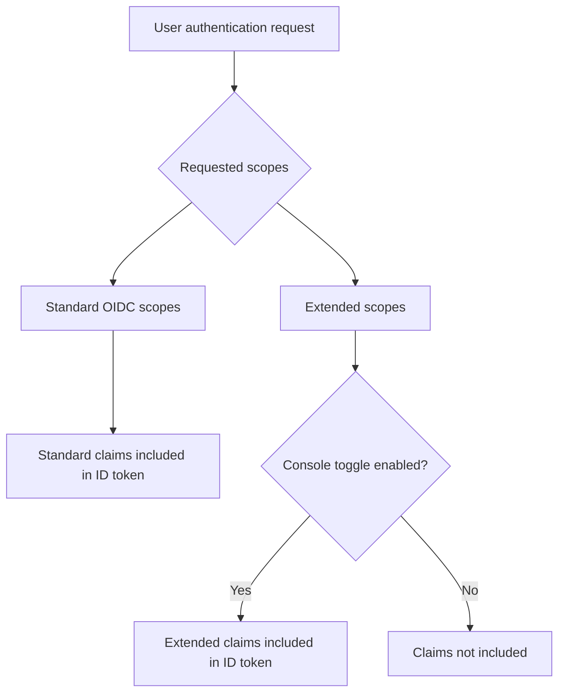
```mermaid
flowchart TD
    A[User authentication request] --> B{Requested scopes}
    B --> C[Standard OIDC scopes]
    B --> D[Extended scopes]
    C --> E[Standard claims included in ID token]
    D --> F{Console toggle enabled?}
    F -->|Yes| G[Extended claims included in ID token]
    F -->|No| H[Claims not included]
```

## Standard OIDC claims \{#standard-oidc-claims}

Standard claims are completely governed by the OIDC specification. Their inclusion in the ID token depends solely on the scopes your application requests during authentication. Logto does not provide any option to disable or selectively exclude individual standard claims.

The following table shows the mapping between standard scopes and their corresponding claims:

| Scope     | Claims                                                                                                                                                                           |
| --------- | -------------------------------------------------------------------------------------------------------------------------------------------------------------------------------- |
| `openid`  | `sub`                                                                                                                                                                            |
| `profile` | `name`, `family_name`, `given_name`, `middle_name`, `nickname`, `preferred_username`, `profile`, `picture`, `website`, `gender`, `birthdate`, `zoneinfo`, `locale`, `updated_at` |
| `email`   | `email`, `email_verified`                                                                                                                                                        |
| `phone`   | `phone_number`, `phone_number_verified`                                                                                                                                          |
| `address` | `address`                                                                                                                                                                        |

For example, if your application requests the `openid profile email` scopes, the ID token will include all claims from the `openid`, `profile`, and `email` scopes.

## Extended claims \{#extended-claims}

Beyond the standard OIDC claims, Logto extends additional claims that carry identity information specific to the Logto ecosystem. These extended claims follow a **dual-condition model** to be included in the ID token:

1. **Scope condition**: The application must request the corresponding scope during authentication.
2. **Console toggle**: The administrator must enable the claim's inclusion in the ID token through Logto Console.

Both conditions must be satisfied simultaneously. The scope serves as the protocol-layer access declaration, while the toggle serves as the product-layer exposure control — their responsibilities are clear and non-substitutable.

### Available extended scopes and claims \{#available-extended-scopes-and-claims}

| Scope                                | Claims                         | Description                             | Included by default |
| ------------------------------------ | ------------------------------ | --------------------------------------- | ------------------- |
| `custom_data`                        | `custom_data`                  | Custom data stored on the user object   |                     |
| `identities`                         | `identities`, `sso_identities` | User's linked social and SSO identities |                     |
| `roles`                              | `roles`                        | User's assigned roles                   | ✅                  |
| `urn:logto:scope:organizations`      | `organizations`                | User's organization IDs                 | ✅                  |
| `urn:logto:scope:organizations`      | `organization_data`            | User's organization data                |                     |
| `urn:logto:scope:organization_roles` | `organization_roles`           | User's organization role assignments    | ✅                  |

### Configure in Logto Console \{#configure-in-logto-console}

To enable extended claims in the ID token:

1. Navigate to <CloudLink to="/customize-jwt">Console > Custom JWT</CloudLink>.
2. Toggle on the claims you want to include in the ID token.
3. Ensure your application requests the corresponding scopes during authentication.

## Related resources \{#related-resources}


================================================================================
SOURCE: src/extraction/local-docs/lgoto/docs/developers/fragments/_token-exchange-prerequisites.mdx
================================================================================

:::info[Prerequisites]
Before using the token exchange grant, you need to enable it for your application:

1. Go to <CloudLink to="/applications">Console > Applications</CloudLink> and select your application.
2. In the application settings, find the "Token exchange" section.
3. Enable the "Allow token exchange" toggle.

Token exchange is disabled by default for security reasons. If you don't enable it, you will receive a "token exchange is not allowed for this application" error.
:::


================================================================================
SOURCE: src/extraction/local-docs/lgoto/docs/end-user-flows/one-time-token.mdx
================================================================================

---
sidebar_position: 5
---

# Magic link (One-time token)

Similar to one-time password (OTP), a one-time token is another passwordless authentication method that can be used to verify a user's identity.
The token is valid for a limited period of time, and associated with an email address of the end user.

Sometimes you may want to invite new users to your application / organization without requiring them to create an account first. In such cases, the application can send a "magic link" to your email. And you will be authenticated immediately when you click the link.

Application developers can use the one-time token to compose a magic link, and send it to the end user's email address.

## Use cases \{#use-cases}

Logto supports the following scenarios with magic links:

- **Invitation-only registration**: For internal tools or AI products in testing phase, you can disable public registration and invite specific users via magic links.
- **Organization member invitation**: For SaaS products, use magic links to invite new members to join an organization, streamlining the onboarding process.
- **Sign-in / Sign-up**: Send a magic link for passwordless sign-in or sign-up via email.

For example, when you've disabled public registration, you can send a magic link with a one-time token (e.g., `https://yourapp.com/landing-page?token=YHwbXSXxQfL02IoxFqr1hGvkB13uTqcd&email=user@example.com`) to the user's email to invite them to complete account creation. You can customize the email template in your own email delivery service, such as:


Yes, you can use the magic link to invite new users to your application, as well as organizations.
If you want to invite new users to your organization, simply specify the `jitOrganizationIds` in the request body.

The user will automatically join the organizations upon successful verification, and default organization roles will be assigned.
Check out the "Just-in-time provisioning" section in your organization details page, and configure the default roles for your organizations.


The magic link authentication flow does not support assigning roles to users. But you can always use the [Webhooks](/developers/webhooks) and [Management API](/user-management/manage-users#manage-roles-of-users) to update the user roles after the user is registered.


Yes, the one-time token will expire after the specified `expiresIn` time (in seconds). The default expiration time is 10 minutes.


Yes, you can still use magic link to invite users even if you disable user registration in "Sign-up and sign-in".


There are a number of possible scenarios:

1. The user is already signed in, and then clicks a magic link that associates with the current user account. In this case, Logto will still verify the one-time token, and provision the user to specified organizations if needed.
2. The user is already signed in, and then clicks a magic link that associates with a different account. In this case, Logto will prompt the user to continue as the new account, or go back to the application with the current account.
   1. If the user chooses to continue as the new account, Logto will switch to the new account after the token verification is successful.
   2. If the user chooses to stick to the current account, Logto will not verify the token and return to the application with the current account.
3. If your sign-in prompt is set to "login" or contains "login", Logto will automatically sign-in the account associated with the one-time token without prompting switch. This is because the "login" prompt indicates an explicit intent to authenticate, which takes precedence over the current session.


================================================================================
SOURCE: src/extraction/local-docs/lgoto/docs/end-user-flows/mfa/authenticator-app-otp.mdx
================================================================================

---
sidebar_position: 3
---

# Authenticator app OTP

## Concepts \{#concepts}

The Authenticator app, also referred to as the Software Token, is one of the most widely adopted [MFA](https://auth.wiki/mfa) methods. It generates temporary, [one-time passwords (OTP)](https://auth.wiki/otp) to enhance the security of online service authentication. Unlike physical hardware tokens, software tokens are typically applications or plugins that users install on their devices, be it a smartphone or a computer browser. Software tokens can operate locally on a single device or synchronize across various devices, depending on the authenticator's capabilities and individual user settings.

Popular examples of software tokens include Google Authenticator, Microsoft Authenticator, Duo, 1Password, Authy, and more.

## Configure authenticator app OTP for MFA \{#configure-authenticator-app-otp-for-mfa}

1. Navigate to <CloudLink to="/mfa">Console > Multi-factor authentication</CloudLink>
2. Enable the "Authenticator App OTP" factor. Recommend to use Authenticator App OTP in combination with other MFA factors (passkeys, SMS, backup codes) to reduce single-factor dependency.
3. Configure your preferred MFA policy (required vs. optional)
4. Save your configuration changes

## Configure authenticator app OTP management \{#configure-authenticator-app-otp-management}

You can use the Account API to build custom account management interfaces where users can add, view, and remove their authenticator app OTP settings. This is useful for creating personalized account centers and enabling cross-device backup scenarios.

For detailed implementation steps and API endpoints, see [Account settings by Account API](/end-user-flows/account-settings/by-account-api#link-a-new-totp).

## Authentication app OTP setup flows \{#authentication-app-otp-setup-flows}

1. **QR Code or Secret Key**: Users receive a QR code or a secret key from your service.
2. **Add account**: Using their authenticator app, users scan the QR code or manually enter the secret key to add their account.
3. **Dynamic one-time password**: The authenticator app displays a six-digit code that refreshes every 1-2 minutes for the added account.
4. **Complete MFA setup**: Users enter this code within its validity into the MFA setup page, completing the setup of Authenticator App OTP for MFA.


## Authentication app OTP verification flows \{#authentication-app-otp-verification-flows}

1. **Login attempt**: During login, users are prompted for MFA.
2. **Retrieve OTP**: Open their authenticator app to retrieve the OTP for the respective account.
3. **Enter OTP**: Users enter the OTP displayed in the app within its validity into the 2-step verification page.
4. **Authentication**: The system verifies the OTP, granting access upon successful validation.


================================================================================
SOURCE: src/extraction/local-docs/lgoto/docs/end-user-flows/mfa/webauthn.mdx
================================================================================

---
sidebar_position: 2
---

# Passkeys (WebAuthn)

[Passkey](https://auth.wiki/passkey) provides a more secure and user-friendly alternative to traditional passwords. By using public-key cryptography, passkey enhances security by linking the user's device, the service domain, and the user ID, effectively countering phishing and password attacks. Compatible with various devices or browsers, and allows users to employ biometrics and hardware security features for convenient authentication. [WebAuthn](https://auth.wiki/webauthn) provide the API to allow websites to implement passkey.

Logto supports passkeys (WebAuthn) for both [Multi-Factor Authentication (MFA)](/end-user-flows/mfa/configure-mfa) and [passkey sign-in](/end-user-flows/sign-up-and-sign-in/passkey-sign-in). The same underlying WebAuthn credential can be reused in both places, depending on your tenant configuration.

## Concepts \{#concepts}

Customers always know Passkeys rather than WebAuthn, so what’s the relationship between them, and how to use them? Let's explore these concepts:

- **Passkeys**: A passkey is a FIDO-based, phishing-resistant credential to replace passwords. It utilizes asymmetric public-key cryptography for enhanced security. It can be hardware tokens or security keys, such as USB or Bluetooth devices. Since "Passkeys" is the authentication method displayed to users, it should be used within your product client.
- **WebAuthn**: It is a JavaScript API developed by the W3C and FIDO Alliance, that empowers web applications authentication with FIDO2 standards. Passkeys is one of the authentication methods WebAuthn supports. In the Logto Console, we professionally refer to this integration as "WebAuthn.”

WebAuthn provides diverse authenticators for users to choose from, available in two types for local and cloud usage:

- **Platform authenticator (Internal authenticator)**: It is tied to a single and specific device OS, such as a computer, laptop, phone, or tablet, which the user signs in with. It works exclusively on the device for authorization using methods like biometrics or a device passcode, so it's a quick way to authenticate. E,g,. iCloud Keychain verified by Touch ID, Face ID, or device passcode on macOS or iOS; Windows Hello verified by facial recognition, fingerprint, or friendly PIN.
- **Roaming authenticator (External authenticator, Cross-platform authenticator)**: It is a separate, portable device or software application, such as a hardware security key or a smartphone. It should link the device using USB or keeping NFC or Bluetooth on. The roaming authenticator is not limited to a single device or browser, providing greater flexibility.

To delve deeper into the principles and processes of WebAuthn, you can refer to our blog posts: [WebAuthn and Passkeys 101](https://blog.logto.io/web-authn-and-passkey-101/) and [Things you should know before integrating WebAuthn](https://blog.logto.io/webauthn-base-knowledge/).

## Configure passkeys verification for MFA \{#configure-passkeys-verification-for-mfa}

1. Navigate to <CloudLink to="/mfa">Console > Multi-factor authentication</CloudLink>
2. Enable the "Passkeys (WebAuthn)" factor. Recommend to use Passkeys in combination with other MFA factors (TOTP, SMS, backup codes) to reduce single-factor dependency.
3. Configure your preferred MFA policy (required vs. optional)
4. Save your configuration changes

:::tip
If the same user signs in with [passkey sign-in](/end-user-flows/sign-up-and-sign-in/passkey-sign-in), Logto will skip the separate MFA verification step. A passkey sign-in already satisfies the WebAuthn-based verification requirement.
:::

:::note Pay attention to limitations

It's essential to be aware of some limitations when implementing WebAuthn:

1. **Platform and browser limitation**: It's important to note that Logto does not currently offer WebAuthn support for native applications. Additionally, the availability of WebAuthn authenticators depends on browser and device capabilities ([Check the list](https://caniuse.com/?search=webauthn)). Therefore, WebAuthn is always not the sole option for implementing Multi-Factor Authentication (MFA), otherwise, you can control which browsers and devices can access your product.
2. **Domain limitation**: Changing the domain can hinder user verification through their existing WebAuthn accounts. Passkeys are bound to the specific domain of the current web page and cannot be used across different domains.
3. **Device limitation**: Losing the device can result in a loss of access to their accounts, especially for those relying on "This device" Platform Authenticators. To enhance authentication access, it's advisable to provide users with more than one authentication factor.

:::

## Configure passkeys management \{#configure-passkeys-management}

You can use the Account API to build custom account management interfaces where users can add, view, rename, and remove their passkeys. This is useful for creating personalized account centers and enabling cross-device backup scenarios.

For detailed implementation steps and API endpoints, see [Account settings by Account API](/end-user-flows/account-settings/by-account-api#link-a-new-webauthn-passkey).

## Passkey setup flows \{#passkey-setup-flows}

The Passkeys specification requires users to actively click the button on the current page to initiate the authentication component. This means that in both the setup and verification flows, users should be redirected to the landing page to initiate WebAuthn.


## Passkey verification flows \{#passkey-verification-flows}

When users have set up multiple MFA methods including passkeys, passkey will be presented as the recommended MFA verification method on the first screen due to its enhanced security and convenience. Users can switch to other verification methods by clicking "Try another method to verify" below. Read [Configure MFA](/end-user-flows/mfa/configure-mfa#mfa-verification-flow) to learn more.

If the user completes the sign-in with [passkey sign-in](/end-user-flows/sign-up-and-sign-in/passkey-sign-in) instead of entering another first factor, Logto will not ask for an extra MFA step afterward. This is because the passkey itself is treated as a WebAuthn MFA factor.


## Related resources \{#related-resources}


================================================================================
SOURCE: src/extraction/local-docs/lgoto/docs/end-user-flows/authentication-parameters/first-screen.mdx
================================================================================

---
sidebar_position: 2
---

# First screen parameters

A set to custom authentication parameters that allow you to tailor the desired first screen experience for the end users.

- `first_screen`: Specifies the first screen that the user will see.
- `identifier`: Specifies the identifier types that the sign-in or sign-up form will accept.
- `login_hint`: Populates the identifier field with the user's email address or username. (This is a OIDC standard parameter)

## first_screen \{#first_screen}

The `first_screen` parameter is the key parameter that determines the first screen that the users will see when they redirect to the Logto's sign-in page. By default, the universal sign-in form will be displayed. Use this parameter to customize the first screen based on your application's requirements. Supported values are:

- `sign_in` (Default): Displays the sign-in form.
- `register`: Displays the sign-up form.
- `reset_password`: Displays the password reset form.
- `single_sign_on`: Displays the enterprise SSO sign-in form. (A email address will be asked to determine the enabled SSO providers)
- `identifier:sign-in`: Displays a identifier specific sign-in form. The identifier type can be specified using the `identifier` parameter (optional). This is useful when you have multiple identifier sign-in methods enabled.
- `identifier:register`: Displays a identifier specific sign-up form. The identifier type can be specified using the `identifier` parameter (optional). This is useful when you have multiple identifier sign-up methods enabled.


For example, sending users directly to the enterprise SSO sign-in form:

```sh
curl --location \
--request GET 'https://<your-tenant>.logto.app/oidc/auth?client_id=<client_id>&...&first_screen=single_sign_on'
```

:::tip
The first screen will follow the settings configured in <CloudLink to="/sign-in-experience/branding">Console > Sign-in & account</CloudLink>. You need to enable the required authentication methods first, and configure branding, terms and privacy policies, and internationalization (i18n). Note that only the `sign-in` and `register` pages display the logo by default.
:::

## identifier \{#identifier}

The `identifier` parameter is used to specify the identifier types that the sign-in or sign-up form will take. This parameter is only applicable when the `first_screen` parameter is set to `identifier:sign-in`, `identifier:register`, or `reset_password`. Supported values are: `username`, `email`, and `phone`. Separate multiple values with a empty space to allow multiple identifier types.

For example, sending users directly to the email or phone number sign-up page:

```sh
curl --location \
--request GET 'https://<your-tenant>.logto.app/oidc/auth?client_id=<client_id>&...&first_screen=identifier:register&identifier=email phone'
```

All the identifier types specified in this parameter must be enabled in your sign-in or sign-up settings in the Logto Console.

Any unsupported or disabled identifier types will be ignored. If all specified identifiers are unsupported, the default sign-in experience configuration will be used.

## login_hint \{#login_hint}

The `login_hint` parameter, defined in the standard [OpenID Connect specification](https://openid.net/specs/openid-connect-core-1_0.html#AuthorizationEndpoint), is used to pre-populate the sign-in form with the user's identifier (such as an email, a phone number or username). With Logto, it can be combined with other sign-in screen parameters to enhance the user experience. This parameter is especially useful if you have a custom pre-authentication form that collects the user's identifier in advance, allowing them to skip re-entering it during sign-in.

For example, pre-populating the collected email address in the sign-in form:

```sh
curl --location \
--request GET 'https://<your-tenant>.logto.app/oidc/auth?client_id=<client_id>&...&first_screen=identifier:sign_in&identifier=email&login_hint=example@logto.io
```

## SDK support \{#sdk-support}

In supported Logto SDKs, you can set the parameters when calling the `signIn` method:

```javascript
logtoClient.signIn({
  redirectUri: 'https://your-app.com/callback',
  firstScreen: 'identifier:register',
  identifier: ['email', 'phone'],
  loginHint: 'example@logto.io',
});
```

:::note
We are gradually adding support for the `first_screen`, `identifier`, and `login_hint` parameters to all Logto SDKs. If you don't see them in your SDK, please open an issue or contact us.

For [Logto OSS](/logto-oss) users, theses parameters are supported since version 1.15.0. If you are using an older version, please [upgrade](/logto-oss/upgrading-oss-version) to the latest version.
:::


================================================================================
SOURCE: src/extraction/local-docs/lgoto/docs/end-user-flows/authentication-parameters/direct-sign-in.mdx
================================================================================

---
sidebar_position: 3
---

# Direct sign-in

Direct sign-in is a Logto-specific [authentication parameter](/end-user-flows/authentication-parameters) that enables you to initiate social sign-in or enterprise SSO directly, bypassing the default universal Logto sign-in page.

This feature is especially useful if you have a custom sign-in page or IdP login entry point embedded on your website (View use cases). By using direct sign-in, you can redirect users directly to the IdP’s login page.

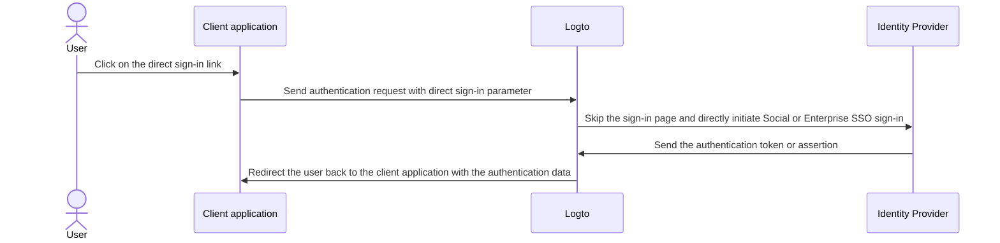
```mermaid
sequenceDiagram
    actor user as User
    participant app as Client application
    participant logto as Logto
    participant idp as Identity Provider

    user->>app: Click on the direct sign-in link
    app->>logto: Send authentication request with direct sign-in parameter
    logto->>idp: Skip the sign-in page and directly initiate Social or Enterprise SSO sign-in
    idp->>logto: Send the authentication token or assertion
    logto->>app: Redirect the user back to the client application with the authentication data
```

## Social sign-in \{#social-sign-in}

Pass the `direct_sign_in` parameter with the value `social:<idp-name>` to directly initiate the social sign-in process.

### Where to find the connector IdP name \{#where-to-find-the-connector-idp-name}

1. Navigate to <CloudLink to="/connectors/social">Console > Connectors > Social connectors</CloudLink>
2. Click on the [social connector](/connectors/social-connectors) you want to use.
3. Locate the identity provider name at the top of the connector settings page.


### Example \{#example}

Build your own authentication request URL with the `direct_sign_in` parameter:

```sh
curl --location \
  --request GET 'https://[tenant-id].logto.app/oidc/auth?client_id=1234567890&...&direct_sign_in=social:google'
```

In supported Logto SDKs, you can set the `directSignIn` parameter when calling the `signIn` method:

```javascript
const authResult = await logto.signIn({
  redirectUri: 'https://your-app.com/callback',
  directSignIn: 'social:google',
});
```

## Enterprise SSO \{#enterprise-sso}

Pass the `direct_sign_in` parameter with the value `sso:<connector-id>` to directly initiate the enterprise SSO sign-in process.

### Where to find the enterprise SSO connector ID \{#where-to-find-the-enterprise-sso-connector-id}

1. Navigate to <CloudLink to="/enterprise-sso">Console > Enterprise SSO</CloudLink>
2. Click on the [enterprise connector](/connectors/enterprise-connectors) you want to use.
3. Locate the connector ID at the top of the connector settings page.


### Example \{#example-1}

Build your own authentication request URL with the `direct_sign_in` parameter:

```sh
curl --location \
  --request GET 'https://[tenant-id].logto.app/oidc/auth?client_id=1234567890&...&direct_sign_in=sso:1234567890'
```

In supported Logto SDKs, you can set the `directSignIn` parameter when calling the `signIn` method:

```javascript
logtoClient.signIn({
  redirectUri: 'https://your-app.com/callback',
  directSignIn: 'sso:1234567890',
});
```

## Fallback to the sign-in page \{#fallback-to-the-sign-in-page}

If the direct sign-in process fails, e.g. the connector is not found or enabled, the user will be redirected to the standard sign-in page.

:::note
We are gradually adding support for the direct_sign_in parameter to all Logto SDKs. If you don't see it in your SDK, please open an issue or contact us.
:::

## FAQs \{#faqs}


No, direct sign-in is a user flow parameter that allows you to skip the default Logto sign-in page and redirect users directly to the social or enterprise SSO provider's login page. Unlike API based authentication, user still needs to be first redirected to the Logto authentication endpoint to initiate the sign-in process.


================================================================================
SOURCE: src/extraction/local-docs/lgoto/docs/end-user-flows/authentication-parameters/ui-locales.mdx
================================================================================

---
sidebar_position: 1
---

# UI locales

Logto supports the standard OIDC authentication parameter `ui_locales` to control the language of the sign-in experience and downstream communications for a given interaction.

## What it does \{#what-it-does}

- Determines the UI language of the Logto-hosted sign-in experience at runtime. Logto picks the first language tag in `ui_locales` that is supported in your tenant's language library.
- Affects email localization for messages triggered by the interaction (e.g., verification code emails). See [Email template localization](/connectors/email-connectors/email-templates#email-template-localization).
- Exposes the original value to email templates as a variable `uiLocales`, allowing you to include it in the email subject/content if needed.
- Sets the default phone number country code in the sign-in experience. For example, if `ui_locales=fr`, the phone number input field will default to France (+33). This is useful when you want to control the default country code programmatically for specific user groups or regions.

## Parameter format \{#parameter-format}

- Name: `ui_locales`
- Type: `string`
- Value: Space-separated list of BCP 47 language tags, e.g. `fr-CA fr en`.
- Reference: [OpenID Connect Core - ui_locales](https://openid.net/specs/openid-connect-core-1_0.html)

## Resolution order and precedence \{#resolution-order-and-precedence}

When determining the UI language for the sign-in experience and related emails, Logto resolves the end-user language using this order:

1. `ui_locales` from the current authentication request (first supported tag wins).
2. Otherwise, `Accept-Language` header (Experience APIs / User Account APIs) or `messagePayload.locale` (Management APIs like organization invitations).
3. Otherwise, the tenant's default language configured in Sign-in Experience.

This behavior does not permanently change your language settings; it only applies to the current interaction.

## SDK usage \{#sdk-usage}

If you're using a Logto SDK, pass `ui_locales` via the `extraParams` of the sign-in call so it is forwarded to the authorization request:

```ts
await logtoClient.signIn({
  redirectUri: 'https://your.app/callback',
  extraParams: {
    ui_locales: 'fr-CA fr en',
  },
});
```

## Examples \{#examples}

- `ui_locales=fr-CA fr en` → If `fr-CA` exists in your language library, the sign-in UI renders in French (Canada); otherwise it falls back to `fr`, then `en`.
- `ui_locales=ja` but Japanese is not enabled → Falls back to `Accept-Language` or tenant default.

## Related \{#related}

- [Localized languages](/customization/localized-languages)
- [Email templates](/connectors/email-connectors/email-templates#email-template-localization)
- [Authentication parameters](/end-user-flows/authentication-parameters)


================================================================================
SOURCE: src/extraction/local-docs/lgoto/docs/end-user-flows/authentication-parameters/README.mdx
================================================================================

---
sidebar_position: 4
---

# Authentication parameters

In a standard OIDC sign-in flow, client applications initiate an authentication request that redirects the user to the Logto hosted universal sign-in experience web page. Based on your sign-in experience settings, users can sign in or sign up using various identifiers, verification methods and third-party social or enterprise SSO connectors.

Logto also supports optional standard OIDC parameters such as:

- `login_hint`: Provide a hint for the user identifier, e.g., prefill email/username
- [`ui_locales`](/end-user-flows/authentication-parameters/ui-locales): Control the runtime language for the current interaction, including sign-in UI and related emails.

In addition to the standard [OIDC authentication parameters](https://openid.net/specs/openid-connect-core-1_0.html#AuthRequest), our product introduces several custom authentication parameters that allow you to tailor the desired sign-in experience for the end-users.

This is particularly useful when you want to enforce specific sign-in flows for different user segments. Including but not limited to the following scenarios:

### Direct sign-up for new users \{#direct-sign-up-for-new-users}

For a targeted registration campaign, you may want to direct new users straight to the sign-up page, bypassing the default sign-in form, to ensure a seamless onboarding experience.

**Use**: [First screen](/end-user-flows/authentication-parameters/first-screen) parameter → `first_screen=register`

### Email prefilled sign-up from homepage \{#email-prefilled-sign-up-from-homepage}

You often see an email sign-up input field prominently displayed on the homepage hero section, encouraging quick user registration. After users enter their email and click the "Start now" button, these parameters allow you to redirect them to the sign-up page with the email field pre-populated, streamlining the registration process.

This approach is also useful for subscription forms or other email collection scenarios where you want to reduce friction in the sign-up flow.

**Use**: [First screen](/end-user-flows/authentication-parameters/first-screen) parameter → `first_screen=identifier:sign_up&identifier=email&login_hint=foo@gmail.com`


================================================================================
SOURCE: src/extraction/local-docs/lgoto/docs/integrate-logto/saml-app/README.mdx
================================================================================

---
sidebar_position: 3
---

# SAML app

Logto supports integration as an [Identity Provider (IdP)](https://auth.wiki/identity-provider) with SAML protocol-based applications [Service Provider, SP](https://auth.wiki/service-provider). Through SAML app integration, you can provide enterprise users with a secure, standardized Single Sign-On (SSO) experience.

## Introduction \{#introduction}

SAML (Security Assertion Markup Language) is an XML-based open standard for exchanging authentication and authorization data between parties. In a SAML integration:

- **Logto as IdP**: Acts as the central authentication authority, managing user identities and issuing SAML assertions
- **Your Application as SP**: Relies on Logto to authenticate users and consumes SAML assertions for access control

### How SAML authentication works \{#how-saml-authentication-works}

SAML authentication in Logto primarily follows the SP-initiated flow, where the authentication process starts from your application (Service Provider). Here's a brief overview:

1. User attempts to access your application
2. Your application generates a SAML request and redirects the user to Logto
3. User authenticates with Logto
4. Logto generates a SAML response containing user information
5. Your application validates the response and grants access

For a more detailed explanation of SAML authentication flows and comparison with other protocols, check out our [authentication flow guide](/integrate-logto/integrate-logto-into-your-application/understand-authentication-flow.mdx#saml-authentication-flow).

### Benefits of SAML integration \{#benefits-of-saml-integration}

- **Enhanced Security**: Encrypted communication and digital signatures ensure secure data exchange
- **Simplified User Experience**: Users only need to sign in once to access multiple applications
- **Reduced Administrative Overhead**: Centralized user management and access control
- **Enterprise Readiness**: Widely adopted by organizations for secure identity federation

## Key Features \{#key-features}

- **Standardized Integration**: Full support for SAML 2.0 protocol, ensuring compatibility with various service providers
- **Flexible Attribute Mapping**: Support for custom user attribute mapping to meet different application data requirements
- **Secure and Reliable**: Support for signing and encryption to protect the authentication process
- **Automatic Configuration**: Support for quick SAML integration setup via metadata URL or file

## Use Cases \{#use-cases}

SAML app integration is suitable for the following scenarios:

- Enterprise application systems requiring Single Sign-On (SSO)
- Integration with third-party services supporting SAML protocol
- Requirements for high security and standardized authentication processes

## Create an SAML application in Logto \{#create-an-saml-application-in-logto}

1. Go to <CloudLink to="/applications">Console > Applications</CloudLink>
2. Select "My apps" as the application type and choose the following integration protocol "SAML"
3. Enter a name and description for your application and click on the “Create” button. A new SAML application will be created.

## Configuration Guide \{#configuration-guide}

To start using SAML app integration, you need to complete the following steps:

1. [Configure SAML App](/integrate-logto/saml-app/setup.mdx): Set up basic SAML integration parameters
2. [Configure Attribute Mapping](/integrate-logto/saml-app/attribute-mapping.mdx): Define how to map Logto user attributes to SAML assertions

After completing the configuration, your application can securely authenticate and exchange data with Logto through the SAML protocol.


================================================================================
SOURCE: src/extraction/local-docs/lgoto/docs/integrate-logto/saml-app/attribute-mapping.mdx
================================================================================

---
sidebar_position: 2
---

# Configure SAML assertion attributes

SAML attributes are key components of SAML assertions that carry specific information about the authenticated user. These attributes can include user identifiers, roles, permissions, and other relevant user data that the Service Provider (SP) may need for authorization and personalization purposes.

## Understanding SAML attributes \{#understanding-saml-attributes}

In SAML authentication:

- Attributes are name-value pairs that contain user information
- They are included in the SAML assertion sent from the Identity Provider (Logto) to the Service Provider
- They help Service Providers make informed decisions about user access and personalization


## Attribute mapping in Logto \{#attribute-mapping-in-logto}

Attribute mapping allows you to define how user information from Logto should be mapped to specific attributes in the SAML assertion. This mapping ensures that your Service Provider receives the user information in the expected format and under the expected attribute names.

When you configure attribute mapping:

1. You specify which user properties from Logto should be included in the SAML assertion
2. You define custom attribute names that your Service Provider expects
3. The mapped attributes are automatically included in the SAML assertion during authentication

### Common attributes \{#common-attributes}

Some commonly used SAML attributes include:

- Sub (User ID)
- Email
- Organizations
- Name
- Preferred username

[View all user data available from Logto](/user-management/user-data)

By properly configuring attribute mapping, you ensure that your Service Provider receives all the necessary user information to provide appropriate access and personalization for your users.

You can map all Logto available user information to your SP's expected attributes using the attribute mapping settings.


================================================================================
SOURCE: src/extraction/local-docs/lgoto/docs/integrate-logto/saml-app/setup.mdx
================================================================================

---
sidebar_position: 1
---

# Basic SAML integration setup

This guide will help you configure your SAML application in Logto. Follow these steps to set up the basic SAML integration.

## Application settings \{#application-settings}

### Basic information \{#basic-information}

- **Application name** (Required): Enter a name for your SAML application. This name will help you identify the application in Logto.
- **Description**: Add an optional description to provide more details about your application.

### SAML service provider configuration \{#saml-service-provider-configuration}

- **Assertion consumer service URL (Reply URL)** (Required): Enter the URL where Logto should send the SAML assertion after successful authentication. This URL should match the ACS URL provided in your Service Provider (SP) application.

- **Service Provider (SP) Entity ID** (Required): Enter the unique identifier for your Service Provider. This value should match the Entity ID found in your SP application. The SP Entity ID is a string input that typically follows a URI format (but not necessary).
  - Common formats include:
    - `urn:your-domain.com:sp:saml:{serviceProviderId}`
    - `https://your-domain/saml/{serviceProviderId}`

## SAML IdP metadata \{#saml-idp-metadata}

After configuring the basic settings, Logto will provide you with important SAML Identity Provider (IdP) metadata that you'll need to configure in your Service Provider:

### IdP metadata URL \{#idp-metadata-url}

Use this URL to configure your SP with the IdP metadata. The metadata contains all necessary information for SAML integration.

### Single sign-on service URL \{#single-sign-on-service-url}

This is the URL where your SP should send SAML authentication requests.

### IdP entity ID \{#idp-entity-id}

The unique identifier for the Identity Provider.

:::note
"Single sign-on service URL" and "IdP entity ID" have already been included in IdP metadata, so you don't need to configure it separately if your SP can handle metadata URL.
:::

### SAML signing certificate \{#saml-signing-certificate}

Logto uses this certificate to sign SAML assertions. You'll need to configure this in your SP to verify the signatures:

- **Expires at**: The certificate's expiration date
- **Fingerprint**: The certificate's unique fingerprint for verification
- **Status**: The current status of the certificate (Active or Inactive)


:::note Important certificate management rules

- Only one certificate can be active at a time. The active certificate will be used in the IdP metadata URL.
- The IdP metadata URL will not be available if there is no active certificate.
- You cannot delete an active certificate. To delete a certificate, you must first deactivate it.
- When you activate an inactive certificate, the currently active certificate will be automatically deactivated.

:::

### Additional settings \{#additional-settings}

#### Name ID format \{#name-id-format}

Select how you want the user identifier to be formatted in the SAML assertion. The default is "Persistent" which uses the Logto user ID as the Name ID.


You can find there are four available formats provided by Logto:

- **Persistent** (Use Logto user ID as Name ID): Creates a permanent, non-reusable identifier that remains consistent across sessions. This is ideal for maintaining a stable user identity across multiple sign-ins and is recommended for most enterprise applications.

- **Email address** (Use email address as Name ID): Uses the user's email address as the identifier. This is useful when your Service Provider relies on email addresses for user identification or when you need human-readable identifiers.

- **Transient** (Use one-time user ID as Name ID): Generates a temporary, one-time identifier that changes with each authentication request. This provides enhanced privacy and is suitable for applications where persistent user tracking is not desired.

- **Unspecified** (Use Logto user ID as Name ID for now): Similar to Persistent format but indicates that no specific format is required. This offers flexibility while still using the stable Logto user ID as the identifier.

#### Encrypt SAML assertion \{#encrypt-saml-assertion}

Toggle this option if you want to encrypt the SAML assertion for enhanced security. When enabled, the SAML assertion will be encrypted before being sent to your SP.


:::note
When you enable SAML assertion encryption, you must provide your Service Provider's signing certificate. This certificate will be used to encrypt the SAML assertion, ensuring that only your SP can decrypt and read the assertion content.
:::


================================================================================
SOURCE: src/extraction/local-docs/lgoto/docs/integrate-logto/integrate-logto-into-your-application/understand-authentication-flow.mdx
================================================================================

---
description: Explain the core OIDC authentication flows for end-users and machine-to-machine interactions, highlighting token exchange.
sidebar_label: Understand authentication flow
---

# Understand OIDC authentication flow

Logto is built on [OAuth 2.0](https://auth.wiki/oauth-2.0) and [OpenID Connect (OIDC)](https://auth.wiki/openid-connect) standards. Understanding these authentication standards will make the integration process smoother and more straightforward.

### User authentication flow \{#user-authentication-flow}

Here's what happens when a user signs in with Logto:

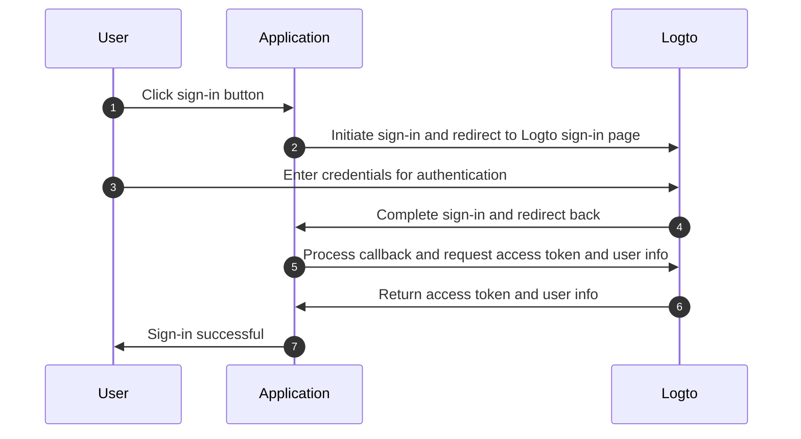
```mermaid
sequenceDiagram
    autonumber
    participant User
    participant Application
    participant Logto

    User->>Application: Click sign-in button
    Application->>Logto: Initiate sign-in and redirect to Logto sign-in page
    User->>Logto: Enter credentials for authentication
    Logto->>Application: Complete sign-in and redirect back
    Application->>Logto: Process callback and request access token and user info
    Logto->>Application: Return access token and user info
    Application->>User: Sign-in successful
```

In this flow, several key concepts are essential for the integration process:

- `Application`: This represents your app in Logto. You'll create an application configuration in the Logto Console to establish a connection between your actual application and Logto services. Learn more about [Application](/integrate-logto/application-data-structure/#introduction).
- `Redirect URI`: After users complete authentication on the Logto sign-in page, Logto redirects them back to your application through this URI. You'll need to configure the Redirect URI in your Application settings. For more details, see [Redirect URIs](/integrate-logto/application-data-structure/#redirect-uris).
- `Handle sign-in callback`: When Logto redirects users back to your application, your app needs to process the authentication data and request access tokens and user information. Don't worry - the Logto SDK handles this automatically.

This overview covers the essentials for quick integration. For a deeper understanding, check out our [Sign-in experience explained](/concepts/sign-in-experience/) guide.

### Machine-to-machine authentication flow \{#machine-to-machine-authentication-flow}

Logto provides [machine-to-machine (M2M) application](/quick-starts/m2m) type to enable direct authentication between services, based on [OAuth 2.0 Client Credentials flow](https://auth.wiki/client-credentials-flow):

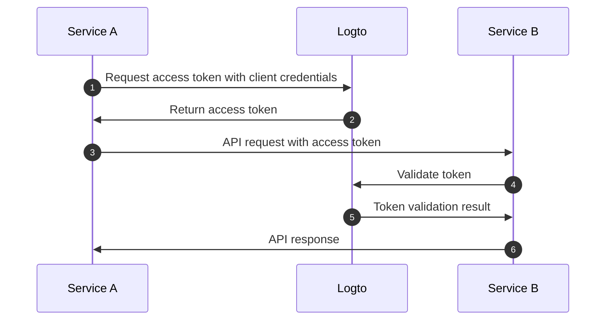
```mermaid
sequenceDiagram
    autonumber
    participant Service A
    participant Logto
    participant Service B

    Service A->>Logto: Request access token with client credentials
    Logto->>Service A: Return access token
    Service A->>Service B: API request with access token
    Service B->>Logto: Validate token
    Logto->>Service B: Token validation result
    Service B->>Service A: API response
```

This machine-to-machine (M2M) authentication flow is designed for applications that need to directly communicate with resources without user interaction (thus no UI), such as an API service updating user data in Logto or a statistics service pulling daily orders.

In this flow, services authenticate using client credentials - a combination of [Application ID](/integrate-logto/application-data-structure/#application-id) and [Application Secret](/integrate-logto/application-data-structure/#application-secret) that uniquely identifies and authenticates the service. These credentials serve as the service's identity when requesting [access tokens](https://auth.wiki/access-token) from Logto.

### Device flow (input-limited devices) \{#device-flow}

For devices with limited input capabilities (e.g., smart TVs, game consoles, CLI tools, IoT devices), Logto supports the [OAuth 2.0 Device Authorization Grant](https://auth.wiki/device-flow). The device displays a code and URL, while the user completes authentication on a separate device with a browser:

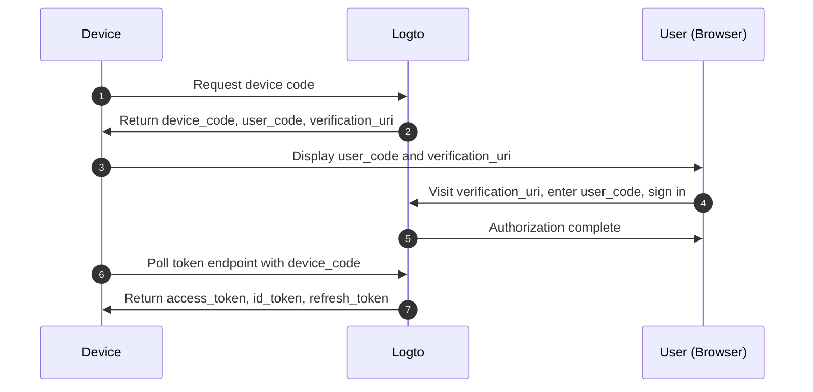
```mermaid
sequenceDiagram
    autonumber
    participant Device
    participant Logto
    participant User as User (Browser)

    Device->>Logto: Request device code
    Logto->>Device: Return device_code, user_code, verification_uri
    Device->>User: Display user_code and verification_uri
    User->>Logto: Visit verification_uri, enter user_code, sign in
    Logto->>User: Authorization complete
    Device->>Logto: Poll token endpoint with device_code
    Logto->>Device: Return access_token, id_token, refresh_token
```

In this flow:

- The device requests a device code from Logto, receiving a short `user_code` and a `verification_uri`.
- The user visits the verification URL on another device (phone, laptop), enters the code, and signs in.
- The device polls the token endpoint until the user completes authorization, then receives tokens.

Unlike the standard user flow, device flow does not require redirect URIs or browser capabilities on the device itself. Learn more in the [Device flow quick start](/quick-starts/device-flow).

### SAML authentication flow \{#saml-authentication-flow}

Besides OAuth 2.0 and OIDC, Logto also supports SAML (Security Assertion Markup Language) authentication, acting as an Identity Provider (IdP) to enable integration with enterprise applications. Currently, Logto supports SP-initiated authentication flow:

#### SP-initiated flow \{#saml-authentication-flow-sp-init}

In SP-initiated flow, the authentication process starts from the Service Provider (your application):

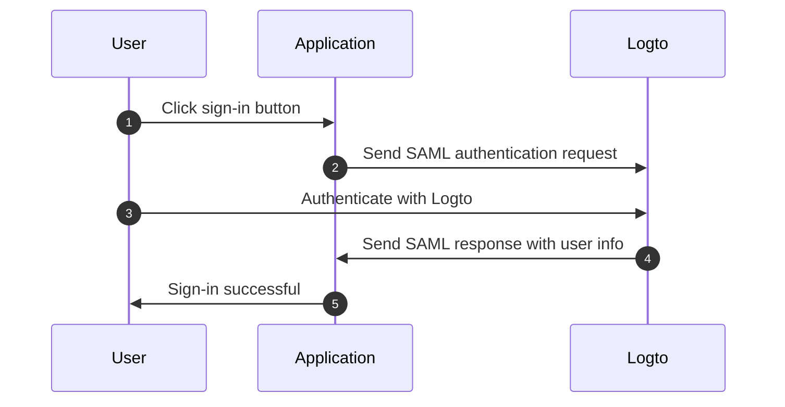
```mermaid
sequenceDiagram
    autonumber
    participant User
    participant Application
    participant Logto

    User->>Application: Click sign-in button
    Application->>Logto: Send SAML authentication request
    User->>Logto: Authenticate with Logto
    Logto->>Application: Send SAML response with user info
    Application->>User: Sign-in successful
```

In this flow:

- The user starts the authentication process from your application (Service Provider)
- Your application generates a SAML request and redirects the user to Logto (Identity Provider)
- After successful authentication at Logto, a SAML response is sent back to your application
- Your application processes the SAML response and completes the authentication

#### IdP-initiated flow \{#saml-authentication-flow-idp-init}

Logto will support IdP-initiated flow in future releases, enabling users to start the authentication process directly from Logto's portal. Stay tuned for updates on this feature.

This SAML integration enables enterprise applications to leverage Logto as their identity provider, supporting both modern and legacy SAML-based service providers.

## Related resources \{#related-resources}


================================================================================
SOURCE: src/extraction/local-docs/lgoto/docs/user-management/personal-access-token.mdx
================================================================================

---
sidebar_position: 4
---


# Personal access token

Personal access tokens (PATs) provide a secure way for users to grant [access token](https://auth.wiki/access-token) without using their credentials and interactive sign-in. This is useful for CI/CD, scripts, or applications that need to access resources programmatically.

## Managing personal access tokens \{#managing-personal-access-tokens}

### Using Console \{#using-console}

You can manage personal access tokens in the User Details page of the <CloudLink to="/users">Console > User management</CloudLink>. In the card "Authentication", you can see the list of personal access tokens and create new ones.

### Using Management API \{#using-management-api}

After setting up the [Management API](/integrate-logto/interact-with-management-api/), you can use the [API endpoints](https://openapi.logto.io/operation/operation-listuserpersonalaccesstokens) to create, list, and delete personal access tokens.

## Use PATs to grant access tokens \{#use-pats-to-grant-access-tokens}

After creating a PAT, you can use it to grant access tokens to your application by using the token exchange endpoint.

:::tip Token flow equivalency

Access tokens obtained using PATs work **identically** to tokens obtained through the standard `refresh_token` flow. This means:

- **Organization context**: PAT-obtained tokens support the same organization permissions and scopes as refresh token flows
- **Authorization flow**: You can use PAT-exchanged access tokens for [organization permissions](/authorization/organization-permissions) and [organization-level API resources](/authorization/organization-level-api-resources)
- **Token validation**: The same validation logic applies - only the initial grant type differs

If you're working with organizations, the access patterns and permissions are the same regardless of whether you use PAT or refresh tokens.

:::

### Request \{#request}


The application makes a [token exchange request](https://auth.wiki/authorization-code-flow#token-exchange-request) to the tenant's [token endpoint](/integrate-logto/application-data-structure#token-endpoint) with a special grant type using the HTTP POST method. The following parameters are included in the HTTP request entity-body using the `application/x-www-form-urlencoded` format.

1. `client_id`: REQUIRED. The client ID of the application.
2. `grant_type`: REQUIRED. The value of this parameter must be `urn:ietf:params:oauth:grant-type:token-exchange` indicates that a token exchange is being performed.
3. `resource`: OPTIONAL. The resource indicator, the same as other token requests.
4. `scope`: OPTIONAL. The requested scopes, the same as other token requests.
5. `subject_token`: REQUIRED. The user's PAT.
6. `subject_token_type`: REQUIRED. The type of the security token provided in the `subject_token` parameter. The value of this parameter must be `urn:logto:token-type:personal_access_token`.

### Response \{#response}

If the token exchange request is successful, the tenant's token endpoint returns an access token that represents the identity of the user. The response includes the following parameters in the HTTP response entity-body using the `application/json` format.

1. `access_token`: REQUIRED. The access token of the user, which is the same as other token requests like `authorization_code` or `refresh_token`.
2. `issued_token_type`: REQUIRED. The type of the issued token. The value of this parameter must be `urn:ietf:params:oauth:token-type:access_token`.
3. `token_type`: REQUIRED. The type of the token. The value of this parameter must be `Bearer`.
4. `expires_in`: REQUIRED. The lifetime in seconds of the access token.
5. `scope`: OPTIONAL. The scopes of the access token.

### Example token exchange \{#example-token-exchange}

For traditional web applications or machine-to-machine applications with app secret, include the credentials in the `Authorization` header using HTTP Basic authentication:

```bash
POST /oidc/token HTTP/1.1
Host: tenant.logto.app
Content-Type: application/x-www-form-urlencoded
# highlight-next-line
Authorization: Basic <base64(app-id:app-secret)>

grant_type=urn:ietf:params:oauth:grant-type:token-exchange
&resource=http://my-api.com
&scope=read
&subject_token=pat_W51arOqe7nynW75nWhvYogyc
&subject_token_type=urn:logto:token-type:personal_access_token
```

For single-page applications (SPA) or native applications without app secret, include `client_id` in the request body:

```bash
POST /oidc/token HTTP/1.1
Host: tenant.logto.app
Content-Type: application/x-www-form-urlencoded

# highlight-next-line
client_id=your-app-id
&grant_type=urn:ietf:params:oauth:grant-type:token-exchange
&resource=http://my-api.com
&scope=read
&subject_token=pat_W51arOqe7nynW75nWhvYogyc
&subject_token_type=urn:logto:token-type:personal_access_token
```

A successful response:

```
HTTP/1.1 200 OK
Content-Type: application/json

{
  "access_token": "eyJhbGci...zg",
  "token_type": "Bearer",
  "expires_in": 3600,
  "scope": "read"
}
```

Then if you decode the access token with [JWT decoder](https://logto.io/jwt-decoder), you'll get the following example access token payload:

```json
{
  "jti": "VovNyqJ5_tuYac89eTbpF",
  "sub": "rkxl1ops7gs1",
  "iat": 1756908403,
  "exp": 1756912003,
  "scope": "read",
  "client_id": "your-app-id",
  "iss": "https://tenant-id.logto.app/oidc",
  "aud": "http://my-api.com"
}
```

## Related resources \{#related-resources}


================================================================================
SOURCE: src/extraction/local-docs/lgoto/docs/api-protection/README.mdx
================================================================================

---
sidebar_label: Introduction
---

# API protection

Learn how to implement [role-based access control (RBAC)](/authorization/role-based-access-control) and [JSON Web Token (JWT)](https://auth.wiki/jwt) validation to protect your API endpoints from unauthorized access.

Our guides cover middleware setup, permission models, and practical examples across multiple programming languages and frameworks.

## Get started \{#get-started}

### New to API security? \{#new-to-api-security}

If you're new to API authentication and authorization, start with these fundamentals:

- **[Authentication vs. authorization](/concepts/authn-vs-authz)**: Understand the key differences
- **[Role-based access control (RBAC)](/authorization/role-based-access-control)**: Learn how permissions and roles work
- **[JSON Web Token (JWT)](https://auth.wiki/jwt)**: Discover how JSON Web Tokens secure your APIs

### Choose your language or framework \{#choose-your-language-or-framework}

Ready to implement API protection? Select your technology stack from the sidebar to get step-by-step integration guides with code examples and best practices.


================================================================================
SOURCE: src/extraction/local-docs/lgoto/docs/api-protection/ruby/README.mdx
================================================================================


# Protect your Ruby API with RBAC and JWT validation

Learn how to secure your Ruby APIs using [role-based access control (RBAC)](/authorization/role-based-access-control) and [JSON Web Token (JWT)](https://auth.wiki/jwt) validation.

{/* WARNING: We cannot use variables in the headings or introductory text since it will not be rendered correctly. */}

Each page covers implementation patterns, middleware setup, and detailed examples for different permission models to help you protect your API endpoints with proper authentication and authorization.

Choose your framework to get started:


================================================================================
SOURCE: src/extraction/local-docs/lgoto/docs/api-protection/nodejs/README.mdx
================================================================================


# Protect your Node.js API with RBAC and JWT validation

Learn how to secure your Node.js APIs using [role-based access control (RBAC)](/authorization/role-based-access-control) and [JSON Web Token (JWT)](https://auth.wiki/jwt) validation.

{/* WARNING: We cannot use variables in the headings or introductory text since it will not be rendered correctly. */}

Each page covers implementation patterns, middleware setup, and detailed examples for different permission models to help you protect your API endpoints with proper authentication and authorization.

Choose your framework to get started:


================================================================================
SOURCE: src/extraction/local-docs/lgoto/docs/api-protection/java/README.mdx
================================================================================


# Protect your Java API with RBAC and JWT validation

Learn how to secure your Java APIs using [role-based access control (RBAC)](/authorization/role-based-access-control) and [JSON Web Token (JWT)](https://auth.wiki/jwt) validation.

{/* WARNING: We cannot use variables in the headings or introductory text since it will not be rendered correctly. */}

Each page covers implementation patterns, middleware setup, and detailed examples for different permission models to help you protect your API endpoints with proper authentication and authorization.

Choose your framework to get started:


================================================================================
SOURCE: src/extraction/local-docs/lgoto/docs/api-protection/python/README.mdx
================================================================================


# Protect your Python API with RBAC and JWT validation

Learn how to secure your Python APIs using [role-based access control (RBAC)](/authorization/role-based-access-control) and [JSON Web Token (JWT)](https://auth.wiki/jwt) validation.

{/* WARNING: We cannot use variables in the headings or introductory text since it will not be rendered correctly. */}

Each page covers implementation patterns, middleware setup, and detailed examples for different permission models to help you protect your API endpoints with proper authentication and authorization.

Choose your framework to get started:


================================================================================
SOURCE: src/extraction/local-docs/lgoto/docs/api-protection/dotnet/README.mdx
================================================================================


# Protect your .NET API with RBAC and JWT validation

Learn how to secure your .NET APIs using [role-based access control (RBAC)](/authorization/role-based-access-control) and [JSON Web Token (JWT)](https://auth.wiki/jwt) validation.

{/* WARNING: We cannot use variables in the headings or introductory text since it will not be rendered correctly. */}

Each page covers implementation patterns, middleware setup, and detailed examples for different permission models to help you protect your API endpoints with proper authentication and authorization.

Choose your framework to get started:


================================================================================
SOURCE: src/extraction/local-docs/lgoto/docs/api-protection/go/README.mdx
================================================================================


# Protect your Go API with RBAC and JWT validation

Learn how to secure your Go APIs using [role-based access control (RBAC)](/authorization/role-based-access-control) and [JSON Web Token (JWT)](https://auth.wiki/jwt) validation.

{/* WARNING: We cannot use variables in the headings or introductory text since it will not be rendered correctly. */}

Each page covers implementation patterns, middleware setup, and detailed examples for different permission models to help you protect your API endpoints with proper authentication and authorization.

Choose your framework to get started:


================================================================================
SOURCE: src/extraction/local-docs/lgoto/docs/api-protection/rust/README.mdx
================================================================================


# Protect your Rust API with RBAC and JWT validation

Learn how to secure your Rust APIs using [role-based access control (RBAC)](/authorization/role-based-access-control) and [JSON Web Token (JWT)](https://auth.wiki/jwt) validation.

{/* WARNING: We cannot use variables in the headings or introductory text since it will not be rendered correctly. */}

Each page covers implementation patterns, middleware setup, and detailed examples for different permission models to help you protect your API endpoints with proper authentication and authorization.

Choose your framework to get started:


================================================================================
SOURCE: src/extraction/local-docs/lgoto/docs/api-protection/php/README.mdx
================================================================================


# Protect your PHP API with RBAC and JWT validation

Learn how to secure your PHP APIs using [role-based access control (RBAC)](/authorization/role-based-access-control) and [JSON Web Token (JWT)](https://auth.wiki/jwt) validation.

{/* WARNING: We cannot use variables in the headings or introductory text since it will not be rendered correctly. */}

Each page covers implementation patterns, middleware setup, and detailed examples for different permission models to help you protect your API endpoints with proper authentication and authorization.

Choose your framework to get started:


================================================================================
SOURCE: src/extraction/local-docs/lgoto/docs/api-protection/fragments/_main-content.mdx
================================================================================


## Initialize your API project \{#initialize-your-api-project}

{/* WARNING: Do not put sub-headings inside the `props.initializeProject` content since it will NOT be rendered as a sub-heading in the sidebar. */}
{props.initializeProject}

## Initialize constants and utilities \{#initialize-constants-and-utilities}


{/* WARNING: Do not put sub-headings inside the `props.initializeProject` content since it will NOT be rendered as a sub-heading in the sidebar. */}
{props.languageInit}

## Retrieve info about your Logto tenant \{#retrieve-info-about-your-logto-tenant}


## Validate the token and permissions \{#validate-the-token-and-permissions}


### Add the validation logic \{#add-the-validation-logic}

{/* WARNING: Do not put sub-headings inside the `props.initializeProject` content since it will NOT be rendered as a sub-heading in the sidebar. */}
{props.addValidationLogic}

## Apply the middleware to your API \{#apply-the-middleware-to-your-api}

Now, apply the middleware to your protected API routes.

{/* WARNING: Do not put sub-headings inside the `props.applyMiddleware` content since it will NOT be rendered as a sub-heading in the sidebar. */}
{props.applyMiddleware}

## Test your protected API \{#test-your-protected-api}


================================================================================
SOURCE: src/extraction/local-docs/lgoto/docs/api-protection/fragments/_quick-preparation-steps.mdx
================================================================================


## Quick preparation steps \{#quick-preparation-steps}

### Configure Logto resources & permissions \{#configure-logto-resources-permissions}


:::tip New to RBAC?
Start with our [Role-based access control guide](/authorization/role-based-access-control) for step-by-step setup instructions.
:::

### Update your client application \{#update-your-client-application}

**Request appropriate scopes in your client:**

- User authentication: [Update your app →](/quick-starts) to request your API scopes and/or organization context
- Machine-to-machine: [Configure M2M scopes →](/quick-starts/m2m) for server-to-server access

The process usually involves updating your client configuration to include one or more of the following:

- `scope` parameter in OAuth flows
- `resource` parameter for API resource access
- `organization_id` for organization context

:::tip Before you code
Make sure the user or M2M app you are testing has been assigned proper roles or organization roles that include the necessary permissions for your API.
:::


================================================================================
SOURCE: src/extraction/local-docs/lgoto/docs/api-protection/fragments/_permission-models-overview.mdx
================================================================================


## Permission models overview \{#permission-models-overview}

Before implementing protection, choose the permission model that fits your application architecture. This aligns with Logto's three main [authorization scenarios](/authorization#authorization-scenarios):


**💡 Choose your model before proceeding** - the implementation will reference your chosen approach throughout this guide.


================================================================================
SOURCE: src/extraction/local-docs/lgoto/docs/api-protection/fragments/_further-reading.mdx
================================================================================

## Further reading \{#further-reading}


================================================================================
SOURCE: src/extraction/local-docs/lgoto/docs/api-protection/fragments/_before-you-start.mdx
================================================================================


## Before you start \{#before-you-start}

Your client applications need to obtain access tokens from Logto. If you haven't set up client integration yet, check out our [Quick starts](/quick-starts) for React, Vue, Angular, or other client frameworks, or see our [Machine-to-machine guide](/quick-starts/m2m) for server-to-server access.

This guide focuses on the **server-side validation** of those tokens in your {getFrameworkName(props.framework)} application.


================================================================================
SOURCE: src/extraction/local-docs/lgoto/docs/api-protection/ruby/sinatra/_init-project.mdx
================================================================================

To initialize a new Sinatra project, create a directory and set up the basic structure:

```bash
mkdir your-api-name
cd your-api-name
```

Create a Gemfile:

```ruby title="Gemfile"
source 'https://rubygems.org'

gem 'sinatra'
```

Install dependencies:

```bash
bundle install
```

Create a basic Sinatra application:

```ruby title="app.rb"
require 'sinatra'
require 'json'

get '/' do
  content_type :json
  { message: 'Hello from Sinatra API' }.to_json
end
```

Start the development server:

```bash
ruby app.rb
```

:::note
Refer to the Sinatra documentation for more details on how to set up routes, middleware, and other features.
:::


================================================================================
SOURCE: src/extraction/local-docs/lgoto/docs/api-protection/ruby/sinatra/README.mdx
================================================================================

---
sidebar_label: Sinatra
---


# Protect your Sinatra API with RBAC and JWT validation

This guide will help you implement authorization to secure your Sinatra APIs using [Role-based access control (RBAC)](/authorization/role-based-access-control) and [JSON Web Tokens (JWTs)](https://auth.wiki/jwt) issued by Logto.

{/* WARNING: We cannot use variables in the headings or introductory text since it will not be rendered correctly. */}


================================================================================
SOURCE: src/extraction/local-docs/lgoto/docs/api-protection/ruby/grape/_init-project.mdx
================================================================================

To initialize a new Grape API project, create a directory and set up the basic structure:

```bash
mkdir your-api-name
cd your-api-name
```

Create a Gemfile:

```ruby title="Gemfile"
source 'https://rubygems.org'

gem 'grape'
```

Install dependencies:

```bash
bundle install
```

Create a basic Grape API:

```ruby title="api.rb"
require 'grape'

class API < Grape::API
  format :json

  get :hello do
    { message: 'Hello from Grape API' }
  end
end
```

Create a config.ru file:

```ruby title="config.ru"
require_relative 'api'

run API
```

Start the development server:

```bash
bundle exec rackup
```

:::note
Refer to the Grape documentation for more details on how to set up resources, parameters validation, and other features.
:::


================================================================================
SOURCE: src/extraction/local-docs/lgoto/docs/api-protection/ruby/grape/README.mdx
================================================================================

---
sidebar_label: Grape
---


# Protect your Grape API with RBAC and JWT validation

This guide will help you implement authorization to secure your Grape APIs using [Role-based access control (RBAC)](/authorization/role-based-access-control) and [JSON Web Tokens (JWTs)](https://auth.wiki/jwt) issued by Logto.

{/* WARNING: We cannot use variables in the headings or introductory text since it will not be rendered correctly. */}


================================================================================
SOURCE: src/extraction/local-docs/lgoto/docs/api-protection/ruby/rails/_init-project.mdx
================================================================================

To initialize a new Rails API project, you can use the Rails generator:

```bash
rails new your-api-name --api
cd your-api-name
```

Start the development server:

```bash
rails server
```

Create a basic API controller:

```ruby title="app/controllers/api/base_controller.rb"
class Api::BaseController < ApplicationController
  def index
    render json: { message: 'Hello from Rails API' }
  end
end
```

Add routes:

```ruby title="config/routes.rb"
Rails.application.routes.draw do
  namespace :api do
    root 'base#index'
  end
end
```

:::note
Refer to the Rails documentation for more details on how to set up controllers, models, and other features.
:::


================================================================================
SOURCE: src/extraction/local-docs/lgoto/docs/api-protection/ruby/rails/README.mdx
================================================================================

---
sidebar_label: Ruby on Rails
---


# Protect your Ruby on Rails API with RBAC and JWT validation

This guide will help you implement authorization to secure your Ruby on Rails APIs using [Role-based access control (RBAC)](/authorization/role-based-access-control) and [JSON Web Tokens (JWTs)](https://auth.wiki/jwt) issued by Logto.

{/* WARNING: We cannot use variables in the headings or introductory text since it will not be rendered correctly. */}


================================================================================
SOURCE: src/extraction/local-docs/lgoto/docs/api-protection/nodejs/express/_init-project.mdx
================================================================================

To initialize a new Node.js project with Express, you can follow these steps:

```bash
npm init -y
npm install express
```

If you are using TypeScript, remember to set up your TypeScript environment accordingly.

Then, create a basic Express server setup:

```ts title="app.ts"

const app = express();

app.listen(3000, () => {
  console.log('Server running on http://localhost:3000');
});
```

:::note
Refer to the Express documentation for more details on how to set up routes, middleware, and other features.
:::


================================================================================
SOURCE: src/extraction/local-docs/lgoto/docs/api-protection/nodejs/express/README.mdx
================================================================================

---
sidebar_label: Express.js
---


# Protect your Express.js API with RBAC and JWT validation

This guide will help you implement authorization to secure your Express.js APIs using [Role-based access control (RBAC)](/authorization/role-based-access-control) and [JSON Web Tokens (JWTs)](https://auth.wiki/jwt) issued by Logto.

{/* WARNING: We cannot use variables in the headings or introductory text since it will not be rendered correctly. */}


================================================================================
SOURCE: src/extraction/local-docs/lgoto/docs/api-protection/nodejs/hapi/_init-project.mdx
================================================================================

To initialize a new Node.js project with Hapi, you can follow these steps:

```bash
npm init -y
npm install @hapi/hapi
```

If you are using TypeScript, remember to set up your TypeScript environment accordingly.

Then, create a basic Hapi server setup:

```ts title="app.ts"

const server = Hapi.server({
  port: 3000,
  host: 'localhost',
});

await server.start();
console.log('Server running on http://localhost:3000');
```

:::note
Refer to the Hapi documentation for more details on how to set up routes, plugins, and other features.
:::


================================================================================
SOURCE: src/extraction/local-docs/lgoto/docs/api-protection/nodejs/hapi/README.mdx
================================================================================

---
sidebar_label: Hapi.js
---


# Protect your Hapi.js API with RBAC and JWT validation

This guide will help you implement authorization to secure your Hapi.js APIs using [Role-based access control (RBAC)](/authorization/role-based-access-control) and [JSON Web Tokens (JWTs)](https://auth.wiki/jwt) issued by Logto.

{/* WARNING: We cannot use variables in the headings or introductory text since it will not be rendered correctly. */}


================================================================================
SOURCE: src/extraction/local-docs/lgoto/docs/api-protection/nodejs/koa/_init-project.mdx
================================================================================

To initialize a new Node.js project with Koa, you can follow these steps:

```bash
npm init -y
npm install koa @koa/router
```

If you are using TypeScript, remember to set up your TypeScript environment accordingly.

Then, create a basic Koa server setup:

```ts title="app.ts"

const app = new Koa();

app.listen(3000, () => {
  console.log('Server running on http://localhost:3000');
});
```

:::note
Refer to the Koa documentation for more details on how to set up routes, middleware, and other features.
:::


================================================================================
SOURCE: src/extraction/local-docs/lgoto/docs/api-protection/nodejs/koa/README.mdx
================================================================================

---
sidebar_label: Koa.js
---


# Protect your Koa.js API with RBAC and JWT validation

This guide will help you implement authorization to secure your Koa.js APIs using [Role-based access control (RBAC)](/authorization/role-based-access-control) and [JSON Web Tokens (JWTs)](https://auth.wiki/jwt) issued by Logto.

{/* WARNING: We cannot use variables in the headings or introductory text since it will not be rendered correctly. */}


================================================================================
SOURCE: src/extraction/local-docs/lgoto/docs/api-protection/nodejs/nestjs/_init-project.mdx
================================================================================

To initialize a new Node.js project with NestJS, you can use the Nest CLI for a quick setup. Here are the steps:

```bash
npm i -g @nestjs/cli
nest new my-api
cd my-api
```

Alternatively, you can create a project manually:

```bash
npm init -y
npm install @nestjs/core @nestjs/common @nestjs/platform-express reflect-metadata rxjs
```

If you are using TypeScript, remember to set up your TypeScript environment accordingly.

Then, create a basic NestJS server setup:

```ts title="main.ts"

async function bootstrap() {
  const app = await NestFactory.create(AppModule);
  await app.listen(3000);
  console.log('Server running on http://localhost:3000');
}
bootstrap();
```

```ts title="app.module.ts"

@Module({
  imports: [],
  controllers: [AppController],
  providers: [AppService],
})
```

:::note
Refer to the NestJS documentation for more details on how to set up controllers, services, and other features. You can also explore the NestJS CLI commands for generating components and modules easily.
:::


================================================================================
SOURCE: src/extraction/local-docs/lgoto/docs/api-protection/nodejs/nestjs/README.mdx
================================================================================

---
sidebar_label: NestJS
---


# Protect your NestJS API with RBAC and JWT validation

This guide will help you implement authorization to secure your NestJS APIs using [Role-based access control (RBAC)](/authorization/role-based-access-control) and [JSON Web Tokens (JWTs)](https://auth.wiki/jwt) issued by Logto.

{/* WARNING: We cannot use variables in the headings or introductory text since it will not be rendered correctly. */}


================================================================================
SOURCE: src/extraction/local-docs/lgoto/docs/api-protection/nodejs/fastify/_init-project.mdx
================================================================================

To initialize a new Node.js project with Fastify, you can follow these steps:

```bash
npm init -y
npm install fastify
```

If you are using TypeScript, remember to set up your TypeScript environment accordingly.

Then, create a basic Fastify server setup:

```ts title="app.ts"

const server = fastify({ logger: true });

try {
  await server.listen({ port: 3000 });
  console.log('Server running on http://localhost:3000');
} catch (err) {
  server.log.error(err);
  process.exit(1);
}
```

:::note
Refer to the Fastify documentation for more details on how to set up routes, plugins, and other features.
:::


================================================================================
SOURCE: src/extraction/local-docs/lgoto/docs/api-protection/nodejs/fastify/README.mdx
================================================================================

---
sidebar_label: Fastify
---


# Protect your Fastify API with RBAC and JWT validation

This guide will help you implement authorization to secure your Fastify APIs using [Role-based access control (RBAC)](/authorization/role-based-access-control) and [JSON Web Tokens (JWTs)](https://auth.wiki/jwt) issued by Logto.

{/* WARNING: We cannot use variables in the headings or introductory text since it will not be rendered correctly. */}


================================================================================
SOURCE: src/extraction/local-docs/lgoto/docs/api-protection/java/vertx-web/_init-project.mdx
================================================================================

To initialize a new Vert.x Web project, you can create a Maven project manually:

```xml title="pom.xml"

```

Create a basic Vert.x Web server:

```java title="src/main/java/com/example/MainVerticle.java"
package com.example;


public class MainVerticle extends AbstractVerticle {

    @Override
    public void start(Promise<Void> startPromise) throws Exception {
        Router router = Router.router(vertx);

        router.route().handler(BodyHandler.create());

        router.get("/hello").handler(ctx -> {
            ctx.response()
                .putHeader("content-type", "text/plain")
                .end("Hello from Vert.x Web!");
        });

        vertx.createHttpServer()
            .requestHandler(router)
            .listen(3000, http -> {
                if (http.succeeded()) {
                    startPromise.complete();
                    System.out.println("HTTP server started on port 3000");
                } else {
                    startPromise.fail(http.cause());
                }
            });
    }
}
```

```java title="src/main/java/com/example/Application.java"
package com.example;


public class Application {
    public static void main(String[] args) {
        Vertx vertx = Vertx.vertx();
        vertx.deployVerticle(new MainVerticle());
    }
}
```

:::note
Refer to the Vert.x Web documentation for more details on how to set up routes, handlers, and other features.
:::


================================================================================
SOURCE: src/extraction/local-docs/lgoto/docs/api-protection/java/vertx-web/README.mdx
================================================================================

---
sidebar_label: Vert.x Web
---


# Protect your Vert.x Web API with RBAC and JWT validation

This guide will help you implement authorization to secure your Vert.x Web APIs using [Role-based access control (RBAC)](/authorization/role-based-access-control) and [JSON Web Tokens (JWTs)](https://auth.wiki/jwt) issued by Logto.

{/* WARNING: We cannot use variables in the headings or introductory text since it will not be rendered correctly. */}


================================================================================
SOURCE: src/extraction/local-docs/lgoto/docs/api-protection/java/spring-boot/_init-project.mdx
================================================================================

To initialize a new Spring Boot project, you can use Spring Initializr or follow these steps:

Visit [Spring Initializr](https://start.spring.io/) and select:

- Project: Maven
- Language: Java
- Spring Boot: latest stable version
- Dependencies: Spring Web, Spring Security

Or create manually:

```xml title="pom.xml"


```

Create a basic Spring Boot application:

```java title="src/main/java/com/example/Application.java"
package com.example;


@SpringBootApplication
public class Application {
    public static void main(String[] args) {
        SpringApplication.run(Application.class, args);
    }
}
```

:::note
Refer to the Spring Boot documentation for more details on how to set up controllers, services, and other features.
:::


================================================================================
SOURCE: src/extraction/local-docs/lgoto/docs/api-protection/java/spring-boot/README.mdx
================================================================================

---
sidebar_label: Spring Boot
---


# Protect your Spring Boot API with RBAC and JWT validation

This guide will help you implement authorization to secure your Spring Boot APIs using [Role-based access control (RBAC)](/authorization/role-based-access-control) and [JSON Web Tokens (JWTs)](https://auth.wiki/jwt) issued by Logto.

{/* WARNING: We cannot use variables in the headings or introductory text since it will not be rendered correctly. */}


================================================================================
SOURCE: src/extraction/local-docs/lgoto/docs/api-protection/java/micronaut/_init-project.mdx
================================================================================

To initialize a new Micronaut project, you can use the Micronaut CLI or visit Micronaut Launch:

Using Micronaut CLI:

```bash
mn create-app com.example.your-api-name \
    --features=security-jwt,http-server-netty \
    --build=maven \
    --lang=java
cd your-api-name
```

Or visit [Micronaut Launch](https://micronaut.io/launch/) and select:

- Application Type: Micronaut Application
- Java Version: 17
- Build: Maven
- Features: security-jwt, http-server-netty

This will create a basic Micronaut project:

```xml title="pom.xml"

```

Create a basic controller:

```java title="src/main/java/com/example/HelloController.java"
package com.example;


@Controller("/hello")
public class HelloController {

    @Get
    @Produces(MediaType.TEXT_PLAIN)
    public String index() {
        return "Hello World";
    }
}
```

:::note
Refer to the Micronaut documentation for more details on how to set up controllers, services, and other features.
:::


================================================================================
SOURCE: src/extraction/local-docs/lgoto/docs/api-protection/java/micronaut/README.mdx
================================================================================

---
sidebar_label: Micronaut
---


# Protect your Micronaut API with RBAC and JWT validation

This guide will help you implement authorization to secure your Micronaut APIs using [Role-based access control (RBAC)](/authorization/role-based-access-control) and [JSON Web Tokens (JWTs)](https://auth.wiki/jwt) issued by Logto.

{/* WARNING: We cannot use variables in the headings or introductory text since it will not be rendered correctly. */}


================================================================================
SOURCE: src/extraction/local-docs/lgoto/docs/api-protection/java/quarkus/_init-project.mdx
================================================================================

To initialize a new Quarkus project, you can use the Quarkus CLI or Maven:

Using Quarkus CLI:

```bash
quarkus create app com.example:your-api-name \
    --extension='resteasy-reactive,smallrye-jwt'
cd your-api-name
```

Or using Maven:

```bash
mvn io.quarkus.platform:quarkus-maven-plugin:3.6.0:create \
    -DprojectGroupId=com.example \
    -DprojectArtifactId=your-api-name \
    -Dextensions="resteasy-reactive,smallrye-jwt"
cd your-api-name
```

This will create a basic Quarkus project with the necessary dependencies:

```xml title="pom.xml"
```

Create a basic resource:

```java title="src/main/java/com/example/ExampleResource.java"
package com.example;


@Path("/hello")
public class ExampleResource {

    @GET
    @Produces(MediaType.TEXT_PLAIN)
    public String hello() {
        return "Hello from Quarkus REST";
    }
}
```

:::note
Refer to the Quarkus documentation for more details on how to set up resources, services, and other features.
:::


================================================================================
SOURCE: src/extraction/local-docs/lgoto/docs/api-protection/java/quarkus/README.mdx
================================================================================

---
sidebar_label: Quarkus
---


# Protect your Quarkus API with RBAC and JWT validation

This guide will help you implement authorization to secure your Quarkus APIs using [Role-based access control (RBAC)](/authorization/role-based-access-control) and [JSON Web Tokens (JWTs)](https://auth.wiki/jwt) issued by Logto.

{/* WARNING: We cannot use variables in the headings or introductory text since it will not be rendered correctly. */}


================================================================================
SOURCE: src/extraction/local-docs/lgoto/docs/api-protection/python/flask/_init-project.mdx
================================================================================

To initialize a new Flask project, create a directory and set up the basic structure:

```bash
mkdir your-api-name
cd your-api-name
```

Create a requirements file:

```txt title="requirements.txt"
Flask
```

Install dependencies:

```bash
pip install -r requirements.txt
```

Create a basic Flask application:

```py title="app.py"
from flask import Flask, jsonify

app = Flask(__name__)

@app.route('/')
def hello():
    return jsonify({"message": "Hello from Flask"})

if __name__ == '__main__':
    app.run(debug=True)
```

Start the development server:

```bash
python app.py
```

:::note
Refer to the Flask documentation for more details on how to set up routes, blueprints, and other features.
:::


================================================================================
SOURCE: src/extraction/local-docs/lgoto/docs/api-protection/python/flask/README.mdx
================================================================================

---
sidebar_label: Flask
---


# Protect your Flask API with RBAC and JWT validation

This guide will help you implement authorization to secure your Flask APIs using [Role-based access control (RBAC)](/authorization/role-based-access-control) and [JSON Web Tokens (JWTs)](https://auth.wiki/jwt) issued by Logto.

{/* WARNING: We cannot use variables in the headings or introductory text since it will not be rendered correctly. */}


================================================================================
SOURCE: src/extraction/local-docs/lgoto/docs/api-protection/python/fastapi/_init-project.mdx
================================================================================

To initialize a new FastAPI project, create a directory and set up the basic structure:

```bash
mkdir your-api-name
cd your-api-name
```

Create a requirements file:

```txt title="requirements.txt"
fastapi
uvicorn[standard]
```

Install dependencies:

```bash
pip install -r requirements.txt
```

Create a basic FastAPI application:

```py title="main.py"
from fastapi import FastAPI

app = FastAPI()

@app.get("/")
def read_root():
    return {"message": "Hello from FastAPI"}
```

Start the development server:

```bash
uvicorn main:app --reload
```

:::note
Refer to the FastAPI documentation for more details on how to set up path operations, dependency injection, and other features.
:::


================================================================================
SOURCE: src/extraction/local-docs/lgoto/docs/api-protection/python/fastapi/README.mdx
================================================================================

---
sidebar_label: FastAPI
---


# Protect your FastAPI with RBAC and JWT validation

This guide will help you implement authorization to secure your FastAPI APIs using [Role-based access control (RBAC)](/authorization/role-based-access-control) and [JSON Web Tokens (JWTs)](https://auth.wiki/jwt) issued by Logto.

{/* WARNING: We cannot use variables in the headings or introductory text since it will not be rendered correctly. */}


================================================================================
SOURCE: src/extraction/local-docs/lgoto/docs/api-protection/python/django-rest/_init-project.mdx
================================================================================

To initialize a new Django REST Framework project:

```bash
django-admin startproject your_api_name
cd your_api_name
```

Install required packages:

```bash
pip install Django djangorestframework
```

Create a basic Django app:

```bash
python manage.py startapp api
```

Add DRF to settings:

```py title="your_api_name/settings.py"
INSTALLED_APPS = [
    'django.contrib.admin',
    'django.contrib.auth',
    'django.contrib.contenttypes',
    'django.contrib.sessions',
    'django.contrib.messages',
    'django.contrib.staticfiles',
    'rest_framework',
    'api',
]
```

Create a basic API view:

```py title="api/views.py"
from rest_framework.decorators import api_view
from rest_framework.response import Response

@api_view(['GET'])
def hello_view(request):
    return Response({"message": "Hello from Django REST Framework"})
```

Add URL configuration:

```py title="api/urls.py"
from django.urls import path
from . import views

urlpatterns = [
    path('', views.hello_view, name='hello'),
]
```

```py title="your_api_name/urls.py"
from django.contrib import admin
from django.urls import path, include

urlpatterns = [
    path('admin/', admin.site.urls),
    path('api/', include('api.urls')),
]
```

Start the development server:

```bash
python manage.py runserver
```

:::note
Refer to the Django REST Framework documentation for more details on how to set up serializers, viewsets, and other features.
:::


================================================================================
SOURCE: src/extraction/local-docs/lgoto/docs/api-protection/python/django-rest/README.mdx
================================================================================

---
sidebar_label: Django REST Framework
---


# Protect your Django REST Framework API with RBAC and JWT validation

This guide will help you implement authorization to secure your Django REST Framework APIs using [Role-based access control (RBAC)](/authorization/role-based-access-control) and [JSON Web Tokens (JWTs)](https://auth.wiki/jwt) issued by Logto.

{/* WARNING: We cannot use variables in the headings or introductory text since it will not be rendered correctly. */}


================================================================================
SOURCE: src/extraction/local-docs/lgoto/docs/api-protection/python/django/_init-project.mdx
================================================================================

To initialize a new Django project, you can use Django's built-in commands:

```bash
django-admin startproject your_api_name
cd your_api_name
```

Install Django if you haven't already:

```bash
pip install Django
```

Create a basic Django app:

```bash
python manage.py startapp api
```

Create a basic API view:

```py title="api/views.py"
from django.http import JsonResponse

def hello_view(request):
    return JsonResponse({"message": "Hello from Django"})
```

Add URL configuration:

```py title="api/urls.py"
from django.urls import path
from . import views

urlpatterns = [
    path('', views.hello_view, name='hello'),
]
```

```py title="your_api_name/urls.py"
from django.contrib import admin
from django.urls import path, include

urlpatterns = [
    path('admin/', admin.site.urls),
    path('api/', include('api.urls')),
]
```

Start the development server:

```bash
python manage.py runserver
```

:::note
Refer to the Django documentation for more details on how to set up models, views, and other features.
:::


================================================================================
SOURCE: src/extraction/local-docs/lgoto/docs/api-protection/python/django/README.mdx
================================================================================

---
sidebar_label: Django
---


# Protect your Django API with RBAC and JWT validation

This guide will help you implement authorization to secure your Django APIs using [Role-based access control (RBAC)](/authorization/role-based-access-control) and [JSON Web Tokens (JWTs)](https://auth.wiki/jwt) issued by Logto.

{/* WARNING: We cannot use variables in the headings or introductory text since it will not be rendered correctly. */}


================================================================================
SOURCE: src/extraction/local-docs/lgoto/docs/api-protection/dotnet/aspnet-core/_init-project.mdx
================================================================================

To initialize a new .NET Web API project, you can use the .NET CLI:

```bash
dotnet new webapi -n YourApiName
cd YourApiName
```

Add the required NuGet package for JWT authentication:

```bash
dotnet add package Microsoft.AspNetCore.Authentication.JwtBearer
```

Create a basic API controller:

```csharp title="Controllers/ApiController.cs"
using Microsoft.AspNetCore.Mvc;

namespace YourApiName.Controllers
{
    [ApiController]
    [Route("api/[controller]")]
    public class ApiController : ControllerBase
    {
        [HttpGet]
        public IActionResult Get()
        {
            return Ok(new { message = "Hello from .NET API" });
        }
    }
}
```

Start the development server:

```bash
dotnet run
```

:::note
Refer to the ASP.NET Core documentation for more details on how to set up controllers, middleware, and other features.
:::


================================================================================
SOURCE: src/extraction/local-docs/lgoto/docs/api-protection/dotnet/aspnet-core/README.mdx
================================================================================

---
sidebar_label: ASP.NET Core
---


# Protect your ASP.NET Core API with RBAC and JWT validation

This guide will help you implement authorization to secure your ASP.NET Core APIs using [Role-based access control (RBAC)](/authorization/role-based-access-control) and [JSON Web Tokens (JWTs)](https://auth.wiki/jwt) issued by Logto.

{/* WARNING: We cannot use variables in the headings or introductory text since it will not be rendered correctly. */}


================================================================================
SOURCE: src/extraction/local-docs/lgoto/docs/api-protection/go/gin/_init-project.mdx
================================================================================

To initialize a new Go project with Gin, you can follow these steps:

```bash
go mod init your-api-name
go get github.com/gin-gonic/gin
```

Then, create a basic Gin server setup:

```go title="main.go"
package main

    "github.com/gin-gonic/gin"
)

func main() {
    r := gin.Default()

    r.Run(":3000") // listen and serve on 0.0.0.0:3000
}
```

:::note
Refer to the Gin documentation for more details on how to set up routes, middleware, and other features.
:::


================================================================================
SOURCE: src/extraction/local-docs/lgoto/docs/api-protection/go/gin/README.mdx
================================================================================

---
sidebar_label: Gin
---


# Protect your Gin API with RBAC and JWT validation

This guide will help you implement authorization to secure your Gin APIs using [Role-based access control (RBAC)](/authorization/role-based-access-control) and [JSON Web Tokens (JWTs)](https://auth.wiki/jwt) issued by Logto.

{/* WARNING: We cannot use variables in the headings or introductory text since it will not be rendered correctly. */}


================================================================================
SOURCE: src/extraction/local-docs/lgoto/docs/api-protection/go/chi/_init-project.mdx
================================================================================

To initialize a new Go project with Chi, you can follow these steps:

```bash
go mod init your-api-name
go get github.com/go-chi/chi/v5
```

Then, create a basic Chi server setup:

```go title="main.go"
package main

    "net/http"

    "github.com/go-chi/chi/v5"
)

func main() {
    r := chi.NewRouter()

    http.ListenAndServe(":3000", r)
}
```

:::note
Refer to the Chi documentation for more details on how to set up routes, middleware, and other features.
:::


================================================================================
SOURCE: src/extraction/local-docs/lgoto/docs/api-protection/go/chi/README.mdx
================================================================================

---
sidebar_label: Chi
---


# Protect your Chi API with RBAC and JWT validation

This guide will help you implement authorization to secure your Chi APIs using [Role-based access control (RBAC)](/authorization/role-based-access-control) and [JSON Web Tokens (JWTs)](https://auth.wiki/jwt) issued by Logto.

{/* WARNING: We cannot use variables in the headings or introductory text since it will not be rendered correctly. */}


================================================================================
SOURCE: src/extraction/local-docs/lgoto/docs/api-protection/go/echo/_init-project.mdx
================================================================================

To initialize a new Go project with Echo, you can follow these steps:

```bash
go mod init your-api-name
go get github.com/labstack/echo/v4
```

Then, create a basic Echo server setup:

```go title="main.go"
package main

    "github.com/labstack/echo/v4"
)

func main() {
    e := echo.New()

    e.Logger.Fatal(e.Start(":3000"))
}
```

:::note
Refer to the Echo documentation for more details on how to set up routes, middleware, and other features.
:::


================================================================================
SOURCE: src/extraction/local-docs/lgoto/docs/api-protection/go/echo/README.mdx
================================================================================

---
sidebar_label: Echo
---


# Protect your Echo API with RBAC and JWT validation

This guide will help you implement authorization to secure your Echo APIs using [Role-based access control (RBAC)](/authorization/role-based-access-control) and [JSON Web Tokens (JWTs)](https://auth.wiki/jwt) issued by Logto.

{/* WARNING: We cannot use variables in the headings or introductory text since it will not be rendered correctly. */}


================================================================================
SOURCE: src/extraction/local-docs/lgoto/docs/api-protection/go/fiber/_init-project.mdx
================================================================================

To initialize a new Go project with Fiber, you can follow these steps:

```bash
go mod init your-api-name
go get github.com/gofiber/fiber/v2
```

Then, create a basic Fiber server setup:

```go title="main.go"
package main

    "log"

    "github.com/gofiber/fiber/v2"
)

func main() {
    app := fiber.New()

    log.Fatal(app.Listen(":3000"))
}
```

:::note
Refer to the Fiber documentation for more details on how to set up routes, middleware, and other features.
:::


================================================================================
SOURCE: src/extraction/local-docs/lgoto/docs/api-protection/go/fiber/README.mdx
================================================================================

---
sidebar_label: Fiber
---


# Protect your Fiber API with RBAC and JWT validation

This guide will help you implement authorization to secure your Fiber APIs using [Role-based access control (RBAC)](/authorization/role-based-access-control) and [JSON Web Tokens (JWTs)](https://auth.wiki/jwt) issued by Logto.

{/* WARNING: We cannot use variables in the headings or introductory text since it will not be rendered correctly. */}


================================================================================
SOURCE: src/extraction/local-docs/lgoto/docs/api-protection/rust/actix-web/_init-project.mdx
================================================================================

To initialize a new Actix Web project, create a directory and set up the basic structure:

```bash
cargo new your-api-name
cd your-api-name
```

Add Actix Web dependencies to your `Cargo.toml`:

```toml title="Cargo.toml"
[dependencies]
actix-web = "4.0"
tokio = { version = "1.0", features = ["full"] }
serde = { version = "1.0", features = ["derive"] }
serde_json = "1.0"
```

Create a basic Actix Web application:

```rust title="src/main.rs"
use actix_web::{web, App, HttpServer, Result};
use serde_json::{json, Value};

#[actix_web::main]
async fn main() -> std::io::Result<()> {
    HttpServer::new(|| {
        App::new()
            .route("/", web::get().to(hello_handler))
    })
    .bind("127.0.0.1:8080")?
    .run()
    .await
}

async fn hello_handler() -> Result<web::Json<Value>> {
    Ok(web::Json(json!({ "message": "Hello from Actix Web" })))
}
```

Start the development server:

```bash
cargo run
```

:::note
Refer to the Actix Web documentation for more details on how to set up routes, middleware, and other features.
:::


================================================================================
SOURCE: src/extraction/local-docs/lgoto/docs/api-protection/rust/actix-web/README.mdx
================================================================================

---
sidebar_label: Actix Web
---


# Protect your Actix Web API with RBAC and JWT validation

This guide will help you implement authorization to secure your Actix Web APIs using [Role-based access control (RBAC)](/authorization/role-based-access-control) and [JSON Web Tokens (JWTs)](https://auth.wiki/jwt) issued by Logto.

{/* WARNING: We cannot use variables in the headings or introductory text since it will not be rendered correctly. */}


================================================================================
SOURCE: src/extraction/local-docs/lgoto/docs/api-protection/rust/rocket/_init-project.mdx
================================================================================

To initialize a new Rocket project, create a directory and set up the basic structure:

```bash
cargo new your-api-name
cd your-api-name
```

Add Rocket dependencies to your `Cargo.toml`:

```toml title="Cargo.toml"
[dependencies]
rocket = { version = "0.5", features = ["json"] }
serde = { version = "1.0", features = ["derive"] }
serde_json = "1.0"
```

Create a basic Rocket application:

```rust title="src/main.rs"
use rocket::{get, launch, routes, serde::json::Json};
use serde_json::{json, Value};

#[get("/")]
fn hello_handler() -> Json<Value> {
    Json(json!({ "message": "Hello from Rocket" }))
}

#[launch]
fn rocket() -> _ {
    rocket::build()
        .mount("/", routes![hello_handler])
}
```

Start the development server:

```bash
cargo run
```

:::note
Refer to the Rocket documentation for more details on how to set up routes, request guards, and other features.
:::


================================================================================
SOURCE: src/extraction/local-docs/lgoto/docs/api-protection/rust/rocket/README.mdx
================================================================================

---
sidebar_label: Rocket
---


# Protect your Rocket API with RBAC and JWT validation

This guide will help you implement authorization to secure your Rocket APIs using [Role-based access control (RBAC)](/authorization/role-based-access-control) and [JSON Web Tokens (JWTs)](https://auth.wiki/jwt) issued by Logto.

{/* WARNING: We cannot use variables in the headings or introductory text since it will not be rendered correctly. */}


================================================================================
SOURCE: src/extraction/local-docs/lgoto/docs/api-protection/rust/axum/_init-project.mdx
================================================================================

To initialize a new Axum project, create a directory and set up the basic structure:

```bash
cargo new your-api-name
cd your-api-name
```

Add Axum dependencies to your `Cargo.toml`:

```toml title="Cargo.toml"
[dependencies]
axum = "0.7"
tokio = { version = "1.0", features = ["full"] }
tower = "0.4"
serde = { version = "1.0", features = ["derive"] }
serde_json = "1.0"
```

Create a basic Axum application:

```rust title="src/main.rs"
use axum::{
    response::Json,
    routing::get,
    Router,
};
use serde_json::{json, Value};

#[tokio::main]
async fn main() {
    let app = Router::new()
        .route("/", get(hello_handler));

    let listener = tokio::net::TcpListener::bind("0.0.0.0:3000").await.unwrap();
    axum::serve(listener, app).await.unwrap();
}

async fn hello_handler() -> Json<Value> {
    Json(json!({ "message": "Hello from Axum" }))
}
```

Start the development server:

```bash
cargo run
```

:::note
Refer to the Axum documentation for more details on how to set up routes, middleware, and other features.
:::


================================================================================
SOURCE: src/extraction/local-docs/lgoto/docs/api-protection/rust/axum/README.mdx
================================================================================

---
sidebar_label: Axum
---


# Protect your Axum API with RBAC and JWT validation

This guide will help you implement authorization to secure your Axum APIs using [Role-based access control (RBAC)](/authorization/role-based-access-control) and [JSON Web Tokens (JWTs)](https://auth.wiki/jwt) issued by Logto.

{/* WARNING: We cannot use variables in the headings or introductory text since it will not be rendered correctly. */}


================================================================================
SOURCE: src/extraction/local-docs/lgoto/docs/api-protection/php/laravel/_init-project.mdx
================================================================================

To initialize a new Laravel project, you can use the Laravel installer or Composer:

Using Laravel installer (recommended):

```bash
composer global require laravel/installer
laravel new your-api-name
cd your-api-name
```

Or using Composer directly:

```bash
composer create-project laravel/laravel your-api-name
cd your-api-name
```

Start the development server:

```bash
php artisan serve
```

This will create a basic Laravel project structure. For API development, you might want to remove some web-specific middleware and routes:

```php title="bootstrap/app.php"


================================================================================
SOURCE: src/extraction/local-docs/lgoto/docs/api-protection/php/laravel/README.mdx
================================================================================

---
sidebar_label: Laravel
---


# Protect your Laravel API with RBAC and JWT validation

This guide will help you implement authorization to secure your Laravel APIs using [Role-based access control (RBAC)](/authorization/role-based-access-control) and [JSON Web Tokens (JWTs)](https://auth.wiki/jwt) issued by Logto.

{/* WARNING: We cannot use variables in the headings or introductory text since it will not be rendered correctly. */}


================================================================================
SOURCE: src/extraction/local-docs/lgoto/docs/api-protection/php/slim/_init-project.mdx
================================================================================

To initialize a new Slim project, you can use Composer to create the project structure:

```bash
mkdir your-api-name
cd your-api-name
composer init
```

Install Slim Framework and required dependencies:

```bash
composer require slim/slim:"4.*"
composer require slim/psr7
composer require slim/http
```

Create the basic project structure:

```bash
mkdir -p public src/Middleware src/Controllers
```

Create a basic Slim application:

```php title="public/index.php"


================================================================================
SOURCE: src/extraction/local-docs/lgoto/docs/api-protection/php/slim/README.mdx
================================================================================

---
sidebar_label: Slim
---


# Protect your Slim API with RBAC and JWT validation

This guide will help you implement authorization to secure your Slim APIs using [Role-based access control (RBAC)](/authorization/role-based-access-control) and [JSON Web Tokens (JWTs)](https://auth.wiki/jwt) issued by Logto.

{/* WARNING: We cannot use variables in the headings or introductory text since it will not be rendered correctly. */}


================================================================================
SOURCE: src/extraction/local-docs/lgoto/docs/api-protection/php/symfony/_init-project.mdx
================================================================================

To initialize a new Symfony project for API development, use the Symfony CLI or Composer:

Using Symfony CLI (recommended):

```bash
symfony new your-api-name --webapp
cd your-api-name
```

Or using Composer:

```bash
composer create-project symfony/skeleton your-api-name
cd your-api-name
composer require webapp
```

Install additional packages for API development:

```bash
composer require symfony/security-bundle
composer require symfony/serializer
composer require doctrine/annotations
```

Start the development server:

```bash
symfony serve
```

Or using PHP's built-in server:

```bash
php -S localhost:8000 -t public/
```

This creates a basic Symfony project. Configure the framework for API development:

```yaml title="config/packages/framework.yaml"
framework:
  secret: '%env(APP_SECRET)%'
  serializer:
    enabled: true
  property_access:
    enabled: true
```

:::note
Refer to the Symfony documentation for more details on how to set up controllers, services, and other features.
:::


================================================================================
SOURCE: src/extraction/local-docs/lgoto/docs/api-protection/php/symfony/README.mdx
================================================================================

---
sidebar_label: Symfony
---


# Protect your Symfony API with RBAC and JWT validation

This guide will help you implement authorization to secure your Symfony APIs using [Role-based access control (RBAC)](/authorization/role-based-access-control) and [JSON Web Tokens (JWTs)](https://auth.wiki/jwt) issued by Logto.

{/* WARNING: We cannot use variables in the headings or introductory text since it will not be rendered correctly. */}


================================================================================
SOURCE: src/extraction/local-docs/lgoto/docs/concepts/sign-in-experience.mdx
================================================================================

---
sidebar_position: 1
sidebar_label: Sign-in experience
---

# Sign-in experience explained

This page explains the sign-in experience in Logto and why it is designed this way.

## Introduction \{#introduction}

Sign-in experience is the user authentication process in Logto. The process can be simplified as follows:

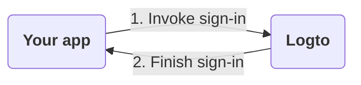
```mermaid
graph LR
    A(<b>Your app</b>) -->|1. Invoke sign-in| B(<b>Logto</b>)
    B -->|2. Finish sign-in| A
```

1. Your app invokes the sign-in method.
2. The user is redirected to the Logto sign-in page. For native apps, the system browser is opened.
3. The user signs in and is redirected back to your app (configured as the "Redirect URI" in Logto).

While the process is simple, the redirecting part may look overkill some times. However, it can be beneficial and secure in many ways. We'll explain the reasons in the following sections.

## Why redirect? \{#why-redirect}

### Flexibility \{#flexibility}

Redirecting allows you to decouple the authentication process from your app. As your business grows, you can still keep the same authentication process without changing your app. For example, you can add multi-factor authentication (MFA) or change the sign-in methods without touching your app.

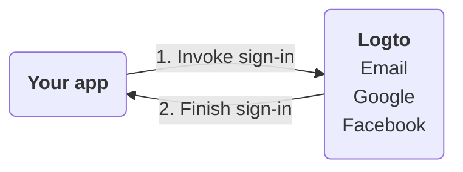
```mermaid
graph LR
    A(<b>Your app</b>) -->|1. Invoke sign-in| B("<b>Logto</b>\nEmail\nGoogle\nFacebook")
    B -->|2. Finish sign-in| A
```

### Multi-app support \{#multi-app-support}

If you have multiple apps, your users can sign in once and access all apps without signing in again. This is especially useful for SaaS businesses or companies with multiple services.

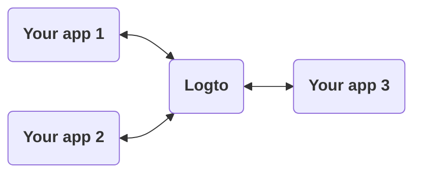
```mermaid
graph LR
    A(<b>Your app 1</b>) <--> B(<b>Logto</b>)
    C(<b>Your app 2</b>) <--> B
    B <--> D(<b>Your app 3</b>)
```

### Native apps \{#native-apps}

For native apps, redirecting to the system browser is a secure way to authenticate users and has built-in support for both iOS and Android.

- **iOS**: Apple offers [ASWebAuthenticationSession](https://developer.apple.com/documentation/authenticationservices/aswebauthenticationsession) for secure authentication.
- **Android**: Google provides [Custom Tabs](https://developer.chrome.com/docs/android/custom-tabs) for a seamless experience.

### Security \{#security}

Under the hood, Logto is an [OpenID Connect (OIDC)](https://openid.net/specs/openid-connect-core-1_0.html) provider. OIDC is a widely adopted standard for user authentication.

Logto enforces strict security measures, such as [PKCE](https://tools.ietf.org/html/rfc7636), and disables insecure flows like the implicit flow. Redirecting is a secure way to authenticate users and can prevent many common attacks.

## What if I need to show some sign-in components in my app? \{#what-if-i-need-to-show-some-sign-in-components-in-my-app}

Sometimes your team may want to show some sign-in components in the app, such as a "Sign in with Google" button. This can be achieved by using the "Direct sign-in" feature in Logto.

### How does it work? \{#how-does-it-work}

Let's say you have two call-to-action buttons in your app: "Get started" and "Sign in with Google". These buttons are designed to:

- "Get started": Redirect to the normal sign-in page.
- "Sign in with Google": Redirect to the Google sign-in page.

Both actions need to complete the sign-in process and redirect back to your app.

---

#### Process of clicking "Get started" \{#process-of-clicking-get-started}

In this case, the sign-in experience is the same as the default. The user is redirected to the Logto sign-in page and then back to your app.

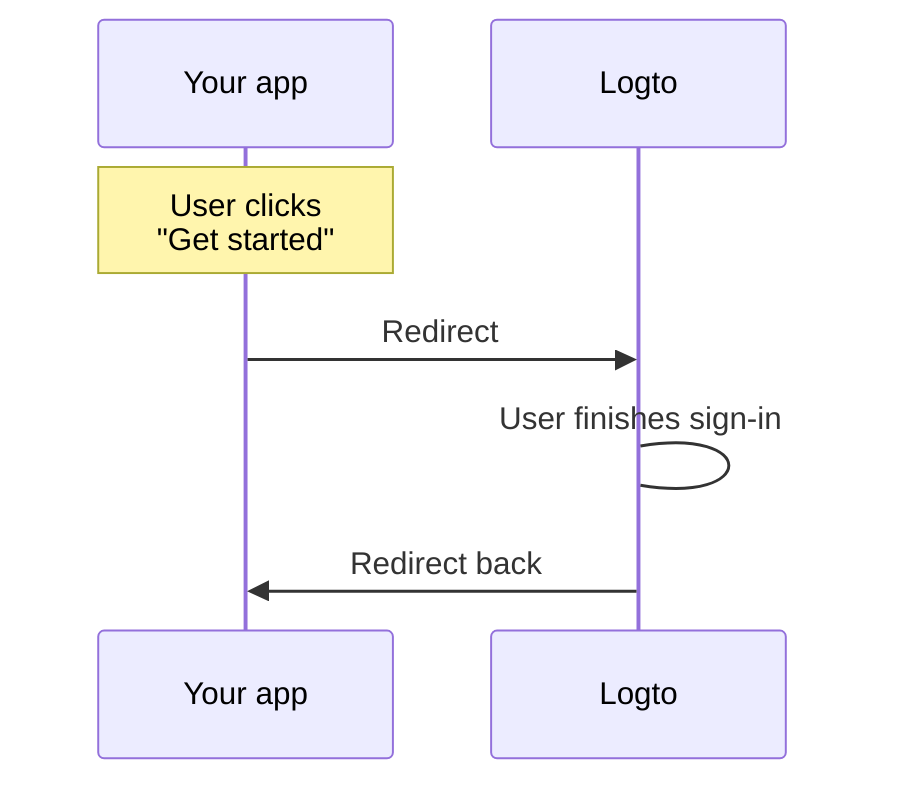
```mermaid
sequenceDiagram
  participant A as Your app
  participant B as Logto

  Note over A: User clicks<br/>"Get started"
  A->>B: Redirect
  B->B: User finishes sign-in
  B->>A: Redirect back
```

:::note
If you have configured social sign-in methods (e.g., Google, Facebook) in Logto, the user may be redirected to the corresponding sign-in page. In the illustration, we only show the general flow for simplicity.
:::

---

#### Process of clicking "Sign in with Google" \{#process-of-clicking-sign-in-with-google}

In this case, the user is redirected to the Google sign-in page automatically without interacting with the Logto sign-in page. The speed of this auto-redirect is almost instant that users may not notice the redirection.

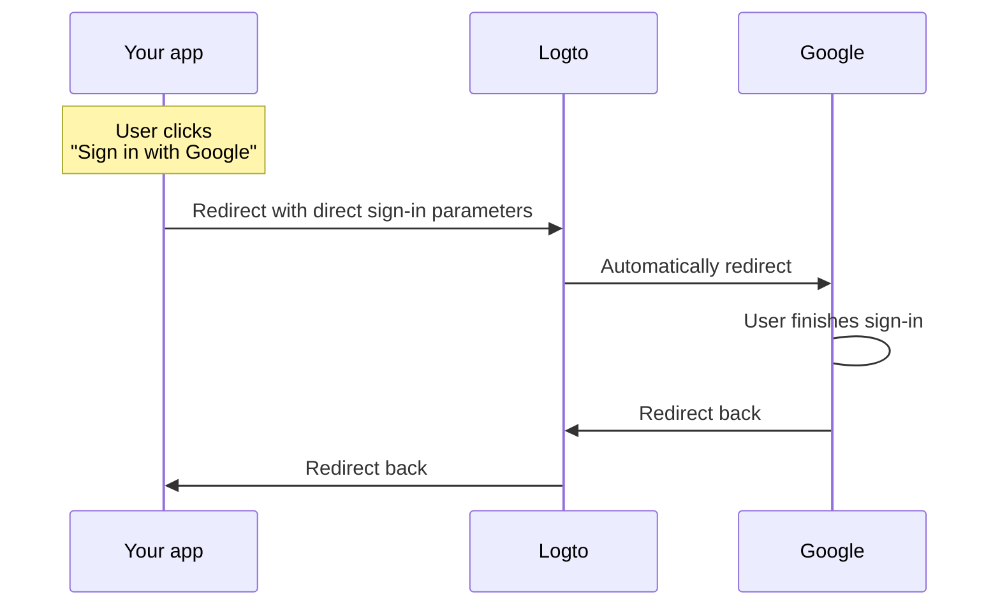
```mermaid
sequenceDiagram
  participant A as Your app
  participant B as Logto
  participant C as Google

  Note over A: User clicks<br/>"Sign in with Google"
  A->>B: Redirect with direct sign-in parameters
  B->>C: Automatically redirect
  C->C: User finishes sign-in
  C->>B: Redirect back
  B->>A: Redirect back
```

---

In summary, the direct sign-in feature is a way to automate some interactions in the sign-in experience without changing the security level.

### Use direct sign-in in your app \{#use-direct-sign-in-in-your-app}

To use direct sign-in, you need to pass the `direct_sign_in` parameter when invoking the sign-in method. The value should be composed of a certain format that Logto recognizes. For example, to sign in with Google, the value should be `social:google`.

In some of Logto official SDKs, there's a dedicated option for direct sign-in. Here's an example of using direct sign-in in the `@logto/client` JavaScript SDK:

```ts
client.signIn({
  redirectUri: 'https://some-redirect-uri',
  directSignIn: { method: 'social', target: 'google' },
});
```

For more details, please refer to [Direct sign-in](/end-user-flows/authentication-parameters/direct-sign-in).

:::info
We are gradually rolling out this feature in all Logto offical SDKs. If you don't see it in your SDK, please feel free to contact us.
:::

## I need my users to fill in their credentials in my app \{#i-need-my-users-to-fill-in-their-credentials-in-my-app}

If you need your users to fill in their credentials (such as email and password) directly in your app, rather than redirecting to Logto, we can't help you with that at the moment. Historically, there was a "Resource Owner Password Credentials" grant, but it is now considered insecure and has been [formally deprecated in OAuth 2.1](https://datatracker.ietf.org/doc/html/draft-ietf-oauth-security-topics#name-resource-owner-password-cre).

To learn more about the security risks of the ROPC grant type, check out our blog post [Why you should deprecate the ROPC grant type](https://blog.logto.io/deprecated-ropc-grant-type/).

## Related resources \{#related-resources}


================================================================================
SOURCE: src/extraction/local-docs/lgoto/docs/concepts/README.mdx
================================================================================

# Concepts


================================================================================
SOURCE: src/extraction/local-docs/lgoto/docs/concepts/core-service/configuration.md
================================================================================

# Configuration

## Environment variables {#environment-variables}

### Usage {#usage}

Logto handles environment variables in the following order:

- System environment variables
- The `.env` file in the project root, which conforms with [dotenv](https://github.com/motdotla/dotenv#readme) format

Thus the system environment variables will override the values in `.env`.

### Variables {#variables}

:::caution
If you run Logto via `npm start` in the project root, `NODE_ENV` will always be `production`.
:::

In default values, `protocol` will be either `http` or `https` according to your HTTPS config.

| Key                        | Default Value                        | Type                                                     | Description                                                                                                                                                                                                                                                                                |
| -------------------------- | ------------------------------------ | -------------------------------------------------------- | ------------------------------------------------------------------------------------------------------------------------------------------------------------------------------------------------------------------------------------------------------------------------------------------ |
| NODE_ENV                   | `undefined`                          | <code>'production' &#124; 'test' &#124; undefined</code> | What kind of environment that Logto runs in.                                                                                                                                                                                                                                               |
| PORT                       | `3001`                               | `number`                                                 | The local port that Logto listens to.                                                                                                                                                                                                                                                      |
| ADMIN_PORT                 | `3002`                               | `number`                                                 | The local port that Logto Admin Console listens to.                                                                                                                                                                                                                                        |
| ADMIN_DISABLE_LOCALHOST    | N/A                                  | <code>string &#124; boolean &#124; number</code>         | Set it to `1` or `true` to disable the port for Admin Console. With `ADMIN_ENDPOINT` unset, it'll completely disable the Admin Console.                                                                                                                                                    |
| DB_URL                     | N/A                                  | `string`                                                 | The [Postgres DSN](https://www.postgresql.org/docs/14/libpq-connect.html#id-1.7.3.8.3.6) for Logto database.                                                                                                                                                                               |
| DATABASE_STATEMENT_TIMEOUT | N/A                                  | `string`                                                 | (v1.36.0+) PostgreSQL `statement_timeout` in milliseconds. Use a numeric string (e.g., `5000`) to set it, or `DISABLE_TIMEOUT` to omit the startup parameter (recommended for PgBouncer/RDS Proxy). If unset or invalid, the client default is 60000 ms.                                   |
| HTTPS_CERT_PATH            | `undefined`                          | <code>string &#124; undefined</code>                     | See [Enabling HTTPS](#enabling-https) for details.                                                                                                                                                                                                                                         |
| HTTPS_KEY_PATH             | `undefined`                          | <code>string &#124; undefined</code>                     | Ditto.                                                                                                                                                                                                                                                                                     |
| TRUST_PROXY_HEADER         | `false`                              | `boolean`                                                | Ditto.                                                                                                                                                                                                                                                                                     |
| ENDPOINT                   | `'protocol://localhost:$PORT'`       | `string`                                                 | You may specify a URL with your custom domain for online testing or production. This will also affect the value of the [OIDC issuer identifier](https://openid.net/specs/openid-connect-core-1_0.html#IssuerIdentifier).                                                                   |
| ADMIN_ENDPOINT             | `'protocol://localhost:$ADMIN_PORT'` | `string`                                                 | You may specify a URL with your custom domain for production (E.g. `ADMIN_ENDPOINT=https://admin.domain.com`). This will also affect the value of Admin Console Redirect URIs.                                                                                                             |
| CASE_SENSITIVE_USERNAME    | `true`                               | `boolean`                                                | Specifies whether the username is case-sensitive. Exercise caution when modifying this value; changes will not automatically adjust existing database data, requiring manual management.                                                                                                   |
| SECRET_VAULT_KEK           | `undefined`                          | `string`                                                 | The Key Encryption Key (KEK) used to encrypt Data Encryption Keys (DEK) in the [Secret Vault](/secret-vault). Required for the Secret Vault to function properly. Must be a base64-encoded string. AES-256 (32 bytes) is recommended. Example: `crypto.randomBytes(32).toString('base64')` |

### Enabling HTTPS {#enabling-https}

#### Using Node {#using-node}

Node natively supports HTTPS. Provide **BOTH** `HTTPS_CERT_PATH` and `HTTPS_KEY_PATH` to enable HTTPS via Node.

`HTTPS_CERT_PATH` implies the path to your HTTPS certificate, while `HTTPS_KEY_PATH` implies the path to your HTTPS key.

#### Using a HTTPS proxy {#using-a-https-proxy}

Another common practice is to have an HTTPS proxy in front of Node (E.g. Nginx).

In this case, you're likely want to set `TRUST_PROXY_HEADER` to `true` which indicates if proxy header fields should be trusted. Logto will pass the value to [Koa app settings](https://github.com/koajs/koa/blob/master/docs/api/index.md#settings).

See [Trusting TLS offloading proxies](https://github.com/panva/node-oidc-provider/blob/main/docs/README.md#trusting-tls-offloading-proxies) for when to configure this field.

## Database configs {#database-configs}

Managing too many environment variables are not efficient and flexible, so most of our general configs are stored in the database table `logto_configs`.

The table is a simple key-value storage, and the key is enumerable as following:

| Key              | Type                  | Description                                                                                                                        |
| ---------------- | --------------------- | ---------------------------------------------------------------------------------------------------------------------------------- |
| oidc.cookieKeys  | <code>string[]</code> | The string array of the [signing cookie keys](https://github.com/panva/node-oidc-provider/blob/main/docs/README.md#cookieskeys).   |
| oidc.privateKeys | <code>string[]</code> | The string array of the private key content for [OIDC JWT signing](https://openid.net/specs/openid-connect-core-1_0.html#Signing). |

### Supported private key types {#supported-private-key-types}

- EC (P-256, secp256k1, P-384, and P-521 curves)
- RSA
- OKP (Ed25519, Ed448, X25519, X448 sub types)


================================================================================
SOURCE: src/extraction/local-docs/lgoto/docs/concepts/core-service/README.mdx
================================================================================

---
sidebar_label: Logto core service
sidebar_position: 3
---

# Core Service

## Introduction \{#introduction}

_Core Service_ is a monolith service for critical Logto duties. The source code is in [`@logto/core`](https://github.com/logto-io/logto/tree/master/packages/core).

:::note
_Core Service_ and _SDK core_ are two separate concepts. See [SDK convention](/developers/sdk-conventions) for the differences.
:::

To simplify, we divide Core Service into four major modules:


Backend APIs, including OIDC, are built within the `core` package, while frontend proxies depend on the corresponding sibling packages in the Logto monorepo.

## OIDC Provider \{#oidc-provider}

Logto uses the amazing certified [OpenID Connect](https://openid.net/connect/) implementation [node-oidc-provider](https://github.com/panva/node-oidc-provider) under the hood. The provider is mounted at `/oidc`, and you can check relative configurations and files in [packages/core/src/oidc](https://github.com/logto-io/logto/tree/master/packages/core/src/oidc).

The OIDC [Userinfo Endpoint](https://openid.net/specs/openid-connect-core-1_0.html#UserInfo) is available and mounted at `/oidc/me`.

:::info
If you want to directly call OIDC APIs, remember to set header `Content-Type: application/x-www-form-urlencoded`.
:::

### Enabled OpenID features \{#enabled-openid-features}

- [OpenID Connect Core](https://openid.net/specs/openid-connect-core-1_0.html)
- [OpenID Connect Discovery](https://openid.net/specs/openid-connect-discovery-1_0.html)
- [OpenID Connect RP-Initiated Logout](https://openid.net/specs/openid-connect-rpinitiated-1_0.html)
- [OpenID Connect Back-Channel Logout](https://openid.net/specs/openid-connect-backchannel-1_0-final.html)
- [OAuth 2.0](https://www.rfc-editor.org/rfc/rfc6749.html)
- [OAuth 2.0 Token Introspection](https://www.rfc-editor.org/rfc/rfc7662.html)
- [OAuth 2.0 Token Revocation](https://www.rfc-editor.org/rfc/rfc7009.html)
- [OAuth 2.0 Resource Indicators](https://www.rfc-editor.org/rfc/rfc8707.html)
- [OAuth 2.0 Token Exchange](https://datatracker.ietf.org/doc/html/rfc8693.html)
- [Proof Key for Code Exchange (PKCE)](https://www.rfc-editor.org/rfc/rfc7636.html)

## Logto API \{#logto-api}

### Management API \{#management-api}

_Management API_ is a set of APIs that manage and update Logto data. Only users with the `admin` role have access to them.

Head to [API references](https://openapi.logto.io) to see the details.

To access the API programmatically, see [Interact with Management API](/integrate-logto/interact-with-management-api).

### Experience API \{#experience-api}

Experience API is a set of dedicated endpoints that support custom sign-in interface interactions.

These APIs enable developers to implement core authentication features including sign-in, sign-up, password reset, social account binding, and multi-factor authentication (MFA). To implement these features, your custom UI needs to interact with the Experience API.

To better understand the user flows and implementation details:

- Check out [Develop your custom UI](/customization/bring-your-ui/#develop-your-custom-ui) guide to learn how to use Experience API to build your custom experience UI
- Refer to [Experience API references](https://openapi.logto.io/group/endpoint-experience) for detailed API documentation
- Read the [Experience API design RFC](https://github.com/logto-io/rfcs/blob/master/draft/0004-experience-api.md) for in-depth technical specifications and examples

### Account API \{#account-api}

Account API is a comprehensive set of APIs that gives the end users direct API access without needing to go through the Management API, here is the highlights:

- Direct access: The Account API empowers end users to directly access and manage their own account profile without requiring the relay of Management API.
- User profile and identities management: Users can fully manage their profiles and security settings, including the ability to update identity information like email, phone, and password, as well as manage social connections. MFA and SSO support are coming soon.
- Global access control: Admin has full, global control over access settings, can customize each fields.
- Seamless authorization: Authorizing is easier than ever! Simply use `client.getAccessToken()` to obtain an opaque access token for OP (Logto), and attach it to the Authorization header as `Bearer <access_token>`.

With the Logto Account API, you can build a custom account management system like a profile page that is fully integrated with Logto.

Check out [Account settings by Account API](/end-user-flows/account-settings/by-account-api) to learn how to leverage Account API to build your own account settings page.

Refer to [Account API references](https://openapi.logto.io/group/endpoint-my-account) for detailed API documentation.

## Frontend proxies \{#frontend-proxies}

A _frontend proxy_ is a middleware function that serves a frontend project in an environment-related way:

- If it's development, it proxies HTTP requests to the frontend dev server.
- If it's production, it serves static frontend files directly.

Logto has three frontend proxies:


:::note
You may notice that the UI proxy uses the root path. Unlike other proxies, the UI proxy is a fallback proxy which means it only takes effect when no other proxy is matched.
:::


================================================================================
SOURCE: src/extraction/local-docs/lgoto/docs/developers/signing-keys.mdx
================================================================================

---
id: signing-keys
title: Signing keys
sidebar_label: Signing keys
sidebar_position: 5
---

# Signing keys

Logto [OIDC signing keys](https://auth.wiki/signing-key), as known as "OIDC private keys" and "OIDC cookie keys", are the signing keys used to sign JWTs ([access tokens](https://auth.wiki/access-token) and [ID tokens](https://auth.wiki/id-token)) and browser cookies in Logto [sign-in sessions](/end-user-flows/sign-out#what-is-a-logto-session). These signing keys are generated when seeding Logto database ([open-source](/logto-oss)) or creating a new tenant ([Cloud](/logto-cloud)) and can be managed through [CLI](/logto-oss/using-cli) (open-source), Management APIs or Console UI.

By default, Logto uses the elliptic curve (EC) algorithm to generate digital signatures. However, considering that users often need to verify JWT signatures and many older tools do not support the EC algorithm (only supporting RSA), we have implemented the functionality to rotate private keys and allow users to choose the signature algorithm (including both RSA and EC). This ensures compatibility with services that use outdated signature verification tools.

:::note
Theoretically, signing keys should not be leaked and do not have an expiration time, meaning there's no need to rotate them. However, periodically rotating the signing key after a certain period can enhance security.
:::

## How it works? \{#how-it-works}

- **OIDC private key**
  When initializing a Logto instance, a pair of public key and private key are automatically generated and are registered in the underlying OIDC provider. Thereby, when Logto issues a new JWT (access token or ID token), the token is signed with the private key. In the meantime, any client application that receives a JWT can use the paired public key to verify the token signature, in order to ensure the token is not tampered by any third-party. The private key is protected on the Logto server. The public key, however, as the name suggests, are public to everyone, and can be accessed through the `/oidc/jwks` interface of the OIDC endpoint. A signing key algorithm can be specified when generating the private key, and Logto uses EC (Elliptic Curve) algorithm by default. The admin users can change the default algorithm to RSA (Rivest-Shamir-Adleman) by rotating the private keys.
- **OIDC cookie key**
  When user initiate a sign-in or sign-up flow, an "OIDC session" will be created on the server, as well as a set of browser cookies. With these cookies, browser can request Logto Experience API to perform a series of interactions on behalf of the user, such as sign-in, sign-up, and reset password. However, unlike the JWTs, the cookies are only signed and verified by Logto OIDC service itself, asymmetric cryptography measures are not required. Thus we don't have paired public keys for cookie signing keys, nor asymmetric encryption algorithms.

## Rotate signing keys from Console UI \{#rotate-signing-keys-from-console-ui}

Logto introduces a "Signing Keys Rotation" feature, which allows you to create a new OIDC private key and cookie key in your tenant.

1. Navigate to <CloudLink to="/signing-keys">Console > Signing keys</CloudLink>. From there, you can manage both OIDC private keys and OIDC cookie keys.
2. To rotate the signing key, click the "Rotate private keys" or "Rotate cookie keys" button. When rotating private keys, you have the option to change the signing algorithm.
3. And you'll find a table that lists all the signing keys in use. Note: You can delete the previous key, but you cannot delete the current one.

   | Status   | Description                                                                                                               |
   | -------- | ------------------------------------------------------------------------------------------------------------------------- |
   | Current  | This indicates that this key is currently in active use within your applications and APIs.                                |
   | Previous | It refers to a key that was previously used but has been rotated out. Existing tokens with this signing key remain valid. |

Please remember that rotation involves the following three actions:

1. **Creating a new signing key**: This will require all your **applications** and **APIs** to adopt the new signing key.
2. **Rotating the current key**: The existing key will be designated as "previous" after the rotation and will not be utilized by newly created applications and APIs. However, tokens signed with this key will still remain valid.
3. **Removing your previous key**: Keys labeled as "previous" will be revoked and removed from the table.

:::warning
Never rotate signing keys consecutively (two or more times), as this may invalidate ALL issued tokens.

- For OSS users, after rotating the signing key, a Logto instance restart is required for the new signing key to take effect.
- For Cloud users, the new signing key takes effect immediately after rotation, but please make sure not to rotate the signing key multiple times consecutively.
  :::

## Related resources \{#related-resources}


================================================================================
SOURCE: src/extraction/local-docs/lgoto/docs/developers/README.mdx
================================================================================

# Developer

Logto is an [identity and access management (IAM)](https://auth.wiki/iam) service based on [OAuth 2](https://auth.wiki/oauth-2.0) and [OIDC](https://auth.wiki/openid-connect) protocols. IAM services like Logto often serve as the foundation for other web services; various authorization states within those web services are directly affected by Logto.

In order to provide convenience to our users, Logto offers a series of commonly used developer features.

## Sign-in experience related \{#sign-in-experience-related}

```mdx-code-block


================================================================================
SOURCE: src/extraction/local-docs/lgoto/docs/developers/user-impersonation.mdx
================================================================================

---
id: user-impersonation
title: User impersonation
sidebar_label: User impersonation
sidebar_position: 4
---


# User impersonation

Imagine Sarah, a support engineer at TechCorp, receives an urgent ticket from Alex, a customer who can't access a critical resource. To efficiently diagnose and resolve the issue, Sarah needs to see exactly what Alex sees in the system. This is where Logto's user impersonation feature comes in handy.

User impersonation allows authorized users like Sarah to temporarily act on behalf of other users like Alex within the system. This powerful feature is invaluable for troubleshooting, providing customer support, and performing administrative tasks.

## How it works? \{#how-it-works}

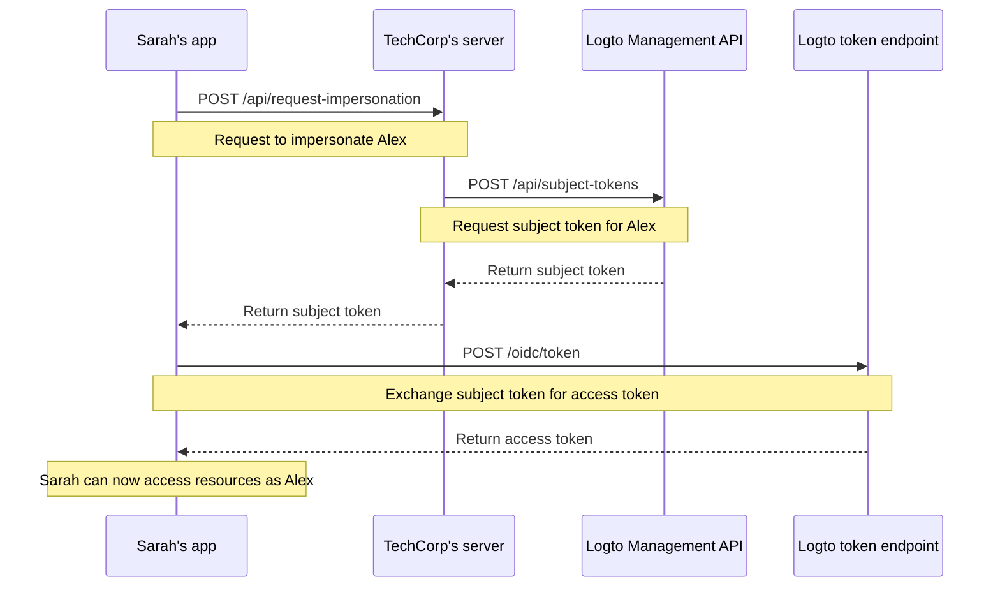
```mermaid
sequenceDiagram
    participant Sarah as Sarah's app
    participant TechCorp as TechCorp's server
    participant Logto as Logto Management API
    participant LogtoToken as Logto token endpoint

    Sarah->>TechCorp: POST /api/request-impersonation
    Note over Sarah,TechCorp: Request to impersonate Alex

    TechCorp->>Logto: POST /api/subject-tokens
    Note over TechCorp,Logto: Request subject token for Alex

    Logto-->>TechCorp: Return subject token
    TechCorp-->>Sarah: Return subject token

    Sarah->>LogtoToken: POST /oidc/token
    Note over Sarah,LogtoToken: Exchange subject token for access token

    LogtoToken-->>Sarah: Return access token
    Note over Sarah: Sarah can now access resources as Alex
```

The impersonation process involves three main steps:

1. Sarah requests impersonation through TechCorp's backend server
2. TechCorp's server obtains a subject token from Logto's Management API
3. Sarah's application exchanges this subject token for an access token

Let's walk through how Sarah can use this feature to help Alex.

### Step 1: Requesting impersonation \{#step-1-requesting-impersonation}

First, Sarah's support application needs to request impersonation from TechCorp's backend server.

**Request (Sarah's application to TechCorp's server)**

```bash
POST /api/request-impersonation HTTP/1.1
Host: api.techcorp.com
Authorization: Bearer <Sarah's_access_token>
Content-Type: application/json

{
  "userId": "alex123",
  "reason": "Investigating resource access issue",
  "ticketId": "TECH-1234"
}
```

In this API, the backend should perform proper authorization checks to ensure Sarah has the necessary permissions to impersonate Alex.

### Step 2: Obtaining a subject token \{#step-2-obtaining-a-subject-token}

TechCorp's server, upon validating Sarah's request, will then call Logto's [Management API](/integrate-logto/interact-with-management-api) to obtain a subject token.

**Request (TechCorp's server to Logto's Management API)**

```bash
POST /api/subject-tokens HTTP/1.1
Host: techcorp.logto.app
Authorization: Bearer <TechCorp_m2m_access_token>
Content-Type: application/json

{
  "userId": "alex123",
  "context": {
    "ticketId": "TECH-1234",
    "reason": "Resource access issue",
    "supportEngineerId": "sarah789"
  }
}
```

**Response (Logto to TechCorp's server)**

```json
{
  "subjectToken": "sub_7h32jf8sK3j2",
  "expiresIn": 600
}
```

TechCorp's server should then return this subject token to Sarah's application.

**Response (TechCorp's server to Sarah's application)**

```json
{
  "subjectToken": "sub_7h32jf8sK3j2",
  "expiresIn": 600
}
```

### Step 3: Exchanging the subject token for an access token \{#step-3-exchanging-the-subject-token-for-an-access-token}


Now, Sarah's application exchanges this subject token for an access token representing Alex, specifying the resource where the token will be used.

**Request (Sarah's application to Logto's token endpoint)**

For traditional web applications or machine-to-machine applications with app secret, include the credentials in the `Authorization` header:

```bash
POST /oidc/token HTTP/1.1
Host: techcorp.logto.app
Content-Type: application/x-www-form-urlencoded
# highlight-next-line
Authorization: Basic <base64(client_id:client_secret)>

grant_type=urn:ietf:params:oauth:grant-type:token-exchange
&scope=resource:read
&subject_token=alx_7h32jf8sK3j2
&subject_token_type=urn:ietf:params:oauth:token-type:access_token
&resource=https://api.techcorp.com/customer-data
```

For single-page applications (SPA) or native applications without app secret, include `client_id` in the request body:

```bash
POST /oidc/token HTTP/1.1
Host: techcorp.logto.app
Content-Type: application/x-www-form-urlencoded

grant_type=urn:ietf:params:oauth:grant-type:token-exchange
# highlight-next-line
&client_id=techcorp_support_app
&scope=resource:read
&subject_token=alx_7h32jf8sK3j2
&subject_token_type=urn:ietf:params:oauth:token-type:access_token
&resource=https://api.techcorp.com/customer-data
```

**Response (Logto to Sarah's application)**

```json
{
  "access_token": "eyJhbG...<truncated>",
  "issued_token_type": "urn:ietf:params:oauth:token-type:access_token",
  "token_type": "Bearer",
  "expires_in": 3600,
  "scope": "resource:read"
}
```

The `access_token` returned will be bound to the specified resource, ensuring it can only be used with TechCorp's customer data API.

## Example usage \{#example-usage}

Here's how Sarah might use this in a Node.js support application:

```tsx
interface ImpersonationResponse {
  subjectToken: string;
  expiresIn: number;
}

interface TokenExchangeResponse {
  access_token: string;
  issued_token_type: string;
  token_type: string;
  expires_in: number;
  scope: string;
}

async function impersonateUser(
  userId: string,
  clientId: string,
  ticketId: string,
  resource: string,
  // highlight-next-line
  clientSecret?: string // Required for traditional web or machine-to-machine apps
): Promise<string> {
  try {
    // Step 1 & 2: Request impersonation and get subject token
    const impersonationResponse = await fetch(
      'https://api.techcorp.com/api/request-impersonation',
      {
        method: 'POST',
        headers: {
          Authorization: "Bearer <Sarah's_access_token>",
          'Content-Type': 'application/json',
        },
        body: JSON.stringify({
          userId,
          reason: 'Investigating resource access issue',
          ticketId,
        }),
      }
    );

    if (!impersonationResponse.ok) {
      throw new Error(`HTTP error occurred. Status: ${impersonationResponse.status}`);
    }

    const { subjectToken } = (await impersonationResponse.json()) as ImpersonationResponse;

    // Step 3: Exchange subject token for access token
    // highlight-start
    // For traditional web or M2M apps, use Basic auth with client secret
    // For SPA or native apps, include client_id in the request body
    const headers: Record<string, string> = {
      'Content-Type': 'application/x-www-form-urlencoded',
    };

    const tokenExchangeBody = new URLSearchParams({
      grant_type: 'urn:ietf:params:oauth:grant-type:token-exchange',
      scope: 'openid profile resource.read',
      subject_token: subjectToken,
      subject_token_type: 'urn:ietf:params:oauth:token-type:access_token',
      resource: resource,
    });

    if (clientSecret) {
      // Confidential client: use Basic auth
      headers['Authorization'] =
        `Basic ${Buffer.from(`${clientId}:${clientSecret}`).toString('base64')}`;
    } else {
      // Public client: include client_id in body
      tokenExchangeBody.append('client_id', clientId);
    }
    // highlight-end

    const tokenExchangeResponse = await fetch('https://techcorp.logto.app/oidc/token', {
      method: 'POST',
      headers,
      body: tokenExchangeBody,
    });

    if (!tokenExchangeResponse.ok) {
      throw new Error(`HTTP error! status: ${tokenExchangeResponse.status}`);
    }

    const tokenData = (await tokenExchangeResponse.json()) as TokenExchangeResponse;
    return tokenData.access_token;
  } catch (error) {
    console.error('Impersonation failed:', error);
    throw error;
  }
}

// Sarah uses this function to impersonate Alex
async function performImpersonation(): Promise<void> {
  try {
    // highlight-start
    // For traditional web or M2M apps, pass the client secret
    const accessToken = await impersonateUser(
      'alex123',
      'techcorp_support_app',
      'TECH-1234',
      'https://api.techcorp.com/customer-data',
      'your-client-secret' // Omit this for SPA or native apps
    );
    // highlight-end
    console.log('Impersonation access token for Alex:', accessToken);
  } catch (error) {
    console.error('Failed to perform impersonation:', error);
  }
}

// Execute the impersonation
void performImpersonation();
```

:::note

1. The subject token is short-lived and for one-time-use.
2. The impersonation access token doesn't come with a [refresh token](https://auth.wiki/refresh-token). Sarah will need to repeat this process if the token expires before she resolves Alex's issue.
3. TechCorp's backend server must implement proper authorization checks to ensure only authorized support staff like Sarah can request impersonation.

:::

## `act` claim \{#act-claim}

When using the token exchange flow for impersonation, the issued access token can include an additional `act` (actor) claim. This claim represents the identity of the "acting party" - in our example, Sarah, who is performing the impersonation.

To include the `act` claim, Sarah's application needs to provide an `actor_token` in the token exchange request. This token should be a valid access token for Sarah with the `openid` scope. Here's how to include it in the token exchange request:

For traditional web applications or machine-to-machine applications:

```bash
POST /oidc/token HTTP/1.1
Host: techcorp.logto.app
Content-Type: application/x-www-form-urlencoded
# highlight-next-line
Authorization: Basic <base64(client_id:client_secret)>

grant_type=urn:ietf:params:oauth:grant-type:token-exchange
&scope=resource:read
&subject_token=alx_7h32jf8sK3j2
&subject_token_type=urn:ietf:params:oauth:token-type:access_token
&actor_token=sarah_access_token
&actor_token_type=urn:ietf:params:oauth:token-type:access_token
&resource=https://api.techcorp.com/customer-data
```

For SPA or native applications, include `client_id` in the request body instead:

```bash
POST /oidc/token HTTP/1.1
Host: techcorp.logto.app
Content-Type: application/x-www-form-urlencoded

grant_type=urn:ietf:params:oauth:grant-type:token-exchange
# highlight-next-line
&client_id=techcorp_support_app
&scope=resource:read
&subject_token=alx_7h32jf8sK3j2
&subject_token_type=urn:ietf:params:oauth:token-type:access_token
&actor_token=sarah_access_token
&actor_token_type=urn:ietf:params:oauth:token-type:access_token
&resource=https://api.techcorp.com/customer-data
```

If an `actor_token` is provided, the resulting access token will contain an `act` claim like this:

```json
{
  "aud": "https://api.techcorp.com",
  "iss": "https://techcorp.logto.app",
  "exp": 1443904177,
  "sub": "alex123",
  "act": {
    "sub": "sarah789"
  }
}
```

This `act` claim clearly indicates that Sarah (sarah789) is acting on behalf of Alex (alex123). The `act` claim can be useful for auditing and tracking impersonation actions.

## Customizing token claims \{#customizing-token-claims}

Logto allows you to [customize the token claims](/developers/custom-token-claims) for impersonation tokens. This can be useful for adding additional context or metadata to the impersonation process, such as the reason for impersonation or the associated support ticket.

When TechCorp's server requests a subject token from Logto's Management API, it can include a `context` object:

```json
{
  "userId": "alex123",
  "context": {
    "ticketId": "TECH-1234",
    "reason": "Resource access issue",
    "supportEngineerId": "sarah789"
  }
}
```

This [context](/developers/custom-token-claims/create-script#context-only-available-for-user-access-token) can then be used in a `getCustomJwtClaims()` function to add specific claims to the final access token. Here's an example of how this might be implemented:

```tsx
const getCustomJwtClaims = async ({ token, context, environmentVariables }) => {
  if (context.grant?.type === 'urn:ietf:params:oauth:grant-type:token-exchange') {
    const { ticketId, reason, supportEngineerId } = context.grant.subjectTokenContext;
    return {
      impersonation_context: {
        ticket_id: ticketId,
        reason: reason,
        support_engineer: supportEngineerId,
      },
    };
  }
  return {};
};
```

The resulting access token that Sarah receives might look like this:

```json
{
  "sub": "alex123",
  "aud": "https://api.techcorp.com/customer-data",
  "impersonation_context": {
    "ticket_id": "TECH-1234",
    "reason": "Resource access issue",
    "support_engineer": "sarah789"
  }
  // ... other standard claims
}
```

By customizing access token claims in this way, TechCorp can include valuable information about the impersonation context, making it easier to audit and understand impersonation activities in their system.

:::note
Be cautious when adding custom claims to your tokens. Avoid including sensitive information that could pose security risks if the token is intercepted or leaked. The JWTs are signed but not encrypted, so the claims are visible to anyone with access to the token.
:::

## Related resources \{#related-resources}


================================================================================
SOURCE: src/extraction/local-docs/lgoto/docs/developers/audit-logs/event-types.mdx
================================================================================

---
sidebar_label: Event types
---

# Event types of audit logs

You can filter event types in <CloudLink to="/audit-logs">Logto Console > Audit Logs</CloudLink>.

:::note

Logto now supports retrieving logs related to end-user interactions via the [Experience APIs](https://openapi.logto.io/group/endpoint-experience).

Audit logs for [Management APIs](/integrate-logto/interact-with-management-api) and [Account APIs](https://openapi.logto.io/group/endpoint-account-center) are coming soon.

Feel free to [contact us](https://logto.io/contact) if you’d like to share your requirements.

:::

## Exchange token \{#exchange-token}

| Key                               | Name                                 |
| --------------------------------- | ------------------------------------ |
| ExchangeTokenBy.AuthorizationCode | Exchange token by Code               |
| ExchangeTokenBy.ClientCredentials | Exchange token by Client Credentials |
| ExchangeTokenBy.RefreshToken      | Exchange token by Refresh Token      |
| ExchangeTokenBy.TokenExchange     | Token exchange                       |

## Custom token claims \{#custom-token-claims}

| Key                            | Name                                |
| ------------------------------ | ----------------------------------- |
| JwtCustomizer.AccessToken      | Get custom user access token claims |
| JwtCustomizer.ClientCredential | Get custom M2M access token claims  |

## Interaction lifecycle \{#interaction-lifecycle}

| Key                | Name                |
| ------------------ | ------------------- |
| Interaction.Create | Interaction started |
| Interaction.End    | Interaction ended   |

## Register \{#register}

| Key                                                            | Name                                                       |
| -------------------------------------------------------------- | ---------------------------------------------------------- |
| Interaction.Register.Create                                    | Create new register interaction                            |
| Interaction.Register.Submit                                    | Submit register interaction                                |
| Interaction.Register.Update                                    | Update register interaction                                |
| Interaction.Register.Identifier.Submit                         | Create and identify new user for register interaction      |
| Interaction.Register.Identifier.VerificationCode.Create        | Create and send register identifier with verification code |
| Interaction.Register.Identifier.VerificationCode.Submit        | Submit and verify register verification code               |
| Interaction.Register.Verification.NewPassword.Submit           | Create new password identity for register                  |
| Interaction.Register.Verification.Password.Submit              | Create and verify identifier with password verification    |
| Interaction.Register.Verification.EmailVerificationCode.Create | Create and send register email verification code           |
| Interaction.Register.Verification.EmailVerificationCode.Submit | Verify register email verification code                    |
| Interaction.Register.Verification.SmsVerificationCode.Create   | Create and send register SMS verification code             |
| Interaction.Register.Verification.SmsVerificationCode.Submit   | Verify register SMS verification code                      |
| Interaction.Register.Verification.Social.Create                | Create social authentication URL                           |
| Interaction.Register.Verification.Social.Submit                | Verify social authentication                               |
| Interaction.Register.Verification.EnterpriseSso.Create         | Create enterprise SSO authentication URL                   |
| Interaction.Register.Verification.EnterpriseSso.Submit         | Verify enterprise SSO authentication                       |
| Interaction.Register.Profile.Create                            | Put new register interaction profile                       |
| Interaction.Register.Profile.Delete                            | Delete register interaction profile                        |
| Interaction.Register.Profile.Update                            | Patch update register interaction profile                  |

## Sign in \{#sign-in}

| Key                                                          | Name                                                        |
| ------------------------------------------------------------ | ----------------------------------------------------------- |
| Interaction.SignIn.Create                                    | Create new sign-in interaction                              |
| Interaction.SignIn.Submit                                    | Submit sign-in interaction                                  |
| Interaction.SignIn.Update                                    | Update sign-in interaction                                  |
| Interaction.SignIn.Identifier.Submit                         | Identify user for sign-in interaction                       |
| Interaction.SignIn.Identifier.Password.Submit                | Submit sign-in identifier with password                     |
| Interaction.SignIn.Verification.NewPassword.Submit           | Create new password identity for register                   |
| Interaction.SignIn.Verification.Password.Submit              | Create and verify identifier with password verification     |
| Interaction.SignIn.Identifier.VerificationCode.Create        | Create and send sign-in verification code                   |
| Interaction.SignIn.Identifier.VerificationCode.Submit        | Submit and verify sign-in identifier with verification code |
| Interaction.SignIn.Verification.EmailVerificationCode.Create | Create and send sign-in email verification code             |
| Interaction.SignIn.Verification.EmailVerificationCode.Submit | Verify sign-in email verification code                      |
| Interaction.SignIn.Verification.SmsVerificationCode.Create   | Create and send sign-in SMS verification code               |
| Interaction.SignIn.Verification.SmsVerificationCode.Submit   | Verify sign-in SMS verification code                        |
| Interaction.SignIn.Identifier.Social.Create                  | Create social sign-in authorization-url                     |
| Interaction.SignIn.Identifier.Social.Submit                  | Authenticate and submit social identifier                   |
| Interaction.SignIn.Verification.Social.Create                | Create social authentication URL                            |
| Interaction.SignIn.Verification.Social.Submit                | Verify social authentication                                |
| Interaction.SignIn.Identifier.SingleSignOn.Create            | Create single-sign-on authentication session                |
| Interaction.SignIn.Identifier.SingleSignOn.Submit            | Submit single-sign-on authentication interaction            |
| Interaction.SignIn.Verification.EnterpriseSso.Create         | Create enterprise SSO authentication URL                    |
| Interaction.SignIn.Verification.EnterpriseSso.Submit         | Verify enterprise SSO authentication                        |
| Interaction.SignIn.Verification.IdpInitiatedSso.Create       | Create IdP-initiated SAML SSO authentication session        |
| Interaction.SignIn.Profile.Create                            | Put new sign-in interaction profile                         |
| Interaction.SignIn.Profile.Delete                            | Delete sign-in interaction profile                          |
| Interaction.SignIn.Profile.Update                            | Patch update sign-in interaction profile                    |

## Forgot password \{#forgot-password}

| Key                                                                  | Name                                                    |
| -------------------------------------------------------------------- | ------------------------------------------------------- |
| Interaction.ForgotPassword.Create                                    | Create new forgot-password interaction                  |
| Interaction.ForgotPassword.Submit                                    | Submit forgot-password interaction                      |
| Interaction.ForgotPassword.Update                                    | Update forgot-password interaction                      |
| Interaction.ForgotPassword.Identifier.Submit                         | Identify user for forgot-password interaction           |
| Interaction.ForgotPassword.Identifier.VerificationCode.Create        | Create and send forgot-password verification code       |
| Interaction.ForgotPassword.Identifier.VerificationCode.Submit        | Submit and verify forgot-password verification code     |
| Interaction.ForgotPassword.Verification.EmailVerificationCode.Create | Create and send forgot-password email verification code |
| Interaction.ForgotPassword.Verification.EmailVerificationCode.Submit | Verify forgot-password email verification code          |
| Interaction.ForgotPassword.Verification.SmsVerificationCode.Create   | Create and send forgot-password SMS verification code   |
| Interaction.ForgotPassword.Verification.SmsVerificationCode.Submit   | Verify forgot-password SMS verification code            |
| Interaction.ForgotPassword.Profile.Create                            | Put new forgot-password interaction profile             |
| Interaction.ForgotPassword.Profile.Delete                            | Delete forgot-password interaction profile              |
| Interaction.ForgotPassword.Profile.Update                            | Patch update forgot-password interaction profile        |

## MFA \{#mfa}

| Key                                                 | Name                                            |
| --------------------------------------------------- | ----------------------------------------------- |
| Interaction.Register.Verification.BackupCode.Create | Create backup codes for MFA binding             |
| Interaction.Register.Verification.BackupCode.Submit | Verify backup code                              |
| Interaction.Register.Verification.Totp.Create       | Create TOTP verification secret for MFA binding |
| Interaction.Register.Verification.Totp.Submit       | Verify TOTP verification code                   |
| Interaction.Register.Verification.Webauthn.Create   | Create WebAuthn authentication                  |
| Interaction.Register.Verification.WebAuthn.Submit   | Verify WebAuthn authentication                  |
| Interaction.SignIn.Verification.BackupCode.Create   | Create backup codes for MFA binding             |
| Interaction.SignIn.Verification.BackupCode.Submit   | Verify backup code                              |
| Interaction.SignIn.Verification.Totp.Create         | Create TOTP verification secret for MFA binding |
| Interaction.SignIn.Verification.Totp.Submit         | Verify TOTP verification code                   |
| Interaction.SignIn.Verification.Webauthn.Create     | Create WebAuthn authentication                  |
| Interaction.SignIn.Verification.WebAuthn.Submit     | Verify WebAuthn authentication                  |

## SAML application \{#saml-application}

| Key                          | Name                                            |
| ---------------------------- | ----------------------------------------------- |
| SamlApplication.AuthnRequest | Receive SAML application authentication request |
| SamlApplication.Callback     | Handle SAML application callback                |

## Security \{#security}

| Key                        | Name                 |
| -------------------------- | -------------------- |
| Interaction.Create.Captcha | CAPTCHA verification |

## Related resources \{#related-resources}


================================================================================
SOURCE: src/extraction/local-docs/lgoto/docs/developers/audit-logs/README.mdx
================================================================================

---
sidebar_position: 7
---

# Audit logs

Logto's audit log allows you to easily monitor user activity and events. It provides a strong foundation for various user management and health check business scenarios.

## View all logs \{#view-all-logs}

Navigate to <CloudLink to="/audit-logs">Console > Audit logs</CloudLink>. Logto captures and organizes authentication events into a table. It keeps track of the event name, user, application, and timestamp. You can narrow down the results by filtering based on the event name and application name. Clicking on a specific event will provide additional details.

:::warning
Audit logs only contain logs that occur during user authentication process, logs of Management API operations is not recorded.
:::

## Capture user activity at the tenant level \{#capture-user-activity-at-the-tenant-level}

Logto's logs offer comprehensive details, ensuring ease of action and customer safety. They capture and record the following information:

- Type of event (full list of audit log events can be found [here](/developers/audit-logs/event-types))
- Application involved
- IP address
- User involved
- Log ID
- Timestamp
- User-agent

By maintaining these event records, organizations can effectively detect possible security risks and promptly address them to prevent unauthorized system access.


## Perform a detailed analysis at the user level \{#perform-a-detailed-analysis-at-the-user-level}

Administrators can perform a detailed analysis of logs associated with specific users, facilitating comprehensive investigations into specific events. The navigation process is straightforward and user-friendly.

To access user-specific logs, follow these steps:

1. Navigate to <CloudLink to="/users">Console > User management</CloudLink>.
2. Select the desired user and go to the detail page.
3. Click on "User logs". The resulting table will exclusively display log events performed and triggered by that particular user.


OSS users should add cronjob to clean up out-dated audit logs regularly.


================================================================================
SOURCE: src/extraction/local-docs/lgoto/docs/developers/sdk-conventions/design-strategy.mdx
================================================================================

---
id: design-strategy
title: Design strategy
sidebar_label: Design strategy
sidebar_position: 2
---

# Design strategy

- Every programming language should have an isolated git repository named `${language}`.
- Each programming language repository should be a mono repo.
- Both SDKs and their associated sample projects should be placed under this repository.

Examples:


- js (core)
- react
- react-sample


- kotlin (core)
- android
- android-sample


================================================================================
SOURCE: src/extraction/local-docs/lgoto/docs/developers/sdk-conventions/core-sdk-conventions.mdx
================================================================================

---
id: core-sdk-convention
title: Core SDK convention
sidebar_label: Core SDK convention
sidebar_position: 3
---

# Core SDK convention

## Basic conventions \{#basic-conventions}

- The core should contain platform-independent functions only.
- The core should be named as `{$language}` and under the repository root directory. E.g., `logto/js/js`, `logto/kotlin/kotlin`.
- The core package should be named as `{$language}` under Logto scope. E.g., `@logto/js`, `io.logto.sdk:kotlin`.

## Basic requirements \{#basic-requirements}

Any core SDK should contain:

- Types
- Utility functions
- Core functions

### Types \{#types}


The configuration of the identity provider, which can be retrieved via `/oidc/.well-known/openid-configuration` API.

**Properties**

| Name                  | Type     |
| --------------------- | -------- |
| authorizationEndpoint | `string` |
| tokenEndpoint         | `string` |
| endSessionEndpoint    | `string` |
| revocationEndpoint    | `string` |
| jwksUri               | `string` |
| issuer                | `string` |


The response data of `/oidc/token` (by authorization code).

**Properties**

| Name         | Type     | Required |
| ------------ | -------- | -------- |
| accessToken  | `string` | ✅       |
| refreshToken | `string` |          |
| idToken      | `string` | ✅       |
| scope        | `string` | ✅       |
| expiresIn    | `number` | ✅       |


The response data of `/oidc/token` (by refresh token) when refreshing tokens by a refresh token.

**Properties**

| Name         | Type     | Required |
| ------------ | -------- | -------- |
| accessToken  | `string` | ✅       |
| refreshToken | `string` | ✅       |
| idToken      | `string` |          |
| scope        | `string` | ✅       |
| expiresIn    | `number` | ✅       |


Claims carried by the id token.

**Properties**

| Name     | Type     | Required |
| -------- | -------- | -------- |
| sub      | `string` | ✅       |
| aud      | `string` | ✅       |
| exp      | `number` | ✅       |
| iat      | `number` | ✅       |
| iss      | `string` | ✅       |
| atHash   | `string` |          |
| username | `string` |          |
| name     | `string` |          |
| avatar   | `string` |          |


### Utility functions \{#utility-functions}


Generate a code verifier.  
The length of the code verifier is hardcoded as 64.  
The return value MUST be encrypted to an URL-safe base64 format string.

**Reference**

- [PKCE](https://oauth.net/2/pkce/)

**Parameters**

None.

**Return Type**

`string`


Generate a code challenge based on a code verifier.  
This method encrypts the code verifier and returns the result in a URL-safe Base64 format.  
We hardcode the encryption algorithm as `SHA-256` in Logto V1.

**Reference**

- [PKCE](https://oauth.net/2/pkce/)

**Parameters**

| Name         | Type     | Notes                             |
| ------------ | -------- | --------------------------------- |
| codeVerifier | `string` | Generated by generateCodeVerifier |

**Return Type**

`string`


"State" is used to prevent the CSRF attack.  
The length of the "state" is hardcoded as 64.  
The result string to be returned MUST be encrypted to an URL-safe base64 format string.

**Reference**

- [CSRF](https://datatracker.ietf.org/doc/html/rfc6749#section-10.12)

**Parameters**

None.

**Return Type**

`string`


Decode an ID Token without secret verification.  
Return an `IdTokenClaims` which carries all the token claims in the payload section.

**Parameters**

| Name  | Type     |
| ----- | -------- |
| token | `string` |

**Return Type**

`IdTokenClaims`

**Throws**

- The `token` is not a valid JWT.


Verify if an ID Token is legal.

**Verify Signing Key**

OIDC supported the JSON Web Key Set.
This function accepts a `JsonWebKeySet` object from a 3rd-party library (jose) for verification.

```json
// JsonWebKeySet example
{
  "keys": [
    {
      "kty": "RSA",
      "use": "sig",
      "kid": "xxxx",
      "e": "xxxx",
      "n": "xxxx"
    }
  ]
}
```

**Verify Claims**

- Verify the `iss` in the ID Token matches the issuer of this token.
- Verify the `aud` (audience) Claim is equal to the client ID.
- Verify that the current time is before the expiry time.
- Verify that the issued at time (`iat`) is not more than +/- 1 minute on the current time.

**Reference**

- [OpenID connect core - ID Token Validation](https://openid.net/specs/openid-connect-core-1_0.html#IDTokenValidation)

**Parameters**

| Name     | Type            |
| -------- | --------------- |
| idToken  | `string`        |
| clientId | `string`        |
| issuer   | `string`        |
| jwks     | `JsonWebKeySet` |

**Return Type**

`void`

**Throws**

- Verify signing key failed
- Verify claims failed


Verify the sign-in callbackUri is legal and return the `code` extracted from callbackUri.

**Verify Callback URI**

- Verify the `callbackUri` should start with `redirectUri`
- Verify there is no `error` in the `callbackUri` (Refer to [Error Response](https://datatracker.ietf.org/doc/html/rfc6749#section-4.1.2.1) in redirect URI).
- Verify the `callbackUri` contains `state`, which should equal to the `state` value you specified in `generateSignInUri`.
- Verify the `callbackUri` contains the parameter value `code`, which you will use when requesting to `/oidc/token` (by refresh token).

**Parameters**

| Name        | Type     |
| ----------- | -------- |
| callbackUri | `string` |
| redirectUri | `string` |
| state       | `string` |

**Return Type**

`string`

**Throws**

- Verifications failed


### Core functions \{#core-functions}


Return `OidcConfigResponse` by requesting to `/oidc/.well-known/openid-configuration`.

**Parameters**

| Name     | Type     | Notes                     |
| -------- | -------- | ------------------------- |
| endpoint | `string` | The OIDC service endpoint |

**Return Type**

`OidcConfigResponse`

**Throws**

- Fetch failed


**Parameters**

| Name                  | Type       | Required | Notes                                                             |
| --------------------- | ---------- | -------- | ----------------------------------------------------------------- |
| authorizationEndpoint | `string`   | ✅       |                                                                   |
| clientId              | `string`   | ✅       |                                                                   |
| redirectUri           | `string`   | ✅       |                                                                   |
| codeChallenge         | `string`   | ✅       |                                                                   |
| state                 | `string`   | ✅       |                                                                   |
| scopes                | `string[]` |          | The implementation may vary according to language specifications. |
| resources             | `string[]` |          | The implementation may vary according to language specifications. |
| prompt                | `string`   |          | Default: `consent`.                                               |

The URL will be generated based on `authorizationEndpoint` and contains the following query params:

**Sign-In Url Query Parameters**

| Query Key             | Required | Notes                                                                                                            |
| --------------------- | -------- | ---------------------------------------------------------------------------------------------------------------- |
| client_id             | ✅       |                                                                                                                  |
| redirect_uri          | ✅       |                                                                                                                  |
| code_challenge        | ✅       |                                                                                                                  |
| code_challenge_method | ✅       | Hardcoded as S256.                                                                                               |
| state                 | ✅       |                                                                                                                  |
| scope                 | ✅       | scope always contains openid and offline_access, even the input scope provides a null or empty scope value.      |
| resource              |          | We can add resource to uri more than once, the backend will convert them as a list. e.g. `resource=a&resource=b` |
| response_type         | ✅       | Hardcoded as code.                                                                                               |
| prompt                | ✅       |                                                                                                                  |

**Return Type**

`string`


**Parameters**

| Name                  | Type     | Required |
| --------------------- | -------- | -------- |
| endSessionEndpoint    | `string` | ✅       |
| idToken               | `string` | ✅       |
| postLogoutRedirectUri | `string` |          |

The URL to be generated will be based on `endSessionEndpoint` and contain the following query parameters:

**Sign-Out Url Query Parameters**

| Query Key                | Required | Notes                                         |
| ------------------------ | -------- | --------------------------------------------- |
| id_token_hint            | ✅       | the inputed `idToken` parameter               |
| post_logout_redirect_uri |          | the inputed `postLogoutRedirectUri` parameter |

**Return Type**

`string`


Fetch a token (`CodeTokenResponse`) by requesting to `/oidc/token` (by authorization code).

**Parameters**

| Name          | Type     | Required |
| ------------- | -------- | -------- |
| tokenEndpoint | `string` | ✅       |
| code          | `string` | ✅       |
| codeVerifier  | `string` | ✅       |
| clientId      | `string` | ✅       |
| redirectUri   | `string` | ✅       |
| resource      | `string` |          |

**HTTP Request**

- Endpoint: `/oidc/token`
- Method: `POST`
- Content-Type: `application/x-www-form-urlencoded`
- Payload:

| Query Key     | Type                           | Required |
| ------------- | ------------------------------ | -------- |
| grant_type    | `string: 'authorization_code'` | ✅       |
| code          | `string`                       | ✅       |
| code_verifier | `string`                       | ✅       |
| client_id     | `string`                       | ✅       |
| redirect_uri  | `string`                       | ✅       |
| resource      | `string`                       |          |

**Return Type**

`CodeTokenResponse`

**Throws**

- Fetch failed


Fetch a token (`RefreshTokenTokenResponse`) via `/oidc/token` (by refresh token).

**Parameters**

| Name          | Type       | Required |
| ------------- | ---------- | -------- |
| tokenEndpoint | `string`   | ✅       |
| clientId      | `string`   | ✅       |
| refreshToken  | `string`   | ✅       |
| resource      | `string`   |          |
| scopes        | `string[]` |          |

**HTTP Request**

- Endpoint: `/oidc/token`
- Method: `POST`
- Content-Type: `application/x-www-form-urlencoded`
- Payload:

| Query Key     | Type                      | Required | Notes                                                                   |
| ------------- | ------------------------- | -------- | ----------------------------------------------------------------------- |
| grant_type    | `string: 'refresh_token'` | ✅       |                                                                         |
| refresh_token | `string`                  | ✅       |                                                                         |
| client_id     | `string`                  | ✅       |                                                                         |
| resource      | `string`                  |          |                                                                         |
| scope         | `string`                  |          | we join the `scopes` values with space to construct this `scope` string |

**Return Type**

`RefreshTokenTokenResponse`

**Throws**

- Fetch failed


Request to `/oidc/token/revocation` API to notify the authorization server that a previously obtained refresh or access token is no longer needed.

**Parameters**

| Name               | Type     | Notes               |
| ------------------ | -------- | ------------------- |
| revocationEndpoint | `string` |                     |
| clientId           | `string` |                     |
| token              | `string` | token to be revoked |

**HTTP Request**

- Endpoint: `/oidc/token/revocation`
- Method: `POST`
- Content-Type: `application/x-www-form-urlencoded`
- Payload:

| Query Key | Type     |
| --------- | -------- |
| client_id | `string` |
| token     | `string` |

**Return Type**

`void`

**Throws**

- Revoke failed


================================================================================
SOURCE: src/extraction/local-docs/lgoto/docs/developers/sdk-conventions/README.mdx
================================================================================

---
id: sdk-conventions
title: Platform SDK conventions
sidebar_label: Platform SDK conventions
sidebar_position: 8
---

# Platform SDK conventions

Logto provides a very powerful and flexible web authentication service.

In practical use of Logto's services, for convenience, it is often necessary for developers to integrate the Logto SDK into their own client applications to manage user sign-in status, permissions, and more.

You can find SDKs for all programming languages/frameworks supported by Logto [here](/quick-starts).

If you're unlucky and don't find the SDK you want, here is a convention you can follow to implement the SDK for your desired programming language, making it easier to use Logto services.

This convention contains three main parts:


================================================================================
SOURCE: src/extraction/local-docs/lgoto/docs/developers/sdk-conventions/platform-sdk-conventions.mdx
================================================================================

---
id: platform-sdk-convention
title: Platform SDK convention
sidebar_label: Platform SDK convention
sidebar_position: 4
---

# Platform SDK convention

Platform SDK provides a standard way to integrate the client with Logto service in the specific platform and accelerates the integration process.

- Platform SDK encapsulates [the core](/developers/sdk-conventions/core-sdk-convention) with platform-specific implementation.
- Platform SDK should provide basic types that make SDK easier to use.
- Platform SDK should be exported as a class named `LogtoClient`.

## Basic types \{#basic-types}


| Name                | Type       | Required | Default Value                       | Notes                                                                         |
| ------------------- | ---------- | -------- | ----------------------------------- | ----------------------------------------------------------------------------- |
| endpoint            | `string`   | ✅       |                                     | The OIDC service endpoint.                                                    |
| appId               | `string`   | ✅       |                                     | The application id comes from the application we registered in Logto Service. |
| scopes              | `string[]` |          | `[openid, offline_access, profile]` | This field always contains `openid`, `offline_access` and `profile`.          |
| resources           | `string[]` |          |                                     | The protected resource indicators we want to use.                             |
| prompt              | `string`   |          | `consent`                           | The prompt value used in `generateSignInUri`.                                 |
| usingPersistStorage | `boolean`  |          | `true`                              | Decide to store credentials on the local machine or not.                      |

**\*Notes**

- You can extend this `LogtoConfig` if you need to.
- `usingPersistStorage` is only provided in client SDKs. E.g., iOS, Android, and SPA.


| Name      | Type     | Notes                |
| --------- | -------- | -------------------- |
| token     | `string` |                      |
| scope     | `string` |                      |
| expiresAt | `number` | Timestamp in seconds |


## LogtoClient \{#logtoclient}

### Properties \{#properties}


**Type**

`LogtoConfig`


**Type**

`OidcConfigResponse?`


**Type**

`Map<string, AccessToken>`

**Key**

- The key should be constructed with `scope` and `resource`.
- The values in `scope` should be sorted alphabetically and joined with space.
- The key should be constructed in the pattern: `${scope}@${resource}`.
- If the `scope` or `resource` is null or empty, their value should be treated as empty.

E.g., `"offline_access openid read:usr@https://logto.dev/api"`, `"@https://logto.dev/api"`, `"openid@"`, `"@"`.

**Value**

- `AccessToken`, which uses `expiresAt` property to indicate the exact time when an access token is expired.

**Notes**

- The `scope` will always be a null value for we don't support custom scopes in Logto V1.
- When building the access token key to store an access token:
  - `scope` will always be a null value.
  - if the access token is not a jwt, treat the `resource` as a null value.
  - if the access token is a jwt, decode the access token and use the payload's `aud` claim value as the `resource` part of the access token key.


**Type**

`string?`

**Notes**

`refreshToken` will be set or updated under circumstances below:

- Load `refreshToken` from the storage.
- The server returns a `refreshToken` in the response on fetch token successfully.
- Sign out (will be set to `null`).


**Type**

`string?`

**Notes**

- `idToken` should be verified if it comes from the backend.
- `idToken` will be set or updated under circumstances below:
  - Load `idToken` from the storage.
  - The server returns an `idToken` in the response on fetch token successfully.
  - Sign out (will be set to `null`).


### Methods \{#methods}


**Parameters**

| Parameter   | Type          |
| ----------- | ------------- |
| logtoConfig | `LogtoConfig` |

**Return Type**

`LogtoClient`

**Notes**

- You can add extra parameters if you need to.
- If the usePersistStorage is enabled in logtoConfig, the platform SDK will provide the following functionalities:
  - Store persistent data with a unique key based on `clientId`.
  - Load `refreshToken` and `idToken` from the local machine on initialization.
  - Store `refreshToken` and `idToken` locally on `Core.fetchTokenByAuthorizationCode` and `Core.fetchTokenByRefreshToken`.


To know if a user is authenticated or not.  
This can be defined as a getter as well.

A user is treated as authenticated when:

- We have gained an ID token successfully.
- We have loaded an ID token from the local machine.

**Parameters**

None.

**Return Type**

`boolean`


This method should start a sign-in flow and the platform SDK should take care of all steps an authorization needs to complete including the sign-in redirect process.

The user will be authenticated after this method has been called successfully.

The sign-in process will reply on the Core SDK Functions:

- `generateSignInUri`
- `verifyAndParseCodeFromCallbackUri`
- `fetchTokenByAuthorizationCode`

Notes:

- Because generateSignInUri includes the resources we need, we don't need to pass resource to fetchTokenByAuthorizationCode function.

**Parameters**

| Parameter   | Type     |
| ----------- | -------- |
| redirectUri | `string` |

**Return Type**

`void`

**Throws**

- Any error that occurs during this sign-in process.


The sign-out process should follow the steps:

1. Clear local storage, cookies, persistent data, or something else.
2. Revoke the obtained refresh token via `Core.revoke` (the Logto service will revoke all related tokens if the refresh token is revoked).
3. Redirect the user to Logto's sign-out endpoint unless step 1 clears the session of the sign-in page.

Notes:

- In step 2, `Core.revoke` is an async call and will not block the sign-out process even if it fails.
- Step 3 is relying on `Core.generateSignOutUri` to generate the Logto's sign-out endpoint.

**Parameters**

| Parameter             | Type     | Required | Default Value |
| --------------------- | -------- | -------- | ------------- |
| postLogoutRedirectUri | `string` |          | `null`        |

**Return Type**

`void`

**Throws**

- Any error that occurs during this sign-out process.


`getAccessToken` retrieves an `AccessToken` by `resource` and `scope` from `accessTokenMap` then returns the `token` value of that `AccessToken`.

We set the `scope` to `null` when building the key of the `accessTokenMap` for we don't support custom scopes in Logto V1.

**Notes**

- If cannot find a corresponding `AccessToken` then perform a `Core.fetchTokenByRefreshToken` action to fetch the token needed.
- If the `accessToken` is not expired, then return the `token` value inside.
- If the `accessToken` is expired, then perform a `Core.fetchTokenByRefreshToken` action to retrieve a new `accessToken` , update the local `accessTokenMap` and return the new `token` value inside.
- If `Core.fetchTokenByRefreshToken` failed, then informs that the user with the exception occurred.
- If cannot find the refreshToken, then informs the user of an unauthorized exception.
- Only by obtaining a `refreshToken` after signing in can we perform a `Core.fetchTokenByRefreshToken` action.

**Parameters**

| Parameter | Type     | Required | Default value |
| --------- | -------- | -------- | ------------- |
| resource  | `string` |          | `null`        |

**Return Type**

`string`

**Throws**

- The user is not authenticated.
- The input `resource` is not set in the `logtoConfig`.
- No refresh token found before `Core.fetchTokenByRefreshToken`.
- `Core.fetchTokenByRefreshToken` failed.


`getIdTokenClaims` return an object that carries the claims of the `idToken` property.

**Parameters**

None.

**Return Type**

`IdTokenClaims`

**Throws**

- The user is not authenticated.


================================================================================
SOURCE: src/extraction/local-docs/lgoto/docs/developers/webhooks/events.mdx
================================================================================

---
id: webhooks-events
title: Webhooks events
sidebar_label: Webhooks events
sidebar_position: 3
---

# Webhooks events

This guide list the different Logto webhook events and explains when each event occurs.

## User interaction hook events \{#user-interaction-hook-events}

| Event type        | Description                                                                 |
| ----------------- | --------------------------------------------------------------------------- |
| PostRegister      | A user successfully creates a new account via the UI interface.             |
| PostSignIn        | A user successfully signs in via the UI interface.                          |
| PostResetPassword | A user's password is successfully reset through the "Forgot password" flow. |

## Data mutation hook events \{#data-mutation-hook-events}

### User \{#user}

| Event type                    | Description                                                                             |
| ----------------------------- | --------------------------------------------------------------------------------------- |
| User.Created                  | A new user account is created.                                                          |
| User.Deleted                  | A user account is deleted.                                                              |
| User.Data.Updated             | User profile data is updated, e.g., email, avatar, custom.data, social identifier, etc. |
| User.SuspensionStatus.Updated | User suspension status is changed (suspended or reactivated).                           |

### Role \{#role}

| Event type          | Description                                                                      |
| ------------------- | -------------------------------------------------------------------------------- |
| Role.Created        | A new role is created.                                                           |
| Role.Deleted        | A role is deleted.                                                               |
| Role.Data.Updated   | A role's data is updated, e.g., role name, description, and default role status. |
| Role.Scopes.Updated | Permissions assigned to a role are added or removed.                             |

### Permission (Scope) \{#permission-scope}

| Event type         | Description                                                        |
| ------------------ | ------------------------------------------------------------------ |
| Scope.Created      | A new API permission is created.                                   |
| Scope.Deleted      | An API permission is deleted.                                      |
| Scope.Data.Updated | An API permission's data is updated, e.g., permission description. |

### Organization \{#organization}

| Event type                      | Description                                                                                |
| ------------------------------- | ------------------------------------------------------------------------------------------ |
| Organization.Created            | A new organization is created.                                                             |
| Organization.Deleted            | An organization is deleted.                                                                |
| Organization.Data.Updated       | An organization's data is updated, e.g., organization name, description, custom.data, etc. |
| Organization.Membership.Updated | Members are added or removed from an organization.                                         |

### Organization role \{#organization-role}

| Event type                      | Description                                                                           |
| ------------------------------- | ------------------------------------------------------------------------------------- |
| OrganizationRole.Created        | A new organization role is created.                                                   |
| OrganizationRole.Deleted        | An organization role is deleted                                                       |
| OrganizationRole.Data.Updated   | An organization role's data is updated, e.g., organization role name and description. |
| OrganizationRole.Scopes.Updated | Permissions assigned to an organization role are added or removed.                    |

### Organization permission (scope) \{#organization-permission-scope}

| Event type                     | Description                                                                             |
| ------------------------------ | --------------------------------------------------------------------------------------- |
| OrganizationScope.Created      | A new organization permission is created.                                               |
| OrganizationScope.Deleted      | A organization permission is deleted.                                                   |
| OrganizationScope.Data.Updated | A organization permission's data is updated, e.g., organization permission description. |

### Management API triggered events \{#management-api-triggered-events}

| API endpoint                                               | Event                                                       |
| ---------------------------------------------------------- | ----------------------------------------------------------- |
| POST /users                                                | User.Created                                                |
| DELETE /users/:userId                                      | User.Deleted                                                |
| PATCH /users/:userId                                       | User.Data.Updated                                           |
| PATCH /users/:userId/custom-data                           | User.Data.Updated                                           |
| PATCH /users/:userId/profile                               | User.Data.Updated                                           |
| PATCH /users/:userId/password                              | User.Data.Updated                                           |
| PATCH /users/:userId/is-suspended                          | User.SuspensionStatus.Updated                               |
| POST /roles                                                | Role.Created, (Role.Scopes.Update)                          |
| DELETE /roles/:id                                          | Role.Deleted                                                |
| PATCH /roles/:id                                           | Role.Data.Updated                                           |
| POST /roles/:id/scopes                                     | Role.Scopes.Updated                                         |
| DELETE /roles/:id/scopes/:scopeId                          | Role.Scopes.Updated                                         |
| POST /resources/:resourceId/scopes                         | Scope.Created                                               |
| DELETE /resources/:resourceId/scopes/:scopeId              | Scope.Deleted                                               |
| PATCH /resources/:resourceId/scopes/:scopeId               | Scope.Data.Updated                                          |
| POST /organizations                                        | Organization.Created                                        |
| DELETE /organizations/:id                                  | Organization.Deleted                                        |
| PATCH /organizations/:id                                   | Organization.Data.Updated                                   |
| PUT /organizations/:id/users                               | Organization.Membership.Updated                             |
| POST /organizations/:id/users                              | Organization.Membership.Updated                             |
| DELETE /organizations/:id/users/:userId                    | Organization.Membership.Updated                             |
| POST /organization-roles                                   | OrganizationRole.Created, (OrganizationRole.Scopes.Updated) |
| DELETE /organization-roles/:id                             | OrganizationRole.Deleted                                    |
| PATCH /organization-roles/:id                              | OrganizationRole.Data.Updated                               |
| POST /organization-scopes                                  | OrganizationScope.Created                                   |
| DELETE /organization-scopes/:id                            | OrganizationScope.Deleted                                   |
| PATCH /organization-scopes/:id                             | OrganizationScope.Data.Updated                              |
| PUT /organization-roles/:id/scopes                         | OrganizationRole.Scopes.Updated                             |
| POST /organization-roles/:id/scopes                        | OrganizationRole.Scopes.Updated                             |
| DELETE /organization-roles/:id/scopes/:organizationScopeId | OrganizationRole.Scopes.Updated                             |

### Experience API triggered events \{#experience-api-triggered-events}

| User interaction action  | Event             |
| ------------------------ | ----------------- |
| User email/phone linking | User.Data.Updated |
| User MFAs linking        | User.Data.Updated |
| User social/SSO linking  | User.Data.Updated |
| User password reset      | User.Data.Updated |
| User registration        | User.Created      |

## Exception hook events \{#exception-hook-events}

### Security \{#security}

| Event type         | Description                                                                                                                                                                                                                                                 |
| ------------------ | ----------------------------------------------------------------------------------------------------------------------------------------------------------------------------------------------------------------------------------------------------------- |
| Identifier.Lockout | A user account is locked due to consecutive failed identity verification attempts. Can be triggered in the following flows:<br /><ul><li>Password verification failed</li><li>Code verification failed</li><li>One-time token verification failed</li></ul> |

## FAQs \{#faqs}


`PostRegister` is triggered when a user successfully creates a new account via the user sign-up flow; `User.Created` is triggered when a new user account is created through the Management API.


================================================================================
SOURCE: src/extraction/local-docs/lgoto/docs/developers/webhooks/secure-webhooks.mdx
================================================================================

---
id: secure-webhooks
title: Secure webhooks
sidebar_label: Secure webhooks
sidebar_position: 5
---

# Secure webhooks

Once your server is ready to receive webhook requests, you may want to make sure that it can handle the requests securely. Logto generates a signature for each webhook request payload, which allows you to verify that the request comes from Logto.

## Get the signing key \{#get-the-signing-key}

You'll need to get the signing key from webhook details page in <CloudLink to="/webhooks"> Logto Console > Webhooks</CloudLink> to verify the signature.

## Verify the signature \{#verify-the-signature}

Extract the signature from the `logto-signature-sha-256` header of the webhook request.

After that, you should generate a signature using your signing key, and the webhook request body and ensure that the result matches the signature from Logto.

:::note
Use the raw body of the webhook request for signature generation; avoid using the parsed body, as servers may preprocess it before reaching your webhook endpoint handler.
:::

Logto uses an HMAC hex digest to compute the signature.

Here's an example of how to verify the signature in Node.js:

```tsx

  const hmac = createHmac('sha256', signingKey);
  hmac.update(rawBody);
  const signature = hmac.digest('hex');
  return signature === expectedSignature;
};
```


================================================================================
SOURCE: src/extraction/local-docs/lgoto/docs/developers/webhooks/configure-webhooks.mdx
================================================================================

---
id: configure-webhooks
title: Configure Webhooks
sidebar_label: Configure Webhooks
sidebar_position: 2
---

# Configure webhooks

Configure webhooks in Logto Console to achieve seamless integration and receive real-time event notifications for your application. Enjoy easy configuration, enhanced security, and convenient health monitoring options.

## Create a webhook \{#create-a-webhook}

Firstly, create a webhook endpoint that will be called by the Logto Agent. This endpoint should be implemented on your server and capable of receiving HTTP requests.

To create a new webhook in the Logto Console, follow these steps:

1. **Create webhook**: Navigate to <CloudLink to="/webhooks">Console > Webhooks</CloudLink> and click the "Create webhook" button.
2. **Name**: Provide a name for the webhook. It is for your own reference to define the usage scenario.
3. **Endpoint URL**: Enter the `Endpoint URL`, which is the URL of your server that will receive the webhook POST requests when the event occurs. For security reasons, the URL must be publicly accessible via HTTPS and should not be a local host URL.

   :::note
   Your server should respond to the Logto webhook requests with an HTTP 200 ("OK") response right after receiving the request to notify that the request has been received.

   Waiting for the corresponding Webhook event's logic processing to complete before responding might cause the Webhook to timeout.

   Do not return any response other than 200 to the Logto webhook. If an error occurs while processing the event, handle it on your own server.
   :::

4. **Event**: In the modal that appears, select the desired [events](/developers/webhooks/webhooks-events) that will trigger this webhook. It is recommended to choose a smaller number of events that meet your requirements to avoid overwhelming the server reception. You can change the selected events at any time after creating the webhook.


5. **Disable / Reactive**: By default, the webhook is activated immediately after creation. If you want to suspend the webhook temporarily, you can disable or reactivate it using the "Three-Dots" menu located in the top-right corner of the header after creating it.

## Secure webhook \{#secure-webhook}

Once your server is ready to receive webhook requests, you may want to make sure that it can handle the requests securely. Logto generates a signature for each webhook request payload, which allows you to verify that the request comes from Logto.

After creating a new webhook, you have options to enhance its security:

- **Signing key**: Logto generates a unique hash signature, known as the Signing Key, for each webhook. You can include this key as a request header in your endpoint implementation. Verifying the signing key ensures that the webhook payload originates from Logto and has not been tampered with by unauthorized sources. Read [securing your webhooks](/developers/webhooks/secure-webhooks/) to learn more about the code.
- **Custom header**: You have the option to include custom headers in the webhook payload to provide additional context or metadata. This feature allows you to add relevant information that can assist in processing the webhook data effectively.

By utilizing the Signing Key and considering the inclusion of Custom Headers, you can enhance the security of your webhooks and ensure the integrity and authenticity of the received payloads.

## Test webhook \{#test-webhook}

To test the connection between Logto and your services, simply click the "Send test payload" button. Logto will then send a sample payload for each selected event to your endpoint URL. These test requests contain anonymous data and are not logged in the recent request history.

This test ensures that your webhook is properly set up to receive and process payloads from Logto. It allows you to validate the integration before deploying the webhook in a live environment.

## Monitor Webhook health status \{#monitor-webhook-health-status}

Logto provides convenient tools to monitor the health status of your webhooks and investigate any potential issues in detail:

- **Health status**
  The webhook list in Logto displays the health status of each webhook, including the success rate and total number of requests made in the past 24 hours. This information gives you an overview of the webhook's performance.
- **Independent request logs**
  In the "Recent Requests" section of each webhook, you can access the request logs for the past 24 hours. Each request is logged individually, allowing you to view the details of each request and investigate any potential errors or anomalies.
- **Auto-retry**
  In the event of a failed delivery (when the webhook response status is greater than or equal to 500), Logto automatically retries the delivery up to three times. Rest assured that multiple retries of the same request will only generate a single log entry, avoiding unnecessary duplication.

By leveraging these monitoring features, you can effectively track the health of your webhooks, examine request logs, and ensure the reliability and performance of your webhook integrations.


================================================================================
SOURCE: src/extraction/local-docs/lgoto/docs/developers/webhooks/request.mdx
================================================================================

---
id: webhooks-request
title: Webhooks request
sidebar_label: Webhooks request
sidebar_position: 4
---

# Webhooks request

Once a valid hook event is emitted, Logto will find corresponding webhooks and send a POST request per hook config.

## Request headers \{#request-headers}

| Key                     | Customizable | Notes                                                                                                       |
| ----------------------- | ------------ | ----------------------------------------------------------------------------------------------------------- |
| user-agent              | ✅           | `Logto (https://logto.io/)` by default.                                                                     |
| content-type            | ✅           | `application/json` by default.                                                                              |
| logto-signature-sha-256 |              | the signature of the request body, refer to [securing your webhooks](/developers/webhooks/secure-webhooks). |

You can overwrite customizable headers by [customizing request](/developers/webhooks/configure-webhooks/#secure-webhook) headers with the same key.

## Interaction hook events request body \{#interaction-hook-events-request-body}

Available events: `PostRegister`, `PostSignIn`, `PostResetPassword`

The request body is a JSON object that contains three types of data field:

```tsx
type UserEntity = {
  id: string;
  username?: string;
  primaryEmail?: string;
  primaryPhone?: string;
  name?: string;
  avatar?: string;
  customData?: object;
  identities?: object;
  lastSignInAt?: string;
  createdAt?: string;
  applicationId?: string;
  isSuspended?: boolean;
};
```

```tsx
enum ApplicationType {
  Native = 'Native',
  SPA = 'SPA',
  Traditional = 'Traditional',
  MachineToMachine = 'MachineToMachine',
  Protected = 'Protected',
  SAML = 'SAML',
}

type ApplicationEntity = {
  id: string;
  type: ApplicationType;
  name: string;
  description?: string;
};
```

| Field            | Type                | Optional | Notes                                                              |
| ---------------- | ------------------- | -------- | ------------------------------------------------------------------ |
| hookId           | `string`            |          | The identifier in Logto.                                           |
| event            | `string`            |          | Which event that triggers this hook.                               |
| createdAt        | `string`            |          | The create time of payload in ISO format.                          |
| interactionEvent | `string`            |          | The interaction event that triggers this hook.                     |
| sessionId        | `string`            | ✅       | The Session ID (not Interaction ID) for this event, if applicable. |
| userAgent        | `string`            | ✅       | The user-agent for the request that triggers this hook.            |
| userIp           | `string`            | ✅       | The IP address for the request that triggers this hook.            |
| userId           | `string`            | ✅       | The related User ID for this event, if applicable.                 |
| user             | `UserEntity`        | ✅       | The related user entity for this event, if applicable.             |
| applicationId    | `string`            | ✅       | The related Application ID for this event, if applicable.          |
| application      | `ApplicationEntity` | ✅       | The related application info for this event, if applicable.        |

See [Users](/user-management/user-data) and [Applications](/integrate-logto/application-data-structure) reference for detailed field explanations.

## Data mutation hook events request body \{#data-mutation-hook-events-request-body}

### Standard request body fields \{#standard-request-body-fields}

| Field     | Type     | Optional | Notes                                     |
| --------- | -------- | -------- | ----------------------------------------- |
| hookId    | `string` |          | The identifier in Logto.                  |
| event     | `string` |          | Which event that triggers this hook.      |
| createdAt | `string` |          | The create time of payload in ISO format. |
| userAgent | `string` | ✅       | The user-agent for the request.           |
| ip        | `string` | ✅       | The IP address for the request.           |

### Interaction API context body fields \{#interaction-api-context-body-fields}

Data mutation hook events that are triggered by user interaction API calls.

Available events: `User.Created`, `User.Data.Updated`

| Field            | Type                | Optional | Notes                                                              |
| ---------------- | ------------------- | -------- | ------------------------------------------------------------------ |
| interactionEvent | `string`            | ✅       | The interaction event that triggers this hook.                     |
| sessionId        | `string`            | ✅       | The Session ID (not Interaction ID) for this event, if applicable. |
| applicationId    | `string`            | ✅       | The related Application ID for this event, if applicable.          |
| application      | `ApplicationEntity` | ✅       | The related application info for this event, if applicable.        |

### Management API context body fields \{#management-api-context-body-fields}

Data mutation hook events that are triggered by Management API calls.

| Field        | Type     | Optional | Notes                                                                                                                  |
| ------------ | -------- | -------- | ---------------------------------------------------------------------------------------------------------------------- |
| path         | `string` | ✅       | The path of the API call that triggers this hook.                                                                      |
| method       | `string` | ✅       | The method of the API call that triggers this hook.                                                                    |
| status       | `number` | ✅       | The response status code of the API call that triggers this hook.                                                      |
| params       | `object` | ✅       | The request koa path params of the API call that triggers this hook.                                                   |
| matchedRoute | `string` | ✅       | The koa matched route of the API call that triggers this hook. Logto uses this field to match the enabled hook events. |

### Data payload body fields \{#data-payload-body-fields}

**User events**

| Event             | Field | Type       | Optional | Notes                                   |
| ----------------- | ----- | ---------- | -------- | --------------------------------------- |
| User.Created      | data  | UserEntity |          | The created user entity for this event. |
| User.Data.Updated | data  | UserEntity |          | The updated user entity for this event. |
| User.Deleted      | data  | null       | /        |                                         |

**Role events**

```tsx
type Role = {
  id: string;
  name: string;
  description: string;
  type: 'User' | 'MachineToMachine';
  isDefault: boolean;
};
```

```tsx
type Scope = {
  id: string;
  name: string;
  description: string;
  resourceId: string;
  createdAt: number;
};
```

| Event              | Field  | Type    | Optional | Notes                                                                                                                              |
| ------------------ | ------ | ------- | -------- | ---------------------------------------------------------------------------------------------------------------------------------- |
| Role.Created       | data   | Role    |          | The created role entity for this event.                                                                                            |
| Role.Data.Updated  | data   | Role    |          | The updated role entity for this event.                                                                                            |
| Role.Deleted       | data   | null    |          |                                                                                                                                    |
| Role.Scope.Updated | data   | Scope[] |          | The updated scopes assigned to the role.                                                                                           |
| Role.Scope.Updated | roleId | string  | ✅       | The role ID that scopes are assigned to. (Only available when the event was triggered by create new role with pre-assigned scopes) |

**Permission(Scope) events**

| Event              | Field | Type  | Optional | Notes                                    |
| ------------------ | ----- | ----- | -------- | ---------------------------------------- |
| Scope.Created      | data  | Scope |          | The created scope entity for this event. |
| Scope.Data.Updated | data  | Scope |          | The updated scope entity for this event. |
| Scope.Deleted      | data  | null  | /        |                                          |

**Organization events**

```tsx
type Organization = {
  id: string;
  name: string;
  description?: string;
  customData: object;
  createdAt: number;
};
```

| Event                           | Field | Type         | Optional | Notes                                           |
| ------------------------------- | ----- | ------------ | -------- | ----------------------------------------------- |
| Organization.Created            | data  | Organization |          | The created organization entity for this event. |
| Organization.Data.Updated       | data  | Organization |          | The updated organization entity for this event. |
| Organization.Deleted            | data  | null         | /        |                                                 |
| Organization.Membership.Updated | data  | null         | /        |                                                 |

**OrganizationRole events**

```tsx
type OrganizationRole = {
  id: string;
  name: string;
  description?: string;
};
```

```tsx
type OrganizationScope = {
  id: string;
  name: string;
  description?: string;
};
```

| Event                          | Field              | Type             | Optional | Notes                                                                                                                              |
| ------------------------------ | ------------------ | ---------------- | -------- | ---------------------------------------------------------------------------------------------------------------------------------- |
| OrganizationRole.Created       | data               | OrganizationRole |          | The created organization role entity for this event.                                                                               |
| OrganizationRole.Data.Updated  | data               | OrganizationRole |          | The updated organization role entity for this event.                                                                               |
| OrganizationRole.Deleted       | data               | null             | /        |                                                                                                                                    |
| OrganizationRole.Scope.Updated | data               | null             | /        |                                                                                                                                    |
| OrganizationRole.Scope.Updated | organizationRoleId | string           | ✅       | The role ID that scopes are assigned to. (Only available when the event was triggered by create new role with pre-assigned scopes) |

**Organization permission(OrganizationScope) events**

| Event                          | Field | Type              | Optional | Notes                                  |
| ------------------------------ | ----- | ----------------- | -------- | -------------------------------------- |
| OrganizationScope.Created      | data  | OrganizationScope |          | The created organization scope entity. |
| OrganizationScope.Data.Updated | data  | OrganizationScope |          | The updated organization scope entity. |
| OrganizationScope.Deleted      | data  | null              | /        |                                        |

## Exception hook events request body \{#exception-hook-events-request-body}

Available events: `Identifier.Lockout`

The request body is a JSON object that contains the standard request body fields and additional fields as below:

```tsx
enum SignInIdentifier {
  Email = 'email',
  Phone = 'phone',
  Username = 'username',
}
```

| Field            | Type                | Optional | Notes                                                              |
| ---------------- | ------------------- | -------- | ------------------------------------------------------------------ |
| hookId           | `string`            |          | The identifier in Logto.                                           |
| event            | `string`            |          | Which event that triggers this hook.                               |
| createdAt        | `string`            |          | The create time of payload in ISO format.                          |
| userAgent        | `string`            | ✅       | The user-agent for the request.                                    |
| ip               | `string`            | ✅       | The IP address for the request.                                    |
| interactionEvent | `string`            | ✅       | The interaction event that triggers this hook.                     |
| sessionId        | `string`            | ✅       | The Session ID (not Interaction ID) for this event, if applicable. |
| applicationId    | `string`            | ✅       | The related Application ID for this event, if applicable.          |
| application      | `ApplicationEntity` | ✅       | The related application info for this event, if applicable.        |
| type             | `SignInIdentifier`  |          | The user's identifier type, e.g., email, phone or username.        |
| value            | `string`            |          | The user's identifier value that triggered the lockout.            |


================================================================================
SOURCE: src/extraction/local-docs/lgoto/docs/developers/webhooks/README.mdx
================================================================================

---
sidebar_position: 6
---

# Webhooks

Logto [Webhook](https://auth.wiki/webhook) provide real-time notifications for various events, including changes to user accounts, roles, permissions, organizations, organization roles, organization permissions, and [user interactions](/end-user-flows).

When an event is triggered, Logto sends an HTTP request to the Endpoint URL you provide, containing detailed information about the event, such as user ID, username, email, and other relevant details (for more about the data included in the payload and header, refer to [Webhook request](/developers/webhooks/webhooks-request)). Your application can process this request and take customized actions, like sending an email or updating data in database.

We continuously add more events based on user needs. If you have specific requirements for your business, please let us know.

## Why use Webhook? \{#why-use-webhook}

Webhooks offer real-time communication between applications, eliminating the need for polling and enabling immediate data updates. They simplify application integration and workflow automation without complex code or proprietary APIs.

Here are some examples of common Webhook use cases for CIAM:

- **Send emails:** Configure a Webhook to send a welcome email to new users upon registration or notify administrators when a user signs in from a new device or location.
- **Send notifications:** Configure a Webhook to trigger a virtual assistant with your CRM system to provide real-time customer support when users sign up.
- **Perform additional API calls**: Configure a Webhook to verify user access by checking their email domain or IP address and then use the Logto Management API to assign appropriate roles with resource permissions.
- **Data synchronization:** Configure Webhook to keep the application updated about changes such as user account suspensions or deletions.
- **Generate reports**: Set up a Webhook to receive user login activity data and leverage it to create reports on user engagement or usage patterns.

## Terms \{#terms}

| Item                                                                                                                                                                           | Description                                                                                                                                                                                              |
| ------------------------------------------------------------------------------------------------------------------------------------------------------------------------------ | -------------------------------------------------------------------------------------------------------------------------------------------------------------------------------------------------------- |
| Event                                                                                                                                                                          | When a specific action is done, it will trigger a hook event with a specific type. E.g., Logto will emit a PostRegister hook event when the user finished the sign-up process and created a new account. |
| Hook                                                                                                                                                                           | A single or series of actions that hook to a specific event. Action can be calling API, executing code snippets, etc.                                                                                    |
| Webhook                                                                                                                                                                        | A subtype of hook that indicates calling an API with the event payload.                                                                                                                                  |
| Say a developer wants to send a notification when user signs in via a new device, the developer can add a webhook that calls his security service API to the PostSignIn event. |

Here's an example of enabling two web hooks for `PostSignIn` event in Logto:

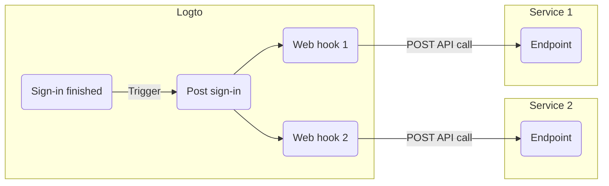
```mermaid
graph LR
  subgraph Logto
    SF(Sign-in finished)
    PS(Post sign-in)
    WH2(Web hook 2)
    WH1(Web hook 1)
  end

  subgraph Service 2
    E2(Endpoint)
  end

  subgraph Service 1
    E1(Endpoint)
  end

  SF -->|Trigger| PS
  PS --> WH1
  PS --> WH2
  WH1 --->|POST API call| E1
  WH2 --->|POST API call| E2

```

## FAQs \{#faqs}


Although synced webhooks would make the user sign-in flow smoother, we don't support them yet (we will in the future). Therefore, scenarios that rely on synced webhooks currently all require different workarounds. If you have any questions, don't hesitate to contact us.


See [Manage user permission change](/authorization/global-api-resources/#optional-handle-user-permission-change) guide.


For the endpoint receiving Webhooks, it should return a 2xx response as quickly as possible to tell Logto that the Webhook has been successfully received. Since different users have vastly different processing logic for Webhooks, excessively complex tasks might take several seconds, causing the Logto Webhook to time out. Best practice is to maintain your own event queue; upon receiving the Logto Webhook, insert the event into the queue and return a 2xx response to Logto. Then let your own worker process the tasks in the queue step by step. If the worker encounters an error, handle it on your own server.


Yes, you can get IP address, user agents, etc in Webhook payload. If you need information that is not currently supported, you can create feature requests on GitHub issues, or contact us.


## Related resources \{#related-resources}


================================================================================
SOURCE: src/extraction/local-docs/lgoto/docs/end-user-flows/sign-out.mdx
================================================================================

---
sidebar_position: 8
---

# Sign-out

Sign-out in Logto (as an OIDC identity provider) involves both:

- A **centralized Logto session** (browser cookie under Logto domain), and
- **Distributed client-side auth state** (tokens and local app session in each app).

To understand sign-out behavior, it helps to separate these two layers and then see how **grants** connect them.

## Core concepts \{#core-concepts}

### What is a Logto session? \{#what-is-a-logto-session}

A Logto session is the centralized sign-in state managed by Logto. It is created after successful authentication and represented by cookies under the Logto domain.

If the session cookie is valid, the user can be silently authenticated (SSO) across multiple apps that trust the same Logto tenant.

If no valid session exists, Logto shows the sign-in page.

### What are grants? \{#what-are-grants}

A **grant** represents the authorization status for a specific user + client application combination.

- One Logto session can have grants for multiple client apps.
- A grant is what issued tokens are associated with.
- In this doc set, use **grant** as the cross-app authorization unit.

### How session, grants, and client auth status relate \{#how-session-grants-and-client-auth-status-relate}

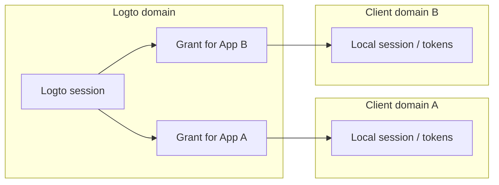
```mermaid
flowchart LR
  subgraph Logto [Logto domain]
    S[Logto session]
    G1[Grant for App A]
    G2[Grant for App B]
  end

  subgraph AppA [Client domain A]
    A[Local session / tokens]
  end

  subgraph AppB [Client domain B]
    B[Local session / tokens]
  end

  S --> G1
  S --> G2
  G1 --> A
  G2 --> B
```

- **Logto session** controls centralized SSO experience.
- **Client local session/tokens** control whether each app currently treats user as signed in.
- **Grants** connect these two worlds by representing app-specific authorization state.

## Sign-in recap (why sign-out is multi-layered) \{#sign-in-recap-why-sign-out-is-multi-layered}

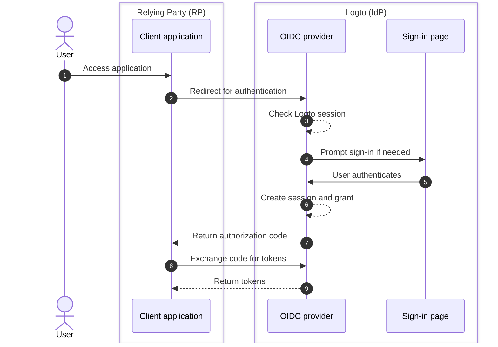
```mermaid
sequenceDiagram
  autonumber
  actor User

  box Relying Party (RP)
    participant Client as Client application
  end

  box Logto (IdP)
    participant OIDC as OIDC provider
    participant SignIn as Sign-in page
  end

  User ->> Client: Access application
  Client ->> OIDC: Redirect for authentication
  OIDC -->> OIDC: Check Logto session
  OIDC ->> SignIn: Prompt sign-in if needed
  SignIn ->> OIDC: User authenticates
  OIDC -->> OIDC: Create session and grant
  OIDC ->> Client: Return authorization code
  Client ->> OIDC: Exchange code for tokens
  OIDC -->> Client: Return tokens
```

## Session topology across apps/devices \{#session-topology-across-apps-devices}

### Shared session cookie (same browser/user agent) \{#shared-session-cookie-same-browser-user-agent}

If a user signs in to multiple apps from the same browser, those apps can reuse the same Logto session cookie and SSO behavior applies.

```mermaid
flowchart TD
  U[User]
  A["Client Application A (Client domain A)"]
  B["Client Application B (Client domain B)"]
  C{"Logto session exists? (Logto domain)"}
  D["Sign-in page (Logto domain)"]

  subgraph UA["User agent A (same browser)"]
    U
    A
    B
    C
    D
  end

  U -->|Sign in| A
  A -->|Redirect to Logto| C
  U -->|Open app| B
  B -->|Redirect to Logto| C
  C -->|No| D
  D -->|Create session| C
```

### Isolated session cookies (different devices/browsers) \{#isolated-session-cookies-different-devices-browsers}

Different browsers/devices hold different Logto cookies, so sign-in session state is isolated.

```mermaid
flowchart TD
  U[User]
  A["Client Application A (Client domain A)"]
  C{"Logto session exists? (Device A, Logto domain)"}
  D["Sign-in page (Device A, Logto domain)"]

  subgraph DeviceA["User agent A"]
    A
    C
    D
  end

  B["Client Application B (Client domain B)"]
  E{"Logto session exists? (Device B, Logto domain)"}
  F["Sign-in page (Device B, Logto domain)"]

  subgraph DeviceB["User agent B"]
    B
    E
    F
  end

  U -->|Sign in| A
  A -->|Redirect to Logto| C
  U -->|Sign in| B
  B -->|Redirect to Logto| E
  C -->|No| D
  E -->|No| F
  D -->|Create session| C
  F -->|Create session| E
```

## Sign-out mechanisms \{#sign-out-mechanisms}

### 1) Client-side-only sign-out \{#1-client-side-only-sign-out}

Client app clears its own local session and tokens (ID/access/refresh tokens). This signs user out from that app's local state only.

- Logto session may still be active.
- Other apps under same Logto session may still SSO.

### 2) End-session at Logto (global sign-out in current Logto implementation) \{#2-end-session-at-logto-global-sign-out-in-current-logto-implementation}

To clear centralized Logto session, app redirects user to the end session endpoint, for example:

`https://{your-logto-domain}/oidc/session/end`

In current Logto SDK behavior:

1. `signOut()` redirects to `/session/end`.
2. Then it goes to `/session/end/confirm`.
3. Default confirm form auto-posts `logout=true`.

As a result, current SDK sign-out is treated as **global sign-out**.

### What happens during global sign-out \{#what-happens-during-global-sign-out}

```mermaid
flowchart TD
  A["Client starts sign-out"] --> B["/session/end"]
  B --> C["/session/end/confirm (logout=true)"]
  C --> D["Revoke centralized Logto session"]
  D --> E{"Check per-app grant"}
  E -->|"offline_access not granted"| F["Revoke grant"]
  E -->|"offline_access granted"| G["Keep grant until grant TTL expires"]
```

During global sign-out:

- The centralized Logto session is revoked.
- Related app grants are handled per app authorization state:
  - If `offline_access` is **not** granted, related grants are revoked.
  - If `offline_access` **is** granted, grants are not revoked by end-session.
- For `offline_access` cases, refresh tokens and grants remain valid until grant expiration.

## Grant lifetime and `offline_access` impact \{#grant-lifetime-and-offline-access-impact}

- Default Logto grant TTL is **180 days**.
- If `offline_access` is granted, end-session does not revoke that app grant by default.
- Refresh token chain associated with that grant can continue until the grant expires (or is explicitly revoked).

## Federated sign-out: back-channel logout \{#federated-sign-out-back-channel-logout}

For cross-app consistency, Logto supports [back-channel logout](https://openid.net/specs/openid-connect-backchannel-1_0-final.html).

When a user signs out from one app, Logto can notify all apps participating in the same session by sending a logout token to each app's registered back-channel logout URI.

If `Is session required` is enabled in app back-channel settings, the logout token includes `sid` to identify the Logto session.

Typical flow:

1. User initiates sign-out from one app.
2. Logto processes end-session and sends logout token(s) to registered back-channel logout URI(s).
3. Each app validates logout token and clears its own local session/tokens.

## Sign-out methods in Logto SDKs \{#sign-out-methods-in-logto-sdks}

- **SPA and web**: `client.signOut()` clears local token storage and redirects to Logto end-session endpoint. You may provide a post-logout redirect URI.
- **Native (including React Native / Flutter)**: usually clears local token storage only. Sessionless webview means no persistent Logto browser cookie to clear.

:::note
For native applications that does not support sessionless webview or does not recognize the `emphasized` settings(Android app using **React Native** or **Flutter** SDK), you may force the user prompt to sign in again by passing the `prompt=login` parameter in the authorization request.
:::

## Enforce re-authentication on every access \{#enforce-re-authentication-on-every-access}

For high-security actions, include `prompt=login` in auth requests to bypass SSO and force credential entry each time.

If requesting `offline_access` (to receive refresh tokens), also include `consent`, `prompt=login consent`.

Typical combined setting:

```txt
prompt=login consent
```

## FAQs \{#faqs}


- Ensure back-channel logout URI is correctly registered in Logto dashboard.
- Ensure your app has an active sign-in state for the same user/session context.


## Related resources \{#related-resources}


================================================================================
SOURCE: src/extraction/local-docs/lgoto/docs/end-user-flows/README.mdx
================================================================================

---
sidebar_position: 1
---

# End-user flows

End-user flows cover all verification processes for user interactions, categorized as follows:

- **Authentication flows**: Involves user sign-in, registration, and password reset. Logto offers out-of-the-box experiences configured in <CloudLink to="/sign-in-experience">Console > Sign-in experience</CloudLink>, and you can [bring your UI](/customization/bring-your-ui) via [Experience APIs](https://openapi.logto.io/group/endpoint-experience).
- **Account flows**: Involves account settings, user profile, and security verification. Use [Account APIs](https://openapi.logto.io/group/endpoint-account-center) or [Management APIs](https://openapi.logto.io/operation/operation-getuser) to implement.
- **Organization flows**: For multi-tenancy products, like B2B or SaaS services. Involves organization creation, member invitation, and management. Use [Management APIs](https://openapi.logto.io/operation/operation-listorganizations) to integrate this into your apps.

## Authentication flows \{#authentication-flows}

| Flows                                                                  | Details                                                                                                                                                                                                                                                                                                                                                                                                                                                                                                                                                                                                              |
| ---------------------------------------------------------------------- | -------------------------------------------------------------------------------------------------------------------------------------------------------------------------------------------------------------------------------------------------------------------------------------------------------------------------------------------------------------------------------------------------------------------------------------------------------------------------------------------------------------------------------------------------------------------------------------------------------------------- |
| [Sign-up and sign-in](/end-user-flows/sign-up-and-sign-in)             | <ul><li>[Email / phone / username sign-up](/end-user-flows/sign-up-and-sign-in/sign-up)</li><li>[Email / phone / username sign-in](/end-user-flows/sign-up-and-sign-in/sign-in)</li><li>[Social login](/end-user-flows/sign-up-and-sign-in/social-sign-in)</li><li>[Passkey sign-in](/end-user-flows/sign-up-and-sign-in/passkey-sign-in)</li><li>[Reset password](/end-user-flows/sign-up-and-sign-in/reset-password)</li><li>[Terms & Privacy](/end-user-flows/sign-up-and-sign-in/terms-and-privacy)</li><li>[Disable user registration](/end-user-flows/sign-up-and-sign-in/disable-user-registration)</li></ul> |
| [Enterprise SSO](/end-user-flows/enterprise-sso)                       | <ul><li>[SP-initiated SSO](/end-user-flows/enterprise-sso/sp-initiated-sso)</li><li>[IdP-initiated SSO](/end-user-flows/enterprise-sso/idp-initiated-sso)</li></ul>                                                                                                                                                                                                                                                                                                                                                                                                                                                  |
| [Multi-factor authentication](/end-user-flows/mfa)                     | <ul><li>[Authenticator apps OTP](/end-user-flows/mfa/authenticator-app-otp)</li><li>[Passkeys (WebAuthn)](/end-user-flows/mfa/webauthn)</li><li>[Backup codes](/end-user-flows/mfa/backup-codes)</li></ul>                                                                                                                                                                                                                                                                                                                                                                                                           |
| [Authentication parameters](/end-user-flows/authentication-parameters) | <ul><li>[First screen](/end-user-flows/authentication-parameters/first-screen)</li><li>[Direct sign-in](/end-user-flows/authentication-parameters/direct-sign-in)</li></ul>                                                                                                                                                                                                                                                                                                                                                                                                                                          |
| [Magic link (One-time token)](/end-user-flows/one-time-token)          | <ul><li>Organization member invitation</li><li>User invitation when registration is disabled</li><li>Sign in or sign up using magic link</li></ul>                                                                                                                                                                                                                                                                                                                                                                                                                                                                   |
| Authorize third-party apps                                             | <ul><li>[Consent screen for OIDC / OAuth apps](/end-user-flows/consent-screen)</li></ul>                                                                                                                                                                                                                                                                                                                                                                                                                                                                                                                             |
| Collect user profile                                                   | <ul><li>[Collect additional user data during sign-up](/end-user-flows/collect-user-profile)</li></ul>                                                                                                                                                                                                                                                                                                                                                                                                                                                                                                                |
| [Sign-out](/end-user-flows/sign-out)                                   | <ul><li>[Clear tokens and local session at the client side](/end-user-flows/sign-out/#1-client-side-only-sign-out)</li><li>[Clear sign-in session at Logto](/end-user-flows/sign-out/#2-end-session-at-logto-global-sign-out-in-current-logto-implementation)</li><li>[Federated sign-out: Back-channel logout](/end-user-flows/sign-out/#federated-sign-out-back-channel-logout)</li></ul>                                                                                                                                                                                                                          |

This section introduces Logto’s pre-built UI for a streamlined sign-in experience, helping you accelerate time-to-market. For more flexibility in customizing your sign-in UI, try the “[Bring Your UI](/customization/bring-your-ui)” feature with Logto Experience APIs.

## Account flows \{#account-flows}

| Flows                                                          | Details                                                                                                                                                                                                                                                                                                                                                                                                                                                                                                                                                                                                                                                                                                                                                                                     |
| -------------------------------------------------------------- | ------------------------------------------------------------------------------------------------------------------------------------------------------------------------------------------------------------------------------------------------------------------------------------------------------------------------------------------------------------------------------------------------------------------------------------------------------------------------------------------------------------------------------------------------------------------------------------------------------------------------------------------------------------------------------------------------------------------------------------------------------------------------------------------- |
| [Account settings](/end-user-flows/account-settings)           | <ul><li>[Manage basic account info](/end-user-flows/account-settings/by-account-api#manage-basic-account-information)</li><li>[Email / phone number management](/end-user-flows/account-settings/by-account-api#manage-identifiers-and-other-sensitive-information)</li><li>Password management</li><li>[Social identities management](/end-user-flows/account-settings/by-account-api#link-a-new-social-connection)</li><li>MFA settings management</li><li>[Enterprise identities management](/end-user-flows/account-settings/by-management-api#user-enterprise-identities-management)</li><li>[Personal access token management](/user-management/personal-access-token)</li><li>[Account deletion](/end-user-flows/account-settings/by-management-api#user-account-deletion)</li></ul> |
| [Security verification](/end-user-flows/security-verification) | <ul><li>[Password verification by Account API](/end-user-flows/security-verification#password-verification)</li><li>[Email/SMS one-time code verification](/end-user-flows/security-verification#emailsms-one-time-code-verification)</li></ul>                                                                                                                                                                                                                                                                                                                                                                                                                                                                                                                                             |

## Organization flows \{#organization-flows}

| Flows                                                              | Details                                                                                                                                                                                                                                                                                                            |
| ------------------------------------------------------------------ | ------------------------------------------------------------------------------------------------------------------------------------------------------------------------------------------------------------------------------------------------------------------------------------------------------------------ |
| [Organization experience](/end-user-flows/organization-experience) | <ul><li>[Create organization](/end-user-flows/organization-experience/create-organization)</li><li>[Invite organization members](/end-user-flows/organization-experience/invite-organization-members)</li><li>[Organization management](/end-user-flows/organization-experience/organization-management)</li></ul> |

## Related resources \{#related-resources}


================================================================================
SOURCE: src/extraction/local-docs/lgoto/docs/end-user-flows/collect-user-profile.mdx
================================================================================

---
sidebar_position: 7
---


# Collect user profile


Beyond authentication identifiers and credentials required for user sign-in, your application may need to collect additional user profile information stored in Logto for easy retrieval via JWT claims or APIs to provide personalized product experiences. You can collect user data through the following methods:

- **During new user registration**: Use the [Collect user profile](#quick-start) feature to add an out-of-the-box "Tell us about yourself" step that collects additional user profile information during sign-up. New users must complete all required fields before registration is considered finished. This doc focuses on this approach.

- **After user registration**: Use the [Account API](/end-user-flows/account-settings/by-account-api) to implement self-service experiences during onboarding flows, account centers, or throughout the product usage journey to update user profile information.

## Key benefits \{#key-benefits}

The **Collect user profile** feature enables you to gather additional user information during the end-user registration experience. We recommend collecting only essential information required for your product to avoid lengthy registration flows that may impact user conversion rates.

This feature allows you to:

- **Capture comprehensive user data**: Collect any [user data](/user-management/user-data) for business or compliance purposes, including [OIDC standard user properties](#basic-user-data-fields) and [custom data](#custom-user-data-fields).

- **Flexible field customization**: Choose from various [field types](#field-types) including text, number, date, checkbox, dropdown (select), URL, and regex validation to match your specific data requirements.

- **Optimized user experience**: Customize the display with labels, descriptions, placeholders, and validation rules. Configure fields as required or optional based on your business needs.

- **Built-in field configurations**: Use pre-configured basic data fields for common user properties with plug-and-play setup. Leverage composite fields (address, fullname) to gather structured data efficiently in a single step.

## Quick start \{#quick-start}

1. Go to <CloudLink to="/sign-in-experience/collect-user-profile">Logto console > Sign-in & account > Collect user profile</CloudLink>.
2. Click "Add profile fields" and choose a [built-in field](#basic-user-data-fields) or define a [custom data](#custom-user-data-fields) (alphanumeric key) to create.
3. Open field details to set field type, label, description, required flag, and type-specific settings (length, range, format, options, etc.). Click "Save changes".
4. Back to the Sign-in & account > Collect user profile, drag and drop the fields to reorder these fields, and the changes will automatically apply.
5. Test the user experience with [Logto live preview](/customization/live-preview) or your test app. Whether users create a new account via [identifier (email/phone number/username)](/end-user-flows/sign-up-and-sign-in/sign-up), [social sign-in](/end-user-flows/sign-up-and-sign-in/social-sign-in), or [Enterprise SSO](/end-user-flows/enterprise-sso), they will all see the "Tell us about yourself" page during registration.


No, they only collect information from the final step of new user registration.


No, it will not remove the existing user data. Only the field will be removed from the sign-up form in the end-user experience.


Yes, you can switch the "Country" component to a "Dropdown (Single select)" field with standardized options.


================================================================================
SOURCE: src/extraction/local-docs/lgoto/docs/end-user-flows/consent-screen.mdx
================================================================================

---
sidebar_position: 6
---

# Consent screen

## What is consent screen? \{#what-is-consent-screen}

Imagine you are signing up to Logto using your Google account. When you click on the "Sign in with Google" button, you are redirected to Google's sign-in page. After you enter your Google credentials, you will be prompted to grant permission to Logto to access your Google account information. This is the user consent screen.

This page is what we call the user **consent screen** or **consent page**. It is a standard [OIDC / OAuth 2.0 flow](/integrate-logto/third-party-applications) that allows users to grant permissions to [third-party applications](/integrate-logto/third-party-applications) to access their data on their behalf. Its primary purpose is to inform users about the collection, processing, and usage of their personal data and to seek their explicit agreement or consent for these activities.

On a consent screen, users are typically presented with [information](/integrate-logto/third-party-applications/consent-screen-branding#customize-the-branding-information) about the types of data that will be collected, how it will be used, and whether it will be shared with third parties. This information is crucial for transparency, allowing users to make informed decisions about their privacy and data security.

Consent pages are particularly important in the context of privacy regulations such as the General Data Protection Regulation ([GDPR](https://gdpr-info.eu/art-4-gdpr/)) in the European Union or the California Consumer Privacy Act ([CCPA](https://oag.ca.gov/privacy/ccpa)) in the United States, which require organizations to obtain clear and affirmative consent from users before processing their personal information.

## When does user see the consent screen in Logto? \{#when-does-user-see-the-consent-screen-in-logto}

As previously mentioned, the consent screen appears when users sign in to Logto using a third-party identity provider (IdP) like Google, Facebook, or Apple. In this setup, Logto serves as the service provider (SP), requesting access to user information from the IdP. The consent screen is generally presented when the [SP](https://auth.wiki/service-provider) and [IdP](https://auth.wiki/identity-provider) are separate organizations, requiring user authorization to facilitate data sharing.


Similarly, in Logto, when Logto functions as the IdP, the consent screen is shown when users sign in to a [**OIDC / OAuth third-party application**](/integrate-logto/third-party-applications) integrated with Logto. This screen informs users about the data the application is requesting and seeks their permission to proceed. Users can review the requested permissions and decide whether to grant authorization to the application.


## How to configure the consent screen? \{#how-to-configure-the-consent-screen}

The Logto consent flow allows you to authorize logins from third-party applications. You can customize the branding and permission requests for each OIDC third-party application.

Learn more about setting up the [third-party application](/integrate-logto/third-party-applications/) and configuring the [consent](/integrate-logto/third-party-applications/consent-screen-branding/) screen in Logto.

## Related resources \{#related-resources}


================================================================================
SOURCE: src/extraction/local-docs/lgoto/docs/end-user-flows/account-settings/by-management-api.mdx
================================================================================

---
sidebar_position: 2
---

# Account settings by Management API

## Integrations \{#integrations}

Logto provides various Management API to manage user accounts. You can use these APIs to build a self-serve account settings page for end-users.

### Architecture \{#architecture}

```mermaid
  graph TB
    A[User] --> B[Client application]
    B -->|Self-hosted account settings API call|C[Server-side application]
    C -->|Management API call| D[Logto]
```

1. **User**: Authenticated end-user who needs to access and manage their account settings.
2. **Client application**: Your client application that serves the account settings page to the user.
3. **Server-side application**: Server-side application that provides the account settings API to the client. Interacts with the Logto Management API.
4. **Logto**: Logto as the authentication and authorization service. Provides the Management API to manage user accounts.

### Sequence diagram \{#sequence-diagram}

```mermaid
  sequenceDiagram
    autonumber
    actor User as User
    participant Client as Client app
    participant Server as Server-side application
    participant Logto as Logto

    User ->> Client: Access client app
    Client ->> Logto: POST /oidc/auth
    User -->> Logto: sign in
    Logto -->> Client: Redirect to client app
    Client ->> Logto: POST /oidc/token
    Logto ->> Client: Access token A
    Client ->> Server: GET /account-settings (with access token A)
    Server ->> Logto: POST /oidc/token (with client credentials)
    Logto ->> Server: Access token B
    Server ->> Logto: GET /api/users/{userId} (with access token B)
    Logto ->> Server: User details
    Server ->> Client: User details
```

1. User accesses the client application.
2. Client application send the authentication request to Logto and redirects the user to the Logto sign-in page.
3. User signs in to Logto.
4. Authenticated user is redirected back to the client application with the authorization code.
5. Client application requests the access token from Logto for the self-hosted account settings API access.
6. Logto grants the access token to the client application.
7. The client application send the account settings request to Server-side application with the user access token.
8. Server-side application verifies the requester's identity and permission from the user access token. Then request for a Management API access token from Logto.
9. Logto grants the Management API access token to Server-side application.
10. Server-side application requests the user data from Logto using the Management API access token.
11. Logto verifies the server's identity and Management API permission and returns the user data.
12. Server-side application process the user data based on the requester's permission and returns the user account details to the client application.

### Integrate Management API to server-side application \{#integrate-management-api-to-server-side-application}

Check the [Management API](/integrate-logto/interact-with-management-api/) section to learn how to integrate the Management APIs with server-side applications.

## User Management APIs \{#user-management-apis}

### User data schema \{#user-data-schema}

Check the [user data and custom data](/user-management/user-data/) section to learn more about the user schema in Logto.

### User profile and identifiers Management APIs \{#user-profile-and-identifiers-management-apis}

A user's profile and identifiers are essential for user management. You can use the following APIs to manage user profiles and identifiers.

| method | path                                                                                                     | description                               |
| ------ | -------------------------------------------------------------------------------------------------------- | ----------------------------------------- |
| GET    | [/api/users/\{userId\}](https://openapi.logto.io/operation/operation-getuser)                            | Get user details by user ID.              |
| PATCH  | [/api/users/\{userId\}](https://openapi.logto.io/operation/operation-updateuser)                         | Update user details.                      |
| PATCH  | [/api/users/\{userId\}/profile](https://openapi.logto.io/operation/operation-updateuserprofile)          | Update user profile fields by user ID.    |
| GET    | [/api/users/\{userId\}/custom-data](https://openapi.logto.io/operation/operation-listusercustomdata)     | Get user custom data by user ID.          |
| PATCH  | [/api/users/\{userId\}/custom-data](https://openapi.logto.io/operation/operation-updateusercustomdata)   | Update user custom data by user ID.       |
| PATCH  | [/api/users/\{userId\}/is-suspended](https://openapi.logto.io/operation/operation-updateuserissuspended) | Update user suspension status by user ID. |

### Email and phone number verification \{#email-and-phone-number-verification}

In the Logto system, both email addresses and phone numbers can serve as user identifiers, making their verification essential. To support this, we provide a set of verification code APIs to help verify the provided email or phone number.

:::note
Make sure to verify the email or phone number before updating the user's profile with a new email or phone number.
:::

| method | path                                                                                                                             | description                                        |
| ------ | -------------------------------------------------------------------------------------------------------------------------------- | -------------------------------------------------- |
| POST   | [/api/verifications/verification-code](https://openapi.logto.io/operation/operation-createverificationbyverificationcode)        | Send email or phone number verification code.      |
| POST   | [/api/verifications/verification-code/verify](https://openapi.logto.io/operation/operation-verifyverificationbyverificationcode) | Verify email or phone number by verification code. |

### User password management \{#user-password-management}

| method | path                                                                                                     | description                                  |
| ------ | -------------------------------------------------------------------------------------------------------- | -------------------------------------------- |
| POST   | [/api/users/\{userId\}/password/verify](https://openapi.logto.io/operation/operation-verifyuserpassword) | Verify current user password by user ID.     |
| PATCH  | [/api/users/\{userId\}/password](https://openapi.logto.io/operation/operation-updateuserpassword)        | Update user password by user ID.             |
| GET    | [/api/users/\{userId\}/has-password](https://openapi.logto.io/operation/operation-getuserhaspassword)    | Check if the user has a password by user ID. |

:::note
Make sure to verify the user's current password before updating the user's password.
:::

### User social identities management \{#user-social-identities-management}

| method | path                                                                                                                              | description                                                                                                          |
| ------ | --------------------------------------------------------------------------------------------------------------------------------- | -------------------------------------------------------------------------------------------------------------------- |
| GET    | [/api/users/\{userId\}](https://openapi.logto.io/operation/operation-getuser)                                                     | Get user details by user ID. The social identities can be found in the `identities` field.                           |
| POST   | [/api/users/\{userId\}/identities](https://openapi.logto.io/operation/operation-createuseridentity)                               | Link a authenticated social identity to the user by user ID.                                                         |
| DELETE | [/api/users/\{userId\}/identities](https://openapi.logto.io/operation/operation-deleteuseridentity)                               | Unlink a social identity from the user by user ID.                                                                   |
| PUT    | [/api/users/\{userId\}/identities](https://openapi.logto.io/operation/operation-replaceuseridentity)                              | Directly update a social identity linked to the user by user ID.                                                     |
| POST   | [/api/connectors/\{connectorId\}/authorization-uri](https://openapi.logto.io/operation/operation-createconnectorauthorizationuri) | Get the authorization URI for a social identity provider. Use this URI to initiate a new social identity connection. |

```mermaid
sequenceDiagram
    autoNumber
    participant User as User
    participant Client as Client app
    participant App as server app
    participant Logto as Logto
    participant IdP as Social identity provider

    User ->> Client: Access client app request to bind social identity
    Client ->> App: Send request to bind social identity
    App ->> Logto: POST /api/connectors/{connectorId}/authorization-uri
    Logto ->> App: Authorization URI
    App ->> Client: Return authorization URI
    Client ->> IdP: Redirect to IdP authorization page
    User -->> IdP: Sign in to IdP
    IdP ->> Client: Redirect to client app with authorization code
    Client ->> Server: Link social identity request, forward IdP authorization response
    Server ->> Logto: POST /api/users/{userId}/identities
    Logto ->> IdP: Get user info from IdP using authorization code
    IdP ->> Logto: Return user info
```

1. User accesses the client application and requests to bind a social identity.
2. Client application sends a request to the server to bind a social identity.
3. Server sends a request to Logto to get the authorization URI for the social identity provider. You need to provide your own `state` parameter and `redirect_uri` in the request. Make sure to register the `redirect_uri` in the social identity provider.
4. Logto returns the authorization URI to the server.
5. Server returns the authorization URI to the client application.
6. Client application redirects the user to the IdP authorization URI.
7. User signs in to the IdP.
8. IdP redirects the user back to the client application using the `redirect_uri` with the authorization code.
9. Client application validates the `state` and forwards the IdP authorization response to the server.
10. Server sends a request to Logto to link the social identity to the user.
11. Logto gets the user information from the IdP using the authorization code.
12. IdP returns the user information to Logto and Logto links the social identity to the user.

:::note
There a few limitations to consider when linking new social identities to a user:

- Management API does not have any session context, any social connector that requires an active session to securely maintain the social authentication state cannot be linked via the Management API. Unsupported connectors include apple, standard OIDC and standard OAuth 2.0 connector.
- For the same reason, Logto can not verify the `state` parameter in the authorization response. Make sure to store the `state` parameter in you client app and validate it when the authorization response is received.
- You need to register the `redirect_uri` to the social identity provider in advance. Otherwise, the social IdP will not redirect the user back to your client app. Your social IdP must accept more than one callback `redirect_uri`, one for user sign-in, one for your own profile binding page.

:::

### User enterprise identities management \{#user-enterprise-identities-management}

| method | path                                                                                                    | description                                                                                                                                                                                    |
| ------ | ------------------------------------------------------------------------------------------------------- | ---------------------------------------------------------------------------------------------------------------------------------------------------------------------------------------------- |
| GET    | [/api/users/\{userId\}?includeSsoIdentities=true](https://openapi.logto.io/operation/operation-getuser) | Get user details by user ID. The enterprise identities can be found in the `ssoIdentities` field. Add the `includeSsoIdentities=true` query parameter to the user details API to include them. |

Currently, the Management API does not support linking or unlinking enterprise identities to a user. You can only display the enterprise identities linked to a user.

### Personal access token \{#personal-access-token}

| method | path                                                                                                                                 | description                                   |
| ------ | ------------------------------------------------------------------------------------------------------------------------------------ | --------------------------------------------- |
| GET    | [/api/users/\{userId\}/personal-access-tokens](https://openapi.logto.io/operation/operation-listuserpersonalaccesstokens)            | Get all personal access tokens for the user.  |
| POST   | [/api/users/\{userId\}/personal-access-tokens](https://openapi.logto.io/operation/operation-createuserpersonalaccesstoken)           | Add a new personal access token for the user. |
| DELETE | [/api/users/\{userId\}/personal-access-tokens/\{name\}](https://openapi.logto.io/operation/operation-deleteuserpersonalaccesstoken)  | Delete a token for the user by name.          |
| PATCH  | [/api/users/\{userId\s}/personal-access-tokens/\{name\}](https://openapi.logto.io/operation/operation-updateuserpersonalaccesstoken) | Update a token for the user by name.          |

Personal access tokens provide a secure way for users to grant [access token](https://auth.wiki/access-token) without using their credentials and interactive sign-in. Learn more about [using personal access tokens](/user-management/personal-access-token).

### User MFA settings management \{#user-mfa-settings-management}

| method | path                                                                                                                                 | description                               |
| ------ | ------------------------------------------------------------------------------------------------------------------------------------ | ----------------------------------------- |
| GET    | [/api/users/\{userId\}/mfa-verifications](https://openapi.logto.io/operation/operation-listusermfaverifications)                     | Get user MFA settings by user ID.         |
| POST   | [/api/users/\{userId\}/mfa-verifications](https://openapi.logto.io/operation/operation-createusermfaverification)                    | Setup a user MFA verification by user ID. |
| DELETE | [/api/users/\{userId\}/mfa-verifications/\{verificationId\}](https://openapi.logto.io/operation/operation-deleteusermfaverification) | Delete a user MFA verification by ID.     |

### User account deletion \{#user-account-deletion}

| method | path                                                                             | description               |
| ------ | -------------------------------------------------------------------------------- | ------------------------- |
| DELETE | [/api/users/\{userId\}](https://openapi.logto.io/operation/operation-deleteuser) | Delete a user by user ID. |

### User session management \{#user-session-management}

| method | path                                                                                                           | description                          |
| ------ | -------------------------------------------------------------------------------------------------------------- | ------------------------------------ |
| GET    | [/api/users/\{userId\}/sessions](https://openapi.logto.io/operation/operation-listusersessions)                | Get user sessions by user ID.        |
| GET    | [/api/users/\{userId\}/sessions/\{sessionId\}](https://openapi.logto.io/operation/operation-getusersession)    | Get a user session by session ID.    |
| DELETE | [/api/users/\{userId\}/sessions/\{sessionId\}](https://openapi.logto.io/operation/operation-deleteusersession) | Delete a user session by session ID. |


================================================================================
SOURCE: src/extraction/local-docs/lgoto/docs/end-user-flows/account-settings/by-account-center-ui.mdx
================================================================================

---
description: Learn how to use Logto's prebuilt Account Center UI to let users manage their accounts
sidebar_position: 2
---

# Account settings by prebuilt Account Center UI

## What is the prebuilt Account Center UI \{#what-is-the-prebuilt-account-center-ui}

Logto provides a prebuilt Account Center UI that offers ready-to-use pages for end users to manage their account settings. This prebuilt UI is hosted by Logto and handles common account management tasks including:

- Updating email address
- Updating phone number
- Updating username
- Setting or updating password
- Managing MFA settings (TOTP authenticator app, passkeys, backup codes)

The prebuilt Account Center UI is designed to work seamlessly with your application, providing a consistent user experience without requiring you to build custom account management pages.

## Benefits of using the prebuilt UI \{#benefits-of-using-the-prebuilt-ui}

- **Zero development effort**: Ready-to-use pages that work out of the box
- **Consistent experience**: Matches the look and feel of Logto's sign-in experience
- **Security built-in**: All verification flows and security measures are handled automatically
- **Always up-to-date**: New features and security improvements are automatically available

## Available pages \{#available-pages}

The prebuilt Account Center UI provides the following pages, all accessible under the `/account` path of your Logto tenant endpoint:

| Path                             | Description                       |
| -------------------------------- | --------------------------------- |
| `/account/email`                 | Update primary email address      |
| `/account/phone`                 | Update primary phone number       |
| `/account/username`              | Update username                   |
| `/account/password`              | Set or update password            |
| `/account/passkey/add`           | Add a new passkey (WebAuthn)      |
| `/account/passkey/manage`        | View and manage existing passkeys |
| `/account/authenticator-app`     | Set up TOTP authenticator app     |
| `/account/backup-codes/generate` | Generate new backup codes         |
| `/account/backup-codes/manage`   | View and manage backup codes      |

For example, if your tenant endpoint is `https://example.logto.app`, the email update page would be available at `https://example.logto.app/account/email`.

## How to use the prebuilt UI \{#how-to-use-the-prebuilt-ui}

### Step 1: Enable Account API \{#step-1-enable-account-api}

The prebuilt Account Center UI relies on the Account API. Navigate to <CloudLink to="/sign-in-experience/account-center">Console > Sign-in & account > Account center</CloudLink> and enable the Account API.

Configure the field permissions according to your needs:

- Set fields to `Edit` to allow users to modify them
- Set fields to `ReadOnly` if users should only view them
- Set fields to `Off` to hide them completely

### Step 2: Link to prebuilt pages from your application \{#step-2-link-to-prebuilt-pages}

To use the prebuilt Account Center UI, you need to redirect users from your application to the appropriate Logto pages. There are two approaches:

#### Approach A: Direct linking with redirect parameter \{#approach-a-direct-linking}

Add links in your application that redirect users to the prebuilt pages. Include a `redirect` query parameter to bring users back to your app after they complete the action:

```
https://[tenant-id].logto.app/account/email?redirect=https://your-app.com/settings
```

When users complete updating their email, they will be redirected back to `https://your-app.com/settings`.

#### Approach B: Embedding in your account settings flow \{#approach-b-embedding}

You can integrate the prebuilt pages into your existing account settings workflow:

1. In your app's account settings page, show the user's current information
2. Provide "Edit" or "Update" buttons that link to the corresponding prebuilt pages
3. After the user completes the action, they are redirected back to your app

Example implementation:

```tsx
function AccountSettings() {
  const tenantEndpoint = 'https://example.logto.app';
  const redirectUrl = encodeURIComponent(window.location.href);

  return (


  );
}
```

### Step 3: Handle success redirects \{#step-3-handle-success-redirects}

After users complete an action, they will be redirected to your specified URL with an optional `show_success` query parameter. You can use this to display a success message:

```tsx
function SettingsPage() {
  const searchParams = new URLSearchParams(window.location.search);
  const showSuccess = searchParams.get('show_success');

  return (
  );
}
```

## Security considerations \{#security-considerations}

The prebuilt Account Center UI includes built-in security measures:

- **Identity verification**: Before making sensitive changes (email, phone, password, MFA), users must verify their identity using their current password or existing verification method
- **Verification codes**: Email and phone updates require verification codes sent to the new address/number
- **Session validation**: All operations validate the user's session to prevent unauthorized access

## Customization options \{#customization-options}

The prebuilt Account Center UI inherits the branding from your sign-in experience settings, including:

- Logo and colors
- Dark/light mode
- Language settings

If you need more customization beyond what the prebuilt UI offers, consider using the [Account API](/end-user-flows/account-settings/by-account-api) to build your own custom account management pages.

## Related resources \{#related-resources}

- [Account settings by Account API](/end-user-flows/account-settings/by-account-api) - Build custom account management with full API control
- [Account settings by Management API](/end-user-flows/account-settings/by-management-api) - Admin-level account management
- [MFA configuration](/end-user-flows/mfa) - Set up multi-factor authentication


================================================================================
SOURCE: src/extraction/local-docs/lgoto/docs/end-user-flows/account-settings/README.mdx
================================================================================

---
sidebar_position: 9
sidebar_custom_props:
  sublist_label: Account flows
---


# Account settings

Logto provides multiple ways to let users manage their account and profiles stored in Logto.

## Use prebuilt Account Center UI (Recommended) \{#use-prebuilt-account-center-ui-recommended}

Logto provides a prebuilt Account Center UI that offers ready-to-use pages for end users to manage their account settings. This is the fastest way to add account management to your application.

Key features:

- **Zero development effort**: Ready-to-use pages that work out of the box.
- **Consistent experience**: Matches the look and feel of Logto's sign-in experience.
- **Security built-in**: All verification flows and security measures are handled automatically.
- **Full functionality**: Supports updating email, phone, username, password, and MFA settings.


================================================================================
SOURCE: src/extraction/local-docs/lgoto/docs/end-user-flows/account-settings/by-account-api.mdx
================================================================================

---
description: Learn how to use the Account API to manage user
sidebar_position: 1
---

# Account settings by Account API

## What is Logto Account API \{#what-is-logto-account-api}

The Logto Account API is a comprehensive set of APIs that gives end users direct API access without needing to go through the Management API. Here are the highlights:

- Direct access: The Account API empowers end users to directly access and manage their own account profiles without requiring the relay of Management API.
- User profile and identities management: Users can fully manage their profiles and security settings, including the ability to update identity information like email, phone, and password, as well as manage social connections. MFA and SSO support are coming soon.
- Global access control: Admins have full, global control over access settings and can customize each field.
- Seamless authorization: Authorization is easier than ever! Simply use `client.getAccessToken()` to obtain an opaque access token for OP (Logto), and attach it to the Authorization header as `Bearer <access_token>`.

With the Logto Account API, you can build a custom account management system like a profile page that is fully integrated with Logto.

Some frequent use cases are listed below:

- Retrieve user profile
- Update user profile
- Update user password
- Update user identities including email, phone, and social connections
- Manage MFA factors (verifications)
- Manage user sessions

To learn more about the available APIs, please visit [Logto Account API Reference](https://openapi.logto.io/group/endpoint-my-account) and [Logto Verification API Reference](https://openapi.logto.io/group/endpoint-verifications).

:::note

SSO account viewing and account deletion features are currently available through the Logto Management APIs. See [Account settings by Management API](/end-user-flows/account-settings/by-management-api) for implementation details.

:::

## How to enable Account API \{#how-to-enable-account-api}

Navigate to <CloudLink to="/sign-in-experience/account-center">Console > Sign-in & account > Account center</CloudLink>.

The Account API is off by default, so its access controls are locked. Toggle **Enable Account API** to switch it on.

Once enabled, configure per-field permissions for identifiers, profile data, and third-party token access. Each field supports `Off`, `ReadOnly`, or `Edit`; the default is `Off`.

1. **Security fields**:
   - Fields include: primary email, primary phone, social identities, password, and MFA.
   - Before end users edit these fields, they must verify their identity via password, email, or SMS to obtain a 10-minute verification record ID. See [Get a verification record id](#get-a-verification-record-id).
   - To use WebAuthn passkeys for MFA, add your front-end app domains to **WebAuthn Related Origins** so the account center and sign-in experience can share passkeys. See [Link a new WebAuthn passkey](#link-a-new-webauthn-passkey).
2. **Profile fields**:
   - Fields include: username, name, avatar, [profile](/user-management/user-data#profile) (other standard profile attributes), and [custom data](/user-management/user-data#custom-data).
   - End users can edit these without additional verification.
3. **Secret vault**:
   - For OIDC or OAuth social and enterprise connectors, Logto [secret vault](/secret-vault/federated-token-set) securely stores third-party access and refresh tokens after authentication. Apps can then call external APIs, such as syncing Google Calendar events, without prompting users to sign in again. Token retrieval becomes available automatically once the Account API is enabled.
4. **Session management**:
   - When enabled, users can view and manage their active sessions, including device information and last sign-in time. Users can also revoke sessions to log out from specific devices.
   - Before end users access session management, they must verify their identity via password, email, or SMS to obtain a 10-minute verification record ID. See [Get a verification record id](#get-a-verification-record-id).

## How to access Account API \{#how-to-access-account-api}

:::note
To ensure the access token has the appropriate permissions, make sure you have properly configured the corresponding scopes in your Logto config.

For example, for the `POST /api/my-account/primary-email` API, you need to configure the `email` scope; for the `POST /api/my-account/primary-phone` API, you need to configure the `phone` scope.

```ts

const config: LogtoConfig = {
  // ...other options
  // Add proper scopes that fit your use cases.
  scopes: [
    UserScope.Email, // For `{POST,DELETE} /api/my-account/primary-email` APIs
    UserScope.Phone, // For `{POST,DELETE} /api/my-account/primary-phone` APIs
    UserScope.CustomData, // To manage custom data
    UserScope.Address, // To manage address
    UserScope.Identities, // For identity and MFA related APIs
    UserScope.Profile, // To manage user profile
    UserScope.Sessions, // To manage user sessions
  ],
};
```

:::

### Fetch an access token \{#fetch-an-access-token}

After setting up the SDK in your application, you can use the `client.getAccessToken()` method to fetch an access token. This token is an opaque token that can be used to access the Account API.

If you are not using the official SDK, you should set the `resource` to empty for the access token grant request to `/oidc/token`.

### Access Account API using access token \{#access-account-api-using-access-token}

You should include the access token in the `Authorization` field of HTTP headers with the Bearer format (`Bearer YOUR_TOKEN`) when interacting with the Account API.

Here's an example to get the user account information:

```bash
curl https://[tenant-id].logto.app/api/my-account \
  -H 'authorization: Bearer <access_token>'
```

## Manage basic account information \{#manage-basic-account-information}

### Retrieve user account information \{#retrieve-user-account-information}

To get user data, you can use the [`GET /api/my-account`](https://openapi.logto.io/operation/operation-getprofile) endpoint.

```bash
curl https://[tenant-id].logto.app/api/my-account \
  -H 'authorization: Bearer <access_token>'
```

The response body would be like:

```json
{
  "id": "...",
  "username": "...",
  "name": "...",
  "avatar": "..."
}
```

The response fields may vary depending on the account center settings.

### Update basic account information \{#update-basic-account-information}

Basic account information includes the username, name, avatar, custom data, and other profile information.

To update **username, name, avatar, and customData** you can use the [`PATCH /api/my-account`](https://openapi.logto.io/operation/operation-updateprofile) endpoint.

```bash
curl -X PATCH https://[tenant-id].logto.app/api/my-account \
  -H 'authorization: Bearer <access_token>' \
  -H 'content-type: application/json' \
  --data-raw '{"username":"...","name":"...","avatar":"..."}'
```

To update other profile information, including **familyName, givenName, middleName, nickname, profile (profile page URL), website, gender, birthdate, zoneinfo, locale, and address**, you can use the [`PATCH /api/my-account/profile`](https://openapi.logto.io/operation/operation-updateotherprofile) endpoint.

```bash
curl -X PATCH https://[tenant-id].logto.app/api/my-account/profile \
  -H 'authorization: Bearer <access_token>' \
  -H 'content-type: application/json' \
  --data-raw '{"familyName":"...","givenName":"..."}'
```

## Manage identifiers and other sensitive information \{#manage-identifiers-and-other-sensitive-information}

For security reasons, the Account API requires an additional layer of authorization for operations that involve identifiers and other sensitive information.

### Get a verification record id \{#get-a-verification-record-id}

First, you need to get a **verification record ID** with a 10-minute expiration (TTL). This can be used to verify the user's identity before updating sensitive information. This means once a user successfully verifies their identity via password, email verification code, or SMS verification code, they have 10 minutes to update their authentication-related data, including identifiers, credentials, social account linking, and MFA.

To get a verification record ID, you can [verify the user's password](#verify-the-users-password) or [send a verification code to the user's email or phone](#verify-by-sending-a-verification-code-to-the-users-email-or-phone).

#### Verify the user's password \{#verify-the-users-password}

```bash
curl -X POST https://[tenant-id].logto.app/api/verifications/password \
  -H 'authorization: Bearer <access_token>' \
  -H 'content-type: application/json' \
  --data-raw '{"password":"..."}'
```

The response body would be like:

```json
{
  "verificationRecordId": "...",
  "expiresAt": "..."
}
```

#### Verify by sending a verification code to the user's email or phone \{#verify-by-sending-a-verification-code-to-the-users-email-or-phone}

:::note
To use this method, you need to [configure the email connector](/connectors/email-connectors/) or [SMS connector](/connectors/sms-connectors/), and make sure the `UserPermissionValidation` template is configured.
:::

Take email as an example, request a new verification code and get the verification record ID:

```bash
curl -X POST https://[tenant-id].logto.app/api/verifications/verification-code \
  -H 'authorization: Bearer <access_token>' \
  -H 'content-type: application/json' \
  --data-raw '{"identifier":{"type":"email","value":"..."}}'
```

The response body would be like:

```json
{
  "verificationRecordId": "...",
  "expiresAt": "..."
}
```

Upon receiving the verification code, you can use it to update the verification status of the verification record.

```bash
curl -X POST https://[tenant-id].logto.app/api/verifications/verification-code/verify \
  -H 'authorization: Bearer <access_token>' \
  -H 'content-type: application/json' \
  --data-raw '{"identifier":{"type":"email","value":"..."},"verificationId":"...","code":"123456"}'
```

After verifying the code, you can now use the verification record ID to update the user's identifier.

To learn more about verifications, please refer to [Security verification by Account API](/end-user-flows/security-verification).

### Send request with verification record id \{#send-request-with-verification-record-id}

When sending a request to update the user's identifier, you need to include the verification record ID in the request header with the `logto-verification-id` field.

### Update user's password \{#update-users-password}

To update the user's password, you can use the [`POST /api/my-account/password`](https://openapi.logto.io/operation/operation-updatepassword) endpoint.

```bash
curl -X POST https://[tenant-id].logto.app/api/my-account/password \
  -H 'authorization: Bearer <access_token>' \
  -H 'logto-verification-id: <verification_record_id>' \
  -H 'content-type: application/json' \
  --data-raw '{"password":"..."}'
```

:::tip
Just like passwords created during sign-up, passwords set through the Account API must comply with the [password policy](/security/password-policy) you configured in <CloudLink to="/security/password-policy">Console > Security > Password policy</CloudLink>. Logto returns detailed validation results and error messages if the password fails the policy.
:::

### Update or link new email \{#update-or-link-new-email}

:::note
To use this method, you need to [configure the email connector](/connectors/email-connectors/), and make sure the `BindNewIdentifier` template is configured.
:::

To update or link a new email, you should first prove the ownership of the email.

Call the [`POST /api/verifications/verification-code`](https://openapi.logto.io/operation/operation-createverificationbyverificationcode) endpoint to request a verification code.

```bash
curl -X POST https://[tenant-id].logto.app/api/verifications/verification-code \
  -H 'authorization: Bearer <access_token>' \
  -H 'content-type: application/json' \
  --data-raw '{"identifier":{"type":"email","value":"..."}}'
```

You will find a `verificationId` in the response, and receive a verification code in the email, use it to verify the email.

```bash
curl -X POST https://[tenant-id].logto.app/api/verifications/verification-code/verify \
  -H 'authorization: Bearer <access_token>' \
  -H 'content-type: application/json' \
  --data-raw '{"identifier":{"type":"email","value":"..."},"verificationId":"...","code":"..."}'
```

After verifying the code, you can now call [`PATCH /api/my-account/primary-email`](https://openapi.logto.io/operation/operation-updateprimaryemail) to update the user's email, set the `verificationId` to the request body as `newIdentifierVerificationRecordId`.

:::info[Two different verification record IDs]

This request requires two separate verification record IDs:

- **`logto-verification-id` (header)**: Proves the user's identity before making sensitive changes. Obtain this by [verifying the user's password](#verify-the-users-password) or [sending a verification code to the user's existing email or phone](#verify-by-sending-a-verification-code-to-the-users-email-or-phone).
- **`newIdentifierVerificationRecordId` (body)**: Proves ownership of the new email address. This is the `verificationRecordId` returned from the `POST /api/verifications/verification-code` call above.

:::

```bash
curl -X POST https://[tenant-id].logto.app/api/my-account/primary-email \
  -H 'authorization: Bearer <access_token>' \
  # Verifies user identity (from password or existing email/phone verification)
  -H 'logto-verification-id: <verification_record_id_from_existing_identifier>' \
  -H 'content-type: application/json' \
  # The "newIdentifierVerificationRecordId" proves ownership of the new email (from the verification code flow above)
  --data-raw '{"email":"...","newIdentifierVerificationRecordId":"<verification_record_id_from_new_email>"}'
```

:::tip
Just like emails collected during sign-up, any email linked through the Account API must pass the [blocklist](/security/blocklist) verification you configured in <CloudLink to="/security/blocklist">Console > Security > Blocklist</CloudLink>. Logto will reject the request and return a detailed error if the email violates the policy.
:::

### Remove the user's email \{#remove-the-users-email}

To remove the user's email, you can use the [`DELETE /api/my-account/primary-email`](https://openapi.logto.io/operation/operation-deleteprimaryemail) endpoint.

```bash
curl -X DELETE https://[tenant-id].logto.app/api/my-account/primary-email \
  -H 'authorization: Bearer <access_token>' \
  -H 'logto-verification-id: <verification_record_id>'
```

### Manage phone \{#manage-phone}

:::note
To use this method, you need to [configure the SMS connector](/connectors/sms-connectors/), and make sure the `BindNewIdentifier` template is configured.
:::

Similar to updating email, you can use the [`PATCH /api/my-account/primary-phone`](https://openapi.logto.io/operation/operation-updateprimaryphone) endpoint to update or link a new phone. And use the [`DELETE /api/my-account/primary-phone`](https://openapi.logto.io/operation/operation-deleteprimaryphone) endpoint to remove the user's phone.

### Link a new social connection \{#link-a-new-social-connection}

To link a new social connection, first you should request an authorization URL with [`POST /api/verifications/social`](https://openapi.logto.io/operation/operation-createverificationbysocial).

```bash
curl -X POST https://[tenant-id].logto.app/api/verifications/social \
  -H 'authorization: Bearer <access_token>' \
  -H 'content-type: application/json' \
  --data-raw '{"connectorId":"...","redirectUri":"...","state":"..."}'
```

- `connectorId`: The ID of the [social connector](/connectors/social-connectors/).
- `redirectUri`: The redirect URI after the user authorizes the application, you should host a web page at this URL and capture the callback.
- `state`: The state to be returned after the user authorizes the application, it is a random string that is used to prevent CSRF attacks.

In the response, you will find a `verificationRecordId`, keep it for later use.

After the user authorizes the application, you will receive a callback at the `redirectUri` with the `state` parameter. Then you can use the [`POST /api/verifications/social/verify`](https://openapi.logto.io/operation/operation-verifyverificationbysocial) endpoint to verify the social connection.

```bash
curl -X POST https://[tenant-id].logto.app/api/verifications/social/verify \
  -H 'authorization: Bearer <access_token>' \
  -H 'content-type: application/json' \
  --data-raw '{"connectorData":"...","verificationRecordId":"..."}'
```

The `connectorData` is the data returned by the social connector after the user authorizes the application, you need to parse and get the query parameters from the `redirectUri` in your callback page, and wrap them as a JSON as the value of the `connectorData` field.

Finally, you can use the [`POST /api/my-account/identities`](https://openapi.logto.io/operation/operation-adduseridentities) endpoint to link the social connection.

:::info[Two different verification record IDs]

This request requires two separate verification record IDs:

- **`logto-verification-id` (header)**: Proves the user's identity before making sensitive changes. Obtain this by [verifying the user's password](#verify-the-users-password) or [sending a verification code to the user's existing email or phone](#verify-by-sending-a-verification-code-to-the-users-email-or-phone).
- **`newIdentifierVerificationRecordId` (body)**: Identifies the social identity being linked. This is the `verificationRecordId` returned from the `POST /api/verifications/social` call above.

:::

```bash
curl -X POST https://[tenant-id].logto.app/api/my-account/identities \
  -H 'authorization: Bearer <access_token>' \
  # Verifies user identity (from password or existing email/phone verification)
  -H 'logto-verification-id: <verification_record_id_from_existing_identifier>' \
  -H 'content-type: application/json' \
  # The "newIdentifierVerificationRecordId" identifies the social connection to link (from the social verification flow above)
  --data-raw '{"newIdentifierVerificationRecordId":"<verification_record_id_from_social>"}'
```

### Remove a social connection \{#remove-a-social-connection}

To remove a social connection, you can use the [`DELETE /api/my-account/identities`](https://openapi.logto.io/operation/operation-deleteidentity) endpoint.

```bash
curl -X DELETE https://[tenant-id].logto.app/api/my-account/identities/[connector_target_id] \
  -H 'authorization: Bearer <access_token>' \
  -H 'logto-verification-id: <verification_record_id>'
```

### Link a new WebAuthn passkey \{#link-a-new-webauthn-passkey}

:::note
Remember to [enable MFA and WebAuthn](/end-user-flows/mfa) first.
:::

:::note
To use this method, you need to enable the `mfa` field in the [account center settings](#how-to-enable-account-api).
:::

**Step 1: Add your front-end app origin to the related origins**

WebAuthn passkeys are bound to a specific hostname called the **Relying Party ID (RP ID)**. Only applications hosted on the RP ID's origin can register or authenticate with those passkeys.

Since your front-end application calls the Account API from a different domain than Logto's authentication pages, you need to configure **Related Origins** to allow cross-origin passkey operations.

**How Logto determines the RP ID:**

- **Default setup**: If you only use Logto's default domain `https://[tenant-id].logto.app`, the RP ID is `[tenant-id].logto.app`
- **Custom domain**: If you've configured a [custom domain](/logto-cloud/custom-domain) like `https://auth.example.com`, the RP ID becomes `auth.example.com`

**Configure Related Origins:**

Use the [`PATCH /api/account-center`](https://openapi.logto.io/operation/operation-updateaccountcentersettings) endpoint to add your front-end application's origin. For example, if your app's account center runs on `https://account.example.com`:

```bash
curl -X PATCH https://[tenant-id].logto.app/api/account-center \
  -H 'authorization: Bearer <access_token>' \
  -H 'content-type: application/json' \
  --data-raw '{"webauthnRelatedOrigins":["https://account.example.com"]}'
```

:::note

WebAuthn supports up to 5 unique eTLD+1 labels for Related Origins. The eTLD+1 (effective top-level domain plus one label) is the registrable domain portion. For example:

- `https://example.com`, `https://app.example.com`, and `https://auth.example.com` count as **one** label (`example.com`)
- `https://shopping.com`, `https://shopping.co.uk`, and `https://shopping.co.jp` also count as **one** label (`shopping`)
- `https://example.com` and `https://another.com` count as **two** labels

If you need to support more than 5 different domains as the Related Origins, refer to the [Related Origin Requests](https://passkeys.dev/docs/advanced/related-origins/) documentation for details.

:::

**Step 2: Request new registration options**

Use the [`POST /api/verifications/web-authn/registration`](https://openapi.logto.io/operation/operation-generatewebauthnregistrationoptions) endpoint to request registration for a new passkey. Logto allows each user account to register multiple passkeys.

```bash
curl -X POST https://[tenant-id].logto.app/api/verifications/web-authn/registration \
  -H 'authorization: Bearer <access_token>' \
  -H 'content-type: application/json'
```

You'll get a response like:

```json
{
  "registrationOptions": "...",
  "verificationRecordId": "...",
  "expiresAt": "..."
}
```

**Step 3: Register the passkey in local browser**

Take [`@simplewebauthn/browser`](https://simplewebauthn.dev/) as an example, you can use the `startRegistration` function to register the passkey in local browser.

```ts

// ...
const response = await startRegistration({
  optionsJSON: registrationOptions, // The data returned by the server in step 1
});
// Save the response for later use
```

**Step 4: Verify the passkey registration**

Use the [`POST /api/verifications/web-authn/registration/verify`](https://openapi.logto.io/operation/operation-verifywebauthnregistration) endpoint to verify the passkey registration.

This step verifies the cryptographic signature generated by the authenticator to ensure the passkey was legitimately created and hasn't been tampered with during transmission.

```bash
curl -X POST https://[tenant-id].logto.app/api/verifications/web-authn/registration/verify \
  -H 'authorization: Bearer <access_token>' \
  -H 'content-type: application/json' \
  --data-raw '{"payload":"...","verificationRecordId":"..."}'
```

- `payload`: The response from the local browser in step 2.
- `verificationRecordId`: The verification record ID returned by the server in step 1.

**Step 5: Link the passkey**

Finally, you can link the passkey to the user's account using the [`POST /api/my-account/mfa-verifications`](https://openapi.logto.io/operation/operation-addmfaverification) endpoint.

```bash
curl -X POST https://[tenant-id].logto.app/api/my-account/mfa-verifications \
  -H 'authorization: Bearer <access_token>' \
  -H 'logto-verification-id: <verification_record_id>' \
  -H 'content-type: application/json' \
  --data-raw '{"type":"WebAuthn","newIdentifierVerificationRecordId":"..."}'
```

- `verification_record_id`: a valid verification record ID, granted by verifying the user's existing factor, you can refer to the [Get a verification record ID](#get-a-verification-record-id) section for more details.
- `type`: the type of the MFA factor, currently only `WebAuthn` is supported.
- `newIdentifierVerificationRecordId`: the verification record ID returned by the server in step 1.

### Manage existing WebAuthn passkeys \{#manage-existing-webauthn-passkeys}

To manage existing WebAuthn passkeys, you can use the [`GET /api/my-account/mfa-verifications`](https://openapi.logto.io/operation/operation-getmfaverifications) endpoint to get current passkeys and other MFA verification factors.

```bash
curl https://[tenant-id].logto.app/api/my-account/mfa-verifications \
  -H 'authorization: Bearer <access_token>'
```

The response body would be like:

```json
[
  {
    "id": "...",
    "type": "WebAuthn",
    "name": "...",
    "agent": "...",
    "createdAt": "...",
    "updatedAt": "..."
  }
]
```

- `id`: the ID of the verification.
- `type`: the type of the verification, `WebAuthn` for WebAuthn passkey.
- `name`: the name of the passkey, optional field.
- `agent`: the user agent of the passkey.

Update the passkey name using [`PATCH /api/my-account/mfa-verifications/{verificationId}/name`](https://openapi.logto.io/operation/operation-updatemfaverificationname) endpoint:

```bash
curl -X PATCH https://[tenant-id].logto.app/api/my-account/mfa-verifications/{verificationId}/name \
  -H 'authorization: Bearer <access_token>' \
  -H 'logto-verification-id: <verification_record_id>' \
  -H 'content-type: application/json' \
  --data-raw '{"name":"..."}'
```

Delete the passkey using [`DELETE /api/my-account/mfa-verifications/{verificationId}`](https://openapi.logto.io/operation/operation-deletemfaverification) endpoint:

```bash
curl -X DELETE https://[tenant-id].logto.app/api/my-account/mfa-verifications/{verificationId} \
  -H 'authorization: Bearer <access_token>' \
  -H 'logto-verification-id: <verification_record_id>'
```

### Link a new TOTP \{#link-a-new-totp}

:::note
Remember to [enable MFA and TOTP](/end-user-flows/mfa) first.
:::

:::note
To use this method, you need to enable the `mfa` field in the [account center settings](#how-to-enable-account-api).
:::

**Step 1: Generate a TOTP secret**

Use the [`POST /api/my-account/mfa-verifications/totp-secret/generate`](https://openapi.logto.io/operation/operation-generatetotpsecret) endpoint to generate a TOTP secret.

```bash
curl -X POST https://[tenant-id].logto.app/api/my-account/mfa-verifications/totp-secret/generate \
  -H 'authorization: Bearer <access_token>' \
  -H 'content-type: application/json'
```

The response body would be like:

```json
{
  "secret": "..."
}
```

**Step 2: Display the TOTP secret to the user**

Use the secret to generate a QR code or display it directly to the user. The user should add it to their authenticator app (such as Google Authenticator, Microsoft Authenticator, or Authy).

The URI format for the QR code should be:

```
otpauth://totp/[Issuer]:[Account]?secret=[Secret]&issuer=[Issuer]
```

Example:

```
otpauth://totp/YourApp:user@example.com?secret=JBSWY3DPEHPK3PXP&issuer=YourApp
```

**Step 3: Bind the TOTP factor**

After the user has added the secret to their authenticator app, they need to verify it and bind it to their account. Use the [`POST /api/my-account/mfa-verifications`](https://openapi.logto.io/operation/operation-addmfaverification) endpoint to bind the TOTP factor.

```bash
curl -X POST https://[tenant-id].logto.app/api/my-account/mfa-verifications \
  -H 'authorization: Bearer <access_token>' \
  -H 'logto-verification-id: <verification_record_id>' \
  -H 'content-type: application/json' \
  --data-raw '{"type":"Totp","secret":"..."}'
```

- `verification_record_id`: a valid verification record ID, granted by verifying the user's existing factor. You can refer to the [Get a verification record ID](#get-a-verification-record-id) section for more details.
- `type`: must be `Totp`.
- `secret`: the TOTP secret generated in step 1.

:::note
A user can only have one TOTP factor at a time. If the user already has a TOTP factor, attempting to add another one will result in a 422 error.
:::

### Manage backup codes \{#manage-backup-codes}

:::note
Remember to [enable MFA and backup codes](/end-user-flows/mfa) first.
:::

:::note
To use this method, you need to enable the `mfa` field in the [account center settings](#how-to-enable-account-api).
:::

**Step 1: Generate new backup codes**

Use the [`POST /api/my-account/mfa-verifications/backup-codes/generate`](https://openapi.logto.io/operation/operation-generatemyaccountbackupcodes) endpoint to generate a new set of 10 backup codes.

```bash
curl -X POST https://[tenant-id].logto.app/api/my-account/mfa-verifications/backup-codes/generate \
  -H 'authorization: Bearer <access_token>' \
  -H 'content-type: application/json'
```

The response body would be like:

```json
{
  "codes": ["...", "...", "..."]
}
```

**Step 2: Display backup codes to the user**

Before binding the backup codes to the user's account, you must display them to the user and instruct them to:

- Download or write down these codes immediately
- Store them in a secure location
- Understand that each code can only be used once
- Know that these codes are their last resort if they lose access to their primary MFA methods

You should display the codes in a clear, easy-to-copy format and consider providing a download option (e.g., as a text file or PDF).

**Step 3: Bind backup codes to the user account**

Use the [`POST /api/my-account/mfa-verifications`](https://openapi.logto.io/operation/operation-addmfaverification) endpoint to bind the backup codes to the user's account.

```bash
curl -X POST https://[tenant-id].logto.app/api/my-account/mfa-verifications \
  -H 'authorization: Bearer <access_token>' \
  -H 'logto-verification-id: <verification_record_id>' \
  -H 'content-type: application/json' \
  --data-raw '{"type":"BackupCode","codes":["...","...","..."]}'
```

- `verification_record_id`: a valid verification record ID, granted by verifying the user's existing factor. You can refer to the [Get a verification record ID](#get-a-verification-record-id) section for more details.
- `type`: must be `BackupCode`.
- `codes`: the array of backup codes generated in the previous step.

:::note

- A user can only have one set of backup codes at a time. If all codes have been used, the user needs to generate and bind new codes.
- Backup codes cannot be the only MFA factor. The user must have at least one other MFA factor (such as WebAuthn or TOTP) enabled.
- Each backup code can only be used once.

:::

**View existing backup codes**

To view existing backup codes and their usage status, use the [`GET /api/my-account/mfa-verifications/backup-codes`](https://openapi.logto.io/operation/operation-getbackupcodes) endpoint:

```bash
curl https://[tenant-id].logto.app/api/my-account/mfa-verifications/backup-codes \
  -H 'authorization: Bearer <access_token>'
```

The response body would be like:

```json
{
  "codes": [
    {
      "code": "...",
      "usedAt": null
    },
    {
      "code": "...",
      "usedAt": "2024-01-15T10:30:00.000Z"
    }
  ]
}
```

- `code`: the backup code.
- `usedAt`: the timestamp when the code was used, `null` if not used yet.

### Manage user sessions \{#manage-user-sessions}

**List active sessions**

To list the user's active sessions, you can use the [`GET /api/my-account/sessions`](https://openapi.logto.io/operation/operation-getsessions) endpoint.

:::note

- `UserScope.Sessions` scope is required to access this endpoint.
- `Sessions` field in account center settings must be set to `ReadOnly` or `Edit`.

:::

```bash
curl https://[tenant-id].logto.app/api/my-account/sessions \
  -H 'authorization: Bearer <access_token>' \
  -H 'logto-verification-id: <verification_record_id>' \
  -H 'content-type: application/json'
```

**Revoke session by session ID**

To revoke a specific session, use the [`DELETE /api/my-account/sessions/{sessionId}`](https://openapi.logto.io/operation/operation-deletesessionbyid) endpoint.

:::note

- `UserScope.Sessions` scope is required to access this endpoint.
- `Sessions` field in account center settings must be set to `Edit`.
  :::

```bash
curl -X DELETE https://[tenant-id].logto.app/api/my-account/sessions/{sessionId} \
  -H 'authorization: Bearer <access_token>' \
  -H 'logto-verification-id: <verification_record_id>' \
  -H 'content-type: application/json'
```

Optional query parameters:

- `revokeGrantsTarget`: Optionally specify the target of the grants to revoke along with the session. Possible values:
  - `all`: Revoke all grants associated with the session.
  - `firstParty`: Revoke only first-party app grants associated with the session. (Recommended for most use cases, as it revokes access for your own app while keeping third-party app grants intact, providing a better user experience.)
  - unspecified: Default behavior revokes grants that does not have `offline_access` scope, which typically means revoking non-refresh-token grants for the session.


================================================================================
SOURCE: src/extraction/local-docs/lgoto/docs/end-user-flows/mfa/email-mfa.mdx
================================================================================

---
sidebar_position: 5
sidebar_label: Email for MFA
---

# Email verification for MFA

Logto supports email-based multi-factor authentication (MFA) functionality that enhances account security by sending one-time verification codes to users' registered email addresses. Email MFA serves as a second authentication factor and can be combined with other MFA factors (such as TOTP, passkeys, backup codes) to provide users with flexible two-factor authentication options.

## Concepts \{#concepts}

Email verification is one of the most universally accessible MFA methods. It leverages the widespread availability of email accounts to deliver temporary, one-time verification codes directly to users' email inboxes. Unlike app-based authenticators that require additional software installation, email MFA utilizes existing email infrastructure that is already accessible to virtually all internet users through web browsers, email clients, or mobile apps. This makes it immediately available to users without any special hardware requirements or additional setup beyond having an email account.

## Configure email verification for MFA \{#configure-email-verification-for-mfa}

**Step 1: Configure email connector and templates**

1. Navigate to <CloudLink to="/connectors/passwordless">Console > Connectors > Email and SMS connectors</CloudLink>
2. Select an appropriate email connector (SendGrid, Mailgun, etc.)
3. Configure connection parameters.
4. Set up the [email template](/connectors/email-connectors/email-templates) for MFA with the dedicated usage types:

   - `MfaVerification` usageType for verifying MFA.
   - `BindMFA` usageType for binding MFA.
   - Tips: [Logto Email Service](/connectors/email-connectors/built-in-email-service) provides build-in email templates.

5. Refer to [Email connectors](/connectors/email-connectors) for provider-specific setup instructions

**Step 2: Enable email for MFA**

1. Navigate to <CloudLink to="/mfa">Console > Multi-factor authentication</CloudLink>
2. Enable the "Email verification code" factor. Recommend to use email MFA in combination with other MFA factors (TOTP, passkeys, SMS, backup codes) to reduce single-factor dependency.
3. Configure your preferred MFA policy (required vs. optional)
4. Save your configuration changes

:::note Important usage considerations

1. **Sign-in method limitation**: Email verification codes cannot be used simultaneously as both a [sign-in method (1FA)](/end-user-flows/sign-up-and-sign-in/sign-in) and an MFA factor (2FA). Choose one authentication flow per email implementation.

2. **Sign-up method compatibility**: Email verification codes can be used simultaneously for both sign-up method and MFA. Logto will optimize the end-user registration flow based on your selected MFA policy to avoid requiring email verification twice for the same email address.

3. **Password recovery compatibility**: While email verification codes can be used simultaneously for both [Forgot password](/end-user-flows/sign-up-and-sign-in/reset-password) and MFA, this combination is **not recommended**. This configuration reduces MFA security effectiveness, as users could potentially bypass MFA by using forgot password email verification to reset their password, then use the new password for primary authentication (1FA) followed by the same email method for MFA verification.

:::

## Email MFA setup flows \{#email-mfa-setup-flows}

The MFA setup prompt can appear during user registration or after sign-in, depending on your configured [MFA policy](/end-user-flows/mfa/configure-mfa#global-mfa-configuration).

The email MFA setup flow is affected by the following factors:

- **Number of MFA primary factors**: If there are multiple primary factors, the user must choose one to configure. Primary factors are MFA methods other than backup codes.
- **Backup codes enabled**: When enabled, backup codes are generated automatically after the primary MFA factor is configured; the user is prompted to save them.
- **Sign-up identifier configuration**: If the email address was used as the [sign-up identifier](/end-user-flows/sign-up-and-sign-in/sign-up#set-up-the-sign-up-identifier) and the user already verified it with an email verification code during registration, the system will automatically bind that email as an MFA factor and no further verification is required. If other primary factors exist, the UI will surface an "Add another 2-step verification" option (the user may skip it), which also clearly indicates that MFA is enabled.
- **Existing user data**: When an existing user sets up MFA after signing in, they must first complete primary authentication and then proceed with MFA setup. If the account already contains a verified primary email address, the setup behaves the same way as the sign-up identifier case above.

Below are three common email MFA binding scenarios.

### Scenario 1: Email address only used for MFA (Typical flow) \{#scenario-1-email-address-only-used-for-mfa-typical-flow}

When the email address is not one of the sign-up identifiers, and only for MFA, follow the standard setup sequence:

- If there is only one email MFA factor, show the setup UI for that factor directly.
- If there are multiple primary MFA factors, show a "Set up MFA" list page and let the user choose which factor to configure.

**Examples:**


### Scenario 2: Email verified as the sign-up identifier \{#scenario-2-email-verified-as-the-sign-up-identifier}

If the email address is the sign-up identifier and the user has already verified it with an email code during registration, the system will auto-bind that email as an MFA factor — no additional verification is needed.

**Examples:**


### Scenario 3: Email verified but multiple primary factors available \{#scenario-3-email-verified-but-multiple-primary-factors-available}

If the email address was verified at sign-up (as the sign-up identifier) but the account has multiple primary MFA factors (e.g., email plus passkeys or authenticator apps), the UI will prompt the user with "Add another 2-step verification". The user may choose to add another factor or skip; the prompt also communicates that MFA is already enabled.

**Examples:**


## Email MFA verification flows \{#email-mfa-verification-flows}

When a user with email MFA enabled signs in, after successfully completing primary authentication (1FA), they will be prompted to verify their identity using the email verification code as the second authentication factor (2FA).

If multiple MFA factors are available, users can select from their configured factors. The system determines which MFA factor to prompt first based on the priority order specified in [Configure MFA](/end-user-flows/mfa/configure-mfa#mfa-verification-flow).

**Examples:**


## Error Handling \{#error-handling}

1. **Email address not bound**

   - Error code: `session.mfa.mfa_factor_not_enabled`
   - Handling: Guide user to bind email address first

2. **Incorrect verification code**

   - Error code: `verification_code.code_mismatch`
   - Handling: Prompt user to re-enter, limit retry attempts

3. **Verification code expired**

   - Error code: `verification_code.expired`
   - Handling: Prompt user to request new verification code

4. **Sending rate limit exceeded**
   - Error code: `connector.rate_limit_exceeded`
   - Handling: Show wait time, limit resending


================================================================================
SOURCE: src/extraction/local-docs/lgoto/docs/end-user-flows/mfa/sms-mfa.mdx
================================================================================

---
sidebar_position: 4
sidebar_label: SMS for MFA
---

# SMS verification for MFA

Logto supports SMS-based multi-factor authentication (MFA) functionality that enhances account security by sending one-time verification codes to users' registered phone numbers. SMS MFA serves as a second authentication factor and can be combined with other MFA factors (such as TOTP, passkeys, backup codes) to provide users with flexible two-factor authentication options.

## Concepts \{#concepts}

SMS verification, also referred to as Phone Number verification, is one of the most accessible MFA methods. It leverages the ubiquity of mobile phones to deliver temporary, one-time verification codes directly to users' devices via text messages. Unlike app-based authenticators that require additional software installation, SMS MFA utilizes the existing messaging infrastructure that comes standard with every mobile device, making it immediately available to users without any setup requirements.

## Configure SMS verification for MFA \{#configure-sms-verification-for-mfa}

**Step 1: Configure SMS connector and templates**

1. Navigate to <CloudLink to="/connectors/passwordless">Console > Connectors > Email and SMS connectors</CloudLink>
2. Select an appropriate SMS connector (Twilio, SMS Aero, etc.)
3. Configure connection parameters.
4. Set up the SMS template for MFA with the dedicated usage types.
   - `MfaVerification` usageType for verifying MFA.
   - `BindMFA` usageType for binding MFA.
5. Test the connector functionality to ensure proper message delivery
6. Refer to [SMS connectors](/connectors/sms-connectors) for provider-specific setup instructions

**Step 2: Enable SMS for MFA**

1. Navigate to <CloudLink to="/mfa">Console > Multi-factor authentication</CloudLink>
2. Enable the "SMS verification code" factor. Recommend to use SMS MFA in combination with other MFA factors (TOTP, passkeys, backup codes) to reduce single-factor dependency.
3. Configure your preferred MFA policy (required vs. optional)
4. Save your configuration changes

:::note Important usage considerations

1. **Sign-in method limitation**: SMS verification codes cannot be used simultaneously as both a [sign-in method (1FA)](/end-user-flows/sign-up-and-sign-in/sign-in) and an MFA factor (2FA). Choose one authentication flow per SMS implementation.

2. **Sign-up method compatibility**: SMS verification codes can be used simultaneously for both sign-up method and MFA. Logto will optimize the end-user registration flow based on your selected MFA policy to avoid requiring SMS verification twice for the same phone number.

3. **Password recovery compatibility**: While SMS verification codes can be used simultaneously for both [Forgot password](/end-user-flows/sign-up-and-sign-in/reset-password) and MFA, this combination is **not recommended**. This configuration reduces MFA security effectiveness, as users could potentially bypass MFA by using forgot password SMS verification to reset their password, then use the new password for primary authentication (1FA) followed by the same SMS method for MFA verification.

:::

## SMS MFA setup flows \{#sms-mfa-setup-flows}

The MFA setup prompt can appear during user registration or after sign-in, depending on your configured [MFA policy](/end-user-flows/mfa/configure-mfa#global-mfa-configuration).

The SMS MFA setup flow is affected by the following factors:

- **Number of MFA primary factors**: If there are multiple primary factors, the user must choose one to configure. Primary factors are MFA methods other than backup codes.
- **Backup codes enabled**: When enabled, backup codes are generated automatically after the primary MFA factor is configured; the user is prompted to save them.
- **Sign-up identifier configuration**: If the phone number was used as the [sign-up identifier](/end-user-flows/sign-up-and-sign-in/sign-up#set-up-the-sign-up-identifier) and the user already verified it with an SMS verification code during registration, the system will automatically bind that number as an MFA factor and no further verification is required. If other primary factors exist, the UI will surface an “Add another 2-step verification” option (the user may skip it), which also clearly indicates that MFA is enabled.
- **Existing user data**: When an existing user sets up MFA after signing in, they must first complete primary authentication and then proceed with MFA setup. If the account already contains a verified primary phone number, the setup behaves the same way as the sign-up identifier case above.

Below are three common SMS MFA binding scenarios.

### Scenario 1: Phone number only used for MFA (Typical flow) \{#scenario-1-phone-number-only-used-for-mfa-typical-flow}

When the phone number is not one of the sign-up identifiers, and only for MFA, follow the standard setup sequence:

- If there is only one SMS MFA factor, show the setup UI for that factor directly.
- If there are multiple primary MFA factors, show a "Set up MFA" list page and let the user choose which factor to configure.

**Examples:**


### Scenario 2: Phone verified as the sign-up identifier \{#scenario-2-phone-verified-as-the-sign-up-identifier}

If the phone number is the sign-up identifier and the user has already verified it with an SMS code during registration, the system will auto-bind that number as an MFA factor — no additional verification is needed.

**Examples:**


### Scenario 3: Phone verified but multiple primary factors available \{#scenario-3-phone-verified-but-multiple-primary-factors-available}

If the phone number was verified at sign-up (as the sign-up identifier) but the account has multiple primary MFA factors (e.g., SMS plus passkeys or authenticator apps), the UI will prompt the user with “Add another 2-step verification”. The user may choose to add another factor or skip; the prompt also communicates that MFA is already enabled.

**Examples:**


## SMS MFA verification flows \{#sms-mfa-verification-flows}

When a user with SMS MFA enabled signs in, after successfully completing primary authentication (1FA), they will be prompted to verify their identity using the SMS verification code as the second authentication factor (2FA).

If multiple MFA factors are available, users can select from their configured factors. The system determines which MFA factor to prompt first based on the priority order specified in [Configure MFA](/end-user-flows/mfa/configure-mfa#mfa-verification-flow).

**Examples:**


## Error Handling \{#error-handling}

1. **Phone number not bound**

   - Error code: `session.mfa.mfa_factor_not_enabled`
   - Handling: Guide user to bind phone number first

2. **Incorrect verification code**

   - Error code: `verification_code.code_mismatch`
   - Handling: Prompt user to re-enter, limit retry attempts

3. **Verification code expired**

   - Error code: `verification_code.expired`
   - Handling: Prompt user to request new verification code

4. **Sending rate limit exceeded**
   - Error code: `connector.rate_limit_exceeded`
   - Handling: Show wait time, limit resending


================================================================================
SOURCE: src/extraction/local-docs/lgoto/docs/end-user-flows/mfa/backup-codes.mdx
================================================================================

---
sidebar_position: 6
---

# Backup codes

## Concepts \{#concepts}

Backup codes, also known as Recovery code, is a one-time use code for MFA, acting as a backup in case the user's primary authentication factors (e.g., authenticator app or hardware token) are unavailable.

Losing them can lead to account recovery challenges. Therefore, it's recommended to set up an additional primary factor before enabling Backup Codes, giving it priority.

Logto automatically generates 10 Backup Codes for users once they configure an additional factor. Each code is single-use. Users are advised to regenerate a new set of codes in the User Account Settings (accessible through the [Management API](/integrate-logto/interact-with-management-api/)) before using up all the existing codes.

## Configure backup codes for MFA \{#configure-backup-codes-for-mfa}

1. Navigate to <CloudLink to="/mfa">Console > Multi-factor authentication</CloudLink>
2. Enable the "Backup Codes" factor. Backup codes cannot be used as the sole MFA factor. It is required to use backup codes in combination with other primary MFA factors (passkeys, authenticator app, SMS, email).
3. Configure your preferred MFA policy (required vs. optional)
4. Save your configuration changes

## Configure backup codes management \{#configure-backup-codes-management}

You can use the Account API to build custom account management interfaces where users can view, regenerate, and remove their backup codes. This enables users to manage their recovery options directly from your application's account settings.

For detailed implementation steps and API endpoints, see [Account settings by Account API](/end-user-flows/account-settings/by-account-api#manage-backup-codes).

## Backup codes setup flows \{#backup-codes-setup-flows}

Due to backup codes being a secondary MFA factor, they can only be set up after a primary MFA factor has been successfully configured. A group of 10 auto-generated backup codes will be displayed to the user, which they can download and copy securely. User must manually confirm the backup codes to complete the MFA setup process.


## Backup codes verification flow \{#backup-codes-verification-flow}

Backup codes serve as emergency authentication when primary MFA factors are unavailable. Each code can only be used once and becomes invalid after successful verification.

**Verification priority:**

- **Primary factors first**: When users have other MFA factors configured, primary factors (passkeys, TOTP, SMS, email) are prompted first.
- **Backup code access**: Users can switch to backup codes by clicking "Try another method to verify" if primary factors are unavailable.
- **Fallback scenario**: If all primary factors are deleted, backup codes become the only verification option. After successful MFA verification via backup codes during sign-in, Logto automatically prompts users to set up a new primary factor.


================================================================================
SOURCE: src/extraction/local-docs/lgoto/docs/end-user-flows/mfa/configure-mfa.mdx
================================================================================

---
sidebar_position: 1
---

# Configure MFA

## Configure MFA settings in Logto \{#configure-mfa-settings-in-logto}

Logto provides flexible MFA configuration options to meet different security requirements. You can configure MFA at the global level for all users or enable it on a per-organization basis for multi-tenant applications.

### Global MFA configuration \{#global-mfa-configuration}

Follow these steps to enable MFAs in users' Logto sign-in flow:

1. Navigate to: <CloudLink to="/mfa">Console > Multi-factor auth</CloudLink>.
2. Enable the supported verification factors for your users.
   1. Primary factors:
      - [Passkeys (WebAuthn)](/end-user-flows/mfa/webauthn): A high-security option suitable for web products supporting device biometrics or security keys, etc., ensuring robust protection.
      - [Authenticator App OTP](/end-user-flows/mfa/authenticator-app-otp): The most common and widely accepted method. Use a time-based one-time password (TOTP) generated by an authenticator app like Google Authenticator or Authy.
      - [SMS verification](/end-user-flows/mfa/sms-mfa): A convenient method that sends one-time verification codes via SMS to the user's registered phone number, ideal for users who prefer mobile-based authentication without additional apps.
      - [Email verification](/end-user-flows/mfa/email-mfa): A widely accessible method that delivers one-time verification codes to the user's registered email address, suitable for users across all platforms and devices.
   2. Backup factors:
      - [Backup codes](/end-user-flows/mfa/backup-codes): This serves as a backup option when users can't verify any of the primary factors mentioned above. Enabling this option reduces friction for users' access successfully.
3. Choose the **Require MFA** policy from the dropdown. This policy controls when users must complete MFA during sign-in:
   - **Optional MFA**: Let users decide whether to enable MFA for their own account security. Users can skip MFA setup during sign-in and set it up later through your self-service account settings page. [Learn more](/end-user-flows/account-settings/) about implementing a user account settings page.
   - **Adaptive MFA**: Apply MFA only when a sign-in appears unusual, so low-risk sign-ins can stay smoother while suspicious sign-ins get extra verification. To make that decision, Logto evaluates high-level contextual signals such as the user's inactivity level, whether the current sign-in context is broadly consistent with recent travel-related sign-in patterns, the state of the network connection, and other session or environmental indicators. This mode depends on your existing MFA setup (at least one MFA factor must be enabled), applies to end-user sign-in flows, and does not rely on device fingerprinting or precise location tracking.
   - **Mandatory MFA**: Require all users to complete MFA on every sign-in. Users who have not set up MFA must complete setup before they can continue.
   - When **Optional MFA** or **Adaptive MFA** is selected, configure the MFA setup prompt policy:
     - **Do not ask users to set up MFA**: Users will not be prompted to set up MFA during sign-in.
     - **Ask users to set up MFA during registration**: New users will be prompted to set up MFA during registration, and existing users will see the prompt at their next sign-in. Under **Optional MFA**, users can skip this step and it won't appear again. Under **Adaptive MFA**, once prompted, users must complete MFA setup before finishing the current sign-in or sign-up flow.
     - **Ask users to set up MFA on their sign-in after registration**: New users will be prompted to set up MFA at their second sign-in after registration, and existing users will see the prompt at their next sign-in. Under **Optional MFA**, users can skip this step and it won't appear again. Under **Adaptive MFA**, once prompted, users must complete MFA setup before finishing the current sign-in or sign-up flow.

When **Optional MFA** or **Adaptive MFA** is selected and Logto decides to prompt the user to enroll, the flow first shows an enable-MFA confirmation page titled `Turn on 2-step verification`. Under **Optional MFA**, users can choose `Enable 2-step verification` to continue to MFA binding, or skip the prompt and finish the current sign-in / sign-up flow without turning on MFA. Under **Adaptive MFA**, once prompted, users must continue to MFA binding before finishing the current sign-in or sign-up flow.

:::tip
If you need to prompt a user again after they skipped MFA enrollment, reset their skip state so the setup screen appears the next time they sign in. Admins can use the Management API (`PATCH /api/users/{userId}/logto-configs`), and developers building self-service flows can call the Account API (`PATCH /api/my-account/logto-configs`). [Management API reference](https://openapi.logto.io/operation/operation-updateuserlogtoconfigs) · [Account API reference](https://openapi.logto.io/operation/operation-updatelogtoconfig)
:::


### Organization-level MFA configuration \{#organization-level-mfa-configuration}

For products with a multi-tenant architecture that support [Organizations](/organizations), in most cases you don't need to require MFA for all users. Instead, MFA can be enabled on a per-organization basis, allowing you to tailor the requirements based on each client's needs. To get started, refer to [Requiring MFA for organization members](/organizations/organization-management#require-mfa-for-organization-members).

In the **Multi-factor authentication** section, set **MFA setup prompt for users after organization enables MFA** to **Ask users to set up MFA on next sign-in (no skipping)**. Members of any organization that requires MFA will then be prompted to complete MFA setup at their next sign-in, and the prompt cannot be skipped.

## MFA user flow \{#mfa-user-flow}

### MFA set-up flow \{#mfa-set-up-flow}

Once MFA is enabled, users may be prompted to set up MFA during sign-in and sign-up. Users can skip this setup process only when **Optional MFA** is selected in the **Require MFA** policy.

1. **Visit sign-in or sign-up page**: The user navigates to the sign-in or sign-up page.
2. **Completes sign-in or sign-up**: The user completes the identity verification process within the sign-in or sign-up flow.
   - If **Optional MFA** or **Adaptive MFA** is selected and your prompt policy is enabled, Logto may first show the `Turn on 2-step verification` page before any MFA factor binding starts.
   - Under **Optional MFA**, users can skip this page or click `Enable 2-step verification` to continue. Under **Adaptive MFA**, once prompted, users must continue to MFA binding.
3. **Set up MFA primary factor**: The user is prompted to set up their primary MFA factor (either passkey, Authenticator app OTP, SMS code, or email code).
   - If multiple primary factors are enabled, they can choose their preferred option.
   - If the primary factor is the same as the sign-up identifier (e.g., SMS or email), it will be pre-verified, allowing users to skip the verification step and proceed directly to the next step (e.g., "Add another one 2-step verification" or "Save your backup factors").
   - If **Optional MFA** is selected in the **Require MFA** policy, they can skip this step by selecting the "Skip" button.
4. **Set up MFA backup factor**: If **Backup codes** are enabled, the user is prompted to save backup codes after successfully configuring their primary authentication factor. Auto generated backup codes will be displayed to the user, which they can download and store securely. User must manually confirm the backup codes to complete the MFA setup process.


### MFA verification flow \{#mfa-verification-flow}

Users who have set up MFA will be prompted to verify their identity using their configured MFA factors during sign-in. The verification factor will depend on the MFA configuration in Logto and the user settings.

If the user signs in with [passkey sign-in](/end-user-flows/sign-up-and-sign-in/passkey-sign-in), Logto skips the separate MFA verification step. This applies because the passkey used for sign-in is itself a WebAuthn MFA factor.

- If a user has set up only one factor, they will verify it directly.
- If a user has set up multiple factors for 2FA, the system will present verification options based on the following priority rules:
  - **Passkey priority**: If the user has a passkey configured, it will be presented as the default verification method.
  - **Last-used preference**: If no passkey is available, the system will prioritize the verification method the user last successfully used.
  - **Selection list**: If neither of the above priorities apply, the 2-step verification page will display all available bound verification methods for the user to choose from.
  - Users can click "Try another method to verify" to switch between different verification options at any time.
- If all the enabled primary factors are not available to the user, and backup code is enabled, they can use the one-time backup code to verify their identity.


## MFA management \{#mfa-management}

Beyond the initial setup during sign-in/sign-up, users can manage their MFA settings through a self-service account center. This provides flexibility for users to bind or unbind MFA factors based on their needs.

### Building an account center \{#building-an-account-center}

You can build a comprehensive account center using Logto's [Account API](/end-user-flows/account-settings/by-account-api), which allows users to:

- **Bind new MFA factors**: Add additional authenticator apps, passkeys, or regenerate backup codes
- **Unbind existing MFA factors**: Remove MFA methods they no longer wish to use
- **View current MFA status**: See which MFA factors are currently configured

### Post-login MFA setup prompts \{#post-login-mfa-setup-prompts}

For applications that don't require MFA during initial registration, you can implement intelligent prompts to encourage MFA setup:

- **Conditional prompts**: Show MFA setup recommendations based on user behavior or account value
- **Security dashboards**: Display security scores that improve when MFA is enabled
- **Gradual onboarding**: Present MFA setup as part of a progressive security enhancement flow

Learn more about implementing these patterns with [Account API](/end-user-flows/account-settings/by-account-api).

### Manage user's MFA in Console \{#manage-users-mfa-in-console}

In the <CloudLink to="/user"> Console > User management</CloudLink>, administrators can manage user MFA settings effectively:

- **View user MFA status**: Check which MFA factors are enabled for each user.
- **Remove user MFA**: Delete all MFA factors for a user, requiring them to set up MFA again.

### FAQs \{#faqs}

When administrators remove all of a user's primary MFA factors (passkey, authenticator app OTP, SMS, or email), the following scenarios will occur during the user's next sign-in:

**Scenario 1: No MFA factors remain**

- If no MFA factors exist (including no backup codes) and the [MFA policy](#global-mfa-configuration) requires MFA, the user will be allowed to sign in without MFA verification and will be immediately prompted to set up MFA again.

**Scenario 2: Backup codes still exist**

- If backup codes are still available, the user must first verify using a backup code during sign-in.
- After successful backup code verification, the user will be prompted to set up a new primary MFA factor.
- Whether the user can skip this setup depends on your configured MFA policy.
- This approach prevents users from being locked out of their accounts when no primary factors are available.


================================================================================
SOURCE: src/extraction/local-docs/lgoto/docs/end-user-flows/mfa/README.mdx
================================================================================

---
sidebar_position: 3
---

# Multi-factor authentication

## What is MFA? \{#what-is-mfa}

[Multi-factor authentication (MFA)](https://auth.wiki/mfa) is a security method that adds an extra layer of protection during the login process. It requires users to provide multiple credentials to establish their digital identity.

There are two primary types of authentication:

- **SFA/1FA (Single-Factor Authentication)**: This is the initial login method, typically requiring a [username/email/phone and password](/end-user-flows/sign-up-and-sign-in/sign-in) or [social login](/end-user-flows/sign-up-and-sign-in/social-sign-in).
- **MFA/2FA (Multi-Factor Authentication/Two-Factor Authentication)**: MFA mandates at least two different verification methods for accessing your account, effectively strengthening your defense against unauthorized access.

Authentication factors are the measures that verify your identity. There are various factors categorized by attributes to choose from:

| Types      | What it means      | Verification factors (Logto supported)                                    |
| ---------- | ------------------ | ------------------------------------------------------------------------- |
| Knowledge  | Something you know | Password, Email verification code, and Backup codes                       |
| Possession | Something you have | SMS verification code, Authenticator app OTP, Hardware OTP (Security key) |
| Inherence  | Something you are  | Biometrics like fingerprints, face ID                                     |

In an MFA flow, the second authentication step must employ a different attribute type (Knowledge/Possession/Inherence) than the first. For example, using "Password (Knowledge)" as the first factor and "Authenticator app OTP (Possession)" as the second factor can effectively mitigate various attack vectors.

## Why do we need an MFA? \{#why-do-we-need-an-mfa}

MFA is a vital security measure, particularly for B2B and B2E services. It is widely adopted in today's digital landscape for multiple reasons:

- **Account hacking**: Unauthorized account access remains a significant security threat. However, MFA offers strong protection, effectively blocking 99.9% of account hacks, particularly those stemming from password breaches. It serves as a cost-effective enhancement to security, supplemented by strategies like passwordless logins, robust password policies, password managers, and protective measures against attacks.
- **SaaS adoption**: Many enterprises are increasingly implementing MFA to protect their employees and secure sensitive company data and assets. According to a survey by LastPass, 57% of global businesses now utilize MFA, reflecting a 12% increase from the previous year.
- **Regulatory compliance**: MFA assists organizations in maintaining compliance with data protection regulations such as GDPR and NIST, thereby ensuring the security of user data.

## Logto Support \{#logto-support}

Logto simplifies the MFA activation process with a one-click toggle, removing the need for complex configurations. Start with our quick guide on [enabling verification factors](/end-user-flows/mfa/configure-mfa).

**Supported MFA factors**:

- [Passkeys (WebAuthn)](/end-user-flows/mfa/webauthn): Use a security key or biometric authentication for a passwordless experience.
- [Authenticator app OTP](/end-user-flows/mfa/authenticator-app-otp): Use a time-based one-time password (TOTP) generated by an authenticator app like Google Authenticator or Authy.
- [SMS verification](/end-user-flows/mfa/sms-mfa): Use SMS messages to send one-time codes (verification codes) for authentication.
- [Email verification](/end-user-flows/mfa/email-mfa): Use email messages to send one-time codes (verification codes) for authentication.
- [Backup codes](/end-user-flows/mfa/backup-codes): Generate one-time-use backup codes for emergency access.


================================================================================
SOURCE: src/extraction/local-docs/lgoto/docs/end-user-flows/sign-up-and-sign-in/reset-password.mdx
================================================================================

---
sidebar_position: 5
---

# Reset password

Logto provides a comprehensive password reset functionality that allows users to securely recover access to their accounts when they forget their passwords or want to change them. This feature supports multiple verification methods including email and SMS, ensuring users can regain access through their preferred communication channel.

## Forgot password for account recovery \{#forgot-password-for-account-recovery}

### Configuration \{#configuration}

To enable forgot password functionality:

1. **Configure connectors**: Set up [Email](/connectors/email-connectors) or [SMS](/connectors/sms-connectors) connectors in <CloudLink to="/connectors/passwordless">Console > Connectors > Email and SMS connectors </CloudLink>

2. **Collect user contact info**: Ensure users have email/phone registered during [sign-up](/end-user-flows/sign-up-and-sign-in/sign-up) or via [account settings](/end-user-flows/account-settings/by-account-api#update-or-link-new-email)

3. **Enable verification methods**:

   - Go to <CloudLink to="/sign-in-experience/sign-up-and-sign-in">Console > Sign-in & account > Sign-up and sign-in</CloudLink>
   - Enable **Password** as a sign-in method
   - Add **Email verification code** and/or **Phone verification code** for **Forgot password**

4. **Save and test**: Save changes and test using [Live Preview](/customization/live-preview)

### User experience flow \{#user-experience-flow}

Once the reset password feature is enabled, a "Forgot password" link button will be displayed under the sign-in form. Users can click the "Forgot password" link to initiate a password reset process.

1. **Visit sign-in page**: User visits the sign-in page.
2. **Click on Forgot password link**: User clicks on the "Forgot password" link.
3. **Enter email/phone**: After clicking on the "Forgot password" link, user will be redirected to a new page where they can enter their registered email address or phone number.
4. **Send verification code**: Logto will send a verification code to the user provided email address or phone number and redirect to the code verification page.
5. **Enter verification code**: User enters the verification code received in their email or phone. Logto will verify the code and identity of the user associated with the email address or phone number.
6. **Enter new password**: User will be prompted to enter a new password once the verification code is successfully verified
7. **Successful password reset:** If the provided password meets the password policy requirements, the password will be updated successfully.
8. **Redirect to sign-in page**: User will be redirected to the sign-in page to sign in with the new password


## Update password after sign-in \{#update-password-after-sign-in}

Authenticated users can change (or initially set) their password via your in‑app account settings experience. See [Account settings](/end-user-flows/account-settings/by-account-api#update-users-password) for how to build this with the Account API.

## Check if user has a password \{#check-if-user-has-a-password}

User data exposes a boolean field `hasPassword` indicating whether the user currently has a password credential stored.

You can obtain `hasPassword` by:

- [Management API](/integrate-logto/interact-with-management-api): e.g. `GET /api/users/:id` (included in the user object)
- [Custom token claims](/developers/custom-token-claims): Inject `hasPassword` into ID/access tokens (so your frontend can branch UI without an extra API call)

Then call the Account API endpoint to set or update the password (see the Account settings guide for request details). For users who never had a password, you do NOT need (and should not require) the old password field.

:::tip

Even if your sign‑up methods require “Set a password” for email / phone / username registrations, users created through pure **social sign-in** skip password creation by default to reduce friction. These users will have `hasPassword = false` until they explicitly set one later. Avoid forcing immediate password setup right after social sign-up unless required by your security model—delayed, context-aware prompts usually convert better.

:::

## Custom password policy \{#custom-password-policy}

Customize password length, character requirements, and word restrictions to meet your business's security needs while providing a good user experience. These settings can be configured in the <CloudLink to="/security/password-policy">Security > Password policy</CloudLink> section. Check the [password policy](/security/password-policy) doc to learn more.

## FAQs \{#faqs}


Subscribe to the `PostResetPassword` [webhook event](/developers/webhooks/webhooks-events#user-interaction-hook-events) to receive a notification when a user successfully resets their password. You can then trigger a [sign-out](/end-user-flows/sign-out) action to invalidate the user's current session and redirect them to the sign-in page.


You can implement your own password reset flow by using the Logto's **Management API** and **Account API**. Checkout [account settings](/end-user-flows/account-settings/) for more details.


You can create a self-hosted password reset endpoint and utilize the Logto SDK to initiate a sign-in request with [`first_screen`](/end-user-flows/authentication-parameters/first-screen) set to `reset-password`. This will seamlessly redirect the user to the password reset page.


================================================================================
SOURCE: src/extraction/local-docs/lgoto/docs/end-user-flows/sign-up-and-sign-in/terms-and-privacy.mdx
================================================================================

---
sidebar_position: 6
---

# Terms and privacy

To ensure your product remains open and transparent, add links to your Terms of Use and Privacy Policy on the sign-in and sign-up pages. This allows you to meet compliance requirements specific to your industry.

## Configure terms & privacy \{#configure-terms--privacy}

1. Navigate to <CloudLink to="/sign-in-experience/content">Console > Sign-in & account > Content</CloudLink>.
2. Add the external links for your “Terms of use” and “Privacy policy”.
3. Set the policy for “Agree to terms” based on your compliance needs for specific regions or industries.

:::note
If the value is empty, you do not need to manage terms and privacy agreements within Logto's sign-in flows. You can address these after the user has signed into your application.
:::

## User experience for agreeing to terms \{#user-experience-for-agreeing-to-terms}

Logto provides multiple pre-build flows to handle the user experience for agreeing to terms based on your different compliance requirements:

### Option 1: Agree to terms automatically on continue sign-in/sign-up \{#option-1-agree-to-terms-automatically-on-continue-sign-insign-up}

This policy provides the smoothest user experience by automatically agreeing to the terms when the user continues with the sign-in or sign-up process.
User will not be prompted to agree to the terms explicitly.


### Opetion 2: Agree to terms on sign-up only \{#opetion-2-agree-to-terms-on-sign-up-only}

This policy requires new users to manually agree to the **Terms and Privacy Policies**. Under the EU’s [GDPR](https://gdpr-info.eu/art-4-gdpr/) and California’s [CCPA](https://oag.ca.gov/privacy/ccpa), businesses must obtain informed consent from users before collecting personal information.

When users first use social registration (e.g., Google or GitHub), a pop-up will prompt them to consent to the **Terms and Privacy Policies** after being redirected to Logto. This consent is not required for subsequent social logins.


### Option 3: Agree to terms on sign-in and sign-up \{#option-3-agree-to-terms-on-sign-in-and-sign-up}

This policy requires users to agree to the **Terms and Privacy Policies** whenever they sign in or sign up. This policy is suitable for applications that require users to agree to the terms every time they sign in. Users must check the box to agree to the terms before proceeding. This approach is in compliance with the Chinese PIPL and Brazil's LGPD.


================================================================================
SOURCE: src/extraction/local-docs/lgoto/docs/end-user-flows/sign-up-and-sign-in/sign-in.mdx
================================================================================

---
sidebar_position: 2
---

# Email / phone / username sign-in

## Configure the identifier sign-in flow \{#configure-the-identifier-sign-in-flow}

As previously stated, various identifier types may be collected from users throughout the [sign-up flow](/end-user-flows/sign-up-and-sign-in/sign-up) or [direct account creation in Logto](/user-management/manage-users#add-users). In addition, users may enter and complete additional information as they explore and utilize the product. Those identifiers can be used to uniquely identify users in Logto's system and allow them to be authenticated and sign in to the applications that are integrated with Logto.

Whether you choose to use the pre-build sign-in page hosted by Logto or planing [build your own custom sign-in UI](/customization#custom-ui), you will need to configure the available sign-in methods and verification settings for your end-users.

## Set up the identifier and authentication settings \{#set-up-the-identifier-and-authentication-settings}

### 1. Set the supported sign-in identifiers \{#1-set-the-supported-sign-in-identifiers}

You can add multiple supported identifiers from the drop-down list as enabled sign-in methods for end users. The available options are:

- **Username**
- **Email address**
- **Phone number**

Reordering the identifiers will change the order in which they are displayed on the sign-in page. The first identifier will be the primary sign-in method for users.

### 2. Set the authentication settings \{#2-set-the-authentication-settings}

For each sign-in identifier, you will need to configure at least one effective verification factor to verify the user's identity. There are two factors you can choose from:

- **Password**: Available for all types of sign-in identifiers. Once enabled, users must provide a password to complete the sign-in process.
- **Verification code**: Available for **Email address** and **Phone number** identifiers only. Once enabled, users must enter a verification code sent to their email or phone number to complete the sign-in process.

If both factors are enabled, users can choose either method to complete the sign-in process. You can also reorder the factors to change the order in which they are displayed on the sign-in page. The first factor will be used as the primary verification method for users and the second one will be displayed as an alternative link.

## Identifier sign-in flow user experience \{#identifier-sign-in-flow-user-experience}

The sign-in experience adapts based on the chosen identifier and available authentication factors.

- **Smart input for multiple identifiers:**
  If more than one identifier sign-in method is enabled, Logto build-in sign-in page will automatically detect the type of identifier entered by the user and display the corresponding verification options. For example, if both **Email address** and **Phone number** are enabled, the sign-in page will automatically detect the type of identifier entered by the user and display the corresponding verification options. It switches to a phone number format with region code if numbers are entered consecutively or an email format when a "@" symbol is used.
  - The phone number country code defaults to the user's browser locale; users can switch manually. You can use the [`ui_locales`](/end-user-flows/authentication-parameters/ui-locales) parameter to set a specific default country code. See [Localized languages](/customization/localized-languages#how-can-i-set-a-default-phone-number-country-code-for-the-sign-in-experience) for more details.
- **Enabled verification factors:**
  - **Password only:** Both identifier and password fields will be displayed on the first screen.
  - **Verification code only:** The identifier field appears on the first screen, followed by the verification code field on the second screen.
  - **Password and verification code:** The identifier field is entered initially on the first screen, followed by steps to enter the password or verification code on the second screen based on the verification order. A switch link is provided to allow users to switch between the two verification methods.

### Examples \{#examples}


Add the **Email address** as the sign-in identifier and enable the **Password** factor for verification.


Add both **Email address** and **Phone number** as the sign-in identifiers.
Enable the **Password** and **Verification code** factors for both identifiers.


## Collect additional user profile on sign-in \{#collect-additional-user-profile-on-sign-in}

In Logto’s sign-in flow, a profile fulfillment process may be triggered if the sign-up identifier settings are updated. This ensures that all users, including existing ones, provide any newly required identifiers.

When a developer adds a new identifier (such as an email address), it becomes mandatory for all users. If a returning user signs in with an existing identifier (like a username), they will be prompted to supply and verify the new identifier if it is missing from their profile. Only after completing this step can they access the application, ensuring a smooth and consistent transition to the updated requirements.

Breaking down the process:

1. **Username** was previously set as the sign-up identifier with **Create your password** setting auto-enabled.
2. **Email address** is later set as the sign-up identifier. The **Email address** identifier is automatically added as an enabled sign-in option.
3. A returning user signs in with their username and password.
4. The user is prompted to provide and verify an email address after their initial sign-in step.

```mermaid
flowchart TD
    A[Visit sign-in page] --> B[Enter username and password]
    B -.-> C{{Email address required and missing?}}
    C -->|Yes| D[Enter email address]
    D --> E[Enter verification code]
    E --> F[Successful sign-in]
    C --> |No| F
```

The same process applies to the **Create your password** sign-up settings as well. If the **Create your password** settings in newly enabled in the sign-up flow, the **Password** factor will be automatically enabled for all the sign-in identifiers you choose. All the returning users without a password will be prompted to create one during the sign-in process.

:::note
Note: For a custom sign-in flows, refer to the feature of [Bring your UI](/customization/bring-your-ui/).
:::

## FAQs \{#faqs}


Logto does not currently support headless API for sign-in and sign-up. However, you can use our [Bring your UI](/customization/bring-your-ui/) feature to upload your custom sign-in form to Logto. We also support multiple sign-in parameters you can use to pre-fill the sign-in form with user identifier collected from your application or directly sign-in with a third-party social or enterprise SSO provider. Learn more at [Authentication parameters](/end-user-flows/authentication-parameters/).


## Related resources \{#related-resources}


================================================================================
SOURCE: src/extraction/local-docs/lgoto/docs/end-user-flows/sign-up-and-sign-in/social-sign-in.mdx
================================================================================

---
sidebar_position: 3
---

# Social sign-in

Social sign-in is a widely used authentication method that allows users to sign in and sign up using their existing social media accounts, such as Google, Facebook, Twitter, and LinkedIn.

Benefits of social sign-in:

- **Simplified onboarding process**: Social sign-in allows users to sign up or sign in with a single click, without needing to create a new account or remember another password. This reduces friction and boosts user engagement.
- **Increased trust and security**: By leveraging established, trusted platforms like Google or Facebook, users feel more confident in your application.
- **User data enrichment**: Social sign-in enables you to gather additional profile information from the social platform, such as name, email address, profile picture, and more.

## Implement social sign-in \{#implement-social-sign-in}

1. **Configure your social connectors**:<br/>
   Navigate to <CloudLink to="/connectors/social">Console > Connectors > Social connectors</CloudLink>. Click on the “Add Social Connector” button and locate the social connector you want to add (e.g. Google, or Github). Refer to [social connector](/connectors/social-connectors/) for detailed instructions.
2. **Add social login buttons**:<br/>
   By default, your newly added social connector won't be visible on the end-user sign-in page. To add social sign-in buttons to the sign-in page, you need to enable the social connector in the sign-in experience settings.

   Navigate to <CloudLink to="/sign-in-experience/sign-up-and-sign-in">Console > Sign-in & account > Sign-up and sign-in</CloudLink>. Click the “Add social connector” button to integrate social login buttons on your signup and login pages. Use drag and drop to arrange their order on the UI.

3. **Set account linking options**:<br/>
   For new users signing up with [social identities](/user-management/user-data#social-identities), Logto enables linking their social account to an existing email or phone number account within the Logto system. By default, a related [account linking](#account-linking) page is shown to users during social sign-up, allowing them to link their social account to an existing account or create a new one.

   To streamline this process, you can enable the **Automatic account linking** option in the sign-in experience settings. This will automatically link the social account to an existing account if the email or phone number matches.

4. **Save changes**: <br/>
   Review your changes carefully and save them to apply the configuration.

## User experience of social sign-in \{#user-experience-of-social-sign-in}

With social sign-in, sign-up and sign-in processes in Logto are streamlined for users.

```mermaid
sequenceDiagram
    actor user as User
    participant app as Client Application
    participant experience as Sign-in page
    participant logto as Logto core service
    participant social as Social Identity Provider

    user->>app: Visit the application
    app->>experience: Redirect to sign-in page
    user->>experience: Click on social sign-in button
    experience->>Logto: Request to sign-in with social connector
    Logto-->>experience: Return social provider's authentication URL
    experience->>social: Redirect to social provider's authentication page
    user->>social: Enter social credentials
    social-->>experience: Authenticate user and redirect back to Logto sign-in page
    experience->>Logto: Validate social authentication data and user identity
    Logto->>app: Authenticate user and redirect back to the application
```

1. **Sign-in with social**: User clicks on the social sign-in button displayed on the sign-in page.
2. **Redirection**: The user is redirected to the social identity provider's authentication page.
3. **Social authentication**: The user enters their social credentials and authenticates with the social provider. If the user is already logged in to the social provider, they may be automatically authenticated. If multiple sign-in sessions are detected, the user may be prompt to choose the correct account (e.g. multiple google account).
   :::note
   Google “prompt” parameters can be set in the Google connector, allowing you to customize the user experience of selecting account and consent screen for Google login.
   :::
4. **Return to Logto**: After successful authentication, the social provider redirects the user back to the Logto sign-in page with the authentication data.
5. **Social identity validation**: Logto validates the social authentication data and user identity. If no user account associated with the social identity exists, a new account will be created.
6. **User authentication**: Logto authenticates the user and redirects them back to the client application to complete the authentication process.

## Account linking \{#account-linking}

As mentioned above, Logto allows users to link their social accounts to existing email or phone number accounts within the Logto system. This process is essential for maintaining a unified user account across different authentication methods and identity providers.

- **New account creation**:
  When a user signs in with a [social identity](/user-management/user-data#social-identities) that does not exist in the Logto system, and the email or phone number provided does not match any existing user account, a new account will be created in Logto directly.
- **Existing account linking**:
  If the email or phone number provided by the social identity is already associated with an existing account in Logto, we offer a flexible account linking process.

  - **Automatic account linking:** If the “Automatic account linking” option is enabled in your <CloudLink to="/sign-in-experience/sign-up-and-sign-in">Sign-in experience</CloudLink> settings, Logto will automatically link the social account to the existing account based on a matching email or phone number. Users will not be prompted to link the accounts and will be instantly signed in to their existing account. The social account will be linked, allowing the user to sign in using either method in the future.
  - **Manual account linking**: If the “Automatic account linking“ option is disabled, users will be prompted to link their social account to the existing account during the sign-in process. They can choose to link the accounts or create a new one.


    ```mermaid
    flowchart TD
    A[Authenticate with social identity] --> B{{Social identity exists in Logto?}}
    B -- Yes --> C[Signed in with existing account]
    B -- No --> D{{Email/phone match any existing account?}}
    D -- Yes --> E{{Automatic account linking enabled?}}
    E -- Yes --> G[Link social identity to existing account]
    G --> C
    D -- No --> H[Create new account and sign in]
    E -- No --> I{{Link social account?}}
    I -- Yes --> G
    I -- No --> H
    ```

:::note
If a related account is located during the social sign-up process with an email or phone number that matches an existing account, and the user chooses not to link the accounts, the email or phone number will not be synced to the new account in Logto. This ensures that the email and phone number remain unique across all user accounts.

If the email or phone number is a required sign-up identifier, the user will be prompted to provide another email or phone number during the sign-up process. See [Collect additional user profile](#collect-additional-user-profile-data) for more details.
:::

## Collect additional user profile data \{#collect-additional-user-profile-data}

### Collect sign-up identifiers \{#collect-sign-up-identifiers}

During the social sign-up process, depending on the mandatory sign-up identifiers (**email address**, **phone number** and **username**) settings you have configured, users may be prompted to provided additional verified information to complete the sign-up or sign-up process after getting authenticated with the social provider.

For example, **Email address** and **Username** has been set as the required sign-up identifiers:

1. **Sign-up with social identity which provides a verified email address**

   If a verified email address is provided by the social identity, the email address will be synced to the user profile and the user will be prompted to provide a username to complete the sign-up process.

   ```mermaid
   flowchart TD
      A[Authenticate with social identity] --> B{{Contains verified email address?}}
      B -- Yes --> C[Enter username]
      C --> D[Successful sign-up]
   ```

2. **Sign-up with social identity which does not provide a verified email address**

   If the social identity does not provide a verified email address, the user will be prompted to provide an email address during the sign-up process. The user must verify the email address by entering a verification code sent to the provided email address.

   ```mermaid
   flowchart TD
      A[Authenticate with social identity] --> B{{Contains verified email address?}}
      B -- No --> C[Enter email address]
      C --> D[Enter verification code]
      D --> E[Enter username]
      E --> F[Successful sign-up]
   ```

3. **Sign-up with social identity which provides a registered email address**

   If the social identity provides an email address that is already registered in the Logto system, the user will be prompted to link the social account to the existing account or create a new account. If the user selects to create a new account, they will be prompted to provide a new email address and verify it.

   ```mermaid
      flowchart TD
       A[Authenticate with social identity] --> B{{Email address match any existing account?}}
       B -- Yes --> C{{Link social account?}}
       C -- Yes --> D[Link social identity to existing account]
       D --> E[Successful sign-in]
       C -- No --> F[Enter new email address]
       F --> G[Enter verification code]
       G --> H[Enter username]
       H --> I[Successful sign-up]
       B -- No --> H
   ```

### Collect other user profile \{#collect-other-user-profile}

In addition to the mandatory sign-up identifiers, you can also collect other profile information during the social sign-up process. This can include fields like full name, birthdate, or any other custom fields you want to gather.

**Option 1: Collect user profile**

Add Logto's prebuilt "Tell us about yourself" step directly into the sign-up flow. Users must complete all required fields before registration is considered finished. This approach provides code-free and plug-and-play solution.

Set up profile collection through <CloudLink to="/sign-in-experience/collect-user-profile">Console > Sign-in & account > Collect user profile</CloudLink> to choose from pre-configured basic data fields or create custom fields with flexible validation. Learn more: [Collect user profile](/end-user-flows/collect-user-profile)

:::note

Collecting sign-up identifiers (email, phone, username) differs from collecting other user profile data during social sign-in:

- **Sign-up identifiers**: Required for both new and existing users because they're essential for user identification and notifications.
- **Other profile data** (e.g., full name, birthday): Only collected during new user registration since this information isn't critical for identification and can be gathered later using the Account API.

:::

**Option 2: Self-hosted onboarding flows**

Redirect users to your own custom onboarding flow after successful sign-up for fully customizable data collection. This approach gives you complete control over the user experience and allows for complex, multi-step onboarding processes.

Use the [Account API](/end-user-flows/account-settings/by-account-api) to manage user profile data programmatically.

## Google One-tap \{#google-one-tap}

Logto also supports the [Google One-tap](https://developers.google.com/identity/gsi/web/guides/features) sign-in method for the Google connector, allowing users to sign in with a single click. This feature further simplifies the sign-in process by removing the need for users to be redirected to the Google authentication page.

To enable Google One-tap sign-in, follow the instructions in the [Google connector](/integrations/google) settings. Once enabled, users will see a "Sign in with Google" popup when user lands on the sign-in page. When they click it, they will be automatically authenticated with their Google account and redirected back to the application.

```mermaid
sequenceDiagram
actor user as User
    participant app as Client Application
    participant experience as Sign-in page
    participant logto as Logto core service

    user->>app: Visit the application
    app->>experience: Redirect to sign-in page
    user->>experience: Click on "Sign in with Google" button
    experience->>Logto: Request to sign-in using Google authentication
    Logto->>app: Authenticate user and redirect back to the application
```


Logto allows you to add social login buttons to your website and initiate the social sign-in process directly without showing the default sign-in form. Check out our [Direct sign-in](/end-user-flows/authentication-parameters/direct-sign-in/) guide for detailed instructions.


In Logto, the email address and phone number can be used as the sign-in identifier to uniquely identify users. Only verified email addresses and phone numbers are accepted as identifiers. If the social identity does not provide the `email_verified` or `phone_number_verified` claim, the email address or phone number will not be synced to the user profile. You can still find them under the social identities data in the user profile.

Support of unverified email or phone number as a user profile will be available soon.


## Related resources \{#related-resources}


================================================================================
SOURCE: src/extraction/local-docs/lgoto/docs/end-user-flows/sign-up-and-sign-in/passkey-sign-in.mdx
================================================================================

---
sidebar_position: 4
---

# Passkey sign-in

Passkey sign-in lets users authenticate with a WebAuthn credential directly during sign-in, without entering a password or verification code first. In Logto, the credential used for passkey sign-in is the same WebAuthn credential model used by MFA, so the sign-in and MFA experiences are closely connected.

This document explains how passkey sign-in works in Logto's built-in sign-in experience, what the different entry paths look like for end users, and how it interacts with MFA.

## How passkey sign-in works \{#how-passkey-sign-in-works}

To use passkey sign-in, you first need to enable it in the <CloudLink to="/sign-in-experience/sign-up-and-sign-in">sign-in experience</CloudLink> configuration. After it is enabled, Logto can offer passkey sign-in in up to three ways on the sign-in page:

- A dedicated `Continue with passkey` button on the first sign-in screen.
- An identifier-first flow that tries `Verify via passkey` after the user enters their email, phone number, or username.
- Browser autofill on the identifier input, so the browser can suggest available passkeys directly from the current device.

At a high level, the experience looks like this:

```mermaid
flowchart LR
    A["User opens the sign-in page"] --> B{"Is passkey sign-in enabled?"}
    B -->|No| Z["Use regular sign-in methods"]
    B -->|Yes| C{"How can the user start passkey sign-in?"}
    C -->|Show passkey sign-in button| D["Click Continue with passkey"]
    C -->|Identifier-first| E["Enter identifier and submit"]
    C -->|Allow autofill| F["Pick a saved passkey from browser autofill"]
    D --> G["Browser opens passkey picker"]
    E --> H["Logto tries Verify via passkey first"]
    F --> G
    H --> G
    G --> I["User verifies with biometrics, PIN, or security key"]
    I --> J["Sign-in succeeds"]
```

## Three passkey sign-in paths \{#three-passkey-sign-in-paths}

### 1. Show "Continue with passkey" button enabled \{#1-show-continue-with-passkey-button-enabled}

When `Show "Continue with passkey" button` option is enabled, the sign-in page shows a `Continue with passkey` button at the bottom of the first screen.

The user flow is:

1. Open the sign-in page.
2. Click `Continue with passkey`.
3. Select a passkey from the browser or operating system prompt.
4. Complete biometric, PIN, or hardware-key verification.
5. Sign in successfully.

This is the most direct path. It is best for users who already know they have a saved passkey and want a one-step login experience.

### 2. Show "Continue with passkey" button disabled \{#2-show-continue-with-passkey-button-disabled}

When `Show "Continue with passkey" button` option is disabled, Logto switches to an identifier-first experience on the first screen. The page only asks for the user's identifier first.

After the user submits the identifier:

1. Logto checks whether passkey sign-in is enabled and whether the identified user has a usable passkey.
2. If a passkey is available, Logto starts the "Verify via passkey" flow first.
3. The user can complete passkey verification and sign in immediately.
4. If no passkey is available, or the user prefers a different method, Logto falls back to other configured verification methods.

The available fallback methods depend on the current tenant's sign-in experience configuration. For example, the user may switch to password, email verification code, or phone verification code, depending on which factors are enabled for that identifier.

```mermaid
flowchart LR
    A["User opens sign-in page"] --> B["Enter identifier"]
    B --> C["Submit identifier"]
    C --> D{"User has an available passkey?"}
    D -->|Yes| E["Show Verify via passkey"]
    E --> F["Verify passkey"]
    F --> G["Sign-in succeeds"]
    D -->|No| H["Fall back to configured methods"]
    H --> I["Password or verification code"]
    I --> G
```

### 3. Allow prompting and autofill \{#3-allow-prompting-and-autofill}

When `Allow prompting and autofill` option is enabled, compatible browsers can show the pre-saved passkeys directly from the identifier input field.

The user flow is:

1. Focus the identifier input on the sign-in page.
2. The browser suggests saved passkeys for the current origin.
3. The user selects a passkey from the autofill list.
4. The browser asks the user to verify with biometrics, PIN, or a hardware key.
5. Sign-in succeeds.

This flow is especially useful on devices where passkeys are already synced by the platform, because users can sign in without manually moving to a second page or tapping a dedicated passkey button.

## Sign-up and passkey binding flow \{#sign-up-and-passkey-binding-flow}

Passkey sign-in is not only a sign-in entry point. It also affects what happens after registration, because the same WebAuthn credential can later be reused for both sign-in and MFA.

After the user completes the regular sign-up steps, Logto can prompt the user to create a passkey. That prompt is optional for end users, but once they create the passkey, the next step depends on the tenant's MFA policy and the user's own MFA status.

The main logic is:

```mermaid
flowchart LR
    A["Sign up flow collects user profile"] --> B{"Is passkey sign-in enabled?"}
    B -->|Yes| C["Prompt user to create a passkey (optional)"]
    B -->|No| D{"Is MFA required?"}
    C --> E{"User creates a passkey?"}
    E -->|No| D
    E -->|Yes| D
    D -->|Yes| F["Go to MFA binding flow"]
    F --> H
    D -->|No| G{"Should user be prompted to set up MFA now?"}
    G -->|No| H["Sign-up completes"]
    G -->|Yes| I["Show Turn on 2-step verification page"]
    I --> J{"User enables MFA?"}
    J -->|No| H
    J -->|Yes| K["Bind MFA factors"]
    K --> L{"Add another factor or backup codes if needed?"}
    L -->|No| H
    L -->|Yes| M["Complete additional MFA setup"]
    M --> H
```

## Relationship between passkey sign-in and MFA \{#relationship-between-passkey-sign-in-and-mfa}

### Passkey sign-in automatically skips MFA verification \{#passkey-sign-in-automatically-skips-mfa-verification}

A passkey used for passkey sign-in is backed by a WebAuthn credential, and that credential is also treated as a WebAuthn MFA factor. Because of that, passkey sign-in and WebAuthn MFA are effectively equivalent from the credential perspective.

That leads to two important behaviors:

- If the user signs in with a passkey, Logto skips the separate MFA verification step.
- If the user had already linked WebAuthn as an MFA factor before passkey sign-in was enabled, that existing credential can be reused as the user's passkey sign-in credential. The user does not need to bind it again.

In other words, a successful passkey sign-in already satisfies the WebAuthn-based identity verification that would otherwise be required during MFA.

### Binding a passkey does not automatically force MFA for user-controlled tenants \{#binding-a-passkey-does-not-automatically-force-mfa-for-user-controlled-tenants}

For users in tenants where MFA is not mandatory, binding a passkey during sign-up or account setup does not automatically turn on MFA for the account.

Instead, after the passkey is created, Logto shows a confirmation page titled "Turn on 2-step verification".

On that page, the user can:

- Click the "Enable 2-step verification" button to explicitly turn on MFA and continue to the next binding steps.
- Skip the prompt and finish the current flow without enabling MFA.

If the user chooses to enable MFA, Logto then continues with the normal MFA setup flow and may ask the user to bind additional factors, depending on the tenant's MFA configuration. For example, if other MFA factors are enabled for the tenant, Logto can continue with binding another factor or backup codes.

### What happens when passkey sign-in is disabled later \{#what-happens-when-passkey-sign-in-is-disabled-later}

If passkey sign-in is turned off later, the previously bound passkey is still a WebAuthn credential. That means it can continue to work as an MFA factor as long as WebAuthn MFA remains available for the tenant.

Disabling passkey sign-in removes the passkey as a direct sign-in entry point, but it does not invalidate the underlying WebAuthn MFA credential.

## Limitations and compatibility \{#limitations-and-compatibility}

- Passkey sign-in is not available for Enterprise SSO users.
- Passkey sign-in depends on browser and platform WebAuthn support.
- "Allow prompting and autofill" only works in browsers and environments that support passkey autofill / conditional UI.
- Passkeys are origin-bound. A passkey registered for one domain cannot be used on another domain.

## Q&A \{#q-a}


No. A successful passkey sign-in already satisfies the WebAuthn-based verification requirement, so Logto skips the separate MFA verification step.


Yes. Passkey sign-in and WebAuthn MFA are backed by the same underlying credential model. If passkey sign-in is disabled later, the bound passkey can still be used as a WebAuthn MFA factor.


No. Enterprise SSO users are not eligible for passkey sign-in.


No. Passkey sign-in itself does not require an extra CAPTCHA step. CAPTCHA can still apply to other sign-in actions on the page, such as password or verification-code based submission, but not to the passkey verification flow itself.


================================================================================
SOURCE: src/extraction/local-docs/lgoto/docs/end-user-flows/sign-up-and-sign-in/sign-up.mdx
================================================================================

---
sidebar_position: 1
---

# Email / phone / username sign-up

User registration is the first step for users to engage with your application. Logto supports a variety of sign-up methods, including username password, email or phone number verification, [social sign-up](/end-user-flows/sign-up-and-sign-in/social-sign-in), and [enterprise SSO](/end-user-flows/enterprise-sso). You can set up the sign-up methods that best fit your application's requirements.

Visit <CloudLink to="/sign-in-experience/sign-up-and-sign-in">Console > Sign-in & account > Sign-up and sign-in</CloudLink> to start configuring the identifier sign-up flow.


## Set up the sign-up identifier \{#set-up-the-sign-up-identifier}

To successfully create a new user account in Logto, users must provide at least one **identifier** that uniquely identifies them within Logto's system. As the first step, select the identifiers that users must provide during the sign-up process. The available options are:

- **Username**: A unique [username](/user-management/user-data#username) the user can use to sign in to the application.
- **Email address**: A valid [email address](/user-management/user-data#primary_email) the user can use to sign in to the application.
- **Phone number**: A valid [phone number](/user-management/user-data#primary_phone) the user can use to sign in to the application.
- **Email address or phone number**: Allow users to sign up with either a valid email address or phone number.

All the identifiers collected during the sign-up process must be unique across users under the same tenant. They will be stored in the [user's profile](/user-management/user-data#user-profile) and can be used to sign in to the applications that are integrated with Logto.

If no identifiers are selected, it applies to the [social](/end-user-flows/sign-up-and-sign-in/social-sign-in)-only or [enterprise SSO](/end-user-flows/enterprise-sso)-only sign-up methods.

You can adjust the order of sign-up identifiers to prioritize the one you want users to provide first during sign-up. This order is reflected in the sign-up process, where the first identifier appears on the initial registration screen, and the rest are collected in subsequent steps.

:::tip
To block specific types of email addresses during sign-up (such as disposable emails, subaddressing with plus signs (+), specific email addresses, or entire domains), use the **blocklist** feature in the Security section. See [Blocklist](/security/blocklist) for more details.
:::

:::tip
The phone number **country code** defaults to the user's browser locale. For example, if a user's browser language is set to `fr`, the country code will default to France (+33).

You can also use the [`ui_locales`](/end-user-flows/authentication-parameters/ui-locales) authentication parameter to set the sign-in experience language, which will also determine the default country code.
:::

## Set up the sign-up verification settings \{#set-up-the-sign-up-verification-settings}

To ensure the security of the user sign-up and future sign-in process, you also need to configure the verification settings for the identifiers that you collect during the sign-up process. The available settings are:

- **Create your password:** Require users to create a password during sign-up that complies with the password policy configured in your security settings. This password, along with the user’s identifier, serves as their credential for signing in to the application. If you set **Username** as the sign-up identifier, this requirement is automatically enabled, as the **Username** can only be used with a password to effectively verify the user's identity. [Password policy](/security/password-policy) can be customized to meet your security requirements.
- **Verify at sign-up**: Require users to verify their email address or phone number during sign-up. Currently, Logto only accepts verified emails and phone numbers as identifiers. This setting is automatically enabled when an **Email address** or **Phone number** is used as the sign-up identifier. Users must confirm ownership by entering a verification code sent to their email or phone number during the sign-up process.

| Identifier            | Create user password | Verify at sign-up |
| --------------------- | -------------------- | ----------------- |
| Username              | Optional             | N/A               |
| Email address         | Optional             | Required          |
| Phone number          | Optional             | Required          |
| Email or phone number | Optional             | Required          |

## Sign-up flow examples \{#sign-up-flow-examples}


Select the **Username** as the sign-up identifier. Create your password is auto enabled.


Select the **Email address or phone number** as the sign-up identifier. **Verify at sign-up** is forced to be enabled.


Select the **Email address** as the sign-up identifier. **Verify at sign-up** is forced to be enabled. Enable **Create your password** to require users to create a password during sign-up. (Same applies to the phone number sign-up flow)


Select the **Email address** and **Username** as the sign-up identifiers. **Verify at sign-up** is forced to be enabled. Enable **Create your password** to require users to create a password during sign-up.


## Sign up with social or enterprise SSO \{#sign-up-with-social-or-enterprise-sso}

In addition to these traditional identifier sign-up methods, Logto also supports passwordless sign-up with social and enterprise SSO identity providers, making the onboarding process more seamless and user-friendly.

Once a [social connector](/connectors/social-connectors) or [enterprise SSO connector](/connectors/enterprise-connectors) is configured and enabled in Logto, users can easily sign up using their existing social or enterprise identity provided by the connector. Social and enterprise SSO sign-up methods allow users to bypass extra steps like creating a password or verifying their email address or phone number. Logto will automatically sync the user's information through their verified social or enterprise identity and store it in the user's profile.

Check the [social sign-in](/end-user-flows/sign-up-and-sign-in/social-sign-in/) and [enterprise SSO](/end-user-flows/enterprise-sso/) sections to learn more about the sign-up flow with social and enterprise SSO connectors.

:::note
Note: For a custom sign-up flows, refer to the feature of [Bring your UI](/customization/bring-your-ui/).
:::

## Collect additional user info on sign-up \{#collect-additional-user-info-on-sign-up}

To collect additional user profile information (e.g., Full name, Birthday, Company name) during sign-up, you have two flexible options:

**Option 1: Collect user profile**

Add Logto's prebuilt "Tell us about yourself" step directly into the sign-up flow. Users must complete all required fields before registration is considered finished. This approach provides code-free and plug-and-play solution.

Set up profile collection through <CloudLink to="/sign-in-experience/collect-user-profile">Console > Sign-in & account > Collect user profile</CloudLink> to choose from pre-configured basic data fields or create custom fields with flexible validation. Learn more: [Collect user profile](/end-user-flows/collect-user-profile)

**Option 2: Self-hosted onboarding flows**

Redirect users to your own custom onboarding flow after successful sign-up for fully customizable data collection. This approach gives you complete control over the user experience and allows for complex, multi-step onboarding processes.

Use the [Account API](/end-user-flows/account-settings/by-account-api) to manage user profile data programmatically.

## FAQs \{#faqs}


Learn how to implement the [invite only sign-up flow.](/end-user-flows/sign-up-and-sign-in/disable-user-registration/#implement-an-invitation-only-sign-up-flow)


  
Logto dose not currently support headless API for sign-in and sign-up. You can use the [Bring your UI](/customization/bring-your-ui/) feature to upload your own sign-up form to Logto or use the sign-in parameters to populate user information to Logto from your website. Learn more about the user identifier population at [Authentication parameters](/end-user-flows/authentication-parameters/).


Subscribe to the `User.Created` webhook event to trigger a welcome email to new users. Learn more about [webhook events](/developers/webhooks/webhooks-events/#data-mutation-hook-events).


Currently, Logto only supports verified emails and phone numbers as identifiers. The verification process is required to ensure the security and ownership of the user's identifier.
Support for unverified emails or phone numbers is on our [roadmap](https://feedback.logto.io/roadmap). Stay tuned for updates!


## Related resources \{#related-resources}


================================================================================
SOURCE: src/extraction/local-docs/lgoto/docs/end-user-flows/sign-up-and-sign-in/disable-user-registration.mdx
================================================================================

---
sidebar_position: 7
sidebar_label: Disable user registration
---

# No public registration & Invitation-only

In some circumstances, you may want to restrict user registration for your application. Logto allows you to disable anonymous user registration and restrict user sign-in to only users invited by an administrator.

## Disable user registration \{#disable-user-registration}

To disable end-user registration, follow these steps:

1. Navigate to the <CloudLink to="/sign-in-experience/sign-up-and-sign-in">Console > Sign-in & account > Sign-up and sign-in</CloudLink> page.
2. Under the **Advanced options** section, toggle of the **Enable user registration** switch to disable user registration. (Enabled by default)

Once user registration is disabled:

- The "Create account" link is removed from the sign-in page.
- The sign-up page is disabled, and users who visit it are redirected to the sign-in page.
- The social and enterprise SSO sign-up flow is also disabled. Users with unregistered social accounts will receive an "account not found" error after social authentication.
- The social link account feature is still available for users who have a matching email address or phone number account in the system.

## Implement an invitation-only sign-up flow \{#implement-an-invitation-only-sign-up-flow}

Logto does not provide a built-in invitation flow. However, you can easily implement an invite-only sign-up flow by utilizing the users Management API in Logto.

### Option 1: Invite user with magic link (Recommended) \{#option-1-invite-user-with-magic-link-recommended}

1. Disable user registration in the <CloudLink to="/sign-in-experience/sign-up-and-sign-in">Console > Sign-in-experience</CloudLink>.
2. Go to <CloudLink to="/sign-in-experience/sign-up-and-sign-in">Console > Sign-in-experience</CloudLink>, and toggle off "Enable user registration" to close public registration.
3. Collect the email addresses of the users you want to invite (e.g., via your website or recommendations from existing users).
4. Create and send the **magic invitation link** [following the guide](/end-user-flows/one-time-token#implementation-guide) (request the one-time token, compose the magic link, trigger authentication via Logto SDK).<br/>
   **Note**: Set an expiration time for the invitation link. It’s recommended to make the link valid for at least one day. Use the following request body to generate the one-time token:

   ```json
   {
     "email": "user@example.com",
     "expiresIn": 172800 // Optional. Defaults to 600 (10 mins)
   }
   ```

5. Send the magic link to the user’s email (e.g., `https://yourapp.com/landing-page?type=registrationInvitation&token=YHwbXSXxQfL02IoxFqr1hGvkB13uTqcd&email=user@example.com`). Customize the email template, such as:


================================================================================
SOURCE: src/extraction/local-docs/lgoto/docs/end-user-flows/sign-up-and-sign-in/README.mdx
================================================================================

---
sidebar_position: 1
sidebar_custom_props:
  sublist_label: Authentication flows
---

# Sign-up and sign-in

Sign-up and sign-in is the core interaction process for end-users to authenticate and authorize access to client applications. As a centralized OIDC-based [CIAM](https://auth.wiki/iam) platform, Logto provides a universal sign-in experience for users across multiple client applications and platforms.

## User flow \{#user-flow}

In a typical [OIDC](https://auth.wiki/openid-connect) authentication flow, the user starts by opening the client app. The client app sends out an [authorization request](https://auth.wiki/authorization-request) to Logto OIDC provider. If the user does not have an active session, Logto will prompt the user to the Logto-hosted sign-in experience page. The user interacts with the Logto experience page and gets authenticated by providing the necessary credentials. Once the user is successfully authenticated, Logto will redirect the user back to the client app with the [authorization code](https://auth.wiki/authorization-code-flow#how-does-authorization-code-flow-work). The client app then sends a [token request](https://auth.wiki/token-request) to Logto OIDC provider with the authorization code to get the tokens.

```mermaid
sequenceDiagram
  actor user as User
  participant client as Client app

  box Logto
    participant experience as experience app
    participant oidc as OIDC provider
  end

  user ->> client: Open app
  client ->> oidc: Send authorization request: post /authorize
  oidc -->> client: Prompt user to sign in
  client ->> experience: Redirect to sign-in page
  user ->> experience: Sign in
  experience ->> oidc: Assign interaction result: post /experience/submit
  oidc -->> experience: Authenticated and redirect to client app
  experience ->> client: Post sign-in redirect:  post /callback?code=...
  client ->> oidc: Send token request: post /token
  oidc -->> client: Return token
```

## User interaction \{#user-interaction}

An **interaction session** is created for each user interaction when a client app initiates an authorization request. This session centralizes the user interaction status across multiple client applications, allowing Logto to provide a cohesive sign-in experience. As users switch between client apps, the interaction session remains consistent, maintaining the user's authentication status and reducing the need for repeated sign-ins across platforms. Once the **interaction session** is established, the user is prompted to sign in to Logto.

The **experience app** in Logto is a dedicated, hosted application that facilitates the sign-in experience. When users need to authenticate, they are directed to the **experience app**, where they complete their sign-in and interact with Logto. The **experience app** utilizes the active interaction session to track and support the user's interaction progress.

To support and control this user journey, Logto presents a set of session-based **Experience APIs**. These APIs enable the **experience app** to handle a wide range of user identification and verification methods by updating and accessing the interaction session status in real-time.

Once the user meets all validation and verification requirements, the interaction session concludes with a result submission to the OIDC provider, where the user is fully authenticated and has provided consent, finalizing the secure sign-in process.

```mermaid
flowchart TD
  %% Layers
  subgraph Layer1 [Client Application Layer]
      A[Client Application]
  end

  subgraph Layer2 [Interaction Management Layer]
      B[OIDC Provider]
      C[Interaction Session]
  end

  subgraph Layer3 [Experience Layer]
      D[Experience App]
  end

  %% Connections
  A --> |Authorization Request| B
  B --> |Session State| C
  C -.-> |User Sign-In| D
  D --> |Identification and Verification | C
  C --> |Finalized Session Result| B
  B --> |Authorization Response| A
```

:::note
Experience pages are designed to be accessed only through the authentication flow. To prevent search engines from indexing these pages and to avoid direct access, Logto automatically adds `<meta name="robots" content="noindex, nofollow" />` to the experience HTML page.
:::

## Sign-in experience customization \{#sign-in-experience-customization}

Logto provides a flexible and customizable user experience for various business requirements. Including custom branding, user interface, and user interaction flows. The **experience app** can be tailored to meet the client application's branding and security requirements.

Continue to learn more about the sign-in experience [setup](/end-user-flows/sign-up-and-sign-in/sign-up) and [customization](/customization) in Logto.

## Common sign-in methods \{#common-sign-in-methods}

Depending on your product requirements, you can combine multiple sign-in methods in the same Logto-hosted experience:

- [Email / phone / username sign-in](/end-user-flows/sign-up-and-sign-in/sign-in): Classic identifier-first sign-in with password or verification code.
- [Social sign-in](/end-user-flows/sign-up-and-sign-in/social-sign-in): Sign in with Google, GitHub, Facebook, and other social providers.
- [Passkey sign-in](/end-user-flows/sign-up-and-sign-in/passkey-sign-in): Passwordless sign-in with WebAuthn passkeys, including direct button, identifier-first passkey verification, and autofill-based sign-in.

## FAQs \{#faqs}


For applications or organizations that require distinct **sign-in UIs**, Logto supports [app-specific branding](/customization/match-your-brand#app-specific-branding) and [organization-specific branding](/customization/match-your-brand#organization-specific-branding) customization.

If you need to offer different **sign-in methods** based on user type or site, simply use [authentication parameters](/end-user-flows/authentication-parameters) (e.g., `first_screen` and `direct_sign_in`) to route users to a end-user page with tailored sign-in options.


For attribute-based access control, for example, limiting sign-in based on email domain, IP
address, or region, you can use the [Custom token claims](/developers/custom-token-claims/) feature in Logto to
reject or allow authorization requests based on the user's attributes.


Currently, Logto does not provide a headless API for sign-in and sign-up. However, you can bring
your own sign-in UI using the [Bring your own UI](/customization/bring-your-ui/) to customize the sign-in and
sign-up experience.


## Related resources \{#related-resources}


================================================================================
SOURCE: src/extraction/local-docs/lgoto/docs/end-user-flows/sign-up-and-sign-in/error-pages.mdx
================================================================================

---
sidebar_position: 8
sidebar_label: Error pages
---

# Custom error pages

During the sign-in flow, end users may sometimes see default error pages. Common scenarios include:

- **Expired sessions**: The user took too long to sign in, and the session timed out.
- **Directly visiting the sign-in URL**: The user opens a bookmark or shares `/sign-in` URL (bypassing the normal sign-in button).
- **Non-existent routes**: The user navigates to a path that doesn’t exist in your auth flows.
- **Social sign-in callback issues**: The social session is not found in a social callback page.
- **Invalid magic links**: A [one-time token (magic link)](/end-user-flows/one-time-token) for things like organization invitation or passwordless sign-in has expired or consumed.

By default, Logto will show a generic error page (e.g., a 404 “unknown session” page) in these scenarios. To improve the end-user experience when encountering errors, you need to set up the following parameters:

- **Unknown session redirect URL**: A fallback URL to send users to when their session is not found.
- **Support email & Support website**: Contact information shown on error pages.

## Unknown session redirect URL \{#unknown-session-redirect-url}

Logto uses the [OpenID Connect (OIDC)](https://auth.wiki/openid-connect) flow for authentication. A valid OIDC authorization flow must be initiated by your application, e.g, clicking your app’s “Sign in” button sends an OIDC authorization request to Logto, which then sets up a secure session (cookie).

However, if a user directly accesses `/sign-in`, bypassing session validation, it causes "unknown session" 404 errors when:

- Sessions expire
- Users bookmark/share sign-in links
- Authorization context is missing

To handle this, Logto introduced an `unknownSessionRedirectUrl` setting. When you set this URL, Logto will automatically redirect users to the specified page to reinitiate a new sign-in flow instead of showing the 404 error.

How to set it up:

1. Go to <CloudLink to="/sign-in-experience/sign-up-and-sign-in">Console > Sign-in & account > Sign-up and sign-in > Advanced settings</CloudLink>
2. Set the "Unknown session redirect URL" to your service address or product’s homepage. E.g., Logto Cloud will set "https://cloud.logto.io".

## Support contact info \{#support-contact-info}

If other errors occur (such as visiting an invalid path, a social callback with no session, or opening an expired magic link), Logto will show a default error page. To help users, you can display contact information on these unavoidable error pages.


================================================================================
SOURCE: src/extraction/local-docs/lgoto/docs/end-user-flows/security-verification/README.mdx
================================================================================

---
sidebar_position: 10
---

# Security verification

When authenticated users attempt sensitive or high-risk actions—such as changing their password, making a payment, or accessing sensitive information like paychecks or bank account details—additional security measures are essential. This flow is especially critical in sensitive applications like banking, healthcare, and government services.

This process, known as _security verification_, requires users to re-verify their identity to confirm they are the authorized account holder. By implementing security verification, the system reinforces protection against unauthorized access, adding a critical layer of security for high-risk actions and helping safeguard sensitive data.

## Implement security verification by Account API \{#implement-security-verification-by-account-api}

:::note
Remember to [enable Account API](/end-user-flows/account-settings/by-account-api) first, and get the `access_token` for the user.
:::

## Password verification \{#password-verification}

When users attempt to change their password, the system should prompt them to re-enter their current password to verify their identity. This step ensures that only the authorized account holder can change the password, preventing unauthorized access to the account.

| method | path                                                                                                            | description                   |
| ------ | --------------------------------------------------------------------------------------------------------------- | ----------------------------- |
| POST   | [/api/verifications/password/verify](https://openapi.logto.io/operation/operation-createverificationbypassword) | Verify current user password. |

## Email/SMS one-time code verification \{#emailsms-one-time-code-verification}

Send a verification code to the user’s email or phone number and prompt them to enter the code to confirm their identity. These endpoints can be used to verify a user’s identity or to confirm ownership of a specific email or phone number. This verification step is highly recommended when a user attempts to link a new email address or phone number to their account, ensuring the authenticity of the information provided.

| method | path                                                                                                                             | description                                        |
| ------ | -------------------------------------------------------------------------------------------------------------------------------- | -------------------------------------------------- |
| POST   | [/api/verifications/verification-code](https://openapi.logto.io/operation/operation-createverificationbyverificationcode)        | Send email or phone number verification code.      |
| POST   | [/api/verifications/verification-code/verify](https://openapi.logto.io/operation/operation-verifyverificationbyverificationcode) | Verify email or phone number by verification code. |


================================================================================
SOURCE: src/extraction/local-docs/lgoto/docs/end-user-flows/organization-experience/invite-organization-members.mdx
================================================================================

---
sidebar_position: 6
---

# Invite organization members

In multi‑tenancy applications, a common requirement is inviting members to an organization. This guide walks through the steps and technical details to implement this feature.

## Flow overview \{#flow-overview}

The overall process is illustrated in the diagram below:

```mermaid
sequenceDiagram
	Participant U as End user
  Participant A as Organization admin
  Participant C as Your multi-organization app
	Participant L as Logto

  A ->> C: Input invitee email and role
  C ->> L: Create organization invitation with Management API
  L -->> C: Return invitation ID
  C ->> C: Compose invitation link with invitation ID
  C ->> L: Request sending invitation email with invitation link
  L -->> U: Send invitation email with invitation link
  U ->> C: Click invitation link and navigate to your landing page,<br /> accept or reject the invitation
  C ->> L: Update invitation status with Management API
```

## Create organization roles \{#create-organization-roles}

Before inviting members, create organization roles. See the [organization template](/authorization/organization-template) to learn more about roles and permissions.

In this guide, let's still create two typical organization roles: `admin` and `member`.

The `admin` role has full access to all resources in the organization, while the `member` role has limited access. For example:

- `admin` role:
  - `read:data` - Read access to all organization data resources.
  - `write:data` - Write access to all organization data resources.
  - `delete:data` - Delete access to all organization data resources.
  - `invite:member` - Invite members to the organization.
  - `manage:member` - Manage members in the organization.
  - `delete:member` - Remove members from the organization.
- `member` role:
  - `read:data` - Read access to all organization data resources.
  - `write:data` - Write access to all organization data resources.
  - `invite:member` - Invite members to the organization.

This can be done easily in the [Logto Console](https://cloud.logto.io/). You can also use the [Logto Management API](https://openapi.logto.io/operation/operation-createorganizationrole) to create organization roles programmatically.

## Configure your email connector \{#configure-your-email-connector}

Since invitations are sent via email, ensure your [email connector](/connectors/email-connectors) is properly configured. To send invitations, configure an [email template](/connectors/email-connectors/email-templates#email-template-types) with usage type `OrganizationInvitation`. You can include organization (e.g., name, logo) and inviter (e.g., email, name) [variables](/connectors/email-connectors/email-templates#email-template-variables) in the content, and customize [localized templates](/connectors/email-connectors/email-templates#email-template-localization) as needed.

A sample email template for the `OrganizationInvitation` usage type is shown below:

```json
{
  "subject": "You're invited to join {{organization.name}}",
  "content": "<p>Hi there,</p><p>{{inviter.name}} ({{inviter.primaryEmail}}) has invited you to join <strong>{{organization.name}}</strong>.</p><p>Click this <a href=\"{{link}}\" target=\"_blank\">link</a> to accept the invitation and get started.</p><p>If you weren't expecting this invitation, you can safely ignore this email.</p>",
  "usageType": "OrganizationInvitation",
  "type": "text/html"
}
```

The `{{link}}` placeholder in the email content will be replaced with the actual invitation link when the email is sent.

## Handle invitations with Logto Management API \{#handle-invitations-with-logto-management-api}

:::note

If you haven’t set up the Logto Management API yet, see [Interact with Management API](/integrate-logto/interact-with-management-api) for details.

:::

### Create an organization invitation with Logto Management API \{#create-an-organization-invitation-with-logto-management-api}

There’s a set of invitation‑related Management APIs in the organizations feature. With these APIs, you can:

- `POST /api/organization-invitations`: Create an organization invitation with an assigned organization role.
- `POST /api/one-time-tokens`: Create a one‑time token for the invitee to authenticate when they accept the invitation. [Learn more](/end-user-flows/one-time-token)
- `POST /api/organization-invitations/{id}/message`: Send the organization invitation to the invitee via email.

:::note

The payload supports a `link` property so you can compose your own invitation link based on the invitation ID. For example:

:::

```json
{
  "link": "https://your-app.com/invitation/join?id=your-invitation-id&token=your-one-time-token&email=invitee-email"
}
```


================================================================================
SOURCE: src/extraction/local-docs/lgoto/docs/end-user-flows/organization-experience/permission-and-resource-management.mdx
================================================================================

---
sidebar_position: 8
---

# Handle scope updates in organization tokens

With the above setup, you can send invitations via email, and invitees can join the organization with the assigned role.

Users with different organization roles will have different scopes (permissions) in their organization tokens. Both your client app and backend services should check these scopes to determine visible features and permitted actions.

As mentioned earlier, the organization template serves as a key access control layer to protect [organization permissions](/authorization/organization-permissions) or [organization-level APIs](/authorization/organization-level-api-resources). Be sure to review the authorization sections and choose the authorization model that best fits your product.

:::note


:::

This chapter focuses on **permission management** and best practices for **handling scope changes and permissions** in Logto organization tokens.

## Handle scope updates in organization tokens \{#handle-scope-updates-in-organization-tokens}

Managing scope updates in organization tokens involves:

### Revoke existing scopes \{#revoke-existing-scopes}

For instance, demoting an admin to a non‑admin member should remove scopes from the user. In such cases, clear the cached organization token and fetch a new one with a refresh token. The reduced scopes will be reflected immediately in the newly issued organization token.

### Grant new scopes \{#grant-new-scopes}

This can be divided into two scenarios:

#### Grant new scopes that are already defined in your auth system \{#grant-new-scopes-that-are-already-defined-in-your-auth-system}

Similar to revoking scopes, if the newly granted scope is already registered with the auth server, issue a new organization token and the new scopes will be reflected immediately.

#### Grant new scopes that are newly introduced into your auth system \{#grant-new-scopes-that-are-newly-introduced-into-your-auth-system}

In this case, trigger a re‑login or re‑consent process to update the user’s organization token. For example, call the `signIn` method in the Logto SDK.

## Check permissions in real time and update the organization token \{#check-permissions-in-real-time-and-update-the-organization-token}

Logto provides a Management API to fetch real‑time user permissions in the organization.

- `GET /api/organizations/{id}/users/{userId}/scopes` ([API references](https://openapi.logto.io/operation/operation-listorganizationuserscopes))

Compare the scopes in the user’s organization token with the real‑time permissions to determine if the user has been promoted or demoted.

- If demoted, clear the cached organization token and the SDK will automatically issue a new one with the updated scopes.

  ```tsx
  const { clearAccessToken } = useLogto();

  ...
  // If fetched real-time scopes have fewer scopes than the organization token scopes
  await clearAccessToken();

  ```

  This does not require a re‑login or re‑consent process. New organization tokens will be issued automatically by the Logto SDK.

- If a new scope is introduced into your auth system, trigger a re‑login or re‑consent process to update the user’s organization token. For example, with the React SDK:

  ```tsx
  const { clearAllTokens, signIn } = useLogto();

  ...
  // If fetched real-time scopes have newly assigned scopes than the organization token scopes
  await clearAllTokens();
  signIn({
    redirectUri: '<your-sign-in-redirect-uri>',
    prompt: 'consent',
  });

  ```

  The above code triggers a navigation to the consent screen and auto‑redirects back to your app with updated scopes in the user’s organization token.


================================================================================
SOURCE: src/extraction/local-docs/lgoto/docs/end-user-flows/organization-experience/organization-management.mdx
================================================================================

---
sidebar_position: 1
---

# Define organization management features

Before designing your organization experience, list the key requirements for your multi‑tenant app. This chapter highlights a few essentials to consider when shaping that experience.

## Define access control within organizations \{#define-access-control-within-organizations}

In this scenario, within a tenant, organization admins can update user roles, while regular members cannot. (By contrast, creating an organization is a system‑level action any end user can perform in a SaaS multi‑tenant app.) To support this level of granular access control, define organization permissions and roles so that only admins can update roles within an organization.

:::note

Check out the [Organization template](/authorization/organization-template) to learn more about organization roles and permissions.

:::

The `admin` role has full access to all resources in the organization, while the `member` role has limited access. For example, each role can have permissions such as:

- `admin` role:
  - `read:data` - Read access to all organization data resources.
  - `write:data` - Write access to all organization data resources.
  - `delete:data` - Delete access to all organization data resources.
  - `invite:member` - Invite members to the organization.
  - `manage:member` - Manage members in the organization.
  - `delete:member` - Remove members from the organization.
- `member` role:
  - `read:data` - Read access to all organization data resources.
  - `write:data` - Write access to all organization data resources.
  - `invite:member` - Invite members to the organization.

You can do this easily in the [Logto Console](https://cloud.logto.io/). Setting up access control is a key part of your organization (multi‑tenant) architecture.

## Enable users to self-manage their organizations \{#enable-users-to-self-manage-their-organizations}

Your app may also need several management features. To build these, use the Logto Management API. Below are common features and related API endpoints. In the next chapter, we’ll walk through how to implement them step by step.

### Allow admins and members to invite others \{#allow-admins-and-members-to-invite-others}

Both admins and members can invite others into the organization. See [Invite organization members](/end-user-flows/organization-experience/invite-organization-members) for details.

### Admins can modify member roles \{#admins-can-modify-member-roles}

Admins can modify other members’ roles. They can also create more specific roles for the organization, such as department lead, project manager, coordinator, etc. Implement this with these Management APIs:

```bash
curl \
 -X POST https://[tenant_id].logto.app/api/organizations/{id}/users/{userId}/roles \
 -H "Authorization: Bearer $ACCESS_TOKEN" \
 -H "Content-Type: application/json" \
 -d '{"organizationRoleIds":["admin"]}'
```

Or in a bulk way:

```bash
curl \
 -X POST https://[tenant_id].logto.app/api/organizations/{id}/users/roles \
 -H "Authorization: Bearer $ACCESS_TOKEN" \
 -H "Content-Type: application/json" \
 -d '{"userIds":["userId1", "userId2"],"organizationRoleIds":["admin"]}'
```

### Add bots to organization \{#add-bots-to-organization}

You can also allow admins to add bots to a specific organization. Create machine‑to‑machine (M2M) apps first, then add these M2M apps to organizations as bots.

```bash
curl \
 -X POST https://[tenant_id].logto.app/api/organizations/{id}/applications \
 -H "Authorization: Bearer $ACCESS_TOKEN" \
 -H "Content-Type: application/json" \
 -d '{"applicationIds":["botAppId"]}'
```

Then you can also assign organization roles to these bots.

```bash
curl \
 -X POST https://[tenant_id].logto.app/api/organizations/{id}/applications/roles \
 -H "Authorization: Bearer $ACCESS_TOKEN" \
 -H "Content-Type: application/json" \
 -d '{"applicationIds":["botApp1"],"organizationRoleIds":["botRoleId"]}'
```


================================================================================
SOURCE: src/extraction/local-docs/lgoto/docs/end-user-flows/organization-experience/setup-app-service-with-management-api.mdx
================================================================================

---
sidebar_position: 2
---

# Set up your app service with the Logto Management API

Logto offers a powerful Management API that lets you create and customize your own organization flow inside your app.
Understanding how it works is key to designing your custom setup. Below are the basic steps and outline to integrate the Management API to implement your organization experience.

If you already know the basics, you can skip ahead to the [tutorial](/integrate-logto/interact-with-management-api). Once you’re familiar with the setup, you can explore additional APIs to tailor the rest of the flows to your business needs.

## Establish a machine-to-machine connection \{#establish-a-machine-to-machine-connection}

Logto uses **machine‑to‑machine (M2M) authentication** to securely connect your backend service to the Logto Management API endpoint.
Your backend service can then use the Management API to handle organization-related tasks such as **creating organizations**, **adding or removing members**, and more.

This involves:

1. **Create a Machine-to-Machine (M2M) app** in the Logto Console.


2. **Acquire an M2M access token** from Logto. [Learn more](/integrate-logto/interact-with-management-api#fetch-an-access-token).
3. **Call Logto Management APIs** from your backend service. For example, list all organizations:

```bash
curl \
 -X GET https://[tenant_id].logto.app/api/organizations \
 -H "Authorization: Bearer $M2M_ACCESS_TOKEN" \
 -H "Content-Type: application/json"
```

## Protect your app server \{#protect-your-app-server}

Since end users can perform certain organization actions on their own, it’s important to add an authorization layer between the end user and your app server.\You can apply this layer globally or at the organization level, depending on which Logto Management API endpoints you use and how your product’s API is structured.The server should mediate every request, validate the user’s organization‑scoped token and required scopes, and only then use a server‑held M2M credential to invoke the Management API.

When a user presents an organization token to request an action (for example, creating an organization), the server first validates the scopes in the token. If the token includes the necessary scope, such as `org:create`, authorize the request and call the Logto Management API via the M2M flow to create the organization.

If the token doesn’t contain the required scopes, return a 403 Forbidden and skip the M2M logic. This ensures users without the appropriate privileges cannot create organizations.

Below are common authorization patterns.

### Using organization permissions \{#using-organization-permissions}

First, make sure you have defined organization permissions and roles in your organization template in [the previous section](/end-user-flows/organization-experience/organization-management#define-access-control-within-organizations).

Then, ensure that `UserScope.Organizations` (value: `urn:logto:organization`) is included in the Logto config. Take the React SDK as an example:

```jsx
// src/App.js

const config = {
  endpoint: 'https://<tenant-id>.logto.app/', // Your Logto endpoint
  appId: '40fmibayagoo00lj26coc', // Your app id
  resources: [
    'https://my.company.com/api', // Your global API resource identifier
  ],
  scopes: [
    UserScope.Email,
    UserScope.Phone,
    UserScope.CustomData,
    UserScope.Identities,
    // highlight-start
    UserScope.Organizations, // Request an organization token
    // highlight-end
  ],
};
```

This ensures that when calling `getOrganizationToken(organizationId)`, the client SDK requests an organization token that contains the organization permissions assigned to the user. Your backend service can then validate the token and authorize subsequent requests based on these permissions.

For details on protecting organization‑level (non‑API) permissions, see the [full guide](/authorization/organization-permissions).

### Using API-level permissions \{#using-api-level-permissions}

This applies when your API resources and permissions are registered globally, but roles are defined at the organization level (you can assign API‑level permissions to organization roles in the organization template).

The implementation is the same as the previous section. Always provide the organization ID and call `getOrganizationToken(organizationId)` to fetch an organization token; otherwise, organization permissions won’t be included.

For details on protecting organization‑level API permissions, see the [full guide](/authorization/organization-level-api-resources).

### Using global RBAC \{#using-global-rbac}

In this case, you can use the Logto Management API to implement system-level access control.

In a multi-tenant environment, a common pattern is to have a superuser or super admin role. For example, if you’re building a SaaS platform with Logto, you might want a superuser who can manage all client organizations directly within your own app, without needing to log in to the Logto Console.

This superuser can perform higher-level actions, such as creating or deleting organizations in bulk, that require system, wide permissions beyond any single organization context. To enable this, register an API resource in Logto while levergaing the Logto Management API and use global RBAC to manage these permissions.

For more details on integrating and managing access control for RBAC, see the full guide see the [full guide](/authorization/global-api-resources).


================================================================================
SOURCE: src/extraction/local-docs/lgoto/docs/end-user-flows/organization-experience/README.mdx
================================================================================

---
sidebar_position: 11
sidebar_custom_props:
  sublist_label: Organization flows
---


# Organization experience

The [organization](/organizations) experience is the set of UIs and flows your business customers and their employees use—especially in [multi-tenant applications](https://auth.wiki/multi-tenancy). This guide shows how to integrate it into your app using the Logto Management API.

This section helps you design the **organization experience** for your end users—for example:

1. Admins can create their own organizations.
2. Admins can manage organization members.
3. Admins can invite members to join their organizations.
4. and more.


## Understand the authentication flow \{#understand-the-authentication-flow}

```mermaid
sequenceDiagram
  actor User
  participant Frontend
  participant Backend
  participant Logto

  User->>Frontend: Request to create organization
  Frontend->>Backend: POST /organizations
  Backend->>Logto: POST /api/organizations
  Logto-->>Backend: Organization created
  Backend->>Logto: POST /api/organizations/{id}/users
  Logto-->>Backend: User added to organization
  Backend-->>Frontend: Success response
  Frontend-->>User: Show success message
```

To integrate with the Logto Management API, first understand the basic authentication flow. It has two key requirements:

### Protect your backend API \{#protect-your-backend-api}

- Frontend calls to your backend API require authentication.
- Protect API endpoints by validating the user's Logto access token.
- Ensure only authenticated users can access your services.

### Access the Logto Management API \{#access-the-logto-management-api}

- Your backend service securely calls the Logto Management API.
- Follow the [Interact with Management API](/integrate-logto/interact-with-management-api) guide for setup.
- Use machine-to-machine authentication to obtain access credentials.

The next few chapters explain how to set up the Logto Management API and walk through common use cases for building your organization experience.

## Organization experience features \{#features-for-organization-experience}


================================================================================
SOURCE: src/extraction/local-docs/lgoto/docs/end-user-flows/organization-experience/create-organization.mdx
================================================================================

---
sidebar_position: 3
---

# Create organization

Imagine you’re building a [multi-tenant app](https://auth.wiki/multi-tenancy) (e.g., a multi-tenant SaaS app) that serves many customers, and each customer owns a dedicated tenant.

Organizations are typically created when:

1. New customers sign up and create both an account and a tenant for their business.
2. Existing users can create a new organization from within the app.


## Implement organization creation \{#implement-organization-creation}

There are two ways to create organizations for your app.

### Create via Logto Console \{#create-via-logto-console}

Manually create organizations in the Logto Console UI. Go to <CloudLink to="/organizations">Console > Organizations</CloudLink> to create organizations, assign members and roles, and customize the organization sign‑in experience.

Create an [organization template](/authorization/organization-template) to batch‑create similar organizations that share the same roles and permissions.

### Create via Logto Management API \{#create-via-logto-management-api}

The console is great for manual setup, but most apps let end users self‑serve—create and manage organizations directly in your app. To do that, implement these features with the Logto Management API.

:::note

If you’re new to the Logto Management API or haven't read the basic intro of using Logto Management API for organization experience, read these first:


================================================================================
SOURCE: src/extraction/local-docs/lgoto/docs/end-user-flows/organization-experience/organization-switcher.mdx
================================================================================

---
sidebar_position: 5
---

# Organization switcher

In the organization experience, users may switch between organizations. Each time they switch, the app fetches a new organization token to load the relevant information.


## How to implement it \{#how-to-implement-it}

1. Create a dropdown or similar UI component to list all organizations available to the user.
2. When the user selects a different organization, get its ID and call the SDK method `getOrganizationToken(organizationId)` to fetch the corresponding organization token. (The SDK handles token caching for you.)
3. Store the selected organization ID (in the URL or client storage), and always use it to fetch the paired organization token for organization-specific resources.


================================================================================
SOURCE: src/extraction/local-docs/lgoto/docs/end-user-flows/organization-experience/get-user-info.mdx
================================================================================

---
sidebar_position: 4
---

# Get user info within an organization

## Where to use it \{#where-to-use-it}

This is usually used in the user profile page where users need to show their organization information.


## How to implement it \{#how-to-implement-it}

There are two ways to get user info within an organization.

### Decode the ID token \{#decode-the-id-token}

The ID token is a standard JWT that contains user profile information and organization‑related claims. Call the SDK method `decodeIdToken()` to get a JSON object like this:

```json
{
  "sub": "aauqbb63vg4s",
  "name": "John Doe",
  "picture": "https://example.com/johndoe.png",
  "email": "johndoe@example.com",
  // ...
  "organizations": [
    "organization-id-1",
    "organization-id-2",
    "organization-id-3"
    // ...
  ],
  "organization_roles": [
    "organization-id-1:admin",
    "organization-id-2:member",
    "organization-id-3:viewer"
    // ...
  ],
  "aud": "admin-console"
  // ...
}
```

However, the ID token is only issued during authentication and may become stale if the user profile changes afterward.
For the most up‑to‑date info, use the second approach below, or call `clearAllTokens()` and re‑initiate an authentication flow to get a fresh ID token.

```ts
await logtoClient.clearAllTokens();
logtoClient.signIn({
  redirectUri: 'https://your-app.com/callback',
  prompt: 'consent',
});
```

If the session is still valid, the `signIn` call will redirect back to your app without requiring credentials. From the user’s perspective, the app simply refreshes and a new ID token is issued behind the scenes.

### Fetch user info from the `/oidc/me` endpoint \{#fetch-user-info-from-the-oidc-me-endpoint}

You can also request `/oidc/me` to get real‑time user info in the organization context. Call the SDK method `fetchUserInfo()`.

:::tip[Opaque token support]
If you are using an [opaque token](/concepts/opaque-token) (issued when no API resource is specified), you can still retrieve organization membership information through the userinfo endpoint. When you request the `urn:logto:scope:organizations` scope, the response will include `organizations` and other organization-related claims.

Note that opaque tokens cannot be used as organization tokens for accessing organization-specific resources. See [Opaque token and organizations](/concepts/opaque-token#opaque-token-and-organizations) for more details.
:::


================================================================================
SOURCE: src/extraction/local-docs/lgoto/docs/end-user-flows/organization-experience/join-the-organization.mdx
================================================================================

---
sidebar_position: 7
---

# Join the organization

## Where to use it \{#where-to-use-it}

The organization list and joining flow usually appear during user onboarding.
For example, when an admin invites someone to a workspace, but the user skips the email invitation and directly signs in or signs up in the app.

In your product, you may want to add entry points for this flow.
It can appear in two main places:

- The **organization finder** during sign-in or sign-up


================================================================================
SOURCE: src/extraction/local-docs/lgoto/docs/end-user-flows/enterprise-sso/sp-initiated-sso.mdx
================================================================================

---
sidebar_position: 1
---

# SP-initiated SSO

SP-initiated SSO, the default and more secure method than [IdP-initiated SSO](/end-user-flows/enterprise-sso/idp-initiated-sso), allows enterprise users to initiate the SSO login process from Logto sign-in page. Logto supports both [email domain prompt SSO](#sp-initiated-sso-experience) and [direct sign-in parameter for SSO](/end-user-flows/authentication-parameters/direct-sign-in#enterprise-sso).

:::note
Enterprise SSO users do not support binding or using [passkey sign-in](/end-user-flows/sign-up-and-sign-in/passkey-sign-in).
:::

## Set up SP-initiated SSO \{#set-up-sp-initiated-sso}

1. **Enable enterprise SSO** in your identity system

   To activate enterprise SSO, navigate to the <CloudLink to="/sign-in-experience/sign-up-and-sign-in">Console > Sign-in & account > Sign-up and sign-in</CloudLink> and toggle on the "Enable enterprise SSO" setting. Once enabled, a "Single Sign-On" button will appear on your sign-in page. Enterprise users with SSO-enabled email domains can access your services via their enterprise identity providers.

2. **Create enterprise connectors** for different clients

   Next, you need to integrate each enterprise identity provider for your clients. Similar to social sign-in, create a new enterprise connector in Logto and configure the required settings. Navigate to the <CloudLink to="/enterprise-sso">Console > Enterprise SSO</CloudLink>, click the "Add enterprise connector" button, and follow the instructions to set up the connector. Refer to the [enterprise SSO connector setup](/connectors/enterprise-connectors/).

3. **Set up email domains** for the enterprise connector

   Enterprise SSO identities are typically recognized by a company email domain. In the SSO Experience tab of each enterprise connector's details page, you can specify the associated email domains.

   Users with the specified email domains will be restricted to signing in exclusively through this enterprise SSO connector, while other sign-in methods—such as email verification codes, email-password authentication, or social login, will be disabled for these users. The SSO connector will be visible only to users with the specified email domains.

   :::note
   Public email domains (e.g., gmail.com, yahoo.com) cannot be linked to an Enterprise connector.
   :::

## SP-initiated SSO experience \{#sp-initiated-sso-experience}

SSO is activated when users attempt to sign in using an enterprise email domain configured for SSO. This process bypasses standard verification methods like passwords.

1. **Single sign-on button**:

   When the enterprise SSO sign-in method is enabled, a "Single Sign-On" button will appear as an alternative sign-in option on the sign-in page. By clicking this link, users are prompted to enter their enterprise email address to initiate the SSO process.

   - Single connector: If only one enterprise SSO connector is associated with the user's email domain, the user is redirected directly to the IdP login page.
   - Multiple connectors: If multiple enterprise SSO connectors are associated with the user's email domain, the user will first select the desired IdP from a list before being redirected to the IdP login page.


2. **Universal email sign-in**:

   In the universal identifier sign-in form (with email sign-in method enabled), enterprise SSO email domain detection is enabled by default. When users enter their email address, Logto automatically identifies if an enterprise SSO connector is associated with that domain. If a match is found, the default sign-in form updates: the "Sign in" button changes to a "Single Sign-On" button, restricting the user to signing in with the enterprise SSO connector(s).


## FAQs \{#faqs}


Currently, Logto prebuilt sign-in experience supports only **email domain prompt SSO**, not **organization domain prompt SSO**.

You can create a custom routing page at your client side using the authentication parameters with `directSignIn:'sso:{connectorId}` . This page will redirect large enterprise clients to the appropriate IdP based on their organization domain. Learn more about the [direct sign-in parameter](/end-user-flows/authentication-parameters/direct-sign-in/).


Different enterprise clients use different identity providers to manage their employee, and request different scopes (OIDC) or attribute (SAML). Therefore, it's not recommended to display an Enterprise connector button intended for a specific client on a generic sign-in page.

However, if you are developing a B2E product and want to show a button for a specific enterprise client, you can create a custom login page and use `directSignIn:sso` to route the button appropriately. Learn more about the [direct sign-in parameter](/end-user-flows/authentication-parameters/direct-sign-in/).


To enable SSO-Only Sign-in and registration, follow these steps:

1. Configure in <CloudLink to="/sign-in-experience/sign-up-and-sign-in">Console > Sign-in & account > Sign-up and sign-in</CloudLink>
   - Sign up: Not applicable
   - Sign in: None
   - Social sign-in: None
   - Enterprise SSO: Enabled
   - User registration: Disabled
2. Manually add users by entering their enterprise email address in <CloudLink to="/users">Console > User management</CloudLink> or import via [Management API](https://openapi.logto.io/operation/operation-createuser).
3. When users sign in via SSO for the first time, Logto will [auto-link](/end-user-flows/enterprise-sso/enterprise-sso-identity#enterprise-sso-account-linking) their existing email address to their SSO account.


================================================================================
SOURCE: src/extraction/local-docs/lgoto/docs/end-user-flows/enterprise-sso/README.mdx
================================================================================

---
sidebar_position: 2
---

# Enterprise SSO

[Single sign-on (SSO)](https://auth.wiki/single-sign-on) allows users to sign in to multiple applications with a single set of credentials. It’s a general term that refers to a user’s ability to log in once and access multiple applications or resources without needing to log in again.

[Enterprise SSO](https://auth-wiki.logto.io/enterprise-sso) is a specialized type of SSO designed for organizations, simplifying authentication for employees across workplace tools. For example: An Acme Company employee uses their Google Workspace account (`foo@client.com`) to sign into Slack, Zoom, Trello, Office Suite, and GitHub without re-entering credentials. IT admins centrally manage access permissions and revoke access instantly if an employee leaves.

Logto provides:

- **Pre-built connectors**: Easy integration with popular identity providers (e.g., [Google Workspace](/integrations/google-workspace), [Microsoft Entra ID](/integrations/entra-id-saml), [Okta](/integrations/okta)).
- **Custom connectors**: Integrate any [SAML](/integrations/saml-sso)/[OIDC](/integrations/oidc-sso)-compliant identity provider for unique organizational needs.
- **Domain-based routing**: Automatically route users via email domain (e.g., `@client-a.com`) to their company’s IdP.
- **SP-initiated & IdP-initiated SSO**: Users can start logins from your app or their IdP dashboard for access.
- **Just-in-time (JIT) provisioning**: Automatically add enterprise users to their organizations upon first enterprise SSO login—no manual invitations required. Learn about [JIT provisioning](/organizations/just-in-time-provisioning#enterprise-sso-provisioning).

:::note
Enterprise SSO users do not support binding or using [passkey sign-in](/end-user-flows/sign-up-and-sign-in/passkey-sign-in). If you need passkeys for those users, MFA enforcement should be handled on the IdP side instead.
:::

## Do I need enterprise SSO? \{#do-i-need-enterprise-sso}

Key benefits of enterprise SSO:

- **Centralized security:** Organizations enforce strict access policies (e.g., multi-factor authentication, role-based permissions) across all integrated apps.
- **Streamlined access:** Employees avoid password fatigue and gain seamless access to tools.
- **Compliance:** Simplifies audit trails and meets regulatory requirements (e.g., GDPR, HIPAA).
- **Flexibility:** Supports integration with legacy systems or niche IdPs via SAML/OIDC.

Enterprise SSO is a must if you:

- Offer **B2B/B2C2B services** (e.g., SaaS) that need to integrate with client’s corporate IdPs.
- Operate in **regulated industries** (e.g., healthcare, finance) where centralized identity and access management is mandatory.
- Aim to **win enterprise contracts** where security and seamless onboarding are deal-breakers.

You don’t need Enterprise SSO right away if your product is newly launched. Consider enabling it when:

- A high-value client requires it for security compliance or as part of their procurement process. Without it, they may not proceed with the purchase.
- Your product targets enterprise-tier customers, where SSO is a standard expectation for security and user management.

With Logto, enabling Enterprise SSO is effortless—no-code, no breaking changes, just one click:

1. Add a dedicated [enterprise connector](/connectors/enterprise-connectors) for the client’s IdP.
2. [Bind their email domain](/end-user-flows/enterprise-sso/sp-initiated-sso#set-up-sp-initiated-sso) (e.g., `@client-a.com`).
3. Existing users with that domain [automatically switch to Enterprise SSO](/end-user-flows/enterprise-sso/enterprise-sso-identity#enterprise-sso-account-linking), with account linking between their email address and SSO identifier—no disruption to access.

## Key components of enterprise SSO \{#key-components-of-enterprise-sso}

- **Identity provider (IdP)**: A service that verifies user identities and manages their login credentials. After confirming a user's identity, the IdP generates authentication tokens or assertions and allows the user to access various applications or services without needing to log in again. Essentially, it's the go-to system for managing employee identities and permissions in your enterprise. Examples: Okta, Azure AD, Google Workspace, LastPass, OneLogin, Ping Identity, Cyberark, etc. [Learn more about IdP](https://auth.wiki/identity-provider).
- **Service provider (SP)**: A system or application that requires user authentication and relies on the Identity Provider (IdP) for authentication. The SP receives authentication tokens or assertions from the IdP, granting access to its resources without requiring separate login credentials. Examples: Slack, Shopify, Dropbox, Figma, Notion, etc…and your service. [Learn more about SP](https://auth.wiki/service-provider).
- **Enterprise identity**: Typically identified by their use of a company email domain for login. This enterprise email account finally belongs to the company.

## Supported SSO workflow \{#supported-sso-workflow}

- [**IdP-Initiated SSO**](/end-user-flows/enterprise-sso/idp-initiated-sso): In IdP-initiated SSO, the Identity Provider (IdP) primarily controls the single sign-on process. This process begins when a user logs into the IdP's platform, such as a company portal or a centralized identity dashboard. Once authenticated, the IdP generates an authentication token or assertion, which is then used to seamlessly grant the user access to multiple connected services or applications (SPs) without requiring additional logins.
- [**SP-Initiated SSO**](/end-user-flows/enterprise-sso/sp-initiated-sso): In SP-initiated SSO, the Service Provider (SP) takes the lead in initiating and managing the single sign-on process, often preferred in B2B scenarios. This scenario occurs when a user attempts to access a specific service or application (the SP) and is redirected to their IdP for authentication. Upon successful login at the IdP, an authentication token is sent back to the SP, granting the user access. Logto supports SP-initiated SSO for your B2B services.

## Supported SSO protocols \{#supported-sso-protocols}

- [**SAML**](/integrations/saml-sso): [Security Assertion Markup Language (SAML)](https://auth.wiki/saml) is an XML-based open standard for exchanging authentication and authorization data between an IdP and SP. his protocol is particularly adept at handling complex enterprise-level security requirements.
- [**OIDC**](/integrations/oidc-sso): [OpenID Connect (OIDC)](https://auth.wiki/openid-connect) is a simple identity layer built on top of the OAuth 2.0 protocol. It employs JSON/REST for communication, making it more lightweight and better suited for modern application architectures, including mobile and single-page applications (SPAs).

## FAQs \{#faqs}


Logto allows you to add social login buttons to your website and initiate the SSO sign-in process directly without showing the default sign-in form. Check out our [Direct sign-in](/end-user-flows/authentication-parameters/direct-sign-in/) guide for detailed instructions.


Each client requires a unique connector to ensure isolated configurations, employee management, and permissions control. For example:

- **Client A (Okta):** ”Enterprise Connector A” using Okta for `@client-a.com`.
- **Client B (Okta)**: Another “Enterprise Connector B” using Okta for `@client-b.com`.
- **Client C (Azure AD):** ”Enterprise connector C” using Microsoft Azure AD for `@client-c.com`.

If you need multi-client access without a per-client setup, consider using [social connectors](/connectors/social-connectors) (e.g., Google, Facebook) instead, as they do not require client-specific IdP configurations.


## Related resources \{#related-resources}


================================================================================
SOURCE: src/extraction/local-docs/lgoto/docs/end-user-flows/enterprise-sso/idp-initiated-sso.mdx
================================================================================

---
sidebar_label: IdP-initiated SSO
sidebar_position: 2
---


# IdP-initiated SSO (SAML only)

IdP-initiated SSO is a single sign-on process where the Identity Provider (IdP) primarily controls the authentication flow. This process begins when a user logs into the IdP's platform, such as a company portal or a centralized identity dashboard. Once authenticated, the IdP generates an SAML assertion and directs the user to the Service Provider (SP) to access the application or service.


## Risks and considerations \{#risks-and-considerations}

IdP-initiated SSO can introduce several security vulnerabilities that organizations should be aware of. Since the authentication process is initiated by the IdP without a direct request from the user, it can be susceptible to various attacks, including [Cross-Site Request Forgery](https://blog.logto.io/csrf) (CSRF).

This lack of user-initiated authentication can lead to unauthorized access if proper safeguards are not in place. Additionally, the reliance on a single point of authentication increases the risk of a security breach, as compromising the IdP could expose all connected applications.

Therefore, it is highly recommended to use SP-initiated SSO, which provides a more secure and controlled authentication flow, ensuring that users explicitly request access to services.

## Connect IdP-initiated SSO with Logto OIDC applications \{#connect-idp-initiated-sso-with-logto-oidc-applications}

Logto as an OpenID Connect (OIDC) provider does not support IdP-initiated SSO. However, you can configure Logto as a SP to support IdP-initiated SSO with your enterprise IdP using SAML. This setup allows you to leverage Logto's authentication capabilities while maintaining the IdP's control over the authentication flow.

:::note
By default, this feature is not enabled in Logto. If you need IdP-initiated SSO enabled for your tenant, please contact our [support team](https://logto.io/contact?src=docs.sso).
:::

### Prerequisites \{#prerequisites}

Before configuring IdP-initiated SSO, you need to create a SAML connector first. Navigate to the <CloudLink to="/enterprise-sso">Console > Enterprise SSO</CloudLink> and follow the step-by-step guide to set up a [SAML](/integrations/saml-sso/) connector with your IdP.

Once the SAML connector is set up, you can enable the SSO sign-in method in the <CloudLink to="/sign-in-experience/sign-up-and-sign-in">Sign-in & account > Sign-up and sign-in</CloudLink> section, and test the SP-initiated SSO flow to ensure that the configuration is correct. Make sure the SP-initiated SSO is working as expected before proceeding with IdP-initiated SSO.

### Enable IdP-initiated SSO \{#enable-idp-initiated-sso}

Once the IdP-initiated SSO feature is enabled for your tenant, you should see an extra tab in your SAML connector's settings page, called **IdP-initiated SSO**. Enable the **IdP-initiated SSO** toggle to activate the feature for the connector.

### Select the SP application \{#select-the-sp-application}

Unlike SP-initiated SSO, where the authentication flow starts from the SP, IdP-initiated SSO requires a client side SP application to redirect users after the authentication process. You can select the SP application from the list of registered applications in the **Default application** dropdown.

Only **Traditional Web App** and **Single Page App** applications are supported for IdP-initiated SSO. Make sure to select the appropriate application type based on your use case.

:::note
On you IdP's side, leave the `RelayState` parameter to **EMPTY** for the IdP-initiated SSO flow to work correctly. Logto will handle the redirection based on the default SP application selected.
:::

## Configure IdP-initiated authentication flow \{#configure-idp-initiated-authentication-flow}

In order to connect IdP-initiated SAML SSO with OIDC, Logto provides two configuration options to handle the authentication request.

### Option A: Redirect to the default SP application (Recommended) \{#option-a-redirect-to-the-default-sp-application-recommended}

When the IdP initiates the SSO flow, and sends the SAML assertion to Logto, an IdP-initiated SSO assertion session will be created. Logto will redirect the user to the default SP application to initiate a standard OIDC authentication request at the client side.

```mermaid
sequenceDiagram
    actor User
    participant IdP as IdP
    participant Logto as Logto
    participant Experience as sign-in experience
    participant SP as Client

    User->>IdP: Log in and select SP application
    IdP->>Logto: Redirect to Logto with SAML assertion
    Logto-->>Logto: Preserve IdP-initiated SSO assertion session
    Logto->>SP: Redirect to default SP application
    SP->>Logto: OIDC authentication request
    Logto->>Experience: Redirect user to sign-in experience
    Experience-->>Logto: Validate IdP-initiated SSO assertion session (silent authentication)
    Logto->>SP: Authenticate and redirect to SP application with authorization code
    SP->>Logto: OIDC token request
    Logto->>SP: token response
    SP->>User: Authenticate user
```

To setup this option, select the **Redirect to client for SP-initiated authentication** card in the **IdP-initiated SSO** tab of the SAML connector settings.


1. Provide a **Client redirect URL** to redirect the user to the default SP application after the IdP-initiated SSO flow. Logto will redirect the user to this URL with the `?ssoConnectorId={connectorId}` query parameter appended to the URL. The client application should handle the redirection and initiate the OIDC authentication request. (We recommend using a dedicated route or page in your client application to handle the IdP-initiated SSO authentication request.)

2. Handle the OIDC authentication request at the client side using the `ssoConnectorId` query parameter to identify the SAML connector that initiated the IdP-initiated SSO authentication flow.

3. Pass the [direct sign-in](/end-user-flows/authentication-parameters/direct-sign-in/) authentication parameter in the sign-in request to Logto to complete the SSO authentication flow.

```typescript
// React example

const SsoDirectSignIn = () => {
  const { signIn } = useLogto();
  const [searchParams] = useSearchParams();

  useEffect(() => {
    const ssoConnectorId = searchParams.get('ssoConnectorId');
    if (ssoConnectorId) {
      void signIn({
        redirectUri,
        prompt: Prompt.Login,
        directSignIn: {
          method: 'sso',
          target: ssoConnectorId,
        },
      });
    }
  }, [searchParams, signIn]);
};
```

- `redirectUri`: The `redirect_uri` to redirect the user after the OIDC authentication flow is completed.
- `prompt=login`: Forces the user to log in using the IdP-initiated SSO identity.
- `directSignIn=sso:{connectorId}`: Specifies the direct sign-in method as `sso` and the target SAML connector ID. This parameter will trigger the SSO authentication flow directly without showing the login page. User will be automatically authenticated using the preserved IdP-initiated SSO assertion session if the connector ID matches and the session is valid.

This method ensures that the authentication flow is secure and follows the standard OIDC protocol, while maintaining the IdP's control over the authentication process. Client app can take advantage of the IdP-initiated SSO assertion session to authenticate the user without additional login steps, while keeping the authentication flow secure and controlled. The client app can still validate the `state` and `PKCE` parameters to ensure the authentication request is secure.

:::note
This method is available for both **Traditional Web App** and **Single Page App** applications. And it is recommended for all the use cases.
:::

### Option B: Directly authenticate the user with IdP-initiated SSO \{#option-b-directly-authenticate-the-user-with-idp-initiated-sso}

For certain circumstances, SP may not be able to handle the IdP-initiated SSO callback and initiate the OIDC authentication request. In this case, Logto provides an alternative option to directly authenticate the user with the IdP-initiated SSO assertion session.

This option is considered less secure and not recommended. The authentication flow bypasses the standard OIDC protocol. As the authentication request is initiated by the IdP, the client app may not be able to validate the authentication request securely. E.g. the client app can not validate the `state` and `PKCE` parameters to ensure the authentication request is secure.

:::warning
This method is not available for **Single Page App** applications, as it requires the client app to handle the authentication request securely using the `PKCE` parameter. If you need to implement IdP-initiated SSO for a SPA application, please use the above option instead.
:::

```mermaid
  sequenceDiagram

  actor User
  participant IdP as IdP
  participant Logto as Logto
  participant Experience as sign-in experience
  participant SP as Client

  User->>IdP: Log in and select SP application
  IdP->>Logto: Redirect to Logto with SAML assertion
  Logto-->>Logto: Preserve IdP-initiated SSO assertion session
  Logto-->>Logto: Initiate OIDC authentication request
  Logto->>Experience: Redirect user to sign-in experience
  Experience-->>Logto: Validate IdP-initiated SSO assertion session (silent authentication)
  Logto->>SP: Authenticate and redirect to SP application with authorization code (No state or PKCE validation)
  SP->>Logto: OIDC token request
  Logto->>SP: token response
  SP->>User: Authenticate user
```

To configure this option, select the **Directly sign-in using IdP-initiated SSO** option in the **IdP-initiated SSO** tab of the SAML connector settings.


1. Select the **Post sign-in redirect URI** to redirect the user back to the client application after successful authentication. This URL will be used as the `redirect_uri` in the OIDC authentication request. The URI must be one of the allowed redirect URIs registered in the client application.

   :::note
   It is highly recommended to use a dedicated **redirect URI** for IdP-initiated SSO. Given that the authentication request is unsolicited, the client application should manage the response independently, separate from the standard SP-initiated authentication flow.
   :::

2. Customize the authorization request parameters if needed using the **Additional authentication parameters** json editor (following the type `Map<string,string>`).

   E.g. By default Logto only requests the `openid` and `profile` scopes. You can add additional scopes or parameters to the authentication request.

   ```json
   {
     "scope": "email offline_access"
   }
   ```

   - add additional `email` scope to request the user's email address.
   - add `offline_access` scope to request the refresh token.

   We also recommend you to provide a custom `state` parameter to validate the authentication response securely.

   ```json
   {
     "state": "custom-state-value"
   }
   ```

   The client app should validate the `state` parameter in the authorization code response to ensure the authentication request is valid.


================================================================================
SOURCE: src/extraction/local-docs/lgoto/docs/integrate-logto/application-data-structure.mdx
================================================================================

---
description: Refer to key application parameters for OIDC authentication integration, including redirect URIs, endpoints, refresh tokens, backchannel logout, etc.
sidebar_position: 6
---

# Application data structure

## Introduction \{#introduction}

In Logto, an _application_ refers to a specific software program or service that is registered with the Logto platform and has been granted authorization to access user information or perform actions on behalf of a user. Applications are used to identify the source of requests made to the Logto API, as well as to manage the authentication and authorization process for users accessing those applications.

The use of applications in Logto's sign-in experience allows users to easily access and manage their authorized applications from a single location, with a consistent and secure authentication process. This helps to streamline the user experience and ensure that only authorized individuals are accessing sensitive information or performing actions on behalf of the organization.

Applications are also used in Logto's audit logs to track user activity and identify any potential security threats or breaches. By associating specific actions with a particular application, Logto can provide detailed insights into how data is being accessed and used, allowing organizations to better manage their security and compliance requirements.
If you want to integrate your application with Logto, see [Integrate Logto](/integrate-logto).

## Properties \{#properties}

### Application ID \{#application-id}

_Application ID_ is a unique auto-generated key to identify your application in Logto, and is referenced as [client id](https://www.oauth.com/oauth2-servers/client-registration/client-id-secret/) in OAuth 2.0.

### Application types \{#application-types}

An _Application_ can be one of the following application types:

- **Native app** is an app that runs in a native environment. E.g., iOS app, Android app.
  - **Device flow app** is a special type of native app for input-limited devices or headless applications (e.g., smart TVs, game consoles, CLI tools, IoT devices). It uses the [OAuth 2.0 Device Authorization Grant](https://auth.wiki/device-flow) instead of the standard redirect-based flow. See [Device flow quick start](/quick-starts/device-flow) for details.
- **Single page app** is an app that runs in a web browser, which updates the page with the new data from the server without loading entire new pages. E.g., React DOM app, Vue app.
- **Traditional web app** is an app that renders and updates pages by the web server alone. E.g., JSP, PHP.
- **Machine-to-machine (M2M) app** is an application that runs in a machine environment for direct service-to-service communication without user interaction.

### Application secret \{#application-secret}

_Application secret_ is a key used to authenticate the application in the authentication system, specifically for private clients (Traditional Web and M2M apps) as a private security barrier.

:::tip
Single Page Apps (SPAs) and Native apps don't provide App secret. SPAs and Native apps are "public clients" and cannot keep secrets (browser code or app bundles are inspectable). Instead of an app secret, Logto protects them with PKCE, strict redirect URI/CORS validation, short-lived access tokens, and refresh-token rotation.
:::

### Application name \{#application-name}

_Application name_ is a human-readable name of the application and will be displayed in the admin console.

The _Application name_ is an important component of managing applications in Logto, as it allows administrators to easily identify and track the activity of individual applications within the platform.

:::note
It's important to note that the _Application name_ should be chosen carefully, as it will be visible to all users who have access to the admin console. It should accurately reflect the purpose and function of the application, while also being easy to understand and recognize.
:::

### Description \{#description}

A brief description of the application will be displayed on the admin console application details page. The description is intended to provide administrators with additional information about the application, such as its purpose, functionality, and any other relevant details.

### Redirect URIs \{#redirect-uris}

_Redirect URIs_ that are a list of valid redirect URIs that have been pre-configured for an application. When a user signs in to Logto and attempts to access the application, they are redirected to one of the allowed URIs specified in the application settings.

The allowed URIs list is used to validate the redirect URI that is included in the authorization request sent by the application to Logto during the authentication process. If the redirect URI specified in the authorization request matches one of the allowed URIs in the application settings, the user is redirected to that URI after successful authentication. If the redirect URI is not on the allowed list, the user will not be redirected and the authentication process will fail.

:::note
It is important to ensure that all valid redirect URIs are added to the allowed list for an application in Logto, in order to ensure that users can successfully access the application after authentication.
:::

You can check out the [Redirection endpoint](https://datatracker.ietf.org/doc/html/rfc6749#section-3.1.2) for more information.


#### Wildcard patterns \{#wildcard-patterns}

_Availability: Single page app, Traditional web app_

Redirect URIs support wildcard patterns (`*`) for dynamic environments such as preview deployments. Wildcards can be used in the hostname and pathname components of HTTP/HTTPS URIs.

**Rules:**

- Wildcards are only permitted in the hostname and pathname
- Wildcards are not allowed in the scheme, port, query parameters, or hash fragments
- Hostname wildcards must include at least one dot (e.g., `https://*.example.com/callback`)

**Examples:**

- `https://*.example.com/callback` - matches any subdomain
- `https://preview-*.example.com/callback` - matches preview deployments
- `https://example.com/*/callback` - matches any path segment

:::caution
Wildcard redirect URIs are not standard OIDC and can increase the attack surface. Use with care and prefer exact redirect URIs whenever possible.
:::

### Post sign-out redirect URIs \{#post-sign-out-redirect-uris}

_Post sign-out redirect URIs_ are a list of valid URIs that have been pre-configured for an application to redirect the user after they have signed out from Logto.

The use of Allowed _Post Sign-out Redirect URIs_ for Logout is part of the RP-Initiated (Relying Party Initiated) Logout specification in OIDC. This specification provides a standardized method for applications to initiate a logout request for a user, which includes redirecting the user to a pre-configured endpoint after they have signed out.

When a user signs out of Logto, their session is terminated and they are redirected to one of the allowed URIs specified in the application settings. This ensures that the user is directed only to authorized and valid endpoints after they have signed out, helping to prevent unauthorized access and security risks associated with redirecting users to unknown or unverified endpoints.

You can check out the [RP-initiated logout](https://openid.net/specs/openid-connect-rpinitiated-1_0.html#RPLogout) for more information.

### CORS allowed origins \{#cors-allowed-origins}

The _CORS (Cross-origin resource sharing) allowed origins_ are a list of permitted origins from which an application can make requests to the Logto service. Any origin that is not included in the allowed list will not be able to make requests to the Logto service.

The CORS allowed origins list is used to restrict access to the Logto service from unauthorized domains, and to help prevent cross-site request forgery (CSRF) attacks. By specifying the allowed origins for an application in Logto, the service can ensure that only authorized domains are able to make requests to the service.

:::note
The allowed origins list should contain the origin where the application will be served. This ensures that requests from the application are allowed, while requests from unauthorized origins are blocked.
:::

### OpenID provider configuration endpoint \{#openid-provider-configuration-endpoint}

The endpoint for [OpenID Connect Discovery](https://openid.net/specs/openid-connect-discovery-1_0.html#ProviderConfigurationRequest).

### Authorization endpoint \{#authorization-endpoint}

_Authorization Endpoint_ is an OIDC term, and it is a required endpoint that is used to initiate the authentication process for a user. When a user attempts to access a protected resource or application hat has been registered with the Logto platform, they will be redirected to the _Authorization Endpoint_ to authenticate their identity and obtain authorization to access the requested resource.

You can check out the [Authorization Endpoint](https://openid.net/specs/openid-connect-core-1_0.html#AuthorizationEndpoint) for more information.

### Token endpoint \{#token-endpoint}

_Token Endpoint_ is an OIDC term, it is a web API endpoint that is used by an OIDC client to obtain an access token, an ID token, or a refresh token from an OIDC provider.

When an OIDC client needs to obtain an access token or ID token, it sends a request to the Token Endpoint with an authorization grant, which is typically an authorization code or a refresh token. The Token Endpoint then validates the authorization grant and issues an access token or ID token to the client if the grant is valid.

You can check out the [Token Endpoint](https://openid.net/specs/openid-connect-core-1_0.html#TokenEndpoint) for more information.

### Userinfo endpoint \{#userinfo-endpoint}

The OpenID Connect [UserInfo Endpoint](https://openid.net/specs/openid-connect-core-1_0.html#UserInfo).

### Always issue refresh token \{#always-issue-refresh-token}

_Availability: Traditional web, SPA_

When enabled, Logto will always issue refresh tokens, regardless of whether `prompt=consent` is presented in the authentication request, nor `offline_access` is presented in the scopes.

However, this practice is discouraged unless necessary (usually it's useful for some third-party OAuth integrations that require refresh token), as it is not compatible with OpenID Connect and may potentially cause issues.

### Rotate refresh token \{#rotate-refresh-token}

_Default: `true`_

When enabled, Logto will issue a new refresh token for token requests under the following conditions:

- If the refresh token has been rotated (have its TTL prolonged by issuing a new one) for one year; **OR**
- If the refresh token is close to its expiration time (>=70% of its original Time to Live (TTL) passed); **OR**
- If the client is a public client, e.g. Native application or single page application (SPA).

:::note
For public clients, when this feature is enabled, a new refresh token will always be issued when the client is exchanging for a new access token using the refresh token.
Although you can still turn off the feature for those public clients, it is highly recommended to keep it enabled for security reasons.
:::


### Refresh token time-to-live (TTL) in days \{#refresh-token-time-to-live-ttl-in-days}

_Availability: Not SPA; Default: 14 days_

The duration for which a refresh token can be used to request new access tokens before it expires and becomes invalid. Token requests will extend the TTL of the refresh token to this value.

Typically, a lower value is preferred.

Note: TTL refreshment is unavailable in SPA (single page app) for security reasons. This means Logto will not extend the TTL through token requests. To enhance the user experience, you can enable the "Rotate refresh token" feature, allowing Logto to issue a new refresh token when necessary.

:::caution Refresh token and session binding
When a refresh token is issued **without** the `offline_access` scope in the authorization request, it will be bound to the user session. The session has a fixed TTL of **14 days**. After the session expires, the refresh token becomes invalid regardless of its own TTL setting.

To ensure the refresh token TTL setting takes full effect, make sure to include the `offline_access` scope in your authorization request.
:::

### Backchannel logout URI \{#backchannel-logout-uri}

The OpenID Connect backchannel logout endpoint. See [Federated sign-out: Back-channel logout](#) for more information.

### Custom data \{#custom-data}

Additional custom application info not listed in the pre-defined application properties, users can define their own custom data fields according to their specific needs, such as business-specific settings and configurations.


================================================================================
SOURCE: src/extraction/local-docs/lgoto/docs/integrate-logto/README.mdx
================================================================================

---
description: Easily integrate authentication into your applications, service as IdP to authorize OAuth apps, and utilize auth APIs, all with federated identity.
sidebar_label: Integrate Logto
---


# Integrate Logto authentication

:::tip[Use AI to integrate (Logto Cloud)]
If you're using AI-powered development tools, try [Logto MCP Server](/logto-cloud/logto-mcp-server) to integrate Logto with the help of AI. It detects your framework, creates applications, and generates working code.
:::

Logto provides comprehensive authentication solutions for web, mobile and desktop applications, supports [Machine-to-Machine (M2M)](/quick-starts/m2m) authentication between services, [device flow](/quick-starts/device-flow) for input-limited devices, and can serve as an Identity Provider (IdP) for [third-party applications](/integrate-logto/third-party-applications) through standard protocols like [OpenID Connect(OIDC)](https://auth.wiki/openid-connect) and [OAuth 2.0](https://auth.wiki/oauth-2.0).

Start your integration by selecting the solution that best matches your needs:

## Add authentication for your applications \{#add-authentication-for-your-applications}

Whether you're building user-facing applications (like web, mobile, or desktop apps) or machine-to-machine (M2M) applications for service-to-service communication, you can quickly implement comprehensive [authentication](/end-user-flows) and [user management](/user-management) features by integrating Logto.

Built on OIDC standards, Logto enables **Omni sign-in** across all your applications. When you integrate multiple applications with Logto, they share the same identity system and authentication methods. This means users can sign in once and seamlessly access all your connected applications with a unified authentication experience.

Find integration guides for your preferred framework or programming language:


================================================================================
SOURCE: src/extraction/local-docs/lgoto/docs/integrate-logto/protected-app.mdx
================================================================================

---
description: Easily add no-code authentication to your web apps with Logto’s innovative Protected App, powered by Cloudflare. Supports HTTP Basic Authentication and JWT validation.
sidebar_label: Protected App
sidebar_position: 2
---

# Protected App — Non-SDK authentication integration

The Protected App is designed to eliminate the complexity of [SDK integrations](/quick-starts) by separating the [authentication](https://auth.wiki/authentication) layer from your application. We handle the authentication, allowing you to focus on your core functionality. Once a user is authenticated, the Protected App serves the content from your server.

## How Protected App works \{#how-protected-app-works}

The Protected App, powered by Cloudflare, operates globally on edge networks, ensuring low latency and high availability for your application.

The Protected App maintains session state and user information. If a user is not authenticated, the Protected App redirects them to the sign-in page. Once authenticated, the Protected App wraps the user's request with authentication and user information, then forwards it to the origin server.

This process is visualized in the following flowchart:

```mermaid
graph LR
  A("Client<br/>(Browser)") -->|Request| B(Logto<br/>Protected App)
  B --> Condition{{Route<br/>matches?}}
  Condition -->|Yes| Matched{{Is authenticated?}}
  Matched -->|Yes| C(Origin server)
  Matched -->|No| D(Logto sign-in)
  Condition -->|No| C
```

## Protect your origin server \{#protect-your-origin-server}

The origin server, which could be either a physical or virtual device not owned by Logto's Protected App, is where your application content resides. Similar to a Content Delivery Network (CDN) server, the Protected App manages authentication processes and retrieves content from your origin server. Therefore, if users gain direct access to your origin server, they can bypass the authentication and your application is no longer protected.

So it is important to secure origin connections, it prevents attackers from discovering and access your origin server without authentication. There are several ways to do this:

1. HTTP Header Validation
2. JSON Web Tokens (JWT) Validation

### HTTP Header Validation \{#http-header-validation}

Securing your origin server can be achieved using [HTTP Basic Authentication](https://developer.mozilla.org/en-US/docs/Web/HTTP/Authentication#basic_authentication_scheme) to secure your origin server.

Each request from the Protected App includes the following header:

```
Authorization: Basic base64(appId:appSecret)
```

By validating this header, you can confirm the request comes from the Protected App and deny any requests that do not include this header.

If you're using Nginx or Apache, you can refer to the following guides to implement HTTP Basic Authentication on your origin server:

1. Nginx: [Configuring HTTP Basic Authentication](https://docs.nginx.com/nginx/admin-guide/security-controls/configuring-http-basic-authentication/)
2. Apache: [Authentication and Authorization](https://httpd.apache.org/docs/2.4/howto/auth.html)

To check the headers within your application, refer to the [HTTP Basic Authentication example](https://developers.cloudflare.com/workers/examples/basic-auth/) provided by Cloudflare to learn how to restrict access using the HTTP Basic schema.

### JSON Web Tokens (JWT) Validation \{#json-web-tokens-jwt-validation}

Another way to secure your origin server is by using JSON Web Tokens (JWT).

Each authed request from the Protected App includes the following header:

```
Logto-ID-Token: <JWT>
```

The JWT is called [ID Token](https://auth.wiki/id-token) which is signed by Logto and contains user information. By validating this JWT, you can confirm the request comes from the Protected App and deny any requests that do not include this header.

The token is encrypted and signed as a [JWS](https://auth.wiki/jws) token.

The validation steps:

1. [Validating a JWT](https://datatracker.ietf.org/doc/html/rfc7519#section-7.2)
2. [Validating the JWS signature](https://datatracker.ietf.org/doc/html/rfc7515#section-5.2)
3. The token's issuer is `https://<your-logto-domain>/oidc` (issued by your Logto auth server)

```js
const express = require('express');
const jwksClient = require('jwks-rsa');
const jwt = require('jsonwebtoken');

const ISSUER = 'https://<your-logto-domain>/oidc';
const CERTS_URL = 'https://<your-logto-domain>/oidc/jwks';

const client = jwksClient({
  jwksUri: CERTS_URL,
});

const getKey = (header, callback) => {
  client.getSigningKey(header.kid, function (err, key) {
    callback(err, key?.getPublicKey());
  });
};

const verifyToken = (req, res, next) => {
  const token = req.headers['Logto-ID-Token'];

  // Make sure that the incoming request has our token header
  if (!token) {
    return res
      .status(403)
      .send({ status: false, message: 'missing required Logto-ID-Token header' });
  }

  jwt.verify(token, getKey, { issuer: ISSUER }, (err, decoded) => {
    if (err) {
      return res.status(403).send({ status: false, message: 'invalid id token' });
    }

    req.user = decoded;
    next();
  });
};

const app = express();

app.use(verifyToken);

app.get('/', (req, res) => {
  res.send('Hello World!');
});

app.listen(3000);
```

## Get authentication state and user information \{#get-authentication-state-and-user-information}

If you need to get authentication and user information for your application, you can also use the `Logto-ID-Token` header.

If you only want to decode the token, you can use the following code:

```js
const express = require('express');

const decodeIdToken = (req, res, next) => {
  const token = req.headers['Logto-ID-Token'];

  if (!token) {
    return res.status(403).send({
      status: false,
      message: 'missing required Logto-ID-Token header',
    });
  }

  const parts = token.split('.');
  if (parts.length !== 3) {
    throw new Error('Invalid ID token');
  }

  const payload = parts[1];
  const decodedPayload = atob(payload.replace(/-/g, '+').replace(/_/g, '/'));
  const claims = JSON.parse(decodedPayload);

  req.user = claims;
  next();
};

const app = express();

app.use(decodeIdToken);

app.get('/', (req, res) => {
  res.json(req.user);
});

app.listen(3000);
```

## Get the original host \{#get-the-original-host}

If you need to get the original host requested by the client, you can use the `Logto-Host` or `x-forwarded-host` header.

## Customize authentication rules \{#customize-authentication-rules}

By default, the Protected App will protect all routes. If you need to customize the authentication rules, you can set the "Custom authentication rules" field in Console.

It supports regular expressions, here are two case scenarios:

1. To only protect routes `/admin` and `/privacy` with authentication: `^/(admin|privacy)/.*`
2. To exclude JPG images from authentication: `^(?!.*\.jpg$).*$`

## Local development \{#local-development}

The Protected App is designed to work with your origin server. However, if your origin server is not publicly accessible, you can use a tool like [ngrok](https://ngrok.com/) or [Cloudflare Tunnels](https://developers.cloudflare.com/pages/how-to/preview-with-cloudflare-tunnel/) to expose your local server to the internet.

## Transition to SDK integration \{#transition-to-sdk-integration}

The Protected App is designed to simplify the authentication process. However, if you decide to transition to SDK integration for better control and customization, you can [create a new application](/integrate-logto/integrate-logto-into-your-application) in Logto and configure the [SDK integration](/quick-starts). And for a smooth transition, you can reuse the application configs from the Protected App. The Protected App is actually a "Traditional Web App" in Logto, you can find the "[AppId](/integrate-logto/application-data-structure#application-id)" and "[AppSecret](/integrate-logto/application-data-structure#application-secret)" in the application settings. After the transition is complete, you can remove the Protected App from your application.

## Related resources \{#related-resources}


================================================================================
SOURCE: src/extraction/local-docs/lgoto/docs/integrate-logto/third-party-applications/consent-screen-branding.mdx
================================================================================

---
description: Customize app branding, terms, and privacy displayed on the OAuth consent screen to build user trust and improve authorization.
sidebar_label: Consent screen branding
sidebar_position: 2
---

# Custom consent screen branding

It is important to ensure the third-party's branding information and terms link is properly displayed to the users when they are redirected to the third-party application's consent screen.

Logto allows you to customize the branding information of your third-party applications, including the application name, logo, and terms link.

## Customize the branding information \{#customize-the-branding-information}

Make sure to well configure the branding information of your third-party applications to ensure a consistent and secure authentication experience for your users.

1. Go to the <CloudLink to="/applications/third-party-applications">Console > Application > Third-party apps</CloudLink> and open the details page for a specific OIDC third-party application.

2. Navigate to the **Branding** tab.

3. Configure the display information for the consent screen:

- **Display name**: The name of the third-party application that will be displayed on the consent screen. It will represent the third-party application's name who is requesting access to your users' information. **Application name** will be used if this field is left empty.
- **App logo (Light)**: The logo of the third-party application that will be displayed on the consent screen. It will represent the third-party application's brand who is requesting access to your users' information. Both third-party application's logo and your universal sign-in-experience logo will be displayed on the consent screen if both are provided.
- **App logo (Dark)**: Only available when dark-mode sign-in experience is enabled. Manage the dark-mode settings at the <CloudLink to="/sign-in-experience/branding">Console > Sign-in & account > Branding</CloudLink> page.
- **Terms of use URL**: The terms link of the third-party application that will be displayed on the consent screen.
- **Privacy policy URL**: The privacy link of the third-party application that will be displayed on the consent screen.


================================================================================
SOURCE: src/extraction/local-docs/lgoto/docs/integrate-logto/third-party-applications/README.mdx
================================================================================

---
description: Use Logto to create your own Identity Provider and enable SSO for third-party applications. Effortlessly integrate OIDC / OAuth application.
sidebar_position: 4
---


# Third-party app (OAuth / OIDC)

Logto's third-party application integration enables you to leverage Logto as an [Identity Provider (IdP)](https://auth.wiki/identity-provider) for external applications.

An Identity Provider (IdP) is a service that verifies user identities and manages their login credentials. After confirming a user's identity, the IdP generates authentication tokens or assertions and allows the user to access various applications or services without needing to log in again.

Unlike the applications you created in the [Integrate Logto into your application](/integrate-logto/integrate-logto-into-your-application) guide that are developed and fully controlled by you, third-party applications are independent services developed by external developers or business partners.

This integration approach is well-suited for common business scenarios. You can enable users to access partner applications using their Logto accounts, just like how enterprise users sign in to Slack with Google Workspace. You can also build an open platform where third-party applications can add "Sign in with Logto" functionality, similar to "Sign in with Google."

Logto is an identity service built on the [OpenID Connect (OIDC)](https://auth.wiki/openid-connect) protocol, providing both [authentication](https://auth.wiki/authentication) and [authorization](https://auth.wiki/authorization) capabilities. This make integrating an OIDC third-party app as straightforward as traditional web application.

Thus due to OIDC builds upon [OAuth 2.0](https://auth.wiki/oauth-2.0) adding an authentication layer, you can also integrate third-party app using OAuth protocol.

## Create a third-party application in Logto \{#create-a-third-party-application-in-logto}

1. Go to <CloudLink to="/applications">Console > Applications</CloudLink>.
2. Click on the "Create application" button. Select "Third-party app" as the application type and choose one of the following integration protocols:
   - OIDC / OAuth
3. Select an application type based on the third-party application's type:
   - **Traditional Web**: Server-rendered applications (e.g., Node.js, PHP, Java) that can securely store a client secret on the backend.
   - **Single Page App (SPA)**: Client-side rendered applications (e.g., React, Vue, Angular) that run entirely in the browser and cannot securely store secrets.
   - **Native**: Mobile or desktop applications (e.g., iOS, Android, Electron) that run on user devices.
4. Enter a name and description for your application and click on the "Create" button. A new third-party application will be created.

All created third-party applications will be catalogued on the Applications page under the "Third-party apps" tab. This arrangement helps you distinguish them from your own applications, making it easier to manage all your applications in one place.

## Integration guide \{#integration-guide}

### Find the application configurations \{#find-the-application-configurations}

On the application details page, you can find the [**Client ID**](/integrate-logto/application-data-structure#application-id), [**Client secret**](/integrate-logto/application-data-structure#application-secret) (for traditional web apps only), and OIDC endpoints needed for integration.

If the third-party service supports OIDC discovery, simply provide the **Discovery endpoint**. Otherwise, click **Show endpoint details** to view all endpoints including [authorization endpoint](/integrate-logto/application-data-structure#authorization-endpoint) and [token endpoint](/integrate-logto/application-data-structure#token-endpoint).

### Integrate with services that support third-party IdP \{#integrate-with-services-that-support-third-party-idp}

If you're connecting a service or product that natively supports external identity provider configuration (e.g., enterprise SaaS platforms, collaboration tools), the setup is straightforward:

1. Open the service's IdP or SSO configuration page.
2. Copy the **Client ID** (and **Client secret** if required) from Logto and paste them into the service's configuration.
3. Provide the **Discovery endpoint** if the service supports OIDC auto-discovery, or manually copy the **Authorization endpoint** and **Token endpoint**.
4. Copy the **Redirect URI** from the service's configuration page and add it to your Logto application's allowed redirect URIs.
5. Configure the **scopes** if the service allows. Since Logto is an OIDC provider, include the `openid` scope if you need to authenticate users (grants access to an ID token and the UserInfo endpoint). The `openid` scope is optional if you only need OAuth resource access.

The service will handle the OAuth / OIDC flow automatically once configured.

### Integrate via OAuth / OIDC protocol \{#integrate-via-oauth-protocol}

If a third-party application needs to integrate with Logto as an IdP programmatically, it should implement the standard [Authorization Code Flow](https://auth.wiki/authorization-code-flow). We recommend using an OAuth 2.0 / OIDC client library for your programming language to handle the implementation.


### Integrate via device flow \{#integrate-via-device-flow}

For native third-party applications running on input-limited devices (e.g., smart TVs, game consoles, CLI tools), the standard redirect-based authorization code flow may not be feasible. In these cases, the application can use the [OAuth 2.0 Device Authorization Grant](https://auth.wiki/device-flow) instead.

With device flow, the device displays a user code and a verification URL. The user visits the URL on a separate device (phone, laptop), enters the code, and completes authentication there. The device polls Logto's token endpoint until the authorization is complete.

:::note
Before implementing device flow, make sure to configure the required [permissions](/integrate-logto/third-party-applications/permission-management) for your third-party application in the Logto Console. Third-party apps requesting non-enabled scopes will be denied access.
:::

See the [Device flow quick start](/quick-starts/device-flow) for full implementation details.

## Consent screen for OIDC third-party applications \{#consent-screen-for-oidc-third-party-applications}

For security reasons, all the OIDC third-party applications will be redirected to a [consent screen](/end-user-flows/consent-screen) for user authorization after they are authenticated by Logto.

All the third-party requested [user profile permissions](/integrate-logto/third-party-applications/permission-management#user-permissions-user-profile-scopes), [API resource scopes](/integrate-logto/third-party-applications/permission-management#api-resource-permissions-api-resource-scopes), [organization permissions](/integrate-logto/third-party-applications/permission-management#organization-permissions-organization-scopes), and organization membership information will be displayed on the consent screen.

These requested permissions will be granted to the third-party applications only after the user clicks on the "Authorize" button.


## Further actions \{#further-actions}


Logto uses Role-Based Access Control (RBAC) to manage user permissions. On the consent screen, only scopes (permissions) already assigned to the user—through their roles—will be displayed. If a third-party app requests scopes the user doesn’t have, those will be excluded to prevent unauthorized consent.

To manage this:

- Define [global roles](/authorization/role-based-access-control) or [organization roles](/authorization/organization-template) with specific scopes.
- Assign roles to users based on their access needs.
- Users will inherit scopes from their roles automatically.


## Related resources \{#related-resources}


================================================================================
SOURCE: src/extraction/local-docs/lgoto/docs/integrate-logto/third-party-applications/permission-management.mdx
================================================================================

---
description: Choose app authorization scopes (permissions) and ensure they are clearly shown on the OAuth consent screen.
sidebar_label: Permission management
sidebar_position: 1
---

# Permission management of the OIDC / OAuth application

Third-party applications, not owned by your service, are integrated with Logto as identity providers to authenticate users. These apps, typically from external service providers, require careful permission management to protect user data.

Logto empowers you to control the specific permissions granted to third-party applications. This includes managing [user profile](#user-permissions-user-profile-scopes), [API resource](#api-resource-permissions-api-resource-scopes), and [organization scopes](#organization-permissions-organization-scopes). Unlike first-party apps, third-party apps requesting unauthorized scopes will be denied access.

By enabling specific scopes, you determine which user information third-party apps can access. Users will review and approve these permissions on the consent screen before granting access.

## Manage the permissions of your OIDC third-party applications \{#manage-the-permissions-of-your-oidc-third-party-applications}

Go to the <CloudLink to="/applications">Console > Applications > Application details page</CloudLink> of your OIDC third-party application and navigate to the **Permissions** tab and click on the **Add permissions** button to manage the permissions of your third-party applications.

Basic user data is always required for third-party app requests. Additionally, Logto supports assigning organization resources, making it ideal for B2B services.

### Grant permissions of user data \{#grant-permissions-of-user-data}

Assign user-level permissions, including [user profile permissions](#user-permissions-user-profile-scopes) (e.g., email, name, and avatar) and [API resources permissions](#api-resource-permissions-api-resource-scopes) (e.g., read or write access to specific resources).

The names of the requested resources (e.g., Personal user data, API name) and specific permission descriptions (e.g., Your email address) will appear on the consent screen for users to review.

By clicking the **Authorize** button, users agree to grant the specified permissions to the third-party application.


### Grant permissions of organization data \{#grant-permissions-of-organization-data}

Assign organization-level permissions, including [organization permissions](#organization-permissions-organization-scopes) and [API resources permissions](#api-resource-permissions-api-resource-scopes). Logto allows API resources to be assigned to specific organization roles.

On the consent screen, organization data is displayed separately from user data. During the authorization flow, user must select a specific organization to grant access. Users can switch between organizations before confirming. The third-party application will only receive access to the selected organization's data and associated permissions.


## Permissions types \{#permissions-types}

### User permissions (User profile scopes) \{#user-permissions-user-profile-scopes}

Those permissions are OIDC standard and Logto's essential user profile scopes used for accessing user claims. User claims will be returned in the ID token and userinfo endpoint accordingly.

- `profile`: OIDC standard scope, used for accessing user name and avatar.
- `email`: OIDC standard scope, used for accessing user email.
- `phone`: OIDC standard scope, used for accessing user phone number.
- `custom_data`: Logto user profile scope, used for accessing [user custom data](/user-management/user-data/#custom-data).
- `identity`: Logto user profile scope, used for accessing user linked [social identities](/user-management/user-data/#social-identities) information.
- `role`: Logto user profile scope, used for accessing user [role](/authorization/role-based-access-control) information.
- `urn:logto:scope:organizations`: Logto user organization scope, used for accessing user organizations information. If enabled and requested by a third-party application, an organization selector will be displayed on the consent screen. This allows users to review and choose the organization they wish to grant access to. See [organizations](/organizations) for more details.
- `urn:logto:scope:organization_roles`: Logto user organization scope, used for accessing user organization roles information.

:::warning
Requesting a non-enabled user profile scope in the authorization request will result in an error.
:::

### API resource permissions (API resource scopes) \{#api-resource-permissions-api-resource-scopes}

Logto provides role-base access control (RBAC) for API resources. API resources are the resources that are owned by your service and are protected by Logto. You may assign self-define API scopes to the third-party applications to access your API resources. Please refer to [Authorization](/authorization) for more details.

You may create and manage your API resource scopes under the <CloudLink to="/api-resources">Console > API resources</CloudLink>.

:::warning
API resource scopes that are not enabled to the third-party applications will be ignored when sending an authorization request. It won't be displayed on the user consent screen and won't be granted by Logto.
:::

### Organization permissions (Organization scopes) \{#organization-permissions-organization-scopes}

[Organization permissions](/authorization/organization-template) are the scopes that defined exclusively for Logto organizations. They are used for accessing organization information and resources.

:::note
In order to use Logto organization permissions, you need to enable the `urn:logto:scope:organizations` user scope. Otherwise the organization permissions will be ignored when sending an authorization request.
:::

You can define your own organization scopes under the organization template settings page. Please see [Organization template](/authorization/organization-template) for more details.

:::warning
Organization scopes that are not enabled to the third-party applications will be ignored when sending an authorization request. It won't be displayed on the user consent screen and won't be granted by Logto.
:::

### Default OIDC permissions \{#default-oidc-permissions}

Core OIDC permissions are automatically configured for your app. These scopes are required for OIDC authentication and will **not** appear on the user consent screen. OAuth apps can choose not to request them if OIDC authentication isn’t needed.

1. `openid`: Required for OIDC authentication (optional for pure OAuth). Grants an ID token and access to the `userinfo_endpoint`.

2. `offline_access`: Optional. Retrieves [refresh tokens](/integrate-logto/application-data-structure#rotate-refresh-token) for long-lived access or background tasks.


================================================================================
SOURCE: src/extraction/local-docs/lgoto/docs/integrate-logto/integrate-logto-into-your-application/README.mdx
================================================================================

---
description: Integrate application authentication and identity federation in minutes with our quickstart guides.
sidebar_position: 1
---

# Integrate Logto into your application

Follow these steps to add authentication to your applications with Logto, whether it's a user-facing app or machine-to-machine service:

1. Navigate to <CloudLink to="/applications">Console > Applications</CloudLink>

2. Click "Create application" to add a new application

3. Choose your [application framework](/quick-starts) to begin. If you can't find your framework, click the "Create app without framework" button in the bottom right of the application creation page to create an app by selecting an [Application type](/integrate-logto/application-data-structure/#application-types) or file a feature request or contribute a SDK by following our [SDK conventions](/developers/sdk-conventions).

4. After selecting your framework, you'll see a quick start guide for the framework's SDK. Follow the steps to configure and integrate your application. If you need help understanding the concepts involved in the integration process, you can refer to [Understanding Logto authentication flow](/integrate-logto/integrate-logto-into-your-application/understand-authentication-flow/) for a deeper understanding of the integration.

:::note
The guide in the console is only for quick start with Logto using our SDK. For complete integration guides, including advanced SDK usage, check out [Quick starts](/quick-starts) section.

The quick start guide primarily demonstrates how to implement sign-in. If you need to directly navigate to the registration, the forgot password, or specific authentication methods like email sign-up or social sign-in, refer to the [Authentication parameters](/end-user-flows/authentication-parameters) documentation.
:::

5. Once completed, you're ready to explore more about Logto:

To securely validate access tokens in your backend API (e.g., Python, Node.js, Go, Java, PHP, etc.), and to programmatically manage users, please refer to the guide: [How to validate access tokens in your API service or backend](/authorization/validate-access-tokens).

This documentation covers:

- How to check the validity of bearer tokens in every API call
- Best practices for integrating Logto with multiple frontend apps and a backend service


## Related resources \{#related-resources}


================================================================================
SOURCE: src/extraction/local-docs/lgoto/docs/integrate-logto/interact-with-management-api/README.mdx
================================================================================

---
description: Utilize Management APIs to access Logto’s backend services, scaling your CIAM system with user management, account settings, identity verification, and multi-tenant architecture.
sidebar_position: 5
---


# Interact with Management API

## What is Logto Management API? \{#what-is-logto-management-api}

The Logto Management API is a comprehensive set of APIs that gives developers full control over their implementation to suit their product needs and tech stack. It is pre-built, listed in the <CloudLink to="/api-resources">Console > API resources > Logto Management API</CloudLink>, and cannot be deleted or modified.

Its identifier is in the pattern of `https://[tenant-id].logto.app/api`

:::note

The Logto Management API identifier differs between [Logto Cloud](/logto-cloud) and the [Logto Open Source](/logto-oss) version:

- Logto Cloud: `https://[tenant-id].logto.app/api`
- Logto OSS: `https://default.logto.app/api`

In the following examples, we’ll use the Cloud version identifier.

:::


With the Logto Management API, you can access Logto's robust backend services, which are highly scalable and can be utilized in a multitude of scenarios. It goes beyond what's possible with the Admin Console's low-code capabilities.

Some frequently used APIs are listed below:

- [User](https://openapi.logto.io/operation/operation-getuser)
- [Application](https://openapi.logto.io/operation/operation-listapplications)
- [Audit logs](https://openapi.logto.io/operation/operation-listlogs)
- [Roles](https://openapi.logto.io/operation/operation-listroles)
- [Resources](https://openapi.logto.io/operation/operation-listresources)
- [Connectors](https://openapi.logto.io/operation/operation-listconnectors)
- [Organizations](https://openapi.logto.io/operation/operation-listorganizations)

To learn more about the APIs that are available, please visit https://openapi.logto.io/.

## How to access Logto Management API \{#how-to-access-logto-management-api}

### Create an M2M app \{#create-an-m2m-app}

:::note
If you're not familiar with M2M (Machine-to-Machine) authentication flow, we recommend reading [Understanding authentication flow](/integrate-logto/integrate-logto-into-your-application/understand-authentication-flow/#machine-to-machine-authentication-flow) first to understand the basic concepts.
:::

Go to <CloudLink to="/applications">Console > Applications</CloudLink>, select the "Machine-to-machine" application type and start the creation process.


In the role assignment module, you can see all M2M roles are included, and roles indicated by a Logto icon means that these roles include Logto Management API permissions.

Now assign M2M roles include Logto Management API permissions for your M2M app.

### Fetch an access token \{#fetch-an-access-token}

#### Basics about access token request \{#basics-about-access-token-request}


#### Fetch access token for Logto Management API \{#fetch-access-token-for-logto-management-api}


### Access Logto Management API using access token \{#access-logto-management-api-using-access-token}


## Typical scenarios for using Logto Management API \{#typical-scenarios-for-using-logto-management-api}

Our developers have implemented many additional features using Logto Management API. We believe that our API is highly scalable and can support a wide range of your needs. Here are a few examples of scenarios that are not possible with the Logto Admin Console but can be achieved through the Logto Management API.

### Implement user profile on your own \{#implement-user-profile-on-your-own}

Logto currently does not provide a pre-built UI solution for user profiles. We recognize that user profiles are closely tied to business and product attributes. While we work on determining the best approach, we suggest using our APIs to create your own solution. For instance, you can utilize our interaction API, profile API, and verification code API to develop a custom solution that meets your needs.

### Advanced user search \{#advanced-user-search}

The Logto Admin Console supports basic search and filtering functions. For advanced search options like fuzzy search, exact match, and case sensitivity, check out our [Advanced User Search](/user-management/advanced-user-search) tutorials and guides.

### Implement organization management on your own \{#implement-organization-management-on-your-own}

If you’re using the [organizations](/organizations) feature to build your multi-tenant app, you might need the Logto Management API for tasks like organization invitations and member management. For your SaaS product, where you have both admins and members in the tenant, the Logto Management API can help you create a custom admin portal tailored to your business needs. Check out [this](/end-user-flows/organization-experience/) for more detail.

## Tips for using Logto Management API \{#tips-for-using-logto-management-api}

### Managing paginated API responses \{#managing-paginated-api-responses}

Some of the API responses may include many results, the results will be paginated. Logto provides 2 kinds of pagination info.

#### Using link headers \{#using-link-headers}

A paginated response header will be like:

```
Link: <https://logto.dev/users?page=1&page_size=20>; rel="first"
```

The link header provides the URL for the previous, next, first, and last page of results:

- The URL for the previous page is followed by rel="prev".
- The URL for the next page is followed by rel="next".
- The URL for the last page is followed by rel="last".
- The URL for the first page is followed by rel="first".

#### Using total-number header \{#using-total-number-header}

In addition to the standard link headers, Logto will also add a `Total-Number` header:

```
Total-Number: 216
```

That would be very convenient and useful to show page numbers.

#### Changing page number and page size \{#changing-page-number-and-page-size}

There are 2 optional query parameters:

- `page`: indicates the page number, starts from 1, the default value is 1.
- `page_size`: indicates the number of items per page, the default value is 20.

### Rate limit \{#rate-limit}

:::note
This is only for Logto Cloud.
:::

Logto Cloud applies tenant-level runtime rate limits to protect system stability. For details, see the [system limit rate-limit section](/logto-cloud/system-limit#rate-limit).

## Related resources \{#related-resources}


================================================================================
SOURCE: src/extraction/local-docs/lgoto/docs/introduction/set-up-logto-oss.mdx
================================================================================

---
description: Basic steps to configure Logto open-source and implement your identity system.
sidebar_position: 2
---

# Set up Logto OSS

This section covers basic setup steps and key actions to effectively deliver your product and manage your development workflow for [Logto open-source service (OSS)](https://github.com/logto-io/logto).

## Get started with Logto OSS \{#get-started-with-logto-oss}

Follow the [get started guide](/logto-oss/get-started-with-oss/) to launch Logto today, and later you can refer to the full [deployment guide](/logto-oss/deployment-and-configuration) for production use.

## Feature supported by Logto OSS \{#feature-supported-by-logto-oss}

Logto OSS supports most core capabilities of the Logto service and is regularly updated and maintained.

Some advanced features are currently exclusive to the Logto Cloud version, including:

| Feature limitations in OSS                                                          | Description                                                                                                                                        |
| ----------------------------------------------------------------------------------- | -------------------------------------------------------------------------------------------------------------------------------------------------- |
| [Logto console: multiple tenants](/logto-cloud/tenant-settings)                     | Create and manage multiple Logto tenants in a console.                                                                                             |
| [Logto console: collaborator invitation](/logto-cloud/tenant-member-management)     | Invite and manage multiple members of one Logto tenant.                                                                                            |
| Logto console: Enable MFA                                                           | Enhance security by requiring multi-factor authentication when signing in to the Logto Console.                                                    |
| [Logto Protected App](/integrate-logto/protected-app)                               | Quick and non-SDK authentication integration powered by Cloudflare.                                                                                |
| [Logto built-in email service](/connectors/email-connectors/built-in-email-service) | Utilize the built-in and free email service for email delivery.                                                                                    |
| [Bring your UI](/customization/bring-your-ui)                                       | Customize the UI or flows of sign-in experience using this feature (OSS can fork the code on GitHub to customize the sign-in experience directly.) |
| [IdP-initiated SSO](/end-user-flows/enterprise-sso/idp-initiated-sso)               | Enable identity provider-initiated enterprise single sign-on.                                                                                      |
| [SAML apps](/integrate-logto/saml-app)                                              | Integrate applications via the SAML protocol. OSS version is limited to 3 SAML apps.                                                               |
| [Hide Logto branding](/customization/match-your-brand#hide-logto-branding)          | Remove the "Powered by Logto" mark from the sign-in experience.                                                                                    |

Tips: Multi-tenancy, member invitations, and MFA are not available for your team to sign into an open-source Logto console. However, you can implement these features in your own product using Logto OSS, making them available to your end users.

## Stay updated with Logto releases \{#stay-updated-with-logto-releases}

To keep your Logto instance up-to-date with the latest features, be sure to follow the [Logto GitHub Releases](https://github.com/logto-io/logto/releases) page, you can find all of the release logs there.

Read the [guide on upgrading](/logto-oss/upgrading-oss-version) to learn how to upgrade Logto without changing your code or database schema.

## Contributing to Logto OSS \{#contributing-to-logto-oss}

Thank you for your interest in contributing to Logto! Here is the [contribution guideline](/logto-oss/contribution).

## Related resources \{#related-resources}


================================================================================
SOURCE: src/extraction/local-docs/lgoto/docs/introduction/README.mdx
================================================================================

---
description: Quickly launch your identity and access management system by integrating Logto. Enjoy authentication, authorization, and multi-tenant management all in one.
---


# Introduction

Welcome to Logto documentation! Logto is an identity and access management (IAM) solution that designed for modern apps and SaaS products. It provides a secure, scalable, and customizable authentication and authorization system for your applications.

## Explore by features \{#explore-by-features}


================================================================================
SOURCE: src/extraction/local-docs/lgoto/docs/introduction/set-up-logto-cloud.mdx
================================================================================

---
description: Basic steps to initiate Logto Cloud Service as your OAuth 2, OIDC, and SAML provider.
sidebar_position: 1
---

# Set up Logto Cloud

This section covers basic setup steps and key actions to effectively deliver your product and manage your development workflow.

## Create Logto tenant \{#create-logto-tenant}

First, sign up for a business and create a Logto tenant. A tenant of Logto Cloud is an isolated environment where you can manage user identities, applications, and all other Logto resources.

Your first tenant will be automatically set up as a [**Development**](/logto-cloud/tenant-settings#development) environment. This is ideal for testing and development purposes and is free to use.

Check out the tenant settings and [learn more](/logto-cloud) about Logto cloud service.

## Invite collaborators \{#invite-collaborators}

During the onboarding, you have a chance to invite collaborators to do the development work together. If would like to do more or later. Go to <CloudLink to="/tenant-settings/members">Tenant settings > Members</CloudLink>. You'll see your current members and can invite more. Enter email addresses and assign roles (you can do this in bulk) and then send.

## Move to production tenant \{#move-to-production-tenant}

You may spend some time developing and testing Logto’s capabilities and features to put together a proof of concept.

After your project completes testing and is ready for the next phase, remember to create a new [production-type tenant](/logto-cloud/tenant-settings#production) (requiring a [Free or Pro tenant](https://logto.io/pricing)). Because the dev tenant is not intended for production use due to its [limitations and constraints](/logto-cloud/tenant-settings#development).

:::note

Make sure to enter the [custom domain](/logto-cloud/custom-domain) as soon as you create a production tenant, as it will impact your next-step configuration.

:::

This setup allows your project to have both development testing and production environments, helping you manage your development workflow smoothly.

## Migrate from the existing system \{#migrate-from-the-existing-system}

If you're working on an existing project and need to switch auth providers, Logto supports user migration from other platforms. You can migrate [basic data](/user-management/user-data#basic-data), [custom data](/user-management/user-data#custom-data), [social identities](/user-management/user-data#social-identities), and password hashes. For details, see the [Migrate to Logto](../user-management/user-migration.mdx) guide.

## Use Logto MCP Server with AI tools \{#use-logto-mcp-server-with-ai-tools}

If you're using AI-powered development tools like VS Code with Copilot, Cursor, or Claude Desktop, you can connect to [Logto MCP Server](/logto-cloud/logto-mcp-server) to interact with Logto directly from your AI assistant. The AI can detect your framework, create applications, and generate working integration code for you.


================================================================================
SOURCE: src/extraction/local-docs/lgoto/docs/introduction/plan-your-architecture/b2b.mdx
================================================================================

---
description: Discover how to create a scalable multi-tenant identity system for B2B software with all AuthN and AuthZ features.
sidebar_label: B2B architecture
sidebar_position: 2
---


# Multi-tenant architecture for B2B services

## Architecture \{#architecture}

B2B apps typically use a [multi-tenant](https://auth.wiki/multi-tenancy) architecture. In these applications, users own their accounts and manage their identity and authentication, with involvement from other parties like businesses or organizations. End-user identities are often not individual consumers but employees or collaborators within a business organization.


### B2B features \{#b2b-features}


================================================================================
SOURCE: src/extraction/local-docs/lgoto/docs/introduction/plan-your-architecture/b2c.mdx
================================================================================

---
description: Discover how to create a highly secure customer identity system with all essential AuthN and AuthO features.
sidebar_label: B2C architecture
sidebar_position: 1
---


# Single-tenant architecure for B2C services

## Architecture \{#architecture}

In consumer applications, users fully own their accounts and control their identity and authentication, with no involvement from other “middle-layer” parties like businesses or organizations. This is the key distinction between B2C and B2B identity architectures.


## Build your B2C identity system \{#build-your-b2c-identity-system}


## Connect your requirements to Logto’s support toolkit \{#connect-your-requirements-to-logtos-support-toolkit}

This architecture includes two main parties involved in the management scenario. Depending on your specific needs and objectives, all or only some of these parties may be involved.

We’ve summarized common use cases, highlighting the key objectives of each user identity managing tasks and the related products and APIs we offer. You can map your needs to our services to get started quickly.

| Users              | Goal                                                                                        | Logto products and APIs                                                                                                                                          |
| ------------------ | ------------------------------------------------------------------------------------------- | ---------------------------------------------------------------------------------------------------------------------------------------------------------------- |
| Developers         | Manage and safeguard the user identity system and work directly with the identity database. | <ul><li>[Logto Console](https://cloud.logto.io)</li><li>[Logto Management API](https://openapi.logto.io/)</li></ul>                                              |
| End user/Consumers | [Manage their own authentication and personal information.](/end-user-flows)                | <ul><li>[Logto Management API](https://openapi.logto.io/)</li><li>[Account API](https://openapi.logto.io/operation/operation-getaccountcentersettings)</li></ul> |


================================================================================
SOURCE: src/extraction/local-docs/lgoto/docs/introduction/plan-your-architecture/_related-resource.mdx
================================================================================

## Related resources \{#related-resources}


================================================================================
SOURCE: src/extraction/local-docs/lgoto/docs/introduction/plan-your-architecture/README.mdx
================================================================================

---
description: Design your identity system architecture by evaluating single-tenant, multi-tenant, and multi-application options.
sidebar_position: 3
---

# Plan your architecture

To establish best practices in design and plan your architecture, consider your needs from different perspectives. Focus on the end goal and workflow, not just the underlying technologies and features. Here are some key questions to guide and inspire you in building the ideal architecture for your product.

## What is your business model, and who are the key parties and stakeholders involved? \{#what-is-your-business-model-and-who-are-the-key-parties-and-stakeholders-involved}

Generally, there are two main business models, [B2C](/introduction/plan-your-architecture/b2c) and [B2B](/introduction/plan-your-architecture/b2b), each involving different parties in complex identity management scenarios. Understanding these key stakeholders helps you design systems that deliver a user-centered experience and address all aspects of identity management.

### B2C \{#b2c}

In B2C applications, identity management is typically straightforward and usually involves just two parties.

#### Developers (You) \{#developers-you}

This refers to **Logto Console admins and collaborators** — typically you and your development team — manage and secure the user identity pool and work directly with the identity database. You can directly manage customer identities in the Logto Console or do custom development using the Logto Management API.

#### Your consumers \{#your-consumers}

Your consumers are user identities stored in Logto’s core service and database. In a B2C model, consumers can manage their own authentication and personal information.

### B2B \{#b2b}

In B2B applications, there is another layer and context introduced into this architecture. The business unit owner (or organization) controls who can access their instance, how they authenticate, and what they can do. The organization manages the identity of all end users who access their instance.

#### Developers (You) \{#developers-you-1}

This still refers to **Logto Console admins and collaborators**. Although organization admins can manage identities, developers can still directly manage customer identities in the Logto Console or through custom development using the Logto Management API.

#### Your clients (Organization admins) \{#your-clients-organization-admins}

Your clients are business units representing “organizations” in a multi-tenant app, for example, **workspaces** in Slack or Notion. Each workspace typically has multiple roles and one or more admins who manage employees or users. In the following content, we refer to people who CAN manage member identities as "organization admins."

#### Your client's staff, partners, or consumers \{#your-clients-staff-partners-or-consumers}

These are end-user identities, referred to as “members” in the organization context, and can be managed within an organization. While these identities are separated by organizations, they are all aggregated under a single identity system.

In real-world scenarios, from a product perspective, these could be company staff, business partners, or even consumers associated with the organization.

### Others \{#others}

Other models, like B2B2C, may arise from these two due to their complexity. However, the approach remains the same: all changes stem from the same core foundation.

In the next chapter, we’ll take a detailed look at these two common architectures and highlight the related features supported by Logto.

## Distill your auth needs \{#distill-your-auth-needs}

Once you understand the key users and parties involved in your tech and product design, consider the following questions to refine your identity architecture and determine your authentication needs and control level:

1. What options do customers have for authentication and the sign-in experience? These usually depend on your business, acquisition strategy, and product needs.

   _eg. What features are needed for my app? Social sign-in? Passwordless login?_

2. What level of control do you (developers) want over customer actions?

   _eg. Can customers update and maintain their profile? Can customers turn on and off MFA on their own? Can they choose preferable sign-in methods?_

3. What types of customization would you like to delegate to organizations? These depend on your product’s domain and industry and your clients’ specific needs and may vary from one organization to another.

   _eg. Should the sign-in experience vary for each organization? And if so, should the customization be limited to branding, or should it also include differences in the authentication flow?_

4. What level of control would you like your organization admins to have over their members' actions?

   _eg. Should the organization admin be able to decide if MFA is required? Should the admin have the ability to change a member’s password?_

## Do you need a single universal identity system or multiple separate ones? \{#do-you-need-a-single-universal-identity-system-or-multiple-separate-ones}

Another key questions to keep in mind is to ask yourself whether you or a segment of your business or product needs one identity system or separate.

Typically, the answer is a single universal identity system, meaning you only need one Logto tenant (or one Logto admin console instance in OSS). Logto is built to support both multiple apps and multiple organizations within a single tenant. One production Logto tenant is usually sufficient for most needs. Here are some common scenarios you might face:

### I would like to build a SaaS application with multi-tenancy \{#i-would-like-to-build-a-saas-application-with-multi-tenancy}

If you are building a SaaS application with the concept of "workspace" or "organization" for each customer, you can use organizations to manage each customer's workspace within a single tenant.

In this case, a user can be a member of multiple organizations. For example, a user can have a personal workspace and join the company's workspace.

### I have multiple applications \{#i-have-multiple-applications}

With Logto, you can manage multiple applications within a single tenant regardless of

1. The application's type (for example, web, mobile, desktop, etc.)
2. The application use cases and functionalities (for example, driver app, hailer app, etc.)

### I have multiple enterprise customers \{#i-have-multiple-enterprise-customers}

You can use organizations with enterprise SSO to manage multiple enterprise customers within a single tenant. By configuring enterprise SSO email domain settings and using the Just-in-Time provisioning feature, you can automate the process of users with enterprise SSO accounts joining or signing in to the appropriate organizations.


================================================================================
SOURCE: src/extraction/local-docs/lgoto/docs/security/blocklist.mdx
================================================================================

---
slug: /security/blocklist
sidebar_label: Blocklist
sidebar_position: 3
---

# Blocklist

## Email blocklist \{#email-blocklist}

The email blocklist policy allows customization of email blocklist settings to prevent account sign-up abuse. It monitors email addresses used for sign-up and account settings. If a user attempts to sign up or link an email address that violates any blocklist rules, the system will reject the request, helping to mitigate spam accounts and enhance overall account security.

Visit the <CloudLink to="/security/blocklist"> Console > Security > Blocklist</CloudLink> to configure the email blocklist settings.

### Block disposable email addresses \{#block-disposable-email-addresses}

This is a **cloud-only** feature. Once enabled, the system will automatically validates the domain of the provided email address against a list of known disposable email domains. If the domain is found in the list, the request will be rejected. The list of disposable email domains is regularly updated to ensure its effectiveness.

### Block email subaddressing \{#block-email-subaddressing}

Email subaddressing allows users to create variations of their email addresses by adding a plus sign (+) followed by additional characters (e.g., user+tag@example.com). This feature can be exploited by malicious users to bypass blocklist restrictions. By enabling the block email subaddressing feature, the system will reject any sign-up or account linking attempts that utilize subaddressed email formats.

### Custom email blocklist \{#custom-email-blocklist}

You can create a custom email blocklist by specifying a list of email addresses or domains to block. The system will reject any sign-up or account linking attempts that match these entries. The blocklist supports both full email address and domain matching.

For instance, adding `@example.com` to the blocklist will block all email addresses with that domain. Similarly, adding `foo@example.com` will specifically block that email address.

:::note

Disposable emails, subaddressing, and custom email are restricted during [new-user registration](/end-user-flows/sign-up-and-sign-in/sign-up), [linking email during social sign-in](/end-user-flows/sign-up-and-sign-in/social-sign-in#collect-sign-up-identifiers), and updating emails via [Account API](/end-user-flows/account-settings/by-account-api#update-or-link-new-email). Existing users with these email addresses can still sign in.

- Admins can "bypass restrictions" by manually adding users in <CloudLink to="/users">Console > User management</CloudLink>, or via [Management API](https://openapi.logto.io/operation/operation-createuser). E.g., Create an user with a subaddress email when subaddressing is blocked.
- Block existing accounts by deleting or suspending them in <CloudLink to="/users">Console > User management</CloudLink>.

:::

## Related resources \{#related-resources}


================================================================================
SOURCE: src/extraction/local-docs/lgoto/docs/security/identifier-lockout.mdx
================================================================================

---
slug: /security/identifier-lockout
sidebar_label: Identifier Lockout
sidebar_position: 4
---

# Identifier lockout

The identifier lockout policy allows you to customize your own sentinel policy settings to protect against brute force access. This policy works by monitoring authentication attempts for each identifier (such as usernames or email addresses) and implementing restrictions when suspicious activity is detected. If a user exceeds the allowed number of failed authentication attempts, the system temporarily locks the identifier, preventing further authentication attempts for a specified duration. This helps to mitigate brute-force attacks and enhances overall account security.

## Application of the policy \{#application-of-the-policy}

- **Identifier sign-in**: Password and verification code
- **Identifier sign-up**: Email/phone verification code
- **Reset password**: Email/phone verification code

## Policy settings \{#policy-settings}

By default, an identifier is locked for 60 minutes after 100 failed authentication attempts.

To customize the policy settings or manually unblock verified users, visit <CloudLink to="/security/general">Console > Security > General</CloudLink> and enable "Customize lockout experience".

Configure the following settings:

1. **Maximum failed attempts**:

   - Limit the number of consecutive failed authentication attempts per identifier within an hour. If the limit is exceeded, the identifier will be temporarily locked out.
   - **Default Value**: 100

2. **Lockout duration (minutes)**:

   - Block all authentication attempts for the given identifier for a specified period after exceeding the maximum failed attempts.
   - **Default Value**: 60 minutes

3. **Manual unblock**

   - Administrators can manually unblock users by providing a list of identifiers that need to be released from the lockout. The given identifiers must be precisely matched with the identifiers being blocked.

## Lockout webhook \{#lockout-webhook}

When an identifier is locked due to exceeding the maximum failed attempts, Logto triggers the `Identifier.Lockout` webhook event, enabling automated responses to suspicious account activity.

**Common use cases:**

- Send security alerts to your team for immediate review
- Notify users via SMS or push notification about the lockout and provide recovery instructions

Navigate to <CloudLink to="/webhooks">Console > Webhooks</CloudLink> to configure your webhook. For detailed event structure and configuration, see [Webhooks](/developers/webhooks).


================================================================================
SOURCE: src/extraction/local-docs/lgoto/docs/security/README.mdx
================================================================================


# Security

Modern authentication security battles threats ranging from phishing, credential stuffing, brute-force attacks, ransomware, DDoS, to AI-driven attacks. Protecting user identities is critical to safeguarding brand trust and compliance.

Logto delivers robust secure access management designed to counter these risks head-on. By prioritizing proactive threat prevention and resilience, we ensure your systems stay shielded without compromising usability. With Logto, security isn’t an afterthought—it’s the foundation, empowering businesses to thrive in an era where threats evolve, but defenses evolve faster.

## Set up advanced security protection \{#set-up-advanced-security-protection}


================================================================================
SOURCE: src/extraction/local-docs/lgoto/docs/security/captcha/README.md
================================================================================

---
slug: /security/captcha
sidebar_label: CAPTCHA
sidebar_position: 2
---

# CAPTCHA bot protection

CAPTCHA bot protection helps secure your user flows by verifying that users are human, significantly reducing bot attacks. Logto supports leading providers such as Google reCAPTCHA Enterprise and Cloudflare Turnstile.

:::note
CAPTCHA applies to identifier, password, verification-code, registration, and password-recovery actions. It does not apply to [magic link](/end-user-flows/one-time-token) or [passkey sign-in](/end-user-flows/sign-up-and-sign-in/passkey-sign-in), so users who complete sign-in with a magic link or passkey do not need to solve an additional CAPTCHA challenge.
:::

## Enabling CAPTCHA bot protection {#enabling-captcha-bot-protection}

Follow these steps to activate CAPTCHA for your user flows (identifier sign-in, password sign-in, registration, and password recovery):

1. **Navigate to settings**: Go to **Console > Security > Bot protection**.
2. **Select provider**: Choose your preferred CAPTCHA provider (e.g., Google reCAPTCHA Enterprise or Cloudflare Turnstile).
3. **Configuration**: Follow the instructions on the left side of the page to configure the selected CAPTCHA provider.
4. **Save**: Click **Save and done** to apply your settings.
5. **(Optional) Enable CAPTCHA**: CAPTCHA will automatically be enabled on the security page once a provider is configured. However, you can manually verify or adjust settings as needed.

## Previewing CAPTCHA integration {#previewing-captcha-integration}

You have two options to preview and test CAPTCHA integration:

1. **Use your application**: Navigate to your application's sign-in, registration, or password recovery pages and attempt the respective user actions.
2. **Demo app**: Go to **Get started** and use the provided demo application to test CAPTCHA functionality.

Ensure the CAPTCHA challenge appears as expected in either option.

## Supported providers {#supported-providers}

Currently, we support:

- **Google reCAPTCHA Enterprise**
- **Cloudflare Turnstile**


================================================================================
SOURCE: src/extraction/local-docs/lgoto/docs/security/captcha/turnstile.md
================================================================================

---
slug: /security/captcha/turnstile
sidebar_label: Cloudflare Turnstile
---

# Cloudflare Turnstile

Turnstile is a CAPTCHA service that helps protect your website from spam and abuse. This guide will walk you through the process of setting up Turnstile with Logto.

## Prerequisites {#prerequisites}

- A Cloudflare account

## Setup {#setup}

1. Go to the [Cloudflare Dashboard](https://dash.cloudflare.com/login) and select your account.
2. Navigate to **Turnstile** > **Add widget**.
3. Fill out the form with the following details:
   - **Widget name**: Any name you want to give to the widget
   - **Hostname**: Logto's endpoint domain, e.g. https://[tenant-id].logto.app
   - **Widget Mode**: Leave as default

## Get the site key and secret key {#get-the-site-key-and-secret-key}

1. Navigate to a widget you just created, and click **Manage widget**.
2. Scroll down to the bottom and copy the **Site key** and **Secret key**.

## Enable CAPTCHA {#enable-captcha}

Remember to enable CAPTCHA bot protection after you have set up the CAPTCHA provider.

Go to the Security page, find the CAPTCHA tab, and switch on the toggle button of "Enable CAPTCHA".


================================================================================
SOURCE: src/extraction/local-docs/lgoto/docs/security/captcha/recaptcha-enterprise.md
================================================================================

---
slug: /security/captcha/recaptcha-enterprise
sidebar_label: reCAPTCHA Enterprise
---

# reCAPTCHA Enterprise

reCAPTCHA Enterprise is a Google service that protects websites from fraud and abuse using advanced bot detection without disrupting user experience. This guide will walk you through the process of setting up reCAPTCHA Enterprise with Logto.

## Prerequisites {#prerequisites}

- A Google Cloud project

## Setup a reCAPTCHA key {#setup-a-recaptcha-key}

1. Go to the [reCAPTCHA page of Google Cloud Console](https://console.cloud.google.com/security/recaptcha).
2. Click **Create key** button near "reCAPTCHA keys".
3. Fill out the form with the following details:
   - **Display name**: Any name you want to give to the key
   - **Application type**: Website
   - **Domain list**: Add Logto's endpoint domain
   - **Verification type**: Choose between **Score-based (invisible)** or **Checkbox challenge**. This determines how reCAPTCHA will be displayed to users. See [Verification mode](#verification-mode) for more details.
4. After creating the key, you will be redirected to the key details page, copy the **ID**.

## Setup an API key {#setup-an-api-key}

1. Go to the [Credentials page of Google Cloud Console](https://console.cloud.google.com/apis/credentials).
2. Click **Create credentials** button and select **API key**.
3. Copy the API key.
4. Optionally, you can restrict the API key to **reCAPTCHA Enterprise API** to make it more secure.
5. Remember to leave "Application restrictions" to **None** if you don't understand what it is.

## Get project ID {#get-project-id}

1. Copy the **Project ID** from the [home page of Google Cloud Console](https://console.cloud.google.com/welcome).

## Verification mode {#verification-mode}

reCAPTCHA Enterprise supports two verification modes:

- **Invisible**: Score-based verification that runs automatically in the background without user interaction. This is the default mode.
- **Checkbox**: Displays the classic "I'm not a robot" checkbox widget that requires user interaction.

:::note
The verification mode you select in Logto must match the key type you created in Google Cloud Console. If you created a score-based key, select **Invisible**. If you created a checkbox challenge key, select **Checkbox**.
:::

## Custom domain {#custom-domain}

By default, Logto loads the reCAPTCHA script from `www.google.com`. However, in some regions where Google's standard domain is inaccessible, you can configure an alternative domain.

Supported domains:

- `www.google.com` (default)
- `recaptcha.net`

To configure a custom domain, enter the domain in the **Domain** field when setting up reCAPTCHA Enterprise in Logto Console.

## Enable CAPTCHA {#enable-captcha}

Remember to enable CAPTCHA bot protection after you have set up the CAPTCHA provider.

Go to the Security page, find the CAPTCHA tab, and switch on the toggle button of "Enable CAPTCHA".


================================================================================
SOURCE: src/extraction/local-docs/lgoto/docs/user-management/advanced-user-search.mdx
================================================================================

---
sidebar_position: 3
---

# Advanced user search

Directly using Management API to leverage advanced user search conditions.

## Perform a search request \{#perform-a-search-request}

Use [`GET /api/users`](https://openapi.logto.io/operation/operation-getuser) for searching users. Note it is a Management API that requires auth like others. See [Interact with Management API](/integrate-logto/interact-with-management-api) for the interaction recipe.

### Sample \{#sample}

**Request**

```bash
curl \
  --location \
  --request GET \
  'http://<your-logto-endpoint>/api/users?search=%25alice%25'

```

**Response**

An array of `User` entity.

```json
[
  {
    "id": "MgUzzDsyX0iB",
    "username": "alice_123",
    "primaryEmail": "alice@some.email.domain",
    "primaryPhone": null,
    "name": null,
    "avatar": null
    // ...
  }
]
```

### Parameters \{#parameters}

A search request consists of the following parameter keys:

- Search keywords: `search`, `search.*`
- Search mode for fields: `mode`, `mode.*` (default value `'like'`, available `['exact', 'like', 'similar_to', 'posix']`)
- Joint mode: `joint` or `jointMode` (default value `'or'`, available `['or', 'and']`)
- Is case-sensitive: `isCaseSensitive` (default value `false`)

This API has [pagination](/integrate-logto/interact-with-management-api/#managing-paginated-api-responses) enabled.

Let's go through them via some examples. All search params will be formatted as a constructor of `URLSearchParams`.

:::warning

Search mode is set to `like` by default, which uses [Approximate string matching](https://en.wikipedia.org/wiki/Approximate_string_matching) ("fuzzy search").

:::

:::note

All fuzzy search modes only support matching one value per field. If you need to match multiple values for a single field, you should use the "exact" mode. See [Exact match and case sensitivity](/user-management/advanced-user-search#exact-match-and-case-sensitivity) for details.

:::

### Basic fuzzy search \{#basic-fuzzy-search}

If you want to perform a fuzzy search over all available fields, just provide a value for key `search`. It will use [the `like` operator](https://www.postgresql.org/docs/current/functions-matching.html#FUNCTIONS-LIKE) under the hood:

```javascript
new URLSearchParams([['search', '%foo%']]);
```

This search will iterate over all available fields in a user search, i.e. `id`, `primaryEmail`, `primaryPhone`, `username`, `name`.

### Specify fields \{#specify-fields}

What if you want to limit the search in `name` only? To search someone that includes `foo` in their name, just use the `.` symbol to specify the field:

```javascript
new URLSearchParams([['search.name', '%foo%']]);
```

Remember nested fields are not supported, e.g. `search.name.first` will result an error.

You can also specify multiple fields at the same time:

```javascript
new URLSearchParams([
  ['search.name', '%foo%'],
  ['search.primaryEmail', '%@gmail.com'],
]);
```

Means to search users that have `foo` in name **OR** their email ends with `@gmail.com`.

### Changing the joint mode \{#changing-the-joint-mode}

If you want the API only returns the result that satisfies ALL the conditions, set the joint mode to `and`:

```javascript
new URLSearchParams([
  ['search.name', '%foo%'],
  ['search.primaryEmail', '%@gmail.com'],
  ['joint', 'and'],
]);
```

Means to search users that have `foo` in name **AND** their email ends with `@gmail.com`.

### Exact match and case sensitivity \{#exact-match-and-case-sensitivity}

Say you want to search whose name is exact "Alice". You can set `mode.name` to use exact match.

```javascript
new URLSearchParams([
  ['search.name', 'Alice'],
  ['mode.name', 'exact'],
]);
```

You may find it has the same effect when using the `like` mode (default) v.s. specifying `exact`. One difference is `exact` mode uses `=` for comparing while `like` uses `like` or `ilike`. Theoretically `=` should have a better performance.

Plus, in `exact` mode, you can pass multiple values for matching, and they will be connected with `or`:

```javascript
new URLSearchParams([
  ['search.name', 'Alice'],
  ['search.name', 'Bob'],
  ['mode.name', 'exact'],
]);
```

It will match the users with name "Alice" **OR** "Bob".

By default search is case-insensitive. To be more precise, set the search as case-sensitive:

```javascript
new URLSearchParams([
  ['search.name', 'Alice'],
  ['search.name', 'Bob'],
  ['mode.name', 'exact'],
  ['isCaseSensitive', 'true'],
]);
```

Note `isCaseSensitive` is a global config. Thus EVERY field will follow it.

### Regular expression (RegEx) \{#regular-expression-regex}

PostgreSQL supports two types of regular expressions, [similar to](https://www.postgresql.org/docs/current/functions-matching.html#FUNCTIONS-SIMILARTO-REGEXP) and [posix](https://www.postgresql.org/docs/current/functions-matching.html#FUNCTIONS-POSIX-REGEXP). Set `mode` to `similar_to` or `posix` to search by regular expressions:

```javascript
new URLSearchParams([
  ['search', '^T.?m Scot+$'],
  ['mode', 'posix'],
]);
```

> Note Mode similar_to only works in case-sensitive searches.

### Match mode override \{#match-mode-override}

By default, all keywords will inherit the match mode from the general search:

```javascript
new URLSearchParams([
  ['search', '^T.?m Scot+$'],
  ['mode', 'posix'],
  ['search.primaryEmail', 'tom%'], // Posix mode
  ['joint', 'and'],
]);
```

To override for specific field:

```javascript
new URLSearchParams([
  ['search', '^T.?m Scot+$'],
  ['mode', 'posix'],
  ['search.primaryEmail', 'tom%'], // Like mode
  ['mode.primaryEmail', 'like'],
  ['search.phone', '0{3,}'], // Posix mode
  ['joint', 'and'],
]);
```


================================================================================
SOURCE: src/extraction/local-docs/lgoto/docs/user-management/user-data.mdx
================================================================================

---
sidebar_position: 1
---

# User data structure

Users are the core entities in the identity service. In Logto, they include basic authentication data based on the [OpenID Connect](https://auth.wiki/openid-connect) protocol, along with custom data.

## User profile \{#user-profile}

Each user has a profile containing [all user information](#property-reference).

It consists of the following types of data:

- [Basic data](/user-management/user-data#basic-data): is the basic info from the user profile. It stores all other _user_'s properties except for social `identities` and `custom_data`, such as user id, username, email, phone number, and when the user last signed in.
- [Social identities](/user-management/user-data#social-identities): stores the user info retrieved from social sign-in (i.e., sign-in with a social connector), such as Facebook, GitHub, and WeChat.
- [Custom data](/user-management/user-data#custom-data): stores additional user info not listed in the pre-defined user properties, such as user-preferred color and language.

Here is a sample of a user's data which is retrieved from a sign-in to Facebook:

```json
{
  "id": "iHXPuSb9eMzt",
  "username": null,
  "primaryEmail": null,
  "primaryPhone": null,
  "name": "John Doe",
  "avatar": "https://example.com/avatar.png",
  "customData": {
    "preferences": {
      "language": "en",
      "color": "#f236c9"
    }
  },
  "identities": {
    "facebook": {
      "userId": "106077000000000",
      "details": {
        "id": "106077000000000",
        "name": "John Doe",
        "email": "johndoe@logto.io",
        "avatar": "https://example.com/avatar.png"
      }
    }
  },
  "lastSignInAt": 1655799453171,
  "applicationId": "admin_console"
}
```

You can query the user profile using <CloudLink to="/users">Logto Console</CloudLink> or Logto Management API, such as [`GET /api/users/:userId`](https://openapi.logto.io/operation/operation-getuser).

## Basic data \{#basic-data}

Let's walk through all properties in of user's _basic data_.

### id \{#id}

_id_ is a unique auto-generated key to identify the user in Logto.

### username \{#username}

_username_ is used for sign-in with _username_ and password.

Its value is from the username that the user first registered with. It may be `null`. Its non-null value should be no longer than 128 characters, only contain letters, numbers, and underscores (`_`), and NOT start with a number. It's case-sensitive.

### primary_email \{#primary_email}

_primary_email_ is the user's email address, used for sign-in with the email and password / verification code.

Its value is usually from the email address that the user first registered with. It may be `null`. Its max length is 128.

Only verified email addresses from social or enterprise SSO identity providers can be synced and saved as the `primary_email`.

### primary_phone \{#primary_phone}

_primary_phone_ is the user's phone number, used for sign-in with the phone number and password / verification code from SMS.

Its value is usually from the phone number that the user first registered with. It may be `null`. Its non-null value should contain numbers prefixed with the [country calling code](https://en.wikipedia.org/wiki/List_of_country_calling_codes) (excluding the plus sign `+`).

Only verified phone numbers from social or enterprise SSO identity providers can be synced and saved as the `primary_phone`.

### name \{#name}

_name_ is the user's full name. Its max length is 128.

### avatar \{#avatar}

_avatar_ is the URL pointing to the user's avatar image. Its max length is 2048.

If the user registers with a social connector like Google and Facebook, its value may be retrieved from the social user info.

:::note

This property is mapped to the `picture` claim in the [OpenID Connect](https://openid.net/connect/) standard.

:::

### profile \{#profile}

_profile_ stores additional OpenID Connect [standard claims](https://openid.net/specs/openid-connect-core-1_0.html#StandardClaims) that are not included in user's properties.

Its type definition can be found at [this file](https://github.com/logto-io/logto/blob/HEAD/packages/schemas/src/foundations/jsonb-types/users.ts#L6). Here's a copy of the type definition:

```tsx
type UserProfile = Partial<{
  familyName: string;
  givenName: string;
  middleName: string;
  nickname: string;
  preferredUsername: string;
  profile: string;
  website: string;
  gender: string;
  birthdate: string;
  zoneinfo: string;
  locale: string;
  address: Partial<{
    formatted: string;
    streetAddress: string;
    locality: string;
    region: string;
    postalCode: string;
    country: string;
  }>;
}>;
```

:::note

`Partial` means that all properties are optional.

:::

A difference compared to the other standard claims is that the properties in `profile` will only be included in the [ID token](https://auth.wiki/id-token) or userinfo endpoint response when their values are not empty, while other standard claims will return `null` if the values are empty.

### application_id \{#application_id}

The value of _application_id_ is from the application the user first signed in to. It may be `null`.

### last_sign_in_at \{#last_sign_in_at}

_last_sign_in_at_ is the timestamp with the timezone when the user signed in last time.

### created_at \{#created_at}

_created_at_ is the timestamp with the timezone when the user registered the account.

### updated_at \{#updated_at}

_updated_at_ is the timestamp with the timezone when the user's profile information was last updated.

### has_password \{#has_password}

_has_password_ is a boolean value that indicates whether the user has a password. You can view and manage this status, including setting a new or resetting the password on the detail page of <CloudLink to="/users">Console > User management</CloudLink>.

### password_encrypted \{#password_encrypted}

_password_encrypted_ is used to store the user's encrypted password.

Its value is from the password that the user first registered with. It may be `null`. If its value is non-null, its original content before encryption should be at least six characters.

### password_encryption_method \{#password_encryption_method}

_password_encryption_method_ is used to encrypt the user's password. Its value is initialized when the user registers with the username and password. It may be `null`.

Logto uses [Argon2](https://en.wikipedia.org/wiki/Argon2)'s implementation [node-argon2](https://github.com/ranisalt/node-argon2) as the encryption method by default; see the reference for details if you're interested.

Sample a _password_encrypted_ and _password_encryption_method_ from a user whose password is `123456`:

```json
{
  "password_encryption_method": "Argon2i",
  "password_encrypted": "$argon2i$v=19$m=4096,t=10,p=1$aZzrqpSX45DOo+9uEW6XVw$O4MdirF0mtuWWWz68eyNAt2u1FzzV3m3g00oIxmEr0U"
}
```

### is_suspended \{#is_suspended}

_is_suspended_ is a boolean value that indicates whether a user is suspended or not. The value can be managed by calling the [Logto Management API](https://openapi.logto.io/operation/operation-updateuserissuspended) or using Logto Console.

Once a user is suspended the pre-granted refresh tokens will be revoked immediately and the user won't be able to get authenticated by Logto anymore.

### mfa_verification_factors \{#mfa_verification_factors}

_mfa_verification_factors_ is an array that lists the [multi-factor authentication](/end-user-flows/mfa) (MFA) methods associated with the user’s account. The possible values include: _Totp_ (Authenticator app OTP), _WebAuthn_ (Passkey), and _BackupCode_.

```tsx
mfaVerificationFactors: ("Totp" | "WebAuthn" | "BackupCode")[];
```

## Social identities \{#social-identities}

_identities_ contains the user info retrieved from [social sign-in](/end-user-flows/sign-up-and-sign-in/social-sign-in) (i.e., sign-in with a [social connector](/connectors/social-connectors)). Each user's _identities_ is stored in an individual JSON object.

The user info varies by social identity provider (i.e., social network platform), and it typically includes the following:

- _target_ of the identity provider, such as "facebook" or "google"
- User's unique identifier for this provider
- User's name
- User's verified email
- User's avatar

The user's account may be linked to multiple social identity providers via social sign-in; the corresponding user info retrieved from these providers will be stored in the _identities_ object.

Sample _identities_ from a user who signed in with both Google and Facebook:

```json
{
  "facebook": {
    "userId": "5110888888888888",
    "details": {
      "id": "5110888888888888",
      "name": "John Doe",
      "email": "johndoe@logto.io",
      "avatar": "https://example.com/avatar.png"
    }
  },
  "google": {
    "userId": "111000000000000000000",
    "details": {
      "id": "111000000000000000000",
      "name": "John Doe",
      "email": "johndoe@gmail.com",
      "avatar": "https://example.com/avatar.png"
    }
  }
}
```

## SSO identities \{#sso-identities}

_sso_identities_ contains the user info retrieved from [Enterprise SSO](/end-user-flows/enterprise-sso) (i.e., Single Sign-On login with an enterprise connector](/connectors/enterprise-connectors)). Each user's _ssoIdentities_ is stored in an individual JSON object.

The data synced from the SSO identity provider depends the scopes configured in the enterprise connector to request. Here's a copy of the TypeScript type definition:

```ts
type SSOIdentity = {
  issuer: string;
  identityId: string;
  detail: JsonObject; // See https://github.com/withtyped/withtyped/blob/master/packages/server/src/types.ts#L12
};
```

## Custom data \{#custom-data}

_custom_data_ stores additional user info not listed in the pre-defined user properties.

You can use _custom_data_ to do the following things:

- Record whether specific actions have been done by the user, such as having seen the welcome page.
- Store application-specific data in the user profile, such as the user's preferred language and appearance per application.
- Maintain other arbitrary data related to the user.

Sample _custom_data_ from an admin user in Logto:

```json
{
  "adminConsolePreferences": {
    "language": "en",
    "appearanceMode": "system",
    "experienceNoticeConfirmed": true
  },
  "customDataFoo": {
    "foo": "foo"
  },
  "customDataBar": {
    "bar": "bar"
  }
}
```

Each user's _custom_data_ is stored in an individual JSON object.

:::note

DO NOT put sensitive data in _custom_data_.

:::

Custom data can be accessed through [Custom JWT token claims](/developers/custom-token-claims) after user sign-in, and JWT tokens are base64-encoded (not encrypted) and frequently transmitted across networks, making any sensitive data easily exposed.

You may fetch a user profile containing _custom_data_ using [Management API](https://openapi.logto.io/operation/operation-listusercustomdata) and send it to the frontend apps or external backend services. Therefore, putting the sensitive information in _custom_data_ may cause data leaks.

If you still want to put the sensitive information in _custom_data_, we recommend encrypting it first. Only encrypt/decrypt it in a trusted party like your backend services, and avoid doing it in the frontend apps. These will minimize the loss if your users' _custom_data_ is leaked by mistake.

**How to collect and update user custom data**

- Use the [Collect user profile](/end-user-flows/collect-user-profile) feature to gather custom data during user sign-up.
- Use the [Account API](/end-user-flows/account-settings/by-account-api) to implement end-user profile or account settings.
  - Use [`GET /api/my-account`](https://openapi.logto.io/operation/operation-getprofile) to retrieve all user data.
  - Use [`PATCH /api/my-account`](https://openapi.logto.io/operation/operation-updateprofile) to update a user's _custom_data_.
- Use the [Management API](/user-management/manage-users/#manage-via-logto-management-api) for user management or advanced custom flows:
  - Use [`GET /api/users/{userId}`](https://openapi.logto.io/operation/operation-getuser) to retrieve all user data.
  - Use [`PATCH /api/users/{userId}/custom-data`](https://openapi.logto.io/operation/operation-updateusercustomdata) to update a user's _custom_data_.
- Your support team can directly update user _custom_data_ in <CloudLink to="/users">Console > User management</CloudLink>. Learn more about [viewing and updating user profiles](/user-management/manage-users/#view-and-update-the-user-profile).

Update carefully. Updating a user's _custom_data_ will completely overwrite its original content in the storage.

For example, if your input of calling update _custom_data_ API looks like this (suppose that the original _custom_data_ is previous shown sample data):

```json
{
  "customDataBaz": {
    "baz": "baz"
  }
}
```

then new _custom_data_ value after updating should be:

```json
{
  "customDataBaz": {
    "baz": "baz"
  }
}
```

That is, the updated field value has nothing to do with the previous value.

## Property reference \{#property-reference}

The following DB user table columns (except _password_encrypted_ and _password_encryption_method_) are visible on the user profile, which means you can query them using [Management API](https://openapi.logto.io/operation/operation-getuser).

| Name                                                                                | Type      | Description                                   | Unique | Required |
| ----------------------------------------------------------------------------------- | --------- | --------------------------------------------- | ------ | -------- |
| [id](/user-management/user-data#id)                                                 | string    | Unique identifier                             | ✅     | ✅       |
| [username](/user-management/user-data#username)                                     | string    | Username for sign-in                          | ✅     | ❌       |
| [primary_email](/user-management/user-data#primary_email)                           | string    | Primary email                                 | ✅     | ❌       |
| [primary_phone](/user-management/user-data#primary_phone)                           | string    | Primary phone number                          | ✅     | ❌       |
| [name](/user-management/user-data#name)                                             | string    | Full name                                     | ❌     | ❌       |
| [avatar](/user-management/user-data#avatar)                                         | string    | URL pointing to user's avatar image           | ❌     | ❌       |
| [profile](/user-management/user-data#profile)                                       | object    | User profile                                  | ❌     | ✅       |
| [identities](/user-management/user-data#social-identities)                          | object    | User info retrieved from social sign-in       | ❌     | ✅       |
| [custom_data](/user-management/user-data#custom-data)                               | object    | Additional info in customizable properties    | ❌     | ✅       |
| [application_id](/user-management/user-data#application_id)                         | string    | Application ID that the user first registered | ❌     | ✅       |
| [last_sign_in_at](/user-management/user-data#last_sign_in_at)                       | date time | Timestamp when the user signed in last time   | ❌     | ✅       |
| [password_encrypted](/user-management/user-data#password_encrypted)                 | string    | Encrypted password                            | ❌     | ❌       |
| [password_encryption_method](/user-management/user-data#password_encryption_method) | string    | Password encryption method                    | ❌     | ❌       |
| [is_suspended](/user-management/user-data#is_suspended)                             | bool      | User suspend mark                             | ❌     | ✅       |
| [mfa_verifications](/user-management/user-data#mfa_verification_factors)            | object[]  | MFA verification factors                      | ❌     | ✅       |

- **Unique**: Ensures the [uniqueness](https://www.postgresql.org/docs/current/ddl-constraints.html#DDL-CONSTRAINTS-UNIQUE-CONSTRAINTS) of the values entered into a property of a database table.
- **Required**: Ensures that the values entered a property of a database table can NOT be `null`.

## Related resources \{#related-resources}


================================================================================
SOURCE: src/extraction/local-docs/lgoto/docs/user-management/manage-users.mdx
================================================================================

---
sidebar_position: 2
---

# Manage users

## Manage via Logto Console \{#manage-via-logto-console}

### Browse and search users \{#browse-and-search-users}

To access the user management functionality in the Logto Console, navigate to <CloudLink to="/users">Console > User management</CloudLink>. Once there, you will see a table view of all the users.

The table consists of three columns:

- **User**: It displays information about the user, such as their avatar, full name, username, phone number, and email
- **From application**: It displays the name of the application that the user initially registered with
- **Latest sign-in**: It displays the timestamp of the user's most recent sign-in.

It supports keyword mapping for [`name`](/user-management/user-data#name), [`id`](/user-management/user-data#id), [`username`](/user-management/user-data#username), [`primary-phone`](/user-management/user-data#primary_phone), [`primary-email`](/user-management/user-data#primary_email).

### Add users \{#add-users}

Using the Console, developers can create new accounts for end-users. To do so, click on the "Add user" button in the screen's upper right corner.

When creating a user in the Logto Console or via the Management API (not end user self-registered via the UI), you must provide at least one identifier: `primary email`, `primary phone`, or `username`. The `name` field is optional.

After the user is created, Logto will automatically generate a random password. The initial password will only appear one time, but you can [reset the password](./manage-users#reset-user-password) later. If you want to set a specific password, use the Management API `patch /api/users/{userId}/password` to update it after the user has been created.

You can copy the **entered identifiers (email address / phone number / username)** and **initial password** with one click, making it easy to share these credentials with the new user so they can sign in and get started.

:::tip

If you want to implement invitation-only registration, we recommend [inviting users with a magic link](/end-user-flows/sign-up-and-sign-in/disable-user-registration#option-1-invite-user-with-magic-link-recommended). This allows only whitelisted users to self-register and set their own password.

:::

### View and update the user profile \{#view-and-update-the-user-profile}

To view the details of a user, simply click on the corresponding row in the user table. This will take you to the "**User Details**" page where you can find the user's profile information, including:

- **Authentication-related data**:
  - **Email address** ([primary_email](/user-management/user-data#primary_email)): Editable
  - **Phone number** ([primary_phone](/user-management/user-data#primary_phone)): Editable
  - **Username** ([username](/user-management/user-data#username)): Editable
  - **Password** ([has_password](/user-management/user-data#has_password)): You can regenerate a random password. Learn more about "[Reset user password](#reset-user-password)".
  - **Multi-factor authentication** ([mfa_verification_factor](/user-management/user-data#mfa_verification_factors)): View all authentication factors (e.g., passkeys, authenticator apps, backup codes) this user has set up. Factors can be removed in the Console.
  - **Passkeys**: When [passkey sign-in](/end-user-flows/sign-up-and-sign-in/passkey-sign-in) is enabled in the tenant, you can also view the user's sign-in passkeys on the user details page and remove them if needed. These passkeys are backed by the same WebAuthn credential model used by MFA.
  - **Personal access token**: Create, view, rename, and delete [personal access tokens](/user-management/personal-access-token).
- **Connection**:
  - **Social connections** ([identities](/user-management/user-data#social-identities)):
    - View the user's linked social accounts, including social IDs and profile details synced from their social providers (e.g., a "Facebook" entry will appear if the user signed in via Facebook).
    - You can remove existing social identities, but you cannot link new social accounts on behalf of the user.
    - For social connectors with [token storage](/secret-vault/federated-token-set) enabled, you can view and manage access tokens and refresh tokens in the connection detail page.
  - **Enterprise SSO connections** ([sso_identities](/user-management/user-data#sso-identities)):
    - View the user's linked enterprise identities, including enterprise IDs and profile details synced from their enterprise identity providers.
    - You cannot add or remove enterprise SSO identities in the Console.
    - For OIDC-based enterprise connectors with [token storage](/secret-vault/federated-token-set) enabled, you can view and delete tokens in the connection detail page.
- **User profile data**: name, avatar URL, custom data, and additional OpenID Connect standard claims that are not included. All these profile fields are editable.
- **Sessions**: View the list of user active sessions, including device information sessionId and GEO location if applicable. View more details of a session and revoke it in the session detail page.

:::warning

It is important to confirm that the user has an alternative sign-in method before removing a social connection, such as another social connection, phone number, email, or username-with-password. If the user does not have any other sign-in method, they will not be able to access their account again once the social connection is removed.

:::

### View user activities \{#view-user-activities}

To view the recent activities of a user, navigate to the "User logs" sub-tab on the "User details" page. Here, you can find a table that displays the user's recent activities, including the action performed, the result of the action, the related application, and the time that the user acted.

Click the table row to see more details in the user log, e.g., IP address, user agent, raw data, etc.

### Suspend user \{#suspend-user}

On the "User details" page, click "Three dots" -> "Suspend user" button.

Once a user is suspended, the user will be unable to sign in to your app and won't be able to obtain a new access token after the current one expires. Additionally, any API requests made by this user will fail.

If you want to reactive this user, you can do so by clicking "Three dots" -> "Reactivate user" button.

### Delete user \{#delete-user}

On the "User details" page, click "Three dots" -> "Delete" button. Delete user can not be undo.

### Reset user password \{#reset-user-password}

On the "User details" page, click "Three dots" -> "Reset password" button, and then Logto will automatically regenerate a random password.

After you reset the password, copy and send it to the end-user. Once the "Reset password" modal is closed, you can no longer view the password. If you forget to keep it, you can reset it again.

You cannot set a specific password for users in the Logto Console, but you can use the [Management API](/integrate-logto/interact-with-management-api) `PATCH /api/users/{userId}/password` to specify a password.

### Manage user active sessions \{#manage-user-active-sessions}

On the "User details" page, navigate to the "Session details" page by clicking on the "Manage" button of a specific session. Here you can view detailed information about the session, such as the device, location, and login time. If you want to log out the user from this session, simply click the "Revoke session" button at the right top corner, and the session will be immediately revoked.

- By default revoking a session on the Console will also revoke all the first-party app grants associated with that session, and the user will need to sign in again to restore access. Any pre-issued opaque access tokens and refresh tokens to first-party apps will also be revoked immediately.
- For third-party apps with `offline_access` scope, revoking a session does not revoke the app grant by default, any pre-issued refresh tokens can still be used until the grant expires.

## Password compliance check \{#password-compliance-check}

After you update the [password policy](/security/password-policy) in Logto, existing users can still sign in with their current passwords. Only newly created accounts will be required to follow the updated password policy.

To enforce stronger security, you can use the `POST /api/sign-in-exp/default/check-password` [API](https://openapi.logto.io/operation/operation-checkpasswordwithdefaultsigninexperience) to check whether a user's password meets the current policy defined in the default sign-in experience. If it doesn't, you can prompt the user to update their password with a custom flow using [Account API](/end-user-flows/account-settings/by-management-api#user-password-management).

### Manage roles of users \{#manage-roles-of-users}

In the "Roles" tab of the user details page, you can easily assign or remove roles to meet your desired outcome. Check [Role-based access control](/authorization/role-based-access-control) for details.

### View the organizations the user belongs to \{#view-the-organizations-the-user-belongs-to}

Logto supports [organizations](/organizations/organization-management) and can manage their members. You can easily view user details and see which organization they belong to.

## Manage via Logto Management API \{#manage-via-logto-management-api}

[Management API](/concepts/core-service/#management-api) is a collection of APIs that provide access to the Logto backend service. As previously mentioned, the user API is a critical component of this service and can support a wide range of scenarios.

The user-related [RESTful](https://en.wikipedia.org/wiki/Representational_state_transfer) APIs are mounted at `/api/users` except for the user activities, i.e., user logs `/api/logs?userId=:userId`.

You can manage users through the Management API in several use cases. Such as [advanced user search](/user-management/advanced-user-search), [bulk creation accounts](https://openapi.logto.io/operation/operation-createuser), [invitation-only sign-up](/end-user-flows/sign-up-and-sign-in/disable-user-registration), etc.

## FAQs \{#faqs}


Due to Logto's [Omni-sign-in](https://logto.io/products/omni-sign-in) nature, it's not designed to restrict user access to certain applications before authentication.
However, you can still design application specific user roles and permissions to protect your API resources, and validate permissions on API access upon successful user sign-in.
Refer to Authorization: [Role-based access control](/authorization/role-based-access-control) for more information.


================================================================================
SOURCE: src/extraction/local-docs/lgoto/docs/user-management/user-migration.mdx
================================================================================

---
sidebar_position: 5
---

# User migration

Logto supports manual migration of existing users from another platform, this guide will show you how to import existing users via Management API and talk about things that you should consider before migrating.

## User schema \{#user-schema}

Before we start, let's take a look at the [user schema](/user-management/user-data/#user-profile) in Logto. There are 3 parts of the user schema that you should be aware of:

1. **Basic data**: is the basic info from the user profile, you can match the data from your existing user profile.
2. **Custom data**: stores additional user info, you can use this to store files that are unable to match the basic data.
3. **Social identities**: stores the user info retrieved from social sign-in.

You can create a map to match the user info from your existing user profile to **basic data** and **custom data**. For social sign in, you'll need additional steps to import the social identities, please refer to the API of [Link social identity to user](https://openapi.logto.io/operation/operation-createuseridentity).

## Password hashing \{#password-hashing}

Logto uses [Argon2](https://en.wikipedia.org/wiki/Argon2) to hash the user's password, and also supports other algorithms like `MD5`, `SHA1`, `SHA256` and `Bcrypt` for the convenience of migration. Those algorithms are considered insecure, the corrosponding password hashes will be migrated to Argon2 upon the user's first successful sign in.

If you are using other hashing algorithms or salt, you can set the `passwordAlgorithm` to `Legacy`, this allows you to use any hash algorithm supported by Node.js. You can find the list of supported algorithms in the [Node.js crypto documentation](https://nodejs.org/api/crypto.html#cryptogethashes). In this case, the `passwordDigest` will be a JSON string that contains the hash algorithm and other algorithm-specific parameters.

### General Legacy format \{#general-legacy-format}

The format of the JSON string is as follows:

```json
["hash_algorithm", ["argument1", "argument2", ...], "expected_hashed_value"]
```

And you can use `@` as a placeholder for the actual password value in the arguments.

For example, if you are using SHA256 with a salt, you can store the password in the following format:

```json
["sha256", ["salt123", "@"], "c465f66c6ac481a7a17e9ed5b4e2e7e7288d892f12bf1c95c140901e9a70436e"]
```

This equals to the following code:

```ts
const hash = crypto.createHash('sha256');
hash.update('salt123' + 'password123');
const expectedHashedValue = hash.digest('hex');
```

### PBKDF2 support \{#pbkdf2-support}

Logto specifically supports [PBKDF2](https://en.wikipedia.org/wiki/PBKDF2).

To migrate passwords hashed with PBKDF2, set the `passwordAlgorithm` to `Legacy` and format the `passwordDigest` as follows:

```json
["pbkdf2", ["salt", "1000", "20", "sha512", "@"], "expected_hashed_value"]
```

The parameters are:

- **`salt`**: The salt value used in the original hashing
- **`iterations`**: Number of iterations (e.g., `"1000"`)
- **`keylen`**: Length of the derived key in bytes (e.g., `"20"`)
- **`digest`**: The hash function used (e.g., `"sha512"`, `"sha256"`, `"sha1"`)
- **`@`**: Placeholder for the actual password value
- **`expected_hashed_value`**: The expected hash result as a hexadecimal string

**Example migration payload:**

```json
{
  "username": "john_doe",
  "primaryEmail": "john.doe@example.com",
  "passwordAlgorithm": "Legacy",
  "passwordDigest": "[\"pbkdf2\", [\"mySalt123\", \"1000\", \"20\", \"sha512\", \"@\"], \"c465f66c6ac481a7a17e9ed5b4e2e7e7288d892f12bf1c95c140901e9a70436e\"]"
}
```

## Steps to migrate \{#steps-to-migrate}

1.  **Prepare the user data**
    You should first export the user data from your existing platform, and then map the user info to the Logto user schema. We recommend you to prepare the mapped data in a JSON format. Here is an example of the user data:

    ```json
    [
      {
        "username": "user1",
        "passwordDigest": "password-encrypted",
        "passwordAlgorithm": "SHA256"
      },
      {
        "username": "user2",
        "passwordDigest": "password-encrypted",
        "passwordAlgorithm": "SHA256"
      }
    ]
    ```

2.  **Create a Logto tenant**
    You'll need to setup a tenant in Logto. You can use either Logto Cloud or Logto OSS. If you haven't done this yet, please refer to the [Set up Logto cloud](/introduction/set-up-logto-cloud/#create-logto-tenant) guide.
3.  **Setup the connection of Management API**
    We'll use the Management API to import the user data, you can refer to the [Management API](/integrate-logto/interact-with-management-api) to learn how to setup the connection in your development environment.
4.  **Import the user data**
    It is recommended to prepare a script to import the user data one by one, we'll call [create user](https://openapi.logto.io/operation/operation-createuser) API to import the user data. Here is an example of the script:

    ```jsx
    const users = require('./users.json');

    const importUsers = async () => {
      for (const user of users) {
        try {
          await fetch('https://[tenant_id].logto.app/api/users', {
            method: 'POST',
            headers: {
              'Content-Type': 'application/json',
              Authorization: 'Bearer [your-access-token]',
            },
            body: JSON.stringify(user),
          });
          // Sleep for a while to avoid rate limit
          await new Promise((resolve) => setTimeout(resolve, 200));
        } catch (error) {
          console.error(`Failed to import user ${user.username}: ${error.message}`);
        }
      }
    };

    importUsers();
    ```

Please noted that the API point is rate limited, you should add a sleep between each request to avoid the rate limit. Please review our [rate limits](/integrate-logto/interact-with-management-api/#rate-limit) page for details.

If you have a large amount of user data (100k+ users), you can [reach out to us](https://logto.io/contact) to increase the rate limit.

## Related resources \{#related-resources}


================================================================================
SOURCE: src/extraction/local-docs/lgoto/docs/user-management/README.mdx
================================================================================


# User management

User management is a significant area of focus for Logto. You can access your user data and manage them using either the Logto Console or the Management API, both of which are effective. With these tools, you can perform tasks such as

- Searching for users by username, ID, full name, phone number, or email.
- Performing several actions on the user, such as unlinking social accounts, updating profile information, deleting users, or resetting passwords.
- Checking user logs.
- Assigning roles for access control.
- Create and manage personal access tokens.
- Managing user sessions.

## Features for user management \{#features-for-user-management}


================================================================================
SOURCE: src/extraction/local-docs/lgoto/docs/organizations/just-in-time-provisioning.mdx
================================================================================

---
sidebar_position: 4
---

# Just-in-Time provisioning

In Logto, [Just-in-Time (JIT) provisioning](https://auth.wiki/jit-provisioning) is a process used to assign organization memberships and roles to users on-the-fly as they sign in to the system for the first time. Instead of pre-provisioning accounts for users in advance, JIT provisioning configures the necessary user accounts dynamically when a user authenticates.

## How it works \{#how-it-works}

Here’s a high-level overview of the JIT provisioning process:

1. **User authentication**: The user attempts to sign in to an application or service, and the identity provider (Logto) authenticates the user.
2. **Account sign-in or creation**: Depending on the user’s status, Logto either signs in the user, creates a new account, or add a new identity to an existing account.
3. **Provisioning**: If the user or their identity is new, Logto triggers the provisioning process.

Here's a detailed flowchart of JIT provisioning:

JIT provisioning is a useful feature for [B2B](/introduction/plan-your-architecture/b2b) and multi-tenancy products. It makes onboarding tenant members smooth and requires no administrative involvement.

For example, if you’ve onboarded a business and want its employees to securely sign into your product and join the organization with the correct role access, there are several ways to achieve this. Let’s explore the possible solutions Logto provides and how JIT can help.

| Scenario                               | User types       | Automated | Behavior                                                                                                                                                                      |
| -------------------------------------- | ---------------- | --------- | ----------------------------------------------------------------------------------------------------------------------------------------------------------------------------- |
| Admin invite                           | New and existing |           | Users can [receive an email invitation](/end-user-flows/organization-experience/invite-organization-members) to join the organization.                                        |
| Management API user creation or import | New and existing |           | Users can use a [pre-created user account](/end-user-flows/sign-up-and-sign-in/disable-user-registration#implement-an-invitation-only-sign-up-flow) to join the organization. |
| SSO just-in-time provisioning          | New and existing | ✅        | Users who signs in with [SSO](/end-user-flows/enterprise-sso) for the first time can join the organization.                                                                   |
| Email domain just-in-time provisioning | New              | ✅        | Users with specific verified domains who signs in for the first time can join the organization.                                                                               |
| Directory sync                         | New and existing | ✅        | Use the IdP’s directory sync functionality to pre-provision users in the app in advance.                                                                                      |

Currently, Logto supports **SSO just-in-time provisioning** and **email domain just-in-time provisioning**.

### Benefits of JIT provisioning \{#benefits-of-jit-provisioning}

JIT provisioning offers several benefits:

1. **Efficiency**: Reduces the administrative overhead of manually creating and managing user accounts.
2. **Scalability**: Automatically handles account creation for large numbers of users without prior setup.
3. **Real-time**: Ensures users can access resources as soon as they authenticate, without delays.

We have implemented the JIT features at their most scalable and secure level to simplify and speed up the provisioning process for you. However, since provisioning systems can be complex and tailored to your clients’ specific needs, it is essential to combine Logto’s pre-built JIT features, your careful system design, and the Logto Management API. This integrated approach will help you build a robust and efficient provisioning system.

### Differences between JIT and directory sync \{#differences-between-jit-and-directory-sync}

- **JIT provisioning** is triggered by user-initiated actions, while **Directory sync** can be both user-initiated and system-initiated (scheduled or real-time).
- **JIT provisioning** does not enforce the membership or role assignment, while **Directory sync** can enforce them.
- **JIT provisioning** is more suitable for onboarding new users regardless of the user’s identity source, while **Directory sync** is more suitable for managed user accounts.

In short, JIT provisioning is a more flexible and user-friendly approach to onboarding users, as it can give users the freedom to join or leave organizations and let you handle the existing users at your discretion.

## Just-in-time provisioning in Logto \{#just-in-time-provisioning-in-logto}

:::note

Just-in-time (JIT) provisioning only triggers for user-initiated actions and does not affect interactions with the Logto Management API.

:::

Navigate to <CloudLink to="/organizations">Console > Organizations</CloudLink>. You can set the JIT provisioning in the details page of an organization.

### Enterprise SSO provisioning \{#enterprise-sso-provisioning}

If you have [Enterprise SSO](/end-user-flows/enterprise-sso) set up in Logto, you can select your organization enterprise SSO to enable just-in-time provisioning.

When one of the following conditions is met:

- New users sign in through enterprise SSO;
- Existing users sign in through enterprise SSO for the first time.

They will automatically join the organization and get default organization roles.


### Email domain provisioning \{#email-domain-provisioning}

If your client doesn’t have a dedicated enterprise SSO, you can still use email domains for just-in-time provisioning.

When a user signs up, if their verified email address match the configured JIT email domains at the organization level, they will be provisioned to the appropriate organizations with the corresponding roles.


The address matching can recognize the verified email address from all non-enterprise SSO identity sources, including:

1. [Email sign-up](/end-user-flows/sign-up-and-sign-in/sign-up) authentication
2. [Social sign-up](/end-user-flows/sign-up-and-sign-in/social-sign-in) authentication

:::note

**Why doesn’t email domain provisioning apply to the existing user sign-in process?**

Existing user sign-in requires further control to determine if they can be provisioned to a specific organization or granted a role. This process is dynamic and depends on specific use cases and business needs, such as sign-in frequency and organization-level policies.

For example, if you enable email domain provisioning for an existing user and later want to onboard another group of users with a different role, should the previously onboarded user be assigned the new role you set up? This creates a complex scenario for “just-in-time updates”. The exact behavior often depends on how the application and IdP integration are configured. We give this control to you, allowing you to design your provisioning system freely and handle the most frequent scenarios for new account creation and organization onboarding.

:::

#### Email sign-in experience when email domain provisioning is enabled \{#email-sign-in-experience-when-email-domain-provisioning-is-enabled}

| User status                                                                   | Description                                                                                    |
| ----------------------------------------------------------------------------- | ---------------------------------------------------------------------------------------------- |
| User does not exist and signs up with email                                   | User is created and automatically joins the corresponding organization with appropriate roles. |
| User exists with the same verified email address as provisioned email domains | Normal email sign-in experience.                                                               |

#### Social sign-in experience when email domain provisioning is enabled \{#social-sign-in-experience-when-email-domain-provisioning-is-enabled}

| User status                                                                                                           | Description                                                                                    |
| --------------------------------------------------------------------------------------------------------------------- | ---------------------------------------------------------------------------------------------- |
| User does not exist, signs up with social account using a verified email                                              | User is created and automatically joins the corresponding organization with appropriate roles. |
| User does not exist, signs up with social account using an unverified email or no email                               | Normal social sign-up experience.                                                              |
| User exists with the same verified email address as provisioned email domains, signs in through a new social identity | Normal social sign-in experience.                                                              |

### Handling the potential conflict between JIT provisioning methods \{#handling-the-potential-conflict-between-jit-provisioning-methods}

If you initially set up email domain provisioning and later configure an enterprise SSO with the same email domain, here's what happens:

When a user enters their email address, they will be redirected to the SSO identity provider, bypassing the email authentication. This means the email domain provisioning won’t be triggered.

To address this, we will show a warning message when configuration. Ensure you handle this case by selecting the correct SSO connector to enable enterprise SSO provisioning, and do not rely on email domain provisioning.


## Default organization roles \{#default-organization-roles}

When provisioning users in an organization, you can set their default organization roles. The role list comes from the [organization template](/authorization/organization-template), and you can choose a role or leave it empty.

## Related resources \{#related-resources}


================================================================================
SOURCE: src/extraction/local-docs/lgoto/docs/organizations/understand-how-organizations-work.mdx
================================================================================

---
sidebar_position: 1
---

# Understand how organizations work

To get a holistic view of understanding, it's important to understand the entities involved in organization features and these are the fundamentals to integrate organizations into your app.

## Organization \{#organization}

Organization consists of a group of [users (identities)](/user-management/user-data). It can represent the teams, business customers, and partner companies who can access to your application.

The introduction of an organization as an entity is important, as it not only groups users but also provides a context for tenant isolation in multi-tenant apps.

## Organization member \{#organization-member}

In Logto, a user who has the membership of an organization is referred to as an organization member (i.e. member) within that organization's context.


## Organization M2M application \{#organization-m2m-application}

Organization M2M application refers to the [machine-to-machine applications](/quick-starts/m2m) that are associated with an organization. Similar to [organization members](#organization-member), organization applications are scoped within the context of an organization.

Once you associate an application with an organization, the application can be assigned [organization roles](/authorization/role-based-access-control#configure-organization-roles). This is useful when you want to allow non-interaction access to organization resources.

:::note

Other types of applications do not support organization association and organization roles, as they are designed for user interaction.

:::

Refer this [section](/organizations/organization-management) to manage organizations, members, and applications.

## Organization template \{#organization-template}

Organization template is designed for access control needs in multi-tenant apps. It includes organization roles and organization permissions. Check out this [organization template](/authorization/organization-template) to learn more about the access control design in organization.

## Related resources \{#related-resources}


================================================================================
SOURCE: src/extraction/local-docs/lgoto/docs/organizations/organization-management.mdx
================================================================================

---
sidebar_position: 3
---

# Manage organization

This section covers how developers manage their organizations via Logto Console or Logto Management API, not how organization admins self-serve managing their members within your app. To learn more about how to develop your orgnaization experience, please check [this guide](/end-user-flows/organization-experience/organization-management).

## Manage via Logto Console \{#manage-via-logto-console}

### Create an organization \{#create-an-organization}

Navigate to <CloudLink to="/organizations">Console > Organizations</CloudLink> and click the "Create organization" button.

### Basic settings \{#basic-settings}

You can configure the basic attributes of the organization like name, description, logo, custom data, etc.

### Require MFA for organization members \{#require-mfa-for-organization-members}

You can require all members of an organization to enable MFA. This is a security measure to ensure that all members have an extra layer of protection when accessing the organization's resources.

To enable this feature, go to the organization details page and turn on the "Multi-factor authentication (MFA)" toggle switch.

:::note

You'll need to [enable at least one MFA method](/end-user-flows/mfa) in order to make this feature work properly.

:::

Once enabled, members without MFA configured will not be able to exchange organization tokens until they set up MFA. See [Authorization](/authorization) for more details on when organization tokens are exchanged.

Please note that:

- This feature only checks if the user has MFA configured. It does not force users to use MFA when exchanging access tokens.
- This feature does not limit what MFA methods users can use.

### Just-in-Time provisioning \{#just-in-time-provisioning}

[Just-in-Time provisioning](https://auth.wiki/jit-provisioning) automatically adds users to an organization when they first sign in to the app. In Logto, this is supported for [Enterprise SSO](/end-user-flows/enterprise-sso) and email domain-based provisioning. When users meet specific criteria, like signing in through a specific enterprise IdP or using an email with a certain domain, they are automatically added to the organization.

You can also set default organization roles for members when they first join the organization.

For more details on Just-in-Time provisioning and how to set it up, refer to [this section](/organizations/just-in-time-provisioning).

### Manage organization members \{#manage-organization-members}

Users can hold one or more roles. When adding members to an organization, you have the option to assign roles to multiple users at once. If you leave this assignment blank, the added users will not receive any roles.

In the <CloudLink to="/users"> Console > User management > User details page</CloudLink> , you can see which organizations the user belongs to and what organization roles they have.

### Manage organization M2M applications \{#manage-organization-m2m-applications}

Machine-to-machine applications can also be added to organizations. You can [assign roles to machine-to-machine applications](/organizations/understand-how-organizations-work#organization-m2m-application) like you assign roles to users.

In the <CloudLink to="/applications"> Console > Applications > Application details page</CloudLink>, you can see which organizations the application associates with and what organization roles it has.

## Manage via Logto Management API \{#manage-via-logto-management-api}

Everything you can do in Logto Console can also be done through [Management API](/integrate-logto/interact-with-management-api). This includes, but is not limited to:

1. Create, delete, or edit an organization.
2. Manage organization template: create, delete, or edit organization permissions and roles.
3. Add members to, or remove members from an organization.
4. Assign or remove the user's organization roles.
5. Add machine-to-machine applications to, or remove machine-to-machine applications from an organization.
6. Assign or remove machine-to-machine application's organization roles.

You can also check out this section for using Management API to enable more organization-level experience and management. [Learn more](/end-user-flows/organization-experience)

For a complete list of capabilities, please refer to our [API references](https://openapi.logto.io/group/endpoint-organizations).

## Organization data structure \{#organization-data-structure}

For each organization, Logto stores the following data:

### Organization ID \{#organization-id}

The _organization id_ is a unique identifier for each organization. It’s useful for implementing organization-level sign-in experiences and retrieving organization tokens.

### Name \{#name}

The _name_ supports organization-level sign-in and can be integrated into organization-level product interfaces as needed.

### Description \{#description}

The _description_ field allows you to add text to help identify and label the organization.

### Organization logos \{#organization-logos}

To dynamically show your client’s organization logo in the sign-in experience, you can upload the organization logos to the organization settings page.

See [organization-specific logos](/customization/match-your-brand/#organization-specific-branding) for more details.

### Custom data \{#custom-data}

_Custom data_ is a JSON object used to store extra information about the organization. This can be used to store any additional information that is relevant to your application, such as organization-specific settings or metadata.

### Is MFA required \{#is-mfa-required}

_isMfaRequired_ indicates whether Multi-Factor Authentication (MFA) is mandatory for the organization. If set to `true`, all members must complete MFA during sign-in to access the organization. This security policy setting is configured at the organization level.

See [Manage organization](/organizations/organization-management#require-mfa-for-organization-members) for more details.

### Created at \{#created-at}

_createdAt_ is the timestamp with the timezone when the organization was created.

### Tenant ID \{#tenant-id}

_tenantId_ identifies the tenant that the organization belongs to.


================================================================================
SOURCE: src/extraction/local-docs/lgoto/docs/organizations/README.mdx
================================================================================


# Organizations

The organizations feature is particularly effective in multi-tenant SaaS and [business-to-business (B2B) apps](/introduction/plan-your-architecture/b2b). In addition to individual users, your clients can also consist of teams, organizations, or entire companies.

With this fundamental element, you can build the must-have features for [multi-tenancy apps](https://auth.wiki/multi-tenancy), such as:

- A product that can be used by multiple organizations.
- Organization member provision on an [invitation](/end-user-flows/organization-experience/invite-organization-members) or [just-in-time](/organizations/just-in-time-provisioning) basis.
- [Access controls](/authorization/organization-template) that defined by roles assigned to members within an organization.
- Link organizations with [Enterprise SSO (single sign-on)](/end-user-flows/enterprise-sso) experience.

The term "organization" is also used in other forms, such as "workspace", "team", "company", etc. In Logto, we use "organization" as the generic term to represent the concept of multi-tenancy.


## Planning considerations \{#planning-considerations}

When using up organizations, integration may involve different levels of effort, we suggest you cross-reference those to customize your development.

- **Organization experience**: What would the organization experience be? Can an organization admin create its organization? Can organization admins invite members? Do you intend to build a custom dashboard that allows administrators to self-manage their organization members’ identity-related info?
- **Roles and access control**: Does the application need users to have specific roles assigned within their organizations?
- **Manage organizations through Logto Console and Management API:** What configuration would you like to set up directly in the Logto Console and Management API?

For more planning resources, explore these two sections for ideas and inspiration.

