================================================================================
SOURCE: src/extraction/local-docs/lgoto/docs/integrate-logto/saml-app/README.mdx
================================================================================

---
sidebar_position: 3
---

# SAML app

Logto supports integration as an [Identity Provider (IdP)](https://auth.wiki/identity-provider) with SAML protocol-based applications [Service Provider, SP](https://auth.wiki/service-provider). Through SAML app integration, you can provide enterprise users with a secure, standardized Single Sign-On (SSO) experience.

## Introduction \{#introduction}

SAML (Security Assertion Markup Language) is an XML-based open standard for exchanging authentication and authorization data between parties. In a SAML integration:

- **Logto as IdP**: Acts as the central authentication authority, managing user identities and issuing SAML assertions
- **Your Application as SP**: Relies on Logto to authenticate users and consumes SAML assertions for access control

### How SAML authentication works \{#how-saml-authentication-works}

SAML authentication in Logto primarily follows the SP-initiated flow, where the authentication process starts from your application (Service Provider). Here's a brief overview:

1. User attempts to access your application
2. Your application generates a SAML request and redirects the user to Logto
3. User authenticates with Logto
4. Logto generates a SAML response containing user information
5. Your application validates the response and grants access

For a more detailed explanation of SAML authentication flows and comparison with other protocols, check out our [authentication flow guide](/integrate-logto/integrate-logto-into-your-application/understand-authentication-flow.mdx#saml-authentication-flow).

### Benefits of SAML integration \{#benefits-of-saml-integration}

- **Enhanced Security**: Encrypted communication and digital signatures ensure secure data exchange
- **Simplified User Experience**: Users only need to sign in once to access multiple applications
- **Reduced Administrative Overhead**: Centralized user management and access control
- **Enterprise Readiness**: Widely adopted by organizations for secure identity federation

## Key Features \{#key-features}

- **Standardized Integration**: Full support for SAML 2.0 protocol, ensuring compatibility with various service providers
- **Flexible Attribute Mapping**: Support for custom user attribute mapping to meet different application data requirements
- **Secure and Reliable**: Support for signing and encryption to protect the authentication process
- **Automatic Configuration**: Support for quick SAML integration setup via metadata URL or file

## Use Cases \{#use-cases}

SAML app integration is suitable for the following scenarios:

- Enterprise application systems requiring Single Sign-On (SSO)
- Integration with third-party services supporting SAML protocol
- Requirements for high security and standardized authentication processes

## Create an SAML application in Logto \{#create-an-saml-application-in-logto}

1. Go to <CloudLink to="/applications">Console > Applications</CloudLink>
2. Select "My apps" as the application type and choose the following integration protocol "SAML"
3. Enter a name and description for your application and click on the “Create” button. A new SAML application will be created.

## Configuration Guide \{#configuration-guide}

To start using SAML app integration, you need to complete the following steps:

1. [Configure SAML App](/integrate-logto/saml-app/setup.mdx): Set up basic SAML integration parameters
2. [Configure Attribute Mapping](/integrate-logto/saml-app/attribute-mapping.mdx): Define how to map Logto user attributes to SAML assertions

After completing the configuration, your application can securely authenticate and exchange data with Logto through the SAML protocol.


================================================================================
SOURCE: src/extraction/local-docs/lgoto/docs/integrate-logto/saml-app/attribute-mapping.mdx
================================================================================

---
sidebar_position: 2
---

# Configure SAML assertion attributes

SAML attributes are key components of SAML assertions that carry specific information about the authenticated user. These attributes can include user identifiers, roles, permissions, and other relevant user data that the Service Provider (SP) may need for authorization and personalization purposes.

## Understanding SAML attributes \{#understanding-saml-attributes}

In SAML authentication:

- Attributes are name-value pairs that contain user information
- They are included in the SAML assertion sent from the Identity Provider (Logto) to the Service Provider
- They help Service Providers make informed decisions about user access and personalization


## Attribute mapping in Logto \{#attribute-mapping-in-logto}

Attribute mapping allows you to define how user information from Logto should be mapped to specific attributes in the SAML assertion. This mapping ensures that your Service Provider receives the user information in the expected format and under the expected attribute names.

When you configure attribute mapping:

1. You specify which user properties from Logto should be included in the SAML assertion
2. You define custom attribute names that your Service Provider expects
3. The mapped attributes are automatically included in the SAML assertion during authentication

### Common attributes \{#common-attributes}

Some commonly used SAML attributes include:

- Sub (User ID)
- Email
- Organizations
- Name
- Preferred username

[View all user data available from Logto](/user-management/user-data)

By properly configuring attribute mapping, you ensure that your Service Provider receives all the necessary user information to provide appropriate access and personalization for your users.

You can map all Logto available user information to your SP's expected attributes using the attribute mapping settings.


================================================================================
SOURCE: src/extraction/local-docs/lgoto/docs/integrate-logto/saml-app/setup.mdx
================================================================================

---
sidebar_position: 1
---

# Basic SAML integration setup

This guide will help you configure your SAML application in Logto. Follow these steps to set up the basic SAML integration.

## Application settings \{#application-settings}

### Basic information \{#basic-information}

- **Application name** (Required): Enter a name for your SAML application. This name will help you identify the application in Logto.
- **Description**: Add an optional description to provide more details about your application.

### SAML service provider configuration \{#saml-service-provider-configuration}

- **Assertion consumer service URL (Reply URL)** (Required): Enter the URL where Logto should send the SAML assertion after successful authentication. This URL should match the ACS URL provided in your Service Provider (SP) application.

- **Service Provider (SP) Entity ID** (Required): Enter the unique identifier for your Service Provider. This value should match the Entity ID found in your SP application. The SP Entity ID is a string input that typically follows a URI format (but not necessary).
  - Common formats include:
    - `urn:your-domain.com:sp:saml:{serviceProviderId}`
    - `https://your-domain/saml/{serviceProviderId}`

## SAML IdP metadata \{#saml-idp-metadata}

After configuring the basic settings, Logto will provide you with important SAML Identity Provider (IdP) metadata that you'll need to configure in your Service Provider:

### IdP metadata URL \{#idp-metadata-url}

Use this URL to configure your SP with the IdP metadata. The metadata contains all necessary information for SAML integration.

### Single sign-on service URL \{#single-sign-on-service-url}

This is the URL where your SP should send SAML authentication requests.

### IdP entity ID \{#idp-entity-id}

The unique identifier for the Identity Provider.

:::note
"Single sign-on service URL" and "IdP entity ID" have already been included in IdP metadata, so you don't need to configure it separately if your SP can handle metadata URL.
:::

### SAML signing certificate \{#saml-signing-certificate}

Logto uses this certificate to sign SAML assertions. You'll need to configure this in your SP to verify the signatures:

- **Expires at**: The certificate's expiration date
- **Fingerprint**: The certificate's unique fingerprint for verification
- **Status**: The current status of the certificate (Active or Inactive)


:::note Important certificate management rules

- Only one certificate can be active at a time. The active certificate will be used in the IdP metadata URL.
- The IdP metadata URL will not be available if there is no active certificate.
- You cannot delete an active certificate. To delete a certificate, you must first deactivate it.
- When you activate an inactive certificate, the currently active certificate will be automatically deactivated.

:::

### Additional settings \{#additional-settings}

#### Name ID format \{#name-id-format}

Select how you want the user identifier to be formatted in the SAML assertion. The default is "Persistent" which uses the Logto user ID as the Name ID.


You can find there are four available formats provided by Logto:

- **Persistent** (Use Logto user ID as Name ID): Creates a permanent, non-reusable identifier that remains consistent across sessions. This is ideal for maintaining a stable user identity across multiple sign-ins and is recommended for most enterprise applications.

- **Email address** (Use email address as Name ID): Uses the user's email address as the identifier. This is useful when your Service Provider relies on email addresses for user identification or when you need human-readable identifiers.

- **Transient** (Use one-time user ID as Name ID): Generates a temporary, one-time identifier that changes with each authentication request. This provides enhanced privacy and is suitable for applications where persistent user tracking is not desired.

- **Unspecified** (Use Logto user ID as Name ID for now): Similar to Persistent format but indicates that no specific format is required. This offers flexibility while still using the stable Logto user ID as the identifier.

#### Encrypt SAML assertion \{#encrypt-saml-assertion}

Toggle this option if you want to encrypt the SAML assertion for enhanced security. When enabled, the SAML assertion will be encrypted before being sent to your SP.


:::note
When you enable SAML assertion encryption, you must provide your Service Provider's signing certificate. This certificate will be used to encrypt the SAML assertion, ensuring that only your SP can decrypt and read the assertion content.
:::


================================================================================
SOURCE: src/extraction/local-docs/lgoto/docs/developers/custom-token-claims/create-script.mdx
================================================================================

---
id: create-script
title: Create a custom access token script
sidebar_label: Create a custom access token script
sidebar_position: 3
---

# Create a custom access token script

To [add custom claims](/developers/custom-token-claims) to the [access token](https://auth.wiki/access-token), you need to provide a script that returns an object containing those claims. The script should be written as a `JavaScript` function that returns an object with the custom claims.

1. Navigate to <CloudLink to="/customize-jwt">Console > Custom JWT</CloudLink>.
2. There are two different types of access tokens that you can customize the access token claims for:

   - **User access token**: The access token issued for end users. E.g., for Web applications or mobile applications.
   - **Machine-to-Machine access token**: The access token issued for the services or applications. E.g. for [machine-to-machine applications](/quick-starts/m2m).

   Different types of access tokens may have different token payload contexts. You may customize the token claims for each type of access token separately.

   Pick any type of access token you want to customize the token claims for, and click on the **Add custom claims** button to create a new script.

:::note
The custom token claims feature is only available to:

- [Logto OSS](/logto-oss) users
- [Logto Cloud tenants with development environment](/logto-cloud/tenant-settings#development)
- Logto Cloud paid tenants with production environment (including [Pro tenants and Enterprise tenants](https://logto.io/pricing))
  :::

## Implement `getCustomJwtClaims()` function \{#implement-getcustomjwtclaims-function}

In the **Custom JWT** details page, you may find the script editor to write your custom token claims script. The script should be a `JavaScript` function that returns an object of custom claims.


## Step 1: Edit the script \{#step-1-edit-the-script}

Use the code editor on the left side to modify the script. A default `getCustomJwtClaims` with an empty object return value is provided for you to start with. You may modify the function to return an object of your own custom claims.

```jsx
const getCustomJwtClaims = async ({ token, context, environmentVariables }) => {
  return {};
};
```

This editor uses the JavaScript language server to provide basic syntax highlighting, code completion, and error checking. The input parameter are well typed and documented in jsDoc style. You may use the IntelliSense of the editor to access the properties of the input object correctly. You may find the detailed parameter definitions on the right side of the page.

:::note
This function will be exported as a module. Make sure remain the function name as `getCustomJwtClaims` so the module can export the function correctly.
:::

## Step 2: Input parameters \{#step-2-input-parameters}

The `getCustomJwtClaims` function takes an object as the input parameter. The input object contains the following properties:

### token \{#token}

The token payload object. This object contains original token claims and metadata that you may need to access in the script.

You may find the detailed type definition of the token payload object and user data object on the right side of the page. The IntelliSense of the editor will also help you access these properties of the input object correctly.

- User access token data object
  | Property | Description | Type |
  | -------------------- | ------------------------------------------------ | ------------- |
  | `jti` | The unique JWT id | `string` |
  | `aud` | The audience of the token | `string` |
  | `scope` | The scopes of the token | `string` |
  | `clientId` | The client id of the token | `string` |
  | `accountId` | The user id of the token | `string` |
  | `expiresWithSession` | Whether the token will expire with the session | `boolean` |
  | `grantId` | The current authentication grant id of the token | `string` |
  | `gty` | The grant type of the token | `string` |
  | `kind` | The token kind | `AccessToken` |
- Machine-to-machine access token data object
  | Property | Description | Type |
  | ---------- | -------------------------- | ------------------- |
  | `jti` | The unique JWT id | `string` |
  | `aud` | The audience of the token | `string` |
  | `scope` | The scopes of the token | `string` |
  | `clientId` | The client id of the token | `string` |
  | `kind` | The token kind | `ClientCredentials` |

### context (Only available for user access token) \{#context-only-available-for-user-access-token}

The context object contains the user data and grant data that relevant to the current authorization process.

- **User data object**
  For user access token, Logto provides additional user data context for you to access. The user data object contains all the user profile data and organization membership data you may need to set up the custom claims. Please check [Users](/user-management/user-data) and [Organizations](/organizations/organization-management#organization-data-structure) for more details.
- **Grant data object**
  For user access token granted by impersonation token exchange, Logto provides additional grant data context for you to access. The grant data object contains the custom context from the subject token. Please check [Impersonation](/developers/user-impersonation) for more details.
- **User interaction data object**
  For a given user access token, there may be instances where you need to access the user's interaction details for the current authorization session. For example, you might need to retrieve the user's enterprise SSO identity used for sign-in. This user interaction data object contains the most recent user submitted interaction data, including:

  | Property              | Description                                                                                                     | Type                   |
  | --------------------- | --------------------------------------------------------------------------------------------------------------- | ---------------------- |
  | `interactionEvent`    | The interaction event of the current user interaction                                                           | `SignIn` or `Register` |
  | `userId`              | The user id of the current user interaction                                                                     | `string`               |
  | `verificationRecords` | A list of verification records submitted by the user to identify and verify their identity during interactions. | `VerificationRecord[]` |

  Verification record type:

  ```ts
  // VerificationType.Password
  {
    id: string;
    type: 'Password';
    identifier: {
      type: 'username' | 'email' | 'phone' | 'userId';
      value: string;
    }
    verified: boolean;
  }
  ```

  ```ts
  // VerificationType.EmailVerificationCode
  {
    id: string;
    templateType: 'SignIn' | 'Register' | 'ForgotPassword' | 'Generic';
    verified: boolean;
    type: 'EmailVerificationCode';
    identifier: {
      type: 'email';
      value: string;
    }
  }
  ```

  ```ts
  // VerificationType.PhoneVerificationCode
  {
    id: string;
    templateType: 'SignIn' | 'Register' | 'ForgotPassword' | 'Generic';
    verified: boolean;
    type: 'PhoneVerificationCode';
    identifier: {
      type: 'phone';
      value: string;
    }
  }
  ```

  ```ts
  // VerificationType.Social
  {
    id: string;
    type: 'Social';
    connectorId: string;
    socialUserInfo?: {
      id: string;
      email?: string | undefined;
      phone?: string | undefined;
      name?: string | undefined;
      avatar?: string | undefined;
      rawData?: Record<string, unknown> | undefined;
    } | undefined;
  }
  ```

  ```ts
  // VerificationType.EnterpriseSso
  {
    id: string;
    type: 'EnterpriseSso';
    connectorId: string;
    enterpriseUserInfo?: {
      id: string;
      email?: string | undefined;
      phone?: string | undefined;
      name?: string | undefined;
      avatar?: string | undefined;
      [key: string]?: unknown;
    } | undefined;
    issuer?: string | undefined;
  }
  ```

  ```ts
  // VerificationType.Totp (MFA)
  {
    id: string;
    type: 'Totp';
    userId: string;
    verified: boolean;
  }
  ```

  ```ts
  // VerificationType.WebAuthn (MFA)
  {
    id: string;
    type: 'WebAuthn';
    userId: string;
    verified: boolean;
  }
  ```

  ```ts
  // VerificationType.BackupCode (MFA)
  {
    id: string;
    type: "BackupCode";
    userId: string;
    code?: string | undefined;
  }
  ```

  ```ts
  // VerificationType.OneTimeToken
  {
    id: string;
    type: "OneTimeToken";
    verified: boolean;
    identifier: {
      type: "email";
      value: string;
    };
    oneTimeTokenContext?: {
      jitOrganizationIds?: string[] | undefined;
    } | undefined;
  }
  ```

  :::note
  There might be multiple verification records in the user interaction data object, especially when the user has gone through multiple sign-in or registration processes.

  E.g. the user has signed in using a `Social` verification record, and then bind a new email address through a `EmailVerificationCode` verification record, and then verified the MFA status with a `Totp` verification record. In this case, you may need to handle all the verification records accordingly in your script.

  Each type of verification record will only be present once in the user interaction data object.
  :::

### environmentVariables \{#environmentvariables}

Use the **Set environment variables** section on the right to set up the environment variables for your script. You may use these variables to store sensitive information or configuration data that you don't want to hardcode in the script. e.g. API keys, secrets, or URLs.

All the environment variables you set here will be available in the script. Use the `environmentVariables` object in the input parameter to access these variables.

### api \{#api}

The `api` object provides a set of utility functions that you may use in your script for additional access control over the token issuing process. The `api` object contains the following functions:

```jsx
api.denyAccess(message?: string): void
```

The `api.denyAccess()` function allows you to deny the token issuing process with a custom message. You may use this function to enforce additional access validation over the token issuing process.

## Step 3: Fetch external data \{#step-3-fetch-external-data}

You may use the node built-in `fetch` function to fetch external data in your script. The `fetch` function is a promise-based function that allows you to make HTTP requests to external APIs.

```jsx
const getCustomJwtClaims = async ({ environmentVariables }) => {
  const response = await fetch('https://api.example.com/data', {
    headers: {
      Authorization: `Bearer ${environmentVariables.API_KEY}`,
    },
  });

  const data = await response.json();

  return {
    data,
  };
};
```

:::note
Be aware, any external data fetching may introduce latency to the token issuing process. Make sure the external API is reliable and fast enough to meet your requirements.

What's more:

- Handle the error and timeout properly in your script to avoid the token issuing process being blocked.
- Use proper authorization headers to protect your external API from unauthorized access.
  :::

## Step 4: Test the script \{#step-4-test-the-script}

Make sure to test your script before saving it. Click on the **Test context** tab on the right side of the page to modify the mock token payload and user data context for testing.

Click on the **Run test** on the right-top corner of the editor to run the script with the mock data. The output of the script will be displayed in the **Test Result** drawer.


:::note
The test result is the output of the `getCustomJwtClaims` function with the mock data you set ("extra token claims" got after completing the step 3 in [the sequence diagram](/developers/custom-token-claims/#how-do-custom-token-claims-work)). The real token payload and user data context will be different when the script is executed in the token issuing process.
:::

Click on the **Create** button to save the script. The custom token claims script will be saved and applied to the access token issuing process.


================================================================================
SOURCE: src/extraction/local-docs/lgoto/docs/developers/custom-token-claims/common-use-cases.mdx
================================================================================

---
id: common-use-cases
title: Common use cases
sidebar_label: Common use cases
sidebar_position: 2
---

# Common use cases

In this section, we will provide some examples to help you understand some scenarios where [custom access token claims](/developers/custom-token-claims) can be useful, offering you some references. This way, when you encounter difficulties in access management, you can assess whether custom access token claims can bring you convenience.

## Make attribute-based access control (ABAC) possible \{#make-attribute-based-access-control-abac-possible}

[Attribute-based access control (ABAC)](https://auth.wiki/abac) is an access control model that uses attributes (such as user roles, resource properties, and environmental conditions) to make access control decisions. It is a flexible and dynamic way to manage access to protected resources.

Suppose you are building an app, and the app's release is divided into two phases: public beta and official launch. Even after the app officially launches, you want old users who participated in the public beta to continue using the paid features.

After the app officially launches, you use Logto's [role-based access control (RBAC)](/authorization/role-based-access-control) feature to implement access control for the use of paid features. To easily check whether a user was already using the app during the public beta phase, you can use the `getCustomJwtClaims()` method to add a claim `createdAt` in the token payload.

Then, when doing access control in your protected APIs, you need to allow access tokens that meet either of the following conditions:

1. With the RBAC context, having the scope for accessing paid resources.
2. The `createdAt` is earlier than the end time of the public beta phase.

If there is no custom token claims feature, when verifying permissions for [authorization](/authorization), it is necessary to call the Logto Management API to check whether the user with the current access token has the permissions corresponding to the role required by a certain API resource.

In a similar scenario, suppose your app displays birthday wishes on the login page if the user's birthday is approaching. You can use custom token claims to add a birthday field to the [token payload](/user-management/personal-access-token#example-token-exchange), which can be used to determine whether to display a specific message.

## Manually block token issuance \{#manually-block-token-issuance}

Suppose Joe is running an online game and uses Logto as an [identity and access management (IAM)](https://auth.wiki/iam) system.

Assume this game requires top-ups to purchase game time. Joe records each user's balance in his game service and continuously deducts from the balance as game time accumulates. Joe wants to force players to log out when their account balance is depleted to encourage them to recharge.

At this point, Joe can also use the custom token claims feature provided by Logto to achieve this:

1. In the script, an external API call [fetch external data](/developers/custom-token-claims/create-script/#step-3-fetch-external-data) can be used to retrieve the current player's balance from Joe's game server.
2. If the balance is less than or equal to 0, the [`api.denyAccess()`](/developers/custom-token-claims/create-script/#api) method can be used to block token issuance.

At this time, since a new valid access token cannot be obtained, the player will be forcibly logged out of the game.


================================================================================
SOURCE: src/extraction/local-docs/lgoto/docs/developers/custom-token-claims/README.mdx
================================================================================

---
sidebar_position: 2
---

# Custom access token

Logto provides the flexibility to add custom claims within access tokens (JWT / Opaque token). With this feature, you can include additional information for your business logic, all securely transmitted in the tokens and retrievable via introspection in the case of opaque tokens.

## Introduction \{#introduction}

[Access tokens](https://auth.wiki/access-token) play a critical role in the authentication and authorization process, carrying the subject's identity information and permissions, and are passed between the [Logto server](/concepts/core-service) (serve as auth server or identity provider, IdP), your web service server (resource provider), and client applications (clients).

[Token claims](https://auth.wiki/claim) are the key-value pairs that provide information about an entity or the token itself. The claims may include user information, token expiration time, permissions, and other metadata that are relevant to the authentication (link to auth.wiki) and authorization (link to auth.wiki) process.

There are two types of access tokens in Logto:

- **JSON Web Token:** [JSON Web Token (JWT)](https://auth.wiki/jwt) is a popular format that encodes claims in a way that is both secure and readable by clients. Common claims like `sub`, `iss`, `aud` etc are used in line with the OAuth 2.0 protocol (See [this link](https://datatracker.ietf.org/doc/html/rfc7519#section-4) for more details). JWTs allow consumers to directly access claims without additional validation steps. In Logto, access tokens are issued in JWT format by default when a client inits authorization requests of specific resources or organizations.
- **Opaque token:** An [opaque token](http://localhost:3000/concepts/opaque-token) is not self-contained and always requires an additional validation step via the [token introspection](https://auth.wiki/token-introspection) endpoint. Despite their non-transparent format, opaque tokens can help to get claims and be transmitted securely between parties. Token claims are securely stored in the Logto server and accessed by the client applications via the token introspection endpoint. Access tokens are issued in opaque format when no specific resource or organization is included in the authorization request. These tokens are primarily used for accessing the OIDC `userinfo` endpoint and other general purposes.

In many cases, standard claims aren't sufficient to meet the specific needs of your applications, whether you're using JWT or opaque tokens. To address this, Logto provides the flexibility to add customize claims within access tokens. With this feature, you can include additional information for your business logic, all securely transmitted in the tokens and retrievable via introspection in the case of opaque tokens.

## How do custom token claims work? \{#how-do-custom-token-claims-work}

Logto allows you to insert custom claims into the `access token` through a callback function `getCustomJwtClaims`. You may provide your implementation of the `getCustomJwtClaims` function to return an object of custom claims. The return value will be merged with the original token payload and signed to generate the final access token.

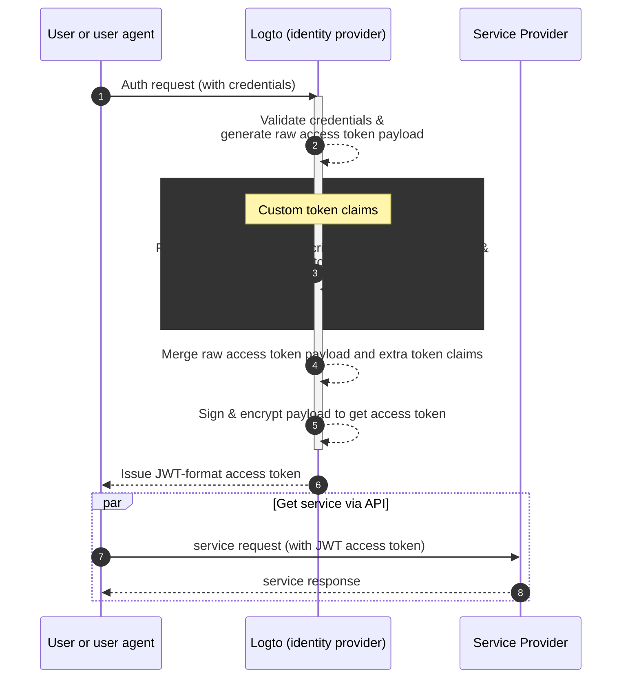

:::info
Logto built-in token claims cannot be overridden or modified. Custom claims will be added to the token as additional claims. If any custom claims conflict with the built-in claims, those custom claims will be ignored.
:::

:::warning
Security note: In self-hosted deployments, custom JWT scripts are executed with the same privileges as the Logto server process. This feature is intended for trusted administrators only. Do not allow untrusted or lower-privilege users to create, modify, or test these scripts.
:::

## Related resources \{#related-resources}


================================================================================
SOURCE: src/extraction/local-docs/lgoto/docs/security/password-policy.mdx
================================================================================

---
slug: /security/password-policy
sidebar_label: Password Policy
sidebar_position: 1
---

# Password policy

Logto applies the password policy in different ways depending on how the password is created or updated:

- End-user flows such as [the out-of-the-box sign-in experience](/end-user-flows/sign-up-and-sign-in/sign-up), [the Experience API](/customization/bring-your-ui), and [the Account API](/end-user-flows/account-settings/by-account-api#update-users-password) always enforce the current [password policy](#set-up-password-policy).
- Administrator actions via the Management API [`patch /api/users/{userId}/password`](https://openapi.logto.io/operation/operation-updateuserpassword) are exempt, allowing you to provision or reset credentials without policy checks when needed.
- To audit existing passwords against the current rules, call [`POST /api/sign-in-exp/default/check-password`](https://openapi.logto.io/operation/operation-checkpasswordwithdefaultsigninexperience) and act on the returned validation result. Read [Password compliance check](#password-compliance-check) to learn more.

## Set up password policy \{#set-up-password-policy}

For new users or users who are updating their password, you can set a password policy to enforce password strength requirements. Visit the <CloudLink to="/security/password-policy"> Console > Security > Password policy</CloudLink> to configure the password policy settings.

1. **Minimum password length**: Set the minimum number of characters required for the password. (NIST suggests using at least 8 [characters](https://pages.nist.gov/800-63-3/sp800-63b.html#sec5))
2. **Minimum required character types**: Set the minimum number of character types required for the password. The available character types are:
   1. Uppercase letters: `(A-Z)`
   2. Lowercase letters: `(a-z)`
   3. Numbers: `(0-9)`
   4. Special characters: ``(!"#$%&'()\*+,-./:;<>=?@[]^\_`|{}~ )``
3. **Breach history check**: Enable this setting to reject passwords that have been previously exposed in data breaches. (Powered by [Have I Been Pwned](https://haveibeenpwned.com/Passwords))
4. **Repetition check**: Enable this setting to reject passwords that contain repetitive characters. (e.g., "11111111" or "password123")
5. **User information check**: Enable this setting to reject passwords that contain user information such as username, email address, or phone number.
6. **Custom words**: Provide a list of custom words (case-insensitive) that you want to reject in the password.

## Password compliance check \{#password-compliance-check}

After you update the password policy in Logto, existing users can still sign in with their current passwords. Only newly created account will be required to follow the updated policy.

To enforce stronger security, you can use the `POST /api/sign-in-exp/default/check-password` [API](https://openapi.logto.io/operation/operation-checkpasswordwithdefaultsigninexperience) to check whether a user's password meets the current policy defined in the default sign-in experience. If it doesn't, you can prompt the user to update their password with a custom flow using [Account API](/end-user-flows/account-settings/by-account-api).

## Related resources \{#related-resources}


================================================================================
SOURCE: src/extraction/local-docs/lgoto/docs/concepts/authn-vs-authz.mdx
================================================================================

---
sidebar_position: 2
---

# Authentication vs. authorization

The difference between **authentication** and **authorization** can be summarized as follows:

- **Authentication** answers the question “Which identity do you own?”
- **Authorization** answers the question “What can you do?”

For a complete customer identity and access management (CIAM) introduction, you can refer to our CIAM series:

- [CIAM 101: Authentication, Identity, SSO](https://blog.logto.io/ciam-101-intro-authn-sso/)
- [CIAM 102: Authorization & Role-based Access Control](https://blog.logto.io/ciam-102-authz-and-rbac/)

## Authentication \{#authentication}

Logto supports various interactive and non-interactive authentication methods, for example:

- **Sign-in experience**: The authentication process for end-users.
- **Machine-to-machine (M2M) authentication**: The authentication process for services or applications.

The ultimate goal of authentication is dramatically simple: to verify and get the unique identifier of the entity (in Logto, a user or an application).

## Authorization \{#authorization}

In Logto, authorization is done through role-based access control (RBAC). It gives you the complete control to manage the access of your users or M2M applications to the following:

- **API resources**: A global entity that represents by an absolute URI.
- **Organizations**: A group of users or applications.
- **Organization API resources**: An API resource that belongs to an organization.

To learn more about these concepts, you can refer to the following resources:

- [Role-based access control (RBAC)](/authorization/role-based-access-control)
- [Organizations (Multi-tenancy)](/organizations)

Here's a visual representation of the relationship between these concepts:

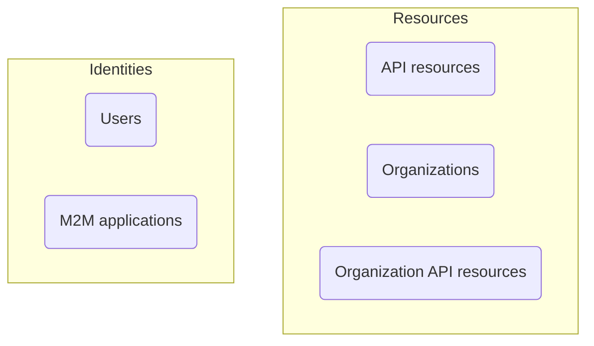

In a nutshell, authorization is about defining the rules that determine what entities in the "Identities" group can access the entities in the "Resources" group.

## Frequently asked questions \{#frequently-asked-questions}

### I need to specify which users can sign in to an application \{#i-need-to-specify-which-users-can-sign-in-to-an-application}

Due to the nature of single sign-on (SSO), Logto currently does not support using applications as resources. Instead, you can define API resources and permissions to control access to your resources.

### I need my users to sign in to an organization \{#i-need-my-users-to-sign-in-to-an-organization}

As mentioned earlier, authentication involves verifying the identity of an entity, while access control is handled through authorization. Therefore:

- Determining which organization(s) a user belongs to is an authorization concern.
- The sign-in process is an authentication concern.

This means that there is no concept of "signing in to an organization" in Logto. Once a user is authenticated, they can be authorized to access all resources (including organization resources) based on the defined permissions.

This model is efficient and clear, as it separates the concerns of authentication and authorization. All modern SaaS applications, such as GitHub and Notion, follow this model.

However, there are some cases where you need to establish 1-1 mappings between user sources and organizations. In this case, [enterprise SSO](/end-user-flows/enterprise-sso) and [organization Just-in-Time (JIT) provisioning](/organizations/just-in-time-provisioning) can be helpful.

### Our customers need custom branding for their sign-in pages \{#our-customers-need-custom-branding-for-their-sign-in-pages}

Please check out [app-specific branding](/customization/match-your-brand/#app-specific-branding) and [organization-specific branding](/customization/match-your-brand/#organization-specific-branding) for related configurations.


================================================================================
SOURCE: src/extraction/local-docs/lgoto/docs/concepts/opaque-token.mdx
================================================================================

---
sidebar_position: 6
---

# Opaque token

During the authentication process, if no resource is specified, Logto will issue an opaque access token instead of a JWT. The opaque token is a random string and it's much shorter than a JWT:

```json
{
  "access_token": "some-random-string", // opaque token
  "expires_in": 3600,
  "id_token": "eyJhbGc...aBc", // JWT
  "scope": "openid profile email",
  "token_type": "Bearer"
}
```

The opaque token can be used to call the [userinfo endpoint](https://openid.net/specs/openid-connect-core-1_0.html#UserInfo) and to access protected resources that require authentication. Since it's not a JWT, how can the resource server validate it?

Logto provides an [introspection endpoint](https://www.rfc-editor.org/rfc/rfc7662.html) that can be used to validate opaque tokens. By default, the introspection endpoint is `/oidc/token/introspection` and accepts `POST` requests. The following parameter is required:

- `token`: the opaque token to validate

The endpoint also requires client authentication. You can use one of the following methods:

- HTTP Basic authentication: Use the `Authorization` header with the value `Basic <base64-encoded-credentials>`. The credentials must be the client ID and client secret separated by a colon (`:`) and base64-encoded.
- HTTP POST authentication: Use the `client_id` and `client_secret` parameters:
  - `client_id`: the client ID of the application that requested the token
  - `client_secret`: the client secret of the application that requested the token

The client ID (app ID) and client secret (app secret) can be the app credentials from any "traditional web" or "machine-to-machine" application in Logto. The introspection endpoint will return an error if the credentials are invalid.

The introspection endpoint returns a JSON object with the claims of the token:

```json
{
  "active": true, // whether the token is valid or not
  "sub": "1234567890" // the subject of the token (the user ID)
}
```

If the token is invalid, the `active` field will be `false` and the `sub` field will be omitted.

Here's a non-normative example of the introspection request:

```bash
curl --location \
  --request POST 'https://[tenant-id].logto.app/oidc/token/introspection' \
  --header 'Content-Type: application/x-www-form-urlencoded' \
  --data-urlencode 'token=some-random-string' \
  --data-urlencode 'client_id=1234567890' \
  --data-urlencode 'client_secret=1234567890'
```

Remember to replace `[tenant-id]` with your tenant ID.

## Opaque token and organizations \{#opaque-token-and-organizations}

Opaque tokens can be used to retrieve organization membership information via the [userinfo endpoint](https://openid.net/specs/openid-connect-core-1_0.html#UserInfo). When you request the `urn:logto:scope:organizations` scope, the userinfo endpoint will return the user's organization-related claims, such as `organizations` (organization IDs) and `organization_data`.

However, **opaque tokens cannot be used as organization tokens**. Organization tokens are always issued in JWT format because:

1. Organization tokens contain organization-specific claims (like `organization_id` and scoped permissions) that need to be validated by resource servers.
2. The JWT format allows resource servers to verify the token and extract organization context without additional API calls.

To obtain an organization token, you need to use the [refresh token flow](/authorization/organization-permissions#refresh-token-flow) or [client credentials flow](/authorization/organization-permissions#client-credentials-flow) with organization parameters.


================================================================================
SOURCE: src/extraction/local-docs/lgoto/docs/connectors/connector-data-structure.mdx
================================================================================

---
sidebar_position: 5
---

# Connector data structure

## Introduction \{#introduction}

### What is a connector? \{#what-is-a-connector}

_Connectors_ play a critical role in Logto. With their help, Logto enables end-users to use passwordless registration or sign-in and the capabilities of signing in with social accounts. With the increasing popularity of websites and applications, passwordless and social sign-ins allow users to avoid managing numerous accounts and passwords.

Follow our [connector guides](/connectors) if you want to set up an existing connector. If you cannot find the connector you want to set up, you may develop those connectors by following the guides in [developer your connector](/logto-oss/develop-your-connector).

## Compositions \{#compositions}

There are lots of properties in connector data.

To make the data loading and updating more efficient, we store part of connector data which will be modified frequently to DB and the rest of that locally.

- _Local storage_, also known as [_ConnectorMetadata_](/connectors/connector-data-structure#connectors-remote-storage-connector-db), is an object containing fixed properties such as logo, connector type, and so on. (:face_with_monocle: Having trouble understanding these properties? No worry, a detailed explanation comes later!)
- _Remote storage_ is stored in DB for the sake of relatively frequent changes on those data.

## Connector's local storage: ConnectorMetadata \{#connectors-local-storage-connectormetadata}

### id \{#id}

_id_ is an _unique_ string-typed key to identify a connector in Logto.

It's assigned by the developers of each connector and will be uploaded to DB.

### target (Identity provider name) \{#target-identity-provider-name}

_target_ is a lowercase string to distinguish the social identities source of the social connector.

Logto users can regard this variable as "Identity provider name" for better understanding.

For example, your _target_ should be _google_ if you sign in to Logto with your google account. The value of _target_ can be an arbitrary non-empty string, but we encourage you to keep it straightforward since you can not change it. We DO NOT allow the existence of multiple connectors with the same _target_ and platform. On the other hand, you can have social connectors for different platforms sharing the same _target_. For example, if users want to log in via _WeChat_ on their phone, a native _WeChat_ app is required per _WeChat_’s TOU; at the same time, a web _WeChat_ app is also needed to enable log in to web applications. These two _WeChat_ apps share the same identity provider and should have the same target.

We have concluded different use cases and suggestions for users since _target_ is a complicated concept.

|                                        | Example                                                                                          | Scenario                                                                                                                     | Result                                                                                                                                                   | Recommend?                                                                                                                                                                                          |
| -------------------------------------- | ------------------------------------------------------------------------------------------------ | ---------------------------------------------------------------------------------------------------------------------------- | -------------------------------------------------------------------------------------------------------------------------------------------------------- | --------------------------------------------------------------------------------------------------------------------------------------------------------------------------------------------------- |
| Different IdPs and different _targets_ | 1. GitHub Connector (target: `github`) <br /> 2. Google Connector (target: `google`)             | An app that supports both login with GitHub and Google account.                                                              | Most common use cases.                                                                                                                                   | ✅                                                                                                                                                                                                  |
| Different IdPs and the same _target_   | 1. GitHub Connector (target: `github`) <br /> 2. Google Connector (target: `github`)             | N/A                                                                                                                          | It's possible for a user to sign in to a Logto account that was created using another user's GitHub account.                                             | ❌                                                                                                                                                                                                  |
| The same IdP and different _targets_   | 1. GitHub Connector (target: `github`) <br /> 2. OAuth GitHub Connector (target: `github_oauth`) | The GitHub connector is used for Application A, while the OAuth GitHub connector was created specifically for Application B. | Signing in to Logto using these two different connectors will always create separate Logto accounts - even if the user is using the same GitHub account. | Splitting your user pool is the only scenario where you would need to use both connectors. However, it's generally considered best practice to create two separate tenants to handle this use case. |
| The same IdP and the same _target_     | 1. GitHub Connector (target: `github`) <br /> 2. OAuth GitHub Connector (target: `github`)       | N/A                                                                                                                          | Using either of these two connectors can result in the exact same outcome.                                                                               | Creating two connectors that essentially do the same thing can be confusing for end-users and doesn't make much sense. It's better to use one connector that fits your specific use case.           |

### type \{#type}

_type_ is the property that record the type of the connector.

We define the connectors into three different types, based on their functionalities:

- _Social_: Connectors that can access user information from arbitrary third-party social media with end-users authorization.
- _SMS_: Connectors enable end-users to receive text messages on their phones.
- _Email_: Connectors that can help send emails to end-users.

### platform \{#platform}

_platform_ is used to identify which platform the connector is built for.

_platform_ should be either `null` or one of the following string-typed values:

- _Native_: Connectors that ONLY work for native mobile apps.
- _Web_: Connectors work ONLY on desktop web applications.
- _Universal_: Connectors can work on both mobile web apps and desktop web apps.

:::note
_platform_ of _email connectors_ and _SMS connectors_ should always be `null`.<br/>
ONLY _social connectors_ can have non-NULL _platform_ values.
:::

### name \{#name}

_name_ is an object whose keys are i18n country codes and values are connectors' display name.

### description \{#description}

_description_ is also an object whose keys are i18n country codes and values are brief connector descriptions.

:::note
To support i18n display at the client-side, we store the _name_ (as well as _description_) props as a map, which uses country codes as its' key, name (or description) in local characters as the value.
:::

### logo \{#logo}

_logo_ is an URL or relative path of connector's logo.

### logoDark \{#logodark}

_logoDark_ is a _nullable_ URL or relative path of connector's dark mode logo.

:::note
_logo_ is always required, and _logoDark_ is optional.

We display _logo_ in light mode and _logoDark_ in dark mode if it exists. Otherwise will fall back to show _logo_ in dark mode.
:::

### isStandard \{#isstandard}

_isStandard_ is an OPTIONAL boolean attribute to identify whether the social connector is a "standard" connector. You can identify a "standard" connector by its truthy `isStandard` attribute.

:::note
Logto only supports "standard" social connectors. That is to say, all Logto's Email or SMS connectors are NOT "standard".

Logto call connectors built upon open and standard protocols (e.g., OAuth, OIDC, SAML, etc.) as "standard" connectors. Logto's users are expected to construct multiple instances on each standard connector based on this context. For example, suppose that Logto has already provided an OAuth standard connector, users can build "OAuth GitHub connector", "OAuth Google connector" and "OAuth Facebook connector" instances. They are all based on the Logto OAuth standard connector.

If you are familiar with Logto's connector design, at most ONE Email or SMS connector can exist at the same time, which means Logto do not need "standard" Email or SMS connectors at the current stage.
:::

### readme \{#readme}

_readme_ is a relative path of the connector's README markdown file whose contexts will show up in "Admin Console" during connectors' set-up.

### configTemplate \{#configtemplate}

_configTemplate_ is a relative path of the connector's configuration example.

## Connector's remote storage: _Connector DB_ \{#connectors-remote-storage-_connector-db_}

### id \{#id-1}

_id_, which functions as connector DB's primary key, is an randomly generated string-typed key to identify connector in DB.

### connectorId \{#connectorid}

_connectorId_ is a string-typed key and is the ONLY bridge to align _Connector DB_ and _ConnectorMetadata_. For each matched connector DB data and connector code module pair, _connectorId_ always equals to [metadata._id_](#id) of the code module.

### metadata \{#metadata}

_metadata_ is a subset of [ConnectorMetadata](#connectors-local-storage-connectormetadata), which contains configurable attributes i.e. [_logo_](#logo), [_logoDark_](#logodark), [_target_](#target-identity-provider-name) and [_name_](#name).

### syncProfile \{#syncprofile}

_syncProfile_ is a boolean value to determine the user profile updating scheme, default to be FALSE.

If _syncProfile_ is FALSE, the Logto user's basic information (including name and avatar) will be updated only when the user first signs up to Logto via this connector. Otherwise, every time users sign in to Logto through the connector, the Logto account profile will be updated.

### config \{#config}

_config_ could be an arbitrary non-empty object.

It is where a connector store its configuration. Each connector have different properties in _config_ and it obligated to be valid (connectors have different standard for "valid".) before being saved to DB. ONLY those _config_ passed validity check can be updated to DB, or there would throw an error.

Developers are required to implement a _config_ guard when developing their own connectors, see [develop your connector](/logto-oss/develop-your-connector) for more details.

Want to have a glance at _config_ samples? Go to [connectors](/connectors) or each connector's settings page.

:::note
In current Logto version, only one _Email/SMS_ connector can exist at the same time, all other connectors with same type are automatically deleted.

The rule, unique working Email or SMS connector, is not applicable to _Social_ connectors.<br/>
In other words, you can add multiple _Social_ connectors.
:::

### createdAt \{#createdat}

_createdAt_ is an auto-generated timestamp string to track the time when a connector is created in DB.


================================================================================
SOURCE: src/extraction/local-docs/lgoto/docs/connectors/social.mdx
================================================================================

---
id: social-connectors
title: Social connectors
sidebar_label: Social connectors
sidebar_position: 3
---

# Social connectors

Simplify user onboarding and increase conversion rates by enabling [social login](/end-user-flows/sign-up-and-sign-in/social-sign-in) with Logto. Users can quickly and securely sign in using their existing social media accounts, eliminating the need for password creation or complex registration flow. Logto offers a variety of pre-built social connectors and supports custom integrations for maximum flexibility.

## Choose your social connectors \{#choose-your-social-connectors}

Logto offers two types of social connectors:

### Popular social connectors \{#popular-social-connectors}

Logto provides pre-configured connectors for popular social platforms, ready for immediate use.

```mdx-code-block


================================================================================
SOURCE: src/extraction/local-docs/lgoto/docs/connectors/enterprise-connectors.mdx
================================================================================

---
id: enterprise-connectors
title: Enterprise connectors
sidebar_label: Enterprise connectors
sidebar_position: 4
---


Logto's [Single Sign-On (SSO) solution](/end-user-flows/enterprise-sso) simplifies access management for your enterprise clients. Enterprise SSO connectors are crucial for enabling SSO for your different enterprise clients.

These connectors facilitate the authentication process between your service and the enterprise IdPs. Logto supports both [SP-initiated SSO](/end-user-flows/enterprise-sso/sp-initiated-sso) and [IdP-initiated SSO](/end-user-flows/enterprise-sso/idp-initiated-sso) which allows organization members to access your services using their existing company credentials, enhancing security and productivity.

## Enterprise connectors \{#enterprise-connectors}

Logto provides pre-built connectors for popular enterprise identity providers, offering quick integration. For custom needs, we support integration via [OpenID Connect (OIDC)](https://auth.wiki/openid-connect) and [SAML](https://auth.wiki/saml) protocols.

### Popular enterprise connectors \{#popular-enterprise-connectors}


- Adding SSO: The SSO identities will be linked to existing accounts if the email matches.
- Removing SSO: Removes SSO identities linked to the account, but retains user accounts, and prompts users to set up alternative verification methods.


## Related resources \{#related-resources}


================================================================================
SOURCE: src/extraction/local-docs/lgoto/docs/connectors/README.mdx
================================================================================


# Connectors

Connectors are the bridge between Logto and external services. They enable [passwordless-verification](https://auth.wiki/passwordless) methods like [email verification](/end-user-flows/sign-up-and-sign-in/sign-in), [SMS verification](/end-user-flows/sign-up-and-sign-in/sign-in), [social login](/end-user-flows/sign-up-and-sign-in/social-sign-in), and [enterprise SSO](/end-user-flows/enterprise-sso).

Traditional account registration with usernames and passwords can be a tedious and frustrating process. Users often struggle to remember complex passwords and may be hesitant to create new accounts due to the inconvenience. If users can provide their email or phone number and verify it via verification codes; or log in using accounts like Google/Facebook, or corporate accounts like Microsoft, this can greatly simplify the login process and reduce user churn. Connector was created to solve this problem.

## Connector types \{#connector-types}

Logto offers four types of connectors:


================================================================================
SOURCE: src/extraction/local-docs/lgoto/docs/connectors/sms-connectors/sms-templates.mdx
================================================================================

---
id: sms-templates
title: SMS templates
sidebar_label: SMS templates
sidebar_position: 2
---

Logto provides four different templates for customizing SMS content, which are categorized based on their usage type: Register, SignIn, ForgotPassword, and Generic. It is highly recommended that you use different templates for various use cases, or it could hit rate limit, leading to a temporary outage of your service.

## SMS template types and examples \{#sms-template-types-and-examples}

There are some examples just for reference:

| usageType                | Scenario                                                                                                                                                                                                                                                                                                                                                                                                                                                                                         | Template examples                                                                |
| ------------------------ | ------------------------------------------------------------------------------------------------------------------------------------------------------------------------------------------------------------------------------------------------------------------------------------------------------------------------------------------------------------------------------------------------------------------------------------------------------------------------------------------------ | -------------------------------------------------------------------------------- |
| SignIn                   | Users [sign in using their phone number](/end-user-flows/sign-up-and-sign-in/sign-in) and verify by entering SMS verification code instead of entering a password.                                                                                                                                                                                                                                                                                                                               | Logto sign-in verification code: `{{code}}`. Expires in 10 mins.                 |
| Register                 | Users [create an account using their phone number](/end-user-flows/sign-up-and-sign-in/sign-up) and verify it by entering a verification code sent by Logto to their phone number.                                                                                                                                                                                                                                                                                                               | Logto sign-up verification code: `{{code}}`. Expires in 10 mins.                 |
| ForgotPassword           | If users forget their password during login, they can choose to verify their identity using the phone number first to [reset password](/end-user-flows/sign-up-and-sign-in/reset-password).                                                                                                                                                                                                                                                                                                      | Logto password reset verification code: `{{code}}`. Expires in 10 mins.          |
| Generic                  | This template can be used as a general backup option for various scenarios, including testing connector configurations, [verifying or linking phone number after sign-in](/end-user-flows/account-settings/by-management-api#email-and-phone-number-verification), and so on.                                                                                                                                                                                                                    | Logto verification code: `{{code}}`. Expires in 10 mins.                         |
| OrganizationInvitation   | Use this template to [send users an invitation lin](/end-user-flows/organization-experience/invite-organization-members#configure-your-email-connector) to join the organization.                                                                                                                                                                                                                                                                                                                | Logto organization invitation verification code: `{{code}}`. Expires in 10 mins. |
| UserPermissionValidation | During app usage, there may be some high-risk operations or operations with a relatively high risk level that [require additional user verification](/end-user-flows/account-settings/by-account-api#verify-by-sending-a-verification-code-to-the-users-email-or-phone), such as bank transfers, deleting resources in use, and canceling memberships. The `UserPermissionValidation` template can be used to define the content of the SMS verification code users receive in these situations. | Logto verification code: `{{code}}`. Expires in 10 mins.                         |
| BindNewIdentifier        | When a user modifies their profile, they may [bind a phone number to their current account](/end-user-flows/account-settings/by-account-api#manage-phone). In this case, the `BindNewIdentifier` template can be used to customize the content of the verification SMS.                                                                                                                                                                                                                          | Logto account linking verification code: `{{code}}`. Expires in 10 mins.         |
| MfaVerification          | When [SMS MFA](/end-user-flows/mfa/sms-mfa) is enabled, this template is used to send verification codes to users during the multi-factor authentication process.                                                                                                                                                                                                                                                                                                                                | Logto 2-step verification code: `{{code}}`. Expires in 10 mins.                  |
| BindMfa                  | When [SMS MFA](/end-user-flows/mfa/sms-mfa) is enabled, this template is used to set up SMS verification code for MFA. Users receive this verification code when they bind or configure their phone number as an MFA factor for their account.                                                                                                                                                                                                                                                   | Logto adding 2-step verification code: `{{code}}`. Expires in 10 mins.           |

It's important to understand these parameters:

- The verification code is valid for 10 minutes. We currently do not support customization on the expiry time.
- Logto will replace the `{{code}}` placeholder in the SMS template with a verification code. Therefore, please ensure that the template has a placeholder reserved.

:::note
Some countries and regions may not allow sending unapproved content via SMS due to compliance requirements. SMS templates need to be registered and approved by the SMS provider before they can be used. In such cases, the content might be indexed by template ID to the corresponding template.
:::


================================================================================
SOURCE: src/extraction/local-docs/lgoto/docs/connectors/sms-connectors/README.mdx
================================================================================

---
id: sms-connectors
title: SMS connectors
sidebar_label: SMS connectors
sidebar_position: 1
---

# SMS connectors

Configuring an SMS connector allows you to send a [one-time passwords (OTPs)](https://auth.wiki/otp) to the user's phone number. This passwordless authentication mechanism can be utilized in various scenarios, including [sign-up](/end-user-flows/sign-up-and-sign-in/sign-up), [sign-in](/end-user-flows/sign-up-and-sign-in/sign-in), [forgot password](/end-user-flows/sign-up-and-sign-in/reset-password), [link-account processes](/end-user-flows/sign-up-and-sign-in/social-sign-in#account-linking), [member invitations](/end-user-flows/organization-experience/invite-organization-members) and [validate the user's identity](/end-user-flows/security-verification). It streamlines user authentication and enhances security by minimizing the risk of password-related breaches.

## Choose your SMS connector \{#choose-your-sms-connector}

Connect with your preferred SMS service provider using Logto's step-by-step guides.

We provide out-of-the-box support for the following SMS service providers:

```mdx-code-block


We're still working on more connectors. If you require further options, just let us know your needs in Discord and file a Feature Request on [GitHub](https://github.com/logto-io/logto/issues). If you need further assistance, you can also [contact us via email](mailto:contact@logto.io).

For open-source Logto users, we provide an easy-to-extend connector creation method, allowing you to [customize your own connector](/logto-oss/develop-your-connector) based on your specific scenarios. You are always welcomed to submit a pull request to Logto, so that others in the community may also benefit from your work.


================================================================================
SOURCE: src/extraction/local-docs/lgoto/docs/connectors/email-connectors/email-templates.mdx
================================================================================

---
id: email-templates
title: Email templates
sidebar_label: Email templates
sidebar_position: 3
---

Logto provides different templates for customizing email content, which are categorized based on their use cases.

It is strongly recommended that you use different templates in different scenarios. Otherwise, users may receive email content that does not match the current operation, causing confusion. If there are missing templates that are not configured, it may cause flow errors that rely on that template and affect the normal development of business.

## Email template customization options \{#email-template-customization-options}

Logto offers three distinct approaches for email template management:

1. **Customize templates in Logto**

   - **Connectors**:
     - [SMTP](/integrations/smtp)
     - [SendGrid](/integrations/sendgrid-email)
     - [Mailgun](/integrations/mailgun)
     - [AWS Direct Mail](/integrations/aws-ses)
     - [Aliyun Direct Mail](/integrations/aliyun-dm)
   - **Capabilities**:
     - ✅ Flexibly insert diverse variables into templates
     - ✅ Create custom multi-language templates via Management APIs
     - ✅ Full template editing within Logto

2. **Customize templates in provider platform**

   - **Connectors**:
     - [Postmark](/integrations/postmark)
     - [HTTP Email](/integrations/http-email)
   - **Capabilities**:
     - ✅ Pass variables to provider platform
     - ✅ Pass `locale` parameter to provider platform for localization
     - ✅ Full template editing within provider's dashboard (Use Logto Management APIs)

3. **Prebuilt templates (non-customizable)**

   - **Connector**:
     - [Logto Built-in Email Service](/connectors/email-connectors/built-in-email-service)
   - **Capabilities**:
     - ✅ Native variable support
     - ✅ Multi-language templates
     - ❌ Template/UI modifications disabled

## Email template types \{#email-template-types}

| usageType                | Scenario                                                                                                                                                                                                                                                                                                                                                                                                                                                                                           | Variables                                                                             |
| ------------------------ | -------------------------------------------------------------------------------------------------------------------------------------------------------------------------------------------------------------------------------------------------------------------------------------------------------------------------------------------------------------------------------------------------------------------------------------------------------------------------------------------------- | ------------------------------------------------------------------------------------- |
| SignIn                   | Users [sign in using their email](/end-user-flows/sign-up-and-sign-in/sign-in) and verify by entering verification code instead of entering a password.                                                                                                                                                                                                                                                                                                                                            | code: string<br/>application: `ApplicationInfo`<br/>organization?: `OrganizationInfo` |
| Register                 | Users [create an account using their email](/end-user-flows/sign-up-and-sign-in/sign-up) and verify it by entering a verification code sent by Logto to their email.                                                                                                                                                                                                                                                                                                                               | code: string<br/>application: `ApplicationInfo`<br/>organization?: `OrganizationInfo` |
| ForgotPassword           | If users forget their password during login, they can choose to verify their identity using the email first to [reset password](/end-user-flows/sign-up-and-sign-in/reset-password).                                                                                                                                                                                                                                                                                                               | code: string<br/>application: `ApplicationInfo`<br/>organization?: `OrganizationInfo` |
| Generic                  | This template can be used as a general backup option for various scenarios, including testing connector configurations, [verifying or linking email after sign-in](/end-user-flows/account-settings/by-management-api#email-and-phone-number-verification), and so on.                                                                                                                                                                                                                             | code: string                                                                          |
| OrganizationInvitation   | Use this template to [send users an invitation lin](/end-user-flows/organization-experience/invite-organization-members#configure-your-email-connector) to join the organization.                                                                                                                                                                                                                                                                                                                  | link: string<br/>organization: `OrganizationInfo`<br/>inviter?: `UserInfo`            |
| UserPermissionValidation | During app usage, there may be some high-risk operations or operations with a relatively high risk level that [require additional user verification](/end-user-flows/account-settings/by-account-api#verify-by-sending-a-verification-code-to-the-users-email-or-phone), such as bank transfers, deleting resources in use, and canceling memberships. The `UserPermissionValidation` template can be used to define the content of the email verification code users receive in these situations. | code: string<br/>user: `UserInfo`<br/>application?: `ApplicationInfo`                 |
| BindNewIdentifier        | When a user modifies their profile, they may [bind an email address to their current account](/end-user-flows/account-settings/by-account-api#update-or-link-new-email). In this case, the `BindNewIdentifier` template can be used to customize the content of the verification email.                                                                                                                                                                                                            | code: string<br/>user: `UserInfo`<br/>application?: `ApplicationInfo`                 |
| MfaVerification          | When [email MFA](/end-user-flows/mfa/email-mfa) is enabled, this template is used to send verification codes to users during the multi-factor authentication process.                                                                                                                                                                                                                                                                                                                              | code: string<br/>application: `ApplicationInfo`<br/>organization?: `OrganizationInfo` |
| BindMfa                  | When [email MFA](/end-user-flows/mfa/email-mfa) is enabled, this template is used to set up email verification code for MFA. Users receive this verification code when they bind or configure their email address as an MFA factor for their account.                                                                                                                                                                                                                                              | code: string<br/>user: `UserInfo`<br/>application?: `ApplicationInfo`                 |

## Email template variables \{#email-template-variables}

### Code \{#code}

The verification code that users need to enter to complete the verification process. Available in `SignIn`, `Register`, `ForgotPassword`, `Generic`, `UserPermissionValidation`, and `BindNewIdentifier` templates.

    - Verification codes expire in 10 minutes. We currently do not support the customization of verification code expiry time.
    - A `{{code}}` placeholder needs to be reserved in the template. When sending a verification code, a randomly generated code will replace this placeholder before we send email to users.

### ApplicationInfo \{#applicationinfo}

The public information of the client application that users are interacting with. Available in `SignIn`, `Register`, `ForgotPassword`, `UserPermissionValidation`, and `BindNewIdentifier` templates.

```ts
type ApplicationInfo = {
  id: string;
  name: string;
  displayName?: string;
  branding?: {
    logoUrl?: string;
    darkLogoUrl?: string;
    favicon?: string;
    darkFavicon?: string;
  };
};
```

- All nested application info fields can be accessed in templates through dot notation. For example, `{{application.name}}` will be replaced with the actual application name from your configuration.
- If the root `application` variable is not provided, the handlebars placeholder will be ignored and not replaced.
- If the provided `application` object does not contain the required fields or the value is undefined, the handlebars placeholder will be replaced with an empty string. E.g. `{{application.foo.bar}}` will be replaced with ``.

### OrganizationInfo \{#organizationinfo}

The public information of the organization that users are interacting with.

```ts
type OrganizationInfo = {
  id: string;
  name: string;
  branding?: {
    logoUrl?: string;
    darkLogoUrl?: string;
    favicon?: string;
    darkFavicon?: string;
  };
};
```

- For the `SignIn`, `Register`, and `ForgotPassword` templates, the `organization` variable is optional. Only available when the `organization_id` parameter is present in the authorization request. See [Organization-specific branding](/customization/match-your-brand#organization-specific-branding) for more details.
- For the `OrganizationInvitation` template, the `organization` variable is mandatory.

### UserInfo \{#userinfo}

The public information of the user that the email is sent to. Available in `UserPermissionValidation`, `BindNewIdentifier` and `OrganizationInvitation` templates.

```ts
type UserInfo = {
  id: string;
  name?: string;
  username?: string;
  primaryEmail?: string;
  primaryPhone?: string;
  avatar?: string;
  profile?: Profile;
};
```

- Check [profile](/user-management/user-data#profile) for more details about the `Profile` type.
- The `user` variable is mandatory for the `UserPermissionValidation` and `BindNewIdentifier` templates.
- The `inviter` variable is optional for the `OrganizationInvitation` template. Only available when the `inviterId` is provided in the organization invitation request.

### UI Locales \{#ui-locales}

The original `ui_locales` value provided in the OIDC authentication request that initiated the current interaction.

- Type: `string` (space-separated list of BCP 47 language tags, per OIDC spec), for example: `"fr-CA fr en"`.
- Availability: Present when the current sign-in interaction was initiated with `ui_locales`. If not provided, this variable is omitted.
- Typical usage: Include in email content or subject to record the user's requested UI languages for i18n support or auditing, e.g. `Requested languages: {{uiLocales}}`.

## Email template examples \{#email-template-examples}

You can use the provided email template code examples as a starting point for customizing your UI. To create a user interface similar to the following:


Since the email templates used in different scenarios of Logto are very similar, with the only difference being the description of the current scenario and operation.

We do not show the HTML code of all templates in detail here. Instead, we only take the **sign-in** scenario as an example. Other scenarios, such as sign-up and forgot password, are very similar to the following sample.

Users can refer to this template and adjust according to their actual situation.

```html
```

You can then escape the HTML code above and add it to the connector "Template" field in configs as follows (assuming using SendGrid connector):

```json
{
  "subject": "<sign-in-template-subject>",
  "content": "<table cellpadding=\"0\" cellspacing=\"0\" ...",
  "usageType": "SignIn",
  "type": "text/html"
}
```

## Email template localization \{#email-template-localization}

### Custom email templates for different languages \{#custom-email-templates-for-different-languages}

Logto supports creating custom email templates for different languages via Management API. You can create custom email templates for different languages and template types to provide a localized experience for your users.

```ts
type EmailTemplate = {
  languageTag: string;
  templateType: TemplateType;
  details: {
    subject: string;
    content: string;
    contentType?: 'text/html' | 'text/plain';
    replyTo?: string;
    sendFrom?: string;
  };
};
```

| Field       | Description                                                                                                                                                                        |
| ----------- | ---------------------------------------------------------------------------------------------------------------------------------------------------------------------------------- |
| subject     | The subject template of the email.                                                                                                                                                 |
| content     | The content template of the email.                                                                                                                                                 |
| contentType | Some email providers may render email templates differently based on the content type. (e.g. Sendgrid, Mailgun). Use this field to specify the content type of the email template. |
| replyTo     | The email address that will receive replies to the email. Check with your email provider to see if this field is supported.                                                        |
| sendFrom    | The name alias of the email sender. Check with your email provider to see if this field is supported.                                                                              |

Once the email templates are created, Logto will automatically select the appropriate email template by first resolving the user's language preference, then picking the best-matching template.

Language preference is resolved in the following order:

1. If the OIDC authentication request includes `ui_locales`, Logto selects the first tag in `ui_locales` that is supported by your tenant's language library. See [ui_locales](/end-user-flows/authentication-parameters/ui-locales) for details.
2. Otherwise, for client-side [Experience APIs](/end-user-flows/sign-up-and-sign-in) and [User Account APIs](/end-user-flows/account-settings/by-account-api), Logto uses the `Accept-Language` header. For Management APIs (such as [Organization Invitation](/end-user-flows/organization-experience/invite-organization-members)), you can specify language via the `locale` field in `messagePayload`.
3. If neither is provided, Logto falls back to the tenant's default language configured in the Sign-in & account > Content. Check [Localized languages](/customization/localized-languages#customization-steps-in-logto-console) for configuration details.

Template selection:

4. With the resolved language, Logto looks for a matching custom email template using `languageTag` and `templateType`. If found, that template is used.
5. If no matching custom template exists, Logto uses the default email template defined in the connector configuration.

**Supported email connectors**:

- [Aliyun Direct Mail](/integrations/aliyun-dm)
- [Amazon Direct Mail](/integrations/aws-ses)
- [Mailgun](/integrations/mailgun)
- [SendGrid](/integrations/sendgrid-email)
- [SMTP](/integrations/smtp)

### Provider-side email template localization \{#provider-side-email-template-localization}

For developers who use the email connectors that have email template managed by the provider:

- [HTTP Email](/integrations/http-email)
- [Postmark](/integrations/postmark)

The user preferred language will be passed to the provider using the `locale` parameter in the template payload. You can create multiple templates for different languages in the provider's console and use the `locale` parameter to specify the language preference.

:::note

When `ui_locales` is present in the authentication request, both the `locale` and `uiLocales` variables will be available in the template context.
The `uiLocales` variable contains the original `ui_locales` value from the authentication request, while the `locale` variable is determined based on the first supported tag resolved from `ui_locales`. If `ui_locales` is not provided, `locale` follows the standard resolution rules (e.g., `Accept-Language`, then default language).

:::

## FAQs \{#faqs}


You can add a new endpoint to your own web service to send emails, then use [the Logto HTTP email connector](/integrations/http-email) to call the endpoint you maintain.

This allows you to handle email template logic on your own server.


We offer [Webhook](/developers/webhooks) functionality. You can implement your own API endpoint to receive the `User.Created` event sent by the Logto Webhook, and add logic to send a customized welcome email within the webhook handler.

The Logto email connector only provides email notifications for events related to the authentication flow. Welcome emails are a business requirement and are not natively supported by the email connector, but this functionality can be achieved through Webhooks.


## Related resources \{#related-resources}


================================================================================
SOURCE: src/extraction/local-docs/lgoto/docs/connectors/email-connectors/built-in-email-service.mdx
================================================================================

---
id: built-in-email-service
title: Logto built-in email service
sidebar_label: Logto built-in email service
sidebar_position: 2
---

Logto provides built-in email services for your convenience in the following scenarios:

1. Quickly explore or test Logto's email login experience.
2. Use it directly for your online products. It's primarily for new startups that are comfortable using `logto.email` as their sender email domain.

The characteristics of the Logto email service:

- **Free to use:** It's completely free without any daily email usage limits, saving your cost.
- **Effortless:** No configuration with any third-party email service providers is required. Simply customize the basic branding information for your email template. If you don't have your own branding information yet, you can choose to start using it with few clicks.
- **Ensured delivery:** Based on Logto's email service, you can get stable service and reliable email delivery, ensuring users can access your product.

However, while convenient, there are some limitations to be aware of:

1. Emails will be sent from the fixed address `no-reply@logto.email`.
2. You can not add link or any other custom content to emails.

Depending on your evolving business needs, you can choose to use other email service providers later. We offer a range of [out-of-the-box email service connectors](/connectors/email-connectors#popular-email-providers), and also support [SMTP](/integrations/smtp),[HTTP](/integrations/http-email), and [WebHook](/developers/webhooks) triggers for sending emails, so you'll always find a way that suits you.

:::note
Logto built-in free email service is currently only available for [Cloud](https://cloud.logto.io/) users. For users of the Open-source service, you have the flexibility to configure your email service provider for email login.
:::

## Configuration steps \{#configuration-steps}

Follow these steps to configure the Logto email service:

1. Go to <CloudLink to="/connectors/passwordless">Connector > Email and SMS connectors</CloudLink>.
2. To add a new Email connector, click the "**Set up**" button and select the "**Logto email service**" connector.
3. Once the "Logto email service" connector is successfully created, you can customize the basic branding information displayed in the email templates.
4. After making these changes, remember to send a test email template to your email address before saving changes.

Customization Options:

- **From email:** The sender email is set to `no-reply@logto.email` and cannot be modified.
- **Sender name:** Set your brand name as the sender name to ensure user recognition.
- **Company information:** Display your company name, address, or zip code to enhance user trust and meet compliance requirements. _Note that URLs are not allowed._
- **App logo:** Upload your app's brand logo so that the app's brand value can be showcased in emails received by users.

## Unified email templates \{#unified-email-templates}

Logto email service uses unified email templates tailored for specific authentication scenarios:

| Usage                    | Scenario                                                                                                                                                                                                                                                                                                                                                                      |
| ------------------------ | ----------------------------------------------------------------------------------------------------------------------------------------------------------------------------------------------------------------------------------------------------------------------------------------------------------------------------------------------------------------------------- |
| Register                 | Users create an account using their email and verify it by entering a verification code sent by Logto to their email.                                                                                                                                                                                                                                                         |
| SignIn                   | Users sign in using their email and verify by entering verification code instead of entering a password.                                                                                                                                                                                                                                                                      |
| ForgotPassword           | If users forget their password during login, they can choose to verify their identity using the email they've already verified with Logto.                                                                                                                                                                                                                                    |
| Generic                  | This template can be used as a general backup option for various scenarios, including testing connector configurations and so on.                                                                                                                                                                                                                                             |
| OrganizationInvitation   | Use this template to send users an invitation link to join the organization.                                                                                                                                                                                                                                                                                                  |
| UserPermissionValidation | During app usage, there may be some high-risk operations or operations with a relatively high risk level that require additional user verification, such as bank transfers, deleting resources in use, and canceling memberships. The `UserPermissionValidation` template can be used to define the content of the email verification code users receive in these situations. |
| BindNewIdentifier        | When a user modifies their profile, they may bind an email address to their current account. In this case, the `BindNewIdentifier` template can be used to customize the content of the verification email.                                                                                                                                                                   |
| MfaVerification          | When email MFA is enabled, this template is used to send verification codes to users during the multi-factor authentication process.                                                                                                                                                                                                                                          |
| BindMfa                  | When email MFA is enabled, this template is used to set up email verification code for MFA. Users receive this verification code when they bind or configure their email address as an MFA factor for their account.                                                                                                                                                          |

An example of email templates for the "Register" usage type with custom brand information:


Logto's built-in email service doesn't support custom CSS or HTML. You can only modify generic branding elements. This restriction is in place to maintain built-in email service stability, as all tenants share the same IP address and sender address. For more details, please refer to "[Factors to improve email delivery](https://blog.logto.io/verification-email-delivery#factors-to-improve-email-delivery)".

To customize email templates, we recommend using another email connector, such as AWS Direct Mail, SendGrid, Mailgun, Postmark, or SMTP.


================================================================================
SOURCE: src/extraction/local-docs/lgoto/docs/connectors/email-connectors/README.mdx
================================================================================

---
id: email-connectors
title: Email connectors
sidebar_label: Email connectors
sidebar_position: 1
---

# Email connectors

An email connector integrates your email delivery service with Logto to enable secure user verification through email. Once configured, you can send [one-time passwords (OTPs)](https://auth.wiki/otp) for user [sign-up](/end-user-flows/sign-up-and-sign-in/sign-up), [sign-in](/end-user-flows/sign-up-and-sign-in/sign-in), [password reset](/end-user-flows/sign-up-and-sign-in/reset-password), [account linking](/end-user-flows/sign-up-and-sign-in/social-sign-in#account-linking), [member invitations](/end-user-flows/organization-experience/invite-organization-members) and [high-risk operation validation](/end-user-flows/security-verification).

## Choose your email connector \{#choose-your-email-connector}

Logto offers three types of email connector options:

### Free Logto Email Service (Cloud only) \{#free-logto-email-service-cloud-only}

This built-in email service option is ideal for getting started quickly for both [testing](/logto-cloud/tenant-settings#development) and [production](/logto-cloud/tenant-settings#production). It eliminates the need for third-party integrations; and offers free, reliable email delivery. Simply customize your basic branding for the pre-designed email templates.

The Logto Email Service connector now offers branded customization capabilities, including logo, company information, and sender name.

However, while convenient, there are some limitations to be aware of — you cannot customize the sender's email address, domain, or the specific email content.

```mdx-code-block


We're still working on more connectors. If you require further options, just let us know your needs in Discord and file a Feature Request on [GitHub](https://github.com/logto-io/logto/issues). If you need further assistance, you can also [contact us via email](mailto:contact@logto.io).

For contributors, we provide an easy-to-extend connector creation method, allowing you to [customize your own connector](/logto-oss/develop-your-connector) based on your specific scenarios. You are always welcomed to submit a pull request to Logto, so that others in the community may also benefit from your work.


One workaround is to use the Logto HTTP email connector.

Implement an API endpoint on your server that calls the relevant email service, and trigger this API endpoint through the Logto [HTTP email connector](/integrations/http-email). In this way, you will have complete control over the IP address of your API endpoint and can add the corresponding IP addresses to the whitelist in the email service provider's configuration.


================================================================================
SOURCE: src/extraction/local-docs/lgoto/docs/developers/custom-id-token/README.mdx
================================================================================

---
sidebar_position: 3
---

# Custom ID token

## Introduction \{#introduction}

[ID token](https://auth.wiki/id-token) is a special type of token defined by the [OpenID Connect (OIDC)](https://auth.wiki/openid-connect) protocol. It serves as an identity assertion issued by the authorization server (Logto) after a user successfully authenticates, carrying claims about the authenticated user's identity.

Unlike [access tokens](/developers/custom-token-claims) which are used to access protected resources, ID tokens are specifically designed to convey authenticated user identity to client applications. They are [JSON Web Tokens (JWTs)](https://auth.wiki/jwt) that contain claims about the authentication event and the authenticated user.

## How ID token claims work \{#how-id-token-claims-work}

In Logto, ID token claims are divided into two categories:

1. **Standard OIDC claims**: Defined by the OIDC specification, these claims are entirely determined by the scopes requested during authentication.
2. **Extended claims**: Claims extended by Logto to carry additional identity information, controlled by a **dual-condition model** (Scope + Toggle).

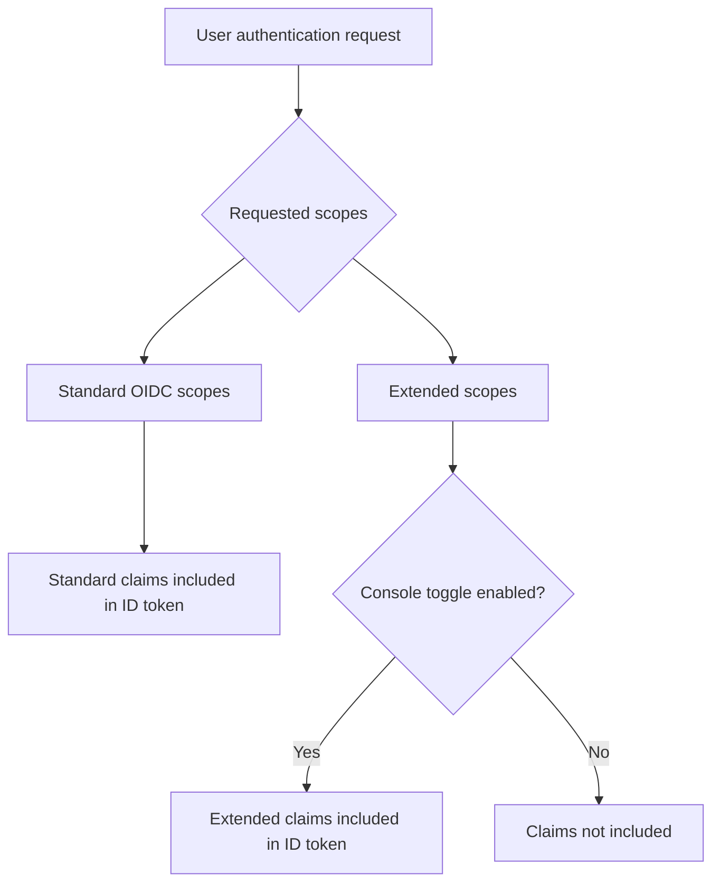

## Standard OIDC claims \{#standard-oidc-claims}

Standard claims are completely governed by the OIDC specification. Their inclusion in the ID token depends solely on the scopes your application requests during authentication. Logto does not provide any option to disable or selectively exclude individual standard claims.

The following table shows the mapping between standard scopes and their corresponding claims:

| Scope     | Claims                                                                                                                                                                           |
| --------- | -------------------------------------------------------------------------------------------------------------------------------------------------------------------------------- |
| `openid`  | `sub`                                                                                                                                                                            |
| `profile` | `name`, `family_name`, `given_name`, `middle_name`, `nickname`, `preferred_username`, `profile`, `picture`, `website`, `gender`, `birthdate`, `zoneinfo`, `locale`, `updated_at` |
| `email`   | `email`, `email_verified`                                                                                                                                                        |
| `phone`   | `phone_number`, `phone_number_verified`                                                                                                                                          |
| `address` | `address`                                                                                                                                                                        |

For example, if your application requests the `openid profile email` scopes, the ID token will include all claims from the `openid`, `profile`, and `email` scopes.

## Extended claims \{#extended-claims}

Beyond the standard OIDC claims, Logto extends additional claims that carry identity information specific to the Logto ecosystem. These extended claims follow a **dual-condition model** to be included in the ID token:

1. **Scope condition**: The application must request the corresponding scope during authentication.
2. **Console toggle**: The administrator must enable the claim's inclusion in the ID token through Logto Console.

Both conditions must be satisfied simultaneously. The scope serves as the protocol-layer access declaration, while the toggle serves as the product-layer exposure control — their responsibilities are clear and non-substitutable.

### Available extended scopes and claims \{#available-extended-scopes-and-claims}

| Scope                                | Claims                         | Description                             | Included by default |
| ------------------------------------ | ------------------------------ | --------------------------------------- | ------------------- |
| `custom_data`                        | `custom_data`                  | Custom data stored on the user object   |                     |
| `identities`                         | `identities`, `sso_identities` | User's linked social and SSO identities |                     |
| `roles`                              | `roles`                        | User's assigned roles                   | ✅                  |
| `urn:logto:scope:organizations`      | `organizations`                | User's organization IDs                 | ✅                  |
| `urn:logto:scope:organizations`      | `organization_data`            | User's organization data                |                     |
| `urn:logto:scope:organization_roles` | `organization_roles`           | User's organization role assignments    | ✅                  |

### Configure in Logto Console \{#configure-in-logto-console}

To enable extended claims in the ID token:

1. Navigate to <CloudLink to="/customize-jwt">Console > Custom JWT</CloudLink>.
2. Toggle on the claims you want to include in the ID token.
3. Ensure your application requests the corresponding scopes during authentication.

## Related resources \{#related-resources}


================================================================================
SOURCE: src/extraction/local-docs/lgoto/docs/developers/fragments/_token-exchange-prerequisites.mdx
================================================================================

:::info[Prerequisites]
Before using the token exchange grant, you need to enable it for your application:

1. Go to <CloudLink to="/applications">Console > Applications</CloudLink> and select your application.
2. In the application settings, find the "Token exchange" section.
3. Enable the "Allow token exchange" toggle.

Token exchange is disabled by default for security reasons. If you don't enable it, you will receive a "token exchange is not allowed for this application" error.
:::


================================================================================
SOURCE: src/extraction/local-docs/lgoto/docs/integrate-logto/integrate-logto-into-your-application/understand-authentication-flow.mdx
================================================================================

---
description: Explain the core OIDC authentication flows for end-users and machine-to-machine interactions, highlighting token exchange.
sidebar_label: Understand authentication flow
---

# Understand OIDC authentication flow

Logto is built on [OAuth 2.0](https://auth.wiki/oauth-2.0) and [OpenID Connect (OIDC)](https://auth.wiki/openid-connect) standards. Understanding these authentication standards will make the integration process smoother and more straightforward.

### User authentication flow \{#user-authentication-flow}

Here's what happens when a user signs in with Logto:

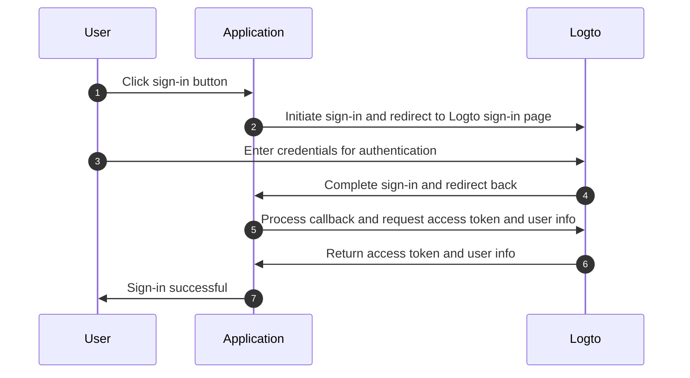

In this flow, several key concepts are essential for the integration process:

- `Application`: This represents your app in Logto. You'll create an application configuration in the Logto Console to establish a connection between your actual application and Logto services. Learn more about [Application](/integrate-logto/application-data-structure/#introduction).
- `Redirect URI`: After users complete authentication on the Logto sign-in page, Logto redirects them back to your application through this URI. You'll need to configure the Redirect URI in your Application settings. For more details, see [Redirect URIs](/integrate-logto/application-data-structure/#redirect-uris).
- `Handle sign-in callback`: When Logto redirects users back to your application, your app needs to process the authentication data and request access tokens and user information. Don't worry - the Logto SDK handles this automatically.

This overview covers the essentials for quick integration. For a deeper understanding, check out our [Sign-in experience explained](/concepts/sign-in-experience/) guide.

### Machine-to-machine authentication flow \{#machine-to-machine-authentication-flow}

Logto provides [machine-to-machine (M2M) application](/quick-starts/m2m) type to enable direct authentication between services, based on [OAuth 2.0 Client Credentials flow](https://auth.wiki/client-credentials-flow):

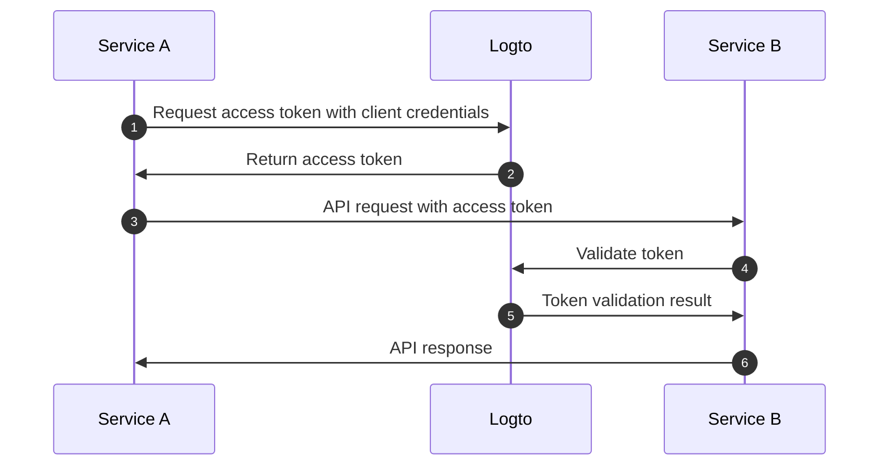

This machine-to-machine (M2M) authentication flow is designed for applications that need to directly communicate with resources without user interaction (thus no UI), such as an API service updating user data in Logto or a statistics service pulling daily orders.

In this flow, services authenticate using client credentials - a combination of [Application ID](/integrate-logto/application-data-structure/#application-id) and [Application Secret](/integrate-logto/application-data-structure/#application-secret) that uniquely identifies and authenticates the service. These credentials serve as the service's identity when requesting [access tokens](https://auth.wiki/access-token) from Logto.

### Device flow (input-limited devices) \{#device-flow}

For devices with limited input capabilities (e.g., smart TVs, game consoles, CLI tools, IoT devices), Logto supports the [OAuth 2.0 Device Authorization Grant](https://auth.wiki/device-flow). The device displays a code and URL, while the user completes authentication on a separate device with a browser:

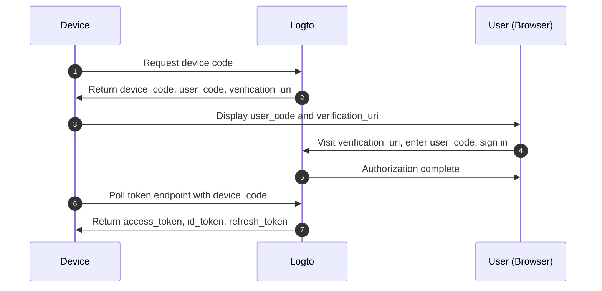

In this flow:

- The device requests a device code from Logto, receiving a short `user_code` and a `verification_uri`.
- The user visits the verification URL on another device (phone, laptop), enters the code, and signs in.
- The device polls the token endpoint until the user completes authorization, then receives tokens.

Unlike the standard user flow, device flow does not require redirect URIs or browser capabilities on the device itself. Learn more in the [Device flow quick start](/quick-starts/device-flow).

### SAML authentication flow \{#saml-authentication-flow}

Besides OAuth 2.0 and OIDC, Logto also supports SAML (Security Assertion Markup Language) authentication, acting as an Identity Provider (IdP) to enable integration with enterprise applications. Currently, Logto supports SP-initiated authentication flow:

#### SP-initiated flow \{#saml-authentication-flow-sp-init}

In SP-initiated flow, the authentication process starts from the Service Provider (your application):

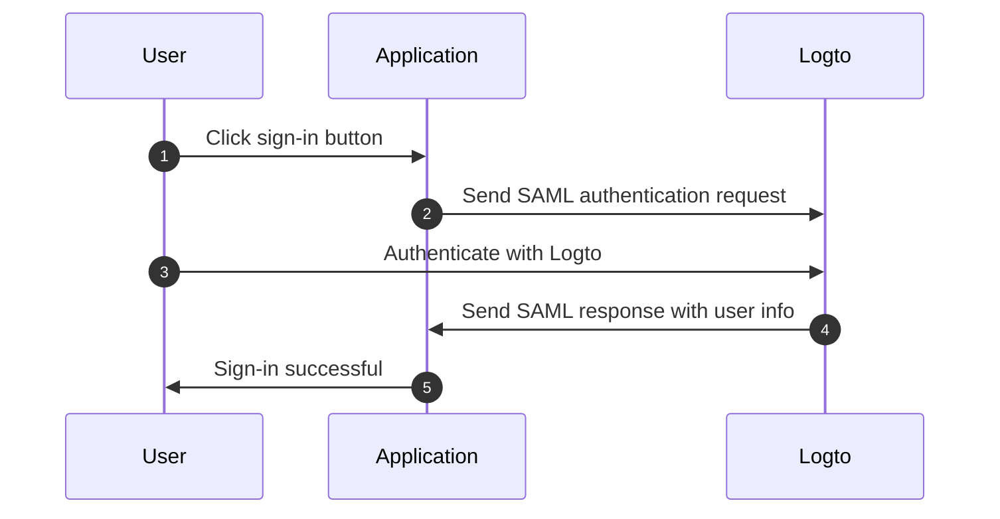

In this flow:

- The user starts the authentication process from your application (Service Provider)
- Your application generates a SAML request and redirects the user to Logto (Identity Provider)
- After successful authentication at Logto, a SAML response is sent back to your application
- Your application processes the SAML response and completes the authentication

#### IdP-initiated flow \{#saml-authentication-flow-idp-init}

Logto will support IdP-initiated flow in future releases, enabling users to start the authentication process directly from Logto's portal. Stay tuned for updates on this feature.

This SAML integration enables enterprise applications to leverage Logto as their identity provider, supporting both modern and legacy SAML-based service providers.

## Related resources \{#related-resources}


================================================================================
SOURCE: src/extraction/local-docs/lgoto/docs/user-management/personal-access-token.mdx
================================================================================

---
sidebar_position: 4
---


# Personal access token

Personal access tokens (PATs) provide a secure way for users to grant [access token](https://auth.wiki/access-token) without using their credentials and interactive sign-in. This is useful for CI/CD, scripts, or applications that need to access resources programmatically.

## Managing personal access tokens \{#managing-personal-access-tokens}

### Using Console \{#using-console}

You can manage personal access tokens in the User Details page of the <CloudLink to="/users">Console > User management</CloudLink>. In the card "Authentication", you can see the list of personal access tokens and create new ones.

### Using Management API \{#using-management-api}

After setting up the [Management API](/integrate-logto/interact-with-management-api/), you can use the [API endpoints](https://openapi.logto.io/operation/operation-listuserpersonalaccesstokens) to create, list, and delete personal access tokens.

## Use PATs to grant access tokens \{#use-pats-to-grant-access-tokens}

After creating a PAT, you can use it to grant access tokens to your application by using the token exchange endpoint.

:::tip Token flow equivalency

Access tokens obtained using PATs work **identically** to tokens obtained through the standard `refresh_token` flow. This means:

- **Organization context**: PAT-obtained tokens support the same organization permissions and scopes as refresh token flows
- **Authorization flow**: You can use PAT-exchanged access tokens for [organization permissions](/authorization/organization-permissions) and [organization-level API resources](/authorization/organization-level-api-resources)
- **Token validation**: The same validation logic applies - only the initial grant type differs

If you're working with organizations, the access patterns and permissions are the same regardless of whether you use PAT or refresh tokens.

:::

### Request \{#request}


The application makes a [token exchange request](https://auth.wiki/authorization-code-flow#token-exchange-request) to the tenant's [token endpoint](/integrate-logto/application-data-structure#token-endpoint) with a special grant type using the HTTP POST method. The following parameters are included in the HTTP request entity-body using the `application/x-www-form-urlencoded` format.

1. `client_id`: REQUIRED. The client ID of the application.
2. `grant_type`: REQUIRED. The value of this parameter must be `urn:ietf:params:oauth:grant-type:token-exchange` indicates that a token exchange is being performed.
3. `resource`: OPTIONAL. The resource indicator, the same as other token requests.
4. `scope`: OPTIONAL. The requested scopes, the same as other token requests.
5. `subject_token`: REQUIRED. The user's PAT.
6. `subject_token_type`: REQUIRED. The type of the security token provided in the `subject_token` parameter. The value of this parameter must be `urn:logto:token-type:personal_access_token`.

### Response \{#response}

If the token exchange request is successful, the tenant's token endpoint returns an access token that represents the identity of the user. The response includes the following parameters in the HTTP response entity-body using the `application/json` format.

1. `access_token`: REQUIRED. The access token of the user, which is the same as other token requests like `authorization_code` or `refresh_token`.
2. `issued_token_type`: REQUIRED. The type of the issued token. The value of this parameter must be `urn:ietf:params:oauth:token-type:access_token`.
3. `token_type`: REQUIRED. The type of the token. The value of this parameter must be `Bearer`.
4. `expires_in`: REQUIRED. The lifetime in seconds of the access token.
5. `scope`: OPTIONAL. The scopes of the access token.

### Example token exchange \{#example-token-exchange}

For traditional web applications or machine-to-machine applications with app secret, include the credentials in the `Authorization` header using HTTP Basic authentication:

```bash
POST /oidc/token HTTP/1.1
Host: tenant.logto.app
Content-Type: application/x-www-form-urlencoded
# highlight-next-line
Authorization: Basic <base64(app-id:app-secret)>

grant_type=urn:ietf:params:oauth:grant-type:token-exchange
&resource=http://my-api.com
&scope=read
&subject_token=pat_W51arOqe7nynW75nWhvYogyc
&subject_token_type=urn:logto:token-type:personal_access_token
```

For single-page applications (SPA) or native applications without app secret, include `client_id` in the request body:

```bash
POST /oidc/token HTTP/1.1
Host: tenant.logto.app
Content-Type: application/x-www-form-urlencoded

# highlight-next-line
client_id=your-app-id
&grant_type=urn:ietf:params:oauth:grant-type:token-exchange
&resource=http://my-api.com
&scope=read
&subject_token=pat_W51arOqe7nynW75nWhvYogyc
&subject_token_type=urn:logto:token-type:personal_access_token
```

A successful response:

```
HTTP/1.1 200 OK
Content-Type: application/json

{
  "access_token": "eyJhbGci...zg",
  "token_type": "Bearer",
  "expires_in": 3600,
  "scope": "read"
}
```

Then if you decode the access token with [JWT decoder](https://logto.io/jwt-decoder), you'll get the following example access token payload:

```json
{
  "jti": "VovNyqJ5_tuYac89eTbpF",
  "sub": "rkxl1ops7gs1",
  "iat": 1756908403,
  "exp": 1756912003,
  "scope": "read",
  "client_id": "your-app-id",
  "iss": "https://tenant-id.logto.app/oidc",
  "aud": "http://my-api.com"
}
```

## Related resources \{#related-resources}


================================================================================
SOURCE: src/extraction/local-docs/lgoto/docs/api-protection/README.mdx
================================================================================

---
sidebar_label: Introduction
---

# API protection

Learn how to implement [role-based access control (RBAC)](/authorization/role-based-access-control) and [JSON Web Token (JWT)](https://auth.wiki/jwt) validation to protect your API endpoints from unauthorized access.

Our guides cover middleware setup, permission models, and practical examples across multiple programming languages and frameworks.

## Get started \{#get-started}

### New to API security? \{#new-to-api-security}

If you're new to API authentication and authorization, start with these fundamentals:

- **[Authentication vs. authorization](/concepts/authn-vs-authz)**: Understand the key differences
- **[Role-based access control (RBAC)](/authorization/role-based-access-control)**: Learn how permissions and roles work
- **[JSON Web Token (JWT)](https://auth.wiki/jwt)**: Discover how JSON Web Tokens secure your APIs

### Choose your language or framework \{#choose-your-language-or-framework}

Ready to implement API protection? Select your technology stack from the sidebar to get step-by-step integration guides with code examples and best practices.


================================================================================
SOURCE: src/extraction/local-docs/lgoto/docs/api-protection/ruby/README.mdx
================================================================================


# Protect your Ruby API with RBAC and JWT validation

Learn how to secure your Ruby APIs using [role-based access control (RBAC)](/authorization/role-based-access-control) and [JSON Web Token (JWT)](https://auth.wiki/jwt) validation.

{/* WARNING: We cannot use variables in the headings or introductory text since it will not be rendered correctly. */}

Each page covers implementation patterns, middleware setup, and detailed examples for different permission models to help you protect your API endpoints with proper authentication and authorization.

Choose your framework to get started:


================================================================================
SOURCE: src/extraction/local-docs/lgoto/docs/api-protection/nodejs/README.mdx
================================================================================


# Protect your Node.js API with RBAC and JWT validation

Learn how to secure your Node.js APIs using [role-based access control (RBAC)](/authorization/role-based-access-control) and [JSON Web Token (JWT)](https://auth.wiki/jwt) validation.

{/* WARNING: We cannot use variables in the headings or introductory text since it will not be rendered correctly. */}

Each page covers implementation patterns, middleware setup, and detailed examples for different permission models to help you protect your API endpoints with proper authentication and authorization.

Choose your framework to get started:


================================================================================
SOURCE: src/extraction/local-docs/lgoto/docs/api-protection/java/README.mdx
================================================================================


# Protect your Java API with RBAC and JWT validation

Learn how to secure your Java APIs using [role-based access control (RBAC)](/authorization/role-based-access-control) and [JSON Web Token (JWT)](https://auth.wiki/jwt) validation.

{/* WARNING: We cannot use variables in the headings or introductory text since it will not be rendered correctly. */}

Each page covers implementation patterns, middleware setup, and detailed examples for different permission models to help you protect your API endpoints with proper authentication and authorization.

Choose your framework to get started:


================================================================================
SOURCE: src/extraction/local-docs/lgoto/docs/api-protection/python/README.mdx
================================================================================


# Protect your Python API with RBAC and JWT validation

Learn how to secure your Python APIs using [role-based access control (RBAC)](/authorization/role-based-access-control) and [JSON Web Token (JWT)](https://auth.wiki/jwt) validation.

{/* WARNING: We cannot use variables in the headings or introductory text since it will not be rendered correctly. */}

Each page covers implementation patterns, middleware setup, and detailed examples for different permission models to help you protect your API endpoints with proper authentication and authorization.

Choose your framework to get started:


================================================================================
SOURCE: src/extraction/local-docs/lgoto/docs/api-protection/dotnet/README.mdx
================================================================================


# Protect your .NET API with RBAC and JWT validation

Learn how to secure your .NET APIs using [role-based access control (RBAC)](/authorization/role-based-access-control) and [JSON Web Token (JWT)](https://auth.wiki/jwt) validation.

{/* WARNING: We cannot use variables in the headings or introductory text since it will not be rendered correctly. */}

Each page covers implementation patterns, middleware setup, and detailed examples for different permission models to help you protect your API endpoints with proper authentication and authorization.

Choose your framework to get started:


================================================================================
SOURCE: src/extraction/local-docs/lgoto/docs/api-protection/go/README.mdx
================================================================================


# Protect your Go API with RBAC and JWT validation

Learn how to secure your Go APIs using [role-based access control (RBAC)](/authorization/role-based-access-control) and [JSON Web Token (JWT)](https://auth.wiki/jwt) validation.

{/* WARNING: We cannot use variables in the headings or introductory text since it will not be rendered correctly. */}

Each page covers implementation patterns, middleware setup, and detailed examples for different permission models to help you protect your API endpoints with proper authentication and authorization.

Choose your framework to get started:


================================================================================
SOURCE: src/extraction/local-docs/lgoto/docs/api-protection/rust/README.mdx
================================================================================


# Protect your Rust API with RBAC and JWT validation

Learn how to secure your Rust APIs using [role-based access control (RBAC)](/authorization/role-based-access-control) and [JSON Web Token (JWT)](https://auth.wiki/jwt) validation.

{/* WARNING: We cannot use variables in the headings or introductory text since it will not be rendered correctly. */}

Each page covers implementation patterns, middleware setup, and detailed examples for different permission models to help you protect your API endpoints with proper authentication and authorization.

Choose your framework to get started:


================================================================================
SOURCE: src/extraction/local-docs/lgoto/docs/api-protection/php/README.mdx
================================================================================


# Protect your PHP API with RBAC and JWT validation

Learn how to secure your PHP APIs using [role-based access control (RBAC)](/authorization/role-based-access-control) and [JSON Web Token (JWT)](https://auth.wiki/jwt) validation.

{/* WARNING: We cannot use variables in the headings or introductory text since it will not be rendered correctly. */}

Each page covers implementation patterns, middleware setup, and detailed examples for different permission models to help you protect your API endpoints with proper authentication and authorization.

Choose your framework to get started:


================================================================================
SOURCE: src/extraction/local-docs/lgoto/docs/api-protection/fragments/_main-content.mdx
================================================================================


## Initialize your API project \{#initialize-your-api-project}

{/* WARNING: Do not put sub-headings inside the `props.initializeProject` content since it will NOT be rendered as a sub-heading in the sidebar. */}
{props.initializeProject}

## Initialize constants and utilities \{#initialize-constants-and-utilities}


{/* WARNING: Do not put sub-headings inside the `props.initializeProject` content since it will NOT be rendered as a sub-heading in the sidebar. */}
{props.languageInit}

## Retrieve info about your Logto tenant \{#retrieve-info-about-your-logto-tenant}


## Validate the token and permissions \{#validate-the-token-and-permissions}


### Add the validation logic \{#add-the-validation-logic}

{/* WARNING: Do not put sub-headings inside the `props.initializeProject` content since it will NOT be rendered as a sub-heading in the sidebar. */}
{props.addValidationLogic}

## Apply the middleware to your API \{#apply-the-middleware-to-your-api}

Now, apply the middleware to your protected API routes.

{/* WARNING: Do not put sub-headings inside the `props.applyMiddleware` content since it will NOT be rendered as a sub-heading in the sidebar. */}
{props.applyMiddleware}

## Test your protected API \{#test-your-protected-api}


================================================================================
SOURCE: src/extraction/local-docs/lgoto/docs/api-protection/fragments/_quick-preparation-steps.mdx
================================================================================


## Quick preparation steps \{#quick-preparation-steps}

### Configure Logto resources & permissions \{#configure-logto-resources-permissions}


:::tip New to RBAC?
Start with our [Role-based access control guide](/authorization/role-based-access-control) for step-by-step setup instructions.
:::

### Update your client application \{#update-your-client-application}

**Request appropriate scopes in your client:**

- User authentication: [Update your app →](/quick-starts) to request your API scopes and/or organization context
- Machine-to-machine: [Configure M2M scopes →](/quick-starts/m2m) for server-to-server access

The process usually involves updating your client configuration to include one or more of the following:

- `scope` parameter in OAuth flows
- `resource` parameter for API resource access
- `organization_id` for organization context

:::tip Before you code
Make sure the user or M2M app you are testing has been assigned proper roles or organization roles that include the necessary permissions for your API.
:::


================================================================================
SOURCE: src/extraction/local-docs/lgoto/docs/api-protection/fragments/_permission-models-overview.mdx
================================================================================


## Permission models overview \{#permission-models-overview}

Before implementing protection, choose the permission model that fits your application architecture. This aligns with Logto's three main [authorization scenarios](/authorization#authorization-scenarios):


**💡 Choose your model before proceeding** - the implementation will reference your chosen approach throughout this guide.


================================================================================
SOURCE: src/extraction/local-docs/lgoto/docs/api-protection/fragments/_further-reading.mdx
================================================================================

## Further reading \{#further-reading}


================================================================================
SOURCE: src/extraction/local-docs/lgoto/docs/api-protection/fragments/_before-you-start.mdx
================================================================================


## Before you start \{#before-you-start}

Your client applications need to obtain access tokens from Logto. If you haven't set up client integration yet, check out our [Quick starts](/quick-starts) for React, Vue, Angular, or other client frameworks, or see our [Machine-to-machine guide](/quick-starts/m2m) for server-to-server access.

This guide focuses on the **server-side validation** of those tokens in your {getFrameworkName(props.framework)} application.


================================================================================
SOURCE: src/extraction/local-docs/lgoto/docs/api-protection/ruby/sinatra/_init-project.mdx
================================================================================

To initialize a new Sinatra project, create a directory and set up the basic structure:

```bash
mkdir your-api-name
cd your-api-name
```

Create a Gemfile:

```ruby title="Gemfile"
source 'https://rubygems.org'

gem 'sinatra'
```

Install dependencies:

```bash
bundle install
```

Create a basic Sinatra application:

```ruby title="app.rb"
require 'sinatra'
require 'json'

get '/' do
  content_type :json
  { message: 'Hello from Sinatra API' }.to_json
end
```

Start the development server:

```bash
ruby app.rb
```

:::note
Refer to the Sinatra documentation for more details on how to set up routes, middleware, and other features.
:::


================================================================================
SOURCE: src/extraction/local-docs/lgoto/docs/api-protection/ruby/sinatra/README.mdx
================================================================================

---
sidebar_label: Sinatra
---


# Protect your Sinatra API with RBAC and JWT validation

This guide will help you implement authorization to secure your Sinatra APIs using [Role-based access control (RBAC)](/authorization/role-based-access-control) and [JSON Web Tokens (JWTs)](https://auth.wiki/jwt) issued by Logto.

{/* WARNING: We cannot use variables in the headings or introductory text since it will not be rendered correctly. */}


================================================================================
SOURCE: src/extraction/local-docs/lgoto/docs/api-protection/ruby/grape/_init-project.mdx
================================================================================

To initialize a new Grape API project, create a directory and set up the basic structure:

```bash
mkdir your-api-name
cd your-api-name
```

Create a Gemfile:

```ruby title="Gemfile"
source 'https://rubygems.org'

gem 'grape'
```

Install dependencies:

```bash
bundle install
```

Create a basic Grape API:

```ruby title="api.rb"
require 'grape'

class API < Grape::API
  format :json

  get :hello do
    { message: 'Hello from Grape API' }
  end
end
```

Create a config.ru file:

```ruby title="config.ru"
require_relative 'api'

run API
```

Start the development server:

```bash
bundle exec rackup
```

:::note
Refer to the Grape documentation for more details on how to set up resources, parameters validation, and other features.
:::


================================================================================
SOURCE: src/extraction/local-docs/lgoto/docs/api-protection/ruby/grape/README.mdx
================================================================================

---
sidebar_label: Grape
---


# Protect your Grape API with RBAC and JWT validation

This guide will help you implement authorization to secure your Grape APIs using [Role-based access control (RBAC)](/authorization/role-based-access-control) and [JSON Web Tokens (JWTs)](https://auth.wiki/jwt) issued by Logto.

{/* WARNING: We cannot use variables in the headings or introductory text since it will not be rendered correctly. */}


================================================================================
SOURCE: src/extraction/local-docs/lgoto/docs/api-protection/ruby/rails/_init-project.mdx
================================================================================

To initialize a new Rails API project, you can use the Rails generator:

```bash
rails new your-api-name --api
cd your-api-name
```

Start the development server:

```bash
rails server
```

Create a basic API controller:

```ruby title="app/controllers/api/base_controller.rb"
class Api::BaseController < ApplicationController
  def index
    render json: { message: 'Hello from Rails API' }
  end
end
```

Add routes:

```ruby title="config/routes.rb"
Rails.application.routes.draw do
  namespace :api do
    root 'base#index'
  end
end
```

:::note
Refer to the Rails documentation for more details on how to set up controllers, models, and other features.
:::


================================================================================
SOURCE: src/extraction/local-docs/lgoto/docs/api-protection/ruby/rails/README.mdx
================================================================================

---
sidebar_label: Ruby on Rails
---


# Protect your Ruby on Rails API with RBAC and JWT validation

This guide will help you implement authorization to secure your Ruby on Rails APIs using [Role-based access control (RBAC)](/authorization/role-based-access-control) and [JSON Web Tokens (JWTs)](https://auth.wiki/jwt) issued by Logto.

{/* WARNING: We cannot use variables in the headings or introductory text since it will not be rendered correctly. */}


================================================================================
SOURCE: src/extraction/local-docs/lgoto/docs/api-protection/nodejs/express/_init-project.mdx
================================================================================

To initialize a new Node.js project with Express, you can follow these steps:

```bash
npm init -y
npm install express
```

If you are using TypeScript, remember to set up your TypeScript environment accordingly.

Then, create a basic Express server setup:

```ts title="app.ts"

const app = express();

app.listen(3000, () => {
  console.log('Server running on http://localhost:3000');
});
```

:::note
Refer to the Express documentation for more details on how to set up routes, middleware, and other features.
:::


================================================================================
SOURCE: src/extraction/local-docs/lgoto/docs/api-protection/nodejs/express/README.mdx
================================================================================

---
sidebar_label: Express.js
---


# Protect your Express.js API with RBAC and JWT validation

This guide will help you implement authorization to secure your Express.js APIs using [Role-based access control (RBAC)](/authorization/role-based-access-control) and [JSON Web Tokens (JWTs)](https://auth.wiki/jwt) issued by Logto.

{/* WARNING: We cannot use variables in the headings or introductory text since it will not be rendered correctly. */}


================================================================================
SOURCE: src/extraction/local-docs/lgoto/docs/api-protection/nodejs/hapi/_init-project.mdx
================================================================================

To initialize a new Node.js project with Hapi, you can follow these steps:

```bash
npm init -y
npm install @hapi/hapi
```

If you are using TypeScript, remember to set up your TypeScript environment accordingly.

Then, create a basic Hapi server setup:

```ts title="app.ts"

const server = Hapi.server({
  port: 3000,
  host: 'localhost',
});

await server.start();
console.log('Server running on http://localhost:3000');
```

:::note
Refer to the Hapi documentation for more details on how to set up routes, plugins, and other features.
:::


================================================================================
SOURCE: src/extraction/local-docs/lgoto/docs/api-protection/nodejs/hapi/README.mdx
================================================================================

---
sidebar_label: Hapi.js
---


# Protect your Hapi.js API with RBAC and JWT validation

This guide will help you implement authorization to secure your Hapi.js APIs using [Role-based access control (RBAC)](/authorization/role-based-access-control) and [JSON Web Tokens (JWTs)](https://auth.wiki/jwt) issued by Logto.

{/* WARNING: We cannot use variables in the headings or introductory text since it will not be rendered correctly. */}


================================================================================
SOURCE: src/extraction/local-docs/lgoto/docs/api-protection/nodejs/koa/_init-project.mdx
================================================================================

To initialize a new Node.js project with Koa, you can follow these steps:

```bash
npm init -y
npm install koa @koa/router
```

If you are using TypeScript, remember to set up your TypeScript environment accordingly.

Then, create a basic Koa server setup:

```ts title="app.ts"

const app = new Koa();

app.listen(3000, () => {
  console.log('Server running on http://localhost:3000');
});
```

:::note
Refer to the Koa documentation for more details on how to set up routes, middleware, and other features.
:::


================================================================================
SOURCE: src/extraction/local-docs/lgoto/docs/api-protection/nodejs/koa/README.mdx
================================================================================

---
sidebar_label: Koa.js
---


# Protect your Koa.js API with RBAC and JWT validation

This guide will help you implement authorization to secure your Koa.js APIs using [Role-based access control (RBAC)](/authorization/role-based-access-control) and [JSON Web Tokens (JWTs)](https://auth.wiki/jwt) issued by Logto.

{/* WARNING: We cannot use variables in the headings or introductory text since it will not be rendered correctly. */}


================================================================================
SOURCE: src/extraction/local-docs/lgoto/docs/api-protection/nodejs/nestjs/_init-project.mdx
================================================================================

To initialize a new Node.js project with NestJS, you can use the Nest CLI for a quick setup. Here are the steps:

```bash
npm i -g @nestjs/cli
nest new my-api
cd my-api
```

Alternatively, you can create a project manually:

```bash
npm init -y
npm install @nestjs/core @nestjs/common @nestjs/platform-express reflect-metadata rxjs
```

If you are using TypeScript, remember to set up your TypeScript environment accordingly.

Then, create a basic NestJS server setup:

```ts title="main.ts"

async function bootstrap() {
  const app = await NestFactory.create(AppModule);
  await app.listen(3000);
  console.log('Server running on http://localhost:3000');
}
bootstrap();
```

```ts title="app.module.ts"

@Module({
  imports: [],
  controllers: [AppController],
  providers: [AppService],
})
```

:::note
Refer to the NestJS documentation for more details on how to set up controllers, services, and other features. You can also explore the NestJS CLI commands for generating components and modules easily.
:::


================================================================================
SOURCE: src/extraction/local-docs/lgoto/docs/api-protection/nodejs/nestjs/README.mdx
================================================================================

---
sidebar_label: NestJS
---


# Protect your NestJS API with RBAC and JWT validation

This guide will help you implement authorization to secure your NestJS APIs using [Role-based access control (RBAC)](/authorization/role-based-access-control) and [JSON Web Tokens (JWTs)](https://auth.wiki/jwt) issued by Logto.

{/* WARNING: We cannot use variables in the headings or introductory text since it will not be rendered correctly. */}


================================================================================
SOURCE: src/extraction/local-docs/lgoto/docs/api-protection/nodejs/fastify/_init-project.mdx
================================================================================

To initialize a new Node.js project with Fastify, you can follow these steps:

```bash
npm init -y
npm install fastify
```

If you are using TypeScript, remember to set up your TypeScript environment accordingly.

Then, create a basic Fastify server setup:

```ts title="app.ts"

const server = fastify({ logger: true });

try {
  await server.listen({ port: 3000 });
  console.log('Server running on http://localhost:3000');
} catch (err) {
  server.log.error(err);
  process.exit(1);
}
```

:::note
Refer to the Fastify documentation for more details on how to set up routes, plugins, and other features.
:::


================================================================================
SOURCE: src/extraction/local-docs/lgoto/docs/api-protection/nodejs/fastify/README.mdx
================================================================================

---
sidebar_label: Fastify
---


# Protect your Fastify API with RBAC and JWT validation

This guide will help you implement authorization to secure your Fastify APIs using [Role-based access control (RBAC)](/authorization/role-based-access-control) and [JSON Web Tokens (JWTs)](https://auth.wiki/jwt) issued by Logto.

{/* WARNING: We cannot use variables in the headings or introductory text since it will not be rendered correctly. */}


================================================================================
SOURCE: src/extraction/local-docs/lgoto/docs/api-protection/java/vertx-web/_init-project.mdx
================================================================================

To initialize a new Vert.x Web project, you can create a Maven project manually:

```xml title="pom.xml"

```

Create a basic Vert.x Web server:

```java title="src/main/java/com/example/MainVerticle.java"
package com.example;


public class MainVerticle extends AbstractVerticle {

    @Override
    public void start(Promise<Void> startPromise) throws Exception {
        Router router = Router.router(vertx);

        router.route().handler(BodyHandler.create());

        router.get("/hello").handler(ctx -> {
            ctx.response()
                .putHeader("content-type", "text/plain")
                .end("Hello from Vert.x Web!");
        });

        vertx.createHttpServer()
            .requestHandler(router)
            .listen(3000, http -> {
                if (http.succeeded()) {
                    startPromise.complete();
                    System.out.println("HTTP server started on port 3000");
                } else {
                    startPromise.fail(http.cause());
                }
            });
    }
}
```

```java title="src/main/java/com/example/Application.java"
package com.example;


public class Application {
    public static void main(String[] args) {
        Vertx vertx = Vertx.vertx();
        vertx.deployVerticle(new MainVerticle());
    }
}
```

:::note
Refer to the Vert.x Web documentation for more details on how to set up routes, handlers, and other features.
:::


================================================================================
SOURCE: src/extraction/local-docs/lgoto/docs/api-protection/java/vertx-web/README.mdx
================================================================================

---
sidebar_label: Vert.x Web
---


# Protect your Vert.x Web API with RBAC and JWT validation

This guide will help you implement authorization to secure your Vert.x Web APIs using [Role-based access control (RBAC)](/authorization/role-based-access-control) and [JSON Web Tokens (JWTs)](https://auth.wiki/jwt) issued by Logto.

{/* WARNING: We cannot use variables in the headings or introductory text since it will not be rendered correctly. */}


================================================================================
SOURCE: src/extraction/local-docs/lgoto/docs/api-protection/java/spring-boot/_init-project.mdx
================================================================================

To initialize a new Spring Boot project, you can use Spring Initializr or follow these steps:

Visit [Spring Initializr](https://start.spring.io/) and select:

- Project: Maven
- Language: Java
- Spring Boot: latest stable version
- Dependencies: Spring Web, Spring Security

Or create manually:

```xml title="pom.xml"


```

Create a basic Spring Boot application:

```java title="src/main/java/com/example/Application.java"
package com.example;


@SpringBootApplication
public class Application {
    public static void main(String[] args) {
        SpringApplication.run(Application.class, args);
    }
}
```

:::note
Refer to the Spring Boot documentation for more details on how to set up controllers, services, and other features.
:::


================================================================================
SOURCE: src/extraction/local-docs/lgoto/docs/api-protection/java/spring-boot/README.mdx
================================================================================

---
sidebar_label: Spring Boot
---


# Protect your Spring Boot API with RBAC and JWT validation

This guide will help you implement authorization to secure your Spring Boot APIs using [Role-based access control (RBAC)](/authorization/role-based-access-control) and [JSON Web Tokens (JWTs)](https://auth.wiki/jwt) issued by Logto.

{/* WARNING: We cannot use variables in the headings or introductory text since it will not be rendered correctly. */}


================================================================================
SOURCE: src/extraction/local-docs/lgoto/docs/api-protection/java/micronaut/_init-project.mdx
================================================================================

To initialize a new Micronaut project, you can use the Micronaut CLI or visit Micronaut Launch:

Using Micronaut CLI:

```bash
mn create-app com.example.your-api-name \
    --features=security-jwt,http-server-netty \
    --build=maven \
    --lang=java
cd your-api-name
```

Or visit [Micronaut Launch](https://micronaut.io/launch/) and select:

- Application Type: Micronaut Application
- Java Version: 17
- Build: Maven
- Features: security-jwt, http-server-netty

This will create a basic Micronaut project:

```xml title="pom.xml"

```

Create a basic controller:

```java title="src/main/java/com/example/HelloController.java"
package com.example;


@Controller("/hello")
public class HelloController {

    @Get
    @Produces(MediaType.TEXT_PLAIN)
    public String index() {
        return "Hello World";
    }
}
```

:::note
Refer to the Micronaut documentation for more details on how to set up controllers, services, and other features.
:::


================================================================================
SOURCE: src/extraction/local-docs/lgoto/docs/api-protection/java/micronaut/README.mdx
================================================================================

---
sidebar_label: Micronaut
---


# Protect your Micronaut API with RBAC and JWT validation

This guide will help you implement authorization to secure your Micronaut APIs using [Role-based access control (RBAC)](/authorization/role-based-access-control) and [JSON Web Tokens (JWTs)](https://auth.wiki/jwt) issued by Logto.

{/* WARNING: We cannot use variables in the headings or introductory text since it will not be rendered correctly. */}


================================================================================
SOURCE: src/extraction/local-docs/lgoto/docs/api-protection/java/quarkus/_init-project.mdx
================================================================================

To initialize a new Quarkus project, you can use the Quarkus CLI or Maven:

Using Quarkus CLI:

```bash
quarkus create app com.example:your-api-name \
    --extension='resteasy-reactive,smallrye-jwt'
cd your-api-name
```

Or using Maven:

```bash
mvn io.quarkus.platform:quarkus-maven-plugin:3.6.0:create \
    -DprojectGroupId=com.example \
    -DprojectArtifactId=your-api-name \
    -Dextensions="resteasy-reactive,smallrye-jwt"
cd your-api-name
```

This will create a basic Quarkus project with the necessary dependencies:

```xml title="pom.xml"
```

Create a basic resource:

```java title="src/main/java/com/example/ExampleResource.java"
package com.example;


@Path("/hello")
public class ExampleResource {

    @GET
    @Produces(MediaType.TEXT_PLAIN)
    public String hello() {
        return "Hello from Quarkus REST";
    }
}
```

:::note
Refer to the Quarkus documentation for more details on how to set up resources, services, and other features.
:::


================================================================================
SOURCE: src/extraction/local-docs/lgoto/docs/api-protection/java/quarkus/README.mdx
================================================================================

---
sidebar_label: Quarkus
---


# Protect your Quarkus API with RBAC and JWT validation

This guide will help you implement authorization to secure your Quarkus APIs using [Role-based access control (RBAC)](/authorization/role-based-access-control) and [JSON Web Tokens (JWTs)](https://auth.wiki/jwt) issued by Logto.

{/* WARNING: We cannot use variables in the headings or introductory text since it will not be rendered correctly. */}


================================================================================
SOURCE: src/extraction/local-docs/lgoto/docs/api-protection/python/flask/_init-project.mdx
================================================================================

To initialize a new Flask project, create a directory and set up the basic structure:

```bash
mkdir your-api-name
cd your-api-name
```

Create a requirements file:

```txt title="requirements.txt"
Flask
```

Install dependencies:

```bash
pip install -r requirements.txt
```

Create a basic Flask application:

```py title="app.py"
from flask import Flask, jsonify

app = Flask(__name__)

@app.route('/')
def hello():
    return jsonify({"message": "Hello from Flask"})

if __name__ == '__main__':
    app.run(debug=True)
```

Start the development server:

```bash
python app.py
```

:::note
Refer to the Flask documentation for more details on how to set up routes, blueprints, and other features.
:::


================================================================================
SOURCE: src/extraction/local-docs/lgoto/docs/api-protection/python/flask/README.mdx
================================================================================

---
sidebar_label: Flask
---


# Protect your Flask API with RBAC and JWT validation

This guide will help you implement authorization to secure your Flask APIs using [Role-based access control (RBAC)](/authorization/role-based-access-control) and [JSON Web Tokens (JWTs)](https://auth.wiki/jwt) issued by Logto.

{/* WARNING: We cannot use variables in the headings or introductory text since it will not be rendered correctly. */}


================================================================================
SOURCE: src/extraction/local-docs/lgoto/docs/api-protection/python/fastapi/_init-project.mdx
================================================================================

To initialize a new FastAPI project, create a directory and set up the basic structure:

```bash
mkdir your-api-name
cd your-api-name
```

Create a requirements file:

```txt title="requirements.txt"
fastapi
uvicorn[standard]
```

Install dependencies:

```bash
pip install -r requirements.txt
```

Create a basic FastAPI application:

```py title="main.py"
from fastapi import FastAPI

app = FastAPI()

@app.get("/")
def read_root():
    return {"message": "Hello from FastAPI"}
```

Start the development server:

```bash
uvicorn main:app --reload
```

:::note
Refer to the FastAPI documentation for more details on how to set up path operations, dependency injection, and other features.
:::


================================================================================
SOURCE: src/extraction/local-docs/lgoto/docs/api-protection/python/fastapi/README.mdx
================================================================================

---
sidebar_label: FastAPI
---


# Protect your FastAPI with RBAC and JWT validation

This guide will help you implement authorization to secure your FastAPI APIs using [Role-based access control (RBAC)](/authorization/role-based-access-control) and [JSON Web Tokens (JWTs)](https://auth.wiki/jwt) issued by Logto.

{/* WARNING: We cannot use variables in the headings or introductory text since it will not be rendered correctly. */}


================================================================================
SOURCE: src/extraction/local-docs/lgoto/docs/api-protection/python/django-rest/_init-project.mdx
================================================================================

To initialize a new Django REST Framework project:

```bash
django-admin startproject your_api_name
cd your_api_name
```

Install required packages:

```bash
pip install Django djangorestframework
```

Create a basic Django app:

```bash
python manage.py startapp api
```

Add DRF to settings:

```py title="your_api_name/settings.py"
INSTALLED_APPS = [
    'django.contrib.admin',
    'django.contrib.auth',
    'django.contrib.contenttypes',
    'django.contrib.sessions',
    'django.contrib.messages',
    'django.contrib.staticfiles',
    'rest_framework',
    'api',
]
```

Create a basic API view:

```py title="api/views.py"
from rest_framework.decorators import api_view
from rest_framework.response import Response

@api_view(['GET'])
def hello_view(request):
    return Response({"message": "Hello from Django REST Framework"})
```

Add URL configuration:

```py title="api/urls.py"
from django.urls import path
from . import views

urlpatterns = [
    path('', views.hello_view, name='hello'),
]
```

```py title="your_api_name/urls.py"
from django.contrib import admin
from django.urls import path, include

urlpatterns = [
    path('admin/', admin.site.urls),
    path('api/', include('api.urls')),
]
```

Start the development server:

```bash
python manage.py runserver
```

:::note
Refer to the Django REST Framework documentation for more details on how to set up serializers, viewsets, and other features.
:::


================================================================================
SOURCE: src/extraction/local-docs/lgoto/docs/api-protection/python/django-rest/README.mdx
================================================================================

---
sidebar_label: Django REST Framework
---


# Protect your Django REST Framework API with RBAC and JWT validation

This guide will help you implement authorization to secure your Django REST Framework APIs using [Role-based access control (RBAC)](/authorization/role-based-access-control) and [JSON Web Tokens (JWTs)](https://auth.wiki/jwt) issued by Logto.

{/* WARNING: We cannot use variables in the headings or introductory text since it will not be rendered correctly. */}


================================================================================
SOURCE: src/extraction/local-docs/lgoto/docs/api-protection/python/django/_init-project.mdx
================================================================================

To initialize a new Django project, you can use Django's built-in commands:

```bash
django-admin startproject your_api_name
cd your_api_name
```

Install Django if you haven't already:

```bash
pip install Django
```

Create a basic Django app:

```bash
python manage.py startapp api
```

Create a basic API view:

```py title="api/views.py"
from django.http import JsonResponse

def hello_view(request):
    return JsonResponse({"message": "Hello from Django"})
```

Add URL configuration:

```py title="api/urls.py"
from django.urls import path
from . import views

urlpatterns = [
    path('', views.hello_view, name='hello'),
]
```

```py title="your_api_name/urls.py"
from django.contrib import admin
from django.urls import path, include

urlpatterns = [
    path('admin/', admin.site.urls),
    path('api/', include('api.urls')),
]
```

Start the development server:

```bash
python manage.py runserver
```

:::note
Refer to the Django documentation for more details on how to set up models, views, and other features.
:::


================================================================================
SOURCE: src/extraction/local-docs/lgoto/docs/api-protection/python/django/README.mdx
================================================================================

---
sidebar_label: Django
---


# Protect your Django API with RBAC and JWT validation

This guide will help you implement authorization to secure your Django APIs using [Role-based access control (RBAC)](/authorization/role-based-access-control) and [JSON Web Tokens (JWTs)](https://auth.wiki/jwt) issued by Logto.

{/* WARNING: We cannot use variables in the headings or introductory text since it will not be rendered correctly. */}


================================================================================
SOURCE: src/extraction/local-docs/lgoto/docs/api-protection/dotnet/aspnet-core/_init-project.mdx
================================================================================

To initialize a new .NET Web API project, you can use the .NET CLI:

```bash
dotnet new webapi -n YourApiName
cd YourApiName
```

Add the required NuGet package for JWT authentication:

```bash
dotnet add package Microsoft.AspNetCore.Authentication.JwtBearer
```

Create a basic API controller:

```csharp title="Controllers/ApiController.cs"
using Microsoft.AspNetCore.Mvc;

namespace YourApiName.Controllers
{
    [ApiController]
    [Route("api/[controller]")]
    public class ApiController : ControllerBase
    {
        [HttpGet]
        public IActionResult Get()
        {
            return Ok(new { message = "Hello from .NET API" });
        }
    }
}
```

Start the development server:

```bash
dotnet run
```

:::note
Refer to the ASP.NET Core documentation for more details on how to set up controllers, middleware, and other features.
:::


================================================================================
SOURCE: src/extraction/local-docs/lgoto/docs/api-protection/dotnet/aspnet-core/README.mdx
================================================================================

---
sidebar_label: ASP.NET Core
---


# Protect your ASP.NET Core API with RBAC and JWT validation

This guide will help you implement authorization to secure your ASP.NET Core APIs using [Role-based access control (RBAC)](/authorization/role-based-access-control) and [JSON Web Tokens (JWTs)](https://auth.wiki/jwt) issued by Logto.

{/* WARNING: We cannot use variables in the headings or introductory text since it will not be rendered correctly. */}


================================================================================
SOURCE: src/extraction/local-docs/lgoto/docs/api-protection/go/gin/_init-project.mdx
================================================================================

To initialize a new Go project with Gin, you can follow these steps:

```bash
go mod init your-api-name
go get github.com/gin-gonic/gin
```

Then, create a basic Gin server setup:

```go title="main.go"
package main

    "github.com/gin-gonic/gin"
)

func main() {
    r := gin.Default()

    r.Run(":3000") // listen and serve on 0.0.0.0:3000
}
```

:::note
Refer to the Gin documentation for more details on how to set up routes, middleware, and other features.
:::


================================================================================
SOURCE: src/extraction/local-docs/lgoto/docs/api-protection/go/gin/README.mdx
================================================================================

---
sidebar_label: Gin
---


# Protect your Gin API with RBAC and JWT validation

This guide will help you implement authorization to secure your Gin APIs using [Role-based access control (RBAC)](/authorization/role-based-access-control) and [JSON Web Tokens (JWTs)](https://auth.wiki/jwt) issued by Logto.

{/* WARNING: We cannot use variables in the headings or introductory text since it will not be rendered correctly. */}


================================================================================
SOURCE: src/extraction/local-docs/lgoto/docs/api-protection/go/chi/_init-project.mdx
================================================================================

To initialize a new Go project with Chi, you can follow these steps:

```bash
go mod init your-api-name
go get github.com/go-chi/chi/v5
```

Then, create a basic Chi server setup:

```go title="main.go"
package main

    "net/http"

    "github.com/go-chi/chi/v5"
)

func main() {
    r := chi.NewRouter()

    http.ListenAndServe(":3000", r)
}
```

:::note
Refer to the Chi documentation for more details on how to set up routes, middleware, and other features.
:::


================================================================================
SOURCE: src/extraction/local-docs/lgoto/docs/api-protection/go/chi/README.mdx
================================================================================

---
sidebar_label: Chi
---


# Protect your Chi API with RBAC and JWT validation

This guide will help you implement authorization to secure your Chi APIs using [Role-based access control (RBAC)](/authorization/role-based-access-control) and [JSON Web Tokens (JWTs)](https://auth.wiki/jwt) issued by Logto.

{/* WARNING: We cannot use variables in the headings or introductory text since it will not be rendered correctly. */}


================================================================================
SOURCE: src/extraction/local-docs/lgoto/docs/api-protection/go/echo/_init-project.mdx
================================================================================

To initialize a new Go project with Echo, you can follow these steps:

```bash
go mod init your-api-name
go get github.com/labstack/echo/v4
```

Then, create a basic Echo server setup:

```go title="main.go"
package main

    "github.com/labstack/echo/v4"
)

func main() {
    e := echo.New()

    e.Logger.Fatal(e.Start(":3000"))
}
```

:::note
Refer to the Echo documentation for more details on how to set up routes, middleware, and other features.
:::


================================================================================
SOURCE: src/extraction/local-docs/lgoto/docs/api-protection/go/echo/README.mdx
================================================================================

---
sidebar_label: Echo
---


# Protect your Echo API with RBAC and JWT validation

This guide will help you implement authorization to secure your Echo APIs using [Role-based access control (RBAC)](/authorization/role-based-access-control) and [JSON Web Tokens (JWTs)](https://auth.wiki/jwt) issued by Logto.

{/* WARNING: We cannot use variables in the headings or introductory text since it will not be rendered correctly. */}


================================================================================
SOURCE: src/extraction/local-docs/lgoto/docs/api-protection/go/fiber/_init-project.mdx
================================================================================

To initialize a new Go project with Fiber, you can follow these steps:

```bash
go mod init your-api-name
go get github.com/gofiber/fiber/v2
```

Then, create a basic Fiber server setup:

```go title="main.go"
package main

    "log"

    "github.com/gofiber/fiber/v2"
)

func main() {
    app := fiber.New()

    log.Fatal(app.Listen(":3000"))
}
```

:::note
Refer to the Fiber documentation for more details on how to set up routes, middleware, and other features.
:::


================================================================================
SOURCE: src/extraction/local-docs/lgoto/docs/api-protection/go/fiber/README.mdx
================================================================================

---
sidebar_label: Fiber
---


# Protect your Fiber API with RBAC and JWT validation

This guide will help you implement authorization to secure your Fiber APIs using [Role-based access control (RBAC)](/authorization/role-based-access-control) and [JSON Web Tokens (JWTs)](https://auth.wiki/jwt) issued by Logto.

{/* WARNING: We cannot use variables in the headings or introductory text since it will not be rendered correctly. */}


================================================================================
SOURCE: src/extraction/local-docs/lgoto/docs/api-protection/rust/actix-web/_init-project.mdx
================================================================================

To initialize a new Actix Web project, create a directory and set up the basic structure:

```bash
cargo new your-api-name
cd your-api-name
```

Add Actix Web dependencies to your `Cargo.toml`:

```toml title="Cargo.toml"
[dependencies]
actix-web = "4.0"
tokio = { version = "1.0", features = ["full"] }
serde = { version = "1.0", features = ["derive"] }
serde_json = "1.0"
```

Create a basic Actix Web application:

```rust title="src/main.rs"
use actix_web::{web, App, HttpServer, Result};
use serde_json::{json, Value};

#[actix_web::main]
async fn main() -> std::io::Result<()> {
    HttpServer::new(|| {
        App::new()
            .route("/", web::get().to(hello_handler))
    })
    .bind("127.0.0.1:8080")?
    .run()
    .await
}

async fn hello_handler() -> Result<web::Json<Value>> {
    Ok(web::Json(json!({ "message": "Hello from Actix Web" })))
}
```

Start the development server:

```bash
cargo run
```

:::note
Refer to the Actix Web documentation for more details on how to set up routes, middleware, and other features.
:::


================================================================================
SOURCE: src/extraction/local-docs/lgoto/docs/api-protection/rust/actix-web/README.mdx
================================================================================

---
sidebar_label: Actix Web
---


# Protect your Actix Web API with RBAC and JWT validation

This guide will help you implement authorization to secure your Actix Web APIs using [Role-based access control (RBAC)](/authorization/role-based-access-control) and [JSON Web Tokens (JWTs)](https://auth.wiki/jwt) issued by Logto.

{/* WARNING: We cannot use variables in the headings or introductory text since it will not be rendered correctly. */}


================================================================================
SOURCE: src/extraction/local-docs/lgoto/docs/api-protection/rust/rocket/_init-project.mdx
================================================================================

To initialize a new Rocket project, create a directory and set up the basic structure:

```bash
cargo new your-api-name
cd your-api-name
```

Add Rocket dependencies to your `Cargo.toml`:

```toml title="Cargo.toml"
[dependencies]
rocket = { version = "0.5", features = ["json"] }
serde = { version = "1.0", features = ["derive"] }
serde_json = "1.0"
```

Create a basic Rocket application:

```rust title="src/main.rs"
use rocket::{get, launch, routes, serde::json::Json};
use serde_json::{json, Value};

#[get("/")]
fn hello_handler() -> Json<Value> {
    Json(json!({ "message": "Hello from Rocket" }))
}

#[launch]
fn rocket() -> _ {
    rocket::build()
        .mount("/", routes![hello_handler])
}
```

Start the development server:

```bash
cargo run
```

:::note
Refer to the Rocket documentation for more details on how to set up routes, request guards, and other features.
:::


================================================================================
SOURCE: src/extraction/local-docs/lgoto/docs/api-protection/rust/rocket/README.mdx
================================================================================

---
sidebar_label: Rocket
---


# Protect your Rocket API with RBAC and JWT validation

This guide will help you implement authorization to secure your Rocket APIs using [Role-based access control (RBAC)](/authorization/role-based-access-control) and [JSON Web Tokens (JWTs)](https://auth.wiki/jwt) issued by Logto.

{/* WARNING: We cannot use variables in the headings or introductory text since it will not be rendered correctly. */}


================================================================================
SOURCE: src/extraction/local-docs/lgoto/docs/api-protection/rust/axum/_init-project.mdx
================================================================================

To initialize a new Axum project, create a directory and set up the basic structure:

```bash
cargo new your-api-name
cd your-api-name
```

Add Axum dependencies to your `Cargo.toml`:

```toml title="Cargo.toml"
[dependencies]
axum = "0.7"
tokio = { version = "1.0", features = ["full"] }
tower = "0.4"
serde = { version = "1.0", features = ["derive"] }
serde_json = "1.0"
```

Create a basic Axum application:

```rust title="src/main.rs"
use axum::{
    response::Json,
    routing::get,
    Router,
};
use serde_json::{json, Value};

#[tokio::main]
async fn main() {
    let app = Router::new()
        .route("/", get(hello_handler));

    let listener = tokio::net::TcpListener::bind("0.0.0.0:3000").await.unwrap();
    axum::serve(listener, app).await.unwrap();
}

async fn hello_handler() -> Json<Value> {
    Json(json!({ "message": "Hello from Axum" }))
}
```

Start the development server:

```bash
cargo run
```

:::note
Refer to the Axum documentation for more details on how to set up routes, middleware, and other features.
:::


================================================================================
SOURCE: src/extraction/local-docs/lgoto/docs/api-protection/rust/axum/README.mdx
================================================================================

---
sidebar_label: Axum
---


# Protect your Axum API with RBAC and JWT validation

This guide will help you implement authorization to secure your Axum APIs using [Role-based access control (RBAC)](/authorization/role-based-access-control) and [JSON Web Tokens (JWTs)](https://auth.wiki/jwt) issued by Logto.

{/* WARNING: We cannot use variables in the headings or introductory text since it will not be rendered correctly. */}


================================================================================
SOURCE: src/extraction/local-docs/lgoto/docs/api-protection/php/laravel/_init-project.mdx
================================================================================

To initialize a new Laravel project, you can use the Laravel installer or Composer:

Using Laravel installer (recommended):

```bash
composer global require laravel/installer
laravel new your-api-name
cd your-api-name
```

Or using Composer directly:

```bash
composer create-project laravel/laravel your-api-name
cd your-api-name
```

Start the development server:

```bash
php artisan serve
```

This will create a basic Laravel project structure. For API development, you might want to remove some web-specific middleware and routes:

```php title="bootstrap/app.php"


================================================================================
SOURCE: src/extraction/local-docs/lgoto/docs/api-protection/php/laravel/README.mdx
================================================================================

---
sidebar_label: Laravel
---


# Protect your Laravel API with RBAC and JWT validation

This guide will help you implement authorization to secure your Laravel APIs using [Role-based access control (RBAC)](/authorization/role-based-access-control) and [JSON Web Tokens (JWTs)](https://auth.wiki/jwt) issued by Logto.

{/* WARNING: We cannot use variables in the headings or introductory text since it will not be rendered correctly. */}


================================================================================
SOURCE: src/extraction/local-docs/lgoto/docs/api-protection/php/slim/_init-project.mdx
================================================================================

To initialize a new Slim project, you can use Composer to create the project structure:

```bash
mkdir your-api-name
cd your-api-name
composer init
```

Install Slim Framework and required dependencies:

```bash
composer require slim/slim:"4.*"
composer require slim/psr7
composer require slim/http
```

Create the basic project structure:

```bash
mkdir -p public src/Middleware src/Controllers
```

Create a basic Slim application:

```php title="public/index.php"


================================================================================
SOURCE: src/extraction/local-docs/lgoto/docs/api-protection/php/slim/README.mdx
================================================================================

---
sidebar_label: Slim
---


# Protect your Slim API with RBAC and JWT validation

This guide will help you implement authorization to secure your Slim APIs using [Role-based access control (RBAC)](/authorization/role-based-access-control) and [JSON Web Tokens (JWTs)](https://auth.wiki/jwt) issued by Logto.

{/* WARNING: We cannot use variables in the headings or introductory text since it will not be rendered correctly. */}


================================================================================
SOURCE: src/extraction/local-docs/lgoto/docs/api-protection/php/symfony/_init-project.mdx
================================================================================

To initialize a new Symfony project for API development, use the Symfony CLI or Composer:

Using Symfony CLI (recommended):

```bash
symfony new your-api-name --webapp
cd your-api-name
```

Or using Composer:

```bash
composer create-project symfony/skeleton your-api-name
cd your-api-name
composer require webapp
```

Install additional packages for API development:

```bash
composer require symfony/security-bundle
composer require symfony/serializer
composer require doctrine/annotations
```

Start the development server:

```bash
symfony serve
```

Or using PHP's built-in server:

```bash
php -S localhost:8000 -t public/
```

This creates a basic Symfony project. Configure the framework for API development:

```yaml title="config/packages/framework.yaml"
framework:
  secret: '%env(APP_SECRET)%'
  serializer:
    enabled: true
  property_access:
    enabled: true
```

:::note
Refer to the Symfony documentation for more details on how to set up controllers, services, and other features.
:::


================================================================================
SOURCE: src/extraction/local-docs/lgoto/docs/api-protection/php/symfony/README.mdx
================================================================================

---
sidebar_label: Symfony
---


# Protect your Symfony API with RBAC and JWT validation

This guide will help you implement authorization to secure your Symfony APIs using [Role-based access control (RBAC)](/authorization/role-based-access-control) and [JSON Web Tokens (JWTs)](https://auth.wiki/jwt) issued by Logto.

{/* WARNING: We cannot use variables in the headings or introductory text since it will not be rendered correctly. */}


================================================================================
SOURCE: src/extraction/local-docs/lgoto/docs/concepts/sign-in-experience.mdx
================================================================================

---
sidebar_position: 1
sidebar_label: Sign-in experience
---

# Sign-in experience explained

This page explains the sign-in experience in Logto and why it is designed this way.

## Introduction \{#introduction}

Sign-in experience is the user authentication process in Logto. The process can be simplified as follows:

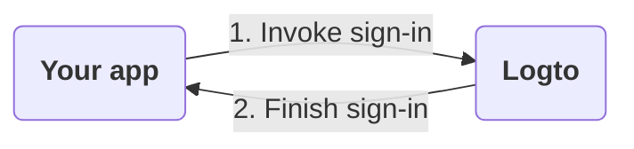

1. Your app invokes the sign-in method.
2. The user is redirected to the Logto sign-in page. For native apps, the system browser is opened.
3. The user signs in and is redirected back to your app (configured as the "Redirect URI" in Logto).

While the process is simple, the redirecting part may look overkill some times. However, it can be beneficial and secure in many ways. We'll explain the reasons in the following sections.

## Why redirect? \{#why-redirect}

### Flexibility \{#flexibility}

Redirecting allows you to decouple the authentication process from your app. As your business grows, you can still keep the same authentication process without changing your app. For example, you can add multi-factor authentication (MFA) or change the sign-in methods without touching your app.

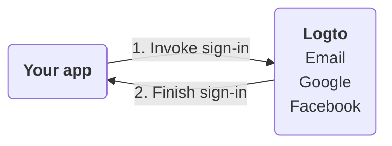

### Multi-app support \{#multi-app-support}

If you have multiple apps, your users can sign in once and access all apps without signing in again. This is especially useful for SaaS businesses or companies with multiple services.

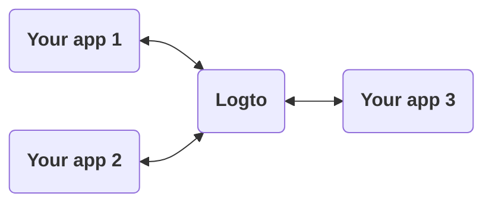

### Native apps \{#native-apps}

For native apps, redirecting to the system browser is a secure way to authenticate users and has built-in support for both iOS and Android.

- **iOS**: Apple offers [ASWebAuthenticationSession](https://developer.apple.com/documentation/authenticationservices/aswebauthenticationsession) for secure authentication.
- **Android**: Google provides [Custom Tabs](https://developer.chrome.com/docs/android/custom-tabs) for a seamless experience.

### Security \{#security}

Under the hood, Logto is an [OpenID Connect (OIDC)](https://openid.net/specs/openid-connect-core-1_0.html) provider. OIDC is a widely adopted standard for user authentication.

Logto enforces strict security measures, such as [PKCE](https://tools.ietf.org/html/rfc7636), and disables insecure flows like the implicit flow. Redirecting is a secure way to authenticate users and can prevent many common attacks.

## What if I need to show some sign-in components in my app? \{#what-if-i-need-to-show-some-sign-in-components-in-my-app}

Sometimes your team may want to show some sign-in components in the app, such as a "Sign in with Google" button. This can be achieved by using the "Direct sign-in" feature in Logto.

### How does it work? \{#how-does-it-work}

Let's say you have two call-to-action buttons in your app: "Get started" and "Sign in with Google". These buttons are designed to:

- "Get started": Redirect to the normal sign-in page.
- "Sign in with Google": Redirect to the Google sign-in page.

Both actions need to complete the sign-in process and redirect back to your app.

---

#### Process of clicking "Get started" \{#process-of-clicking-get-started}

In this case, the sign-in experience is the same as the default. The user is redirected to the Logto sign-in page and then back to your app.

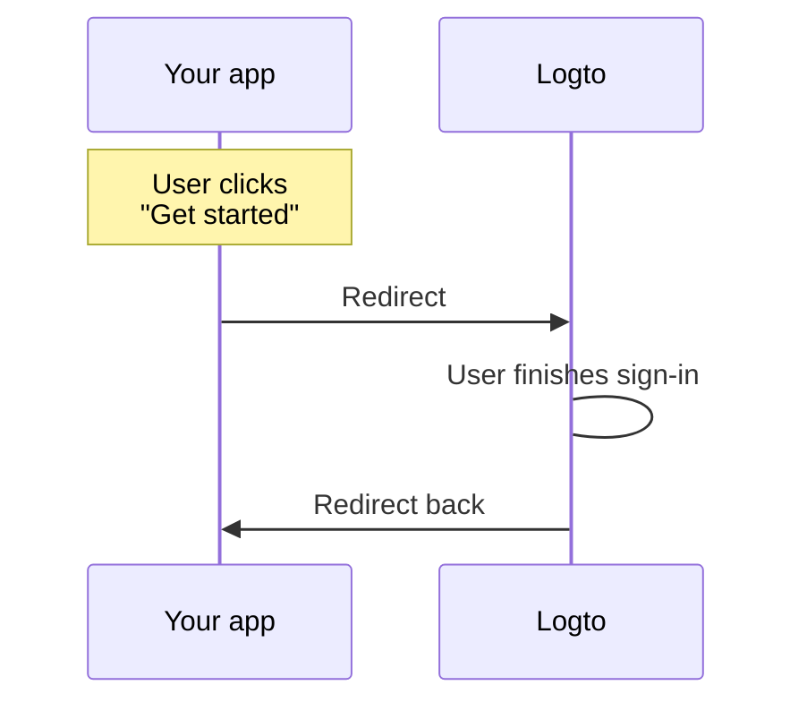

:::note
If you have configured social sign-in methods (e.g., Google, Facebook) in Logto, the user may be redirected to the corresponding sign-in page. In the illustration, we only show the general flow for simplicity.
:::

---

#### Process of clicking "Sign in with Google" \{#process-of-clicking-sign-in-with-google}

In this case, the user is redirected to the Google sign-in page automatically without interacting with the Logto sign-in page. The speed of this auto-redirect is almost instant that users may not notice the redirection.

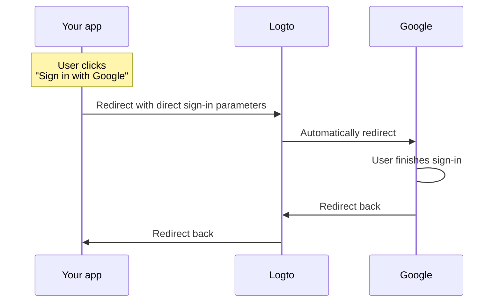

---

In summary, the direct sign-in feature is a way to automate some interactions in the sign-in experience without changing the security level.

### Use direct sign-in in your app \{#use-direct-sign-in-in-your-app}

To use direct sign-in, you need to pass the `direct_sign_in` parameter when invoking the sign-in method. The value should be composed of a certain format that Logto recognizes. For example, to sign in with Google, the value should be `social:google`.

In some of Logto official SDKs, there's a dedicated option for direct sign-in. Here's an example of using direct sign-in in the `@logto/client` JavaScript SDK:

```ts
client.signIn({
  redirectUri: 'https://some-redirect-uri',
  directSignIn: { method: 'social', target: 'google' },
});
```

For more details, please refer to [Direct sign-in](/end-user-flows/authentication-parameters/direct-sign-in).

:::info
We are gradually rolling out this feature in all Logto offical SDKs. If you don't see it in your SDK, please feel free to contact us.
:::

## I need my users to fill in their credentials in my app \{#i-need-my-users-to-fill-in-their-credentials-in-my-app}

If you need your users to fill in their credentials (such as email and password) directly in your app, rather than redirecting to Logto, we can't help you with that at the moment. Historically, there was a "Resource Owner Password Credentials" grant, but it is now considered insecure and has been [formally deprecated in OAuth 2.1](https://datatracker.ietf.org/doc/html/draft-ietf-oauth-security-topics#name-resource-owner-password-cre).

To learn more about the security risks of the ROPC grant type, check out our blog post [Why you should deprecate the ROPC grant type](https://blog.logto.io/deprecated-ropc-grant-type/).

## Related resources \{#related-resources}


================================================================================
SOURCE: src/extraction/local-docs/lgoto/docs/concepts/README.mdx
================================================================================

# Concepts


================================================================================
SOURCE: src/extraction/local-docs/lgoto/docs/concepts/core-service/configuration.md
================================================================================

# Configuration

## Environment variables {#environment-variables}

### Usage {#usage}

Logto handles environment variables in the following order:

- System environment variables
- The `.env` file in the project root, which conforms with [dotenv](https://github.com/motdotla/dotenv#readme) format

Thus the system environment variables will override the values in `.env`.

### Variables {#variables}

:::caution
If you run Logto via `npm start` in the project root, `NODE_ENV` will always be `production`.
:::

In default values, `protocol` will be either `http` or `https` according to your HTTPS config.

| Key                        | Default Value                        | Type                                                     | Description                                                                                                                                                                                                                                                                                |
| -------------------------- | ------------------------------------ | -------------------------------------------------------- | ------------------------------------------------------------------------------------------------------------------------------------------------------------------------------------------------------------------------------------------------------------------------------------------ |
| NODE_ENV                   | `undefined`                          | <code>'production' &#124; 'test' &#124; undefined</code> | What kind of environment that Logto runs in.                                                                                                                                                                                                                                               |
| PORT                       | `3001`                               | `number`                                                 | The local port that Logto listens to.                                                                                                                                                                                                                                                      |
| ADMIN_PORT                 | `3002`                               | `number`                                                 | The local port that Logto Admin Console listens to.                                                                                                                                                                                                                                        |
| ADMIN_DISABLE_LOCALHOST    | N/A                                  | <code>string &#124; boolean &#124; number</code>         | Set it to `1` or `true` to disable the port for Admin Console. With `ADMIN_ENDPOINT` unset, it'll completely disable the Admin Console.                                                                                                                                                    |
| DB_URL                     | N/A                                  | `string`                                                 | The [Postgres DSN](https://www.postgresql.org/docs/14/libpq-connect.html#id-1.7.3.8.3.6) for Logto database.                                                                                                                                                                               |
| DATABASE_STATEMENT_TIMEOUT | N/A                                  | `string`                                                 | (v1.36.0+) PostgreSQL `statement_timeout` in milliseconds. Use a numeric string (e.g., `5000`) to set it, or `DISABLE_TIMEOUT` to omit the startup parameter (recommended for PgBouncer/RDS Proxy). If unset or invalid, the client default is 60000 ms.                                   |
| HTTPS_CERT_PATH            | `undefined`                          | <code>string &#124; undefined</code>                     | See [Enabling HTTPS](#enabling-https) for details.                                                                                                                                                                                                                                         |
| HTTPS_KEY_PATH             | `undefined`                          | <code>string &#124; undefined</code>                     | Ditto.                                                                                                                                                                                                                                                                                     |
| TRUST_PROXY_HEADER         | `false`                              | `boolean`                                                | Ditto.                                                                                                                                                                                                                                                                                     |
| ENDPOINT                   | `'protocol://localhost:$PORT'`       | `string`                                                 | You may specify a URL with your custom domain for online testing or production. This will also affect the value of the [OIDC issuer identifier](https://openid.net/specs/openid-connect-core-1_0.html#IssuerIdentifier).                                                                   |
| ADMIN_ENDPOINT             | `'protocol://localhost:$ADMIN_PORT'` | `string`                                                 | You may specify a URL with your custom domain for production (E.g. `ADMIN_ENDPOINT=https://admin.domain.com`). This will also affect the value of Admin Console Redirect URIs.                                                                                                             |
| CASE_SENSITIVE_USERNAME    | `true`                               | `boolean`                                                | Specifies whether the username is case-sensitive. Exercise caution when modifying this value; changes will not automatically adjust existing database data, requiring manual management.                                                                                                   |
| SECRET_VAULT_KEK           | `undefined`                          | `string`                                                 | The Key Encryption Key (KEK) used to encrypt Data Encryption Keys (DEK) in the [Secret Vault](/secret-vault). Required for the Secret Vault to function properly. Must be a base64-encoded string. AES-256 (32 bytes) is recommended. Example: `crypto.randomBytes(32).toString('base64')` |

### Enabling HTTPS {#enabling-https}

#### Using Node {#using-node}

Node natively supports HTTPS. Provide **BOTH** `HTTPS_CERT_PATH` and `HTTPS_KEY_PATH` to enable HTTPS via Node.

`HTTPS_CERT_PATH` implies the path to your HTTPS certificate, while `HTTPS_KEY_PATH` implies the path to your HTTPS key.

#### Using a HTTPS proxy {#using-a-https-proxy}

Another common practice is to have an HTTPS proxy in front of Node (E.g. Nginx).

In this case, you're likely want to set `TRUST_PROXY_HEADER` to `true` which indicates if proxy header fields should be trusted. Logto will pass the value to [Koa app settings](https://github.com/koajs/koa/blob/master/docs/api/index.md#settings).

See [Trusting TLS offloading proxies](https://github.com/panva/node-oidc-provider/blob/main/docs/README.md#trusting-tls-offloading-proxies) for when to configure this field.

## Database configs {#database-configs}

Managing too many environment variables are not efficient and flexible, so most of our general configs are stored in the database table `logto_configs`.

The table is a simple key-value storage, and the key is enumerable as following:

| Key              | Type                  | Description                                                                                                                        |
| ---------------- | --------------------- | ---------------------------------------------------------------------------------------------------------------------------------- |
| oidc.cookieKeys  | <code>string[]</code> | The string array of the [signing cookie keys](https://github.com/panva/node-oidc-provider/blob/main/docs/README.md#cookieskeys).   |
| oidc.privateKeys | <code>string[]</code> | The string array of the private key content for [OIDC JWT signing](https://openid.net/specs/openid-connect-core-1_0.html#Signing). |

### Supported private key types {#supported-private-key-types}

- EC (P-256, secp256k1, P-384, and P-521 curves)
- RSA
- OKP (Ed25519, Ed448, X25519, X448 sub types)


================================================================================
SOURCE: src/extraction/local-docs/lgoto/docs/concepts/core-service/README.mdx
================================================================================

---
sidebar_label: Logto core service
sidebar_position: 3
---

# Core Service

## Introduction \{#introduction}

_Core Service_ is a monolith service for critical Logto duties. The source code is in [`@logto/core`](https://github.com/logto-io/logto/tree/master/packages/core).

:::note
_Core Service_ and _SDK core_ are two separate concepts. See [SDK convention](/developers/sdk-conventions) for the differences.
:::

To simplify, we divide Core Service into four major modules:


Backend APIs, including OIDC, are built within the `core` package, while frontend proxies depend on the corresponding sibling packages in the Logto monorepo.

## OIDC Provider \{#oidc-provider}

Logto uses the amazing certified [OpenID Connect](https://openid.net/connect/) implementation [node-oidc-provider](https://github.com/panva/node-oidc-provider) under the hood. The provider is mounted at `/oidc`, and you can check relative configurations and files in [packages/core/src/oidc](https://github.com/logto-io/logto/tree/master/packages/core/src/oidc).

The OIDC [Userinfo Endpoint](https://openid.net/specs/openid-connect-core-1_0.html#UserInfo) is available and mounted at `/oidc/me`.

:::info
If you want to directly call OIDC APIs, remember to set header `Content-Type: application/x-www-form-urlencoded`.
:::

### Enabled OpenID features \{#enabled-openid-features}

- [OpenID Connect Core](https://openid.net/specs/openid-connect-core-1_0.html)
- [OpenID Connect Discovery](https://openid.net/specs/openid-connect-discovery-1_0.html)
- [OpenID Connect RP-Initiated Logout](https://openid.net/specs/openid-connect-rpinitiated-1_0.html)
- [OpenID Connect Back-Channel Logout](https://openid.net/specs/openid-connect-backchannel-1_0-final.html)
- [OAuth 2.0](https://www.rfc-editor.org/rfc/rfc6749.html)
- [OAuth 2.0 Token Introspection](https://www.rfc-editor.org/rfc/rfc7662.html)
- [OAuth 2.0 Token Revocation](https://www.rfc-editor.org/rfc/rfc7009.html)
- [OAuth 2.0 Resource Indicators](https://www.rfc-editor.org/rfc/rfc8707.html)
- [OAuth 2.0 Token Exchange](https://datatracker.ietf.org/doc/html/rfc8693.html)
- [Proof Key for Code Exchange (PKCE)](https://www.rfc-editor.org/rfc/rfc7636.html)

## Logto API \{#logto-api}

### Management API \{#management-api}

_Management API_ is a set of APIs that manage and update Logto data. Only users with the `admin` role have access to them.

Head to [API references](https://openapi.logto.io) to see the details.

To access the API programmatically, see [Interact with Management API](/integrate-logto/interact-with-management-api).

### Experience API \{#experience-api}

Experience API is a set of dedicated endpoints that support custom sign-in interface interactions.

These APIs enable developers to implement core authentication features including sign-in, sign-up, password reset, social account binding, and multi-factor authentication (MFA). To implement these features, your custom UI needs to interact with the Experience API.

To better understand the user flows and implementation details:

- Check out [Develop your custom UI](/customization/bring-your-ui/#develop-your-custom-ui) guide to learn how to use Experience API to build your custom experience UI
- Refer to [Experience API references](https://openapi.logto.io/group/endpoint-experience) for detailed API documentation
- Read the [Experience API design RFC](https://github.com/logto-io/rfcs/blob/master/draft/0004-experience-api.md) for in-depth technical specifications and examples

### Account API \{#account-api}

Account API is a comprehensive set of APIs that gives the end users direct API access without needing to go through the Management API, here is the highlights:

- Direct access: The Account API empowers end users to directly access and manage their own account profile without requiring the relay of Management API.
- User profile and identities management: Users can fully manage their profiles and security settings, including the ability to update identity information like email, phone, and password, as well as manage social connections. MFA and SSO support are coming soon.
- Global access control: Admin has full, global control over access settings, can customize each fields.
- Seamless authorization: Authorizing is easier than ever! Simply use `client.getAccessToken()` to obtain an opaque access token for OP (Logto), and attach it to the Authorization header as `Bearer <access_token>`.

With the Logto Account API, you can build a custom account management system like a profile page that is fully integrated with Logto.

Check out [Account settings by Account API](/end-user-flows/account-settings/by-account-api) to learn how to leverage Account API to build your own account settings page.

Refer to [Account API references](https://openapi.logto.io/group/endpoint-my-account) for detailed API documentation.

## Frontend proxies \{#frontend-proxies}

A _frontend proxy_ is a middleware function that serves a frontend project in an environment-related way:

- If it's development, it proxies HTTP requests to the frontend dev server.
- If it's production, it serves static frontend files directly.

Logto has three frontend proxies:


:::note
You may notice that the UI proxy uses the root path. Unlike other proxies, the UI proxy is a fallback proxy which means it only takes effect when no other proxy is matched.
:::


================================================================================
SOURCE: src/extraction/local-docs/lgoto/docs/developers/signing-keys.mdx
================================================================================

---
id: signing-keys
title: Signing keys
sidebar_label: Signing keys
sidebar_position: 5
---

# Signing keys

Logto [OIDC signing keys](https://auth.wiki/signing-key), as known as "OIDC private keys" and "OIDC cookie keys", are the signing keys used to sign JWTs ([access tokens](https://auth.wiki/access-token) and [ID tokens](https://auth.wiki/id-token)) and browser cookies in Logto [sign-in sessions](/end-user-flows/sign-out#what-is-a-logto-session). These signing keys are generated when seeding Logto database ([open-source](/logto-oss)) or creating a new tenant ([Cloud](/logto-cloud)) and can be managed through [CLI](/logto-oss/using-cli) (open-source), Management APIs or Console UI.

By default, Logto uses the elliptic curve (EC) algorithm to generate digital signatures. However, considering that users often need to verify JWT signatures and many older tools do not support the EC algorithm (only supporting RSA), we have implemented the functionality to rotate private keys and allow users to choose the signature algorithm (including both RSA and EC). This ensures compatibility with services that use outdated signature verification tools.

:::note
Theoretically, signing keys should not be leaked and do not have an expiration time, meaning there's no need to rotate them. However, periodically rotating the signing key after a certain period can enhance security.
:::

## How it works? \{#how-it-works}

- **OIDC private key**
  When initializing a Logto instance, a pair of public key and private key are automatically generated and are registered in the underlying OIDC provider. Thereby, when Logto issues a new JWT (access token or ID token), the token is signed with the private key. In the meantime, any client application that receives a JWT can use the paired public key to verify the token signature, in order to ensure the token is not tampered by any third-party. The private key is protected on the Logto server. The public key, however, as the name suggests, are public to everyone, and can be accessed through the `/oidc/jwks` interface of the OIDC endpoint. A signing key algorithm can be specified when generating the private key, and Logto uses EC (Elliptic Curve) algorithm by default. The admin users can change the default algorithm to RSA (Rivest-Shamir-Adleman) by rotating the private keys.
- **OIDC cookie key**
  When user initiate a sign-in or sign-up flow, an "OIDC session" will be created on the server, as well as a set of browser cookies. With these cookies, browser can request Logto Experience API to perform a series of interactions on behalf of the user, such as sign-in, sign-up, and reset password. However, unlike the JWTs, the cookies are only signed and verified by Logto OIDC service itself, asymmetric cryptography measures are not required. Thus we don't have paired public keys for cookie signing keys, nor asymmetric encryption algorithms.

## Rotate signing keys from Console UI \{#rotate-signing-keys-from-console-ui}

Logto introduces a "Signing Keys Rotation" feature, which allows you to create a new OIDC private key and cookie key in your tenant.

1. Navigate to <CloudLink to="/signing-keys">Console > Signing keys</CloudLink>. From there, you can manage both OIDC private keys and OIDC cookie keys.
2. To rotate the signing key, click the "Rotate private keys" or "Rotate cookie keys" button. When rotating private keys, you have the option to change the signing algorithm.
3. And you'll find a table that lists all the signing keys in use. Note: You can delete the previous key, but you cannot delete the current one.

   | Status   | Description                                                                                                               |
   | -------- | ------------------------------------------------------------------------------------------------------------------------- |
   | Current  | This indicates that this key is currently in active use within your applications and APIs.                                |
   | Previous | It refers to a key that was previously used but has been rotated out. Existing tokens with this signing key remain valid. |

Please remember that rotation involves the following three actions:

1. **Creating a new signing key**: This will require all your **applications** and **APIs** to adopt the new signing key.
2. **Rotating the current key**: The existing key will be designated as "previous" after the rotation and will not be utilized by newly created applications and APIs. However, tokens signed with this key will still remain valid.
3. **Removing your previous key**: Keys labeled as "previous" will be revoked and removed from the table.

:::warning
Never rotate signing keys consecutively (two or more times), as this may invalidate ALL issued tokens.

- For OSS users, after rotating the signing key, a Logto instance restart is required for the new signing key to take effect.
- For Cloud users, the new signing key takes effect immediately after rotation, but please make sure not to rotate the signing key multiple times consecutively.
  :::

## Related resources \{#related-resources}


================================================================================
SOURCE: src/extraction/local-docs/lgoto/docs/developers/README.mdx
================================================================================

# Developer

Logto is an [identity and access management (IAM)](https://auth.wiki/iam) service based on [OAuth 2](https://auth.wiki/oauth-2.0) and [OIDC](https://auth.wiki/openid-connect) protocols. IAM services like Logto often serve as the foundation for other web services; various authorization states within those web services are directly affected by Logto.

In order to provide convenience to our users, Logto offers a series of commonly used developer features.

## Sign-in experience related \{#sign-in-experience-related}

```mdx-code-block


================================================================================
SOURCE: src/extraction/local-docs/lgoto/docs/developers/user-impersonation.mdx
================================================================================

---
id: user-impersonation
title: User impersonation
sidebar_label: User impersonation
sidebar_position: 4
---


# User impersonation

Imagine Sarah, a support engineer at TechCorp, receives an urgent ticket from Alex, a customer who can't access a critical resource. To efficiently diagnose and resolve the issue, Sarah needs to see exactly what Alex sees in the system. This is where Logto's user impersonation feature comes in handy.

User impersonation allows authorized users like Sarah to temporarily act on behalf of other users like Alex within the system. This powerful feature is invaluable for troubleshooting, providing customer support, and performing administrative tasks.

## How it works? \{#how-it-works}

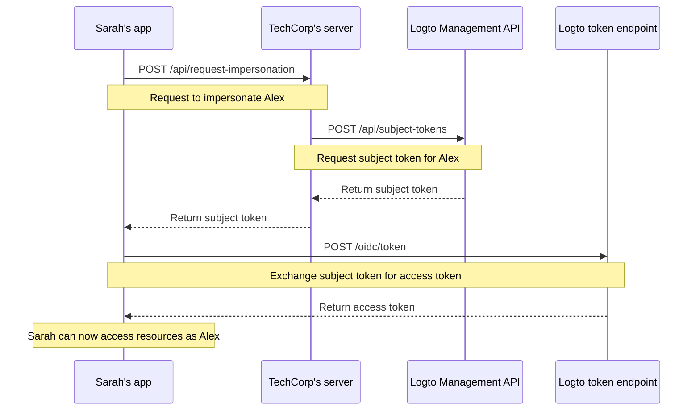

The impersonation process involves three main steps:

1. Sarah requests impersonation through TechCorp's backend server
2. TechCorp's server obtains a subject token from Logto's Management API
3. Sarah's application exchanges this subject token for an access token

Let's walk through how Sarah can use this feature to help Alex.

### Step 1: Requesting impersonation \{#step-1-requesting-impersonation}

First, Sarah's support application needs to request impersonation from TechCorp's backend server.

**Request (Sarah's application to TechCorp's server)**

```bash
POST /api/request-impersonation HTTP/1.1
Host: api.techcorp.com
Authorization: Bearer <Sarah's_access_token>
Content-Type: application/json

{
  "userId": "alex123",
  "reason": "Investigating resource access issue",
  "ticketId": "TECH-1234"
}
```

In this API, the backend should perform proper authorization checks to ensure Sarah has the necessary permissions to impersonate Alex.

### Step 2: Obtaining a subject token \{#step-2-obtaining-a-subject-token}

TechCorp's server, upon validating Sarah's request, will then call Logto's [Management API](/integrate-logto/interact-with-management-api) to obtain a subject token.

**Request (TechCorp's server to Logto's Management API)**

```bash
POST /api/subject-tokens HTTP/1.1
Host: techcorp.logto.app
Authorization: Bearer <TechCorp_m2m_access_token>
Content-Type: application/json

{
  "userId": "alex123",
  "context": {
    "ticketId": "TECH-1234",
    "reason": "Resource access issue",
    "supportEngineerId": "sarah789"
  }
}
```

**Response (Logto to TechCorp's server)**

```json
{
  "subjectToken": "sub_7h32jf8sK3j2",
  "expiresIn": 600
}
```

TechCorp's server should then return this subject token to Sarah's application.

**Response (TechCorp's server to Sarah's application)**

```json
{
  "subjectToken": "sub_7h32jf8sK3j2",
  "expiresIn": 600
}
```

### Step 3: Exchanging the subject token for an access token \{#step-3-exchanging-the-subject-token-for-an-access-token}


Now, Sarah's application exchanges this subject token for an access token representing Alex, specifying the resource where the token will be used.

**Request (Sarah's application to Logto's token endpoint)**

For traditional web applications or machine-to-machine applications with app secret, include the credentials in the `Authorization` header:

```bash
POST /oidc/token HTTP/1.1
Host: techcorp.logto.app
Content-Type: application/x-www-form-urlencoded
# highlight-next-line
Authorization: Basic <base64(client_id:client_secret)>

grant_type=urn:ietf:params:oauth:grant-type:token-exchange
&scope=resource:read
&subject_token=alx_7h32jf8sK3j2
&subject_token_type=urn:ietf:params:oauth:token-type:access_token
&resource=https://api.techcorp.com/customer-data
```

For single-page applications (SPA) or native applications without app secret, include `client_id` in the request body:

```bash
POST /oidc/token HTTP/1.1
Host: techcorp.logto.app
Content-Type: application/x-www-form-urlencoded

grant_type=urn:ietf:params:oauth:grant-type:token-exchange
# highlight-next-line
&client_id=techcorp_support_app
&scope=resource:read
&subject_token=alx_7h32jf8sK3j2
&subject_token_type=urn:ietf:params:oauth:token-type:access_token
&resource=https://api.techcorp.com/customer-data
```

**Response (Logto to Sarah's application)**

```json
{
  "access_token": "eyJhbG...<truncated>",
  "issued_token_type": "urn:ietf:params:oauth:token-type:access_token",
  "token_type": "Bearer",
  "expires_in": 3600,
  "scope": "resource:read"
}
```

The `access_token` returned will be bound to the specified resource, ensuring it can only be used with TechCorp's customer data API.

## Example usage \{#example-usage}

Here's how Sarah might use this in a Node.js support application:

```tsx
interface ImpersonationResponse {
  subjectToken: string;
  expiresIn: number;
}

interface TokenExchangeResponse {
  access_token: string;
  issued_token_type: string;
  token_type: string;
  expires_in: number;
  scope: string;
}

async function impersonateUser(
  userId: string,
  clientId: string,
  ticketId: string,
  resource: string,
  // highlight-next-line
  clientSecret?: string // Required for traditional web or machine-to-machine apps
): Promise<string> {
  try {
    // Step 1 & 2: Request impersonation and get subject token
    const impersonationResponse = await fetch(
      'https://api.techcorp.com/api/request-impersonation',
      {
        method: 'POST',
        headers: {
          Authorization: "Bearer <Sarah's_access_token>",
          'Content-Type': 'application/json',
        },
        body: JSON.stringify({
          userId,
          reason: 'Investigating resource access issue',
          ticketId,
        }),
      }
    );

    if (!impersonationResponse.ok) {
      throw new Error(`HTTP error occurred. Status: ${impersonationResponse.status}`);
    }

    const { subjectToken } = (await impersonationResponse.json()) as ImpersonationResponse;

    // Step 3: Exchange subject token for access token
    // highlight-start
    // For traditional web or M2M apps, use Basic auth with client secret
    // For SPA or native apps, include client_id in the request body
    const headers: Record<string, string> = {
      'Content-Type': 'application/x-www-form-urlencoded',
    };

    const tokenExchangeBody = new URLSearchParams({
      grant_type: 'urn:ietf:params:oauth:grant-type:token-exchange',
      scope: 'openid profile resource.read',
      subject_token: subjectToken,
      subject_token_type: 'urn:ietf:params:oauth:token-type:access_token',
      resource: resource,
    });

    if (clientSecret) {
      // Confidential client: use Basic auth
      headers['Authorization'] =
        `Basic ${Buffer.from(`${clientId}:${clientSecret}`).toString('base64')}`;
    } else {
      // Public client: include client_id in body
      tokenExchangeBody.append('client_id', clientId);
    }
    // highlight-end

    const tokenExchangeResponse = await fetch('https://techcorp.logto.app/oidc/token', {
      method: 'POST',
      headers,
      body: tokenExchangeBody,
    });

    if (!tokenExchangeResponse.ok) {
      throw new Error(`HTTP error! status: ${tokenExchangeResponse.status}`);
    }

    const tokenData = (await tokenExchangeResponse.json()) as TokenExchangeResponse;
    return tokenData.access_token;
  } catch (error) {
    console.error('Impersonation failed:', error);
    throw error;
  }
}

// Sarah uses this function to impersonate Alex
async function performImpersonation(): Promise<void> {
  try {
    // highlight-start
    // For traditional web or M2M apps, pass the client secret
    const accessToken = await impersonateUser(
      'alex123',
      'techcorp_support_app',
      'TECH-1234',
      'https://api.techcorp.com/customer-data',
      'your-client-secret' // Omit this for SPA or native apps
    );
    // highlight-end
    console.log('Impersonation access token for Alex:', accessToken);
  } catch (error) {
    console.error('Failed to perform impersonation:', error);
  }
}

// Execute the impersonation
void performImpersonation();
```

:::note

1. The subject token is short-lived and for one-time-use.
2. The impersonation access token doesn't come with a [refresh token](https://auth.wiki/refresh-token). Sarah will need to repeat this process if the token expires before she resolves Alex's issue.
3. TechCorp's backend server must implement proper authorization checks to ensure only authorized support staff like Sarah can request impersonation.

:::

## `act` claim \{#act-claim}

When using the token exchange flow for impersonation, the issued access token can include an additional `act` (actor) claim. This claim represents the identity of the "acting party" - in our example, Sarah, who is performing the impersonation.

To include the `act` claim, Sarah's application needs to provide an `actor_token` in the token exchange request. This token should be a valid access token for Sarah with the `openid` scope. Here's how to include it in the token exchange request:

For traditional web applications or machine-to-machine applications:

```bash
POST /oidc/token HTTP/1.1
Host: techcorp.logto.app
Content-Type: application/x-www-form-urlencoded
# highlight-next-line
Authorization: Basic <base64(client_id:client_secret)>

grant_type=urn:ietf:params:oauth:grant-type:token-exchange
&scope=resource:read
&subject_token=alx_7h32jf8sK3j2
&subject_token_type=urn:ietf:params:oauth:token-type:access_token
&actor_token=sarah_access_token
&actor_token_type=urn:ietf:params:oauth:token-type:access_token
&resource=https://api.techcorp.com/customer-data
```

For SPA or native applications, include `client_id` in the request body instead:

```bash
POST /oidc/token HTTP/1.1
Host: techcorp.logto.app
Content-Type: application/x-www-form-urlencoded

grant_type=urn:ietf:params:oauth:grant-type:token-exchange
# highlight-next-line
&client_id=techcorp_support_app
&scope=resource:read
&subject_token=alx_7h32jf8sK3j2
&subject_token_type=urn:ietf:params:oauth:token-type:access_token
&actor_token=sarah_access_token
&actor_token_type=urn:ietf:params:oauth:token-type:access_token
&resource=https://api.techcorp.com/customer-data
```

If an `actor_token` is provided, the resulting access token will contain an `act` claim like this:

```json
{
  "aud": "https://api.techcorp.com",
  "iss": "https://techcorp.logto.app",
  "exp": 1443904177,
  "sub": "alex123",
  "act": {
    "sub": "sarah789"
  }
}
```

This `act` claim clearly indicates that Sarah (sarah789) is acting on behalf of Alex (alex123). The `act` claim can be useful for auditing and tracking impersonation actions.

## Customizing token claims \{#customizing-token-claims}

Logto allows you to [customize the token claims](/developers/custom-token-claims) for impersonation tokens. This can be useful for adding additional context or metadata to the impersonation process, such as the reason for impersonation or the associated support ticket.

When TechCorp's server requests a subject token from Logto's Management API, it can include a `context` object:

```json
{
  "userId": "alex123",
  "context": {
    "ticketId": "TECH-1234",
    "reason": "Resource access issue",
    "supportEngineerId": "sarah789"
  }
}
```

This [context](/developers/custom-token-claims/create-script#context-only-available-for-user-access-token) can then be used in a `getCustomJwtClaims()` function to add specific claims to the final access token. Here's an example of how this might be implemented:

```tsx
const getCustomJwtClaims = async ({ token, context, environmentVariables }) => {
  if (context.grant?.type === 'urn:ietf:params:oauth:grant-type:token-exchange') {
    const { ticketId, reason, supportEngineerId } = context.grant.subjectTokenContext;
    return {
      impersonation_context: {
        ticket_id: ticketId,
        reason: reason,
        support_engineer: supportEngineerId,
      },
    };
  }
  return {};
};
```

The resulting access token that Sarah receives might look like this:

```json
{
  "sub": "alex123",
  "aud": "https://api.techcorp.com/customer-data",
  "impersonation_context": {
    "ticket_id": "TECH-1234",
    "reason": "Resource access issue",
    "support_engineer": "sarah789"
  }
  // ... other standard claims
}
```

By customizing access token claims in this way, TechCorp can include valuable information about the impersonation context, making it easier to audit and understand impersonation activities in their system.

:::note
Be cautious when adding custom claims to your tokens. Avoid including sensitive information that could pose security risks if the token is intercepted or leaked. The JWTs are signed but not encrypted, so the claims are visible to anyone with access to the token.
:::

## Related resources \{#related-resources}


================================================================================
SOURCE: src/extraction/local-docs/lgoto/docs/developers/audit-logs/event-types.mdx
================================================================================

---
sidebar_label: Event types
---

# Event types of audit logs

You can filter event types in <CloudLink to="/audit-logs">Logto Console > Audit Logs</CloudLink>.

:::note

Logto now supports retrieving logs related to end-user interactions via the [Experience APIs](https://openapi.logto.io/group/endpoint-experience).

Audit logs for [Management APIs](/integrate-logto/interact-with-management-api) and [Account APIs](https://openapi.logto.io/group/endpoint-account-center) are coming soon.

Feel free to [contact us](https://logto.io/contact) if you’d like to share your requirements.

:::

## Exchange token \{#exchange-token}

| Key                               | Name                                 |
| --------------------------------- | ------------------------------------ |
| ExchangeTokenBy.AuthorizationCode | Exchange token by Code               |
| ExchangeTokenBy.ClientCredentials | Exchange token by Client Credentials |
| ExchangeTokenBy.RefreshToken      | Exchange token by Refresh Token      |
| ExchangeTokenBy.TokenExchange     | Token exchange                       |

## Custom token claims \{#custom-token-claims}

| Key                            | Name                                |
| ------------------------------ | ----------------------------------- |
| JwtCustomizer.AccessToken      | Get custom user access token claims |
| JwtCustomizer.ClientCredential | Get custom M2M access token claims  |

## Interaction lifecycle \{#interaction-lifecycle}

| Key                | Name                |
| ------------------ | ------------------- |
| Interaction.Create | Interaction started |
| Interaction.End    | Interaction ended   |

## Register \{#register}

| Key                                                            | Name                                                       |
| -------------------------------------------------------------- | ---------------------------------------------------------- |
| Interaction.Register.Create                                    | Create new register interaction                            |
| Interaction.Register.Submit                                    | Submit register interaction                                |
| Interaction.Register.Update                                    | Update register interaction                                |
| Interaction.Register.Identifier.Submit                         | Create and identify new user for register interaction      |
| Interaction.Register.Identifier.VerificationCode.Create        | Create and send register identifier with verification code |
| Interaction.Register.Identifier.VerificationCode.Submit        | Submit and verify register verification code               |
| Interaction.Register.Verification.NewPassword.Submit           | Create new password identity for register                  |
| Interaction.Register.Verification.Password.Submit              | Create and verify identifier with password verification    |
| Interaction.Register.Verification.EmailVerificationCode.Create | Create and send register email verification code           |
| Interaction.Register.Verification.EmailVerificationCode.Submit | Verify register email verification code                    |
| Interaction.Register.Verification.SmsVerificationCode.Create   | Create and send register SMS verification code             |
| Interaction.Register.Verification.SmsVerificationCode.Submit   | Verify register SMS verification code                      |
| Interaction.Register.Verification.Social.Create                | Create social authentication URL                           |
| Interaction.Register.Verification.Social.Submit                | Verify social authentication                               |
| Interaction.Register.Verification.EnterpriseSso.Create         | Create enterprise SSO authentication URL                   |
| Interaction.Register.Verification.EnterpriseSso.Submit         | Verify enterprise SSO authentication                       |
| Interaction.Register.Profile.Create                            | Put new register interaction profile                       |
| Interaction.Register.Profile.Delete                            | Delete register interaction profile                        |
| Interaction.Register.Profile.Update                            | Patch update register interaction profile                  |

## Sign in \{#sign-in}

| Key                                                          | Name                                                        |
| ------------------------------------------------------------ | ----------------------------------------------------------- |
| Interaction.SignIn.Create                                    | Create new sign-in interaction                              |
| Interaction.SignIn.Submit                                    | Submit sign-in interaction                                  |
| Interaction.SignIn.Update                                    | Update sign-in interaction                                  |
| Interaction.SignIn.Identifier.Submit                         | Identify user for sign-in interaction                       |
| Interaction.SignIn.Identifier.Password.Submit                | Submit sign-in identifier with password                     |
| Interaction.SignIn.Verification.NewPassword.Submit           | Create new password identity for register                   |
| Interaction.SignIn.Verification.Password.Submit              | Create and verify identifier with password verification     |
| Interaction.SignIn.Identifier.VerificationCode.Create        | Create and send sign-in verification code                   |
| Interaction.SignIn.Identifier.VerificationCode.Submit        | Submit and verify sign-in identifier with verification code |
| Interaction.SignIn.Verification.EmailVerificationCode.Create | Create and send sign-in email verification code             |
| Interaction.SignIn.Verification.EmailVerificationCode.Submit | Verify sign-in email verification code                      |
| Interaction.SignIn.Verification.SmsVerificationCode.Create   | Create and send sign-in SMS verification code               |
| Interaction.SignIn.Verification.SmsVerificationCode.Submit   | Verify sign-in SMS verification code                        |
| Interaction.SignIn.Identifier.Social.Create                  | Create social sign-in authorization-url                     |
| Interaction.SignIn.Identifier.Social.Submit                  | Authenticate and submit social identifier                   |
| Interaction.SignIn.Verification.Social.Create                | Create social authentication URL                            |
| Interaction.SignIn.Verification.Social.Submit                | Verify social authentication                                |
| Interaction.SignIn.Identifier.SingleSignOn.Create            | Create single-sign-on authentication session                |
| Interaction.SignIn.Identifier.SingleSignOn.Submit            | Submit single-sign-on authentication interaction            |
| Interaction.SignIn.Verification.EnterpriseSso.Create         | Create enterprise SSO authentication URL                    |
| Interaction.SignIn.Verification.EnterpriseSso.Submit         | Verify enterprise SSO authentication                        |
| Interaction.SignIn.Verification.IdpInitiatedSso.Create       | Create IdP-initiated SAML SSO authentication session        |
| Interaction.SignIn.Profile.Create                            | Put new sign-in interaction profile                         |
| Interaction.SignIn.Profile.Delete                            | Delete sign-in interaction profile                          |
| Interaction.SignIn.Profile.Update                            | Patch update sign-in interaction profile                    |

## Forgot password \{#forgot-password}

| Key                                                                  | Name                                                    |
| -------------------------------------------------------------------- | ------------------------------------------------------- |
| Interaction.ForgotPassword.Create                                    | Create new forgot-password interaction                  |
| Interaction.ForgotPassword.Submit                                    | Submit forgot-password interaction                      |
| Interaction.ForgotPassword.Update                                    | Update forgot-password interaction                      |
| Interaction.ForgotPassword.Identifier.Submit                         | Identify user for forgot-password interaction           |
| Interaction.ForgotPassword.Identifier.VerificationCode.Create        | Create and send forgot-password verification code       |
| Interaction.ForgotPassword.Identifier.VerificationCode.Submit        | Submit and verify forgot-password verification code     |
| Interaction.ForgotPassword.Verification.EmailVerificationCode.Create | Create and send forgot-password email verification code |
| Interaction.ForgotPassword.Verification.EmailVerificationCode.Submit | Verify forgot-password email verification code          |
| Interaction.ForgotPassword.Verification.SmsVerificationCode.Create   | Create and send forgot-password SMS verification code   |
| Interaction.ForgotPassword.Verification.SmsVerificationCode.Submit   | Verify forgot-password SMS verification code            |
| Interaction.ForgotPassword.Profile.Create                            | Put new forgot-password interaction profile             |
| Interaction.ForgotPassword.Profile.Delete                            | Delete forgot-password interaction profile              |
| Interaction.ForgotPassword.Profile.Update                            | Patch update forgot-password interaction profile        |

## MFA \{#mfa}

| Key                                                 | Name                                            |
| --------------------------------------------------- | ----------------------------------------------- |
| Interaction.Register.Verification.BackupCode.Create | Create backup codes for MFA binding             |
| Interaction.Register.Verification.BackupCode.Submit | Verify backup code                              |
| Interaction.Register.Verification.Totp.Create       | Create TOTP verification secret for MFA binding |
| Interaction.Register.Verification.Totp.Submit       | Verify TOTP verification code                   |
| Interaction.Register.Verification.Webauthn.Create   | Create WebAuthn authentication                  |
| Interaction.Register.Verification.WebAuthn.Submit   | Verify WebAuthn authentication                  |
| Interaction.SignIn.Verification.BackupCode.Create   | Create backup codes for MFA binding             |
| Interaction.SignIn.Verification.BackupCode.Submit   | Verify backup code                              |
| Interaction.SignIn.Verification.Totp.Create         | Create TOTP verification secret for MFA binding |
| Interaction.SignIn.Verification.Totp.Submit         | Verify TOTP verification code                   |
| Interaction.SignIn.Verification.Webauthn.Create     | Create WebAuthn authentication                  |
| Interaction.SignIn.Verification.WebAuthn.Submit     | Verify WebAuthn authentication                  |

## SAML application \{#saml-application}

| Key                          | Name                                            |
| ---------------------------- | ----------------------------------------------- |
| SamlApplication.AuthnRequest | Receive SAML application authentication request |
| SamlApplication.Callback     | Handle SAML application callback                |

## Security \{#security}

| Key                        | Name                 |
| -------------------------- | -------------------- |
| Interaction.Create.Captcha | CAPTCHA verification |

## Related resources \{#related-resources}


================================================================================
SOURCE: src/extraction/local-docs/lgoto/docs/developers/audit-logs/README.mdx
================================================================================

---
sidebar_position: 7
---

# Audit logs

Logto's audit log allows you to easily monitor user activity and events. It provides a strong foundation for various user management and health check business scenarios.

## View all logs \{#view-all-logs}

Navigate to <CloudLink to="/audit-logs">Console > Audit logs</CloudLink>. Logto captures and organizes authentication events into a table. It keeps track of the event name, user, application, and timestamp. You can narrow down the results by filtering based on the event name and application name. Clicking on a specific event will provide additional details.

:::warning
Audit logs only contain logs that occur during user authentication process, logs of Management API operations is not recorded.
:::

## Capture user activity at the tenant level \{#capture-user-activity-at-the-tenant-level}

Logto's logs offer comprehensive details, ensuring ease of action and customer safety. They capture and record the following information:

- Type of event (full list of audit log events can be found [here](/developers/audit-logs/event-types))
- Application involved
- IP address
- User involved
- Log ID
- Timestamp
- User-agent

By maintaining these event records, organizations can effectively detect possible security risks and promptly address them to prevent unauthorized system access.


## Perform a detailed analysis at the user level \{#perform-a-detailed-analysis-at-the-user-level}

Administrators can perform a detailed analysis of logs associated with specific users, facilitating comprehensive investigations into specific events. The navigation process is straightforward and user-friendly.

To access user-specific logs, follow these steps:

1. Navigate to <CloudLink to="/users">Console > User management</CloudLink>.
2. Select the desired user and go to the detail page.
3. Click on "User logs". The resulting table will exclusively display log events performed and triggered by that particular user.


OSS users should add cronjob to clean up out-dated audit logs regularly.


================================================================================
SOURCE: src/extraction/local-docs/lgoto/docs/developers/sdk-conventions/design-strategy.mdx
================================================================================

---
id: design-strategy
title: Design strategy
sidebar_label: Design strategy
sidebar_position: 2
---

# Design strategy

- Every programming language should have an isolated git repository named `${language}`.
- Each programming language repository should be a mono repo.
- Both SDKs and their associated sample projects should be placed under this repository.

Examples:


- js (core)
- react
- react-sample


- kotlin (core)
- android
- android-sample


================================================================================
SOURCE: src/extraction/local-docs/lgoto/docs/developers/sdk-conventions/core-sdk-conventions.mdx
================================================================================

---
id: core-sdk-convention
title: Core SDK convention
sidebar_label: Core SDK convention
sidebar_position: 3
---

# Core SDK convention

## Basic conventions \{#basic-conventions}

- The core should contain platform-independent functions only.
- The core should be named as `{$language}` and under the repository root directory. E.g., `logto/js/js`, `logto/kotlin/kotlin`.
- The core package should be named as `{$language}` under Logto scope. E.g., `@logto/js`, `io.logto.sdk:kotlin`.

## Basic requirements \{#basic-requirements}

Any core SDK should contain:

- Types
- Utility functions
- Core functions

### Types \{#types}


The configuration of the identity provider, which can be retrieved via `/oidc/.well-known/openid-configuration` API.

**Properties**

| Name                  | Type     |
| --------------------- | -------- |
| authorizationEndpoint | `string` |
| tokenEndpoint         | `string` |
| endSessionEndpoint    | `string` |
| revocationEndpoint    | `string` |
| jwksUri               | `string` |
| issuer                | `string` |


The response data of `/oidc/token` (by authorization code).

**Properties**

| Name         | Type     | Required |
| ------------ | -------- | -------- |
| accessToken  | `string` | ✅       |
| refreshToken | `string` |          |
| idToken      | `string` | ✅       |
| scope        | `string` | ✅       |
| expiresIn    | `number` | ✅       |


The response data of `/oidc/token` (by refresh token) when refreshing tokens by a refresh token.

**Properties**

| Name         | Type     | Required |
| ------------ | -------- | -------- |
| accessToken  | `string` | ✅       |
| refreshToken | `string` | ✅       |
| idToken      | `string` |          |
| scope        | `string` | ✅       |
| expiresIn    | `number` | ✅       |


Claims carried by the id token.

**Properties**

| Name     | Type     | Required |
| -------- | -------- | -------- |
| sub      | `string` | ✅       |
| aud      | `string` | ✅       |
| exp      | `number` | ✅       |
| iat      | `number` | ✅       |
| iss      | `string` | ✅       |
| atHash   | `string` |          |
| username | `string` |          |
| name     | `string` |          |
| avatar   | `string` |          |


### Utility functions \{#utility-functions}


Generate a code verifier.  
The length of the code verifier is hardcoded as 64.  
The return value MUST be encrypted to an URL-safe base64 format string.

**Reference**

- [PKCE](https://oauth.net/2/pkce/)

**Parameters**

None.

**Return Type**

`string`


Generate a code challenge based on a code verifier.  
This method encrypts the code verifier and returns the result in a URL-safe Base64 format.  
We hardcode the encryption algorithm as `SHA-256` in Logto V1.

**Reference**

- [PKCE](https://oauth.net/2/pkce/)

**Parameters**

| Name         | Type     | Notes                             |
| ------------ | -------- | --------------------------------- |
| codeVerifier | `string` | Generated by generateCodeVerifier |

**Return Type**

`string`


"State" is used to prevent the CSRF attack.  
The length of the "state" is hardcoded as 64.  
The result string to be returned MUST be encrypted to an URL-safe base64 format string.

**Reference**

- [CSRF](https://datatracker.ietf.org/doc/html/rfc6749#section-10.12)

**Parameters**

None.

**Return Type**

`string`


Decode an ID Token without secret verification.  
Return an `IdTokenClaims` which carries all the token claims in the payload section.

**Parameters**

| Name  | Type     |
| ----- | -------- |
| token | `string` |

**Return Type**

`IdTokenClaims`

**Throws**

- The `token` is not a valid JWT.


Verify if an ID Token is legal.

**Verify Signing Key**

OIDC supported the JSON Web Key Set.
This function accepts a `JsonWebKeySet` object from a 3rd-party library (jose) for verification.

```json
// JsonWebKeySet example
{
  "keys": [
    {
      "kty": "RSA",
      "use": "sig",
      "kid": "xxxx",
      "e": "xxxx",
      "n": "xxxx"
    }
  ]
}
```

**Verify Claims**

- Verify the `iss` in the ID Token matches the issuer of this token.
- Verify the `aud` (audience) Claim is equal to the client ID.
- Verify that the current time is before the expiry time.
- Verify that the issued at time (`iat`) is not more than +/- 1 minute on the current time.

**Reference**

- [OpenID connect core - ID Token Validation](https://openid.net/specs/openid-connect-core-1_0.html#IDTokenValidation)

**Parameters**

| Name     | Type            |
| -------- | --------------- |
| idToken  | `string`        |
| clientId | `string`        |
| issuer   | `string`        |
| jwks     | `JsonWebKeySet` |

**Return Type**

`void`

**Throws**

- Verify signing key failed
- Verify claims failed


Verify the sign-in callbackUri is legal and return the `code` extracted from callbackUri.

**Verify Callback URI**

- Verify the `callbackUri` should start with `redirectUri`
- Verify there is no `error` in the `callbackUri` (Refer to [Error Response](https://datatracker.ietf.org/doc/html/rfc6749#section-4.1.2.1) in redirect URI).
- Verify the `callbackUri` contains `state`, which should equal to the `state` value you specified in `generateSignInUri`.
- Verify the `callbackUri` contains the parameter value `code`, which you will use when requesting to `/oidc/token` (by refresh token).

**Parameters**

| Name        | Type     |
| ----------- | -------- |
| callbackUri | `string` |
| redirectUri | `string` |
| state       | `string` |

**Return Type**

`string`

**Throws**

- Verifications failed


### Core functions \{#core-functions}


Return `OidcConfigResponse` by requesting to `/oidc/.well-known/openid-configuration`.

**Parameters**

| Name     | Type     | Notes                     |
| -------- | -------- | ------------------------- |
| endpoint | `string` | The OIDC service endpoint |

**Return Type**

`OidcConfigResponse`

**Throws**

- Fetch failed


**Parameters**

| Name                  | Type       | Required | Notes                                                             |
| --------------------- | ---------- | -------- | ----------------------------------------------------------------- |
| authorizationEndpoint | `string`   | ✅       |                                                                   |
| clientId              | `string`   | ✅       |                                                                   |
| redirectUri           | `string`   | ✅       |                                                                   |
| codeChallenge         | `string`   | ✅       |                                                                   |
| state                 | `string`   | ✅       |                                                                   |
| scopes                | `string[]` |          | The implementation may vary according to language specifications. |
| resources             | `string[]` |          | The implementation may vary according to language specifications. |
| prompt                | `string`   |          | Default: `consent`.                                               |

The URL will be generated based on `authorizationEndpoint` and contains the following query params:

**Sign-In Url Query Parameters**

| Query Key             | Required | Notes                                                                                                            |
| --------------------- | -------- | ---------------------------------------------------------------------------------------------------------------- |
| client_id             | ✅       |                                                                                                                  |
| redirect_uri          | ✅       |                                                                                                                  |
| code_challenge        | ✅       |                                                                                                                  |
| code_challenge_method | ✅       | Hardcoded as S256.                                                                                               |
| state                 | ✅       |                                                                                                                  |
| scope                 | ✅       | scope always contains openid and offline_access, even the input scope provides a null or empty scope value.      |
| resource              |          | We can add resource to uri more than once, the backend will convert them as a list. e.g. `resource=a&resource=b` |
| response_type         | ✅       | Hardcoded as code.                                                                                               |
| prompt                | ✅       |                                                                                                                  |

**Return Type**

`string`


**Parameters**

| Name                  | Type     | Required |
| --------------------- | -------- | -------- |
| endSessionEndpoint    | `string` | ✅       |
| idToken               | `string` | ✅       |
| postLogoutRedirectUri | `string` |          |

The URL to be generated will be based on `endSessionEndpoint` and contain the following query parameters:

**Sign-Out Url Query Parameters**

| Query Key                | Required | Notes                                         |
| ------------------------ | -------- | --------------------------------------------- |
| id_token_hint            | ✅       | the inputed `idToken` parameter               |
| post_logout_redirect_uri |          | the inputed `postLogoutRedirectUri` parameter |

**Return Type**

`string`


Fetch a token (`CodeTokenResponse`) by requesting to `/oidc/token` (by authorization code).

**Parameters**

| Name          | Type     | Required |
| ------------- | -------- | -------- |
| tokenEndpoint | `string` | ✅       |
| code          | `string` | ✅       |
| codeVerifier  | `string` | ✅       |
| clientId      | `string` | ✅       |
| redirectUri   | `string` | ✅       |
| resource      | `string` |          |

**HTTP Request**

- Endpoint: `/oidc/token`
- Method: `POST`
- Content-Type: `application/x-www-form-urlencoded`
- Payload:

| Query Key     | Type                           | Required |
| ------------- | ------------------------------ | -------- |
| grant_type    | `string: 'authorization_code'` | ✅       |
| code          | `string`                       | ✅       |
| code_verifier | `string`                       | ✅       |
| client_id     | `string`                       | ✅       |
| redirect_uri  | `string`                       | ✅       |
| resource      | `string`                       |          |

**Return Type**

`CodeTokenResponse`

**Throws**

- Fetch failed


Fetch a token (`RefreshTokenTokenResponse`) via `/oidc/token` (by refresh token).

**Parameters**

| Name          | Type       | Required |
| ------------- | ---------- | -------- |
| tokenEndpoint | `string`   | ✅       |
| clientId      | `string`   | ✅       |
| refreshToken  | `string`   | ✅       |
| resource      | `string`   |          |
| scopes        | `string[]` |          |

**HTTP Request**

- Endpoint: `/oidc/token`
- Method: `POST`
- Content-Type: `application/x-www-form-urlencoded`
- Payload:

| Query Key     | Type                      | Required | Notes                                                                   |
| ------------- | ------------------------- | -------- | ----------------------------------------------------------------------- |
| grant_type    | `string: 'refresh_token'` | ✅       |                                                                         |
| refresh_token | `string`                  | ✅       |                                                                         |
| client_id     | `string`                  | ✅       |                                                                         |
| resource      | `string`                  |          |                                                                         |
| scope         | `string`                  |          | we join the `scopes` values with space to construct this `scope` string |

**Return Type**

`RefreshTokenTokenResponse`

**Throws**

- Fetch failed


Request to `/oidc/token/revocation` API to notify the authorization server that a previously obtained refresh or access token is no longer needed.

**Parameters**

| Name               | Type     | Notes               |
| ------------------ | -------- | ------------------- |
| revocationEndpoint | `string` |                     |
| clientId           | `string` |                     |
| token              | `string` | token to be revoked |

**HTTP Request**

- Endpoint: `/oidc/token/revocation`
- Method: `POST`
- Content-Type: `application/x-www-form-urlencoded`
- Payload:

| Query Key | Type     |
| --------- | -------- |
| client_id | `string` |
| token     | `string` |

**Return Type**

`void`

**Throws**

- Revoke failed


================================================================================
SOURCE: src/extraction/local-docs/lgoto/docs/developers/sdk-conventions/README.mdx
================================================================================

---
id: sdk-conventions
title: Platform SDK conventions
sidebar_label: Platform SDK conventions
sidebar_position: 8
---

# Platform SDK conventions

Logto provides a very powerful and flexible web authentication service.

In practical use of Logto's services, for convenience, it is often necessary for developers to integrate the Logto SDK into their own client applications to manage user sign-in status, permissions, and more.

You can find SDKs for all programming languages/frameworks supported by Logto [here](/quick-starts).

If you're unlucky and don't find the SDK you want, here is a convention you can follow to implement the SDK for your desired programming language, making it easier to use Logto services.

This convention contains three main parts:


================================================================================
SOURCE: src/extraction/local-docs/lgoto/docs/developers/sdk-conventions/platform-sdk-conventions.mdx
================================================================================

---
id: platform-sdk-convention
title: Platform SDK convention
sidebar_label: Platform SDK convention
sidebar_position: 4
---

# Platform SDK convention

Platform SDK provides a standard way to integrate the client with Logto service in the specific platform and accelerates the integration process.

- Platform SDK encapsulates [the core](/developers/sdk-conventions/core-sdk-convention) with platform-specific implementation.
- Platform SDK should provide basic types that make SDK easier to use.
- Platform SDK should be exported as a class named `LogtoClient`.

## Basic types \{#basic-types}


| Name                | Type       | Required | Default Value                       | Notes                                                                         |
| ------------------- | ---------- | -------- | ----------------------------------- | ----------------------------------------------------------------------------- |
| endpoint            | `string`   | ✅       |                                     | The OIDC service endpoint.                                                    |
| appId               | `string`   | ✅       |                                     | The application id comes from the application we registered in Logto Service. |
| scopes              | `string[]` |          | `[openid, offline_access, profile]` | This field always contains `openid`, `offline_access` and `profile`.          |
| resources           | `string[]` |          |                                     | The protected resource indicators we want to use.                             |
| prompt              | `string`   |          | `consent`                           | The prompt value used in `generateSignInUri`.                                 |
| usingPersistStorage | `boolean`  |          | `true`                              | Decide to store credentials on the local machine or not.                      |

**\*Notes**

- You can extend this `LogtoConfig` if you need to.
- `usingPersistStorage` is only provided in client SDKs. E.g., iOS, Android, and SPA.


| Name      | Type     | Notes                |
| --------- | -------- | -------------------- |
| token     | `string` |                      |
| scope     | `string` |                      |
| expiresAt | `number` | Timestamp in seconds |


## LogtoClient \{#logtoclient}

### Properties \{#properties}


**Type**

`LogtoConfig`


**Type**

`OidcConfigResponse?`


**Type**

`Map<string, AccessToken>`

**Key**

- The key should be constructed with `scope` and `resource`.
- The values in `scope` should be sorted alphabetically and joined with space.
- The key should be constructed in the pattern: `${scope}@${resource}`.
- If the `scope` or `resource` is null or empty, their value should be treated as empty.

E.g., `"offline_access openid read:usr@https://logto.dev/api"`, `"@https://logto.dev/api"`, `"openid@"`, `"@"`.

**Value**

- `AccessToken`, which uses `expiresAt` property to indicate the exact time when an access token is expired.

**Notes**

- The `scope` will always be a null value for we don't support custom scopes in Logto V1.
- When building the access token key to store an access token:
  - `scope` will always be a null value.
  - if the access token is not a jwt, treat the `resource` as a null value.
  - if the access token is a jwt, decode the access token and use the payload's `aud` claim value as the `resource` part of the access token key.


**Type**

`string?`

**Notes**

`refreshToken` will be set or updated under circumstances below:

- Load `refreshToken` from the storage.
- The server returns a `refreshToken` in the response on fetch token successfully.
- Sign out (will be set to `null`).


**Type**

`string?`

**Notes**

- `idToken` should be verified if it comes from the backend.
- `idToken` will be set or updated under circumstances below:
  - Load `idToken` from the storage.
  - The server returns an `idToken` in the response on fetch token successfully.
  - Sign out (will be set to `null`).


### Methods \{#methods}


**Parameters**

| Parameter   | Type          |
| ----------- | ------------- |
| logtoConfig | `LogtoConfig` |

**Return Type**

`LogtoClient`

**Notes**

- You can add extra parameters if you need to.
- If the usePersistStorage is enabled in logtoConfig, the platform SDK will provide the following functionalities:
  - Store persistent data with a unique key based on `clientId`.
  - Load `refreshToken` and `idToken` from the local machine on initialization.
  - Store `refreshToken` and `idToken` locally on `Core.fetchTokenByAuthorizationCode` and `Core.fetchTokenByRefreshToken`.


To know if a user is authenticated or not.  
This can be defined as a getter as well.

A user is treated as authenticated when:

- We have gained an ID token successfully.
- We have loaded an ID token from the local machine.

**Parameters**

None.

**Return Type**

`boolean`


This method should start a sign-in flow and the platform SDK should take care of all steps an authorization needs to complete including the sign-in redirect process.

The user will be authenticated after this method has been called successfully.

The sign-in process will reply on the Core SDK Functions:

- `generateSignInUri`
- `verifyAndParseCodeFromCallbackUri`
- `fetchTokenByAuthorizationCode`

Notes:

- Because generateSignInUri includes the resources we need, we don't need to pass resource to fetchTokenByAuthorizationCode function.

**Parameters**

| Parameter   | Type     |
| ----------- | -------- |
| redirectUri | `string` |

**Return Type**

`void`

**Throws**

- Any error that occurs during this sign-in process.


The sign-out process should follow the steps:

1. Clear local storage, cookies, persistent data, or something else.
2. Revoke the obtained refresh token via `Core.revoke` (the Logto service will revoke all related tokens if the refresh token is revoked).
3. Redirect the user to Logto's sign-out endpoint unless step 1 clears the session of the sign-in page.

Notes:

- In step 2, `Core.revoke` is an async call and will not block the sign-out process even if it fails.
- Step 3 is relying on `Core.generateSignOutUri` to generate the Logto's sign-out endpoint.

**Parameters**

| Parameter             | Type     | Required | Default Value |
| --------------------- | -------- | -------- | ------------- |
| postLogoutRedirectUri | `string` |          | `null`        |

**Return Type**

`void`

**Throws**

- Any error that occurs during this sign-out process.


`getAccessToken` retrieves an `AccessToken` by `resource` and `scope` from `accessTokenMap` then returns the `token` value of that `AccessToken`.

We set the `scope` to `null` when building the key of the `accessTokenMap` for we don't support custom scopes in Logto V1.

**Notes**

- If cannot find a corresponding `AccessToken` then perform a `Core.fetchTokenByRefreshToken` action to fetch the token needed.
- If the `accessToken` is not expired, then return the `token` value inside.
- If the `accessToken` is expired, then perform a `Core.fetchTokenByRefreshToken` action to retrieve a new `accessToken` , update the local `accessTokenMap` and return the new `token` value inside.
- If `Core.fetchTokenByRefreshToken` failed, then informs that the user with the exception occurred.
- If cannot find the refreshToken, then informs the user of an unauthorized exception.
- Only by obtaining a `refreshToken` after signing in can we perform a `Core.fetchTokenByRefreshToken` action.

**Parameters**

| Parameter | Type     | Required | Default value |
| --------- | -------- | -------- | ------------- |
| resource  | `string` |          | `null`        |

**Return Type**

`string`

**Throws**

- The user is not authenticated.
- The input `resource` is not set in the `logtoConfig`.
- No refresh token found before `Core.fetchTokenByRefreshToken`.
- `Core.fetchTokenByRefreshToken` failed.


`getIdTokenClaims` return an object that carries the claims of the `idToken` property.

**Parameters**

None.

**Return Type**

`IdTokenClaims`

**Throws**

- The user is not authenticated.


================================================================================
SOURCE: src/extraction/local-docs/lgoto/docs/developers/webhooks/events.mdx
================================================================================

---
id: webhooks-events
title: Webhooks events
sidebar_label: Webhooks events
sidebar_position: 3
---

# Webhooks events

This guide list the different Logto webhook events and explains when each event occurs.

## User interaction hook events \{#user-interaction-hook-events}

| Event type        | Description                                                                 |
| ----------------- | --------------------------------------------------------------------------- |
| PostRegister      | A user successfully creates a new account via the UI interface.             |
| PostSignIn        | A user successfully signs in via the UI interface.                          |
| PostResetPassword | A user's password is successfully reset through the "Forgot password" flow. |

## Data mutation hook events \{#data-mutation-hook-events}

### User \{#user}

| Event type                    | Description                                                                             |
| ----------------------------- | --------------------------------------------------------------------------------------- |
| User.Created                  | A new user account is created.                                                          |
| User.Deleted                  | A user account is deleted.                                                              |
| User.Data.Updated             | User profile data is updated, e.g., email, avatar, custom.data, social identifier, etc. |
| User.SuspensionStatus.Updated | User suspension status is changed (suspended or reactivated).                           |

### Role \{#role}

| Event type          | Description                                                                      |
| ------------------- | -------------------------------------------------------------------------------- |
| Role.Created        | A new role is created.                                                           |
| Role.Deleted        | A role is deleted.                                                               |
| Role.Data.Updated   | A role's data is updated, e.g., role name, description, and default role status. |
| Role.Scopes.Updated | Permissions assigned to a role are added or removed.                             |

### Permission (Scope) \{#permission-scope}

| Event type         | Description                                                        |
| ------------------ | ------------------------------------------------------------------ |
| Scope.Created      | A new API permission is created.                                   |
| Scope.Deleted      | An API permission is deleted.                                      |
| Scope.Data.Updated | An API permission's data is updated, e.g., permission description. |

### Organization \{#organization}

| Event type                      | Description                                                                                |
| ------------------------------- | ------------------------------------------------------------------------------------------ |
| Organization.Created            | A new organization is created.                                                             |
| Organization.Deleted            | An organization is deleted.                                                                |
| Organization.Data.Updated       | An organization's data is updated, e.g., organization name, description, custom.data, etc. |
| Organization.Membership.Updated | Members are added or removed from an organization.                                         |

### Organization role \{#organization-role}

| Event type                      | Description                                                                           |
| ------------------------------- | ------------------------------------------------------------------------------------- |
| OrganizationRole.Created        | A new organization role is created.                                                   |
| OrganizationRole.Deleted        | An organization role is deleted                                                       |
| OrganizationRole.Data.Updated   | An organization role's data is updated, e.g., organization role name and description. |
| OrganizationRole.Scopes.Updated | Permissions assigned to an organization role are added or removed.                    |

### Organization permission (scope) \{#organization-permission-scope}

| Event type                     | Description                                                                             |
| ------------------------------ | --------------------------------------------------------------------------------------- |
| OrganizationScope.Created      | A new organization permission is created.                                               |
| OrganizationScope.Deleted      | A organization permission is deleted.                                                   |
| OrganizationScope.Data.Updated | A organization permission's data is updated, e.g., organization permission description. |

### Management API triggered events \{#management-api-triggered-events}

| API endpoint                                               | Event                                                       |
| ---------------------------------------------------------- | ----------------------------------------------------------- |
| POST /users                                                | User.Created                                                |
| DELETE /users/:userId                                      | User.Deleted                                                |
| PATCH /users/:userId                                       | User.Data.Updated                                           |
| PATCH /users/:userId/custom-data                           | User.Data.Updated                                           |
| PATCH /users/:userId/profile                               | User.Data.Updated                                           |
| PATCH /users/:userId/password                              | User.Data.Updated                                           |
| PATCH /users/:userId/is-suspended                          | User.SuspensionStatus.Updated                               |
| POST /roles                                                | Role.Created, (Role.Scopes.Update)                          |
| DELETE /roles/:id                                          | Role.Deleted                                                |
| PATCH /roles/:id                                           | Role.Data.Updated                                           |
| POST /roles/:id/scopes                                     | Role.Scopes.Updated                                         |
| DELETE /roles/:id/scopes/:scopeId                          | Role.Scopes.Updated                                         |
| POST /resources/:resourceId/scopes                         | Scope.Created                                               |
| DELETE /resources/:resourceId/scopes/:scopeId              | Scope.Deleted                                               |
| PATCH /resources/:resourceId/scopes/:scopeId               | Scope.Data.Updated                                          |
| POST /organizations                                        | Organization.Created                                        |
| DELETE /organizations/:id                                  | Organization.Deleted                                        |
| PATCH /organizations/:id                                   | Organization.Data.Updated                                   |
| PUT /organizations/:id/users                               | Organization.Membership.Updated                             |
| POST /organizations/:id/users                              | Organization.Membership.Updated                             |
| DELETE /organizations/:id/users/:userId                    | Organization.Membership.Updated                             |
| POST /organization-roles                                   | OrganizationRole.Created, (OrganizationRole.Scopes.Updated) |
| DELETE /organization-roles/:id                             | OrganizationRole.Deleted                                    |
| PATCH /organization-roles/:id                              | OrganizationRole.Data.Updated                               |
| POST /organization-scopes                                  | OrganizationScope.Created                                   |
| DELETE /organization-scopes/:id                            | OrganizationScope.Deleted                                   |
| PATCH /organization-scopes/:id                             | OrganizationScope.Data.Updated                              |
| PUT /organization-roles/:id/scopes                         | OrganizationRole.Scopes.Updated                             |
| POST /organization-roles/:id/scopes                        | OrganizationRole.Scopes.Updated                             |
| DELETE /organization-roles/:id/scopes/:organizationScopeId | OrganizationRole.Scopes.Updated                             |

### Experience API triggered events \{#experience-api-triggered-events}

| User interaction action  | Event             |
| ------------------------ | ----------------- |
| User email/phone linking | User.Data.Updated |
| User MFAs linking        | User.Data.Updated |
| User social/SSO linking  | User.Data.Updated |
| User password reset      | User.Data.Updated |
| User registration        | User.Created      |

## Exception hook events \{#exception-hook-events}

### Security \{#security}

| Event type         | Description                                                                                                                                                                                                                                                 |
| ------------------ | ----------------------------------------------------------------------------------------------------------------------------------------------------------------------------------------------------------------------------------------------------------- |
| Identifier.Lockout | A user account is locked due to consecutive failed identity verification attempts. Can be triggered in the following flows:<br /><ul><li>Password verification failed</li><li>Code verification failed</li><li>One-time token verification failed</li></ul> |

## FAQs \{#faqs}


`PostRegister` is triggered when a user successfully creates a new account via the user sign-up flow; `User.Created` is triggered when a new user account is created through the Management API.


================================================================================
SOURCE: src/extraction/local-docs/lgoto/docs/developers/webhooks/secure-webhooks.mdx
================================================================================

---
id: secure-webhooks
title: Secure webhooks
sidebar_label: Secure webhooks
sidebar_position: 5
---

# Secure webhooks

Once your server is ready to receive webhook requests, you may want to make sure that it can handle the requests securely. Logto generates a signature for each webhook request payload, which allows you to verify that the request comes from Logto.

## Get the signing key \{#get-the-signing-key}

You'll need to get the signing key from webhook details page in <CloudLink to="/webhooks"> Logto Console > Webhooks</CloudLink> to verify the signature.

## Verify the signature \{#verify-the-signature}

Extract the signature from the `logto-signature-sha-256` header of the webhook request.

After that, you should generate a signature using your signing key, and the webhook request body and ensure that the result matches the signature from Logto.

:::note
Use the raw body of the webhook request for signature generation; avoid using the parsed body, as servers may preprocess it before reaching your webhook endpoint handler.
:::

Logto uses an HMAC hex digest to compute the signature.

Here's an example of how to verify the signature in Node.js:

```tsx

  const hmac = createHmac('sha256', signingKey);
  hmac.update(rawBody);
  const signature = hmac.digest('hex');
  return signature === expectedSignature;
};
```


================================================================================
SOURCE: src/extraction/local-docs/lgoto/docs/developers/webhooks/configure-webhooks.mdx
================================================================================

---
id: configure-webhooks
title: Configure Webhooks
sidebar_label: Configure Webhooks
sidebar_position: 2
---

# Configure webhooks

Configure webhooks in Logto Console to achieve seamless integration and receive real-time event notifications for your application. Enjoy easy configuration, enhanced security, and convenient health monitoring options.

## Create a webhook \{#create-a-webhook}

Firstly, create a webhook endpoint that will be called by the Logto Agent. This endpoint should be implemented on your server and capable of receiving HTTP requests.

To create a new webhook in the Logto Console, follow these steps:

1. **Create webhook**: Navigate to <CloudLink to="/webhooks">Console > Webhooks</CloudLink> and click the "Create webhook" button.
2. **Name**: Provide a name for the webhook. It is for your own reference to define the usage scenario.
3. **Endpoint URL**: Enter the `Endpoint URL`, which is the URL of your server that will receive the webhook POST requests when the event occurs. For security reasons, the URL must be publicly accessible via HTTPS and should not be a local host URL.

   :::note
   Your server should respond to the Logto webhook requests with an HTTP 200 ("OK") response right after receiving the request to notify that the request has been received.

   Waiting for the corresponding Webhook event's logic processing to complete before responding might cause the Webhook to timeout.

   Do not return any response other than 200 to the Logto webhook. If an error occurs while processing the event, handle it on your own server.
   :::

4. **Event**: In the modal that appears, select the desired [events](/developers/webhooks/webhooks-events) that will trigger this webhook. It is recommended to choose a smaller number of events that meet your requirements to avoid overwhelming the server reception. You can change the selected events at any time after creating the webhook.


5. **Disable / Reactive**: By default, the webhook is activated immediately after creation. If you want to suspend the webhook temporarily, you can disable or reactivate it using the "Three-Dots" menu located in the top-right corner of the header after creating it.

## Secure webhook \{#secure-webhook}

Once your server is ready to receive webhook requests, you may want to make sure that it can handle the requests securely. Logto generates a signature for each webhook request payload, which allows you to verify that the request comes from Logto.

After creating a new webhook, you have options to enhance its security:

- **Signing key**: Logto generates a unique hash signature, known as the Signing Key, for each webhook. You can include this key as a request header in your endpoint implementation. Verifying the signing key ensures that the webhook payload originates from Logto and has not been tampered with by unauthorized sources. Read [securing your webhooks](/developers/webhooks/secure-webhooks/) to learn more about the code.
- **Custom header**: You have the option to include custom headers in the webhook payload to provide additional context or metadata. This feature allows you to add relevant information that can assist in processing the webhook data effectively.

By utilizing the Signing Key and considering the inclusion of Custom Headers, you can enhance the security of your webhooks and ensure the integrity and authenticity of the received payloads.

## Test webhook \{#test-webhook}

To test the connection between Logto and your services, simply click the "Send test payload" button. Logto will then send a sample payload for each selected event to your endpoint URL. These test requests contain anonymous data and are not logged in the recent request history.

This test ensures that your webhook is properly set up to receive and process payloads from Logto. It allows you to validate the integration before deploying the webhook in a live environment.

## Monitor Webhook health status \{#monitor-webhook-health-status}

Logto provides convenient tools to monitor the health status of your webhooks and investigate any potential issues in detail:

- **Health status**
  The webhook list in Logto displays the health status of each webhook, including the success rate and total number of requests made in the past 24 hours. This information gives you an overview of the webhook's performance.
- **Independent request logs**
  In the "Recent Requests" section of each webhook, you can access the request logs for the past 24 hours. Each request is logged individually, allowing you to view the details of each request and investigate any potential errors or anomalies.
- **Auto-retry**
  In the event of a failed delivery (when the webhook response status is greater than or equal to 500), Logto automatically retries the delivery up to three times. Rest assured that multiple retries of the same request will only generate a single log entry, avoiding unnecessary duplication.

By leveraging these monitoring features, you can effectively track the health of your webhooks, examine request logs, and ensure the reliability and performance of your webhook integrations.


================================================================================
SOURCE: src/extraction/local-docs/lgoto/docs/developers/webhooks/request.mdx
================================================================================

---
id: webhooks-request
title: Webhooks request
sidebar_label: Webhooks request
sidebar_position: 4
---

# Webhooks request

Once a valid hook event is emitted, Logto will find corresponding webhooks and send a POST request per hook config.

## Request headers \{#request-headers}

| Key                     | Customizable | Notes                                                                                                       |
| ----------------------- | ------------ | ----------------------------------------------------------------------------------------------------------- |
| user-agent              | ✅           | `Logto (https://logto.io/)` by default.                                                                     |
| content-type            | ✅           | `application/json` by default.                                                                              |
| logto-signature-sha-256 |              | the signature of the request body, refer to [securing your webhooks](/developers/webhooks/secure-webhooks). |

You can overwrite customizable headers by [customizing request](/developers/webhooks/configure-webhooks/#secure-webhook) headers with the same key.

## Interaction hook events request body \{#interaction-hook-events-request-body}

Available events: `PostRegister`, `PostSignIn`, `PostResetPassword`

The request body is a JSON object that contains three types of data field:

```tsx
type UserEntity = {
  id: string;
  username?: string;
  primaryEmail?: string;
  primaryPhone?: string;
  name?: string;
  avatar?: string;
  customData?: object;
  identities?: object;
  lastSignInAt?: string;
  createdAt?: string;
  applicationId?: string;
  isSuspended?: boolean;
};
```

```tsx
enum ApplicationType {
  Native = 'Native',
  SPA = 'SPA',
  Traditional = 'Traditional',
  MachineToMachine = 'MachineToMachine',
  Protected = 'Protected',
  SAML = 'SAML',
}

type ApplicationEntity = {
  id: string;
  type: ApplicationType;
  name: string;
  description?: string;
};
```

| Field            | Type                | Optional | Notes                                                              |
| ---------------- | ------------------- | -------- | ------------------------------------------------------------------ |
| hookId           | `string`            |          | The identifier in Logto.                                           |
| event            | `string`            |          | Which event that triggers this hook.                               |
| createdAt        | `string`            |          | The create time of payload in ISO format.                          |
| interactionEvent | `string`            |          | The interaction event that triggers this hook.                     |
| sessionId        | `string`            | ✅       | The Session ID (not Interaction ID) for this event, if applicable. |
| userAgent        | `string`            | ✅       | The user-agent for the request that triggers this hook.            |
| userIp           | `string`            | ✅       | The IP address for the request that triggers this hook.            |
| userId           | `string`            | ✅       | The related User ID for this event, if applicable.                 |
| user             | `UserEntity`        | ✅       | The related user entity for this event, if applicable.             |
| applicationId    | `string`            | ✅       | The related Application ID for this event, if applicable.          |
| application      | `ApplicationEntity` | ✅       | The related application info for this event, if applicable.        |

See [Users](/user-management/user-data) and [Applications](/integrate-logto/application-data-structure) reference for detailed field explanations.

## Data mutation hook events request body \{#data-mutation-hook-events-request-body}

### Standard request body fields \{#standard-request-body-fields}

| Field     | Type     | Optional | Notes                                     |
| --------- | -------- | -------- | ----------------------------------------- |
| hookId    | `string` |          | The identifier in Logto.                  |
| event     | `string` |          | Which event that triggers this hook.      |
| createdAt | `string` |          | The create time of payload in ISO format. |
| userAgent | `string` | ✅       | The user-agent for the request.           |
| ip        | `string` | ✅       | The IP address for the request.           |

### Interaction API context body fields \{#interaction-api-context-body-fields}

Data mutation hook events that are triggered by user interaction API calls.

Available events: `User.Created`, `User.Data.Updated`

| Field            | Type                | Optional | Notes                                                              |
| ---------------- | ------------------- | -------- | ------------------------------------------------------------------ |
| interactionEvent | `string`            | ✅       | The interaction event that triggers this hook.                     |
| sessionId        | `string`            | ✅       | The Session ID (not Interaction ID) for this event, if applicable. |
| applicationId    | `string`            | ✅       | The related Application ID for this event, if applicable.          |
| application      | `ApplicationEntity` | ✅       | The related application info for this event, if applicable.        |

### Management API context body fields \{#management-api-context-body-fields}

Data mutation hook events that are triggered by Management API calls.

| Field        | Type     | Optional | Notes                                                                                                                  |
| ------------ | -------- | -------- | ---------------------------------------------------------------------------------------------------------------------- |
| path         | `string` | ✅       | The path of the API call that triggers this hook.                                                                      |
| method       | `string` | ✅       | The method of the API call that triggers this hook.                                                                    |
| status       | `number` | ✅       | The response status code of the API call that triggers this hook.                                                      |
| params       | `object` | ✅       | The request koa path params of the API call that triggers this hook.                                                   |
| matchedRoute | `string` | ✅       | The koa matched route of the API call that triggers this hook. Logto uses this field to match the enabled hook events. |

### Data payload body fields \{#data-payload-body-fields}

**User events**

| Event             | Field | Type       | Optional | Notes                                   |
| ----------------- | ----- | ---------- | -------- | --------------------------------------- |
| User.Created      | data  | UserEntity |          | The created user entity for this event. |
| User.Data.Updated | data  | UserEntity |          | The updated user entity for this event. |
| User.Deleted      | data  | null       | /        |                                         |

**Role events**

```tsx
type Role = {
  id: string;
  name: string;
  description: string;
  type: 'User' | 'MachineToMachine';
  isDefault: boolean;
};
```

```tsx
type Scope = {
  id: string;
  name: string;
  description: string;
  resourceId: string;
  createdAt: number;
};
```

| Event              | Field  | Type    | Optional | Notes                                                                                                                              |
| ------------------ | ------ | ------- | -------- | ---------------------------------------------------------------------------------------------------------------------------------- |
| Role.Created       | data   | Role    |          | The created role entity for this event.                                                                                            |
| Role.Data.Updated  | data   | Role    |          | The updated role entity for this event.                                                                                            |
| Role.Deleted       | data   | null    |          |                                                                                                                                    |
| Role.Scope.Updated | data   | Scope[] |          | The updated scopes assigned to the role.                                                                                           |
| Role.Scope.Updated | roleId | string  | ✅       | The role ID that scopes are assigned to. (Only available when the event was triggered by create new role with pre-assigned scopes) |

**Permission(Scope) events**

| Event              | Field | Type  | Optional | Notes                                    |
| ------------------ | ----- | ----- | -------- | ---------------------------------------- |
| Scope.Created      | data  | Scope |          | The created scope entity for this event. |
| Scope.Data.Updated | data  | Scope |          | The updated scope entity for this event. |
| Scope.Deleted      | data  | null  | /        |                                          |

**Organization events**

```tsx
type Organization = {
  id: string;
  name: string;
  description?: string;
  customData: object;
  createdAt: number;
};
```

| Event                           | Field | Type         | Optional | Notes                                           |
| ------------------------------- | ----- | ------------ | -------- | ----------------------------------------------- |
| Organization.Created            | data  | Organization |          | The created organization entity for this event. |
| Organization.Data.Updated       | data  | Organization |          | The updated organization entity for this event. |
| Organization.Deleted            | data  | null         | /        |                                                 |
| Organization.Membership.Updated | data  | null         | /        |                                                 |

**OrganizationRole events**

```tsx
type OrganizationRole = {
  id: string;
  name: string;
  description?: string;
};
```

```tsx
type OrganizationScope = {
  id: string;
  name: string;
  description?: string;
};
```

| Event                          | Field              | Type             | Optional | Notes                                                                                                                              |
| ------------------------------ | ------------------ | ---------------- | -------- | ---------------------------------------------------------------------------------------------------------------------------------- |
| OrganizationRole.Created       | data               | OrganizationRole |          | The created organization role entity for this event.                                                                               |
| OrganizationRole.Data.Updated  | data               | OrganizationRole |          | The updated organization role entity for this event.                                                                               |
| OrganizationRole.Deleted       | data               | null             | /        |                                                                                                                                    |
| OrganizationRole.Scope.Updated | data               | null             | /        |                                                                                                                                    |
| OrganizationRole.Scope.Updated | organizationRoleId | string           | ✅       | The role ID that scopes are assigned to. (Only available when the event was triggered by create new role with pre-assigned scopes) |

**Organization permission(OrganizationScope) events**

| Event                          | Field | Type              | Optional | Notes                                  |
| ------------------------------ | ----- | ----------------- | -------- | -------------------------------------- |
| OrganizationScope.Created      | data  | OrganizationScope |          | The created organization scope entity. |
| OrganizationScope.Data.Updated | data  | OrganizationScope |          | The updated organization scope entity. |
| OrganizationScope.Deleted      | data  | null              | /        |                                        |

## Exception hook events request body \{#exception-hook-events-request-body}

Available events: `Identifier.Lockout`

The request body is a JSON object that contains the standard request body fields and additional fields as below:

```tsx
enum SignInIdentifier {
  Email = 'email',
  Phone = 'phone',
  Username = 'username',
}
```

| Field            | Type                | Optional | Notes                                                              |
| ---------------- | ------------------- | -------- | ------------------------------------------------------------------ |
| hookId           | `string`            |          | The identifier in Logto.                                           |
| event            | `string`            |          | Which event that triggers this hook.                               |
| createdAt        | `string`            |          | The create time of payload in ISO format.                          |
| userAgent        | `string`            | ✅       | The user-agent for the request.                                    |
| ip               | `string`            | ✅       | The IP address for the request.                                    |
| interactionEvent | `string`            | ✅       | The interaction event that triggers this hook.                     |
| sessionId        | `string`            | ✅       | The Session ID (not Interaction ID) for this event, if applicable. |
| applicationId    | `string`            | ✅       | The related Application ID for this event, if applicable.          |
| application      | `ApplicationEntity` | ✅       | The related application info for this event, if applicable.        |
| type             | `SignInIdentifier`  |          | The user's identifier type, e.g., email, phone or username.        |
| value            | `string`            |          | The user's identifier value that triggered the lockout.            |


================================================================================
SOURCE: src/extraction/local-docs/lgoto/docs/developers/webhooks/README.mdx
================================================================================

---
sidebar_position: 6
---

# Webhooks

Logto [Webhook](https://auth.wiki/webhook) provide real-time notifications for various events, including changes to user accounts, roles, permissions, organizations, organization roles, organization permissions, and [user interactions](/end-user-flows).

When an event is triggered, Logto sends an HTTP request to the Endpoint URL you provide, containing detailed information about the event, such as user ID, username, email, and other relevant details (for more about the data included in the payload and header, refer to [Webhook request](/developers/webhooks/webhooks-request)). Your application can process this request and take customized actions, like sending an email or updating data in database.

We continuously add more events based on user needs. If you have specific requirements for your business, please let us know.

## Why use Webhook? \{#why-use-webhook}

Webhooks offer real-time communication between applications, eliminating the need for polling and enabling immediate data updates. They simplify application integration and workflow automation without complex code or proprietary APIs.

Here are some examples of common Webhook use cases for CIAM:

- **Send emails:** Configure a Webhook to send a welcome email to new users upon registration or notify administrators when a user signs in from a new device or location.
- **Send notifications:** Configure a Webhook to trigger a virtual assistant with your CRM system to provide real-time customer support when users sign up.
- **Perform additional API calls**: Configure a Webhook to verify user access by checking their email domain or IP address and then use the Logto Management API to assign appropriate roles with resource permissions.
- **Data synchronization:** Configure Webhook to keep the application updated about changes such as user account suspensions or deletions.
- **Generate reports**: Set up a Webhook to receive user login activity data and leverage it to create reports on user engagement or usage patterns.

## Terms \{#terms}

| Item                                                                                                                                                                           | Description                                                                                                                                                                                              |
| ------------------------------------------------------------------------------------------------------------------------------------------------------------------------------ | -------------------------------------------------------------------------------------------------------------------------------------------------------------------------------------------------------- |
| Event                                                                                                                                                                          | When a specific action is done, it will trigger a hook event with a specific type. E.g., Logto will emit a PostRegister hook event when the user finished the sign-up process and created a new account. |
| Hook                                                                                                                                                                           | A single or series of actions that hook to a specific event. Action can be calling API, executing code snippets, etc.                                                                                    |
| Webhook                                                                                                                                                                        | A subtype of hook that indicates calling an API with the event payload.                                                                                                                                  |
| Say a developer wants to send a notification when user signs in via a new device, the developer can add a webhook that calls his security service API to the PostSignIn event. |

Here's an example of enabling two web hooks for `PostSignIn` event in Logto:

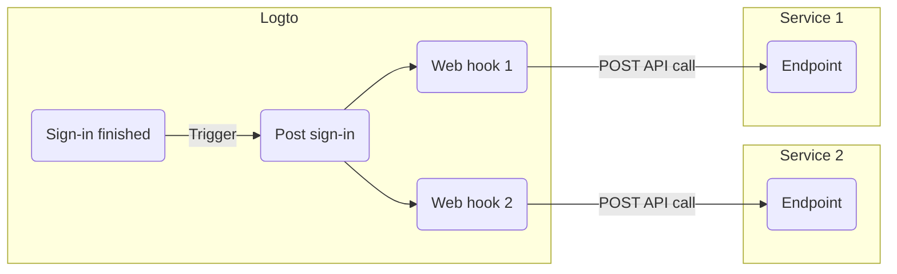

## FAQs \{#faqs}


Although synced webhooks would make the user sign-in flow smoother, we don't support them yet (we will in the future). Therefore, scenarios that rely on synced webhooks currently all require different workarounds. If you have any questions, don't hesitate to contact us.


See [Manage user permission change](/authorization/global-api-resources/#optional-handle-user-permission-change) guide.


For the endpoint receiving Webhooks, it should return a 2xx response as quickly as possible to tell Logto that the Webhook has been successfully received. Since different users have vastly different processing logic for Webhooks, excessively complex tasks might take several seconds, causing the Logto Webhook to time out. Best practice is to maintain your own event queue; upon receiving the Logto Webhook, insert the event into the queue and return a 2xx response to Logto. Then let your own worker process the tasks in the queue step by step. If the worker encounters an error, handle it on your own server.


Yes, you can get IP address, user agents, etc in Webhook payload. If you need information that is not currently supported, you can create feature requests on GitHub issues, or contact us.


## Related resources \{#related-resources}


================================================================================
SOURCE: src/extraction/local-docs/lgoto/docs/integrate-logto/application-data-structure.mdx
================================================================================

---
description: Refer to key application parameters for OIDC authentication integration, including redirect URIs, endpoints, refresh tokens, backchannel logout, etc.
sidebar_position: 6
---

# Application data structure

## Introduction \{#introduction}

In Logto, an _application_ refers to a specific software program or service that is registered with the Logto platform and has been granted authorization to access user information or perform actions on behalf of a user. Applications are used to identify the source of requests made to the Logto API, as well as to manage the authentication and authorization process for users accessing those applications.

The use of applications in Logto's sign-in experience allows users to easily access and manage their authorized applications from a single location, with a consistent and secure authentication process. This helps to streamline the user experience and ensure that only authorized individuals are accessing sensitive information or performing actions on behalf of the organization.

Applications are also used in Logto's audit logs to track user activity and identify any potential security threats or breaches. By associating specific actions with a particular application, Logto can provide detailed insights into how data is being accessed and used, allowing organizations to better manage their security and compliance requirements.
If you want to integrate your application with Logto, see [Integrate Logto](/integrate-logto).

## Properties \{#properties}

### Application ID \{#application-id}

_Application ID_ is a unique auto-generated key to identify your application in Logto, and is referenced as [client id](https://www.oauth.com/oauth2-servers/client-registration/client-id-secret/) in OAuth 2.0.

### Application types \{#application-types}

An _Application_ can be one of the following application types:

- **Native app** is an app that runs in a native environment. E.g., iOS app, Android app.
  - **Device flow app** is a special type of native app for input-limited devices or headless applications (e.g., smart TVs, game consoles, CLI tools, IoT devices). It uses the [OAuth 2.0 Device Authorization Grant](https://auth.wiki/device-flow) instead of the standard redirect-based flow. See [Device flow quick start](/quick-starts/device-flow) for details.
- **Single page app** is an app that runs in a web browser, which updates the page with the new data from the server without loading entire new pages. E.g., React DOM app, Vue app.
- **Traditional web app** is an app that renders and updates pages by the web server alone. E.g., JSP, PHP.
- **Machine-to-machine (M2M) app** is an application that runs in a machine environment for direct service-to-service communication without user interaction.

### Application secret \{#application-secret}

_Application secret_ is a key used to authenticate the application in the authentication system, specifically for private clients (Traditional Web and M2M apps) as a private security barrier.

:::tip
Single Page Apps (SPAs) and Native apps don't provide App secret. SPAs and Native apps are "public clients" and cannot keep secrets (browser code or app bundles are inspectable). Instead of an app secret, Logto protects them with PKCE, strict redirect URI/CORS validation, short-lived access tokens, and refresh-token rotation.
:::

### Application name \{#application-name}

_Application name_ is a human-readable name of the application and will be displayed in the admin console.

The _Application name_ is an important component of managing applications in Logto, as it allows administrators to easily identify and track the activity of individual applications within the platform.

:::note
It's important to note that the _Application name_ should be chosen carefully, as it will be visible to all users who have access to the admin console. It should accurately reflect the purpose and function of the application, while also being easy to understand and recognize.
:::

### Description \{#description}

A brief description of the application will be displayed on the admin console application details page. The description is intended to provide administrators with additional information about the application, such as its purpose, functionality, and any other relevant details.

### Redirect URIs \{#redirect-uris}

_Redirect URIs_ that are a list of valid redirect URIs that have been pre-configured for an application. When a user signs in to Logto and attempts to access the application, they are redirected to one of the allowed URIs specified in the application settings.

The allowed URIs list is used to validate the redirect URI that is included in the authorization request sent by the application to Logto during the authentication process. If the redirect URI specified in the authorization request matches one of the allowed URIs in the application settings, the user is redirected to that URI after successful authentication. If the redirect URI is not on the allowed list, the user will not be redirected and the authentication process will fail.

:::note
It is important to ensure that all valid redirect URIs are added to the allowed list for an application in Logto, in order to ensure that users can successfully access the application after authentication.
:::

You can check out the [Redirection endpoint](https://datatracker.ietf.org/doc/html/rfc6749#section-3.1.2) for more information.


#### Wildcard patterns \{#wildcard-patterns}

_Availability: Single page app, Traditional web app_

Redirect URIs support wildcard patterns (`*`) for dynamic environments such as preview deployments. Wildcards can be used in the hostname and pathname components of HTTP/HTTPS URIs.

**Rules:**

- Wildcards are only permitted in the hostname and pathname
- Wildcards are not allowed in the scheme, port, query parameters, or hash fragments
- Hostname wildcards must include at least one dot (e.g., `https://*.example.com/callback`)

**Examples:**

- `https://*.example.com/callback` - matches any subdomain
- `https://preview-*.example.com/callback` - matches preview deployments
- `https://example.com/*/callback` - matches any path segment

:::caution
Wildcard redirect URIs are not standard OIDC and can increase the attack surface. Use with care and prefer exact redirect URIs whenever possible.
:::

### Post sign-out redirect URIs \{#post-sign-out-redirect-uris}

_Post sign-out redirect URIs_ are a list of valid URIs that have been pre-configured for an application to redirect the user after they have signed out from Logto.

The use of Allowed _Post Sign-out Redirect URIs_ for Logout is part of the RP-Initiated (Relying Party Initiated) Logout specification in OIDC. This specification provides a standardized method for applications to initiate a logout request for a user, which includes redirecting the user to a pre-configured endpoint after they have signed out.

When a user signs out of Logto, their session is terminated and they are redirected to one of the allowed URIs specified in the application settings. This ensures that the user is directed only to authorized and valid endpoints after they have signed out, helping to prevent unauthorized access and security risks associated with redirecting users to unknown or unverified endpoints.

You can check out the [RP-initiated logout](https://openid.net/specs/openid-connect-rpinitiated-1_0.html#RPLogout) for more information.

### CORS allowed origins \{#cors-allowed-origins}

The _CORS (Cross-origin resource sharing) allowed origins_ are a list of permitted origins from which an application can make requests to the Logto service. Any origin that is not included in the allowed list will not be able to make requests to the Logto service.

The CORS allowed origins list is used to restrict access to the Logto service from unauthorized domains, and to help prevent cross-site request forgery (CSRF) attacks. By specifying the allowed origins for an application in Logto, the service can ensure that only authorized domains are able to make requests to the service.

:::note
The allowed origins list should contain the origin where the application will be served. This ensures that requests from the application are allowed, while requests from unauthorized origins are blocked.
:::

### OpenID provider configuration endpoint \{#openid-provider-configuration-endpoint}

The endpoint for [OpenID Connect Discovery](https://openid.net/specs/openid-connect-discovery-1_0.html#ProviderConfigurationRequest).

### Authorization endpoint \{#authorization-endpoint}

_Authorization Endpoint_ is an OIDC term, and it is a required endpoint that is used to initiate the authentication process for a user. When a user attempts to access a protected resource or application hat has been registered with the Logto platform, they will be redirected to the _Authorization Endpoint_ to authenticate their identity and obtain authorization to access the requested resource.

You can check out the [Authorization Endpoint](https://openid.net/specs/openid-connect-core-1_0.html#AuthorizationEndpoint) for more information.

### Token endpoint \{#token-endpoint}

_Token Endpoint_ is an OIDC term, it is a web API endpoint that is used by an OIDC client to obtain an access token, an ID token, or a refresh token from an OIDC provider.

When an OIDC client needs to obtain an access token or ID token, it sends a request to the Token Endpoint with an authorization grant, which is typically an authorization code or a refresh token. The Token Endpoint then validates the authorization grant and issues an access token or ID token to the client if the grant is valid.

You can check out the [Token Endpoint](https://openid.net/specs/openid-connect-core-1_0.html#TokenEndpoint) for more information.

### Userinfo endpoint \{#userinfo-endpoint}

The OpenID Connect [UserInfo Endpoint](https://openid.net/specs/openid-connect-core-1_0.html#UserInfo).

### Always issue refresh token \{#always-issue-refresh-token}

_Availability: Traditional web, SPA_

When enabled, Logto will always issue refresh tokens, regardless of whether `prompt=consent` is presented in the authentication request, nor `offline_access` is presented in the scopes.

However, this practice is discouraged unless necessary (usually it's useful for some third-party OAuth integrations that require refresh token), as it is not compatible with OpenID Connect and may potentially cause issues.

### Rotate refresh token \{#rotate-refresh-token}

_Default: `true`_

When enabled, Logto will issue a new refresh token for token requests under the following conditions:

- If the refresh token has been rotated (have its TTL prolonged by issuing a new one) for one year; **OR**
- If the refresh token is close to its expiration time (>=70% of its original Time to Live (TTL) passed); **OR**
- If the client is a public client, e.g. Native application or single page application (SPA).

:::note
For public clients, when this feature is enabled, a new refresh token will always be issued when the client is exchanging for a new access token using the refresh token.
Although you can still turn off the feature for those public clients, it is highly recommended to keep it enabled for security reasons.
:::


### Refresh token time-to-live (TTL) in days \{#refresh-token-time-to-live-ttl-in-days}

_Availability: Not SPA; Default: 14 days_

The duration for which a refresh token can be used to request new access tokens before it expires and becomes invalid. Token requests will extend the TTL of the refresh token to this value.

Typically, a lower value is preferred.

Note: TTL refreshment is unavailable in SPA (single page app) for security reasons. This means Logto will not extend the TTL through token requests. To enhance the user experience, you can enable the "Rotate refresh token" feature, allowing Logto to issue a new refresh token when necessary.

:::caution Refresh token and session binding
When a refresh token is issued **without** the `offline_access` scope in the authorization request, it will be bound to the user session. The session has a fixed TTL of **14 days**. After the session expires, the refresh token becomes invalid regardless of its own TTL setting.

To ensure the refresh token TTL setting takes full effect, make sure to include the `offline_access` scope in your authorization request.
:::

### Backchannel logout URI \{#backchannel-logout-uri}

The OpenID Connect backchannel logout endpoint. See [Federated sign-out: Back-channel logout](#) for more information.

### Custom data \{#custom-data}

Additional custom application info not listed in the pre-defined application properties, users can define their own custom data fields according to their specific needs, such as business-specific settings and configurations.


================================================================================
SOURCE: src/extraction/local-docs/lgoto/docs/integrate-logto/README.mdx
================================================================================

---
description: Easily integrate authentication into your applications, service as IdP to authorize OAuth apps, and utilize auth APIs, all with federated identity.
sidebar_label: Integrate Logto
---


# Integrate Logto authentication

:::tip[Use AI to integrate (Logto Cloud)]
If you're using AI-powered development tools, try [Logto MCP Server](/logto-cloud/logto-mcp-server) to integrate Logto with the help of AI. It detects your framework, creates applications, and generates working code.
:::

Logto provides comprehensive authentication solutions for web, mobile and desktop applications, supports [Machine-to-Machine (M2M)](/quick-starts/m2m) authentication between services, [device flow](/quick-starts/device-flow) for input-limited devices, and can serve as an Identity Provider (IdP) for [third-party applications](/integrate-logto/third-party-applications) through standard protocols like [OpenID Connect(OIDC)](https://auth.wiki/openid-connect) and [OAuth 2.0](https://auth.wiki/oauth-2.0).

Start your integration by selecting the solution that best matches your needs:

## Add authentication for your applications \{#add-authentication-for-your-applications}

Whether you're building user-facing applications (like web, mobile, or desktop apps) or machine-to-machine (M2M) applications for service-to-service communication, you can quickly implement comprehensive [authentication](/end-user-flows) and [user management](/user-management) features by integrating Logto.

Built on OIDC standards, Logto enables **Omni sign-in** across all your applications. When you integrate multiple applications with Logto, they share the same identity system and authentication methods. This means users can sign in once and seamlessly access all your connected applications with a unified authentication experience.

Find integration guides for your preferred framework or programming language:


================================================================================
SOURCE: src/extraction/local-docs/lgoto/docs/integrate-logto/protected-app.mdx
================================================================================

---
description: Easily add no-code authentication to your web apps with Logto’s innovative Protected App, powered by Cloudflare. Supports HTTP Basic Authentication and JWT validation.
sidebar_label: Protected App
sidebar_position: 2
---

# Protected App — Non-SDK authentication integration

The Protected App is designed to eliminate the complexity of [SDK integrations](/quick-starts) by separating the [authentication](https://auth.wiki/authentication) layer from your application. We handle the authentication, allowing you to focus on your core functionality. Once a user is authenticated, the Protected App serves the content from your server.

## How Protected App works \{#how-protected-app-works}

The Protected App, powered by Cloudflare, operates globally on edge networks, ensuring low latency and high availability for your application.

The Protected App maintains session state and user information. If a user is not authenticated, the Protected App redirects them to the sign-in page. Once authenticated, the Protected App wraps the user's request with authentication and user information, then forwards it to the origin server.

This process is visualized in the following flowchart:

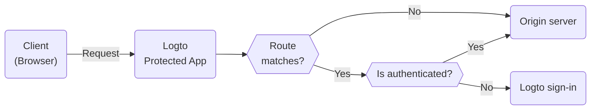

## Protect your origin server \{#protect-your-origin-server}

The origin server, which could be either a physical or virtual device not owned by Logto's Protected App, is where your application content resides. Similar to a Content Delivery Network (CDN) server, the Protected App manages authentication processes and retrieves content from your origin server. Therefore, if users gain direct access to your origin server, they can bypass the authentication and your application is no longer protected.

So it is important to secure origin connections, it prevents attackers from discovering and access your origin server without authentication. There are several ways to do this:

1. HTTP Header Validation
2. JSON Web Tokens (JWT) Validation

### HTTP Header Validation \{#http-header-validation}

Securing your origin server can be achieved using [HTTP Basic Authentication](https://developer.mozilla.org/en-US/docs/Web/HTTP/Authentication#basic_authentication_scheme) to secure your origin server.

Each request from the Protected App includes the following header:

```
Authorization: Basic base64(appId:appSecret)
```

By validating this header, you can confirm the request comes from the Protected App and deny any requests that do not include this header.

If you're using Nginx or Apache, you can refer to the following guides to implement HTTP Basic Authentication on your origin server:

1. Nginx: [Configuring HTTP Basic Authentication](https://docs.nginx.com/nginx/admin-guide/security-controls/configuring-http-basic-authentication/)
2. Apache: [Authentication and Authorization](https://httpd.apache.org/docs/2.4/howto/auth.html)

To check the headers within your application, refer to the [HTTP Basic Authentication example](https://developers.cloudflare.com/workers/examples/basic-auth/) provided by Cloudflare to learn how to restrict access using the HTTP Basic schema.

### JSON Web Tokens (JWT) Validation \{#json-web-tokens-jwt-validation}

Another way to secure your origin server is by using JSON Web Tokens (JWT).

Each authed request from the Protected App includes the following header:

```
Logto-ID-Token: <JWT>
```

The JWT is called [ID Token](https://auth.wiki/id-token) which is signed by Logto and contains user information. By validating this JWT, you can confirm the request comes from the Protected App and deny any requests that do not include this header.

The token is encrypted and signed as a [JWS](https://auth.wiki/jws) token.

The validation steps:

1. [Validating a JWT](https://datatracker.ietf.org/doc/html/rfc7519#section-7.2)
2. [Validating the JWS signature](https://datatracker.ietf.org/doc/html/rfc7515#section-5.2)
3. The token's issuer is `https://<your-logto-domain>/oidc` (issued by your Logto auth server)

```js
const express = require('express');
const jwksClient = require('jwks-rsa');
const jwt = require('jsonwebtoken');

const ISSUER = 'https://<your-logto-domain>/oidc';
const CERTS_URL = 'https://<your-logto-domain>/oidc/jwks';

const client = jwksClient({
  jwksUri: CERTS_URL,
});

const getKey = (header, callback) => {
  client.getSigningKey(header.kid, function (err, key) {
    callback(err, key?.getPublicKey());
  });
};

const verifyToken = (req, res, next) => {
  const token = req.headers['Logto-ID-Token'];

  // Make sure that the incoming request has our token header
  if (!token) {
    return res
      .status(403)
      .send({ status: false, message: 'missing required Logto-ID-Token header' });
  }

  jwt.verify(token, getKey, { issuer: ISSUER }, (err, decoded) => {
    if (err) {
      return res.status(403).send({ status: false, message: 'invalid id token' });
    }

    req.user = decoded;
    next();
  });
};

const app = express();

app.use(verifyToken);

app.get('/', (req, res) => {
  res.send('Hello World!');
});

app.listen(3000);
```

## Get authentication state and user information \{#get-authentication-state-and-user-information}

If you need to get authentication and user information for your application, you can also use the `Logto-ID-Token` header.

If you only want to decode the token, you can use the following code:

```js
const express = require('express');

const decodeIdToken = (req, res, next) => {
  const token = req.headers['Logto-ID-Token'];

  if (!token) {
    return res.status(403).send({
      status: false,
      message: 'missing required Logto-ID-Token header',
    });
  }

  const parts = token.split('.');
  if (parts.length !== 3) {
    throw new Error('Invalid ID token');
  }

  const payload = parts[1];
  const decodedPayload = atob(payload.replace(/-/g, '+').replace(/_/g, '/'));
  const claims = JSON.parse(decodedPayload);

  req.user = claims;
  next();
};

const app = express();

app.use(decodeIdToken);

app.get('/', (req, res) => {
  res.json(req.user);
});

app.listen(3000);
```

## Get the original host \{#get-the-original-host}

If you need to get the original host requested by the client, you can use the `Logto-Host` or `x-forwarded-host` header.

## Customize authentication rules \{#customize-authentication-rules}

By default, the Protected App will protect all routes. If you need to customize the authentication rules, you can set the "Custom authentication rules" field in Console.

It supports regular expressions, here are two case scenarios:

1. To only protect routes `/admin` and `/privacy` with authentication: `^/(admin|privacy)/.*`
2. To exclude JPG images from authentication: `^(?!.*\.jpg$).*$`

## Local development \{#local-development}

The Protected App is designed to work with your origin server. However, if your origin server is not publicly accessible, you can use a tool like [ngrok](https://ngrok.com/) or [Cloudflare Tunnels](https://developers.cloudflare.com/pages/how-to/preview-with-cloudflare-tunnel/) to expose your local server to the internet.

## Transition to SDK integration \{#transition-to-sdk-integration}

The Protected App is designed to simplify the authentication process. However, if you decide to transition to SDK integration for better control and customization, you can [create a new application](/integrate-logto/integrate-logto-into-your-application) in Logto and configure the [SDK integration](/quick-starts). And for a smooth transition, you can reuse the application configs from the Protected App. The Protected App is actually a "Traditional Web App" in Logto, you can find the "[AppId](/integrate-logto/application-data-structure#application-id)" and "[AppSecret](/integrate-logto/application-data-structure#application-secret)" in the application settings. After the transition is complete, you can remove the Protected App from your application.

## Related resources \{#related-resources}


================================================================================
SOURCE: src/extraction/local-docs/lgoto/docs/integrate-logto/third-party-applications/consent-screen-branding.mdx
================================================================================

---
description: Customize app branding, terms, and privacy displayed on the OAuth consent screen to build user trust and improve authorization.
sidebar_label: Consent screen branding
sidebar_position: 2
---

# Custom consent screen branding

It is important to ensure the third-party's branding information and terms link is properly displayed to the users when they are redirected to the third-party application's consent screen.

Logto allows you to customize the branding information of your third-party applications, including the application name, logo, and terms link.

## Customize the branding information \{#customize-the-branding-information}

Make sure to well configure the branding information of your third-party applications to ensure a consistent and secure authentication experience for your users.

1. Go to the <CloudLink to="/applications/third-party-applications">Console > Application > Third-party apps</CloudLink> and open the details page for a specific OIDC third-party application.

2. Navigate to the **Branding** tab.

3. Configure the display information for the consent screen:

- **Display name**: The name of the third-party application that will be displayed on the consent screen. It will represent the third-party application's name who is requesting access to your users' information. **Application name** will be used if this field is left empty.
- **App logo (Light)**: The logo of the third-party application that will be displayed on the consent screen. It will represent the third-party application's brand who is requesting access to your users' information. Both third-party application's logo and your universal sign-in-experience logo will be displayed on the consent screen if both are provided.
- **App logo (Dark)**: Only available when dark-mode sign-in experience is enabled. Manage the dark-mode settings at the <CloudLink to="/sign-in-experience/branding">Console > Sign-in & account > Branding</CloudLink> page.
- **Terms of use URL**: The terms link of the third-party application that will be displayed on the consent screen.
- **Privacy policy URL**: The privacy link of the third-party application that will be displayed on the consent screen.


================================================================================
SOURCE: src/extraction/local-docs/lgoto/docs/integrate-logto/third-party-applications/README.mdx
================================================================================

---
description: Use Logto to create your own Identity Provider and enable SSO for third-party applications. Effortlessly integrate OIDC / OAuth application.
sidebar_position: 4
---


# Third-party app (OAuth / OIDC)

Logto's third-party application integration enables you to leverage Logto as an [Identity Provider (IdP)](https://auth.wiki/identity-provider) for external applications.

An Identity Provider (IdP) is a service that verifies user identities and manages their login credentials. After confirming a user's identity, the IdP generates authentication tokens or assertions and allows the user to access various applications or services without needing to log in again.

Unlike the applications you created in the [Integrate Logto into your application](/integrate-logto/integrate-logto-into-your-application) guide that are developed and fully controlled by you, third-party applications are independent services developed by external developers or business partners.

This integration approach is well-suited for common business scenarios. You can enable users to access partner applications using their Logto accounts, just like how enterprise users sign in to Slack with Google Workspace. You can also build an open platform where third-party applications can add "Sign in with Logto" functionality, similar to "Sign in with Google."

Logto is an identity service built on the [OpenID Connect (OIDC)](https://auth.wiki/openid-connect) protocol, providing both [authentication](https://auth.wiki/authentication) and [authorization](https://auth.wiki/authorization) capabilities. This make integrating an OIDC third-party app as straightforward as traditional web application.

Thus due to OIDC builds upon [OAuth 2.0](https://auth.wiki/oauth-2.0) adding an authentication layer, you can also integrate third-party app using OAuth protocol.

## Create a third-party application in Logto \{#create-a-third-party-application-in-logto}

1. Go to <CloudLink to="/applications">Console > Applications</CloudLink>.
2. Click on the "Create application" button. Select "Third-party app" as the application type and choose one of the following integration protocols:
   - OIDC / OAuth
3. Select an application type based on the third-party application's type:
   - **Traditional Web**: Server-rendered applications (e.g., Node.js, PHP, Java) that can securely store a client secret on the backend.
   - **Single Page App (SPA)**: Client-side rendered applications (e.g., React, Vue, Angular) that run entirely in the browser and cannot securely store secrets.
   - **Native**: Mobile or desktop applications (e.g., iOS, Android, Electron) that run on user devices.
4. Enter a name and description for your application and click on the "Create" button. A new third-party application will be created.

All created third-party applications will be catalogued on the Applications page under the "Third-party apps" tab. This arrangement helps you distinguish them from your own applications, making it easier to manage all your applications in one place.

## Integration guide \{#integration-guide}

### Find the application configurations \{#find-the-application-configurations}

On the application details page, you can find the [**Client ID**](/integrate-logto/application-data-structure#application-id), [**Client secret**](/integrate-logto/application-data-structure#application-secret) (for traditional web apps only), and OIDC endpoints needed for integration.

If the third-party service supports OIDC discovery, simply provide the **Discovery endpoint**. Otherwise, click **Show endpoint details** to view all endpoints including [authorization endpoint](/integrate-logto/application-data-structure#authorization-endpoint) and [token endpoint](/integrate-logto/application-data-structure#token-endpoint).

### Integrate with services that support third-party IdP \{#integrate-with-services-that-support-third-party-idp}

If you're connecting a service or product that natively supports external identity provider configuration (e.g., enterprise SaaS platforms, collaboration tools), the setup is straightforward:

1. Open the service's IdP or SSO configuration page.
2. Copy the **Client ID** (and **Client secret** if required) from Logto and paste them into the service's configuration.
3. Provide the **Discovery endpoint** if the service supports OIDC auto-discovery, or manually copy the **Authorization endpoint** and **Token endpoint**.
4. Copy the **Redirect URI** from the service's configuration page and add it to your Logto application's allowed redirect URIs.
5. Configure the **scopes** if the service allows. Since Logto is an OIDC provider, include the `openid` scope if you need to authenticate users (grants access to an ID token and the UserInfo endpoint). The `openid` scope is optional if you only need OAuth resource access.

The service will handle the OAuth / OIDC flow automatically once configured.

### Integrate via OAuth / OIDC protocol \{#integrate-via-oauth-protocol}

If a third-party application needs to integrate with Logto as an IdP programmatically, it should implement the standard [Authorization Code Flow](https://auth.wiki/authorization-code-flow). We recommend using an OAuth 2.0 / OIDC client library for your programming language to handle the implementation.


### Integrate via device flow \{#integrate-via-device-flow}

For native third-party applications running on input-limited devices (e.g., smart TVs, game consoles, CLI tools), the standard redirect-based authorization code flow may not be feasible. In these cases, the application can use the [OAuth 2.0 Device Authorization Grant](https://auth.wiki/device-flow) instead.

With device flow, the device displays a user code and a verification URL. The user visits the URL on a separate device (phone, laptop), enters the code, and completes authentication there. The device polls Logto's token endpoint until the authorization is complete.

:::note
Before implementing device flow, make sure to configure the required [permissions](/integrate-logto/third-party-applications/permission-management) for your third-party application in the Logto Console. Third-party apps requesting non-enabled scopes will be denied access.
:::

See the [Device flow quick start](/quick-starts/device-flow) for full implementation details.

## Consent screen for OIDC third-party applications \{#consent-screen-for-oidc-third-party-applications}

For security reasons, all the OIDC third-party applications will be redirected to a [consent screen](/end-user-flows/consent-screen) for user authorization after they are authenticated by Logto.

All the third-party requested [user profile permissions](/integrate-logto/third-party-applications/permission-management#user-permissions-user-profile-scopes), [API resource scopes](/integrate-logto/third-party-applications/permission-management#api-resource-permissions-api-resource-scopes), [organization permissions](/integrate-logto/third-party-applications/permission-management#organization-permissions-organization-scopes), and organization membership information will be displayed on the consent screen.

These requested permissions will be granted to the third-party applications only after the user clicks on the "Authorize" button.


## Further actions \{#further-actions}


Logto uses Role-Based Access Control (RBAC) to manage user permissions. On the consent screen, only scopes (permissions) already assigned to the user—through their roles—will be displayed. If a third-party app requests scopes the user doesn’t have, those will be excluded to prevent unauthorized consent.

To manage this:

- Define [global roles](/authorization/role-based-access-control) or [organization roles](/authorization/organization-template) with specific scopes.
- Assign roles to users based on their access needs.
- Users will inherit scopes from their roles automatically.


## Related resources \{#related-resources}


================================================================================
SOURCE: src/extraction/local-docs/lgoto/docs/integrate-logto/third-party-applications/permission-management.mdx
================================================================================

---
description: Choose app authorization scopes (permissions) and ensure they are clearly shown on the OAuth consent screen.
sidebar_label: Permission management
sidebar_position: 1
---

# Permission management of the OIDC / OAuth application

Third-party applications, not owned by your service, are integrated with Logto as identity providers to authenticate users. These apps, typically from external service providers, require careful permission management to protect user data.

Logto empowers you to control the specific permissions granted to third-party applications. This includes managing [user profile](#user-permissions-user-profile-scopes), [API resource](#api-resource-permissions-api-resource-scopes), and [organization scopes](#organization-permissions-organization-scopes). Unlike first-party apps, third-party apps requesting unauthorized scopes will be denied access.

By enabling specific scopes, you determine which user information third-party apps can access. Users will review and approve these permissions on the consent screen before granting access.

## Manage the permissions of your OIDC third-party applications \{#manage-the-permissions-of-your-oidc-third-party-applications}

Go to the <CloudLink to="/applications">Console > Applications > Application details page</CloudLink> of your OIDC third-party application and navigate to the **Permissions** tab and click on the **Add permissions** button to manage the permissions of your third-party applications.

Basic user data is always required for third-party app requests. Additionally, Logto supports assigning organization resources, making it ideal for B2B services.

### Grant permissions of user data \{#grant-permissions-of-user-data}

Assign user-level permissions, including [user profile permissions](#user-permissions-user-profile-scopes) (e.g., email, name, and avatar) and [API resources permissions](#api-resource-permissions-api-resource-scopes) (e.g., read or write access to specific resources).

The names of the requested resources (e.g., Personal user data, API name) and specific permission descriptions (e.g., Your email address) will appear on the consent screen for users to review.

By clicking the **Authorize** button, users agree to grant the specified permissions to the third-party application.


### Grant permissions of organization data \{#grant-permissions-of-organization-data}

Assign organization-level permissions, including [organization permissions](#organization-permissions-organization-scopes) and [API resources permissions](#api-resource-permissions-api-resource-scopes). Logto allows API resources to be assigned to specific organization roles.

On the consent screen, organization data is displayed separately from user data. During the authorization flow, user must select a specific organization to grant access. Users can switch between organizations before confirming. The third-party application will only receive access to the selected organization's data and associated permissions.


## Permissions types \{#permissions-types}

### User permissions (User profile scopes) \{#user-permissions-user-profile-scopes}

Those permissions are OIDC standard and Logto's essential user profile scopes used for accessing user claims. User claims will be returned in the ID token and userinfo endpoint accordingly.

- `profile`: OIDC standard scope, used for accessing user name and avatar.
- `email`: OIDC standard scope, used for accessing user email.
- `phone`: OIDC standard scope, used for accessing user phone number.
- `custom_data`: Logto user profile scope, used for accessing [user custom data](/user-management/user-data/#custom-data).
- `identity`: Logto user profile scope, used for accessing user linked [social identities](/user-management/user-data/#social-identities) information.
- `role`: Logto user profile scope, used for accessing user [role](/authorization/role-based-access-control) information.
- `urn:logto:scope:organizations`: Logto user organization scope, used for accessing user organizations information. If enabled and requested by a third-party application, an organization selector will be displayed on the consent screen. This allows users to review and choose the organization they wish to grant access to. See [organizations](/organizations) for more details.
- `urn:logto:scope:organization_roles`: Logto user organization scope, used for accessing user organization roles information.

:::warning
Requesting a non-enabled user profile scope in the authorization request will result in an error.
:::

### API resource permissions (API resource scopes) \{#api-resource-permissions-api-resource-scopes}

Logto provides role-base access control (RBAC) for API resources. API resources are the resources that are owned by your service and are protected by Logto. You may assign self-define API scopes to the third-party applications to access your API resources. Please refer to [Authorization](/authorization) for more details.

You may create and manage your API resource scopes under the <CloudLink to="/api-resources">Console > API resources</CloudLink>.

:::warning
API resource scopes that are not enabled to the third-party applications will be ignored when sending an authorization request. It won't be displayed on the user consent screen and won't be granted by Logto.
:::

### Organization permissions (Organization scopes) \{#organization-permissions-organization-scopes}

[Organization permissions](/authorization/organization-template) are the scopes that defined exclusively for Logto organizations. They are used for accessing organization information and resources.

:::note
In order to use Logto organization permissions, you need to enable the `urn:logto:scope:organizations` user scope. Otherwise the organization permissions will be ignored when sending an authorization request.
:::

You can define your own organization scopes under the organization template settings page. Please see [Organization template](/authorization/organization-template) for more details.

:::warning
Organization scopes that are not enabled to the third-party applications will be ignored when sending an authorization request. It won't be displayed on the user consent screen and won't be granted by Logto.
:::

### Default OIDC permissions \{#default-oidc-permissions}

Core OIDC permissions are automatically configured for your app. These scopes are required for OIDC authentication and will **not** appear on the user consent screen. OAuth apps can choose not to request them if OIDC authentication isn’t needed.

1. `openid`: Required for OIDC authentication (optional for pure OAuth). Grants an ID token and access to the `userinfo_endpoint`.

2. `offline_access`: Optional. Retrieves [refresh tokens](/integrate-logto/application-data-structure#rotate-refresh-token) for long-lived access or background tasks.


================================================================================
SOURCE: src/extraction/local-docs/lgoto/docs/integrate-logto/integrate-logto-into-your-application/README.mdx
================================================================================

---
description: Integrate application authentication and identity federation in minutes with our quickstart guides.
sidebar_position: 1
---

# Integrate Logto into your application

Follow these steps to add authentication to your applications with Logto, whether it's a user-facing app or machine-to-machine service:

1. Navigate to <CloudLink to="/applications">Console > Applications</CloudLink>

2. Click "Create application" to add a new application

3. Choose your [application framework](/quick-starts) to begin. If you can't find your framework, click the "Create app without framework" button in the bottom right of the application creation page to create an app by selecting an [Application type](/integrate-logto/application-data-structure/#application-types) or file a feature request or contribute a SDK by following our [SDK conventions](/developers/sdk-conventions).

4. After selecting your framework, you'll see a quick start guide for the framework's SDK. Follow the steps to configure and integrate your application. If you need help understanding the concepts involved in the integration process, you can refer to [Understanding Logto authentication flow](/integrate-logto/integrate-logto-into-your-application/understand-authentication-flow/) for a deeper understanding of the integration.

:::note
The guide in the console is only for quick start with Logto using our SDK. For complete integration guides, including advanced SDK usage, check out [Quick starts](/quick-starts) section.

The quick start guide primarily demonstrates how to implement sign-in. If you need to directly navigate to the registration, the forgot password, or specific authentication methods like email sign-up or social sign-in, refer to the [Authentication parameters](/end-user-flows/authentication-parameters) documentation.
:::

5. Once completed, you're ready to explore more about Logto:

To securely validate access tokens in your backend API (e.g., Python, Node.js, Go, Java, PHP, etc.), and to programmatically manage users, please refer to the guide: [How to validate access tokens in your API service or backend](/authorization/validate-access-tokens).

This documentation covers:

- How to check the validity of bearer tokens in every API call
- Best practices for integrating Logto with multiple frontend apps and a backend service


## Related resources \{#related-resources}


================================================================================
SOURCE: src/extraction/local-docs/lgoto/docs/integrate-logto/interact-with-management-api/README.mdx
================================================================================

---
description: Utilize Management APIs to access Logto’s backend services, scaling your CIAM system with user management, account settings, identity verification, and multi-tenant architecture.
sidebar_position: 5
---


# Interact with Management API

## What is Logto Management API? \{#what-is-logto-management-api}

The Logto Management API is a comprehensive set of APIs that gives developers full control over their implementation to suit their product needs and tech stack. It is pre-built, listed in the <CloudLink to="/api-resources">Console > API resources > Logto Management API</CloudLink>, and cannot be deleted or modified.

Its identifier is in the pattern of `https://[tenant-id].logto.app/api`

:::note

The Logto Management API identifier differs between [Logto Cloud](/logto-cloud) and the [Logto Open Source](/logto-oss) version:

- Logto Cloud: `https://[tenant-id].logto.app/api`
- Logto OSS: `https://default.logto.app/api`

In the following examples, we’ll use the Cloud version identifier.

:::


With the Logto Management API, you can access Logto's robust backend services, which are highly scalable and can be utilized in a multitude of scenarios. It goes beyond what's possible with the Admin Console's low-code capabilities.

Some frequently used APIs are listed below:

- [User](https://openapi.logto.io/operation/operation-getuser)
- [Application](https://openapi.logto.io/operation/operation-listapplications)
- [Audit logs](https://openapi.logto.io/operation/operation-listlogs)
- [Roles](https://openapi.logto.io/operation/operation-listroles)
- [Resources](https://openapi.logto.io/operation/operation-listresources)
- [Connectors](https://openapi.logto.io/operation/operation-listconnectors)
- [Organizations](https://openapi.logto.io/operation/operation-listorganizations)

To learn more about the APIs that are available, please visit https://openapi.logto.io/.

## How to access Logto Management API \{#how-to-access-logto-management-api}

### Create an M2M app \{#create-an-m2m-app}

:::note
If you're not familiar with M2M (Machine-to-Machine) authentication flow, we recommend reading [Understanding authentication flow](/integrate-logto/integrate-logto-into-your-application/understand-authentication-flow/#machine-to-machine-authentication-flow) first to understand the basic concepts.
:::

Go to <CloudLink to="/applications">Console > Applications</CloudLink>, select the "Machine-to-machine" application type and start the creation process.


In the role assignment module, you can see all M2M roles are included, and roles indicated by a Logto icon means that these roles include Logto Management API permissions.

Now assign M2M roles include Logto Management API permissions for your M2M app.

### Fetch an access token \{#fetch-an-access-token}

#### Basics about access token request \{#basics-about-access-token-request}


#### Fetch access token for Logto Management API \{#fetch-access-token-for-logto-management-api}


### Access Logto Management API using access token \{#access-logto-management-api-using-access-token}


## Typical scenarios for using Logto Management API \{#typical-scenarios-for-using-logto-management-api}

Our developers have implemented many additional features using Logto Management API. We believe that our API is highly scalable and can support a wide range of your needs. Here are a few examples of scenarios that are not possible with the Logto Admin Console but can be achieved through the Logto Management API.

### Implement user profile on your own \{#implement-user-profile-on-your-own}

Logto currently does not provide a pre-built UI solution for user profiles. We recognize that user profiles are closely tied to business and product attributes. While we work on determining the best approach, we suggest using our APIs to create your own solution. For instance, you can utilize our interaction API, profile API, and verification code API to develop a custom solution that meets your needs.

### Advanced user search \{#advanced-user-search}

The Logto Admin Console supports basic search and filtering functions. For advanced search options like fuzzy search, exact match, and case sensitivity, check out our [Advanced User Search](/user-management/advanced-user-search) tutorials and guides.

### Implement organization management on your own \{#implement-organization-management-on-your-own}

If you’re using the [organizations](/organizations) feature to build your multi-tenant app, you might need the Logto Management API for tasks like organization invitations and member management. For your SaaS product, where you have both admins and members in the tenant, the Logto Management API can help you create a custom admin portal tailored to your business needs. Check out [this](/end-user-flows/organization-experience/) for more detail.

## Tips for using Logto Management API \{#tips-for-using-logto-management-api}

### Managing paginated API responses \{#managing-paginated-api-responses}

Some of the API responses may include many results, the results will be paginated. Logto provides 2 kinds of pagination info.

#### Using link headers \{#using-link-headers}

A paginated response header will be like:

```
Link: <https://logto.dev/users?page=1&page_size=20>; rel="first"
```

The link header provides the URL for the previous, next, first, and last page of results:

- The URL for the previous page is followed by rel="prev".
- The URL for the next page is followed by rel="next".
- The URL for the last page is followed by rel="last".
- The URL for the first page is followed by rel="first".

#### Using total-number header \{#using-total-number-header}

In addition to the standard link headers, Logto will also add a `Total-Number` header:

```
Total-Number: 216
```

That would be very convenient and useful to show page numbers.

#### Changing page number and page size \{#changing-page-number-and-page-size}

There are 2 optional query parameters:

- `page`: indicates the page number, starts from 1, the default value is 1.
- `page_size`: indicates the number of items per page, the default value is 20.

### Rate limit \{#rate-limit}

:::note
This is only for Logto Cloud.
:::

Logto Cloud applies tenant-level runtime rate limits to protect system stability. For details, see the [system limit rate-limit section](/logto-cloud/system-limit#rate-limit).

## Related resources \{#related-resources}


================================================================================
SOURCE: src/extraction/local-docs/lgoto/docs/introduction/set-up-logto-oss.mdx
================================================================================

---
description: Basic steps to configure Logto open-source and implement your identity system.
sidebar_position: 2
---

# Set up Logto OSS

This section covers basic setup steps and key actions to effectively deliver your product and manage your development workflow for [Logto open-source service (OSS)](https://github.com/logto-io/logto).

## Get started with Logto OSS \{#get-started-with-logto-oss}

Follow the [get started guide](/logto-oss/get-started-with-oss/) to launch Logto today, and later you can refer to the full [deployment guide](/logto-oss/deployment-and-configuration) for production use.

## Feature supported by Logto OSS \{#feature-supported-by-logto-oss}

Logto OSS supports most core capabilities of the Logto service and is regularly updated and maintained.

Some advanced features are currently exclusive to the Logto Cloud version, including:

| Feature limitations in OSS                                                          | Description                                                                                                                                        |
| ----------------------------------------------------------------------------------- | -------------------------------------------------------------------------------------------------------------------------------------------------- |
| [Logto console: multiple tenants](/logto-cloud/tenant-settings)                     | Create and manage multiple Logto tenants in a console.                                                                                             |
| [Logto console: collaborator invitation](/logto-cloud/tenant-member-management)     | Invite and manage multiple members of one Logto tenant.                                                                                            |
| Logto console: Enable MFA                                                           | Enhance security by requiring multi-factor authentication when signing in to the Logto Console.                                                    |
| [Logto Protected App](/integrate-logto/protected-app)                               | Quick and non-SDK authentication integration powered by Cloudflare.                                                                                |
| [Logto built-in email service](/connectors/email-connectors/built-in-email-service) | Utilize the built-in and free email service for email delivery.                                                                                    |
| [Bring your UI](/customization/bring-your-ui)                                       | Customize the UI or flows of sign-in experience using this feature (OSS can fork the code on GitHub to customize the sign-in experience directly.) |
| [IdP-initiated SSO](/end-user-flows/enterprise-sso/idp-initiated-sso)               | Enable identity provider-initiated enterprise single sign-on.                                                                                      |
| [SAML apps](/integrate-logto/saml-app)                                              | Integrate applications via the SAML protocol. OSS version is limited to 3 SAML apps.                                                               |
| [Hide Logto branding](/customization/match-your-brand#hide-logto-branding)          | Remove the "Powered by Logto" mark from the sign-in experience.                                                                                    |

Tips: Multi-tenancy, member invitations, and MFA are not available for your team to sign into an open-source Logto console. However, you can implement these features in your own product using Logto OSS, making them available to your end users.

## Stay updated with Logto releases \{#stay-updated-with-logto-releases}

To keep your Logto instance up-to-date with the latest features, be sure to follow the [Logto GitHub Releases](https://github.com/logto-io/logto/releases) page, you can find all of the release logs there.

Read the [guide on upgrading](/logto-oss/upgrading-oss-version) to learn how to upgrade Logto without changing your code or database schema.

## Contributing to Logto OSS \{#contributing-to-logto-oss}

Thank you for your interest in contributing to Logto! Here is the [contribution guideline](/logto-oss/contribution).

## Related resources \{#related-resources}


================================================================================
SOURCE: src/extraction/local-docs/lgoto/docs/introduction/README.mdx
================================================================================

---
description: Quickly launch your identity and access management system by integrating Logto. Enjoy authentication, authorization, and multi-tenant management all in one.
---


# Introduction

Welcome to Logto documentation! Logto is an identity and access management (IAM) solution that designed for modern apps and SaaS products. It provides a secure, scalable, and customizable authentication and authorization system for your applications.

## Explore by features \{#explore-by-features}


================================================================================
SOURCE: src/extraction/local-docs/lgoto/docs/introduction/set-up-logto-cloud.mdx
================================================================================

---
description: Basic steps to initiate Logto Cloud Service as your OAuth 2, OIDC, and SAML provider.
sidebar_position: 1
---

# Set up Logto Cloud

This section covers basic setup steps and key actions to effectively deliver your product and manage your development workflow.

## Create Logto tenant \{#create-logto-tenant}

First, sign up for a business and create a Logto tenant. A tenant of Logto Cloud is an isolated environment where you can manage user identities, applications, and all other Logto resources.

Your first tenant will be automatically set up as a [**Development**](/logto-cloud/tenant-settings#development) environment. This is ideal for testing and development purposes and is free to use.

Check out the tenant settings and [learn more](/logto-cloud) about Logto cloud service.

## Invite collaborators \{#invite-collaborators}

During the onboarding, you have a chance to invite collaborators to do the development work together. If would like to do more or later. Go to <CloudLink to="/tenant-settings/members">Tenant settings > Members</CloudLink>. You'll see your current members and can invite more. Enter email addresses and assign roles (you can do this in bulk) and then send.

## Move to production tenant \{#move-to-production-tenant}

You may spend some time developing and testing Logto’s capabilities and features to put together a proof of concept.

After your project completes testing and is ready for the next phase, remember to create a new [production-type tenant](/logto-cloud/tenant-settings#production) (requiring a [Free or Pro tenant](https://logto.io/pricing)). Because the dev tenant is not intended for production use due to its [limitations and constraints](/logto-cloud/tenant-settings#development).

:::note

Make sure to enter the [custom domain](/logto-cloud/custom-domain) as soon as you create a production tenant, as it will impact your next-step configuration.

:::

This setup allows your project to have both development testing and production environments, helping you manage your development workflow smoothly.

## Migrate from the existing system \{#migrate-from-the-existing-system}

If you're working on an existing project and need to switch auth providers, Logto supports user migration from other platforms. You can migrate [basic data](/user-management/user-data#basic-data), [custom data](/user-management/user-data#custom-data), [social identities](/user-management/user-data#social-identities), and password hashes. For details, see the [Migrate to Logto](../user-management/user-migration.mdx) guide.

## Use Logto MCP Server with AI tools \{#use-logto-mcp-server-with-ai-tools}

If you're using AI-powered development tools like VS Code with Copilot, Cursor, or Claude Desktop, you can connect to [Logto MCP Server](/logto-cloud/logto-mcp-server) to interact with Logto directly from your AI assistant. The AI can detect your framework, create applications, and generate working integration code for you.


================================================================================
SOURCE: src/extraction/local-docs/lgoto/docs/introduction/plan-your-architecture/b2b.mdx
================================================================================

---
description: Discover how to create a scalable multi-tenant identity system for B2B software with all AuthN and AuthZ features.
sidebar_label: B2B architecture
sidebar_position: 2
---


# Multi-tenant architecture for B2B services

## Architecture \{#architecture}

B2B apps typically use a [multi-tenant](https://auth.wiki/multi-tenancy) architecture. In these applications, users own their accounts and manage their identity and authentication, with involvement from other parties like businesses or organizations. End-user identities are often not individual consumers but employees or collaborators within a business organization.


### B2B features \{#b2b-features}


================================================================================
SOURCE: src/extraction/local-docs/lgoto/docs/introduction/plan-your-architecture/b2c.mdx
================================================================================

---
description: Discover how to create a highly secure customer identity system with all essential AuthN and AuthO features.
sidebar_label: B2C architecture
sidebar_position: 1
---


# Single-tenant architecure for B2C services

## Architecture \{#architecture}

In consumer applications, users fully own their accounts and control their identity and authentication, with no involvement from other “middle-layer” parties like businesses or organizations. This is the key distinction between B2C and B2B identity architectures.


## Build your B2C identity system \{#build-your-b2c-identity-system}


## Connect your requirements to Logto’s support toolkit \{#connect-your-requirements-to-logtos-support-toolkit}

This architecture includes two main parties involved in the management scenario. Depending on your specific needs and objectives, all or only some of these parties may be involved.

We’ve summarized common use cases, highlighting the key objectives of each user identity managing tasks and the related products and APIs we offer. You can map your needs to our services to get started quickly.

| Users              | Goal                                                                                        | Logto products and APIs                                                                                                                                          |
| ------------------ | ------------------------------------------------------------------------------------------- | ---------------------------------------------------------------------------------------------------------------------------------------------------------------- |
| Developers         | Manage and safeguard the user identity system and work directly with the identity database. | <ul><li>[Logto Console](https://cloud.logto.io)</li><li>[Logto Management API](https://openapi.logto.io/)</li></ul>                                              |
| End user/Consumers | [Manage their own authentication and personal information.](/end-user-flows)                | <ul><li>[Logto Management API](https://openapi.logto.io/)</li><li>[Account API](https://openapi.logto.io/operation/operation-getaccountcentersettings)</li></ul> |


================================================================================
SOURCE: src/extraction/local-docs/lgoto/docs/introduction/plan-your-architecture/_related-resource.mdx
================================================================================

## Related resources \{#related-resources}


================================================================================
SOURCE: src/extraction/local-docs/lgoto/docs/introduction/plan-your-architecture/README.mdx
================================================================================

---
description: Design your identity system architecture by evaluating single-tenant, multi-tenant, and multi-application options.
sidebar_position: 3
---

# Plan your architecture

To establish best practices in design and plan your architecture, consider your needs from different perspectives. Focus on the end goal and workflow, not just the underlying technologies and features. Here are some key questions to guide and inspire you in building the ideal architecture for your product.

## What is your business model, and who are the key parties and stakeholders involved? \{#what-is-your-business-model-and-who-are-the-key-parties-and-stakeholders-involved}

Generally, there are two main business models, [B2C](/introduction/plan-your-architecture/b2c) and [B2B](/introduction/plan-your-architecture/b2b), each involving different parties in complex identity management scenarios. Understanding these key stakeholders helps you design systems that deliver a user-centered experience and address all aspects of identity management.

### B2C \{#b2c}

In B2C applications, identity management is typically straightforward and usually involves just two parties.

#### Developers (You) \{#developers-you}

This refers to **Logto Console admins and collaborators** — typically you and your development team — manage and secure the user identity pool and work directly with the identity database. You can directly manage customer identities in the Logto Console or do custom development using the Logto Management API.

#### Your consumers \{#your-consumers}

Your consumers are user identities stored in Logto’s core service and database. In a B2C model, consumers can manage their own authentication and personal information.

### B2B \{#b2b}

In B2B applications, there is another layer and context introduced into this architecture. The business unit owner (or organization) controls who can access their instance, how they authenticate, and what they can do. The organization manages the identity of all end users who access their instance.

#### Developers (You) \{#developers-you-1}

This still refers to **Logto Console admins and collaborators**. Although organization admins can manage identities, developers can still directly manage customer identities in the Logto Console or through custom development using the Logto Management API.

#### Your clients (Organization admins) \{#your-clients-organization-admins}

Your clients are business units representing “organizations” in a multi-tenant app, for example, **workspaces** in Slack or Notion. Each workspace typically has multiple roles and one or more admins who manage employees or users. In the following content, we refer to people who CAN manage member identities as "organization admins."

#### Your client's staff, partners, or consumers \{#your-clients-staff-partners-or-consumers}

These are end-user identities, referred to as “members” in the organization context, and can be managed within an organization. While these identities are separated by organizations, they are all aggregated under a single identity system.

In real-world scenarios, from a product perspective, these could be company staff, business partners, or even consumers associated with the organization.

### Others \{#others}

Other models, like B2B2C, may arise from these two due to their complexity. However, the approach remains the same: all changes stem from the same core foundation.

In the next chapter, we’ll take a detailed look at these two common architectures and highlight the related features supported by Logto.

## Distill your auth needs \{#distill-your-auth-needs}

Once you understand the key users and parties involved in your tech and product design, consider the following questions to refine your identity architecture and determine your authentication needs and control level:

1. What options do customers have for authentication and the sign-in experience? These usually depend on your business, acquisition strategy, and product needs.

   _eg. What features are needed for my app? Social sign-in? Passwordless login?_

2. What level of control do you (developers) want over customer actions?

   _eg. Can customers update and maintain their profile? Can customers turn on and off MFA on their own? Can they choose preferable sign-in methods?_

3. What types of customization would you like to delegate to organizations? These depend on your product’s domain and industry and your clients’ specific needs and may vary from one organization to another.

   _eg. Should the sign-in experience vary for each organization? And if so, should the customization be limited to branding, or should it also include differences in the authentication flow?_

4. What level of control would you like your organization admins to have over their members' actions?

   _eg. Should the organization admin be able to decide if MFA is required? Should the admin have the ability to change a member’s password?_

## Do you need a single universal identity system or multiple separate ones? \{#do-you-need-a-single-universal-identity-system-or-multiple-separate-ones}

Another key questions to keep in mind is to ask yourself whether you or a segment of your business or product needs one identity system or separate.

Typically, the answer is a single universal identity system, meaning you only need one Logto tenant (or one Logto admin console instance in OSS). Logto is built to support both multiple apps and multiple organizations within a single tenant. One production Logto tenant is usually sufficient for most needs. Here are some common scenarios you might face:

### I would like to build a SaaS application with multi-tenancy \{#i-would-like-to-build-a-saas-application-with-multi-tenancy}

If you are building a SaaS application with the concept of "workspace" or "organization" for each customer, you can use organizations to manage each customer's workspace within a single tenant.

In this case, a user can be a member of multiple organizations. For example, a user can have a personal workspace and join the company's workspace.

### I have multiple applications \{#i-have-multiple-applications}

With Logto, you can manage multiple applications within a single tenant regardless of

1. The application's type (for example, web, mobile, desktop, etc.)
2. The application use cases and functionalities (for example, driver app, hailer app, etc.)

### I have multiple enterprise customers \{#i-have-multiple-enterprise-customers}

You can use organizations with enterprise SSO to manage multiple enterprise customers within a single tenant. By configuring enterprise SSO email domain settings and using the Just-in-Time provisioning feature, you can automate the process of users with enterprise SSO accounts joining or signing in to the appropriate organizations.


================================================================================
SOURCE: src/extraction/local-docs/lgoto/docs/security/blocklist.mdx
================================================================================

---
slug: /security/blocklist
sidebar_label: Blocklist
sidebar_position: 3
---

# Blocklist

## Email blocklist \{#email-blocklist}

The email blocklist policy allows customization of email blocklist settings to prevent account sign-up abuse. It monitors email addresses used for sign-up and account settings. If a user attempts to sign up or link an email address that violates any blocklist rules, the system will reject the request, helping to mitigate spam accounts and enhance overall account security.

Visit the <CloudLink to="/security/blocklist"> Console > Security > Blocklist</CloudLink> to configure the email blocklist settings.

### Block disposable email addresses \{#block-disposable-email-addresses}

This is a **cloud-only** feature. Once enabled, the system will automatically validates the domain of the provided email address against a list of known disposable email domains. If the domain is found in the list, the request will be rejected. The list of disposable email domains is regularly updated to ensure its effectiveness.

### Block email subaddressing \{#block-email-subaddressing}

Email subaddressing allows users to create variations of their email addresses by adding a plus sign (+) followed by additional characters (e.g., user+tag@example.com). This feature can be exploited by malicious users to bypass blocklist restrictions. By enabling the block email subaddressing feature, the system will reject any sign-up or account linking attempts that utilize subaddressed email formats.

### Custom email blocklist \{#custom-email-blocklist}

You can create a custom email blocklist by specifying a list of email addresses or domains to block. The system will reject any sign-up or account linking attempts that match these entries. The blocklist supports both full email address and domain matching.

For instance, adding `@example.com` to the blocklist will block all email addresses with that domain. Similarly, adding `foo@example.com` will specifically block that email address.

:::note

Disposable emails, subaddressing, and custom email are restricted during [new-user registration](/end-user-flows/sign-up-and-sign-in/sign-up), [linking email during social sign-in](/end-user-flows/sign-up-and-sign-in/social-sign-in#collect-sign-up-identifiers), and updating emails via [Account API](/end-user-flows/account-settings/by-account-api#update-or-link-new-email). Existing users with these email addresses can still sign in.

- Admins can "bypass restrictions" by manually adding users in <CloudLink to="/users">Console > User management</CloudLink>, or via [Management API](https://openapi.logto.io/operation/operation-createuser). E.g., Create an user with a subaddress email when subaddressing is blocked.
- Block existing accounts by deleting or suspending them in <CloudLink to="/users">Console > User management</CloudLink>.

:::

## Related resources \{#related-resources}


================================================================================
SOURCE: src/extraction/local-docs/lgoto/docs/security/identifier-lockout.mdx
================================================================================

---
slug: /security/identifier-lockout
sidebar_label: Identifier Lockout
sidebar_position: 4
---

# Identifier lockout

The identifier lockout policy allows you to customize your own sentinel policy settings to protect against brute force access. This policy works by monitoring authentication attempts for each identifier (such as usernames or email addresses) and implementing restrictions when suspicious activity is detected. If a user exceeds the allowed number of failed authentication attempts, the system temporarily locks the identifier, preventing further authentication attempts for a specified duration. This helps to mitigate brute-force attacks and enhances overall account security.

## Application of the policy \{#application-of-the-policy}

- **Identifier sign-in**: Password and verification code
- **Identifier sign-up**: Email/phone verification code
- **Reset password**: Email/phone verification code

## Policy settings \{#policy-settings}

By default, an identifier is locked for 60 minutes after 100 failed authentication attempts.

To customize the policy settings or manually unblock verified users, visit <CloudLink to="/security/general">Console > Security > General</CloudLink> and enable "Customize lockout experience".

Configure the following settings:

1. **Maximum failed attempts**:

   - Limit the number of consecutive failed authentication attempts per identifier within an hour. If the limit is exceeded, the identifier will be temporarily locked out.
   - **Default Value**: 100

2. **Lockout duration (minutes)**:

   - Block all authentication attempts for the given identifier for a specified period after exceeding the maximum failed attempts.
   - **Default Value**: 60 minutes

3. **Manual unblock**

   - Administrators can manually unblock users by providing a list of identifiers that need to be released from the lockout. The given identifiers must be precisely matched with the identifiers being blocked.

## Lockout webhook \{#lockout-webhook}

When an identifier is locked due to exceeding the maximum failed attempts, Logto triggers the `Identifier.Lockout` webhook event, enabling automated responses to suspicious account activity.

**Common use cases:**

- Send security alerts to your team for immediate review
- Notify users via SMS or push notification about the lockout and provide recovery instructions

Navigate to <CloudLink to="/webhooks">Console > Webhooks</CloudLink> to configure your webhook. For detailed event structure and configuration, see [Webhooks](/developers/webhooks).


================================================================================
SOURCE: src/extraction/local-docs/lgoto/docs/security/README.mdx
================================================================================


# Security

Modern authentication security battles threats ranging from phishing, credential stuffing, brute-force attacks, ransomware, DDoS, to AI-driven attacks. Protecting user identities is critical to safeguarding brand trust and compliance.

Logto delivers robust secure access management designed to counter these risks head-on. By prioritizing proactive threat prevention and resilience, we ensure your systems stay shielded without compromising usability. With Logto, security isn’t an afterthought—it’s the foundation, empowering businesses to thrive in an era where threats evolve, but defenses evolve faster.

## Set up advanced security protection \{#set-up-advanced-security-protection}


================================================================================
SOURCE: src/extraction/local-docs/lgoto/docs/security/captcha/README.md
================================================================================

---
slug: /security/captcha
sidebar_label: CAPTCHA
sidebar_position: 2
---

# CAPTCHA bot protection

CAPTCHA bot protection helps secure your user flows by verifying that users are human, significantly reducing bot attacks. Logto supports leading providers such as Google reCAPTCHA Enterprise and Cloudflare Turnstile.

:::note
CAPTCHA applies to identifier, password, verification-code, registration, and password-recovery actions. It does not apply to [magic link](/end-user-flows/one-time-token) or [passkey sign-in](/end-user-flows/sign-up-and-sign-in/passkey-sign-in), so users who complete sign-in with a magic link or passkey do not need to solve an additional CAPTCHA challenge.
:::

## Enabling CAPTCHA bot protection {#enabling-captcha-bot-protection}

Follow these steps to activate CAPTCHA for your user flows (identifier sign-in, password sign-in, registration, and password recovery):

1. **Navigate to settings**: Go to **Console > Security > Bot protection**.
2. **Select provider**: Choose your preferred CAPTCHA provider (e.g., Google reCAPTCHA Enterprise or Cloudflare Turnstile).
3. **Configuration**: Follow the instructions on the left side of the page to configure the selected CAPTCHA provider.
4. **Save**: Click **Save and done** to apply your settings.
5. **(Optional) Enable CAPTCHA**: CAPTCHA will automatically be enabled on the security page once a provider is configured. However, you can manually verify or adjust settings as needed.

## Previewing CAPTCHA integration {#previewing-captcha-integration}

You have two options to preview and test CAPTCHA integration:

1. **Use your application**: Navigate to your application's sign-in, registration, or password recovery pages and attempt the respective user actions.
2. **Demo app**: Go to **Get started** and use the provided demo application to test CAPTCHA functionality.

Ensure the CAPTCHA challenge appears as expected in either option.

## Supported providers {#supported-providers}

Currently, we support:

- **Google reCAPTCHA Enterprise**
- **Cloudflare Turnstile**


================================================================================
SOURCE: src/extraction/local-docs/lgoto/docs/security/captcha/turnstile.md
================================================================================

---
slug: /security/captcha/turnstile
sidebar_label: Cloudflare Turnstile
---

# Cloudflare Turnstile

Turnstile is a CAPTCHA service that helps protect your website from spam and abuse. This guide will walk you through the process of setting up Turnstile with Logto.

## Prerequisites {#prerequisites}

- A Cloudflare account

## Setup {#setup}

1. Go to the [Cloudflare Dashboard](https://dash.cloudflare.com/login) and select your account.
2. Navigate to **Turnstile** > **Add widget**.
3. Fill out the form with the following details:
   - **Widget name**: Any name you want to give to the widget
   - **Hostname**: Logto's endpoint domain, e.g. https://[tenant-id].logto.app
   - **Widget Mode**: Leave as default

## Get the site key and secret key {#get-the-site-key-and-secret-key}

1. Navigate to a widget you just created, and click **Manage widget**.
2. Scroll down to the bottom and copy the **Site key** and **Secret key**.

## Enable CAPTCHA {#enable-captcha}

Remember to enable CAPTCHA bot protection after you have set up the CAPTCHA provider.

Go to the Security page, find the CAPTCHA tab, and switch on the toggle button of "Enable CAPTCHA".


================================================================================
SOURCE: src/extraction/local-docs/lgoto/docs/security/captcha/recaptcha-enterprise.md
================================================================================

---
slug: /security/captcha/recaptcha-enterprise
sidebar_label: reCAPTCHA Enterprise
---

# reCAPTCHA Enterprise

reCAPTCHA Enterprise is a Google service that protects websites from fraud and abuse using advanced bot detection without disrupting user experience. This guide will walk you through the process of setting up reCAPTCHA Enterprise with Logto.

## Prerequisites {#prerequisites}

- A Google Cloud project

## Setup a reCAPTCHA key {#setup-a-recaptcha-key}

1. Go to the [reCAPTCHA page of Google Cloud Console](https://console.cloud.google.com/security/recaptcha).
2. Click **Create key** button near "reCAPTCHA keys".
3. Fill out the form with the following details:
   - **Display name**: Any name you want to give to the key
   - **Application type**: Website
   - **Domain list**: Add Logto's endpoint domain
   - **Verification type**: Choose between **Score-based (invisible)** or **Checkbox challenge**. This determines how reCAPTCHA will be displayed to users. See [Verification mode](#verification-mode) for more details.
4. After creating the key, you will be redirected to the key details page, copy the **ID**.

## Setup an API key {#setup-an-api-key}

1. Go to the [Credentials page of Google Cloud Console](https://console.cloud.google.com/apis/credentials).
2. Click **Create credentials** button and select **API key**.
3. Copy the API key.
4. Optionally, you can restrict the API key to **reCAPTCHA Enterprise API** to make it more secure.
5. Remember to leave "Application restrictions" to **None** if you don't understand what it is.

## Get project ID {#get-project-id}

1. Copy the **Project ID** from the [home page of Google Cloud Console](https://console.cloud.google.com/welcome).

## Verification mode {#verification-mode}

reCAPTCHA Enterprise supports two verification modes:

- **Invisible**: Score-based verification that runs automatically in the background without user interaction. This is the default mode.
- **Checkbox**: Displays the classic "I'm not a robot" checkbox widget that requires user interaction.

:::note
The verification mode you select in Logto must match the key type you created in Google Cloud Console. If you created a score-based key, select **Invisible**. If you created a checkbox challenge key, select **Checkbox**.
:::

## Custom domain {#custom-domain}

By default, Logto loads the reCAPTCHA script from `www.google.com`. However, in some regions where Google's standard domain is inaccessible, you can configure an alternative domain.

Supported domains:

- `www.google.com` (default)
- `recaptcha.net`

To configure a custom domain, enter the domain in the **Domain** field when setting up reCAPTCHA Enterprise in Logto Console.

## Enable CAPTCHA {#enable-captcha}

Remember to enable CAPTCHA bot protection after you have set up the CAPTCHA provider.

Go to the Security page, find the CAPTCHA tab, and switch on the toggle button of "Enable CAPTCHA".


================================================================================
SOURCE: src/extraction/local-docs/lgoto/docs/user-management/advanced-user-search.mdx
================================================================================

---
sidebar_position: 3
---

# Advanced user search

Directly using Management API to leverage advanced user search conditions.

## Perform a search request \{#perform-a-search-request}

Use [`GET /api/users`](https://openapi.logto.io/operation/operation-getuser) for searching users. Note it is a Management API that requires auth like others. See [Interact with Management API](/integrate-logto/interact-with-management-api) for the interaction recipe.

### Sample \{#sample}

**Request**

```bash
curl \
  --location \
  --request GET \
  'http://<your-logto-endpoint>/api/users?search=%25alice%25'

```

**Response**

An array of `User` entity.

```json
[
  {
    "id": "MgUzzDsyX0iB",
    "username": "alice_123",
    "primaryEmail": "alice@some.email.domain",
    "primaryPhone": null,
    "name": null,
    "avatar": null
    // ...
  }
]
```

### Parameters \{#parameters}

A search request consists of the following parameter keys:

- Search keywords: `search`, `search.*`
- Search mode for fields: `mode`, `mode.*` (default value `'like'`, available `['exact', 'like', 'similar_to', 'posix']`)
- Joint mode: `joint` or `jointMode` (default value `'or'`, available `['or', 'and']`)
- Is case-sensitive: `isCaseSensitive` (default value `false`)

This API has [pagination](/integrate-logto/interact-with-management-api/#managing-paginated-api-responses) enabled.

Let's go through them via some examples. All search params will be formatted as a constructor of `URLSearchParams`.

:::warning

Search mode is set to `like` by default, which uses [Approximate string matching](https://en.wikipedia.org/wiki/Approximate_string_matching) ("fuzzy search").

:::

:::note

All fuzzy search modes only support matching one value per field. If you need to match multiple values for a single field, you should use the "exact" mode. See [Exact match and case sensitivity](/user-management/advanced-user-search#exact-match-and-case-sensitivity) for details.

:::

### Basic fuzzy search \{#basic-fuzzy-search}

If you want to perform a fuzzy search over all available fields, just provide a value for key `search`. It will use [the `like` operator](https://www.postgresql.org/docs/current/functions-matching.html#FUNCTIONS-LIKE) under the hood:

```javascript
new URLSearchParams([['search', '%foo%']]);
```

This search will iterate over all available fields in a user search, i.e. `id`, `primaryEmail`, `primaryPhone`, `username`, `name`.

### Specify fields \{#specify-fields}

What if you want to limit the search in `name` only? To search someone that includes `foo` in their name, just use the `.` symbol to specify the field:

```javascript
new URLSearchParams([['search.name', '%foo%']]);
```

Remember nested fields are not supported, e.g. `search.name.first` will result an error.

You can also specify multiple fields at the same time:

```javascript
new URLSearchParams([
  ['search.name', '%foo%'],
  ['search.primaryEmail', '%@gmail.com'],
]);
```

Means to search users that have `foo` in name **OR** their email ends with `@gmail.com`.

### Changing the joint mode \{#changing-the-joint-mode}

If you want the API only returns the result that satisfies ALL the conditions, set the joint mode to `and`:

```javascript
new URLSearchParams([
  ['search.name', '%foo%'],
  ['search.primaryEmail', '%@gmail.com'],
  ['joint', 'and'],
]);
```

Means to search users that have `foo` in name **AND** their email ends with `@gmail.com`.

### Exact match and case sensitivity \{#exact-match-and-case-sensitivity}

Say you want to search whose name is exact "Alice". You can set `mode.name` to use exact match.

```javascript
new URLSearchParams([
  ['search.name', 'Alice'],
  ['mode.name', 'exact'],
]);
```

You may find it has the same effect when using the `like` mode (default) v.s. specifying `exact`. One difference is `exact` mode uses `=` for comparing while `like` uses `like` or `ilike`. Theoretically `=` should have a better performance.

Plus, in `exact` mode, you can pass multiple values for matching, and they will be connected with `or`:

```javascript
new URLSearchParams([
  ['search.name', 'Alice'],
  ['search.name', 'Bob'],
  ['mode.name', 'exact'],
]);
```

It will match the users with name "Alice" **OR** "Bob".

By default search is case-insensitive. To be more precise, set the search as case-sensitive:

```javascript
new URLSearchParams([
  ['search.name', 'Alice'],
  ['search.name', 'Bob'],
  ['mode.name', 'exact'],
  ['isCaseSensitive', 'true'],
]);
```

Note `isCaseSensitive` is a global config. Thus EVERY field will follow it.

### Regular expression (RegEx) \{#regular-expression-regex}

PostgreSQL supports two types of regular expressions, [similar to](https://www.postgresql.org/docs/current/functions-matching.html#FUNCTIONS-SIMILARTO-REGEXP) and [posix](https://www.postgresql.org/docs/current/functions-matching.html#FUNCTIONS-POSIX-REGEXP). Set `mode` to `similar_to` or `posix` to search by regular expressions:

```javascript
new URLSearchParams([
  ['search', '^T.?m Scot+$'],
  ['mode', 'posix'],
]);
```

> Note Mode similar_to only works in case-sensitive searches.

### Match mode override \{#match-mode-override}

By default, all keywords will inherit the match mode from the general search:

```javascript
new URLSearchParams([
  ['search', '^T.?m Scot+$'],
  ['mode', 'posix'],
  ['search.primaryEmail', 'tom%'], // Posix mode
  ['joint', 'and'],
]);
```

To override for specific field:

```javascript
new URLSearchParams([
  ['search', '^T.?m Scot+$'],
  ['mode', 'posix'],
  ['search.primaryEmail', 'tom%'], // Like mode
  ['mode.primaryEmail', 'like'],
  ['search.phone', '0{3,}'], // Posix mode
  ['joint', 'and'],
]);
```


================================================================================
SOURCE: src/extraction/local-docs/lgoto/docs/user-management/user-data.mdx
================================================================================

---
sidebar_position: 1
---

# User data structure

Users are the core entities in the identity service. In Logto, they include basic authentication data based on the [OpenID Connect](https://auth.wiki/openid-connect) protocol, along with custom data.

## User profile \{#user-profile}

Each user has a profile containing [all user information](#property-reference).

It consists of the following types of data:

- [Basic data](/user-management/user-data#basic-data): is the basic info from the user profile. It stores all other _user_'s properties except for social `identities` and `custom_data`, such as user id, username, email, phone number, and when the user last signed in.
- [Social identities](/user-management/user-data#social-identities): stores the user info retrieved from social sign-in (i.e., sign-in with a social connector), such as Facebook, GitHub, and WeChat.
- [Custom data](/user-management/user-data#custom-data): stores additional user info not listed in the pre-defined user properties, such as user-preferred color and language.

Here is a sample of a user's data which is retrieved from a sign-in to Facebook:

```json
{
  "id": "iHXPuSb9eMzt",
  "username": null,
  "primaryEmail": null,
  "primaryPhone": null,
  "name": "John Doe",
  "avatar": "https://example.com/avatar.png",
  "customData": {
    "preferences": {
      "language": "en",
      "color": "#f236c9"
    }
  },
  "identities": {
    "facebook": {
      "userId": "106077000000000",
      "details": {
        "id": "106077000000000",
        "name": "John Doe",
        "email": "johndoe@logto.io",
        "avatar": "https://example.com/avatar.png"
      }
    }
  },
  "lastSignInAt": 1655799453171,
  "applicationId": "admin_console"
}
```

You can query the user profile using <CloudLink to="/users">Logto Console</CloudLink> or Logto Management API, such as [`GET /api/users/:userId`](https://openapi.logto.io/operation/operation-getuser).

## Basic data \{#basic-data}

Let's walk through all properties in of user's _basic data_.

### id \{#id}

_id_ is a unique auto-generated key to identify the user in Logto.

### username \{#username}

_username_ is used for sign-in with _username_ and password.

Its value is from the username that the user first registered with. It may be `null`. Its non-null value should be no longer than 128 characters, only contain letters, numbers, and underscores (`_`), and NOT start with a number. It's case-sensitive.

### primary_email \{#primary_email}

_primary_email_ is the user's email address, used for sign-in with the email and password / verification code.

Its value is usually from the email address that the user first registered with. It may be `null`. Its max length is 128.

Only verified email addresses from social or enterprise SSO identity providers can be synced and saved as the `primary_email`.

### primary_phone \{#primary_phone}

_primary_phone_ is the user's phone number, used for sign-in with the phone number and password / verification code from SMS.

Its value is usually from the phone number that the user first registered with. It may be `null`. Its non-null value should contain numbers prefixed with the [country calling code](https://en.wikipedia.org/wiki/List_of_country_calling_codes) (excluding the plus sign `+`).

Only verified phone numbers from social or enterprise SSO identity providers can be synced and saved as the `primary_phone`.

### name \{#name}

_name_ is the user's full name. Its max length is 128.

### avatar \{#avatar}

_avatar_ is the URL pointing to the user's avatar image. Its max length is 2048.

If the user registers with a social connector like Google and Facebook, its value may be retrieved from the social user info.

:::note

This property is mapped to the `picture` claim in the [OpenID Connect](https://openid.net/connect/) standard.

:::

### profile \{#profile}

_profile_ stores additional OpenID Connect [standard claims](https://openid.net/specs/openid-connect-core-1_0.html#StandardClaims) that are not included in user's properties.

Its type definition can be found at [this file](https://github.com/logto-io/logto/blob/HEAD/packages/schemas/src/foundations/jsonb-types/users.ts#L6). Here's a copy of the type definition:

```tsx
type UserProfile = Partial<{
  familyName: string;
  givenName: string;
  middleName: string;
  nickname: string;
  preferredUsername: string;
  profile: string;
  website: string;
  gender: string;
  birthdate: string;
  zoneinfo: string;
  locale: string;
  address: Partial<{
    formatted: string;
    streetAddress: string;
    locality: string;
    region: string;
    postalCode: string;
    country: string;
  }>;
}>;
```

:::note

`Partial` means that all properties are optional.

:::

A difference compared to the other standard claims is that the properties in `profile` will only be included in the [ID token](https://auth.wiki/id-token) or userinfo endpoint response when their values are not empty, while other standard claims will return `null` if the values are empty.

### application_id \{#application_id}

The value of _application_id_ is from the application the user first signed in to. It may be `null`.

### last_sign_in_at \{#last_sign_in_at}

_last_sign_in_at_ is the timestamp with the timezone when the user signed in last time.

### created_at \{#created_at}

_created_at_ is the timestamp with the timezone when the user registered the account.

### updated_at \{#updated_at}

_updated_at_ is the timestamp with the timezone when the user's profile information was last updated.

### has_password \{#has_password}

_has_password_ is a boolean value that indicates whether the user has a password. You can view and manage this status, including setting a new or resetting the password on the detail page of <CloudLink to="/users">Console > User management</CloudLink>.

### password_encrypted \{#password_encrypted}

_password_encrypted_ is used to store the user's encrypted password.

Its value is from the password that the user first registered with. It may be `null`. If its value is non-null, its original content before encryption should be at least six characters.

### password_encryption_method \{#password_encryption_method}

_password_encryption_method_ is used to encrypt the user's password. Its value is initialized when the user registers with the username and password. It may be `null`.

Logto uses [Argon2](https://en.wikipedia.org/wiki/Argon2)'s implementation [node-argon2](https://github.com/ranisalt/node-argon2) as the encryption method by default; see the reference for details if you're interested.

Sample a _password_encrypted_ and _password_encryption_method_ from a user whose password is `123456`:

```json
{
  "password_encryption_method": "Argon2i",
  "password_encrypted": "$argon2i$v=19$m=4096,t=10,p=1$aZzrqpSX45DOo+9uEW6XVw$O4MdirF0mtuWWWz68eyNAt2u1FzzV3m3g00oIxmEr0U"
}
```

### is_suspended \{#is_suspended}

_is_suspended_ is a boolean value that indicates whether a user is suspended or not. The value can be managed by calling the [Logto Management API](https://openapi.logto.io/operation/operation-updateuserissuspended) or using Logto Console.

Once a user is suspended the pre-granted refresh tokens will be revoked immediately and the user won't be able to get authenticated by Logto anymore.

### mfa_verification_factors \{#mfa_verification_factors}

_mfa_verification_factors_ is an array that lists the [multi-factor authentication](/end-user-flows/mfa) (MFA) methods associated with the user’s account. The possible values include: _Totp_ (Authenticator app OTP), _WebAuthn_ (Passkey), and _BackupCode_.

```tsx
mfaVerificationFactors: ("Totp" | "WebAuthn" | "BackupCode")[];
```

## Social identities \{#social-identities}

_identities_ contains the user info retrieved from [social sign-in](/end-user-flows/sign-up-and-sign-in/social-sign-in) (i.e., sign-in with a [social connector](/connectors/social-connectors)). Each user's _identities_ is stored in an individual JSON object.

The user info varies by social identity provider (i.e., social network platform), and it typically includes the following:

- _target_ of the identity provider, such as "facebook" or "google"
- User's unique identifier for this provider
- User's name
- User's verified email
- User's avatar

The user's account may be linked to multiple social identity providers via social sign-in; the corresponding user info retrieved from these providers will be stored in the _identities_ object.

Sample _identities_ from a user who signed in with both Google and Facebook:

```json
{
  "facebook": {
    "userId": "5110888888888888",
    "details": {
      "id": "5110888888888888",
      "name": "John Doe",
      "email": "johndoe@logto.io",
      "avatar": "https://example.com/avatar.png"
    }
  },
  "google": {
    "userId": "111000000000000000000",
    "details": {
      "id": "111000000000000000000",
      "name": "John Doe",
      "email": "johndoe@gmail.com",
      "avatar": "https://example.com/avatar.png"
    }
  }
}
```

## SSO identities \{#sso-identities}

_sso_identities_ contains the user info retrieved from [Enterprise SSO](/end-user-flows/enterprise-sso) (i.e., Single Sign-On login with an enterprise connector](/connectors/enterprise-connectors)). Each user's _ssoIdentities_ is stored in an individual JSON object.

The data synced from the SSO identity provider depends the scopes configured in the enterprise connector to request. Here's a copy of the TypeScript type definition:

```ts
type SSOIdentity = {
  issuer: string;
  identityId: string;
  detail: JsonObject; // See https://github.com/withtyped/withtyped/blob/master/packages/server/src/types.ts#L12
};
```

## Custom data \{#custom-data}

_custom_data_ stores additional user info not listed in the pre-defined user properties.

You can use _custom_data_ to do the following things:

- Record whether specific actions have been done by the user, such as having seen the welcome page.
- Store application-specific data in the user profile, such as the user's preferred language and appearance per application.
- Maintain other arbitrary data related to the user.

Sample _custom_data_ from an admin user in Logto:

```json
{
  "adminConsolePreferences": {
    "language": "en",
    "appearanceMode": "system",
    "experienceNoticeConfirmed": true
  },
  "customDataFoo": {
    "foo": "foo"
  },
  "customDataBar": {
    "bar": "bar"
  }
}
```

Each user's _custom_data_ is stored in an individual JSON object.

:::note

DO NOT put sensitive data in _custom_data_.

:::

Custom data can be accessed through [Custom JWT token claims](/developers/custom-token-claims) after user sign-in, and JWT tokens are base64-encoded (not encrypted) and frequently transmitted across networks, making any sensitive data easily exposed.

You may fetch a user profile containing _custom_data_ using [Management API](https://openapi.logto.io/operation/operation-listusercustomdata) and send it to the frontend apps or external backend services. Therefore, putting the sensitive information in _custom_data_ may cause data leaks.

If you still want to put the sensitive information in _custom_data_, we recommend encrypting it first. Only encrypt/decrypt it in a trusted party like your backend services, and avoid doing it in the frontend apps. These will minimize the loss if your users' _custom_data_ is leaked by mistake.

**How to collect and update user custom data**

- Use the [Collect user profile](/end-user-flows/collect-user-profile) feature to gather custom data during user sign-up.
- Use the [Account API](/end-user-flows/account-settings/by-account-api) to implement end-user profile or account settings.
  - Use [`GET /api/my-account`](https://openapi.logto.io/operation/operation-getprofile) to retrieve all user data.
  - Use [`PATCH /api/my-account`](https://openapi.logto.io/operation/operation-updateprofile) to update a user's _custom_data_.
- Use the [Management API](/user-management/manage-users/#manage-via-logto-management-api) for user management or advanced custom flows:
  - Use [`GET /api/users/{userId}`](https://openapi.logto.io/operation/operation-getuser) to retrieve all user data.
  - Use [`PATCH /api/users/{userId}/custom-data`](https://openapi.logto.io/operation/operation-updateusercustomdata) to update a user's _custom_data_.
- Your support team can directly update user _custom_data_ in <CloudLink to="/users">Console > User management</CloudLink>. Learn more about [viewing and updating user profiles](/user-management/manage-users/#view-and-update-the-user-profile).

Update carefully. Updating a user's _custom_data_ will completely overwrite its original content in the storage.

For example, if your input of calling update _custom_data_ API looks like this (suppose that the original _custom_data_ is previous shown sample data):

```json
{
  "customDataBaz": {
    "baz": "baz"
  }
}
```

then new _custom_data_ value after updating should be:

```json
{
  "customDataBaz": {
    "baz": "baz"
  }
}
```

That is, the updated field value has nothing to do with the previous value.

## Property reference \{#property-reference}

The following DB user table columns (except _password_encrypted_ and _password_encryption_method_) are visible on the user profile, which means you can query them using [Management API](https://openapi.logto.io/operation/operation-getuser).

| Name                                                                                | Type      | Description                                   | Unique | Required |
| ----------------------------------------------------------------------------------- | --------- | --------------------------------------------- | ------ | -------- |
| [id](/user-management/user-data#id)                                                 | string    | Unique identifier                             | ✅     | ✅       |
| [username](/user-management/user-data#username)                                     | string    | Username for sign-in                          | ✅     | ❌       |
| [primary_email](/user-management/user-data#primary_email)                           | string    | Primary email                                 | ✅     | ❌       |
| [primary_phone](/user-management/user-data#primary_phone)                           | string    | Primary phone number                          | ✅     | ❌       |
| [name](/user-management/user-data#name)                                             | string    | Full name                                     | ❌     | ❌       |
| [avatar](/user-management/user-data#avatar)                                         | string    | URL pointing to user's avatar image           | ❌     | ❌       |
| [profile](/user-management/user-data#profile)                                       | object    | User profile                                  | ❌     | ✅       |
| [identities](/user-management/user-data#social-identities)                          | object    | User info retrieved from social sign-in       | ❌     | ✅       |
| [custom_data](/user-management/user-data#custom-data)                               | object    | Additional info in customizable properties    | ❌     | ✅       |
| [application_id](/user-management/user-data#application_id)                         | string    | Application ID that the user first registered | ❌     | ✅       |
| [last_sign_in_at](/user-management/user-data#last_sign_in_at)                       | date time | Timestamp when the user signed in last time   | ❌     | ✅       |
| [password_encrypted](/user-management/user-data#password_encrypted)                 | string    | Encrypted password                            | ❌     | ❌       |
| [password_encryption_method](/user-management/user-data#password_encryption_method) | string    | Password encryption method                    | ❌     | ❌       |
| [is_suspended](/user-management/user-data#is_suspended)                             | bool      | User suspend mark                             | ❌     | ✅       |
| [mfa_verifications](/user-management/user-data#mfa_verification_factors)            | object[]  | MFA verification factors                      | ❌     | ✅       |

- **Unique**: Ensures the [uniqueness](https://www.postgresql.org/docs/current/ddl-constraints.html#DDL-CONSTRAINTS-UNIQUE-CONSTRAINTS) of the values entered into a property of a database table.
- **Required**: Ensures that the values entered a property of a database table can NOT be `null`.

## Related resources \{#related-resources}


================================================================================
SOURCE: src/extraction/local-docs/lgoto/docs/user-management/manage-users.mdx
================================================================================

---
sidebar_position: 2
---

# Manage users

## Manage via Logto Console \{#manage-via-logto-console}

### Browse and search users \{#browse-and-search-users}

To access the user management functionality in the Logto Console, navigate to <CloudLink to="/users">Console > User management</CloudLink>. Once there, you will see a table view of all the users.

The table consists of three columns:

- **User**: It displays information about the user, such as their avatar, full name, username, phone number, and email
- **From application**: It displays the name of the application that the user initially registered with
- **Latest sign-in**: It displays the timestamp of the user's most recent sign-in.

It supports keyword mapping for [`name`](/user-management/user-data#name), [`id`](/user-management/user-data#id), [`username`](/user-management/user-data#username), [`primary-phone`](/user-management/user-data#primary_phone), [`primary-email`](/user-management/user-data#primary_email).

### Add users \{#add-users}

Using the Console, developers can create new accounts for end-users. To do so, click on the "Add user" button in the screen's upper right corner.

When creating a user in the Logto Console or via the Management API (not end user self-registered via the UI), you must provide at least one identifier: `primary email`, `primary phone`, or `username`. The `name` field is optional.

After the user is created, Logto will automatically generate a random password. The initial password will only appear one time, but you can [reset the password](./manage-users#reset-user-password) later. If you want to set a specific password, use the Management API `patch /api/users/{userId}/password` to update it after the user has been created.

You can copy the **entered identifiers (email address / phone number / username)** and **initial password** with one click, making it easy to share these credentials with the new user so they can sign in and get started.

:::tip

If you want to implement invitation-only registration, we recommend [inviting users with a magic link](/end-user-flows/sign-up-and-sign-in/disable-user-registration#option-1-invite-user-with-magic-link-recommended). This allows only whitelisted users to self-register and set their own password.

:::

### View and update the user profile \{#view-and-update-the-user-profile}

To view the details of a user, simply click on the corresponding row in the user table. This will take you to the "**User Details**" page where you can find the user's profile information, including:

- **Authentication-related data**:
  - **Email address** ([primary_email](/user-management/user-data#primary_email)): Editable
  - **Phone number** ([primary_phone](/user-management/user-data#primary_phone)): Editable
  - **Username** ([username](/user-management/user-data#username)): Editable
  - **Password** ([has_password](/user-management/user-data#has_password)): You can regenerate a random password. Learn more about "[Reset user password](#reset-user-password)".
  - **Multi-factor authentication** ([mfa_verification_factor](/user-management/user-data#mfa_verification_factors)): View all authentication factors (e.g., passkeys, authenticator apps, backup codes) this user has set up. Factors can be removed in the Console.
  - **Passkeys**: When [passkey sign-in](/end-user-flows/sign-up-and-sign-in/passkey-sign-in) is enabled in the tenant, you can also view the user's sign-in passkeys on the user details page and remove them if needed. These passkeys are backed by the same WebAuthn credential model used by MFA.
  - **Personal access token**: Create, view, rename, and delete [personal access tokens](/user-management/personal-access-token).
- **Connection**:
  - **Social connections** ([identities](/user-management/user-data#social-identities)):
    - View the user's linked social accounts, including social IDs and profile details synced from their social providers (e.g., a "Facebook" entry will appear if the user signed in via Facebook).
    - You can remove existing social identities, but you cannot link new social accounts on behalf of the user.
    - For social connectors with [token storage](/secret-vault/federated-token-set) enabled, you can view and manage access tokens and refresh tokens in the connection detail page.
  - **Enterprise SSO connections** ([sso_identities](/user-management/user-data#sso-identities)):
    - View the user's linked enterprise identities, including enterprise IDs and profile details synced from their enterprise identity providers.
    - You cannot add or remove enterprise SSO identities in the Console.
    - For OIDC-based enterprise connectors with [token storage](/secret-vault/federated-token-set) enabled, you can view and delete tokens in the connection detail page.
- **User profile data**: name, avatar URL, custom data, and additional OpenID Connect standard claims that are not included. All these profile fields are editable.
- **Sessions**: View the list of user active sessions, including device information sessionId and GEO location if applicable. View more details of a session and revoke it in the session detail page.

:::warning

It is important to confirm that the user has an alternative sign-in method before removing a social connection, such as another social connection, phone number, email, or username-with-password. If the user does not have any other sign-in method, they will not be able to access their account again once the social connection is removed.

:::

### View user activities \{#view-user-activities}

To view the recent activities of a user, navigate to the "User logs" sub-tab on the "User details" page. Here, you can find a table that displays the user's recent activities, including the action performed, the result of the action, the related application, and the time that the user acted.

Click the table row to see more details in the user log, e.g., IP address, user agent, raw data, etc.

### Suspend user \{#suspend-user}

On the "User details" page, click "Three dots" -> "Suspend user" button.

Once a user is suspended, the user will be unable to sign in to your app and won't be able to obtain a new access token after the current one expires. Additionally, any API requests made by this user will fail.

If you want to reactive this user, you can do so by clicking "Three dots" -> "Reactivate user" button.

### Delete user \{#delete-user}

On the "User details" page, click "Three dots" -> "Delete" button. Delete user can not be undo.

### Reset user password \{#reset-user-password}

On the "User details" page, click "Three dots" -> "Reset password" button, and then Logto will automatically regenerate a random password.

After you reset the password, copy and send it to the end-user. Once the "Reset password" modal is closed, you can no longer view the password. If you forget to keep it, you can reset it again.

You cannot set a specific password for users in the Logto Console, but you can use the [Management API](/integrate-logto/interact-with-management-api) `PATCH /api/users/{userId}/password` to specify a password.

### Manage user active sessions \{#manage-user-active-sessions}

On the "User details" page, navigate to the "Session details" page by clicking on the "Manage" button of a specific session. Here you can view detailed information about the session, such as the device, location, and login time. If you want to log out the user from this session, simply click the "Revoke session" button at the right top corner, and the session will be immediately revoked.

- By default revoking a session on the Console will also revoke all the first-party app grants associated with that session, and the user will need to sign in again to restore access. Any pre-issued opaque access tokens and refresh tokens to first-party apps will also be revoked immediately.
- For third-party apps with `offline_access` scope, revoking a session does not revoke the app grant by default, any pre-issued refresh tokens can still be used until the grant expires.

## Password compliance check \{#password-compliance-check}

After you update the [password policy](/security/password-policy) in Logto, existing users can still sign in with their current passwords. Only newly created accounts will be required to follow the updated password policy.

To enforce stronger security, you can use the `POST /api/sign-in-exp/default/check-password` [API](https://openapi.logto.io/operation/operation-checkpasswordwithdefaultsigninexperience) to check whether a user's password meets the current policy defined in the default sign-in experience. If it doesn't, you can prompt the user to update their password with a custom flow using [Account API](/end-user-flows/account-settings/by-management-api#user-password-management).

### Manage roles of users \{#manage-roles-of-users}

In the "Roles" tab of the user details page, you can easily assign or remove roles to meet your desired outcome. Check [Role-based access control](/authorization/role-based-access-control) for details.

### View the organizations the user belongs to \{#view-the-organizations-the-user-belongs-to}

Logto supports [organizations](/organizations/organization-management) and can manage their members. You can easily view user details and see which organization they belong to.

## Manage via Logto Management API \{#manage-via-logto-management-api}

[Management API](/concepts/core-service/#management-api) is a collection of APIs that provide access to the Logto backend service. As previously mentioned, the user API is a critical component of this service and can support a wide range of scenarios.

The user-related [RESTful](https://en.wikipedia.org/wiki/Representational_state_transfer) APIs are mounted at `/api/users` except for the user activities, i.e., user logs `/api/logs?userId=:userId`.

You can manage users through the Management API in several use cases. Such as [advanced user search](/user-management/advanced-user-search), [bulk creation accounts](https://openapi.logto.io/operation/operation-createuser), [invitation-only sign-up](/end-user-flows/sign-up-and-sign-in/disable-user-registration), etc.

## FAQs \{#faqs}


Due to Logto's [Omni-sign-in](https://logto.io/products/omni-sign-in) nature, it's not designed to restrict user access to certain applications before authentication.
However, you can still design application specific user roles and permissions to protect your API resources, and validate permissions on API access upon successful user sign-in.
Refer to Authorization: [Role-based access control](/authorization/role-based-access-control) for more information.


================================================================================
SOURCE: src/extraction/local-docs/lgoto/docs/user-management/user-migration.mdx
================================================================================

---
sidebar_position: 5
---

# User migration

Logto supports manual migration of existing users from another platform, this guide will show you how to import existing users via Management API and talk about things that you should consider before migrating.

## User schema \{#user-schema}

Before we start, let's take a look at the [user schema](/user-management/user-data/#user-profile) in Logto. There are 3 parts of the user schema that you should be aware of:

1. **Basic data**: is the basic info from the user profile, you can match the data from your existing user profile.
2. **Custom data**: stores additional user info, you can use this to store files that are unable to match the basic data.
3. **Social identities**: stores the user info retrieved from social sign-in.

You can create a map to match the user info from your existing user profile to **basic data** and **custom data**. For social sign in, you'll need additional steps to import the social identities, please refer to the API of [Link social identity to user](https://openapi.logto.io/operation/operation-createuseridentity).

## Password hashing \{#password-hashing}

Logto uses [Argon2](https://en.wikipedia.org/wiki/Argon2) to hash the user's password, and also supports other algorithms like `MD5`, `SHA1`, `SHA256` and `Bcrypt` for the convenience of migration. Those algorithms are considered insecure, the corrosponding password hashes will be migrated to Argon2 upon the user's first successful sign in.

If you are using other hashing algorithms or salt, you can set the `passwordAlgorithm` to `Legacy`, this allows you to use any hash algorithm supported by Node.js. You can find the list of supported algorithms in the [Node.js crypto documentation](https://nodejs.org/api/crypto.html#cryptogethashes). In this case, the `passwordDigest` will be a JSON string that contains the hash algorithm and other algorithm-specific parameters.

### General Legacy format \{#general-legacy-format}

The format of the JSON string is as follows:

```json
["hash_algorithm", ["argument1", "argument2", ...], "expected_hashed_value"]
```

And you can use `@` as a placeholder for the actual password value in the arguments.

For example, if you are using SHA256 with a salt, you can store the password in the following format:

```json
["sha256", ["salt123", "@"], "c465f66c6ac481a7a17e9ed5b4e2e7e7288d892f12bf1c95c140901e9a70436e"]
```

This equals to the following code:

```ts
const hash = crypto.createHash('sha256');
hash.update('salt123' + 'password123');
const expectedHashedValue = hash.digest('hex');
```

### PBKDF2 support \{#pbkdf2-support}

Logto specifically supports [PBKDF2](https://en.wikipedia.org/wiki/PBKDF2).

To migrate passwords hashed with PBKDF2, set the `passwordAlgorithm` to `Legacy` and format the `passwordDigest` as follows:

```json
["pbkdf2", ["salt", "1000", "20", "sha512", "@"], "expected_hashed_value"]
```

The parameters are:

- **`salt`**: The salt value used in the original hashing
- **`iterations`**: Number of iterations (e.g., `"1000"`)
- **`keylen`**: Length of the derived key in bytes (e.g., `"20"`)
- **`digest`**: The hash function used (e.g., `"sha512"`, `"sha256"`, `"sha1"`)
- **`@`**: Placeholder for the actual password value
- **`expected_hashed_value`**: The expected hash result as a hexadecimal string

**Example migration payload:**

```json
{
  "username": "john_doe",
  "primaryEmail": "john.doe@example.com",
  "passwordAlgorithm": "Legacy",
  "passwordDigest": "[\"pbkdf2\", [\"mySalt123\", \"1000\", \"20\", \"sha512\", \"@\"], \"c465f66c6ac481a7a17e9ed5b4e2e7e7288d892f12bf1c95c140901e9a70436e\"]"
}
```

## Steps to migrate \{#steps-to-migrate}

1.  **Prepare the user data**
    You should first export the user data from your existing platform, and then map the user info to the Logto user schema. We recommend you to prepare the mapped data in a JSON format. Here is an example of the user data:

    ```json
    [
      {
        "username": "user1",
        "passwordDigest": "password-encrypted",
        "passwordAlgorithm": "SHA256"
      },
      {
        "username": "user2",
        "passwordDigest": "password-encrypted",
        "passwordAlgorithm": "SHA256"
      }
    ]
    ```

2.  **Create a Logto tenant**
    You'll need to setup a tenant in Logto. You can use either Logto Cloud or Logto OSS. If you haven't done this yet, please refer to the [Set up Logto cloud](/introduction/set-up-logto-cloud/#create-logto-tenant) guide.
3.  **Setup the connection of Management API**
    We'll use the Management API to import the user data, you can refer to the [Management API](/integrate-logto/interact-with-management-api) to learn how to setup the connection in your development environment.
4.  **Import the user data**
    It is recommended to prepare a script to import the user data one by one, we'll call [create user](https://openapi.logto.io/operation/operation-createuser) API to import the user data. Here is an example of the script:

    ```jsx
    const users = require('./users.json');

    const importUsers = async () => {
      for (const user of users) {
        try {
          await fetch('https://[tenant_id].logto.app/api/users', {
            method: 'POST',
            headers: {
              'Content-Type': 'application/json',
              Authorization: 'Bearer [your-access-token]',
            },
            body: JSON.stringify(user),
          });
          // Sleep for a while to avoid rate limit
          await new Promise((resolve) => setTimeout(resolve, 200));
        } catch (error) {
          console.error(`Failed to import user ${user.username}: ${error.message}`);
        }
      }
    };

    importUsers();
    ```

Please noted that the API point is rate limited, you should add a sleep between each request to avoid the rate limit. Please review our [rate limits](/integrate-logto/interact-with-management-api/#rate-limit) page for details.

If you have a large amount of user data (100k+ users), you can [reach out to us](https://logto.io/contact) to increase the rate limit.

## Related resources \{#related-resources}


================================================================================
SOURCE: src/extraction/local-docs/lgoto/docs/user-management/README.mdx
================================================================================


# User management

User management is a significant area of focus for Logto. You can access your user data and manage them using either the Logto Console or the Management API, both of which are effective. With these tools, you can perform tasks such as

- Searching for users by username, ID, full name, phone number, or email.
- Performing several actions on the user, such as unlinking social accounts, updating profile information, deleting users, or resetting passwords.
- Checking user logs.
- Assigning roles for access control.
- Create and manage personal access tokens.
- Managing user sessions.

## Features for user management \{#features-for-user-management}
